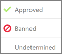

# Office 365 Cloud App Security を使用してアプリのアクセス許可を管理するManage app permissions using Office 365 Cloud App Security

セキュリティ管理の高度な office 365 は、Office 365 のクラウド アプリケーションのセキュリティをされます。Office 365 Advanced Security Management is now Office 365 Cloud App Security.
  
|評価 * *\>******Evaluation** \>**|計画 * *\>******Planning** \>**|配置 * *\>******Deployment** \>**|使用率。****Utilization****|
|:-----|:-----|:-----|:-----|
|[評価を開始します。Start evaluating](office-365-cas-overview.md)   |[計画の開始します。Start planning](get-ready-for-office-365-cas.md)   |[展開を開始します。Start deploying](turn-on-office-365-cas.md)   |コースです!You are here!    [次の手順Next steps](manage-app-permissions-in-ocas.md#nextsteps)   |
   
人のアプリが大好き、多くの場合ダウンロードする人は考慮してくださいアプリケーション特に職場の取得や学校の情報を簡単にすることで時間が短縮されます。ただし、組織にセキュリティ上のリスクの可能性があるいくつかのアプリケーション、に応じてどのような情報にアクセスして、その情報をどのように対処します。[Office 365 のクラウド アプリケーションのセキュリティ](office-365-cas-overview.md)の場合は、グローバル管理者またはセキュリティ管理者、管理できますアプリケーションのアクセス許可、組織の。アプリケーションのユーザーが使用しているを参照してください Office 365 のデータをどのようなアクセス許可アプリケーションがあるとします。People love apps and they download them often, especially apps that people think will save time by making it easier to get at their work or school information. However, some apps could potentially be a security risk to your organization, depending on what information they access and how they handle that information. With [Office 365 Cloud App Security](office-365-cas-overview.md), if you are a global or security administrator, you can manage app permissions for your organization. You can see the apps people are using with Office 365 data, what permissions those apps have, and more. 
  
この資料では、アプリケーションのアクセス許可を管理するための場所、承認、または、アプリケーションのアクセスを禁止する方法、およびアプリケーションのクエリを作成する方法について説明します。This article describes where to go to manage app permissions, how to approve or ban an app, and how to create an app query.
  
## アプリケーションのアクセス許可の管理] ページを検索する方法How to find the Manage app permissions page

> [!NOTE]
> アプリケーションのアクセス許可は、Office 365 のクラウド アプリケーションのセキュリティ関連ポータルで管理されます。次のタスクを実行するには、グローバル ・ アドミニストレーターまたはセキュリティ管理者である必要があります。については多くを参照してください[では、Office 365 のセキュリティ アクセス許可&amp;コンプライアンス センター](permissions-in-the-security-and-compliance-center.md)です。App permissions are managed in the Office 365 Cloud App Security portal. You must be a global administrator or security administrator to perform the following task. To learn more see [Permissions in the Office 365 Security &amp; Compliance Center](permissions-in-the-security-and-compliance-center.md). 
  
1. [https://protection.office.com](https://protection.office.com)し、職場、学校のアカウントを使用して Office 365 にサインインします。(これで、セキュリティには、&amp;コンプライアンス センター)。Go to [https://protection.office.com](https://protection.office.com) and sign in using your work or school account for Office 365. (This takes you to the Security &amp; Compliance Center.) 
    
2. **アラート**を参照して\>**詳細なアラートを管理**します。Go to **Alerts** \> **Manage advanced alerts**.
    
3. をクリックして (またはタップ) **Office 365 のクラウド アプリケーションのセキュリティに移動**します。Click (or tap) **Go to Office 365 Cloud App Security**.
    
    
  
    > [!NOTE]
    > Office 365 のクラウド アプリケーションのセキュリティがまだオンにしない場合は、このページで行うことができます。[Office 365 のクラウド アプリケーションのセキュリティの準備](get-ready-for-office-365-cas.md)を参照してください。If Office 365 Cloud App Security is not turned on yet, you can do that on this page. See [Get ready for Office 365 Cloud App Security](get-ready-for-office-365-cas.md). 
  
4. **調査**を選択して\>**アプリケーションのアクセスを許可**します。Choose **Investigate** \> **App permissions**.
    
    
  
## アプリケーションのアクセス許可の管理] ページに表示されます。What you'll see on the Manage app permissions page

次の表では、アプリケーションのアクセス許可の管理] ページでコントロールと使用可能なオプションについて説明します。The following table describes the controls and options available on the Manage app permissions page.
  
|**アイテム****Item**|**説明****Description**|
|:-----|:-----|
|アプリケーション クエリのバーでの基本のアイコンBasic icon in the app query bar    |詳細表示に切り替えるにはこのオプションを選択します。Select this to switch to the Advanced view.    (**基本的な**表示される場合は、ビューを使用して高度です)(If you see **Basic**, you are using the Advanced view)    |
|アプリケーション クエリ バーの [詳細設定のアイコンAdvanced icon in the app query bar    |基本的なビューに切り替えるにはこのオプションを選択します。Select this to switch to the Basic view.    (**詳細設定**を表示する場合は、ビューを使用して基本。)(If you see **Advanced**, you are using the Basic view.)    |
|開いたり閉じたりするアプリケーションのリスト内のすべての詳細アイコンOpen or close all details icon in the app list    |各アプリケーションについてのより多くのまたはより少ない詳細を表示するには、このアイコンを選択します。Select this icon to view more or fewer details about each app.    |
|アプリケーションの一覧のアイコンをエクスポートします。Export icon in the app list    |アプリケーション、各アプリケーション、アプリケーション、アクセス許可のレベル、アプリケーションの状態に関連付けられているアクセス許可のユーザー数の一覧を含む CSV ファイルにエクスポートするには、このアイコンを選択し、コミュニティは、レベルを使用します。Select this icon to export a CSV file that contains a list of apps, number of users for each app, permissions associated with the app, permissions level, app state, and community use level.    |
|NameName    |これを使用して、アプリケーションの選択の名前を参照してください、名前、説明、発行元、アプリケーションの web サイトおよびアプリケーション ID などの詳細情報を表示するのにはUse this to see the name of an app. Select the name to view more information, such as its description, publisher, app website and app ID.    |
|によって承認されています。Authorized by    |ユーザーの Office 365 アカウントにアクセスするのにアプリケーションが承認されているユーザーの数を表示するのにには、これを使用します。ユーザー アカウントの一覧などの詳細情報を表示するのには番号を選択します。Use this to see how many users have authorized an app to access their Office 365 account. Select the number to view more information, such as a list of user accounts.    |
|アクセス許可のレベルPermissions Level    |これを使用して、アプリケーションがどの程度のアクセスが、Office 365 のデータを参照してください。アクセス許可レベルは、**低****中**、または**高****低**が、アプリケーションにアクセスするだけ、ユーザーのプロファイルと名前を示す可能性がありますを示します。アプリケーション、コミュニティ、および[ログの管理](suspend-or-restore-an-account-in-ocas.md)に関連する活動に与えられるアクセス許可などの詳細情報を表示するレベルを選択します。Use this to see how much access an app has to Office 365 data. Permissions levels indicate **Low**, **Medium**, or **High**, where **Low** might indicate that the app only accesses a user's profile and name. Select the level to view more information, such as permissions granted to the app, community use, and related activity in the [Governance log](suspend-or-restore-an-account-in-ocas.md).    |
|アプリケーションの状態 (**禁止**、**承認済み**、または**不定**)App state ( **Banned**, **Approved**, or **Undetermined**)    |承認済み] または [禁止、としてアプリケーションをマークするのにはこれを使用して、または未決定の状態そのままです。Use this to mark an app as Approved or Banned, or leave it as undetermined.    |
   
## アプリケーションを承認済みとしてマークします。Mark an app as approved

**アプリケーションのアクセス権の管理**] ページで、承認するアプリケーションを見つけて**としてマーク アプリケーションの承認**] アイコンを選択します。On the **Manage app permissions** page, locate the app you want to approve, and choose the **Mark app as approved** icon. 
  

  
アイコンが緑色になると、およびすべての Office 365 ユーザーが承認されているアプリケーションです。The icon turns green, and the app is approved for all your Office 365 users.
  
> [!NOTE]
> アプリを承認済みとしてマークすると、エンド ・ ユーザーへの影響はありません。承認されているアプリケーションを視覚的にマークは、まだ確認されていないアプリケーションからそれらを分離するのに役立ちます。When you mark an app as approved, there is no effect on the end user. Visually marking the apps that are approved helps to separate them from apps that haven't been reviewed yet. 
  
## アプリケーションの使用を禁止します。Ban an app

1. [**アプリケーションのアクセス権の管理**] ページで、アクセスを禁止するアプリケーションを見つけます、**マーク アプリケーションを禁止されている**アイコンを選択します。On the **Manage app permissions** page, locate the app you want to ban, and choose the **Mark app as banned** icon. 
    
    
  
2. 自社のアプリケーションが禁止されているユーザーを通知するかどうかを選択します。Choose whether to let users know that their app has been banned.
    
    (推奨)ユーザーを通知するには、]**この禁止されているアプリケーションへのアクセスを許可したユーザーに通知する**とを追加、またはカスタムの通知メッセージを編集します。(Recommended) To let users know, select **Notify users who granted access to this banned app**, and add or edit a custom notification message.
    
    ユーザーに通知されません、**この禁止されているアプリケーションへのアクセスを許可したユーザーに通知する**をオフにします。To not let users know, clear **Notify users who granted access to this banned app**.
    
    
  
3. **禁止ユーザーのアプリケーション**を選択します。Choose **Ban app**.
    
## アプリケーション クエリを作成します。Create an app query

1. アプリケーション クエリ ・ バーで**詳細設定**を表示する場合] をクリックして (またはタップ) 高度なビューに移動すること。(詳細の表示を使用している基本を表示する場合は、ですので、ビューを保持)。In the app query bar, if you see **Advanced**, click (or tap) it to go to the Advanced view. (If you see Basic, you are using the Advanced view; keep your view as it is.)
    
2. オプションを選択するのにには、**フィルターの選択**] ボックスの一覧を使用します。次の表は、利用可能なフィルター オプションをまとめたものです。Use the **Select a filter** list to choose an option. The following table summarizes your available filter options. 
    
|**このフィルターを使用します。****Use this filter**|**表示内容****To display**|
|:-----|:-----|
|**App****App**   |アプリケーションでは特定の名前Apps with certain names    |
|**アプリケーションの状態****App state**   |状態 (承認済み、禁止、または不定) に基づくアプリケーションApps based on their state (Approved, Banned, or Undetermined)    |
|**コミュニティの使用****Community use**   |コミュニティに基づくアプリケーションを使用して、レベル (Rare、Uncommon、または共通)Apps based on community use levels (Rare, Uncommon, or Common)    |
|**アクセス許可レベル****Permission level**   |特定のアクセス許可レベルに基づいてアプリケーションApps based on certain permission levels    |
|**アクセス許可****Permissions**   |特定のアクセス許可を必要とするアプリケーションApps that require certain permissions    |
|**発行元****Publisher**   |特定の発行元からのアプリApps from certain publishers    |
|**ユーザー****User**   |特定のユーザーが承認されているアプリケーションApps that a certain user authorized    |
   
3. **等しい**か**等しくない**がを選択し、[フィルターの値を指定します。Select **equals** or **does not equal**, and then specify a value for your filter.
    
4. 他のフィルターを追加するのには、プラス記号 (を選択しますTo add more filters, select the plus sign ()、し、手順 2 と 3 を繰り返します。), and then repeat steps 2 and 3.
    
5. フィルターを削除するのには、x (を選択しますTo remove a filter, select the x () フィルター名の横にします。) next to a filter name.
    
フィルターが自動的に適用し、アプリ一覧がそれに応じて更新します。The filters are applied automatically, and the apps list is updated accordingly.
  
## 次の手順Next steps

- [確認し、アラート アクションを実行Review and take action on alerts](review-office-365-cas-alerts.md)
    
- お客様の[Web トラフィックのログ、および Office 365 のクラウド アプリケーションのセキュリティのデータ ソース](web-traffic-logs-and-data-sources-for-ocas.md)を確認します。Review your [Web traffic logs and data sources for Office 365 Cloud App Security](web-traffic-logs-and-data-sources-for-ocas.md)
    
- [Office 365 のクラウド アプリケーションのセキュリティの使用率のアクティビティ](utilization-activities-for-ocas.md)を確認します。Review your [utilization activities for Office 365 Cloud App Security](utilization-activities-for-ocas.md)
    

