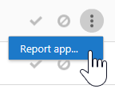

# Office 365 Cloud App Security を使用して OAuth アプリを管理する

|評価 * *\>**|計画 * *\>**|展開 * *\>**|使用率 * * * *|
|:-----|:-----|:-----|:-----|
|[評価の開始](office-365-cas-overview.md)   |[計画を開始する](get-ready-for-office-365-cas.md)   |[展開を開始する](turn-on-office-365-cas.md)   |ここでは、    [次の手順](#next-steps)  |
   
多くのユーザーは、アプリとアプリをよく利用しています。特に、ユーザーが職場または学校の情報を使いやすくすることにより、時間の節約になると考えられるアプリです。 ただし、アプリケーションによっては、ユーザーがアクセスする情報やその情報を処理する方法によっては、組織にとってセキュリティ上のリスクが生じる可能性があります。 [Office 365 Cloud App Security](office-365-cas-overview.md)では、グローバルまたはセキュリティの管理者である場合、組織のために OAuth アプリを管理することができます。 ユーザーが Office 365 データで使用しているアプリ、それらのアプリのアクセス許可などが表示されます。 
  
この記事では、OAuth アプリの管理方法、アプリの承認、禁止、またはレポートの方法、およびアプリのクエリを作成する方法について説明します。
  
## [OAuth アプリの管理] ページの検索方法

> [!NOTE]
> OAuth アプリは、Office 365 Cloud App Security ポータルで管理されます。 次のタスクを実行するには、全体管理者またはセキュリティ管理者である必要があります。 詳細について[は、「Office 365 セキュリティ&amp;コンプライアンスセンターのアクセス許可](permissions-in-the-security-and-compliance-center.md)」を参照してください。 
  
1. Cloud App Security ポータル ([https://portal.cloudappsecurity.com](https://portal.cloudappsecurity.com)) に移動し、サインインします。
  
2. [ **** \> **OAuth アプリ**の調査] を選択します。 ![O365 CAS ポータルで、[調査] を選択します。](media/OCAS-OAuthApps.png) 
  
## [OAuth アプリの管理] ページに表示される内容

次の表では、[OAuth アプリの管理] ページで使用できるコントロールとオプションについて説明します。
  
|**アイテム**|**説明**|
|:-----|:-----|
|アプリクエリバーの [基本] アイコン    |[詳細] ビューに切り替えるには、このオプションを選択します。    ( **Basic**が表示されている場合は、[詳細設定] ビューを使用しています)    |
|アプリクエリバーの [詳細] アイコン    |[基本] ビューに切り替えるには、このチェックボックスをオンにします。    ( **[詳細**] が表示されている場合は、基本ビューを使用しています)。    |
|アプリリストのすべての詳細アイコンを開くか閉じる    |このアイコンを選択すると、各アプリの詳細が表示されます。    |
|アプリリストの [エクスポート] アイコン    |アプリのリスト、各アプリのユーザー数、アプリに関連付けられているアクセス許可、アクセス許可レベル、アプリの状態、コミュニティの使用レベルを含む CSV ファイルをエクスポートするには、このアイコンを選択します。    |
|名前    |これを使用して、アプリの名前を表示します。 名前を選択して、説明、発行元、アプリ web サイト、アプリ ID などの詳細情報を表示します。    |
|承認者    |これを使用して、Office 365 アカウントにアクセスするためにアプリを承認したユーザーの数を確認します。 ユーザーアカウントの一覧などの詳細情報を表示する番号を選択します。    |
|アクセス許可レベル    |これを使用して、アプリが Office 365 データにアクセスするのにかかった時間を確認します。 アクセス許可レベルは、**低**、**中**、**高**のいずれかを示します。**低**は、アプリがユーザーのプロファイルと名前にのみアクセスすることを示す場合があります。 [レベル] を選択して、アプリに付与されたアクセス許可、コミュニティの使用、および[ガバナンスログ](suspend-or-restore-an-account-in-ocas.md)の関連するアクティビティなど、詳細情報を表示します。    |
|前回の承認済み   |これを使用して、OAuth アプリが、組織の Office 365 データにアクセスするために最後に承認された日時を表示します。    |
|アクション   |これを使用して、アプリを承認済みまたは禁止済みとしてマークしたり、OAuth アプリを Microsoft に報告したり、未確定のままにしたりすることができます。    |
   
## アプリを承認済みとしてマークする

[ **OAuth アプリの管理**] ページで、承認するアプリを見つけて、[**アプリを承認済みとしてマーク**する] アイコンを選択します。 
  
![[アプリを承認済みとしてマークする] アイコンを選択する](media/OCAS-MarkOAuthApproved.png)
  
アイコンは緑になり、アプリはすべての Office 365 ユーザーに対して承認されます。
  
> [!NOTE]
> アプリを承認済みとしてマークした場合、エンドユーザーに影響はありません。 承認されたアプリを視覚的にマークすることで、まだレビューされていないアプリから分離することができます。 
  
## アプリの禁止

1. [ **OAuth アプリの管理**] ページで、禁止するアプリを見つけ、[アプリを**禁止済みとしてマーク**] アイコンを選択します。 
  
2. [通知メッセージ] ボックスで、既存のテキストをそのまま使用するか、テキストをカスタマイズします。 アプリが禁止されていることをユーザーに知らせるかどうかを選択します。   
  
3. [**アプリの禁止**] を選択します。

## OAuth アプリを Microsoft に報告する

分析のために OAuth アプリを Microsoft に提出する場合は、そのアプリを報告することができます。

1. [ **OAuth アプリの管理**] ページで、分析のために提出するアプリを見つけます。

2. 上下の省略記号を選択してから、[**レポートアプリ...**] を選択します。  

3. [**このアプリを報告**する] ダイアログボックスで、ドロップダウンリストを使用して問題を示します。 既定では、[**このアプリは悪意**があります] が選択されています。 ただし、利用可能なその他のオプションのいずれかを選択できます。   

4. 勧め[連絡先] を選択した状態のままにして、リストされている電子メールアドレスを確認 (または編集) します。

5. [**送信**] を選択します。 
    
## アプリクエリを作成する

詳細ビューは、次のように使用することをお勧めします。 

アプリケーションクエリバーで、 **[詳細設定**] が表示されている場合は、[基本] ビューを使用しています。 [詳細] ビューに移動するには、[**詳細**] をクリック (またはタップ) します。 

    
1. クエリバーで、 **[フィルターの選択**] の一覧を使用してオプションを選択します。 
    - **アプリ**特定の名前を持つアプリ
    - **アプリの状態**状態に基づくアプリ (承認済み、禁止、または未定義)
    - **コミュニティの使用**コミュニティの使用に基づくアプリのレベル (珍しい、珍しい、または Common)
    - **アクセス許可レベル**特定のアクセス許可レベルに基づくアプリ 
    - **アクセス許可**特定のアクセス許可を必要とするアプリ
    - **Publisher** 特定の発行元のアプリ
    - **ユーザー**特定のユーザーが承認したアプリ
   
2. [ **** 次の**** 値に等しいかどうか] を選択し、フィルターの値を指定します。
    
3. さらにフィルターを追加するには、プラス記号 () をクリックしてから、手順2と3を繰り返します。
    
4. フィルターを削除するには、[x] () を選択します。
    
フィルターは自動的に適用され、それに応じてアプリの一覧が更新されます。
  
## 次の手順

- [通知を確認して処理を実行する](review-office-365-cas-alerts.md)
    
- [Office 365 Cloud App Security の Web トラフィックログとデータソースを](web-traffic-logs-and-data-sources-for-ocas.md)確認する
    
- [Office 365 Cloud App Security の使用率のアクティビティを](utilization-activities-for-ocas.md)確認する
    

