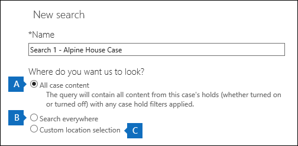

# <a name="manage-ediscovery-cases-in-the-office-365-security-amp-compliance-center"></a><span data-ttu-id="ff4fe-103">Office 365 セキュリティ&amp;コンプライアンスセンターで電子情報開示ケースを管理する</span><span class="sxs-lookup"><span data-stu-id="ff4fe-103">Manage eDiscovery cases in the Office 365 Security &amp; Compliance Center</span></span>

<span data-ttu-id="ff4fe-p101">Office 365 セキュリティ&amp;コンプライアンスセンターで電子情報開示ケースを使用して、組織内で電子情報開示ケースを作成、アクセス、および管理できるユーザーを制御することができます。組織に office 365 E5 サブスクリプションがある場合は、office 365 Advanced eDiscovery を使用して、電子情報開示ケースを使用して検索結果を分析することもできます。</span><span class="sxs-lookup"><span data-stu-id="ff4fe-p101">You can use eDiscovery cases in the Office 365 Security &amp; Compliance Center to control who can create, access, and manage eDiscovery cases in your organization. If your organization has an Office 365 E5 subscription, you can also use eDiscovery cases to analyze search results by using Office 365 Advanced eDiscovery.</span></span>
  
<span data-ttu-id="ff4fe-p102">電子情報開示のケースでは、ケースにメンバーを追加したり、特定のケースメンバーが実行できるアクションの種類を制御したり、訴訟に関連するコンテンツの場所を保持したり、複数のコンテンツ検索を1つのケースに関連付けたりすることができます。また、高度な電子情報開示で、ケースに関連付けられたコンテンツ検索の結果をエクスポートしたり、分析のために検索結果を準備したりすることもできます。電子情報開示ケースは、組織内の特定の法的なケースについて、コンテンツ検索や検索結果にアクセスできるユーザーを制限するのに適した方法です。</span><span class="sxs-lookup"><span data-stu-id="ff4fe-p102">An eDiscovery case allows you to add members to a case, control what types of actions that specific case members can perform, place a hold on content locations relevant to a legal case, and associate multiple Content Searches with a single case. You can also export the results of any Content Search that is associated with a case or prepare search results for analysis in Advanced eDiscovery. eDiscovery cases are a good way to limit who has access to Content Searches and search results for a specific legal case in your organization.</span></span>
  
<span data-ttu-id="ff4fe-109">次のワークフローを使用して、セキュリティ&amp;コンプライアンスセンターと高度な電子情報開示の電子情報開示ケースを設定および使用します。</span><span class="sxs-lookup"><span data-stu-id="ff4fe-109">Use the following workflow to set up and use eDiscovery cases in the Security &amp; Compliance Center and Advanced eDiscovery.</span></span>
  
[<span data-ttu-id="ff4fe-110">手順 1: 潜在的なケースのメンバーに電子情報開示のアクセス許可を割り当てる</span><span class="sxs-lookup"><span data-stu-id="ff4fe-110">Step 1: Assign eDiscovery permissions to potential case members</span></span>](manage-ediscovery-cases.md#step1_1)
  
[<span data-ttu-id="ff4fe-111">手順 2: 新しいケースを作成する</span><span class="sxs-lookup"><span data-stu-id="ff4fe-111">Step 2: Create a new case</span></span>](manage-ediscovery-cases.md#step2_1)
  
[<span data-ttu-id="ff4fe-112">手順 3: ケースにメンバーを追加する</span><span class="sxs-lookup"><span data-stu-id="ff4fe-112">Step 3: Add members to a case</span></span>](manage-ediscovery-cases.md#step2a_1)
  
[<span data-ttu-id="ff4fe-113">手順 4: コンテンツの場所を保持に配置する</span><span class="sxs-lookup"><span data-stu-id="ff4fe-113">Step 4: Place content locations on hold</span></span>](manage-ediscovery-cases.md#step3_1)
  
[<span data-ttu-id="ff4fe-114">手順 5: ケースに関連付けられたコンテンツ検索を作成して実行する</span><span class="sxs-lookup"><span data-stu-id="ff4fe-114">Step 5: Create and run a Content Search associated with a case</span></span>](manage-ediscovery-cases.md#step4_1)
  
[<span data-ttu-id="ff4fe-115">手順 6: ケースに関連付けられたコンテンツ検索の結果をエクスポートする</span><span class="sxs-lookup"><span data-stu-id="ff4fe-115">Step 6: Export the results of a Content Search associated with a case</span></span>](manage-ediscovery-cases.md#step5_1)
  
[<span data-ttu-id="ff4fe-116">手順 7: 高度な電子情報開示の検索結果を準備する</span><span class="sxs-lookup"><span data-stu-id="ff4fe-116">Step 7: Prepare search results for Advanced eDiscovery</span></span>](manage-ediscovery-cases.md#step7_1)
  
[<span data-ttu-id="ff4fe-117">手順 8: Advanced eDiscovery のケースに進む</span><span class="sxs-lookup"><span data-stu-id="ff4fe-117">Step 8: Go to the case in Advanced eDiscovery</span></span>](manage-ediscovery-cases.md#gotoAeD_1)
  
[<span data-ttu-id="ff4fe-118">オプション手順 9: ケースを閉じる</span><span class="sxs-lookup"><span data-stu-id="ff4fe-118">(Optional) Step 9: Close a case</span></span>](manage-ediscovery-cases.md#closecase_1)
  
[<span data-ttu-id="ff4fe-119">オプション手順 10: クローズしたケースを再度開く</span><span class="sxs-lookup"><span data-stu-id="ff4fe-119">(Optional) Step 10: Re-open a closed case</span></span>](manage-ediscovery-cases.md#reopencase_1)
  
[<span data-ttu-id="ff4fe-120">詳細情報</span><span class="sxs-lookup"><span data-stu-id="ff4fe-120">More information</span></span>](manage-ediscovery-cases.md#moreinfo_1)
  
## <a name="step-1-assign-ediscovery-permissions-to-potential-case-members"></a><span data-ttu-id="ff4fe-121">手順 1: 潜在的なケースのメンバーに電子情報開示のアクセス許可を割り当てる</span><span class="sxs-lookup"><span data-stu-id="ff4fe-121">Step 1: Assign eDiscovery permissions to potential case members</span></span>
<span data-ttu-id="ff4fe-122"><a name="step1_1"> </a></span><span class="sxs-lookup"><span data-stu-id="ff4fe-122"></span></span>

<span data-ttu-id="ff4fe-p103">最初の手順として、適切な電子情報開示関連のアクセス許可をユーザーに割り当てて、手順2で電子情報開示ケースに追加できるようにします。電子情報開示のアクセス許可を割り当てるには、Office 365 セキュリティ&amp;コンプライアンスセンターで、Organization management 役割グループのメンバーであるか、または役割管理役割が割り当てられている必要があります。次の一覧は、セキュリティ&amp;コンプライアンスセンターの電子情報開示関連の役割グループを示しています。</span><span class="sxs-lookup"><span data-stu-id="ff4fe-p103">The first step is to assign the appropriate eDiscovery-related permissions to people so you can add them to an eDiscovery case in Step 2. You have to be a member of the Organization Management role group (or be assigned the Role Management role) in the Office 365 Security &amp; Compliance Center to assign eDiscovery permissions. The following list describes the eDiscovery-related role groups in the Security &amp; Compliance Center.</span></span>
  
- <span data-ttu-id="ff4fe-p104">**レビュー担当者**この役割グループには、電子情報開示関連のアクセス許可が最も制限されています。このグループのメンバーは、自分がメンバーになっているセキュリティ&amp;コンプライアンスセンターの [**電子情報開示**] ページでのみ、ケースのリストを表示して開くことができます。ケースを作成したり、ケースにメンバーを追加したり、ホールドを作成したり、検索を作成したり、検索結果をエクスポートしたり、高度な電子情報開示の結果を準備したりすることはできません。ただし、メンバーは Advanced 電子情報開示のケースにアクセスして、分析タスクを実行することができます。</span><span class="sxs-lookup"><span data-stu-id="ff4fe-p104">**Reviewer**This role group has the most restrictive eDiscovery-related permissions. Members of this group can only see and open the list of the cases on the **eDiscovery** page in the Security &amp; Compliance Center that they are members of. They can't create cases, add members to a case, create holds, create searches, export search results, or prepare results for Advanced eDiscovery. However, members can access cases in Advanced eDiscovery to perform analysis tasks.</span></span> 
    
- <span data-ttu-id="ff4fe-p105">**電子情報開示マネージャー**この役割グループのメンバーは、電子情報開示ケースの作成と管理を行うことができます。ユーザーは、メンバーを追加および削除したり、コンテンツの場所を保持状態に配置したり、ケースに関連付けられたコンテンツ検索を作成および編集したり、コンテンツ検索の結果をエクスポートしたり、高度な電子情報開示で分析のための検索結果を準備したりできます。この役割グループには、2つのサブグループがあります。これらのサブグループの違いは、スコープに基づいています。</span><span class="sxs-lookup"><span data-stu-id="ff4fe-p105">**eDiscovery Manager**Members of this role group can create and manage eDiscovery cases. They can add and remove members, place content locations on hold, create and edit Content Searches associated with a case, export the results of a Content Search, and prepare search results for analysis in Advanced eDiscovery. There are two sub-groups in this role group. The difference between these subgroups is based on scope.</span></span>
    
  - <span data-ttu-id="ff4fe-p106">**電子情報開示マネージャー**が作成またはメンバーとなっている電子情報開示ケースを表示および管理できます。別の電子情報開示マネージャーが作成したケースのメンバーとして2番目の電子情報開示マネージャーを追加しなかった場合、2番目の電子情報開示マネージャーは、 &amp;セキュリティコンプライアンスセンターの [**電子情報開示**] ページでケースを表示または開くことができません。電子情報開示マネージャーは、高度な電子情報開示のケースにアクセスして分析タスクを実行することもできます。</span><span class="sxs-lookup"><span data-stu-id="ff4fe-p106">**eDiscovery Manager**Can view and manage the eDiscovery cases they create or are a member of. If another eDiscovery Manager creates a case but doesn't add a second eDiscovery Manager as a member of that case, the second eDiscovery Manager won't be able to view or open the case on the **eDiscovery** page in the Security &amp; Compliance Center. eDiscovery Managers can also access their cases in Advanced eDiscovery to perform analysis tasks.</span></span> 
    
  - <span data-ttu-id="ff4fe-p107">**電子情報開示管理者**電子情報開示マネージャーが実行できるすべてのケース管理タスクを実行できます。また、電子情報開示管理者は次のことを行うことができます。</span><span class="sxs-lookup"><span data-stu-id="ff4fe-p107">**eDiscovery Administrator**Can perform all case management tasks that an eDiscovery Manager can do. Additionally, an eDiscovery Administrator can:</span></span>
    
  - <span data-ttu-id="ff4fe-139">**[電子情報開示]** ページに一覧表示されたすべてのケースの表示。</span><span class="sxs-lookup"><span data-stu-id="ff4fe-139">View all cases that are listed on the **eDiscovery** page.</span></span> 
    
  - <span data-ttu-id="ff4fe-140">組織内の電子情報開示ケースをケースのメンバーとして追加した後で、そのケースを管理します。</span><span class="sxs-lookup"><span data-stu-id="ff4fe-140">Manage any eDiscovery case in the organization after they add themself as a member of the case.</span></span>
    
  - <span data-ttu-id="ff4fe-p108">高度な電子情報開示での管理タスクを実行します。たとえば、分析のためのケースデータの処理、ケース設定の構成、高度な電子情報開示からのデータのエクスポートなどを行います。これは、セキュリティ&amp;コンプライアンスセンターの電子情報開示管理者であるユーザーが、高度な電子情報開示の管理者として自動的に追加されるためです。</span><span class="sxs-lookup"><span data-stu-id="ff4fe-p108">Perform administrative tasks in Advanced eDiscovery, such as processing case data for analysis, configuring case settings, and exporting data from Advanced eDiscovery. This is because a person who is an eDiscovery Administrator in the Security &amp; Compliance Center is automatically added as an administrator in Advanced eDiscovery.</span></span>
    
    <span data-ttu-id="ff4fe-143">組織に電子情報開示管理者が必要な理由については、「[More information](manage-ediscovery-cases.md#moreinfo_1)」セクションをご覧ください。</span><span class="sxs-lookup"><span data-stu-id="ff4fe-143">See the [More information](manage-ediscovery-cases.md#moreinfo_1) section for reasons why you may want an eDiscovery Administrator in your organization.</span></span> 
    
> [!IMPORTANT]
> <span data-ttu-id="ff4fe-144">ユーザーがこれらの電子情報開示関連の役割グループのいずれかのメンバーではない場合、またはレビュー担当者の役割が割り当てられている役割グループのメンバーではない場合は、電子情報開示ケースのメンバーとして追加することはできません。</span><span class="sxs-lookup"><span data-stu-id="ff4fe-144">If a person isn't a member of one of these eDiscovery-related role groups, or isn't a member of a role group that's assigned the Reviewer role, you can't add them as a member of an eDiscovery case.</span></span> 
  
 <span data-ttu-id="ff4fe-145">**電子情報開示のアクセス許可を割り当てるには、次の操作を実行します。**</span><span class="sxs-lookup"><span data-stu-id="ff4fe-145">**To assign eDiscovery permissions:**</span></span>
  
1. <span data-ttu-id="ff4fe-146">[https://protection.office.com](https://protection.office.com) に移動します。</span><span class="sxs-lookup"><span data-stu-id="ff4fe-146">Go to [https://protection.office.com](https://protection.office.com).</span></span>
    
2. <span data-ttu-id="ff4fe-147">職場または学校のアカウントを使用して、Office 365 にサインインします。</span><span class="sxs-lookup"><span data-stu-id="ff4fe-147">Sign in to Office 365 using your work or school account.</span></span>
    
3. <span data-ttu-id="ff4fe-148">セキュリティ&amp; /コンプライアンスセンターで、[**アクセス許可**] をクリックし、割り当てる電子情報開示のアクセス許可に基づいて次のいずれかを実行します。</span><span class="sxs-lookup"><span data-stu-id="ff4fe-148">In the Security &amp; Compliance Center, click **Permissions**, and then do one of the following based on the eDiscovery permissions that you want to assign.</span></span>
    
  - <span data-ttu-id="ff4fe-p109">レビュー担当者のアクセス許可を割り当てるには、**レビュー担当者**の役割グループを選択し、[**メンバー** ] の横にある [**編集**] をクリックします。[**メンバーの選択**]  \*\*\*\* し、[追加] アイコンをクリックします。レビュー担当者の役割グループに追加するユーザーを選択し、[**追加**] をクリックします。</span><span class="sxs-lookup"><span data-stu-id="ff4fe-p109">To assign Reviewer permissions, select the **Reviewer** role group, and then next to **Members** click **Edit**. Click **Choose members**, click  **Add** select the user that you want to add to the Reviewer role group, and then click **Add**.</span></span>
    
  - <span data-ttu-id="ff4fe-p110">電子情報開示管理者のアクセス許可を割り当てるには、**電子情報開示**マネージャーの役割グループを選択し、[**電子情報開示マネージャー**] の横にある [**編集**] をクリックします。[**電子情報開示マネージャー**の![選択]](media/ITPro-EAC-AddIcon.gif)をクリックし、[追加] アイコンをクリックします。電子情報開示管理者として追加するユーザーを選択し、[**追加**] をクリックします。</span><span class="sxs-lookup"><span data-stu-id="ff4fe-p110">To assign eDiscovery Manager permissions, select the **eDiscovery Manager** role group, and then next to **eDiscovery Manager**, click **Edit**. Click **Choose eDiscovery Manager**, click  \*\* Add \*\*, select the user that you want to add as an eDiscovery Manager, and then click **Add**.</span></span>
    
  - <span data-ttu-id="ff4fe-p111">電子情報開示管理者のアクセス許可を割り当てるには、**電子情報開示マネージャー**の役割グループを選択し、[**電子情報開示管理者**] の横にある [**編集**] をクリックします。[**電子情報開示管理者**の選択](media/ITPro-EAC-AddIcon.gif) ] をクリックし、[追加] アイコン [**追加**] をクリック![して、電子情報開示管理者として追加するユーザーを選択し、[**追加**] をクリックします。</span><span class="sxs-lookup"><span data-stu-id="ff4fe-p111">To assign eDiscovery Administrator permissions, select the **eDiscovery Manager** role group, and then next to **eDiscovery Administrator**, click **Edit**. Click **Choose eDiscovery Administrator**, click  **Add**, select the user that you want to add as an eDiscovery Administrator, and then click **Add**.</span></span>
    
4. <span data-ttu-id="ff4fe-155">すべてのユーザーを追加したら、[**完了**]、[**保存**] の順にクリックして役割グループへの変更を保存し、[**閉じる**] をクリックします。</span><span class="sxs-lookup"><span data-stu-id="ff4fe-155">After you've added all the users, click **Done**, click **Save** to save the changes to the role group, and then click **Close**.</span></span>
    

  
## <a name="step-2-create-a-new-case"></a><span data-ttu-id="ff4fe-156">手順 2: 新しいケースを作成する</span><span class="sxs-lookup"><span data-stu-id="ff4fe-156">Step 2: Create a new case</span></span>
<span data-ttu-id="ff4fe-157"><a name="step2_1"> </a></span><span class="sxs-lookup"><span data-stu-id="ff4fe-157"></span></span>

<span data-ttu-id="ff4fe-p112">次の手順では、新しい電子情報開示ケースを作成します。電子情報開示のケースを作成するには、電子情報開示マネージャーの役割グループのメンバーである必要があります。前述したように、セキュリティ&amp; /コンプライアンスセンターで新しいケースを作成した後、組織が Office 365 E5 サブスクリプションを持っている場合は、上級電子情報開示でその同じケースにアクセスできます (およびその他のケースメンバー)。</span><span class="sxs-lookup"><span data-stu-id="ff4fe-p112">The next step is to create a new eDiscovery case. You must be a member of the eDiscovery Managers role group to create eDiscovery cases. As previously explained, after you create a new case in the Security &amp; Compliance Center, you (and other case members) will be able to access that same case in Advanced eDiscovery if you're organization has an Office 365 E5 subscription.</span></span>
  
1. <span data-ttu-id="ff4fe-161">[https://protection.office.com](https://protection.office.com) に移動します。</span><span class="sxs-lookup"><span data-stu-id="ff4fe-161">Go to [https://protection.office.com](https://protection.office.com).</span></span>
    
2. <span data-ttu-id="ff4fe-162">職場または学校のアカウントを使用して、Office 365 にサインインします。</span><span class="sxs-lookup"><span data-stu-id="ff4fe-162">Sign in to Office 365 using your work or school account.</span></span>
    
3. <span data-ttu-id="ff4fe-163">&amp;セキュリティ/コンプライアンスセンターで、[**検索&amp;調査** \>用**電子情報開示**] し、[追加] アイコンをクリックして**ケースを作成**します。</span><span class="sxs-lookup"><span data-stu-id="ff4fe-163">In the Security &amp; Compliance Center, click **Search &amp; investigation** \> **eDiscovery**, and then click  **Create a case**.</span></span>
    
4. <span data-ttu-id="ff4fe-p113">[**新しいケース**] ページで、ケースに名前を付け、オプションの説明を入力して、[**保存**] をクリックします。ケース名は、組織内で一意である必要があることに注意してください。</span><span class="sxs-lookup"><span data-stu-id="ff4fe-p113">On the **New Case** page, give the case a name, type an optional description, and then click **Save**. Note that the case name must be unique in your organization.</span></span>
    
    ![[新しいケース] ページ](media/538f66b8-eb6e-4c4c-83d8-7154fd85883a.png)
  
    <span data-ttu-id="ff4fe-p114">新しいケースは、[**電子情報開示**] ページのケースの一覧に表示されます。ケース名の上にカーソルを置くと、ケースの状態 (**アクティブ**または**クローズ**)、ケースの説明 (前の手順で作成したもの)、ケースの説明 (前の手順で作成したもの)、ケースが最後に変更された日時など、ケースに関する情報が表示されることに注意してください。誰が変更したか。</span><span class="sxs-lookup"><span data-stu-id="ff4fe-p114">The new case is displayed in the list of cases on the **eDiscovery** page. Note that you can hover the cursor over a case name to display information about the case, including the status of the case ( **Active** or **Closed**), the description of the case (that was created in the previous step), and when the case was changed last and who changed it.</span></span>
    
    > [!TIP]
    > <span data-ttu-id="ff4fe-p115">新しいケースを作成した後は、いつでも名前を変更できます。[**電子情報開示**] ページで、ケースの名前をクリックするだけです。[**このケースの管理**] ページで、[**名前**] の下のボックスに表示されている名前を変更して、変更を保存します。</span><span class="sxs-lookup"><span data-stu-id="ff4fe-p115">After you create a new case, you can rename it anytime. Just click the name of the case on the **eDiscovery** page. On the **Manage this case** flyout page, change the name displayed in the box under **Name**, and then save the change.</span></span> 
  
## <a name="step-3-add-members-to-a-case"></a><span data-ttu-id="ff4fe-172">手順 3: ケースにメンバーを追加する</span><span class="sxs-lookup"><span data-stu-id="ff4fe-172">Step 3: Add members to a case</span></span>
<span data-ttu-id="ff4fe-173"><a name="step2a_1"> </a></span><span class="sxs-lookup"><span data-stu-id="ff4fe-173"></span></span>

<span data-ttu-id="ff4fe-p116">新しいケースを作成したら、次の手順として、ケースにメンバーを追加します。前述のとおり、レビューアーまたは電子情報開示マネージャーの役割グループのメンバーであるユーザーのみをケースのメンバーとして追加できます。ケースを作成した電子情報開示マネージャーは、自動的にメンバーとして追加されることに注意してください。</span><span class="sxs-lookup"><span data-stu-id="ff4fe-p116">After you create a new case, the next step is to add members to the case. As previous explained, only users that are members of the Reviewer or eDiscovery Manager role groups can be added as a member of the case. Note that the eDiscovery Manager who created the case is automatically added as a member.</span></span>
  
1. <span data-ttu-id="ff4fe-177">セキュリティ&amp;コンプライアンス センターで、**[検索&amp;調査]** \> **[電子情報開示]** の順にクリックし、組織内のケースの一覧を表示します。</span><span class="sxs-lookup"><span data-stu-id="ff4fe-177">In the Security &amp; Compliance Center, click **Search &amp; investigation** \> **eDiscovery** to display the list of cases in your organization.</span></span> 
    
2. <span data-ttu-id="ff4fe-178">メンバーを追加するケースの名前をクリックします。</span><span class="sxs-lookup"><span data-stu-id="ff4fe-178">Click the name of the case that you want to add members to.</span></span>
    
    <span data-ttu-id="ff4fe-179">[**このケースの管理**] ポップアップページが表示されます。</span><span class="sxs-lookup"><span data-stu-id="ff4fe-179">The **Manage this case** flyout page is displayed.</span></span> 
    
    ![ケース名をクリックして [このケースの管理] ページを表示します。](media/2364dc08-a3dc-4724-acf4-7a68c8588e6f.png)
  
3. <span data-ttu-id="ff4fe-181">[**メンバーの管理**]  \*\*\*\* 追加] アイコンをクリックして、ケースにメンバーを追加します。</span><span class="sxs-lookup"><span data-stu-id="ff4fe-181">Under **Manage members**, click  **Add** to add members to the case.</span></span> 
    
4. <span data-ttu-id="ff4fe-182">ケースのメンバーとして追加できるユーザーの一覧で、ケースに追加するユーザーの名前の横にあるチェックボックスをオンにします。</span><span class="sxs-lookup"><span data-stu-id="ff4fe-182">In the list of people who can be added as a member of the case, click the checkbox next to the name of the people you want to add to the case.</span></span>
    
    > [!TIP]
    > <span data-ttu-id="ff4fe-183">メンバーとして追加できるユーザーのリストが大きい場合は、**検索**ボックスを使用して、リスト内の特定の人物を検索します。</span><span class="sxs-lookup"><span data-stu-id="ff4fe-183">If you have a large list of people who can added as members, use the **Search** box to search for a specific person in the list.</span></span> 
  
5. <span data-ttu-id="ff4fe-184">グループのメンバーとして追加するユーザーを選択したら、[**追加**] をクリックします。</span><span class="sxs-lookup"><span data-stu-id="ff4fe-184">After you've selected the people to add as members of the group, click **Add**.</span></span>
    
    <span data-ttu-id="ff4fe-185">**このケースを管理**するには、[**保存**] をクリックして、ケースメンバーの新しいリストを保存します。</span><span class="sxs-lookup"><span data-stu-id="ff4fe-185">In **Manage this case**, click **Save** to save the new list of case members.</span></span> 
    
6. <span data-ttu-id="ff4fe-186">[**保存**] をクリックして、ケースメンバーの新しいリストを保存します。</span><span class="sxs-lookup"><span data-stu-id="ff4fe-186">Click **Save** to save the new list of case members.</span></span> 
  
## <a name="step-4-place-content-locations-on-hold"></a><span data-ttu-id="ff4fe-187">手順 4: コンテンツの場所を保持に配置する</span><span class="sxs-lookup"><span data-stu-id="ff4fe-187">Step 4: Place content locations on hold</span></span>
<span data-ttu-id="ff4fe-188"><a name="step3_1"> </a></span><span class="sxs-lookup"><span data-stu-id="ff4fe-188"></span></span>

<span data-ttu-id="ff4fe-p117">電子情報開示ケースを使用して、ケースに関連する可能性があるコンテンツを保持する保持を作成できます。この場合、保管担当者のメールボックスと OneDrive for business サイトに保持を配置することができます。また、Office 365 グループのグループメールボックス、SharePoint サイト、OneDrive for business サイトにホールドを配置することもできます。同様に、Microsoft Teams に関連付けられているメールボックスおよびサイトにホールドを配置することができます。コンテンツの場所を保持するように設定すると、コンテンツの場所から保留を削除するか、保留リストを削除するまで、コンテンツは保持されます。</span><span class="sxs-lookup"><span data-stu-id="ff4fe-p117">You can use an eDiscovery case to create holds to preserve content that might be relevant to the case. You can place a hold on the mailboxes and OneDrive for Business sites of people who are custodians in the case. You can also place a hold on the group mailbox, SharePoint site, and OneDrive for Business site for an Office 365 Group. Similarly, you can place a hold on the mailbox and site that are associated with Microsoft Teams. When you place content locations on hold, content is held until you remove the hold from the content location or until you delete the hold.</span></span>
  
<span data-ttu-id="ff4fe-194">保留リストを作成する場合は、次のオプションを使用して、指定されたコンテンツの場所に保持されているコンテンツの範囲を設定します。</span><span class="sxs-lookup"><span data-stu-id="ff4fe-194">When you create a hold, you have the following options to scope the content that is held in the specified content locations:</span></span>
  
- <span data-ttu-id="ff4fe-p118">すべてのコンテンツを保留にする無限ホールドを作成します。または、検索クエリに一致するコンテンツのみが保持されるように、クエリベースの保持を作成することもできます。</span><span class="sxs-lookup"><span data-stu-id="ff4fe-p118">You create an infinite hold where all content is placed on hold. Alternatively, you can create a query-based hold where only content that matches a search query is placed on hold.</span></span>
    
- <span data-ttu-id="ff4fe-p119">日付範囲を指定して、その期間内に送信、受信、または作成されたコンテンツのみを保持することができます。または、送信、受信、または作成の日時に関係なく、すべてのコンテンツを保持できます。</span><span class="sxs-lookup"><span data-stu-id="ff4fe-p119">You can specify a date range to hold only the content that was sent, received, or created within that date range. Alternatively, you can hold all content regardless of when it was sent, received, or created.</span></span>
    
> [!NOTE]
> <span data-ttu-id="ff4fe-199">組織内のすべての電子情報開示ケースについて、最大で1万の保持ポリシーを設定できます。</span><span class="sxs-lookup"><span data-stu-id="ff4fe-199">You can have a maximum of 10,000 hold policies across all eDiscovery cases in your organization.</span></span> 
  
<span data-ttu-id="ff4fe-200">電子情報開示ケースのホールドを作成するには、次のようにします。</span><span class="sxs-lookup"><span data-stu-id="ff4fe-200">To create a hold for an eDiscovery case:</span></span>
  
1. <span data-ttu-id="ff4fe-201">セキュリティ&amp;コンプライアンス センターで、**[検索&amp;調査]** \> **[電子情報開示]** の順にクリックし、組織内のケースの一覧を表示します。</span><span class="sxs-lookup"><span data-stu-id="ff4fe-201">In the Security &amp; Compliance Center, click **Search &amp; investigation** \> **eDiscovery** to display the list of cases in your organization.</span></span> 
    
2. <span data-ttu-id="ff4fe-202">ホールドを作成するケースの横にある [**開く**] をクリックします。</span><span class="sxs-lookup"><span data-stu-id="ff4fe-202">Click **Open** next to the case that you want to create the holds in.</span></span> 
    
3. <span data-ttu-id="ff4fe-203">ケースの**ホーム**ページで、[**保留**] をクリックします。</span><span class="sxs-lookup"><span data-stu-id="ff4fe-203">On the **Home** page for the case, click **Hold**.</span></span>
    
    ![[ホールド] をクリックして、[ケース保持] ページを表示します。](media/25c0300a-bd33-4443-a121-d595b1a3e00f.png)
  
4. <span data-ttu-id="ff4fe-205">[**保留**] ページで、[**新規**] アイコンをクリックします。</span><span class="sxs-lookup"><span data-stu-id="ff4fe-205">On the **Hold** page, click **New**.</span></span>
    
5. <span data-ttu-id="ff4fe-p120">**[新しいホールドを作成する]** ページで、ホールドに名前を付けます。ホールドの名前は組織内で一意である必要があります。 </span><span class="sxs-lookup"><span data-stu-id="ff4fe-p120">On the **Create a new hold** page, give the hold a name. The name of the hold must be unique in your organization.</span></span> 
    
6. <span data-ttu-id="ff4fe-p121">保持するコンテンツの場所を選択します。メールボックス、サイト、パブリックフォルダーを保持に配置することができます。</span><span class="sxs-lookup"><span data-stu-id="ff4fe-p121">Choose the content locations that you want to place on hold. You can place mailboxes, sites, and public folders on hold.</span></span>
    
    
  
1. <span data-ttu-id="ff4fe-p122">**メールボックス**[追加] アイコン](media/ITPro-EAC-AddIcon.gif)をクリックして、保持するメールボックスを指定します。 \*\*\*\* to specify mailboxes to place on hold. Use the search box to find user mailboxes and distribution groups (to place a hold on the mailboxes of group members) to place on hold. You can also place a hold on the associated mailbox for an Office 365 Group or a Microsoft Team.</span></span> 
    
    > [!NOTE]
    > <span data-ttu-id="ff4fe-p123">[追加] \*\*\*\*をクリックして、保留にするメールボックスを指定すると、表示されているメールボックスピッカーが空になります。これは、パフォーマンスを向上させるための仕様です。このリストにユーザーを追加するには、検索ボックスに名前 (最低3文字) を入力し、 \*\*\*\*![[検索]](media/5f6f9463-50e9-460b-8738-b67e759c2efc.gif)アイコンをクリックします。</span><span class="sxs-lookup"><span data-stu-id="ff4fe-p123">When you click **Add** to specify mailboxes to place on hold, the mailbox picker that's displayed is empty. This is by design to enhance performance. To add people to this list, type a name (a minimum of 3 characters) in the search box and click **Search**.</span></span> 
  
2. <span data-ttu-id="ff4fe-p124">**サイト**保持する SharePoint および](media/ITPro-EAC-AddIcon.gif) OneDrive for business サイトを指定するには、[追加] アイコンをクリックします。 \*\*\*\* to specify SharePoint and OneDrive for Business sites to place on hold. Type the URL for each site that you want to place on hold. You can also add the URL for the SharePoint site for an Office 365 Group or a Microsoft Team.</span></span> 
    
    <span data-ttu-id="ff4fe-220">Office 365 グループと Microsoft Teams を保留にする方法に関するヒントについては、「[詳細情報](https://support.office.com/article/edea80d6-20a7-40fb-b8c4-5e8c8395f6da.aspx#moreinfo_1)」セクションを参照してください。</span><span class="sxs-lookup"><span data-stu-id="ff4fe-220">See the [More information](https://support.office.com/article/edea80d6-20a7-40fb-b8c4-5e8c8395f6da.aspx#moreinfo_1) section for tips on putting Office 365 Groups and Microsoft Teams on hold.</span></span> 
    
    > [!NOTE]
    > <span data-ttu-id="ff4fe-p125">ユーザープリンシパル名 (UPN) が変更された場合、そのユーザーの OneDrive アカウントの URL も新しい upn を組み込むように変更されます。このような場合は、ユーザーの新しい OneDrive URL を追加して古いバージョンを削除することによって、保留リストを変更する必要があります。</span><span class="sxs-lookup"><span data-stu-id="ff4fe-p125">In the rare case that a person's user principal name (UPN) is changed, the URL for their OneDrive account will also be changed to incorporate the new UPN. If this happens, you'll have to modify the hold by adding the user's new OneDrive URL and removing the old one.</span></span> 
  
3. <span data-ttu-id="ff4fe-p126">**パブリックフォルダー**Exchange Online 組織内のすべてのパブリックフォルダーを保持するには、[**すべてのパブリックフォルダーを保持**する] をクリックします。特定のパブリックフォルダーを保持の対象にすることはできないことに注意してください。パブリックフォルダーを保持しない場合は、[**パブリックフォルダーを保持しない**] オプションを選択したままにします。</span><span class="sxs-lookup"><span data-stu-id="ff4fe-p126">**Public folders** Click **Hold all public folders** to put all of the public folders in your Exchange Online organization on hold. Note that you can't choose specific public folders to put on hold. Leave the **Don't hold any public folders** option selected if you don't want to put a hold on public folders.</span></span> 
    
7. <span data-ttu-id="ff4fe-226">保留リストにコンテンツの場所を追加し終わったら、[**次へ**] をクリックします。</span><span class="sxs-lookup"><span data-stu-id="ff4fe-226">When you're done adding content locations to the hold, click **Next**.</span></span>
    
8. <span data-ttu-id="ff4fe-p127">条件を使用してクエリベースの保持を作成するには、次の手順を実行します。それ以外の場合は、[**完了**] をクリックするだけですべてのコンテンツを保持できます。</span><span class="sxs-lookup"><span data-stu-id="ff4fe-p127">To create a query-based hold with conditions, complete the following. Otherwise, just click **Finish** to hold all content.</span></span> 
    
    
  
    <span data-ttu-id="ff4fe-230">検索クエリの作成と条件の使用の詳細については、「[コンテンツ検索のキーワードクエリと検索条件](keyword-queries-and-search-conditions.md)」を参照してください。</span><span class="sxs-lookup"><span data-stu-id="ff4fe-230">For more information about creating a search query and using conditions, see [Keyword queries and search conditions for Content Search](keyword-queries-and-search-conditions.md).</span></span>
    
1. <span data-ttu-id="ff4fe-p128">検索条件に一致するコンテンツのみが保持されるように、[**何を検索しますか?**] の下のボックスに検索クエリを入力します。ファイル名などの、キーワード、メッセージプロパティ、またはドキュメントプロパティを指定できます。ブール演算子 ( **AND**、 **or**、 **NOT**など) を使用するより複雑なクエリを使用することもできます。[キーワード] ボックスを空白のままにすると、指定したコンテンツの場所にあるすべてのコンテンツが保持されます。</span><span class="sxs-lookup"><span data-stu-id="ff4fe-p128">In the box under **What do you want us to look for?**, type a search query in the box so that only the content that meets the search criteria is placed on hold. You can specify keywords, message properties, or document properties, such as file names. You can also use more complex queries that use a Boolean operator, such as **AND**, **OR**, or **NOT**. If you leave the keyword box empty, then all content located in the specified content locations will be placed on hold.</span></span> 
    
2. <span data-ttu-id="ff4fe-p129">[**条件**] で [**条件の追加**] をクリックして、1つまたは複数の条件を追加して、検索クエリを絞り込むことができます。各条件は、保留を作成するときに作成および実行される kql 検索クエリに句を追加します。たとえば、日付範囲を指定して、指定した期間内に作成された電子メールまたはサイトのドキュメントが保留リストに配置されるようにすることができます。**and**演算子を使って、条件が論理的にキーワードクエリ (キーワード box で指定) に接続されています。これは、アイテムがキーワードクエリと条件の両方に一致する必要があることを意味します。</span><span class="sxs-lookup"><span data-stu-id="ff4fe-p129">Under **Conditions**, click **Add condition** to add one or more conditions to narrow the search query for the hold. Each condition adds a clause to the KQL search query that is created and run when you create the hold. For example you can specify a date range so that email or site documents that were created within the date ranged are placed on hold. A condition is logically connected to the keyword query (specified in the keyword box) by the **AND** operator. That means that items have to satisfy both the keyword query and the condition to be placed on hold.</span></span> 
    
9. <span data-ttu-id="ff4fe-240">クエリベースの保持を構成した後、[**完了**] をクリックして保留リストを作成します。</span><span class="sxs-lookup"><span data-stu-id="ff4fe-240">After configuring a query-based hold, click **Finish** to create the hold.</span></span> 
  
### <a name="hold-statistics"></a><span data-ttu-id="ff4fe-241">保持の統計情報</span><span class="sxs-lookup"><span data-stu-id="ff4fe-241">Hold statistics</span></span>

<span data-ttu-id="ff4fe-p130">しばらくすると、選択した保留リストの [**保留**] ページの [詳細] ウィンドウに、新しい保留リストに関する情報が表示されます。この情報には、保留になっているアイテムの合計数とサイズ、保持統計情報が最後に計算されたときなど、保留中のコンテンツに関するメールボックスとサイトの数および統計情報が含まれます。これらの保持統計情報は、電子情報開示ケースに関連するコンテンツの量を特定するのに役立ちます。</span><span class="sxs-lookup"><span data-stu-id="ff4fe-p130">After a while, information about the new hold is displayed in the details pane on the **Holds** page for the selected hold. This information includes the number of mailboxes and sites on hold and statistics about the content that was placed on hold, such as the total number and size of items placed on hold and the last time the hold statistics were calculated. These hold statistics help you identify how much content that's related to the eDiscovery case is being held.</span></span> 
  

  
<span data-ttu-id="ff4fe-246">保持の統計情報については、次の点に注意してください。</span><span class="sxs-lookup"><span data-stu-id="ff4fe-246">Keep the following things in mind about hold statistics:</span></span>
  
- <span data-ttu-id="ff4fe-p131">保留中のアイテムの合計数は、保留になっているすべてのコンテンツソースからのアイテムの数を示します。クエリベースの保持を作成した場合、この統計情報はクエリに一致するアイテムの数を示します。</span><span class="sxs-lookup"><span data-stu-id="ff4fe-p131">The total number of items on hold indicates the number of items from all content sources that are placed on hold. If you've created a query-based hold, this statistic indicates the number of items that match the query.</span></span>
    
- <span data-ttu-id="ff4fe-p132">保留中のアイテム数には、コンテンツの場所にあるインデックスがないアイテムも含まれます。クエリベースの保持を作成すると、コンテンツの場所にあるすべてのインデックスのないアイテムが保持されます。これには、クエリベースの保持の検索条件に一致しないインデックスのないアイテムと、日付範囲の範囲外にある可能性のあるインデックスを持たないアイテムが含まれます。これは、検索クエリと一致しない、または日付範囲の条件によって除外されたインデックスのないアイテムが検索結果に含まれていない場合に、コンテンツ検索を実行したときの動作とは異なります。インデックスのないアイテムの詳細については、「 [Office 365 のコンテンツ検索でのインデックスのないアイテム](partially-indexed-items-in-content-search.md)」を参照してください。</span><span class="sxs-lookup"><span data-stu-id="ff4fe-p132">The number of items on hold also includes unindexed items found in the content locations. Note that if you create a query-based hold, all unindexed items in the content locations are placed on hold. This includes unindexed items that don't match the search criteria of a query-based hold and unindexed items that might fall outside of a date range condition. This is different than what happens when you run a Content Search, in which unindexed items that don't match the search query or are excluded by a date range condition aren't included in the search results. For more information about unindexed items, see [Unindexed items in Content Search in Office 365](partially-indexed-items-in-content-search.md).</span></span>
    
- <span data-ttu-id="ff4fe-p133">最新の保持統計情報を取得するには、[**統計情報の更新**] をクリックして、保留中の現在のアイテム数を計算する検索推定を再度実行します。必要に応じて\*\*\*\*の [更新] アイコンをクリックして、[詳細] ウィンドウで保持の統計を更新します。</span><span class="sxs-lookup"><span data-stu-id="ff4fe-p133">You can get the latest hold statistics by clicking **Update statistics** to re-run a search estimate that calculates the current number of items on hold. If necessary, click **Refresh** in the toolbar to update the hold statistics in the details pane.</span></span> 
    
- <span data-ttu-id="ff4fe-256">メールボックスまたはサイトが保持されているユーザーは、通常、新しい電子メールメッセージを送信または受信し、新しい SharePoint および OneDrive for business ドキュメントを作成することによって、保留中のアイテム数が増加します。</span><span class="sxs-lookup"><span data-stu-id="ff4fe-256">It's normal for the number of items on hold to increase over time because users whose mailbox or site is on hold are typically sending or receiving new email message and creating new SharePoint and OneDrive for Business documents.</span></span>
  
## <a name="step-5-create-and-run-a-content-search-associated-with-a-case"></a><span data-ttu-id="ff4fe-257">手順 5: ケースに関連付けられたコンテンツ検索を作成して実行する</span><span class="sxs-lookup"><span data-stu-id="ff4fe-257">Step 5: Create and run a Content Search associated with a case</span></span>
<span data-ttu-id="ff4fe-258"><a name="step4_1"> </a></span><span class="sxs-lookup"><span data-stu-id="ff4fe-258"></span></span>

<span data-ttu-id="ff4fe-p134">電子情報開示ケースを作成し、ケースに関連する保管担当者を保持すると、ケースに関連付けられている1つ以上のコンテンツ検索を作成して実行できます。ケースに関連付けられているコンテンツ検索\*\*\*\* は、セキュリティ&amp;コンプライアンスセンターの検索ページにリストされていません。これは、ケースに関連付けられたコンテンツ検索は、電子情報開示マネージャーの役割グループのメンバーでもあるケースメンバーのみがアクセスできることを意味します。</span><span class="sxs-lookup"><span data-stu-id="ff4fe-p134">After an eDiscovery case is created and any custodians related to the case are placed on hold, you can create and run one or more Content Searches that are associated with the case. Content Searches associated with a case aren't listed on the **Search** page in the Security &amp; Compliance Center. This means that Content Searches associated with a case can only be accessed by case members who are also members of the eDiscovery Manager role group.</span></span> 
  
1. <span data-ttu-id="ff4fe-262">セキュリティ&amp;コンプライアンス センターで、**[検索&amp;調査]** \> **[電子情報開示]** の順にクリックし、組織内のケースの一覧を表示します。</span><span class="sxs-lookup"><span data-stu-id="ff4fe-262">In the Security &amp; Compliance Center, click **Search &amp; investigation** \> **eDiscovery** to display the list of cases in your organization.</span></span> 
    
2. <span data-ttu-id="ff4fe-263">コンテンツ検索を作成するケースの横にある [**開く**] をクリックします。</span><span class="sxs-lookup"><span data-stu-id="ff4fe-263">Click **Open** next to the case that you want to create a Content Search in.</span></span> 
    
3. <span data-ttu-id="ff4fe-264">ケースの**ホーム**ページで、[**検索**] をクリックします。</span><span class="sxs-lookup"><span data-stu-id="ff4fe-264">On the **Home** page for the case, click **Search**.</span></span>
    
    ![ケースのホームページで、[検索] をクリックします。](media/bd358eb3-12d4-4f0c-8317-d192286813d0.png)
  
4. <span data-ttu-id="ff4fe-266">[**検索**] ページで、[**新規**] アイコンをクリックします。</span><span class="sxs-lookup"><span data-stu-id="ff4fe-266">On the **Search** page, click **New**.</span></span>
    
5. <span data-ttu-id="ff4fe-p135">[**新しい検索**] ページで、検索の名前を入力します。ケースに関連付けられたコンテンツ検索には、Office 365 組織内で一意の名前を指定する必要があります。</span><span class="sxs-lookup"><span data-stu-id="ff4fe-p135">On the **New search** page, type a name for the search. Content Searches associated with a case must have names that are unique within your Office 365 organization.</span></span> 
    
6. <span data-ttu-id="ff4fe-p136">検索するコンテンツの場所を選択します。同じ検索でメールボックス、サイト、パブリックフォルダーを検索できます。</span><span class="sxs-lookup"><span data-stu-id="ff4fe-p136">Choose the content locations that you want to search. You can search mailboxes, sites, and public folders in the same search.</span></span>
    
    
  
1. <span data-ttu-id="ff4fe-p137">**すべての大文字と小文字のコンテンツ**このオプションを選択すると、保持されているすべてのコンテンツの場所をケース内で検索します。ケースに複数の保留が含まれている場合、このオプションを選択すると、すべての保留からのコンテンツの場所が検索されます。また、コンテンツの場所がクエリベースの保留リストに設定されている場合、この手順で作成しているコンテンツ検索を実行すると、保留中のアイテムのみが検索されます。たとえば、特定の日付より前に送信または作成されたアイテムを保持するクエリベースのケースホールドにユーザーが配置された場合、それらのアイテムのみがコンテンツ検索の検索条件を使用して検索されます。これは、ケースホールドクエリとコンテンツ検索クエリを**and**演算子で接続することによって実現されます。case コンテンツの検索の詳細については、この記事の最後にある「[詳細情報](manage-ediscovery-cases.md#moreinfo_1)」セクションを参照してください。</span><span class="sxs-lookup"><span data-stu-id="ff4fe-p137">**All case content**Select this option to search all the content locations that have been placed on hold in the case. If the case contains multiple holds, the content locations from all holds will be searched when you select this option. Additionally, if a content location was placed on a query-based hold, only the items that are on hold will be searched when you run the content search that you're creating in this step. For example, if a user was placed on query-based case hold that preserves items that were sent or created before a specific date, only those items would be searched by using the search criteria of the content search. This is accomplished by connecting the case hold query and the content search query by an **AND** operator. See the [More information](manage-ediscovery-cases.md#moreinfo_1) section at the end of this article for more details about searching case content.</span></span> 
    
2. <span data-ttu-id="ff4fe-p138">**すべての場所を検索**する組織内のすべてのコンテンツの場所を検索するには、このオプションを選択します。このオプションを選択すると、すべての Exchange メールボックス (すべての office 365 グループおよび microsoft Teams のメールボックスを含む)、すべての SharePoint および OneDrive for business サイト (すべての office 365 グループおよび microsoft のサイトを含む) を検索することを選択できます。Teams)、すべてのパブリックフォルダー。</span><span class="sxs-lookup"><span data-stu-id="ff4fe-p138">**Search everywhere**Select this option to search all content locations in your organization. When you select this option, you can choose to search all Exchange mailboxes (which includes the mailboxes for all Office 365 Groups and Microsoft Teams), all SharePoint and OneDrive for Business sites (which includes the sites for all Office 365 Groups and Microsoft Teams), and all public folders.</span></span>
    
3. <span data-ttu-id="ff4fe-p139">**カスタムの場所の選択**検索するメールボックスとサイトを選択するには、このオプションを選択します。このオプションを選択すると、メールボックスとサイトのリストには、ケース内で保持されるコンテンツの場所が事前に設定されます。組織内のすべてのパブリックフォルダーを検索するように選択することもできます。</span><span class="sxs-lookup"><span data-stu-id="ff4fe-p139">**Custom location selection**Select this option to select the mailboxes and sites that you want to search. When you select this option, the list of mailboxes and sites is pre-populated with the content locations that are placed on hold within the case. You can also choose to search all public folders in your organization.</span></span>
    
    
  
    <span data-ttu-id="ff4fe-p140">ただし、このオプションを選択して、保留中のコンテンツの場所を検索すると、クエリベースのケース保持からのクエリは検索クエリに適用されません。言い換えると、クエリベースの大文字小文字の保持によって保持されるコンテンツだけでなく、場所にあるすべてのコンテンツが検索されます。</span><span class="sxs-lookup"><span data-stu-id="ff4fe-p140">But if you select this option and search any content location that's on hold, any query from a query-based case hold won't be applied to the search query. In other words, all content in a location is searched, not just the content that is preserved by a query-based case hold.</span></span>
    
    <span data-ttu-id="ff4fe-p141">あらかじめ設定されているケースの内容を削除するか、新しい場所を追加することができます。このオプションを選択すると、特定のサービスのすべてのコンテンツの場所 (すべての Exchange メールボックスの検索など) を柔軟に検索したり、サービスの特定のコンテンツの場所を検索したりすることもできます。組織内のパブリックフォルダーを検索するかどうかを選択することもできます。</span><span class="sxs-lookup"><span data-stu-id="ff4fe-p141">You can remove the pre-populated case content locations or add new ones. If you choose this option, you also have flexibility to search all content locations for a specific service (such as searching all Exchange mailboxes) or you can search specific content locations for a service. You can also choose whether or not to search the public folders in your organization.</span></span>
    
    <span data-ttu-id="ff4fe-289">検索するコンテンツの場所を追加するときは、次の点に注意してください。</span><span class="sxs-lookup"><span data-stu-id="ff4fe-289">Keep these things in mind when adding content locations to search:</span></span>
    
  - <span data-ttu-id="ff4fe-p142">[追加] \*\*\*\*をクリックして検索するメールボックスを指定すると、表示されているメールボックスピッカーが空になります。これは、パフォーマンスを向上させるための仕様です。この一覧に受信者を追加するには、検索ボックスに名前を1つ以上入力し、[ \*\*\*\*![検索] アイコン](media/5f6f9463-50e9-460b-8738-b67e759c2efc.gif)をクリックします。</span><span class="sxs-lookup"><span data-stu-id="ff4fe-p142">When you click **Add** to specify mailboxes to search, the mailbox picker that's displayed is empty. This is by design to enhance performance. To add recipients to this list, type a name (a minimum of 3 characters) in the search box and click **Search**.</span></span>
    
  - <span data-ttu-id="ff4fe-p143">検索するメールボックスの一覧に、非アクティブなメールボックス、Office 365 グループ、Microsoft Teams、および配布グループを追加することができます。動的配布グループはサポートされていません。Office 365 グループまたは Microsoft Teams を追加すると、グループまたはチームのメールボックスが検索されます。グループメンバーのメールボックスは検索されません。</span><span class="sxs-lookup"><span data-stu-id="ff4fe-p143">You can add inactive mailboxes, Office 365 Groups, Microsoft Teams, and distribution groups to the list of mailboxes to search. Dynamic distribution groups aren't supported. If you add Office 365 Groups or Microsoft Teams, the group or team mailbox is searched; the mailboxes of the group members aren't searched.</span></span>
    
  - <span data-ttu-id="ff4fe-296">メールボックスまたはサイトを検索に含めない場合は、[**特定のメールボックスを選択する**] を選択して検索するか、**検索する特定のサイトを選択**します。ただし、メールボックスまたはサイトをリストに追加することはできません。</span><span class="sxs-lookup"><span data-stu-id="ff4fe-296">If you don't want to include any mailboxes or sites in a search, select **Choose specific mailboxes to search** or **Choose specific sites to search**, but don't add mailboxes or sites to the list.</span></span>
    
  - <span data-ttu-id="ff4fe-p144">サイトを追加する\*\*\*\* [追加] アイコンをクリックし、検索する各サイトの URL を入力します。Office 365 グループおよび Microsoft Teams 用の SharePoint サイトの URL を追加することもできます。</span><span class="sxs-lookup"><span data-stu-id="ff4fe-p144">To add sites click **Add** and then type the URL for each site that you want to search. You can also add the URL for the SharePoint site for Office 365 Groups and Microsoft Teams.</span></span> 
    
7. <span data-ttu-id="ff4fe-299">検索するコンテンツの場所を選択したら、[**次へ**] をクリックします。</span><span class="sxs-lookup"><span data-stu-id="ff4fe-299">After you selected the content locations to search, click **Next**.</span></span>
    
8. <span data-ttu-id="ff4fe-300">**[新しい検索]** ページで、検索クエリを作成するためのキーワードと条件を追加できます。</span><span class="sxs-lookup"><span data-stu-id="ff4fe-300">On the **New search** page, you can add keywords and conditions to create the search query.</span></span> <br/><span data-ttu-id="ff4fe-301"></span><span class="sxs-lookup"><span data-stu-id="ff4fe-301"></span></span>
  
9. <span data-ttu-id="ff4fe-p145">[何を検索します**か?**] の下のボックスに、検索クエリを入力します。キーワード、メッセージプロパティ (送信日時や受信日時など)、またはファイル名、ドキュメントが最後に変更された日付などのドキュメントプロパティを指定できます。**AND**、 **or**、 **NOT**、 **NEAR**、 **onear**などのブール演算子を使用するより複雑なクエリを使用できます。また、ドキュメント内の機密情報 (社会保障番号など) を検索したり、外部で共有されているドキュメントを検索したりすることもできます。[キーワード] ボックスを空のままにすると、指定したコンテンツの場所にあるすべてのコンテンツが検索結果に含まれます。</span><span class="sxs-lookup"><span data-stu-id="ff4fe-p145">In the box under **What do you want us to look for?**, type a search query in the box. You can specify keywords, message properties such as sent and received dates, or document properties such as file names or the date that a document was last changed. You can use a more complex queries that use a Boolean operator, such as **AND**, **OR**, **NOT**, **NEAR**, or **ONEAR**. You can also search for sensitive information (such as social security numbers) in documents, or search for documents that have been shared externally. If you leave the keyword box empty, all content located in the specified content locations will be included in the search results.</span></span> 
    
10. <span data-ttu-id="ff4fe-p146">[**キーワードリストを表示**する] チェックボックスをオンにして、各行にキーワードを入力できます。このようにすると、各行のキーワードは、作成された検索クエリの**or**演算子によって接続されます。</span><span class="sxs-lookup"><span data-stu-id="ff4fe-p146">You can click the **Show keyword list** checkbox and the type a keyword in each row. If you do this, the keywords on each row are connected by the **OR** operator in the search query that's created.</span></span> 
    
    
  
    <span data-ttu-id="ff4fe-p147">キーワードリストを使用する理由各キーワードに一致するアイテムの数を示す統計情報を取得することができます。これにより、どのキーワードが最もよく (かつ最も少ない) 有効であるかをすばやく識別することができます。また、行内のキーワード句 (かっこで囲む) を使用することもできます。検索統計の詳細については、「[コンテンツ検索結果のキーワード統計情報を表示](view-keyword-statistics-for-content-search.md)する」を参照してください。</span><span class="sxs-lookup"><span data-stu-id="ff4fe-p147">Why use the keyword list? You can get statistics that show how many items match each keyword. This can help you quickly identify which keywords are the most (and least) effective. You can also use a keyword phrase (surrounded by parentheses) in a row. For more information about search statistics, see [View keyword statistics for Content Search results](view-keyword-statistics-for-content-search.md).</span></span>
    
    <span data-ttu-id="ff4fe-315">キーワードリストの使用の詳細については、「[詳細情報](run-a-content-search-in-the-security-and-compliance-center.md#moreinfo)」を参照してください。</span><span class="sxs-lookup"><span data-stu-id="ff4fe-315">For more information about using the keywords list, see [More information](run-a-content-search-in-the-security-and-compliance-center.md#moreinfo).</span></span>
    
11. <span data-ttu-id="ff4fe-p148">[**クエリのスペルチェック**] をクリックして、サポートされていない文字や、大文字にならないブール演算子についてクエリを確認します。サポートされていない文字は通常は非表示になり、通常は検索エラーが発生するか、予期しない結果が返されます。チェックされているサポートされていない文字の詳細については、「[コンテンツ検索クエリでエラーをチェック](check-your-content-search-query-for-errors.md)する」を参照してください。</span><span class="sxs-lookup"><span data-stu-id="ff4fe-p148">Click **Check query for typos** to check your query for unsupported characters and for Boolean operators that might not be capitalized. Unsupported characters are often hidden and typically cause a search error or return unintended results. For more information about the unsupported characters that are checked, see [Check your Content Search query for errors](check-your-content-search-query-for-errors.md).</span></span>
    
12. <span data-ttu-id="ff4fe-p149">[**条件**] の下で、検索を絞り込んで、より絞り込みの結果セットを返すように検索クエリに条件を追加します。各条件は、検索を開始するときに作成され、実行される kql 検索クエリに句を追加します。**and**演算子を使って、条件が論理的にキーワードクエリ (キーワード box で指定) に接続されています。つまり、アイテムは、検索結果に含まれるキーワードクエリと条件の両方を満たす必要があることを意味します。このようにすると、条件によって結果を絞り込むことができます。</span><span class="sxs-lookup"><span data-stu-id="ff4fe-p149">Under **Conditions**, add conditions to a search query to narrow a search and return a more refined set of results. Each condition adds a clause to the KQL search query that is created and run when you start the search. A condition is logically connected to the keyword query (specified in the keyword box) by the **AND** operator. That means that items have to satisfy both the keyword query and the condition to be included in the results. This is how conditions help to narrow your results.</span></span> 
    
    <span data-ttu-id="ff4fe-324">検索クエリの作成方法と条件の使用方法について詳しくは、「[Keyword queries for Content Search](keyword-queries-and-search-conditions.md)」をご覧ください。</span><span class="sxs-lookup"><span data-stu-id="ff4fe-324">For more information about creating a search query and using conditions, see [Keyword queries for Content Search](keyword-queries-and-search-conditions.md).</span></span>
    
13. <span data-ttu-id="ff4fe-325">**[検索]** をクリックして、検索設定を保存して検索を開始します。</span><span class="sxs-lookup"><span data-stu-id="ff4fe-325">Click **Search** to save the search settings and start the search.</span></span> 
    
    <span data-ttu-id="ff4fe-p150">検索が開始されます。しばらくすると、検索結果の推定が詳細ウィンドウに表示されます。推定には、検索条件に一致したアイテムの合計サイズと数が含まれます。検索の推定には、検索されたコンテンツの場所にインデックスがないアイテムの数も含まれます。検索条件に一致しないインデックスが設定されていないアイテムの数は、詳細ウィンドウに表示される検索統計に含まれます。インデックスが設定されていないアイテムが検索クエリ (他のメッセージまたはドキュメントプロパティが検索条件を満たしているため) と一致する場合、インデックスが設定されていないアイテムの推定数に含まれません。インデックスのないアイテムが検索条件によって除外された場合は、インデックスが設定されていないアイテムの推定値も含まれません。</span><span class="sxs-lookup"><span data-stu-id="ff4fe-p150">The search is started. After a while, an estimate of the search results is displayed in the details pane. The estimate includes the total size and number of items that matched the search criteria. The search estimate also includes the number of the unindexed items in the content locations that were searched. The number of unindexed items that don't meet the search criteria will be included in the search statistics displayed in the details pane. If an unindexed item matches the search query (because other message or document properties meet the search criteria), it won't be included in the estimated number of unindexed items. If an unindexed item is excluded by the search criteria, it also won't be included in the estimate of unindexed items.</span></span>
    
    <span data-ttu-id="ff4fe-p151">検索が完了したら、検索結果をプレビューできます。必要に応じて\*\*\*\*の情報に更新] アイコンをクリックして、詳細ウィンドウの情報を更新します。</span><span class="sxs-lookup"><span data-stu-id="ff4fe-p151">After the search is completed, you can preview the search results. If necessary, click **Refresh** to update the information in the details pane.</span></span> 
  
## <a name="step-6-export-the-results-of-a-content-search-associated-with-a-case"></a><span data-ttu-id="ff4fe-335">手順 6: ケースに関連付けられたコンテンツ検索の結果をエクスポートする</span><span class="sxs-lookup"><span data-stu-id="ff4fe-335">Step 6: Export the results of a Content Search associated with a case</span></span>
<span data-ttu-id="ff4fe-336"><a name="step5_1"> </a></span><span class="sxs-lookup"><span data-stu-id="ff4fe-336"></span></span>

<span data-ttu-id="ff4fe-p152">検索が正常に実行されたら、検索結果をエクスポートできます。検索結果をエクスポートすると、メールボックスアイテムは PST ファイルまたは個別のメッセージとしてダウンロードされます。SharePoint と OneDrive for business サイトからコンテンツをエクスポートすると、ネイティブな Office ドキュメントとその他のドキュメントのコピーがエクスポートされます。すべての検索結果に関する情報を含む (XML 形式の) マニフェストファイルもエクスポートされます。</span><span class="sxs-lookup"><span data-stu-id="ff4fe-p152">After a search is successfully run, you can export the search results. When you export search results, mailbox items are downloaded in PST files or as individual messages. When you export content from SharePoint and OneDrive for Business sites, copies of native Office documents and other documents are exported. A manifest file (in XML format) that contains information about every search result is also exported.</span></span>
  
<span data-ttu-id="ff4fe-341">[ケースに関連付けられている1つの検索の](manage-ediscovery-cases.md#singlesearch_1)結果をエクスポートしたり、[ケースに関連付けられた複数の検索結果を](manage-ediscovery-cases.md#multiplesearches_1)エクスポートして結果をエクスポートしたりすることができます。</span><span class="sxs-lookup"><span data-stu-id="ff4fe-341">You can export the results of a [Export the results of a single search associated with a case](manage-ediscovery-cases.md#singlesearch_1) or you can export the results of [Export the results of multiple searches associated with a case](manage-ediscovery-cases.md#multiplesearches_1).</span></span>
  
### <a name="export-the-results-of-a-single-search-associated-with-a-case"></a><span data-ttu-id="ff4fe-342">ケースに関連付けられた1つの検索の結果をエクスポートする</span><span class="sxs-lookup"><span data-stu-id="ff4fe-342">Export the results of a single search associated with a case</span></span>
<span data-ttu-id="ff4fe-343"><a name="singlesearch_1"> </a></span><span class="sxs-lookup"><span data-stu-id="ff4fe-343"></span></span>

1. <span data-ttu-id="ff4fe-344">セキュリティ&amp;コンプライアンス センターで、**[検索&amp;調査]** \> **[電子情報開示]** の順にクリックし、組織内のケースの一覧を表示します。</span><span class="sxs-lookup"><span data-stu-id="ff4fe-344">In the Security &amp; Compliance Center, click **Search &amp; investigation** \> **eDiscovery** to display the list of cases in your organization.</span></span> 
    
2. <span data-ttu-id="ff4fe-345">検索をエクスポートするケースの横にある [**開く**] をクリックします。</span><span class="sxs-lookup"><span data-stu-id="ff4fe-345">Click **Open** next to the case that you want to export search from.</span></span> 
    
3. <span data-ttu-id="ff4fe-346">ケースの**ホーム**ページで、[**検索**] をクリックします。</span><span class="sxs-lookup"><span data-stu-id="ff4fe-346">On the **Home** page for the case, click **Search**.</span></span>
    
4. <span data-ttu-id="ff4fe-347">ケースの検索の一覧で、検索結果をエクスポートする検索をクリックし\*\*\*\*![、[エクスポートの検索結果のエクスポート] アイコン](media/47205c65-babd-4b3a-bd7b-98dfd92883ba.png)をクリックして、[**結果のエクスポート**] をクリックします。</span><span class="sxs-lookup"><span data-stu-id="ff4fe-347">In the list of searches for the case, click the search that you want to export search results from, click **Export**, and then click **Export the results**.</span></span>
    
    <span data-ttu-id="ff4fe-p153">[**検索結果のエクスポート**] ページが表示されます。ケースに関連付けられたコンテンツ検索の結果をエクスポートするワークフローは、**コンテンツ検索**ページで検索の検索結果をエクスポートすることと同じです。詳細な手順については、「 [Office 365 セキュリティ&amp;コンプライアンスセンターの検索結果をエクスポートする](export-search-results.md)」を参照してください。</span><span class="sxs-lookup"><span data-stu-id="ff4fe-p153">The **Export search results** page is displayed. The workflow to export the results from a Content Search associated with a case is that same as exporting the search results for a search on the **Content search** page. For step-by-step instructions, see [Export search results from the Office 365 Security &amp; Compliance Center](export-search-results.md).</span></span>
    
    > [!NOTE]
    > <span data-ttu-id="ff4fe-p154">検索結果をエクスポートするときには、重複除外を有効にして、同じメッセージの複数のインスタンスが検索されたメールボックスで見つかった場合でも、電子メールメッセージのコピーが1つだけエクスポートされるようにすることができます。重複除外と重複するアイテムの識別方法の詳細については、「[電子情報開示検索結果の重複除外](de-duplication-in-ediscovery-search-results.md)」を参照してください。</span><span class="sxs-lookup"><span data-stu-id="ff4fe-p154">When you export search results, you have the option to enable de-duplication so that only one copy of an email message is exported even though multiple instances of the same message might have been found in the mailboxes that were searched. For more information about de-duplication and how duplicate items are identified, see [De-duplication in eDiscovery search results](de-duplication-in-ediscovery-search-results.md).</span></span> 
  
5. <span data-ttu-id="ff4fe-353">エクスポートを開始した後、[**エクスポート**] をクリックして、そのケースに対して存在するエクスポートジョブの一覧を表示します。</span><span class="sxs-lookup"><span data-stu-id="ff4fe-353">After you start the export, click **Export** to display the list of export jobs that exist for that case.</span></span> 
    
    ![エクスポートジョブの一覧を表示するには、[エクスポート] をクリックします。](media/b7b95bf7-134e-471e-961e-f86c1bb633eb.png)
  
    <span data-ttu-id="ff4fe-p155">作成したエクスポートジョブ\*\*\*\*ようにエクスポートジョブの一覧を更新するには、[更新] アイコンをクリックする必要がある場合があります。エクスポートジョブには、検索名の末尾に**export**が追加された対応するコンテンツ検索と同じ名前が付いていることに注意してください。</span><span class="sxs-lookup"><span data-stu-id="ff4fe-p155">You might have to click **Refresh** to update the list of export jobs to display the export job that you just created. Note that export jobs have the same name as the corresponding Content Search with **_Export** appended to the end of search name.</span></span> 
    
6. <span data-ttu-id="ff4fe-p156">作成したエクスポートジョブをクリックして、詳細ウィンドウに状態情報を表示します。この情報には、Microsoft クラウド内の Azure ストレージ領域に転送されたアイテムの割合が含まれます。</span><span class="sxs-lookup"><span data-stu-id="ff4fe-p156">Click the export job that you just created to display status information in the details pane. This information includes the percentage of items that have been transferred to an Azure storage area in the Microsoft cloud.</span></span>
    
    <span data-ttu-id="ff4fe-p157">すべてのアイテムを転送した後、[エクスポートされた**結果のダウンロード**] をクリックして、検索結果をローカルコンピューターにダウンロードします。詳細については、「 [Office 365 セキュリティ&amp; /コンプライアンスセンターの検索結果をエクスポートする](export-search-results.md)」のステップ2を参照してください。</span><span class="sxs-lookup"><span data-stu-id="ff4fe-p157">After all items have been transferred, click **Download exported results** to download the search results to your local computer. For more information, see Step 2 in [Export search results from the Office 365 Security &amp; Compliance Center](export-search-results.md)</span></span>
    
### <a name="export-the-results-of-multiple-searches-associated-with-a-case"></a><span data-ttu-id="ff4fe-361">ケースに関連付けられた複数の検索結果をエクスポートする</span><span class="sxs-lookup"><span data-stu-id="ff4fe-361">Export the results of multiple searches associated with a case</span></span>
<span data-ttu-id="ff4fe-362"><a name="multiplesearches_1"> </a></span><span class="sxs-lookup"><span data-stu-id="ff4fe-362"></span></span>

<span data-ttu-id="ff4fe-p158">ケースに関連付けられた単一のコンテンツ検索の結果をエクスポートする代わりに、1つのエクスポートで同じケースから複数の検索結果をエクスポートすることができます。複数の検索結果をエクスポートすることは、一度に1回の検索で結果をエクスポートするよりも速く、簡単です。</span><span class="sxs-lookup"><span data-stu-id="ff4fe-p158">As an alternative to exporting the results of a single Content Search associated with a case, you can export the results of multiple searches from the same case in a single export. Exporting the results of multiple searches is faster and easier than exporting the results one search at a time.</span></span>
  
> [!NOTE]
> <span data-ttu-id="ff4fe-p159">すべての検索結果を検索するように構成されている場合は、複数の検索の結果をエクスポートすることはできません。電子情報開示ケースに関連付けられている検索の複数の検索結果のみをエクスポートします。セキュリティ&amp; /コンプライアンスセンターの [**コンテンツ検索**] ページにリストされている複数の検索の結果をエクスポートすることはできません。</span><span class="sxs-lookup"><span data-stu-id="ff4fe-p159">You can't export the results of multiple searches if one of those searches was configured to search all case content. only export the results of multiple searches for searches that are associated with an eDiscovery case. You can't export the results of multiple searches listed on the **Content search** page in the Security &amp; Compliance Center.</span></span> 
  
1. <span data-ttu-id="ff4fe-368">セキュリティ&amp;コンプライアンス センターで、**[検索&amp;調査]** \> **[電子情報開示]** の順にクリックし、組織内のケースの一覧を表示します。</span><span class="sxs-lookup"><span data-stu-id="ff4fe-368">In the Security &amp; Compliance Center, click **Search &amp; investigation** \> **eDiscovery** to display the list of cases in your organization.</span></span> 
    
2. <span data-ttu-id="ff4fe-369">検索をエクスポートするケースの横にある [**開く**] をクリックします。</span><span class="sxs-lookup"><span data-stu-id="ff4fe-369">Click **Open** next to the case that you want to export search from.</span></span> 
    
3. <span data-ttu-id="ff4fe-370">ケースの**ホーム**ページで、[**検索**] をクリックします。</span><span class="sxs-lookup"><span data-stu-id="ff4fe-370">On the **Home** page for the case, click **Search**.</span></span>
    
4. <span data-ttu-id="ff4fe-371">ケースの検索の一覧で、検索結果のエクスポート元となる2つ以上の検索を選択します。</span><span class="sxs-lookup"><span data-stu-id="ff4fe-371">In the list of searches for the case, select two or more searches that you want to export search results from.</span></span>
    
    > [!NOTE]
    > <span data-ttu-id="ff4fe-p160">複数の検索を選択するには、 **Ctrl**キーを押しながら各検索をクリックします。または、最初の検索をクリックし、 **Shift**キーを押しながら最後の検索をクリックして、隣接する複数の検索を選択することもできます。</span><span class="sxs-lookup"><span data-stu-id="ff4fe-p160">To select multiple searches, press **Ctrl** as you click each search. Or you can select multiple adjacent searches by clicking the first search, holding down the **Shift** key, and then clicking the last search.</span></span> 
  
5. <span data-ttu-id="ff4fe-374">検索を選択した後、 \*\*\*\*のエクスポート] アイコンをクリックし、[**結果のエクスポート**] をクリックします。</span><span class="sxs-lookup"><span data-stu-id="ff4fe-374">After you select the searches, click **Export**, and then click **Export the results**.</span></span>
    
6. <span data-ttu-id="ff4fe-p161">\* \* [ *n 個*の検索結果をエクスポートする] \* \* ページが表示されます。ここで、 *n*は結果をエクスポートする検索回数です。エクスポートジョブに名前を付ける必要があることに注意してください。</span><span class="sxs-lookup"><span data-stu-id="ff4fe-p161">The \*\*Export the search results for  *n*  searches \*\* page is displayed, where  *n*  is the number of searches that you're exporting results for. Note that you'll have to give the export job a name.</span></span> 
    
    <span data-ttu-id="ff4fe-p162">ケースに関連付けられている複数のコンテンツ検索から結果をエクスポートするワークフローは、単一の検索の検索結果をエクスポートする場合と同じです。詳細な手順については、「 [Office 365 セキュリティ&amp;コンプライアンスセンターの検索結果をエクスポートする](export-search-results.md)」を参照してください。</span><span class="sxs-lookup"><span data-stu-id="ff4fe-p162">The workflow to export the results from multiple content searches associated with a case is the same as exporting the search results for a single search. For step-by-step instructions, see [Export search results from the Office 365 Security &amp; Compliance Center](export-search-results.md).</span></span>
    
    > [!NOTE]
    > <span data-ttu-id="ff4fe-p163">ケースに関連付けられている複数の検索からの検索結果をエクスポートする場合、重複除外を有効にして、同じメッセージの複数のインスタンスが含まれている場合でも、電子メールメッセージのコピーを1つだけエクスポートできるようにすることもできます。1つ以上の検索で検索されたメールボックス。重複除外と重複するアイテムの識別方法の詳細については、「[電子情報開示検索結果の重複除外](de-duplication-in-ediscovery-search-results.md)」を参照してください。</span><span class="sxs-lookup"><span data-stu-id="ff4fe-p163">When you export search results from multiple searches associated with a case, you also have the option to enable de-duplication so that only one copy of an email message is exported even though multiple instances of the same message might have been found in the mailboxes that were searched in one or more of the searches. For more information about de-duplication and how duplicate items are identified, see [De-duplication in eDiscovery search results](de-duplication-in-ediscovery-search-results.md).</span></span> 
  
7. <span data-ttu-id="ff4fe-381">エクスポートを開始した後、[**エクスポート**] をクリックして、そのケースのエクスポートジョブの一覧を表示します。</span><span class="sxs-lookup"><span data-stu-id="ff4fe-381">After you start the export, click **Export** to display the list of export jobs that for that case.</span></span> 
    
    ![エクスポートジョブの一覧を表示するには、[エクスポート] をクリックします。](media/b7b95bf7-134e-471e-961e-f86c1bb633eb.png)
  
    <span data-ttu-id="ff4fe-p164">作成したエクスポートジョブ\*\*\*\*ようにエクスポートジョブの一覧を更新するには、[更新] アイコンをクリックする必要がある場合があります。エクスポートジョブに含まれていた検索は、[**検索**] 列に表示されることに注意してください。</span><span class="sxs-lookup"><span data-stu-id="ff4fe-p164">You might have to click **Refresh** to update the list of export jobs to display the export job that you just created. Note that the searches that were included in the export job are listed in the **Searches** column.</span></span> 
    
8. <span data-ttu-id="ff4fe-p165">作成したエクスポートジョブをクリックして、詳細ウィンドウに状態情報を表示します。この情報には、Microsoft クラウド内の Azure ストレージ領域に転送されたアイテムの割合が含まれます。</span><span class="sxs-lookup"><span data-stu-id="ff4fe-p165">Click the export job that you just created to display status information in the details pane. This information includes the percentage of items that have been transferred to an Azure storage area in the Microsoft cloud.</span></span>
    
9. <span data-ttu-id="ff4fe-p166">すべてのアイテムを転送した後、[エクスポートされた**結果のダウンロード**] をクリックして、検索結果をローカルコンピューターにダウンロードします。詳細については、「 [Office 365 セキュリティ&amp; /コンプライアンスセンターの検索結果をエクスポートする](export-search-results.md)」のステップ2を参照してください。</span><span class="sxs-lookup"><span data-stu-id="ff4fe-p166">After all items have been transferred, click **Download exported results** to download the search results to your local computer. For more information, see Step 2 in [Export search results from the Office 365 Security &amp; Compliance Center](export-search-results.md)</span></span>
    
#### <a name="more-information-about-exporting-the-results-of-multiple-searches"></a><span data-ttu-id="ff4fe-389">複数の検索結果のエクスポートに関する詳細情報</span><span class="sxs-lookup"><span data-stu-id="ff4fe-389">More information about exporting the results of multiple searches</span></span>

- <span data-ttu-id="ff4fe-p167">複数の検索の結果をエクスポートすると、すべての検索からの検索クエリが**or**演算子を使用して結合され、その後の検索が開始されます。組み合わせた検索の推定結果は、選択したエクスポートジョブの詳細ウィンドウに表示されます。検索結果は、Microsoft クラウド内の Azure ストレージ領域に転送されます。転送の状態は、詳細ウィンドウにも表示されます。前述したように、すべての検索結果が転送された後、それらをローカルコンピューターにダウンロードできます。</span><span class="sxs-lookup"><span data-stu-id="ff4fe-p167">When you export the results of multiple searches, the search queries from all the searches are combined by using **OR** operators, and then the combined search is started. The estimated results of the combined search are displayed in the details pane of the selected export job. The search results are then transferred to the Azure storage area in the Microsoft cloud. The status of the transfer is also displayed in the details pane. As previously stated, after all the search results have been transferred, you can download them to your local computer.</span></span> 
    
- <span data-ttu-id="ff4fe-p168">エクスポートする検索クエリからのキーワードの最大数は、500です。(これは、1つのコンテンツ検索に対して同じ制限があります)。これは、エクスポートジョブで**or**演算子を使用してすべての検索クエリが結合されるためです。この制限を超えると、エラーが返されます。この場合、より少ない検索から結果をエクスポートするか、またはエクスポートする検索の検索クエリを簡略化する必要があります。</span><span class="sxs-lookup"><span data-stu-id="ff4fe-p168">The maximum number of keywords from the search queries for all searches that you want to export is 500. (this is the same limit for a single Content Search). That's because the export job combines all the search queries by using the **OR** operator. If you exceed this limit, an error will be returned. In this case, you'll have to export the results from fewer searches or simplify the search queries of the searches that you want to export.</span></span> 
    
- <span data-ttu-id="ff4fe-p169">エクスポートされた検索結果は、アイテムが見つかったコンテンツソースによって整理されます。つまり、エクスポート結果のコンテンツソースには、さまざまな検索によって返されるアイテムが含まれることがあります。たとえば、メールボックスごとに1つの pst ファイルに電子メールメッセージをエクスポートすることを選択した場合、pst ファイルに複数の検索の結果が含まれている可能性があります。</span><span class="sxs-lookup"><span data-stu-id="ff4fe-p169">The search results that are exported are organized by the content source the item was found in. That means a content source in the export results might have items returned by different searches. For example, if you chose to export email messages in one PST file for each mailbox, the PST file might have results from multiple searches.</span></span>
    
- <span data-ttu-id="ff4fe-403">エクスポートした複数の検索によって同じコンテンツのアイテムまたはドキュメントが返された場合は、アイテムのコピーが1つだけエクスポートされます。</span><span class="sxs-lookup"><span data-stu-id="ff4fe-403">If the same email item or document from the same content location is returned by more than one of the searches that you export, only one copy of the item will be exported.</span></span>
    
- <span data-ttu-id="ff4fe-p170">作成した後で、複数の検索のエクスポートを編集することはできません。たとえば、エクスポートに対して検索を追加または削除することはできません。エクスポートジョブを新たに作成して、エクスポートする検索結果を変更する必要があります。エクスポートジョブを作成した後は、結果をコンピューターにダウンロードするか、エクスポートを再起動するか、またはエクスポートジョブを削除することができます。</span><span class="sxs-lookup"><span data-stu-id="ff4fe-p170">You can't edit an export for multiple searches after you create it. For example, you can't add or remove searches from the export. You'll have to create a new export job to change which search results are exported. After a export job is created, you only can download the results to a computer, restart the export, or delete the export job.</span></span>
    
- <span data-ttu-id="ff4fe-p171">エクスポートを再起動すると、エクスポートジョブを実行する検索のクエリに加えた変更は、取得される検索結果に影響しません。エクスポートを再起動すると、エクスポートジョブの作成時に実行されたのと同じ組み合わせの検索クエリジョブが再度実行されます。</span><span class="sxs-lookup"><span data-stu-id="ff4fe-p171">If you restart the export, any changes to the queries of the searches that make up the export job won't affect the search results that will be retrieved. When you restart an export, the same combined search query job that was run when the export job was created will be run again.</span></span>
    
- <span data-ttu-id="ff4fe-410">電子情報開示ケースの [**エクスポート**] ページからエクスポートを再開すると、Azure ストレージ領域に転送される検索結果は以前の結果に上書きされます。転送された以前の結果は、ダウンロードすることができません。</span><span class="sxs-lookup"><span data-stu-id="ff4fe-410">If you restart an export from the **Exports** page in an eDiscovery case, the search results that are transferred to the Azure storage area will overwrite the previous results; the previous results there were transferred won't be available to be downloaded.</span></span> 
    
- <span data-ttu-id="ff4fe-p172">高度な電子情報開示での分析のために複数の検索結果を準備することはできません。高度な電子情報開示では、1回の検索の結果のみを準備できます。</span><span class="sxs-lookup"><span data-stu-id="ff4fe-p172">Preparing the results of multiple searches for analysis in Advanced eDiscovery isn't available. You can only prepare the results of a single search for analysis in Advanced eDiscovery.</span></span>
  
## <a name="step-7-prepare-search-results-for-advanced-ediscovery"></a><span data-ttu-id="ff4fe-413">手順 7: 高度な電子情報開示の検索結果を準備する</span><span class="sxs-lookup"><span data-stu-id="ff4fe-413">Step 7: Prepare search results for Advanced eDiscovery</span></span>
<span data-ttu-id="ff4fe-414"><a name="step7_1"> </a></span><span class="sxs-lookup"><span data-stu-id="ff4fe-414"></span></span>

<span data-ttu-id="ff4fe-p173">組織に Office 365 E5 サブスクリプションがある場合は、Advanced eDiscovery で分析するケースに関連付けられたコンテンツ検索の結果を準備することができます。検索結果の準備ができたら、高度な電子情報開示に進むことができます (「 [Step 8: advanced ediscovery のケース](manage-ediscovery-cases.md#gotoAeD_1)」を参照)、高度な電子情報開示の詳細な分析のために検索結果データを処理する方法について説明します。</span><span class="sxs-lookup"><span data-stu-id="ff4fe-p173">If your organization has an Office 365 E5 subscription, you can prepare the results of Content Searches associated with a case for analysis in Advanced eDiscovery. After you prepare search results, you can go to Advanced eDiscovery (see [Step 8: Go to the case in Advanced eDiscovery](manage-ediscovery-cases.md#gotoAeD_1)) and process the search result data for further analysis in Advanced eDiscovery.</span></span>
  
<span data-ttu-id="ff4fe-p174">高度な電子情報開示の検索結果を準備するときは、光学式文字認識 (ocr) 機能によって画像からテキストが自動的に抽出されます。OCR は、ルースファイル、電子メールの添付ファイル、および埋め込み画像に対してサポートされています。これにより、高度な電子情報開示 (ほぼ重複、電子メールスレッド、テーマ、予測可能コーディング) のテキスト分析機能を画像ファイル内のテキストに適用することができます。</span><span class="sxs-lookup"><span data-stu-id="ff4fe-p174">When you prepare search results for Advanced eDiscovery, optical character recognition (OCR) functionality automatically extracts text from images. OCR is supported for loose files, email attachments, and embedded images. This allows you to apply the text analytic capabilities of Advanced eDiscovery (near-duplicates, email threading, themes, and predictive coding) to any text in image files.</span></span>
  
> [!NOTE]
> <span data-ttu-id="ff4fe-p175">Advanced eDiscovery を使用してユーザーのデータを分析するには、ユーザー (データの保管担当者) に Office 365 E5 ライセンスが割り当てられている必要があります。または、Office 365 E1 または E3 ライセンスを持つユーザーに、Advanced eDiscovery スタンドアロンライセンスを割り当てることができます。ケースに割り当てられ、高度な電子情報開示を使用してデータを分析する管理者とコンプライアンス責任者は、E5 ライセンスは必要ありません。</span><span class="sxs-lookup"><span data-stu-id="ff4fe-p175">To analyze a user's data using Advanced eDiscovery, the user (the custodian of the data) must be assigned an Office 365 E5 license. Alternatively, users with an Office 365 E1 or E3 license can be assigned an Advanced eDiscovery standalone license. Administrators and compliance officers who are assigned to cases and use Advanced eDiscovery to analyze data don't need an E5 license.</span></span> 
  
1. <span data-ttu-id="ff4fe-423">セキュリティ&amp;コンプライアンス センターで、**[検索&amp;調査]** \> **[電子情報開示]** の順にクリックし、組織内のケースの一覧を表示します。</span><span class="sxs-lookup"><span data-stu-id="ff4fe-423">In the Security &amp; Compliance Center, click **Search &amp; investigation** \> **eDiscovery** to display the list of cases in your organization.</span></span> 
    
2. <span data-ttu-id="ff4fe-424">高度な電子情報開示で分析のために検索結果を準備するケースの横にある [**開く**] をクリックします。</span><span class="sxs-lookup"><span data-stu-id="ff4fe-424">Click **Open** next to the case that you want to prepare search results for analysis in Advanced eDiscovery.</span></span> 
    
3. <span data-ttu-id="ff4fe-425">ケースの**ホーム**ページで、[**検索**] をクリックし、検索を選択します。</span><span class="sxs-lookup"><span data-stu-id="ff4fe-425">On the **Home** page for the case, click **Search**, and then select the search.</span></span>
    
4. <span data-ttu-id="ff4fe-426">詳細ウィンドウで、[**詳細な電子情報開示を使用して結果を分析**する] の下の [**分析結果の準備**] をクリックします。</span><span class="sxs-lookup"><span data-stu-id="ff4fe-426">In the details pane, under **Analyze results with Advanced eDiscovery**, click **Prepare results for analysis**.</span></span>
    
5. <span data-ttu-id="ff4fe-427">**[分析用に結果を準備]** ページで、次の操作を実行します。 </span><span class="sxs-lookup"><span data-stu-id="ff4fe-427">On the **Prepare results for analysis** page, do the following:</span></span> 
    
  - <span data-ttu-id="ff4fe-428">インデックス付けされたアイテム、インデックス付きアイテムとインデックスのないアイテム、または詳細な電子情報開示での分析用にインデックスのないアイテムのみを準備することを選択します</span><span class="sxs-lookup"><span data-stu-id="ff4fe-428">Choose to prepare indexed items, indexed and unindexed items, or only unindexed items for analysis in Advanced eDiscovery.</span></span>
    
  - <span data-ttu-id="ff4fe-p176">検索条件に一致する SharePoint で検出されたすべてのバージョンのドキュメントを含めるかどうかを選択します。このオプションは、検索のコンテンツソースにサイトが含まれている場合にのみ表示されます。</span><span class="sxs-lookup"><span data-stu-id="ff4fe-p176">Choose whether to include all versions of documents found on SharePoint that met the search criteria. This option appears only if the content sources for the search includes sites.</span></span>
    
  - <span data-ttu-id="ff4fe-431">準備プロセスが完了し、データを Advanced eDiscovery で処理する準備ができたときに、ユーザーに通知メッセージを送信 (またはコピー) するかどうかを指定します。</span><span class="sxs-lookup"><span data-stu-id="ff4fe-431">Specify whether you want a notification message sent (or copied) to a person when the preparation process is completed and the data is ready to be processed in Advanced eDiscovery.</span></span>
    
6. <span data-ttu-id="ff4fe-432">**[準備]** をクリックします。</span><span class="sxs-lookup"><span data-stu-id="ff4fe-432">Click **Prepare**.</span></span>
    
    <span data-ttu-id="ff4fe-433">検索結果は、高度な電子情報開示を使用して分析のために準備されます。</span><span class="sxs-lookup"><span data-stu-id="ff4fe-433">The search results are prepared for analysis with Advanced eDiscovery.</span></span>
    
7. <span data-ttu-id="ff4fe-p177">詳細ウィンドウで、[**準備状況の確認**] をクリックして、準備プロセスに関する情報を表示します。準備プロセスが終了したら、Advanced eDiscovery のケースに進み、分析のためにデータを処理することができます。</span><span class="sxs-lookup"><span data-stu-id="ff4fe-p177">In the details pane, click **Check preparation status** to display information about the preparation process. When the preparation process is finished, you can go to the case in Advanced eDiscovery to process the data for analysis.</span></span> 
  
## <a name="step-8-go-to-the-case-in-advanced-ediscovery"></a><span data-ttu-id="ff4fe-436">手順 8: Advanced eDiscovery のケースに進む</span><span class="sxs-lookup"><span data-stu-id="ff4fe-436">Step 8: Go to the case in Advanced eDiscovery</span></span>
<span data-ttu-id="ff4fe-437"><a name="gotoAeD_1"> </a></span><span class="sxs-lookup"><span data-stu-id="ff4fe-437"></span></span>

<span data-ttu-id="ff4fe-438">セキュリティ&amp; /コンプライアンスセンターでケースを作成した後は、「Advanced eDiscovery」の同じケースに進むことができます。</span><span class="sxs-lookup"><span data-stu-id="ff4fe-438">After you create a case in the Security &amp; Compliance Center, you can go to the same case in Advanced eDiscovery.</span></span>
  
<span data-ttu-id="ff4fe-439">Advanced eDiscovery のケースに移動するには、以下を実施します:</span><span class="sxs-lookup"><span data-stu-id="ff4fe-439">To go to a case in Advanced eDiscovery:</span></span>
  
1. <span data-ttu-id="ff4fe-440">セキュリティ&amp;コンプライアンス センターで、**[検索&amp;調査]** \> **[電子情報開示]** の順にクリックし、組織内のケースの一覧を表示します。</span><span class="sxs-lookup"><span data-stu-id="ff4fe-440">In the Security &amp; Compliance Center, click **Search &amp; investigation** \> **eDiscovery** to display the list of cases in your organization.</span></span> 
    
2. <span data-ttu-id="ff4fe-441">詳細な電子情報開示で移動するケースの横にある [**開く**] をクリックします。</span><span class="sxs-lookup"><span data-stu-id="ff4fe-441">Click **Open** next to the case that you want to go to in Advanced eDiscovery.</span></span> 
    
3. <span data-ttu-id="ff4fe-442">ケースの**ホーム**ページで、[ **Advanced eDiscovery に切り替え] を**クリックします。</span><span class="sxs-lookup"><span data-stu-id="ff4fe-442">On the **Home** page for the case, click **Switch to Advanced eDiscovery**.</span></span>
    
    ![[高度な電子情報開示に切り替え] をクリックして、高度な電子情報開示でケースを開きます。](media/8e34ba23-62e3-4e68-a530-b6ece39b54be.png)
  
    <span data-ttu-id="ff4fe-p178">**[高度な電子情報開示**の進行状況バーへの接続] が表示されます。上級電子情報開示に接続されている場合は、コンテナーの一覧がページに表示されます。</span><span class="sxs-lookup"><span data-stu-id="ff4fe-p178">The **Connecting to Advanced eDiscovery** progress bar is displayed. When you're connected to Advanced eDiscovery, a list of containers is displayed on the page.</span></span> 
    
    
  
    <span data-ttu-id="ff4fe-p179">これらのコンテナーは、手順7で高度な電子情報開示で分析するために準備した検索結果を表します。セキュリティ&amp; /コンプライアンスセンターの場合、コンテナーの名前はコンテンツ検索と同じ名前になることに注意してください。リスト内のコンテナーは、準備したものです。上級電子情報開示のために別のユーザーが検索結果を準備している場合、対応するコンテナーはリストに含まれません。</span><span class="sxs-lookup"><span data-stu-id="ff4fe-p179">These containers represent the search results that you prepared for analysis in Advanced eDiscovery in Step 7. Note that the name of the container has the same name as Content Search in the case in the Security &amp; Compliance Center. The containers in the list are the ones that you prepared. If a different user prepared search results for Advanced eDiscovery, the corresponding containers won't be included in the list.</span></span>
    
4. <span data-ttu-id="ff4fe-451">上級電子情報開示のケースにコンテナーからの検索結果データを読み込むには、コンテナーを選択し、[**処理**] をクリックします。</span><span class="sxs-lookup"><span data-stu-id="ff4fe-451">To load the search result data from a container to the case in Advanced eDiscovery, select a container and click **Process**.</span></span>
    
    <span data-ttu-id="ff4fe-452">コンテナーを処理する方法については、「 [Run a process module」および「load data in Office 365 Advanced eDiscovery](run-the-process-module-and-load-data-in-advanced-ediscovery.md)」を参照してください。</span><span class="sxs-lookup"><span data-stu-id="ff4fe-452">For information about how to process containers, see [Run the Process module and load data in Office 365 Advanced eDiscovery](run-the-process-module-and-load-data-in-advanced-ediscovery.md).</span></span>
    
> [!TIP]
> <span data-ttu-id="ff4fe-453">[**電子情報開示**への切り替え] をクリックして、セキュリティ&amp; /コンプライアンスセンターの同じケースに戻ります。</span><span class="sxs-lookup"><span data-stu-id="ff4fe-453">Click **Switch to eDiscovery** to go back to the same case in the Security &amp; Compliance Center.</span></span> 
  
## <a name="optional-step-9-close-a-case"></a><span data-ttu-id="ff4fe-454">オプション手順 9: ケースを閉じる</span><span class="sxs-lookup"><span data-stu-id="ff4fe-454">(Optional) Step 9: Close a case</span></span>
<span data-ttu-id="ff4fe-455"><a name="closecase_1"> </a></span><span class="sxs-lookup"><span data-stu-id="ff4fe-455"></span></span>

<span data-ttu-id="ff4fe-p180">電子情報開示ケースでサポートされている訴訟や調査が完了したら、ケースを閉じることができます。ケースをクローズすると、次のような結果になります。</span><span class="sxs-lookup"><span data-stu-id="ff4fe-p180">When the legal case or investigation supported by an eDiscovery case is completed, you can close the case. Here's what happens when you close a case:</span></span>
  
- <span data-ttu-id="ff4fe-p181">ケースに、保留中のコンテンツの場所が含まれている場合は、それらの保持がオフになります。これにより、ユーザーまたは削除ポリシーなどの自動プロセスによって、コンテンツが完全に削除されるか、削除される可能性があります。</span><span class="sxs-lookup"><span data-stu-id="ff4fe-p181">If the case contains any content locations on hold, those holds will be turned off. This might result in content being permanently deleted or purged, either by the user or by an automated process, such as a deletion policy.</span></span>
    
- <span data-ttu-id="ff4fe-p182">ケースを閉じるだけで、そのケースに関連付けられている保留がオフになります。他のホールドがコンテンツの場所 (訴訟ホールドなど) に設定されている場合は、それらの保持ポリシー、または別の電子情報開示ケースからの保留は引き続き保持されます。</span><span class="sxs-lookup"><span data-stu-id="ff4fe-p182">Closing a case only turns off the holds that are associated with that case. If other holds are place on a content location (such as a Litigation Hold. a Preservation Policy, or a hold from a different eDiscovery case) those holds will still be maintained.</span></span>
    
- <span data-ttu-id="ff4fe-p183">ケースは、セキュリティ&amp; /コンプライアンスセンターの [電子情報開示] ページに表示されたままです。クローズしたケースの詳細、保持、検索、メンバーは保持されます。</span><span class="sxs-lookup"><span data-stu-id="ff4fe-p183">The case is still listed on the eDiscovery page in the Security &amp; Compliance Center. The details, holds, searches, and members of a closed case are retained.</span></span>
    
- <span data-ttu-id="ff4fe-p184">クローズされた case を編集できます。たとえば、メンバーを追加または削除したり、検索を作成したり、検索結果をエクスポートしたり、高度な電子情報開示で分析のために検索結果を準備したりできます。アクティブなケースとクローズケースの主な違いは、ケースがクローズされたときに保留がオフになっていることです。</span><span class="sxs-lookup"><span data-stu-id="ff4fe-p184">You can edit a case after it's closed. For example, you can add or removing members, create searches, export search results, and prepare search result for analysis in Advanced eDiscovery. The primary difference between active and closed cases is that holds are turned off when a case is closed.</span></span>
    
<span data-ttu-id="ff4fe-468">ケースをクローズするには、次のようにします。</span><span class="sxs-lookup"><span data-stu-id="ff4fe-468">To close a case:</span></span>
  
1. <span data-ttu-id="ff4fe-469">セキュリティ&amp;コンプライアンス センターで、**[検索&amp;調査]** \> **[電子情報開示]** の順にクリックし、組織内のケースの一覧を表示します。</span><span class="sxs-lookup"><span data-stu-id="ff4fe-469">In the Security &amp; Compliance Center, click **Search &amp; investigation** \> **eDiscovery** to display the list of cases in your organization.</span></span> 
    
2. <span data-ttu-id="ff4fe-470">クローズするケースの名前をクリックします。</span><span class="sxs-lookup"><span data-stu-id="ff4fe-470">Click the name of the case that you want to close.</span></span>
    
    <span data-ttu-id="ff4fe-471">[**このケースの管理**] ポップアップページが表示されます。</span><span class="sxs-lookup"><span data-stu-id="ff4fe-471">The **Manage this case** flyout page is displayed.</span></span> 
    
3. <span data-ttu-id="ff4fe-472">[**ケースの状態**の管理![] で、[](media/b6512677-5e7b-42b0-a8a3-3be1d7fa23ee.gif)ピークボタンの**大文字**を削除する] をクリックします。</span><span class="sxs-lookup"><span data-stu-id="ff4fe-472">Under **Manage case status**, click  **Close case**.</span></span>
    
4. <span data-ttu-id="ff4fe-473">[**詳細**] ページで、[ **case を閉じる**] をクリックします。</span><span class="sxs-lookup"><span data-stu-id="ff4fe-473">On the **Details** page, click **Close case**.</span></span>
    
    <span data-ttu-id="ff4fe-474">ケースに関連付けられている保留がオフになることを示す警告が表示されます。</span><span class="sxs-lookup"><span data-stu-id="ff4fe-474">A warning is displayed saying that the holds associated with the case will be turned off.</span></span>
    
5. <span data-ttu-id="ff4fe-475">ケースを閉じるには、[**はい**] をクリックします。</span><span class="sxs-lookup"><span data-stu-id="ff4fe-475">Click **Yes** to close the case.</span></span> 
    
    <span data-ttu-id="ff4fe-476">[**このケースの管理**] ポップアップページの状態は、**アクティブ**から**終了**に変更されます。</span><span class="sxs-lookup"><span data-stu-id="ff4fe-476">The status on the **Manage this case** flyout page is changed from **Active** to **Closing**.</span></span>
    
6. <span data-ttu-id="ff4fe-477">「 **Manage this case**」を閉じます。</span><span class="sxs-lookup"><span data-stu-id="ff4fe-477">Close **Manage this case**.</span></span>
    
7. <span data-ttu-id="ff4fe-p185">[**電子情報開示**] ページ \*\*\*\* [更新アイコンの更新] をクリックして、クローズされたケースの状態を更新します。決算プロセスが完了するまでに最大60分かかる場合があります。</span><span class="sxs-lookup"><span data-stu-id="ff4fe-p185">On the **eDiscovery** page, click  **Refresh** to update the status of the closed case. It might take up to 60 minutes for the closing process to complete.</span></span> 
    
    <span data-ttu-id="ff4fe-p186">プロセスが完了すると、ケースの状態が [**電子情報開示**] ページで [**終了**] に変更されます。ケースの名前をもう一度クリックして、ケースがクローズされた場合とクローズしたユーザーに関する情報が含まれている [**このケースの管理**] ポップアップページを表示します。</span><span class="sxs-lookup"><span data-stu-id="ff4fe-p186">When the process is complete, the status of the case is changed to **Close** on the **eDiscovery** page. Click the name of the case again to display the **Manage this case** flyout page, which contains information about when the case was closed and who closed it.</span></span> 
  
## <a name="optional-step-10-re-open-a-closed-case"></a><span data-ttu-id="ff4fe-482">オプション手順 10: クローズしたケースを再度開く</span><span class="sxs-lookup"><span data-stu-id="ff4fe-482">(Optional) Step 10: Re-open a closed case</span></span>
<span data-ttu-id="ff4fe-483"><a name="reopencase_1"> </a></span><span class="sxs-lookup"><span data-stu-id="ff4fe-483"></span></span>

<span data-ttu-id="ff4fe-p187">ケースを再度開くと、ケースが閉じられたときに行われていた保留リストは自動的に再開されません。ケースを再度開いた後、**ホールド**ページに移動して、前のホールドをオンにする必要があります。保持をオンにするには、[詳細\*\*\*\* ] ウィンドウで [保留] をクリックし、[オン] をクリックします。</span><span class="sxs-lookup"><span data-stu-id="ff4fe-p187">When you re-open a case, any holds that were in place when the case was closed won't be automatically reinstated. After the case is re-opened, you'll have to go to the **Hold** page and turn on the previous holds. To turn a hold on, select it and click **Turn it on** in the details pane.</span></span> 
  
1. <span data-ttu-id="ff4fe-487">セキュリティ&amp;コンプライアンス センターで、**[検索&amp;調査]** \> **[電子情報開示]** の順にクリックし、組織内のケースの一覧を表示します。</span><span class="sxs-lookup"><span data-stu-id="ff4fe-487">In the Security &amp; Compliance Center, click **Search &amp; investigation** \> **eDiscovery** to display the list of cases in your organization.</span></span> 
    
2. <span data-ttu-id="ff4fe-488">再起動するケースの名前をクリックします。</span><span class="sxs-lookup"><span data-stu-id="ff4fe-488">Click the name of the case that you want to re-open.</span></span>
    
    <span data-ttu-id="ff4fe-489">[**このケースの管理**] ポップアップページが表示されます。</span><span class="sxs-lookup"><span data-stu-id="ff4fe-489">The **Manage this case** flyout page is displayed.</span></span> 
    
3. <span data-ttu-id="ff4fe-490">[**ケースの状態の管理**] で、[**大文字/小文字**の再オープン] をクリックします</span><span class="sxs-lookup"><span data-stu-id="ff4fe-490">Under **Manage case status**, click **Reopen case**.</span></span>
    
    <span data-ttu-id="ff4fe-491">クローズ時にケースに関連付けられていた保留が自動的に有効にならないという警告が表示されます。</span><span class="sxs-lookup"><span data-stu-id="ff4fe-491">A warning is displayed saying that the holds that were associated with the case when it was close won't be turned on automatically.</span></span>
    
4. <span data-ttu-id="ff4fe-492">[**はい]** をクリックしてケースを再度開きます。</span><span class="sxs-lookup"><span data-stu-id="ff4fe-492">Click **Yes** to re-open the case.</span></span> 
    
    <span data-ttu-id="ff4fe-493">[**このケースの管理**] ポップアップページの状態は、 **Closed**から**Active**に変更されています。</span><span class="sxs-lookup"><span data-stu-id="ff4fe-493">The status on the **Manage this case** flyout page is changed from **Closed** to **Active**.</span></span>
    
5. <span data-ttu-id="ff4fe-494">「 **Manage this case**」を閉じます。</span><span class="sxs-lookup"><span data-stu-id="ff4fe-494">Close **Manage this case**.</span></span>
    
6. <span data-ttu-id="ff4fe-p188">[**電子情報開示**] ページ \*\*\*\* [更新アイコンの更新] をクリックして、再オープンしたケースの状態を更新します。再起動プロセスが完了するまでに最大60分かかる場合があります。</span><span class="sxs-lookup"><span data-stu-id="ff4fe-p188">On the **eDiscovery** page, click  **Refresh** to update the status of the re-opened case. It might take up to 60 minutes for the re-opening process to complete.</span></span> 
    
    <span data-ttu-id="ff4fe-497">プロセスが完了すると、**電子情報開示**ページでケースの状態が [**アクティブ**] に変更されます。</span><span class="sxs-lookup"><span data-stu-id="ff4fe-497">When the process is complete, the status of the case is changed to **Active** on the **eDiscovery** page.</span></span> 
  
## <a name="more-information"></a><span data-ttu-id="ff4fe-498">詳細情報</span><span class="sxs-lookup"><span data-stu-id="ff4fe-498">More information</span></span>
<span data-ttu-id="ff4fe-499"><a name="moreinfo_1"> </a></span><span class="sxs-lookup"><span data-stu-id="ff4fe-499"></span></span>

- <span data-ttu-id="ff4fe-500">電子情報開示ケース**または電子情報開示ケースに関連付けられている保留リストに制限はありますか?** 次の表に、電子情報開示ケースとケースホールドの制限を示します。</span><span class="sxs-lookup"><span data-stu-id="ff4fe-500">**Are there any limits for eDiscovery cases or holds associated with an eDiscovery case?** The following table lists the limits for eDiscovery cases and case holds.</span></span>
    
|<span data-ttu-id="ff4fe-501">**制限の説明**</span><span class="sxs-lookup"><span data-stu-id="ff4fe-501">**Description of limit**</span></span>|<span data-ttu-id="ff4fe-502">**制限**</span><span class="sxs-lookup"><span data-stu-id="ff4fe-502">**Limit**</span></span>|
|:-----|:-----|
|<span data-ttu-id="ff4fe-503">組織のケースの最大数</span><span class="sxs-lookup"><span data-stu-id="ff4fe-503">Maximum number of cases for an organization</span></span>  <br/> |<span data-ttu-id="ff4fe-504">無制限</span><span class="sxs-lookup"><span data-stu-id="ff4fe-504">No limit</span></span>  <br/> |
|<span data-ttu-id="ff4fe-505">組織のケース保持の最大数</span><span class="sxs-lookup"><span data-stu-id="ff4fe-505">Maximum number of case holds for an organization</span></span>  <br/> |<span data-ttu-id="ff4fe-506">10,000</span><span class="sxs-lookup"><span data-stu-id="ff4fe-506">10,000</span></span>  <br/> |
|<span data-ttu-id="ff4fe-507">1回のケースで保持されるメールボックスの最大数</span><span class="sxs-lookup"><span data-stu-id="ff4fe-507">Maximum number of mailboxes in a single case hold</span></span>  <br/> |<span data-ttu-id="ff4fe-508">1,000</span><span class="sxs-lookup"><span data-stu-id="ff4fe-508">1,000</span></span>  <br/> |
|<span data-ttu-id="ff4fe-509">単一ケースホールドの SharePoint および OneDrive for business サイトの最大数</span><span class="sxs-lookup"><span data-stu-id="ff4fe-509">Maximum number of SharePoint and OneDrive for Business sites in a single case hold</span></span>  <br/> |<span data-ttu-id="ff4fe-510">100</span><span class="sxs-lookup"><span data-stu-id="ff4fe-510">100</span></span>  <br/> |
   
- <span data-ttu-id="ff4fe-p189">**Advanced eDiscovery のケース管理ページで作成されたケースについて**セキュリティ&amp; /コンプライアンスセンターの [**電子情報開示**] ページの下部にあるリンクをクリックすると、古い高度な電子情報開示ケースのリストにアクセスできます。ただし、以前のケースで作業を行うには、Office 365 サポートに連絡して、セキュリティ&amp; /コンプライアンスセンターの新しい電子情報開示ケースにそのケースを移行するよう要求する必要があります。</span><span class="sxs-lookup"><span data-stu-id="ff4fe-p189">**What about cases that were created on the case management page in Advanced eDiscovery?** You can access a list of older Advanced eDiscovery cases by clicking the link at the bottom on the **eDiscovery** page in the Security &amp; Compliance Center. However, to do any work in an older case, you have to contact Office 365 Support and request that the case be moved to a new eDiscovery case in the Security &amp; Compliance Center.</span></span> 
    
- <span data-ttu-id="ff4fe-p190">**電子情報開示管理者を作成する理由**前述したように、電子情報開示管理者は、組織内のすべての電子情報開示ケースを表示してアクセスできる電子情報開示マネージャーの役割グループのメンバーです。すべての電子情報開示ケースにアクセスする機能には、次の2つの重要な目的があります。</span><span class="sxs-lookup"><span data-stu-id="ff4fe-p190">**Why create an eDiscovery Administrator?** As previously explained, an eDiscovery Administrator is member of the eDiscovery Manager role group who can view and access all eDiscovery cases in your organization. This ability to access all the eDiscovery cases has two important purposes:</span></span>
    
  - <span data-ttu-id="ff4fe-p191">電子情報開示ケースの唯一のメンバーであるユーザーが組織を離れた場合、(組織の管理役割グループのメンバーまたは電子情報開示マネージャーの役割グループのメンバーを含む) は、その電子情報開示ケースにアクセスできるのはメンバーではないためです。ケースの。このような状況では、ケース内のデータにアクセスする方法はありません。しかし、電子情報開示管理者は組織内のすべての電子情報開示ケースにアクセスできるため、 &amp;セキュリティコンプライアンスセンターでケースを表示し、自分または別の電子情報開示マネージャーをケースのメンバーとして追加することができます。</span><span class="sxs-lookup"><span data-stu-id="ff4fe-p191">If a person who is the only member of an eDiscovery case leaves your organization, no one (including members of the Organization Management role group or another member of the eDiscovery Manager role group) can access that eDiscovery case because they aren't a member of a case. In this situation, there would be no way to access the data in the case. But because an eDiscovery Administrator can access all eDiscovery cases in the organization, they can view the case in the Security &amp; Compliance Center and add themselves or another eDiscovery manager as a member of the case.</span></span>
    
  - <span data-ttu-id="ff4fe-p192">電子情報開示管理者はすべての電子情報開示ケースを表示してアクセスできるため、すべてのケースと関連付けられたコンテンツ検索を監査して監視することができます。これにより、コンテンツ検索や電子情報開示のケースを誤用することがなくなります。また、電子情報開示管理者はコンテンツ検索の結果に含まれる潜在的な機密情報にアクセスできるため、電子情報開示管理者の人数を制限する必要があります。</span><span class="sxs-lookup"><span data-stu-id="ff4fe-p192">Because an eDiscovery Administrator can view and access all eDiscovery cases, they can audit and oversee all cases and associated Content Searches. This can help to prevent any misuse of Content Searches or eDiscovery cases. And because eDiscovery Administrators can access potentially sensitive information in the results of a Content Search, you should limit the number of people who are eDiscovery Administrators.</span></span>
    
    <span data-ttu-id="ff4fe-p193">最後に説明したように、セキュリティ&amp;コンプライアンスセンターの電子情報開示管理者は、高度な電子情報開示の管理者として自動的に追加されます。つまり、電子情報開示管理者であるユーザーは、ユーザーの設定、ケースの作成、ケースへのデータの追加など、高度な電子情報開示で管理タスクを実行できます。</span><span class="sxs-lookup"><span data-stu-id="ff4fe-p193">Finally, as previous explained, eDiscovery Administrators in the Security &amp; Compliance Center are automatically added as administrators in Advanced eDiscovery. That means a person who is an eDiscovery Administrator can perform administrative tasks in Advanced eDiscovery, such as setting up users, creating cases, and adding data to cases.</span></span>
    
- <span data-ttu-id="ff4fe-p194">**コンテンツの場所を保持に配置するためのライセンス要件は何ですか。** 通常、組織では、コンテンツの場所を保持するために Office 365 E3 サブスクリプション以上が必要になります。メールボックスを保留にするには、Exchange Online プラン2のライセンスが必要です。詳細については、この[FAQ](https://support.office.com/article/9d1a29ae-b7b4-4a27-9c8c-84289023dcae.aspx#Q5)を参照してください。</span><span class="sxs-lookup"><span data-stu-id="ff4fe-p194">**What are the licensing requirements to place content locations on hold?** In general, organizations require an Office 365 E3 subscription or higher to place content locations on hold. To place mailboxes on hold, an Exchange Online Plan 2 license is required. For more information, see this [FAQ](https://support.office.com/article/9d1a29ae-b7b4-4a27-9c8c-84289023dcae.aspx#Q5).</span></span>

- <span data-ttu-id="ff4fe-p195">**手順5ですべてのケースの内容を検索する際に知っておくべきその他のこと**前述したように、保留になっていたコンテンツの場所を検索するケースがあります。これを行うと、保留条件に一致するコンテンツのみが検索になります。保持条件がない場合は、すべてのコンテンツが検索されます。コンテンツがクエリベースの保持にある場合は、(手順4で設定された保留リストから) 両方の保持条件に一致するコンテンツのみが検索結果と共に返されます (手順5の検索の結果)。</span><span class="sxs-lookup"><span data-stu-id="ff4fe-p195">**What else should you know about searching all case content in Step 5?** As previously explained, you can search the content locations that have been placed on hold in the case. When you do this, only the content that matches the hold criteria is search. If there is no hold criteria, all content is searched. If contents are on a query-based hold, only the content that matches both hold criteria (from the hold placed in Step 4) and the search criteria (from the search in Step 5) is returned with the search results.</span></span>
    
    <span data-ttu-id="ff4fe-530">すべての case コンテンツを検索する場合は、次の点に注意してください。</span><span class="sxs-lookup"><span data-stu-id="ff4fe-530">Here are some other things to keep in mind when searching all case content:</span></span>
    
  - <span data-ttu-id="ff4fe-p196">コンテンツの場所が同じケース内の複数のホールドの一部である場合、[すべてのケースのコンテンツ] オプションを使用してそのコンテンツの場所を検索すると、ホールドクエリが**or**演算子によって組み合わされます。同様に、コンテンツの場所が2つの異なる保持の一部であり、一方はクエリベースであり、もう一方は無限保持 (すべてのコンテンツが保持されます) である場合は、無限保持のため、すべてのコンテンツが検索されます。</span><span class="sxs-lookup"><span data-stu-id="ff4fe-p196">If a content location is part of multiple holds within the same case, the hold queries are combined by an **OR** operator when you search that content location using the all case content option. Similarly, if a content location is part of two different holds, where one is query-based and the other is an infinite hold (where all content is placed on hold), then all content will be search because of the infinite hold.</span></span> 
    
  - <span data-ttu-id="ff4fe-p197">コンテンツ検索がケースに対して実行されており、すべてのケースコンテンツを検索するように構成した後、保留リストを変更した場合 (コンテンツの場所を追加または削除するか、保留クエリを変更することで)、その変更によって検索構成が更新されます。ただし、保留を変更して検索結果を更新した後で、検索を再実行する必要があります。</span><span class="sxs-lookup"><span data-stu-id="ff4fe-p197">If a content search is for a case and you've configured it to search all case content and then you change a hold (by adding or removing a content location or changing the hold query), the search configuration is updated with those changes. However, you have to re-run the search after the hold is changed to update the search results.</span></span>
    
  - <span data-ttu-id="ff4fe-p198">電子情報開示ケースのコンテンツの場所に複数のケース保持が設定されている場合、すべてのケースのコンテンツを検索することを選択すると、その検索クエリのキーワードの最大数は500です。これは、コンテンツ検索で**OR**演算子を使用してすべてのクエリベースの保持が結合されるためです。結合された保留リストとコンテンツ検索クエリに500個を超えるキーワードがある場合、メールボックス内のすべてのコンテンツが検索されます。これは、クエリベースの大文字/小文字のいずれかに一致するコンテンツだけではありません。</span><span class="sxs-lookup"><span data-stu-id="ff4fe-p198">If multiple case holds are placed on a content location in an eDiscovery case and you select to search all case content, the maximum number of keywords for that search query is 500. That's because the content search combines all the query-based holds by using the **OR** operator. If there are more than 500 keywords in the combined hold queries and the content search query, then all content in the mailbox is searched, not just that content that matches the any of query-based case holds.</span></span> 
    
  - <span data-ttu-id="ff4fe-538">ケースホールドの状態が **[** オン] になっている場合でも、保留がオンになっている間は、ケースのコンテンツの場所を検索できます。</span><span class="sxs-lookup"><span data-stu-id="ff4fe-538">If a case hold has a status of **Turning on**, you can still search the case content locations while the hold is being turned on.</span></span>
    
  - <span data-ttu-id="ff4fe-p199">前述したように、すべての case コンテンツを検索するように検索が構成されている場合、複数の検索の結果をエクスポートする場合は、その検索を含めることはできません。すべての case コンテンツを検索するように検索が構成されている場合は、その1つの検索の結果をエクスポートする必要があります。</span><span class="sxs-lookup"><span data-stu-id="ff4fe-p199">As previously stated, if a search is configured to search all case content, then you can't include that search if you want to export the results of multiple searches. If a search is configured to search all case content, then you'll have to export the results of that single search.</span></span>
    
- <span data-ttu-id="ff4fe-p200">**Office 365 グループと Microsoft Teams にホールドを設定することについてはどうすればよいですか?** Microsoft Teams は、Office 365 グループ上に構築されています。そのため、電子情報開示ケースでそれらを保持することは非常によく似ています。Office 365 グループと Microsoft Teams を保持する場合は、次の点に注意してください。</span><span class="sxs-lookup"><span data-stu-id="ff4fe-p200">**What about placing a hold on Office 365 Groups and Microsoft Teams?** Microsoft Teams are built on Office 365 Groups. Therefore, placing them on hold in an eDiscovery case is very similar. Keep the following things in mind when placing Office 365 Groups and Microsoft Teams on hold.</span></span> 
    
  - <span data-ttu-id="ff4fe-545">Office 365 グループおよび Microsoft Teams にあるコンテンツを保持するには、グループまたはチームに関連付けられているメールボックスと SharePoint サイトを指定する必要があります。</span><span class="sxs-lookup"><span data-stu-id="ff4fe-545">To place content located in Office 365 Groups and Microsoft Teams on hold, you have to specify the mailbox and SharePoint site that associated with a group or team.</span></span>
    
  - <span data-ttu-id="ff4fe-p201">Office 365 グループまたは Microsoft teams のプロパティを表示するには、Exchange Online で**set-unifiedgroup**コマンドレットを実行します。これは、Office 365 グループまたは Microsoft チームに関連付けられているサイトの URL を取得するための適切な方法です。たとえば、次のコマンドを実行すると、シニアリーダーシップチームという名前の Office 365 グループに対して選択されたプロパティが表示されます。</span><span class="sxs-lookup"><span data-stu-id="ff4fe-p201">Run the **Get-UnifiedGroup** cmdlet in Exchange Online to view properties for an Office 365 Group or Microsoft Team. This is a good way to get the URL for the site that's associated with an Office 365 Group or a Microsoft Team. For example, the following command displays selected properties for an Office 365 Group named Senior Leadership Team:</span></span> 
    
  ```
  Get-UnifiedGroup "Senior Leadership Team" | FL DisplayName,Alias,PrimarySmtpAddress,SharePointSiteUrl
  DisplayName            : Senior Leadership Team
  Alias                  : seniorleadershipteam
  PrimarySmtpAddress     : seniorleadershipteam@contoso.onmicrosoft.com
  SharePointSiteUrl      : https://contoso.sharepoint.com/sites/seniorleadershipteam
  
  ```

    > [!NOTE]
    > <span data-ttu-id="ff4fe-549">**set-unifiedgroup**コマンドレットを実行するには、Exchange Online で表示専用受信者の役割が割り当てられているか、または表示専用の受信者の役割が割り当てられている役割グループのメンバーである必要があります。</span><span class="sxs-lookup"><span data-stu-id="ff4fe-549">To run the **Get-UnifiedGroup** cmdlet, you have to be assigned the View-Only Recipients role in Exchange Online or be a member of a role group that's assigned the View-Only Recipients role.</span></span> 
  
  - <span data-ttu-id="ff4fe-p202">ユーザーのメールボックスを検索すると、そのユーザーがメンバーになっているすべての Office 365 グループまたは Microsoft チームは検索されません。同様に、Office 365 グループまたは Microsoft teams ホールドを配置すると、グループメールボックスとグループサイトのみが保持されます。グループメンバーのメールボックスと OneDrive for business サイトは、明示的に保留リストに追加しない限り、保留リストには入りません。そのため、Office 365 グループまたは Microsoft teams を法的な理由でホールドする必要がある場合は、グループとチームメンバー用のメールボックスと OneDrive for business サイトを同じホールドに追加することを検討してください。</span><span class="sxs-lookup"><span data-stu-id="ff4fe-p202">When a user's mailbox is searched, any Office 365 Group or Microsoft Team that the user is a member of won't be searched. Similarly, when you place an Office 365 Group or Microsoft Team hold, only the group mailbox and group site are placed on hold; the mailboxes and OneDrive for Business sites of group members aren't placed on hold unless you explicitly add them to the hold. Therefore, if you the need to place an Office 365 Group or Microsoft Team on hold for a legal reasons, consider adding the mailboxes and OneDrive for Business sites for group and team members on the same hold.</span></span>
    
  - <span data-ttu-id="ff4fe-p203">office 365 グループまたは Microsoft チームのメンバーの一覧を取得するには、office 365 管理センターの [**ホーム\>グループ**] ページでプロパティを表示します。または、Exchange Online PowerShell で次のコマンドを実行することもできます。</span><span class="sxs-lookup"><span data-stu-id="ff4fe-p203">To get a list of the members of a Office 365 Group or Microsoft Team, you can view the properties on the **Home \> Groups** page in the Office 365 admin center. Alternatively, you can run the following command in Exchange Online PowerShell:</span></span> 
    
  ```
  Get-UnifiedGroupLinks <group or team name> -LinkType Members | FL DisplayName,PrimarySmtpAddress 
  ```

    > [!NOTE]
    > <span data-ttu-id="ff4fe-555">**UnifiedGroupLinks**コマンドレットを実行するには、Exchange Online で表示専用受信者の役割が割り当てられているか、または表示専用の受信者の役割が割り当てられている役割グループのメンバーである必要があります。</span><span class="sxs-lookup"><span data-stu-id="ff4fe-555">To run the **Get-UnifiedGroupLinks** cmdlet, you have to be assigned the View-Only Recipients role in Exchange Online or be a member of a role group that's assigned the View-Only Recipients role.</span></span> 
  
  - <span data-ttu-id="ff4fe-p204">microsoft Teams チャネルの一部である会話は、microsoft Teams に関連付けられているメールボックスに保存されます。同様に、チームメンバーがチャネルで共有するファイルは、チームの SharePoint サイトに格納されます。そのため、チャネル内の会話やファイルを保持するには、Microsoft teams メールボックスと SharePoint サイトを保留にする必要があります。</span><span class="sxs-lookup"><span data-stu-id="ff4fe-p204">Conversations that are part of a Microsoft Teams channel are stored in the mailbox that's associated with the Microsoft Team. Similarly, files that team members share in a channel are stored on the team's SharePoint site. Therefore, you have to place the Microsoft Team mailbox and SharePoint site on hold to retain conversations and files in a channel.</span></span>
    
    <span data-ttu-id="ff4fe-p205">または、Microsoft Teams のチャットリストに含まれる会話が、チャットに参加しているユーザーのメールボックスに保存されます。また、ユーザーがチャット会話で共有しているファイルは、そのファイルを共有しているユーザーの OneDrive for business サイトに保存されます。そのため、会話やファイルをチャットリストに保持するには、個々のユーザーメールボックスと OneDrive for business サイトを保持する必要があります。そのため、チームメールボックス (およびサイト) を保持することに加えて、Microsoft teams のメンバーのメールボックスを保持することをお勧めします。</span><span class="sxs-lookup"><span data-stu-id="ff4fe-p205">Alternatively, conversations that are part of the Chat list in Microsoft Teams are stored in the mailbox of the user's who participate in the chat. And files that a user shares in Chat conversations are stored in the OneDrive for Business site of the user who shares the file. Therefore, you have to place the individual user mailboxes and OneDrive for Business sites on hold to retain conversations and files in the Chat list. That's why it's a good idea to place a hold on the mailboxes of members of a Microsoft Team in addition to placing the team mailbox (and site) on hold.</span></span>
    
    > [!IMPORTANT]
    > <span data-ttu-id="ff4fe-p206">メールボックスが電子情報開示ホールドに設定されている場合にチャットの会話を保持するには、Microsoft Teams のチャットリストの一部である会話に参加するユーザーに、Exchange Online (クラウドベースの) メールボックスが必要です。これは、チャットリストの一部である会話が、チャット参加者のクラウドベースのメールボックスに格納されるためです。チャットの参加者が Exchange Online メールボックスを持っていない場合、チャットの会話を保持することはできません。たとえば、Exchange ハイブリッド展開では、オンプレミスのメールボックスを使用しているユーザーは、Microsoft Teams のチャットリストに含まれる会話に参加することができます。ただし、この場合、ユーザーはクラウドベースのメールボックスを持っていないため、これらの会話のコンテンツは保持できません。</span><span class="sxs-lookup"><span data-stu-id="ff4fe-p206">Users who participate in conversations that are part of the Chat list in Microsoft Teams must have an Exchange Online (cloud-based) mailbox in order to retain chat conversations when the mailbox is placed on an eDiscovery hold. That's because conversations that are part of the Chat list are stored in the cloud-based mailboxes of the chat participants. If a chat participant doesn't have an Exchange Online mailbox, you won't be able to retain chat conversations. For example, in an Exchange hybrid deployment, users with an on-premises mailbox might be able to participate in conversations that are part of the Chat list in Microsoft Teams. However in this case, content from these conversation can't be retained because the users don't have cloud-based mailboxes.</span></span> 
  
  - <span data-ttu-id="ff4fe-p207">Microsoft のすべてのチームまたはチームのチャネルには、メモを取り、共同作業のための Wiki が含まれています。Wiki コンテンツは、.mht 形式のファイルに自動的に保存されます。このファイルは、チームの SharePoint サイト上の Teams Wiki データドキュメントライブラリに格納されます。チームの SharePoint サイトを保持することによって、Wiki のコンテンツを保留にすることができます。</span><span class="sxs-lookup"><span data-stu-id="ff4fe-p207">Every Microsoft Team or team channel contains a Wiki for note-taking and collaboration. The Wiki content is automatically saved to a file with a .mht format. This file is stored in the Teams Wiki Data document library on the team's SharePoint site. You can place the content in the Wiki on hold by placing the team's SharePoint site on hold.</span></span>
    
    > [!NOTE]
    > <span data-ttu-id="ff4fe-p208">Microsoft チームまたはチームチャネルの Wiki コンテンツを保持する機能 (チームの SharePoint サイトを保持する場合) は、2017年6月22日にリリースされました。チームサイトが保留中の場合、Wiki コンテンツはその日付以降に保持されます。ただし、チームサイトが保留中で、2017年6月22日より前に wiki コンテンツが削除された場合、wiki コンテンツは保持されませんでした。</span><span class="sxs-lookup"><span data-stu-id="ff4fe-p208">The capability to retain Wiki content for a Microsoft Team or team channel (when you place the team's SharePoint site on hold) was released on June 22, 2017. If a team site is on hold, the Wiki content will be retained starting on that date. However, if a team site is on hold and the Wiki content was deleted before June 22, 2017, the Wiki content was not retained.</span></span> 
  
- <span data-ttu-id="ff4fe-p209">**OneDrive for business サイトの URL を確認するには**どうすればよいですか?電子情報開示ケースに関連付けられた保留または検索に追加できるように、組織内の OneDrive for business サイトの url のリストを収集するには、「[組織内のすべての onedrive の場所の一覧を作成](https://support.office.com/article/8e200cb2-c768-49cb-88ec-53493e8ad80a)する」を参照してください。この記事のこのスクリプトでは、すべての OneDrive サイトの一覧を含むテキストファイルを作成します。このスクリプトを実行するには、SharePoint Online 管理シェルをインストールして使用する必要があります。検索する各 OneDrive サイトに、組織の個人用サイトドメインの URL を追加してください。これは、すべての OneDrive を含むドメインです。たとえば、 `https://contoso-my.sharepoint.com`のようになります。ユーザーの OneDrive サイト`https://contoso-my.sharepoint.com/personal/sarad_contoso_onmicrosoft.com`の URL の例を次に示します。</span><span class="sxs-lookup"><span data-stu-id="ff4fe-p209">**How do I find the URL for OneDrive for Business sites?** To collect a list of the URLs for the OneDrive for Business sites in your organization so you can add them to a hold or search associated with an eDiscovery case, see [Create a list of all OneDrive locations in your organization](https://support.office.com/article/8e200cb2-c768-49cb-88ec-53493e8ad80a). This script in this article creates a text file that contains a list of all OneDrive sites. To run this script, you'll have to install and use the SharePoint Online Management Shell. Be sure to append the URL for your organization's MySite domain to each OneDrive site that you want to search. This is the domain that contains all your OneDrive; for example,  `https://contoso-my.sharepoint.com`. Here's an example of a URL for a user's OneDrive site:  `https://contoso-my.sharepoint.com/personal/sarad_contoso_onmicrosoft.com`.</span></span>
