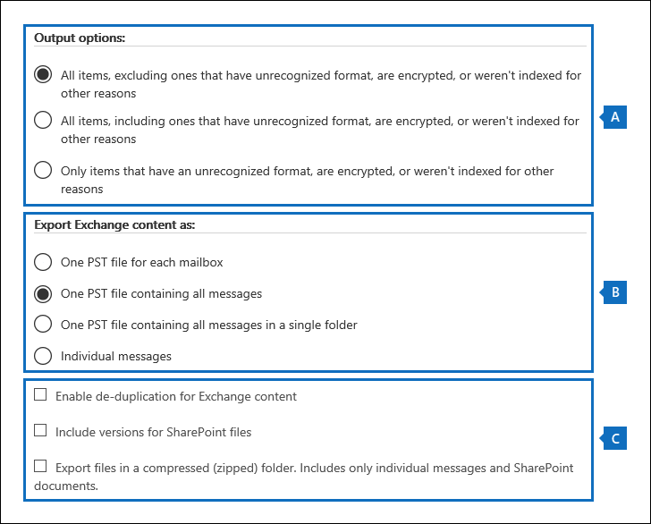

# <a name="manage-gdpr-data-subject-requests-with-the-dsr-case-tool-in-the-office-365-security-amp-compliance-center"></a>Office 365 セキュリティ&amp; /コンプライアンスセンターの DSR ケースツールを使用して GDPR データ主体要求を管理する

eu 一般データ保護規則 (GDPR) は、欧州連合 (EU) 内部で個人のプライバシー権を保護し、有効にすることについてのものです。 GDPR は、欧州連合 (データ対象者と呼ばれます) の各ユーザーに、個人データのアクセス、取得、修正、消去、および制限を行う権限を付与します。 GDPR の [個人データ] は、特定されたまたは特定の自然な人物に関する情報を意味します。 個人データに対するアクションを実行するために組織に対する正式な要求は、データ主体要求または DSR と呼ばれます。 office 365 でのデータの dsrs への対応の詳細については、「 [office 365 データ主体要求ガイド](https://go.microsoft.com/fwlink/?linkid=871169 )」を参照してください。
  
組織内のユーザーが送信した dsr に応答して調査を管理するには、Office 365 セキュリティ&amp;コンプライアンスセンターの dsr ケースツールを使用して、に格納されているコンテンツを検索することができます。
  
- 組織内の任意のユーザーメールボックス。 これには、Microsoft Teams での Skype for business の会話と1対1のチャットが含まれます。
    
- Office 365 グループに関連付けられているすべてのメールボックスと、Microsoft Teams 内のすべてのチームメールボックス
    
- 組織内のすべての SharePoint サイトおよび OneDrive for Business アカウント
    
- 組織内のすべての Teams サイトと Office 365 グループサイト
    
- Exchange Online のすべてのパブリック フォルダー
    
DSR ケースツールを使用すると、次のことができます。
  
- DSR 調査ごとに個別のケースを作成する。
    
- ユーザーをケースのメンバーとして追加することによって、DSR ケースにアクセスできるユーザーを制御します。セキュリティ&amp; /コンプライアンスセンターの [ **DSR ケース**] ページのケースの一覧では、メンバーのみがケースにアクセスでき、ケースは表示できます。 さらに、同じケースの異なるメンバーに異なるアクセス許可を割り当てることができます。 たとえば、一部のメンバーに対して、ケースおよび検索結果の表示のみを許可し、他のメンバーが検索を作成して検索結果をエクスポートできるようにすることができます。 
    
- 組み込み検索を使用して、特定のデータ主体によって作成またはアップロードされたすべてのコンテンツを検索します。
    
- 必要に応じて、組み込みの検索クエリを修正し、検索を再実行して検索結果を絞り込みます。
    
- DSR ケースに関連付けられている追加のコンテンツ検索を追加します。 これには、分析および Office ローミングサービスから、部分的にインデックス付けされたアイテムとシステム生成ログを返す検索を作成することが含まれます。
    
- DSR へのアクセスまたはエクスポート要求に対する応答としてデータをエクスポートします。
    
- DSR 調査プロセスが完了したら、ケースを削除します。これにより、ケースに関連付けられたすべての検索とエクスポートジョブが削除されます。
    
dsr ケースツールを使用して dsr 調査を管理するための大まかなプロセスは次のとおりです。
  
[手順 1: 潜在的なケースのメンバーに電子情報開示のアクセス許可を割り当てる](#step-1-assign-ediscovery-permissions-to-potential-case-members)

[手順 2: DSR ケースを作成してメンバーを追加する](#step-2-create-a-dsr-case-and-add-members)

[手順 3: 検索クエリを実行する](#step-3-run-the-search-query)

[手順 4: データをエクスポートする](#step-4-export-the-data)

[オプション手順 5: 組み込みの検索クエリを変更する](#optional-step-5-revise-the-built-in-search-query)

[DSR ケースツールの使用に関する詳細情報](#more-information-about-using-the-dsr-case-tool)
  
> [!IMPORTANT]
> ツールを使用すると、管理者は dsr のアクセスまたはエクスポート要求を実行できるようになります。これにより、dsr ケースツールに含まれる組み込みの検索とエクスポートの機能を利用できるようになります。 このツールは、データ主体によって送信された DSR 要求に関連するデータをエクスポートするためのベストエフォート方式を促進するのに役立ちます。 ただし、検索結果は、アイテムがエクスポート目的で "個人データ" と見なされるかどうかに影響を与える可能性のあるデータ主体または管理者のアクションによって異なる可能性があることに注意することが重要です。 たとえば、データの件名が、作成していないファイルを最後に変更したユーザーである場合、そのファイルは検索結果に返されないことがあります。 同様に、管理者は、部分的にインデックス付けされたアイテムや SharePoint ドキュメントのすべてのバージョンを含めずにデータをエクスポートすることもできます。 そのため、提供されているツールを使用すると、データ要求へのアクセスとエクスポートが容易になります。ただし、結果は特定の管理者およびデータ主体の使用シナリオの対象となります。 
  
## <a name="step-1-assign-ediscovery-permissions-to-potential-case-members"></a>手順 1: 潜在的なケースのメンバーに電子情報開示のアクセス許可を割り当てる

既定では、Office 365 グローバル管理者は、セキュリティ&amp;コンプライアンスセンターの DSR ケースツールにアクセスできます。 設計上、データプライバシー責任者、人事マネージャー、または dsr 調査に関わる他のユーザーは、dsr ケースツールへのアクセス権を持ちません。また、ツールにアクセスするための適切なアクセス許可を割り当てる必要があります。 これを行う最も簡単な方法は、セキュリティ&amp;コンプライアンスセンターの [**アクセス許可**] ページに移動して、電子情報開示マネージャーの役割グループにユーザーを追加することです。 なお、手順2で作成した DSR ケースのメンバーとして追加できるように、これらのアクセス許可を割り当てる必要もあります。 
  
詳細な手順については、「 [Office 365 セキュリティ&amp;コンプライアンスセンターで電子情報開示のアクセス許可を割り当てる](assign-ediscovery-permissions.md)」を参照してください。
  
> [!NOTE]
> 既定では、Office 365 のグローバル管理者 (またはセキュリティ&amp; /コンプライアンスセンターの [組織の管理] 役割グループの他のメンバーには、コンテンツ検索結果をエクスポートするために必要なアクセス許可がありません (この記事の手順4を参照)。 これを解決するために、管理者は自分自身を電子情報開示マネージャーの役割グループのメンバーとして追加できます。 
  
## <a name="step-2-create-a-dsr-case-and-add-members"></a>手順 2: DSR ケースを作成してメンバーを追加する

次の手順では、DSR ケースを作成します。 ケースを作成する場合、組み込み検索を開始するか、検索を開始せずにケースを作成するかを選択できます。 次の手順では、検索を開始せずにケースを作成し、ケースにメンバーを追加する方法について説明します。
  
1. に[https://protection.office.com](https://protection.office.com)移動して、職場または学校のアカウントを使用して Office 365 にサインインします。 
    
2. &amp;セキュリティ/コンプライアンスセンターで、[**データプライバシー** \> **データの件名の要求**] を 、[追加] アイコン [**新しい DSR ケース**] をクリックします。
    
3. [**新しい DSR ケース**のポップアップ] ページで、ケースに名前を付け、オプションの説明を入力して、[**次へ**] をクリックします。 ケースの名前は、組織内で一意である必要があることに注意してください。
    
    > [!TIP]
    > 調査している DSR 要求を送信したユーザーの名前を、新しいケースの名前や説明に追加することを検討してください。 このケース (および電子情報開示管理者) のメンバーのみが、[**データ主体要求**] ページのケースの一覧でケースを表示できることに注意してください。 
  
4. [**要求の詳細**] ページの [**データの件名 (この要求を提出したユーザー)**] で、データを検索してエクスポートするユーザーを選択し、[**次へ**] をクリックします。
    
5. [**ケースの設定の確認**] ページで、ケースの名前と説明を変更し、別のデータ主体を選択できます。 それ以外の場合は、[**保存**] をクリックします。
    
    新しい DSR ケースが作成されたことを確認するページが表示されます。
    
    ![検索を開始するか、[新しい DSR ケース] ページを閉じる](media/b5e62c2c-cafe-4a8d-a38c-789ed9f9ccbd.png)
  
    この時点で、次の2つの操作のいずれかを実行できます。
    
    a: [**検索結果の表示] を**クリックすると、検索が開始されます。 これは既定の選択です。 このオプションを選択したときに実行される組み込み検索は、手順3で説明されています。
    
    b: [**完了**] をクリックすると、組み込み検索を開始せずに新しい DSR ケースが閉じられます。 このオプションを選択すると、新しい DSR ケースが [**データ主体要求**] ページに表示されます。
    
6. [**完了**] をクリックして、新しい DSR ケースに移動して、メンバーを追加できるようにします。 
    
7. [**データ主体要求**] ページで、先ほど作成した DSR のケースの名前をクリックします。 
    
8. [**このケースの管理**] ページの [**メンバーの管理**] で、[**追加**] をクリックします。 
    
    [**ユーザー**] の下に、適切な電子情報開示のアクセス許可が割り当てられているユーザーの一覧が表示されます。 手順1で電子情報開示のアクセス許可を割り当てたユーザーがこの一覧に表示されることに注意してください。 
    
9. DSR ケースのメンバーとして追加するユーザーを選択し、[**追加**] をクリックして、変更を保存します。
    
    「 **Manage role groups**」の下にある [**追加**] をクリックして、DSR のメンバーとして役割グループを追加することもできます。 
    
## <a name="step-3-run-the-search-query"></a>手順 3: 検索クエリを実行する

DSR ケースを作成してメンバーを追加した後、次の手順では、ケースに関連付けられている組み込み検索を実行します。 この既定の検索クエリでは、次の処理が行われます。
  
- 組織内のすべてのメールボックスで、データ主体によって送受信されたすべての電子メールアイテムを検索します。 これは、*参加者*の電子メールプロパティを使用して実行されます。このプロパティは、電子メールメッセージ内のすべての人物フィールドのデータ主体を検索します。 このプロパティは、データの件名が**From**、 **To**、 **CC**、および**BCC**の各フィールドに含まれるアイテムを返します。 Exchange Online のパブリックフォルダーも、データ主体によって送受信されたメッセージを検索します。 
    
- 組織内のすべてのサイトで、データ主体によって作成またはアップロードされたドキュメントとアイテムを検索します。 これは、次のサイトプロパティを使用して実現されます。
    
  - *author*プロパティは、Office ドキュメントの author フィールドにデータの件名が表示されているアイテムを返します。 この値は、ドキュメントが他のユーザーによってコピーおよびアップロードされた場合でも保持されます。 
    
  - *CreatedBy*プロパティは、データ主体によって作成またはアップロードされたアイテムを返します。 
    
DSR ケースの作成時に自動的に作成される、組み込み検索のキーワードクエリは次のようになります。
  
```
participants:"<email address>" OR author:"<display name>" OR createdby:"<display name>"
```

たとえば、データの件名の名前が Leonte の場合、キーワードクエリは次のようになります。
  
```
participants:"ina@contoso.com" OR author:"Ina Leonte" OR createdby:"Ina Leonte"
```

 **DSR ケースの組み込み検索を実行するには、次のようにします。**
  
1. セキュリティ&amp; /コンプライアンスセンターで、[**データプライバシー** \> **データのサブジェクト要求**] をクリックし、手順2で作成した DSR ケースの横にある [**開く**] をクリックします。 
    
    ページの上部にある [**検索**] タブをクリックし、新しい DSR ケースを作成したときに作成された組み込み検索の横にあるチェックボックスをオンにします。 メモこの検索には、DSR ケースと同じ名前が付いています。 
    
2. [検索] ポップアップページで、[**クエリを開く**] をクリックします。
    
    クエリを開くと、検索が開始され、しばらくして完了します。 
    
3. 検索が完了したら、[**結果のプレビュー** ] をクリックして検索結果をプレビューします。 詳細については、「[検索結果のプレビュー](content-search.md#preview-search-results)」を参照してください。
    
    > [!TIP]
    > 検索クエリの統計を表示して、検索によって返されるメールボックスおよびサイトアイテムの数と、検索クエリに一致するアイテムを含む上位のコンテンツの場所を確認することもできます。 詳細については、「[検索に関する情報と統計情報を表示する](content-search.md#view-information-and-statistics-about-a-search)」を参照してください。 
  
組み込みの検索クエリを編集し、検索するコンテンツの場所を変更して、検索を再度実行します。 詳細については、「 [Step 5](#optional-step-5-revise-the-built-in-search-query) 」を参照してください。 
  
## <a name="step-4-export-the-data"></a>手順 4: データをエクスポートする

組み込み検索を実行した後、検索結果をエクスポートすることができます。 または、データをエクスポートする前に、クエリを変更して検索結果の数を減らす必要がある場合があります。 検索結果の絞り込みの詳細については、手順5を参照してください。
  
検索結果をエクスポートすると、メールボックスアイテムを PST ファイルまたは個別のメッセージとしてダウンロードできます。 SharePoint と OneDrive のアカウントからコンテンツをエクスポートすると、ネイティブの Office ドキュメントとその他のドキュメントのコピーがエクスポートされます。 エクスポートされたすべてのアイテムに関する情報を含む結果ファイルも検索結果に含まれています。 エクスポートの詳細については、「 [Office 365 セキュリティ&amp;コンプライアンスセンターからコンテンツ検索の結果をエクスポートする](export-search-results.md)」を参照してください。
  
> [!NOTE]
> 既定では、Office 365 のグローバル管理者 (またはセキュリティ&amp;コンプライアンスセンターの [組織の管理] 役割グループの他のメンバー) は、コンテンツ検索の結果をエクスポートするために必要なアクセス許可を持っていません。 これを解決するために、管理者は自分自身を電子情報開示マネージャーの役割グループのメンバーとして追加できます。 
  
データのエクスポートに使用するコンピューターは、次のシステム要件を満たしている必要があります。
  
- 32 ビットおよび 64 ビット バージョンの Windows 7 およびそれ以降のバージョン
    
- Microsoft .NET Framework 4.7
    
- サポートされているブラウザー:
    
  - Microsoft Edge
    
    または
    
  - Microsoft Internet Explorer 10 以降のバージョン
    
    > [!NOTE]
    > Microsoft は、ClickOnce アプリケーションのサードパーティの拡張機能またはアドオンを製造していません。 サポートされていないブラウザーを使用して、サードパーティの内線番号またはアドオンと共にデータをエクスポートすることはできません。 
  
 **DSR ケースの組み込み検索からデータをエクスポートするには、次のようにします。**
  
1. セキュリティ&amp; /コンプライアンスセンターで、[**データプライバシー** \> **データの件名の要求**] をクリックし、データのエクスポート元となる DSR ケースの横にある [**開く**] をクリックします。 
    
2. ページの上部にある [**検索**] タブをクリックし、DSR ケースを作成したときに作成された組み込み検索の横にあるチェックボックスをオンにします。 または、別の検索をクリックして、その検索からデータをエクスポートします。 
    
3. 検索ポップアップページで、[検索 **** のエクスポート] をクリックし、ドロップダウンリストから [**結果のエクスポート**] を選択します。 
    
4. [**結果のエクスポート**] ページで、DSR エクスポート要求に対して次の推奨オプションを選択します。 
    
    
  
    a: インデックス付きアイテムのみをエクスポートする場合は、[**出力オプション**] で、最初のオプション (**認識できない形式のアイテム、暗号化されていない、またはその他の理由でインデックスが付けられ**ていないものを除く) を選択します。 組み込み検索から、部分的にインデックス付けされたアイテムをエクスポートしない理由は、他のユーザーからの部分的なインデックス付きアイテムがエクスポートされるためです。 データ主体に対して、部分的にインデックスが作成されたアイテムのみをエクスポートするには、別の検索を作成することをお勧めします。 詳細については、「DSR ケースツールの使用に関する詳細情報」の「インデックスが作成された[アイテムをエクスポート](#exporting-partially-indexed-items)する」を参照してください。
    
    b: [ **Exchange コンテンツのエクスポート**] で、3つのオプション (**すべてのメッセージを含む1つの PST ファイル**) を1つのフォルダーに選択します。 一部の結果は、別のユーザーのメールボックスに含まれるアイテムによって異なることがあるので、このオプションを使用すると、実際のメールボックスを示さずに1つのフォルダー内のアイテムを一覧表示することができます。また、次のアイテムに推奨されたとおりに結果を除外する場合に最適なオプションです。. また、このオプションを使用すると、アイテムごとに元のメールボックスフォルダー構造を移動しなくても、データの件名が日付順に表示されます (アイテムは送信日で並べ替えられます)。
    
    c. 重複した電子メールメッセージを除外するには、[重複**除外を有効**にする] オプションを選択します。 組み込みの検索では、組織内のすべてのメールボックスを検索するため、このオプションをお勧めします。 そのため、同じメッセージの複数のコピーが検索されたメールボックス内にある場合、このオプションは、メッセージのコピーが1つだけエクスポートされることを意味します。 このオプションを使用すると、1つのフォルダー内の1つの PST ファイル内のメッセージを1つのフォルダーにエクスポートすることで、DSR のエクスポート要求に対する最良のユーザー環境を得ることができます。 結果の .csv エクスポートレポートには、重複メッセージが見つかったすべての場所が一覧表示されることに注意してください。
    
    必要に応じて、[sharepoint**ドキュメントにバージョンを含める**] オプションを選択して、sharepoint および OneDrive ドキュメントのすべてのバージョンをエクスポートすることもできます。 そのためには、ドキュメントライブラリに対してバージョン管理が有効になっている必要があります。 このオプションを使用すると、関連するすべてのデータを確実にエクスポートできます。
    
5. エクスポート設定を選択したら、[**エクスポート**] をクリックします。
    
    検索結果はダウンロード用に準備されています。これは、Microsoft クラウドの組織の Azure ストレージ領域にアップロードされることを意味します。 次の手順では、このデータをローカルコンピューターにダウンロードする方法について説明します。
    
6. [**エクスポート**] タブをクリックして、先ほど作成したエクスポートジョブを表示します。 エクスポートジョブには、検索名の末尾に**export**を追加した対応する検索と同じ名前が付いていることに注意してください。 
    
7. 作成したエクスポートジョブをクリックして、[エクスポート] フライアウトページを表示します。 このページには、エクスポートされるアイテムのサイズと合計数、および Azure ストレージ領域に転送されたアイテムの割合など、検索に関する情報が表示されます。 [**更新**] をクリックして、アップロードの状態情報を更新します。 
    
8. **[エクスポート キー]** で、**[クリップボードにコピー]** をクリックします。 検索結果をダウンロードするには、手順11でこのキーを使用します。
    
9. [ ![エクスポート] ポップアップページ](media/47205c65-babd-4b3a-bd7b-98dfd92883ba.png)の上部にある [検索結果のアイコンを**ダウンロード**する] をクリックします。 
    
10. ページの下部にあるポップアップウィンドウで、[**開く**] をクリックして**Microsoft Office 365 eDiscovery エクスポートツール**を開きます。 **電子情報開示エクスポートツール**は、最初に検索結果をダウンロードするときにインストールされます。 
    
11. **電子情報開示エクスポートツール**で、手順8でコピーしたエクスポートキーを適切なボックスに貼り付けます。
    
12. **[参照]** をクリックして、検索結果のファイルをダウンロードする場所を指定します。 
    
    > [!NOTE]
    > ディスクアクティビティが大量に (読み取りおよび書き込み) あるため、検索結果をローカルディスクドライブにダウンロードする必要があります。マップされたネットワークドライブまたは他のネットワークの場所にはダウンロードしないでください。 
  
13. **[開始]** をクリックして、検索結果をコンピューターにダウンロードします。 
    
    **電子情報開示エクスポート ツール**には、ダウンロードする残りのアイテムの数とサイズの見積もりなど、エクスポート プロセスの状態に関する情報が表示されます。 エクスポートプロセスが完了すると、ダウンロードされた場所にあるファイルにアクセスできます。 コンテンツ検索の結果をダウンロードするときに含まれるレポートの詳細については、「Office 365 セキュリティ&amp;コンプライアンスセンターからコンテンツ検索の結果をエクスポートする」の「[詳細情報](export-search-results.md#more-information)」セクションを参照してください。 
    
データをエクスポートした後、検索結果とエクスポートレポートは、DSR ケースと同じ名前のフォルダーに配置されます。 メールボックスアイテムを含む PST ファイルは、 **Exchange**という名前のサブフォルダーに配置されます。 サイトのドキュメントやその他のアイテムは、 **SharePoint**という名前のサブフォルダーにあります。 
  
## <a name="optional-step-5-revise-the-built-in-search-query"></a>オプション手順 5: 組み込みの検索クエリを変更する

組み込みの検索を実行した後で、検索結果を減らすために範囲を絞り込むように変更できます。 これを行うには、クエリに条件を追加します。 条件は、 **and**演算子によって、キーワードクエリに論理的に接続されています。 これは、検索結果で返されることを意味するため、アイテムはキーワードクエリと追加の条件の両方を満たす必要があります。 このようにすると、条件によって結果を絞り込むことができます。 検索クエリに2つ以上の一意の条件を追加すると、それらの条件は**and**演算子によって論理的に接続されます。 つまり、キーワードクエリに加えて、すべての条件を満たすアイテムのみが返されます。 複数の値をコンマまたはセミコロンで区切って1つの条件に追加すると、それらの値は**or**演算子によって接続されます。 これは、条件のプロパティの指定された値のいずれかが項目に含まれる場合にその項目が返されることを意味します。 
  
DSR ケースの組み込み検索クエリに追加できる条件の例を次に示します。 検索クエリで使用される実際のプロパティの名前は、かっこで囲まれています。
  
- **ファイルの種類`filetype`()** -ドキュメントまたはファイルの拡張子を指定します。 特定の Office アプリケーション (Word、Excel、OneNote など) によって作成されたドキュメントやファイルを検索するには、この条件を使用します。 
    
- **Message type ( `kind`)** -検索する電子メールアイテムの種類を指定します。 たとえば、Microsoft Teams では、この`kind:email OR kind:im`構文を使用して、電子メールメッセージと Skype for business の会話または1対1のチャットのみを返すことができます。 
    
- **コンプライアンスタグ (`compliancetag`)** -電子メールメッセージまたはドキュメントに割り当てられたラベルを指定します。 この条件は、特定のラベルに分類されたアイテムを返します。 ラベルは、データガバナンスのために電子メールとドキュメントを分類し、ラベルで定義された分類に基づいて保持ルールを適用するために使用されます。 これは、組織がデータのプライバシーに関連するコンテンツを分類するためにラベルを使用しているか、個人データや機密情報が含まれている場合があるため、これは DSR 調査にとって便利な条件です。 この条件の値については、完全なラベル名またはラベル名の最初の部分をワイルドカードで使用します。 詳細については、「 [Office 365 のラベルの概要](labels.md)」を参照してください。
    
DSR ケースツールで使用可能なすべての条件の一覧と説明については、記事「キーワードクエリと検索条件のコンテンツ検索」の「[検索条件](keyword-queries-and-search-conditions.md#search-conditions)」を参照してください。 
  
### <a name="changing-the-content-locations-that-are-searched"></a>検索するコンテンツの場所を変更する

DSR ケースの組み込み検索を改訂するだけでなく、検索するコンテンツの場所を変更することもできます。 前述のように、組み込みの検索では、組織内のすべてのメールボックスとサイト、および Exchange Online のパブリックフォルダーが検索されます。 たとえば、検索を絞り込んで、データ主体のメールボックスと OneDrive アカウント、および選択した SharePoint サイトのみを検索することができます。 特定のサイトを検索することを選択した場合は、検索する各サイトを追加する必要があります。
  
検索するコンテンツの場所を変更するには、次のようにします。
  
1. のコンテンツの場所を変更する組み込みの検索を開きます。
    
2. 検索クエリの [**場所**] で、[**特定の場所**] オプションの横にある [**変更**] をクリックします。 
    
    ![組み込み検索クエリのコンテンツの場所を変更するには、[変更] をクリックします。](media/d66f7ba7-b71f-4ff5-a030-460ff02e3123.png)
  
    [**場所の変更**] ポップアップページが表示されます。 ここでは、組み込み検索でのコンテンツの場所と、検索する場所の変更について説明します。 
    
    
  
    a: ポップアップページの上部にある [メールボックス内の**すべてを選択**] セクションの下にある切り替えが選択されています。これは、すべてのメールボックスが検索されることを示します。 検索範囲を絞るには、[トグル] をクリックして選択を解除し、[**ユーザー、グループ、またはチームの選択**] をクリックして、検索する特定のメールボックスを選択します。
    
    b: フライアウトページの中央にある [サイト] セクションの [**すべて選択]** の下にある切り替えが選択されています。これは、すべてのサイトが検索されることを示します。 選択したサイトに対して検索を絞り込むには、切り替えの選択を解除してから、[**サイトの選択**] をクリックします。 検索する特定のサイト (データサブジェクトの OneDrive アカウントを含む) を追加する必要があります。
    
    c. [exchange パブリックフォルダーの切り替え] セクションが選択されています。これは、すべての exchange パブリックフォルダーが検索されることを意味します。 すべての Exchange パブリックフォルダーのみを検索できることに注意してください。 検索に特定のものを選択することはできません。
    
3. 組み込みの検索でコンテンツの場所を変更する場合は、[ **Save &amp; run** ] をクリックして検索を再開します。 
  
## <a name="more-information-about-using-the-dsr-case-tool"></a>DSR ケースツールの使用に関する詳細情報

次のセクションでは、dsr のケースツールを使用して dsr エクスポート要求に応答する方法について詳しく説明します。
  
[myanalytics と Office ローミングサービスからのデータのエクスポート](#exporting-data-from-myanalytics-and-the-office-roaming-service)

[部分的にインデックスが作成されたアイテムをエクスポートする](#exporting-partially-indexed-items)

[Microsoft Teams および Office 365 グループからのデータの検索とエクスポート](#searching-and-exporting-data-from-microsoft-teams-and-office-365-groups)

[Exchange パブリックフォルダーの検索](#searching-exchange-public-folders)
  
### <a name="exporting-data-from-myanalytics-and-the-office-roaming-service"></a>myanalytics と Office ローミングサービスからのデータのエクスポート

DSR ケースツールを使用すると、myanalytics および Office ローミングサービスによって生成された利用状況データを検索してエクスポートすることができます。 これらのサービスの機能について説明します。
  
- **myanalytics** -メールボックス内のメールおよび予定表のデータに基づいて時間を費やす方法に関する洞察をユーザーに提供します。 すべての myanalytics insights は、ユーザーのメールボックス内の電子メールと会議のヘッダーから派生します。 myanalytics ライセンスを割り当てられているユーザーは、Office 365 にサインインし、myanalytics ダッシュボードに移動して、自分の時間をどのように過ごしたかについての洞察を表示することができます。 (DSR アクセス要求に応じて、ユーザーはこれらの洞察のスクリーンショットを表示できます)。 DSR ケースの組み込み検索は、myanalytics insights の生成に使用されるデータをエクスポートします。 
    
- **office ローミングサービス**-ローミングは、office テーマ、ユーザー辞書、言語設定、開発者モード、自動修正など、office 関連の設定を保存するサービスです。 
    
myanalytics と Office ローミングサービスからのデータは、データ主体のメールボックスに、Exchange Online メールボックスの非個人情報サブツリー (IPM 以外) にある隠しフォルダーに格納されます。 これは、ユーザーが Outlook または他のメールクライアントを使用して自分のメールボックスにアクセスするときに、ユーザーの表示からデータが非表示になることを意味します。 隠しフォルダーの詳細については、「 [MAPI の非表示フォルダー](https://go.microsoft.com/fwlink/?linkid=872758)」を参照してください。
  
データの [情報カテゴリ] メールボックス内の myanalytics および Office ローミングサービスの使用状況データを返す個別のコンテンツ検索を作成し、DSR ケースに関連付けることができます。 このデータは検索統計に含まれていないため、プレビューでは使用できません。 ただし、DSR エクスポート要求に対する応答として、エクスポートしてからデータ主体に渡すことができます。
  
myanalytics および Office ローミングサービスからデータをエクスポートすると、データは、データ主体の電子メールアドレスを持つ名前のフォルダーの下にある、 **applicationdataroot**フォルダーにあるアプリケーションごとに個別のフォルダーに保存されます。 このデータは JSON ファイルとしてエクスポートされます。これは、電子メールメッセージに添付された XML または TXT ファイルに似た、人間が判読できるテキストファイルです。 現在、これらのフォルダーには、myanalytics と Office ローミングサービスに割り当てられているグローバル一意識別子 (GUID) が付けられ、次の表に記載されています。 DSR ケースツールの今後のバージョンでは、GUID が実際のアプリケーションの名前に置き換えられます。 
  
|**アプリケーション**|**GUID/フォルダー名**|
|:-----|:-----|
|MyAnalytics  <br/> |3c896ded-22c5-450f-91f6-3d1ef0848f6e  <br/> |
|Office ローミングサービス  <br/> |1caee58f-eb14-4a6b-9339-1fe2ddf6692b  <br/> |
   
 **myanalytics および Office ローミングサービスデータを検索してエクスポートするには、次のようにします。**
  
1. セキュリティ&amp; /コンプライアンスセンターで、[**データプライバシー** \> **データの件名の要求**] をクリックし、使用状況データをエクスポートするデータ主体の DSR ケースの横にある [**開く**] をクリックします。 
    
2. ページの上部にある [**検索**] タブをクリックし、[  **ガイド付き検索**の追加] をクリックします。
    
3. [**検索に名前**をつける] ページで [**キャンセル**] をクリックします。 
    
4. [**検索クエリ**] の [**種類**] 条件で、[ **myanalytics**および**Office ローミングサービス**] の横にあるチェックボックスをオンにします。 
    
    ![利用状況データをエクスポートするには、[myanalytics および Office ローミングサービス] チェックボックスをオンにします。](media/3dacbc7a-c314-492c-828c-6757fda84963.png)
  
    検索クエリでは、**型**の条件 (電子メールメッセージクラス) が唯一のアイテムである必要があることに注意してください。 [**キーワード**] ボックスを削除するか、空白のままにしておくことができます。 
    
5. [**場所**] で**特定の場所**が選択されていることを確認し、[**変更**] をクリックします。
    
6. [**場所の変更**] ポップアップページ ([メールボックス] セクション) の上部にある [**ユーザー、グループ、またはチームの選択**] をクリックします。
    
7. [**場所の編集**] ページで、[**ユーザー、グループ、またはチームの選択**] をクリックし、データ主体のメールボックスを選択して、選択内容を保存します。 
    
8. [**保存&amp; **] をクリックして、検索に名前を付けて保存します。
    
    検索が開始されます。
    
 **myanalytics および Office ローミングサービスデータをエクスポートするには、次のようにします。**
  
1. 前の手順で作成した検索が完了したら、ページの上部にある [**検索**] タブをクリックし、検索の横にあるチェックボックスをオンにします。 [最新の情報に **** ] をクリックして検索を表示することが必要な場合があります。 
    
2. 検索ポップアップページで、[検索 **** のエクスポート] をクリックし、ドロップダウンリストから [**結果のエクスポート**] を選択します。 
    
3. [**結果のエクスポート**] ページで、利用状況データをエクスポートするために推奨される次のオプションを選択します。 
    
    
  
    a: インデックス付きアイテムのみをエクスポートする場合は、[**出力オプション**] で、最初のオプション (**認識できない形式のアイテム、暗号化されていない、またはその他の理由でインデックスが付けられ**ていないものを除く) を選択します。
    
    b: [ **Exchange コンテンツのエクスポート**] で、2番目のオプションで**ある、すべてのメッセージを含む1つの PST ファイル**を選択します。
    
    c. 残りのエクスポートオプションは非選択のままにしておきます。
    
4. エクスポート設定を選択したら、[**エクスポート**] をクリックします。
    
    検索結果はダウンロード用に準備されています。これは、Microsoft クラウドの組織の Azure ストレージ領域にアップロードされることを意味します。 次の手順では、このデータをローカルコンピューターにダウンロードする方法について説明します。
    
5. [**エクスポート**] タブをクリックして、先ほど作成したエクスポートジョブを表示します。 エクスポートジョブには、検索名の末尾に**export**を追加した対応する検索と同じ名前が付いていることに注意してください。 
    
6. 作成したエクスポートジョブをクリックして、[エクスポート] フライアウトページを表示します。 
    
7. **[エクスポート キー]** で、**[クリップボードにコピー]** をクリックします。 検索結果をダウンロードするには、手順10でこのキーを使用します。
    
8. [ ![エクスポート] ポップアップページ](media/47205c65-babd-4b3a-bd7b-98dfd92883ba.png)の上部にある [検索結果のアイコンを**ダウンロード**する] をクリックします。 
    
9. ページの下部にあるポップアップウィンドウで、[**開く**] をクリックして**Microsoft Office 365 eDiscovery エクスポートツール**を開きます。 **電子情報開示エクスポートツール**は、最初に検索結果をダウンロードするときにインストールされます。 
    
10. **電子情報開示エクスポート ツール**で、手順 7 でコピーしたエクスポート キーを該当するボックスに貼り付けます。
    
11. **[参照]** をクリックして、検索結果のファイルをダウンロードする場所を指定します。 
    
    > [!NOTE]
    > ディスクアクティビティが大量に (読み取りおよび書き込み) あるため、検索結果をローカルディスクドライブにダウンロードする必要があります。マップされたネットワークドライブまたは他のネットワークの場所にはダウンロードしないでください。 
  
12. **[開始]** をクリックして、検索結果をコンピューターにダウンロードします。 
    
    **電子情報開示エクスポート ツール**には、ダウンロードする残りのアイテムの数とサイズの見積もりなど、エクスポート プロセスの状態に関する情報が表示されます。 エクスポートプロセスが完了すると、Outlook で Exchange PST ファイルを開いて、 **applicationdataroot**フォルダーに移動して、myanalytics およびローミングサービスへのサブフォルダーにアクセスすることができます。 
    
    前述したように、利用状況データを含む JSON ファイルはメッセージに添付されます。 json ファイルを表示するには、メッセージをクリックして、添付されている json ファイルを開きます。 
  
### <a name="exporting-partially-indexed-items"></a>部分的にインデックスが作成されたアイテムをエクスポートする

新しい DSR ケースを作成するときに作成される組み込み検索から、部分的にインデックスが作成されたアイテム (インデックスなしのアイテムとも呼ばれます) をエクスポートしないことをお勧めします。 これは、検索結果には、組織内の他のユーザーについて部分的にインデックス付けされたアイテムが含まれる可能性が高く、データの件名の一部のインデックスアイテムだけではないためです。 代わりに、データ主体に関連する、部分的にインデックスが作成されたアイテムのみをエクスポートするように設計された DSR ケースに関連付けられた個別のコンテンツ検索を作成することをお勧めします。 
  
以下に、部分的にインデックスが作成されたアイテムをエクスポートするための大まかな手順を示します。 エクスポートした後で、アイテムが DSR アクセスまたはエクスポート要求に応答しているかどうかを確認できます。
  
1. DSR ケースを開き、[**検索**] ページで新しい検索を作成します。 
    
2. 検索クエリと検索するコンテンツの場所を構成するには、次の条件を使用します。
    
    - 空の/空白のキーワードクエリを使用します。 これにより、検索されるコンテンツの場所にあるすべてのアイテムが返されます。
    
    - データ主体の Exchange Online メールボックスとその OneDrive アカウントのみを検索します。
    
3. 検索を実行して完了した後、検索結果をエクスポートしてダウンロードできます ([手順 4](#step-4-export-the-data)で説明)。 次の設定を使用して、部分的にインデックスが作成されたアイテムをエクスポートします。 
    
    - [**出力オプション**] で、3番目のオプション (**認識できない形式のアイテムのみ、暗号化されているか、またはその他の理由でインデックスが作成されなかったアイテムのみ**) を選択して、部分的にインデックスが作成されたアイテムのみをエクスポート
    
    - [ **Exchange コンテンツのエクスポート**] で、ユーザーの設定に基づいて任意のオプションを選択できます。 
    
    - [ **SharePoint ドキュメントにバージョンを含める**] オプションを選択すると、バージョンが部分的にインデックス付けされている場合、ドキュメントのバージョンがエクスポートされます。 
    
部分的にインデックスが作成されたアイテムの詳細については、以下を参照してください。 
  
- [Office 365 のコンテンツ検索で部分的にインデックスが作成されたアイテム](partially-indexed-items-in-content-search.md)

- [部分的にインデックスが作成されたアイテムをエクスポートする](export-search-results.md#exporting-partially-indexed-items)
    
### <a name="searching-and-exporting-data-from-microsoft-teams-and-office-365-groups"></a>Microsoft Teams および Office 365 グループからのデータの検索とエクスポート

Microsoft Teams のチャットリスト (チームチャットまたは1対1のチャットと呼ばれる) に含まれる会話は、チャットに参加しているユーザーの Exchange Online メールボックスに格納されます。 また、1対1のチャットでユーザーが共有するファイルは、そのファイルを共有しているユーザーの OneDrive アカウントに保存されます。 組み込みの検索では、組織内のすべてのメールボックスと OneDrive アカウントが検索されるので、チャットセッションで共有されているチームのチャットとドキュメント (作成またはアップロードされたデータサブジェクト) は、DSR ケースの組み込み検索によって返されます。
  
または、Teams チャネル (チャネルメッセージとも呼ばれます) の一部である会話は、チームに関連付けられているメールボックスに格納されます。 Microsoft Teams に関連付けられたすべてのメールボックスが検索されるため、データサブジェクトが参加した会話の種類は、組み込みの検索によっても返されます。 また、データ主体が Teams チャネルで共有している可能性があるタイルは、チームの SharePoint サイトに格納されます。 作成または uploadedby のファイルは、Microsoft Teams に関連付けられているサイトが検索に含まれるため、DSR ケースでは組み込み検索によって返されます。
  
同様に、Office 365 グループに対応するメールボックスと SharePoint サイトも、組み込み検索に含まれています。 これは、データの件名で送受信された電子メールメッセージと、データ主体によって作成またはアップロードされたファイルが返されることを意味します。 
  
コンテンツ検索を使用して Microsoft Teams および office 365 グループ内のアイテムを検索する方法、またはメンバーの一覧を取得する方法については、「 [Office 365 のコンテンツ検索](content-search.md#searching-microsoft-teams-and-office-365-groups)」の「microsoft teams および office 365 グループを検索する」セクションを参照してください。 
  
### <a name="searching-exchange-public-folders"></a>Exchange パブリックフォルダーの検索

DSR ケースの組み込み検索は、メールが有効なパブリックフォルダーに送信された電子メールメッセージ、または他のユーザーがパブリックフォルダーに送信し、データ主体もコピーしたメッセージのみを返します。 データの件名がパブリックフォルダーに投稿された可能性があるというメッセージは返されません。 データ主体がパブリックフォルダーに投稿したアイテムを検索するには、別のコンテンツ検索を作成して、データ主体によってパブリックフォルダーに投稿されたアイテムを検索します。
  
ここでは、データの件名がパブリックフォルダーに投稿されている可能性があるアイテムを検索するための大まかなプロセスについて説明します。 
  
1. DSR ケースを開き、[**検索**] ページで新しい検索を作成します。 
    
2. 検索クエリと検索するコンテンツの場所を構成するには、次の条件を使用します。
    
  - [**キーワード**] ボックスで、次の検索クエリを使用します。 
    
    ```
    itemclass:ipm.post AND "<email address of the data subject>"
    ```

  - すべての Exchange パブリックフォルダーを検索する
    
  - 検索を実行して完了した後、検索結果をエクスポートしてダウンロードできます ([手順 4](#step-4-export-the-data)で説明)。 次の設定を使用して、部分的にインデックスが作成されたアイテムをエクスポートします。 
