# Microsoft クラウド サービスの利用時に、コンプライアンス マネージャーを使用してデータ保護と規制の要件を満たすUse Compliance Manager to help meet data protection and regulatory requirements when using Microsoft cloud services

 *コンプライアンス マネージャーは、21Vianet が運用している Office 365、Office 365 Germany、Office 365 U.S. Government Community High (GCC High)、Office 365 Department of Defense では使用できません。**Compliance Manager isn't available in Office 365 operated by 21Vianet, Office 365 Germany, Office 365 U.S. Government Community High (GCC High), or Office 365 Department of Defense.* 
  
コンプライアンス マネージャーは、当社の [Microsoft Service Trust Portal](https://support.office.com/article/f30e2353-0bd6-41ed-8347-eea1fb8d2662) に記載されているワークフローベースのリスク評価ツールです。コンプライアンス マネージャーを使用すると、Microsoft Office 365、Microsoft Dynamics 365、Microsoft Azure などの Microsoft プロフェッショナル サービスや Microsoft クラウド サービスに関連する組織の規制遵守活動の追跡、割り当て、検証を行うことができます。Compliance Manager, a workflow-based risk assessment tool in the Microsoft [Service Trust Portal](https://support.office.com/article/f30e2353-0bd6-41ed-8347-eea1fb8d2662), enables you to track, assign, and verify your organization's regulatory compliance activities related to Microsoft Professional Services and Microsoft cloud services, such as Microsoft Office 365, Microsoft Dynamics 365, and Microsoft Azure. 

コンプライアンス マネージャーには、次のような機能があります。Compliance Manager:
  
- ISO 27001、ISO 27018、NIST などの各種の標準に対する、サード パーティからの Microsoft クラウド サービスのさまざまな監査の一環として、マイクロソフトが監査担当者および規制機関に提供する詳細情報と、マイクロソフトが HIPAA や EU の一般データ保護規制 (GDPR) などの規制遵守のために内部で編集する情報を組み合わせます。内部で編集する情報には、組織が標準と規制に遵守しているかどうかについてのユーザーの自己評価も含めます。Combines the detailed information provided by Microsoft to auditors and regulators as part of various third-party audits of Microsoft 's cloud services against various standards (for example, ISO 27001, ISO 27018, and NIST) and information that Microsoft compiles internally for its compliance with regulations (such as HIPAA and the EU General Data Protection Regulation, or GDPR) with your own self-assessment of your organization's compliance with these standards and regulations.
    
- コンプライアンスと評価に関連するアクティビティの割り当て、追跡、記録をできるようにします。チーム間の障壁が少なくなり、組織のコンプライアンスの目標を達成しやすくなります。Enables you to assign, track, and record compliance and assessment-related activities, which can help your organization cross team barriers to achieve your organization's compliance goals.
    
- コンプライアンス スコアを使用することができます。組織の進行状況を追跡し、監査コントロールに優先順位を付けることができ、組織が危険にさらされにくくなります。Provides a Compliance Score to help you track your progress and prioritize the auditing controls that will help reduce your organization's exposure to risk.
    
- コンプライアンス アクティビティに関連する証拠と他の成果物のアップロードおよび管理を行うためのリポジトリがセキュリティで保護されます。Provides a secure repository for you to upload and manage evidence and other artifacts related to your compliance activities.
    
- マイクロソフトと組織が実施するコンプライアンス アクティビティに関する豊富な詳細レポートを Microsoft Excel 形式で作成します。それらのレポートは、監査担当者、規制機関、その他のコンプライアンス関係者に提供することができます。Produces richly detailed reports in Microsoft Excel that document the compliance activities performed by Microsoft and your organization, which can be provided to auditors, regulators, and other compliance stakeholders.

コンプライアンス マネージャーの簡単なデモについては、こちらの「[コンプライアンス マネージャー](https://www.youtube.com/watch?v=r1vs8NdSXKQ)」ビデオをご覧ください。For a brief demo of Compliance Manager, see this [Compliance Manager](https://www.youtube.com/watch?v=r1vs8NdSXKQ) video.

    
> [!IMPORTANT]
> コンプライアンス マネージャーは、データ保護とコンプライアンスの現状の要約と、データ保護とコンプライアンスを改善するための推奨事項を提供するダッシュボードです。コンプライアンス マネージャーに表示される顧客アクションは推奨事項です。実装前に、各組織がそれぞれの規制環境でこれらの推奨事項が有効かどうかを評価する必要があります。コンプライアンス マネージャーでの推奨事項はコンプライアンスを保証するものではありませんので、ご注意ください。Compliance Manager is a dashboard that provides a summary of your data protection and compliance stature and recommendations to improve data protection and compliance. The Customer Actions provided in Compliance Manager are recommendations; it is up to each organization to evaluate the effectiveness of these recommendations in their respective regulatory environment prior to implementation. Recommendations found in Compliance Manager should not be interpreted as a guarantee of compliance.

    
## コンプライアンス マネージャーとは?What is Compliance Manager?

コンプライアンス マネージャーは、クラウドの共有責任モデル内でコンプライアンスを管理するために設計されたワークフロー ベースのリスク評価ツールです。コンプライアンス マネージャーが提供するダッシュボード ビューには、標準と規則、および Microsoft のコントロール実装の詳細、テスト結果、顧客コントロール実装ガイダンス、組織が入力する進捗管理などの評価が表示されます。コンプライアンス マネージャーは、証明書評価コントロールの定義、コントロールの実装とテストに関するガイダンス、コントロールでの危険度に重点を置いたスコア、ロールベースのアクセス管理、およびインプレース コントロール アクション割り当てのワークフローを提供して、コントロールの実装、テストの状態、証拠の管理を追跡できるようにします。コンプライアンス マネージャーは、ユーザーが論理的に評価をグループ化し、同じコントロールまたは関連するコントロールに評価コントロール テストを適用できるようにして、コンプライアンスの作業負荷を最適化し、作業の重複を削減します。コンプライアンス マネージャーを使用しないと、異なる証明書間の同じコントロールの要件を満たすための作業が重複してしまう可能性があります。Compliance Manager is a workflow-based risk assessment tool designed to help you manage regulatory compliance within the shared responsibility model of the cloud. Compliance Manager provides you with a dashboard view of standards and regulations and assessments that contain Microsoft's control implementation details and test results and customer control implementation guidance and tracking for your organization to enter. Compliance Manager provides certification assessment control definitions, guidance on implementation and testing of controls, risk-weighted scoring of controls, role-based access management, and an in-place control action assignment workflow to track control implementation, testing status and evidence management. Compliance Manager optimizes compliance workload by enabling customers to logically group assessments together and apply assessment control testing to identical or related controls, reducing the duplication of effort that might otherwise be required to satisfy identical control requirements across different certifications.

## コンプライアンス マネージャーでの AssessmentAssessments in Compliance Manager

コンプライアンス マネージャーのコア コンポーネントは *Assessment* (評価) と呼ばれます。これは、証明書基準やデータ保護規則 (ISO 27001:2013、GDPR など) についての Microsoft サービスに対する評価を指します。Assessment により、組織のデータ保護およびコンプライアンスへの取り組みが、選択された Microsoft クラウド サービスの業界標準に準じているかどうかを確認することができます。評価対象の証明書標準にマップされるコントロールを実装すると、Assessment は完了します。The core component of Compliance Manager is called an *Assessment*. An Assessment is an assessment of a Microsoft service against a certification standard or data protection regulation (such as ISO 27001:2013, and the GDPR). Assessments help you to discern your organization's data protection and compliance posture against the selected industry standard for the selected Microsoft cloud service. Assessments are completed by the implementation of the controls that map to the certification standard being assessed. 
  
Assessment の構造は、マイクロソフトとお客様の組織の間で共有される責任に基づいています。クラウド内のセキュリティとコンプライアンス リスクを評価し、コンプライアンス標準、データ保護標準、規制、また法律によって指定されたデータ保護のセーフガードを実装する仕組みになっています。The structure of an Assessment is based on the responsibility that is shared between Microsoft and your organization for assessing security and compliance risks in the cloud and for implementing the data protection safeguards specified by a compliance standard, a data protection standard, a regulation, or a law.
  
Assessment は、以下の複数のコンポーネントで構成されています。An Assessment is made of several components, which are:
  
- **In-Scope Services** - 各評価は Microsoft サービスの特定のセットに適用されます。評価が適用されるサービスは [In-Scope Services] セクションに記載されています。**In-Scope Services** - Each assessment applies to a specific set of Microsoft services, which are listed in the In-Scope Cloud Services section. 
    
- **マイクロソフト管理のコントロール** - マイクロソフトは、さまざまな標準および規制遵守の一環として、クラウド サービスごとに一連の*コントロール*の実装と管理を行っています。これらのコントロールは、Assessment が適用されている証明書または規制の構造に沿った形で、*コントロール ファミリー*に編成されています。マイクロソフトがコントロールをどのように実装し、また、独立したサード パーティの監査担当者によって実装がいつどのようにテストおよび検証されたかについての詳細情報を、コンプライアンス マネージャーで、マイクロソフト管理のコントロールごとに確認できます。**Microsoft Managed Controls** - For each cloud service, Microsoft implements and manages a set of  *controls*  as part of Microsoft's compliance with various standards and regulations. These controls are organized into  *control families*  that align with the structure from the corresponding certification or regulation that the Assessment is aligned to. For each Microsoft managed control, Compliance Manager provides details about how Microsoft implemented the control, along with how and when that implementation was tested and validated by an independent third-party auditor. 
    
    ここでは、Office 365 と GDPR の Assessment からの **[セキュリティ]** コントロール ファミリーにおける 3 つのマイクロソフト管理のコントロールの例を紹介します。Here's an example of three Microsoft managed controls in the **Security** control family from an Assessment of Office 365 and the GDPR. 

    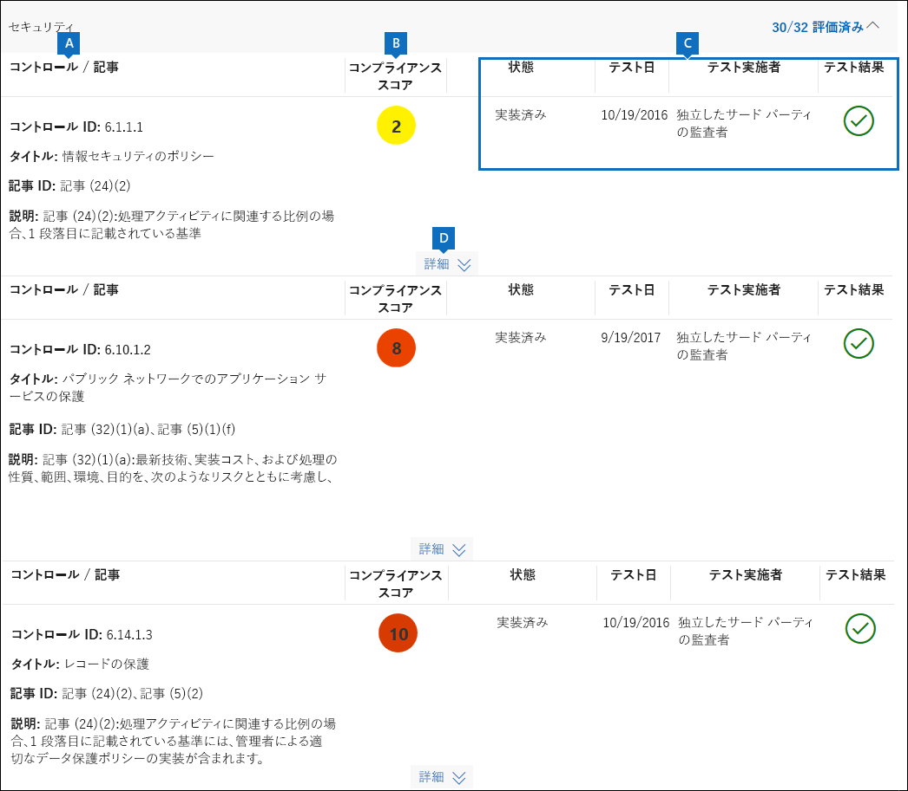
  
  a. マイクロソフト管理のコントロールにマップされる証明書または規制からの次の情報を指定します。a. Specifies the following information from the certification or regulation that maps to the Microsoft managed control.

  - **コントロール ID** - コントロールのマップ先の証明書または規制のセクションまたは記事番号。**Control ID** - The section or article number from the certification or regulation that the control maps to.
    
  - **タイトル** - 対応する証明書または規制のタイトル。**Title** - The title from the corresponding certification or regulation.
    
  - **記事 ID** - このフィールドは GDPR 評価の場合にのみ含まれ、対応する GDPR 記事番号の指定に使用します。**Article ID** - This field is included only for GDPR assessments, as it specifies the corresponding GDPR article number.
    
  - **説明** - 選択したマイクロソフト管理のコントロールにマップされる標準または規制の本文。**Description** - Text of the standard or regulation that maps to the selected Microsoft managed control.

  b. コントロールのコンプライアンス スコアで、マイクロソフト管理の各コントロールに関連付けられる (非準拠またはコントロールの失敗による) リスクのレベルを示します。詳細については、「[コンプライアンス スコアについて](#understanding-the-compliance-score)」を参照してください。なお、コンプライアンス スコアは 1 から 10 段階で評価され、色分けされています。黄色はリスクの低いコントロール、オレンジは中程度のリスクのコントロール、赤は高いリスクのコントロールを示します。b. The Compliance Score for the control, which indicates the level of risk (due to non-compliance or control failure) associated with each Microsoft managed control. See [Understanding the Compliance Score](#understanding-the-compliance-score) for more information. Note that Compliance Scores are rated from 1 to 10 and are color-coded. Yellow indicates low risk controls, orange indicates medium-risk controls, and red indicated high-risk controls. 
    
  c. コントロールの実装状態、コントロールがテストされた日付、テストを実施した担当者、およびテスト結果に関する情報。c. Information about the implementation status of a control, the date the control was tested, who performed the test, and the test result.
    
  d. **[詳細]** をクリックすると、マイクロソフトのコントロールの実装や、独立したサード パーティの監査人によるコントロールのテストおよび検証方法などの詳細情報を、コントロールごとに確認できます。d. For each control, you can click **More** to see additional information, including details about Microsoft's implementation of the control and details about how the control was tested and validated by an independent third-party auditor. 
    
- **顧客管理のコントロール** - お客様の組織が管理するコントロールのコレクションです。組織には、所定の標準や規則へのコンプライアンスのプロセスの一環として、これらのコントロールを実装する責任があります。顧客管理のコントロールも、対応する証明書または規制のコントロール ファミリーに編成されます。コンプライアンス活動の一環として、マイクロソフトが提案する推奨アクションを実装するには、顧客管理のコントロールを使用します。組織は、それぞれの顧客管理のコントロールにおける規範的なガイダンスと推奨される顧客アクションを使用して、そのコントロールの実装と評価のプロセスを管理できます。**Customer Managed Controls** - This is the collection of controls that are managed by your organization. Your organization is responsible for implementing these controls as part of your compliance process for a given standard or regulation. Customer managed controls are also organized into control families for the corresponding certification or regulation. Use the customer managed controls to implement the recommended actions suggested by Microsoft as part of your compliance activities. Your organization can use the prescriptive guidance and recommended Customer Actions in each customer managed control to manage the implementation and assessment process for that control.
    
    Assessment における顧客管理のコントロールには、Assessment 完了までの組織の手順の管理および追跡ができる、組み込みのワークフロー管理機能もあります。たとえば、組織のコンプライアンス責任者は、実施項目を IT 管理者に割り当てることができます。IT 管理者は、コントロールに関する推奨アクションを実施する責任者でもあり、アクション実施に必要な権限を持ちます。割り当てが完了すると、IT 管理者は実装タスク (構成またはポリシー設定のスクリーンショットなど) の証拠をアップロードできます。それから、実施項目をコンプライアンス責任者に再度割り当てて、収集した証拠の評価、コントロール実装のテスト、実装日とテスト結果の記録を、コンプライアンス マネージャーで実施できます。詳細については、記事の「[評価プロセスの管理](#managing-the-assessment-process)」セクションを参照してください。Customer managed controls in Assessments also have built-in workflow management functionality that you can use to manage and track your organization's progress towards completing the Assessment. For example, a Compliance Officer in your organization can assign an Action Item to an IT admin who has the responsibility and necessary permissions to perform the actions that are recommended for the control. When that work is complete, the IT admin can upload evidence of their implementation tasks (for example, screen shots of configuration or policy settings) and then assign the Action Item back to the Compliance Officer to evaluate the collected evidence, test the implementation of the control, and record the implementation date and test results in Compliance Manager. For more information, see the [Managing the assessment process](#managing-the-assessment-process) section in the article. 
  
## アクセス許可とロールベースのアクセス制御Permissions and role-based access control

既定では、Office 365 または Azure AD アカウントを持つ組織のすべてのユーザーがコンプライアンス マネージャーにアクセスでき、コンプライアンス マネージャーでアクションを実行できます。既定のアクセス許可からロールベースのアクセス制御モデルに変更するには、少なくとも 1 人のユーザーを各コンプライアンス マネージャー ロールに追加する必要があります (以下の手順を参照してください)。ユーザーがロールに追加されると、すべてのユーザーにある既定のアクセス許可セットから、そのロールに割り当てられたアクションを実行するアクセス許可が削除されます。削除後は、そのロールをプロビジョニングされたユーザーのみがコンプライアンス マネージャーにアクセスでき、そのロールで許可されたアクションを実行できます。By default, everyone in your organization with an Office 365 or Azure AD account has access to Compliance Manager and can perform any action in Compliance Manager. To change from default permissions to the role-based access control model, at least one user must be added to each Compliance Manager role (see the following instructions). After a user is added to a role, the permissions to perform the actions assigned to that role are removed from the default set of permissions available to all users, and only users that have been provisioned that role will be able to access Compliance Manager and perform the actions allowed by that role.
  
ロールベースのアクセスを実装すると、定義済みのコンプライアンス マネージャーのロールに割り当てられていないユーザーにはゲスト アクセスの権限が与えられます。Once role-based access has been implemented, any user that is not assigned to a defined Compliance Manager role will have Guest access.
  
> [!NOTE]
> ロールベースのアクセス制御を完全に実装して、コンプライアンス マネージャーにアクセスしてアクションを実行できるユーザーを管理するには、各ロールにユーザーを追加して既定のアクセス許可を変更する必要があります。たとえば、Assessment を管理できるロールにユーザーを追加すると、そのロールのメンバーのみが Assessment を管理できます。同様に、Assessment のデータを読み取れるロールにユーザーを追加しない場合は、組織内のすべてのユーザーがコンプライアンス マネージャーにアクセスでき、任意の Assessment 内のデータを読み取ることができます。To fully implement role-based access control to manage who can access and perform actions in Compliance Manager, a user must be added to each role to change the default permissions. For example, if you add a user to the role that lets users manage Assessments, only members of that role can manage Assessments. Similarly, if you don't add a user to the role that lets users read the data in Assessments, then all users in your organization can access Compliance Manager and read data in any Assessment. 
  
以下の表では、各コンプライアンス マネージャーのアクセス許可と、ユーザーに許可されている操作について説明しています。また、この表は、各アクセス許可が割り当てられるロールも示しています。The following table describes each Compliance Manager permission and what it allows the user do. The table also indicates the role that each permission is assigned to.
  
||**コンプライアンス マネージャー リーダー****Compliance Manager Reader**|**コンプライアンス マネージャー投稿者****Compliance Manager Contributor**|**コンプライアンス マネージャー評価者****Compliance Manager Assessor**|**コンプライアンス マネージャー管理者****Compliance Manager Administrator**|**ポータル管理者****Portal Admin**|
|:-----|:-----|:-----|:-----|:-----|:-----|
|**データの読み取り** - ユーザーはデータを読み取ることができますが、編集はできません。**Read data** - Users can read but not edit data.    |             |             |             |             |             |
|**データの編集** - ユーザーは [テスト結果] および [テスト日] フィールドを除くすべてのフィールドを編集できます。**Edit data** - Users can edit all fields, except the Test Result and Test Date fields.    ||             |             |             |             |
|**テスト結果の編集** - ユーザーは [テスト結果] および [テスト日] フィールドを編集できます。**Edit test results** - Users can edit the Test Result and Test Date fields.    |||             |             |             |
|**評価の管理** - ユーザーは、Assessment の作成、アーカイブ、削除ができます。**Manage assessments** - Users can create, archive, and delete Assessments.    ||||             |             |
|**ユーザーの管理** - ユーザーは、組織内の他のユーザーをリーダー、投稿者、評価者、管理者のロールに追加できます。組織内でグローバル管理者ロールを持つユーザーのみが、ユーザーをポータル管理者ロールに追加したり、ポータル管理者ロールからユーザーを削除したりすることができます。**Manage users** - Users can add other users in their organization to the Reader, Contributor, Assessor, and Administrator roles. Only those users with the Global Administrator role in your organization can add or remove users from the Portal Admin role.    |||||             |
   
### ゲスト アクセスGuest access
  
コンプライアンス マネージャーのアクセスが構成されると、プロビジョニングされたロールがないユーザーは既定で**ゲスト アクセス** ロールに追加されます (これは、個人用の Microsoft アカウントのような組織以外のプロビジョニングされたアカウントでも同じです)。ゲスト アクセスのユーザーはコンプライアンス マネージャーのすべての機能にはアクセスできず、組織のコンプライアンス評価データを表示できません。ただし、コンプライアンス マネージャーを使用して、Microsoft のコンプライアンス評価レポートと Service Trust ドキュメントを表示できます。アクセスできるものとアクセスできないものの図解については、次の図を参照してください。アクセスできる機能は青で、アクセスできない機能は赤で描かれています。After Compliance Manager access has been configured, any user that does not have a provisioned role is in the **Guest access** role by default (which is also the experience of any non-organization-provisioned accounts like personal Microsoft Accounts). Guest Access users do not have full access to all of the Compliance Manager features and are not able to see any of the organization's compliance assessment data, however they are able to use Compliance Manager to view Microsoft's compliance assessment reports and Service Trust documents. For an illustration of what is and is not accessible, see the images below where accessible features are outlined in blue and inaccessible features are outlined in red. 
  
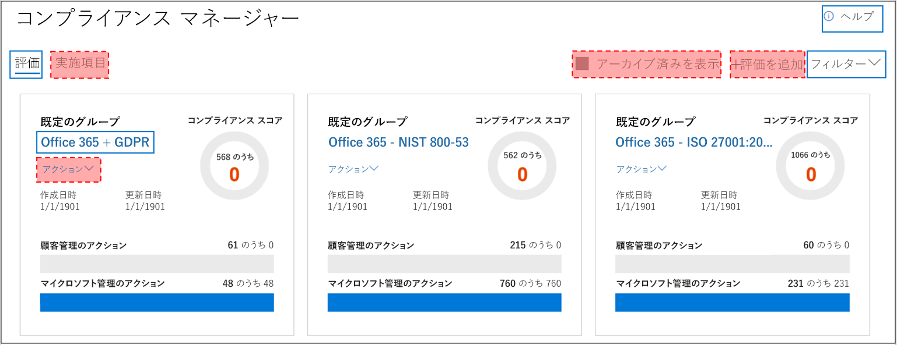
  
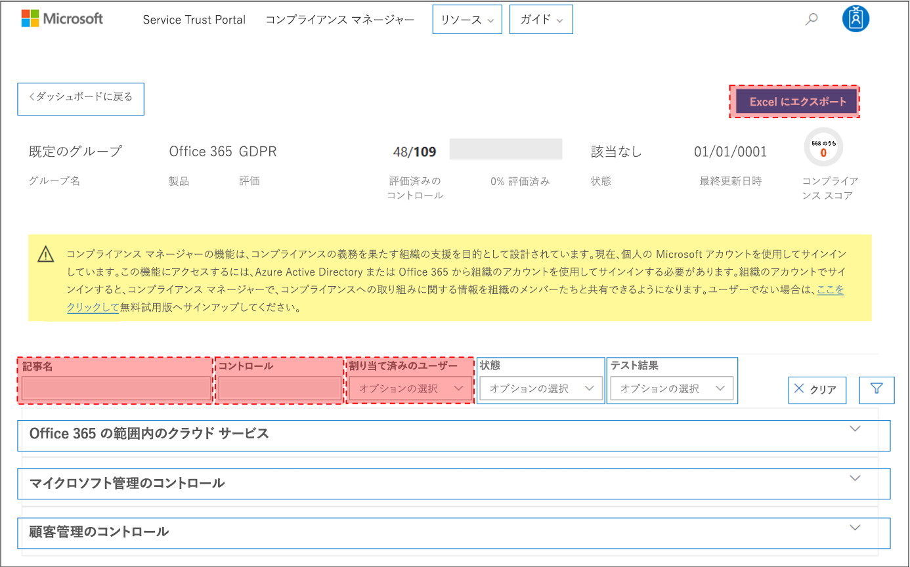

## コンプライアンス スコアについてUnderstanding the Compliance Score

コンプライアンス マネージャーのダッシュボードでは、Office 365 の評価の合計スコアがタイルの右上隅に表示されます。これは Assessment のコンプライアンス スコアの総計で、Assessment での実装およびテストの実行が記録された各コントロールの評価に関する取得ポイントの累計です。Assessment を追加すると、コンプライアンス スコアが既にある程度完了していることが確認できます。これは、マイクロソフトが実装し、独立したサードパーティがテストしたマイクロソフト管理のコントロールのポイントが、コンプライアンス スコアに既に適用されているためです。On the Dashboard, Compliance Manager displays a total score for Office 365 assessments in the upper right hand corner of the tile. This is the overall total Compliance Score for the Assessment, and is the accumulation of points received for each control assessment that has been marked as Implemented and Tested in the Assessment. When adding an Assessment, you will see that the Compliance Score is already on the way towards completion because the points for the Microsoft managed controls that have been implemented by Microsoft and tested by independent third parties are already applied.
  
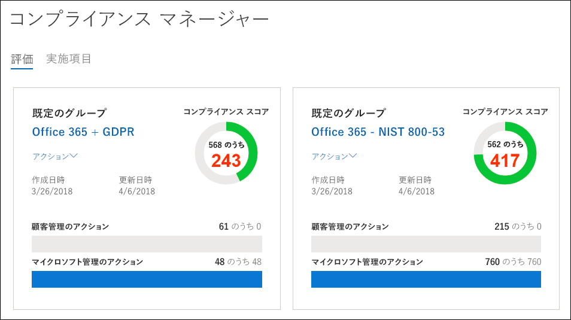
  
残りのポイントは、正常な顧客コントロール評価、および顧客管理のコントロールの実装とテストから取得されます。それぞれのポイントには特定の値があり、その値はコンプライアンス スコア全体に計上されます。The remaining points come from the successful customer control assessment, from the implementation and testing of the customer-managed controls, each of which has a specific value that contributes to the overall compliance score. 
  
各 Assessment では、リスクベースのコンプライアンス スコアが表示されます。このスコアは、Assessment の各コントロール (マイクロソフト管理のコントロールと顧客管理のコントロールを含む) に関連するリスクのレベル (コンプライアンス違反またはコントロールの失敗によるリスク) を評価するのに役立ちます。顧客管理のコントロールそれぞれには、取得できる可能性があるポイント数 (\* 重大度ランキングと呼ばれます) が 1 から 10 のスケールで割り当てられます。コントロールが失敗した場合、高いリスク要因に関連するコントロールには高いポイントが付与され、リスクの低いコントロールには低いポイントが付与されます。Each Assessment displays a risk-based Compliance Score to help you assess the level of risk (due to non-compliance or control failure) associated with each control (including both Microsoft managed and customer managed controls) in an Assessment. Each customer managed control is assigned a possible number of points (called a  severity ranking  ) on a scale from 1 to 10, where more points are awarded for controls associated with a higher risk factor if the control fails, and fewer points are awarded for lower-risk controls. 
  
たとえば、以下のユーザー アクセスの管理評価コントロールは、リスクの重大度ランキングが非常に高く、10 の値が割り当てられています。For example, the User Access Management assessment control shown below has a very high severity risk ranking, and displays an assigned value of 10.
  
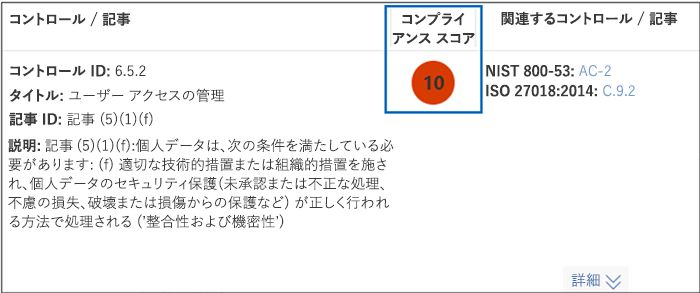
  
 対照的に、以下のバックアップ評価コントロールは、リスクの重大度ランキングが低く、3 の値が割り当てられています。By comparison, the Information Backup assessment control shown below has a lower severity risk ranking, and displays an assigned value of 3. 
  
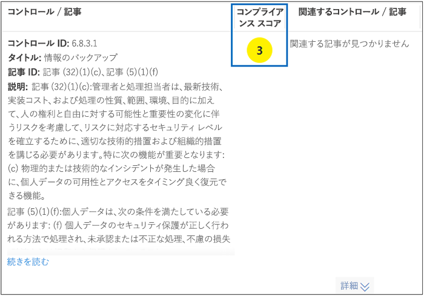
  
コンプライアンス マネージャーでは、各コントロールに既定の重大度ランキングが割り当てられます。リスクのランキングは、以下の基準に基づいて算出されます。The Compliance Manager assigns a default severity ranking to each control. Risk rankings are calculated based on the following criteria:
  
- コントロールがインシデントの発生を阻止するのか (最も高いランク)、発生したインシデントを検出するか、あるいはインシデントの影響を修正するか (最も低いランク)。重大度ランキングでは、脅威防止の必須のコントロールには、最も高いポイント数が割り当てられます。(必須か任意かに関わらず) 検出または修正のコントロールには最も低いポイント数が割り当てられます。Whether a control prevents incidents from happening (highest ranking), detects incidents that have happened, or corrects the impact of an incident (lowest ranking). In terms of severity ranking, a control that prevents a threat and is mandatory is assigned the highest number of points; controls that are detective or corrective (regardless of whether they're mandatory or discretionary) are assigned the lowest number of points.
    
- (実装後) これらのコントロールが必須で、ユーザーがバイパスできない (たとえば、ユーザーがパスワードをリセットし、パスワードの長さと文字の要件を満たす必要があるなど)、それとも任意でユーザーがバイパスできるか (たとえば、ユーザーがコンピューターから離れるときに画面をロックすることを求める業務ルールなど)。Whether a control (after it's been implemented) is mandatory and therefore can't be by-passed by users (for example, users having to reset their password and meet password length and character requirements) or discretionary and can be by-passed by users (for example, business rules that require users to lock their screens when their computers are unattended).
    
- データの機密性、整合性、可用性のリスクに関するコントロールの場合は、これらのリスクが内部と外部のどちらの脅威から生じるのか、またその脅威が悪意のあるものか偶発的なものなのかに基づいて算出します (たとえば、外部の攻撃者がネットワークに侵入し、個人を特定できる情報にアクセスするのを阻止するコントロールには、従業員がネットワーク ルーターの設定を誤って構成してネットワークを停止させる問題を防ぐコントロールよりも多くのポイントが割り当てられます)。Controls related to risks to data confidentiality, integrity, and availability, whether these risks come from internal or external threats, and whether the threat is malicious or accidental. For example, controls that would help prevent an external attacker from breaching that network and gaining access to personally identifiable information would be assigned more points than a control related to preventing an employee from accidentally mis-configuring a network router setting that results in a network outage).
    
- 各コントロールの契約、規制、公約などの法的および外的要因に関連するリスク。Risks related to legal and external drivers, such as contracts, regulations, and public commitments, for each control.
    
コントロールに表示されているコンプライアンス スコアの値は、合格/不合格 (コントロールが実装され、その後の評価テストに合格したかどうか) に基づいて、*合計値*としてコンプライアンス スコアの合計に適用されます。一部の実装へのクレジットは値には反映されません。コントロールの**実装状態**が **[実装済み]** または **[別の実装]** に設定され、**テスト結果**が **[合格]** に設定されている場合にのみ、割り当て済みのポイントがコンプライアンス スコアの合計に追加されます。The displayed Compliance Score values for the control are applied  *in their entirety*  to the Total Compliance Score on a pass/fail basis--either the control is implemented and passes the subsequent assessment test or it does not; there is no partial credit for a partial implementation. Only when the control has its **Implementation Status** set to **Implemented** or **Alternative Implementation** and the **Test Result** is set to **Passed** are the assigned points added to the Total Compliance Score. 
  
最も重要な点は、コンプライアンス スコアを使用すると、コントロール関連の障害が発生した場合にリスクが高くなる可能性があるコントロールを識別でき、どのコントロールの実装に重点を置くかの優先順位を設定しやすくなることです。リスクベースの優先順位の設定に加えて、評価コントロールが他のコントロール (同じ評価内または同じ評価グループの別の評価内のいずれか) に関連する場合、1 つのコントロールが正常に完了すると、コントロールのテスト結果が同期され、作業が大幅に削減されるという利点もあります。Most importantly, the Compliance Score can help you prioritize which controls to focus on for implementation by indicating which controls that have a higher potential risk if there is a failure related to a control. In addition to risk-based prioritization, it is worthwhile noting that where assessment controls are related to other controls (either within the same assessment or in another assessment that is in the same assessment grouping) completing a single control successfully can result in a significant reduction of effort based on the synchronization of control test results.
  
たとえば、次の図の Office 365 - GDPR Assessment では 46% が評価済みです。111 個のコントロール評価のうち 51 個が完了しており、コンプライアンス スコアの合計は、取得可能な 600 のうちの 289 になります。For example, in the image below we see that the Office 365 - GDPR Assessment is currently 46% assessed, with 51 of 111 control assessments completed for a Total Compliance score of 289 out of a possible 600.
  
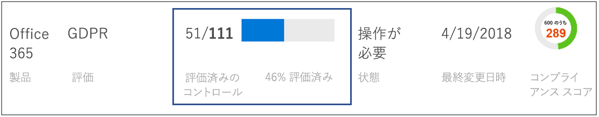
  
評価内で、GDPR コントロール 7.5.5 は他の 5 つのコントロール (7.4.1、7.4.3、7.4.4、7.4.8、7.4.9) に関連しており、重大度を示すリスクの評価スコアが、それぞれに中から高の 6 または 8 が設定されています。評価フィルターを使用して、これらのコントロールすべてを選択し、評価ビューに表示されるようにしたところ、次の図でいずれも評価されていないことがわかります。Within the assessment GDPR control 7.5.5 is related to 5 other controls (7.4.1, 7.4.3, 7.4.4,.7.4.8, and 7.4.9) each with a moderate to high severity risk rating score of 6 or 8). Using the assessment filter, we have selected all of these controls, making them visible in the assessment view, and can see below that none of them have been assessed. 
  
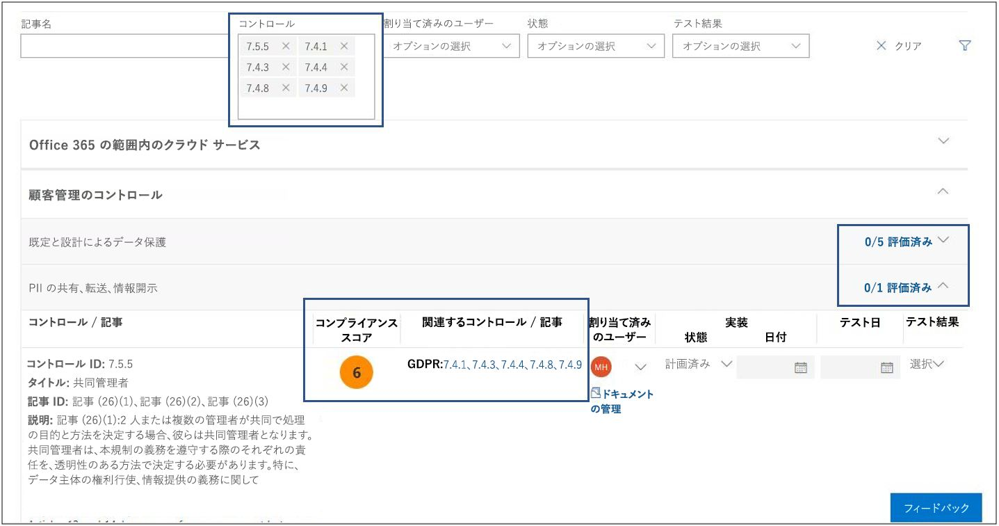 これら 6 つのコントロールは関連しているので、いずれか 1 つのテストが完了すると、この評価内の関連するコントロールの間でテスト結果が同期されます (同じ評価グループ内の評価での関連するコントロールの場合も同様です)。GDPR コントロール 7.5.5 の実装とテストが完了すると、コントロールの詳細領域が更新されて、6 つのコントロールすべてが評価されたことが表示されます。対応する数値が加算され、評価されたコントロールの数が 57 で、評価済みが 51% となっています。コンプライアンス スコアの合計も 40 増えています。As those 6 controls are related, the completion of any one them will result in a synchronization of those test results across the related controls within this assessment (just as it will for any related controls in an assessment that is in the same assessment grouping). Upon completion of the implementation and testing of GDPR control 7.5.5, the control detail area refreshes to show that all 6 controls have been assessed, with a corresponding increase in the number of assessed controls to 57 and 51% assessed, and a change in total Compliance Score of +40. 
  

  
関連する他のコントロールに影響を与える方法で、関連するコントロールの実装状態を変更しようとすると、この更新の確認ダイアログ ボックスが表示されます。This confirmation update dialog box will appear if you are about to change the Implementation Status of a related control in a way that will impact the other related controls.
  
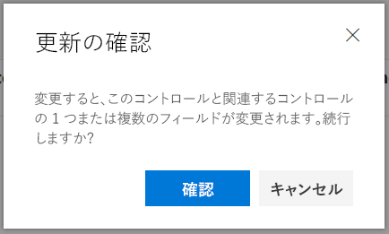
  
> [!NOTE]
> 現時点では、Office 365 クラウド サービスの Assessment にのみ、コンプライアンス スコアが含まれています。Azure と Dynamics の Assessment の場合は、評価の状態が表示されます。Currently, only Assessments for Office 365 cloud services include a Compliance Score. Assessments for Azure and Dynamics show an assessment status. 

## コンプライアンス スコアの手法Compliance Score methodology

コンプライアンス スコア (Microsoft Secure Score など) は、他の動作ベースのスコア システムと似ています。組織は、データ保護、プライバシー、セキュリティに関連するアクティビティを実行することで、組織のコンプライアンス スコアを上げることができます。The Compliance Score, like the Microsoft Secure Score, is similar to other behavior-based scoring systems; your organization's activity can increase its Compliance Score by performing activities related to data protection, privacy, and security.
  
> [!NOTE]
> 組織が特定の標準や規制を遵守しているかの絶対的測定値は、コンプライアンス スコアでは表せません。ユーザーが設定した、個人のデータやプライバシーに関するリスクを軽減できるコントロールをどの程度採用したかがコンプライアンス スコアによって表されます。標準や規制に準じていることを保証するサービスは提供されておらず、コンプライアンス スコアも何かを保証するものではありませんので、ご注意ください。The Compliance Score does not express an absolute measure of organizational compliance with any particular standard or regulation. It expresses the extent to which you have adopted controls which can reduce the risks to personal data and individual privacy. No service can guarantee that you are compliant with a standard or regulation, and the Compliance Score should not be interpreted as a guarantee in any way. 
  
コンプライアンス マネージャーでの Assessment は、クラウド コンピューティングの共有責任モデルに基づいています。共有責任モデルでは、クラウドに保存されているお客様のデータの保護に対する責任は、マイクロソフトと各お客様の間で共有されます。Assessments in Compliance Manager are based on the shared responsibility model for cloud computing. In the shared responsibility model, Microsoft and each customer share responsibility for the protection of the customer's data when that data is stored in our cloud.
  
以下の Office 365 GDPR Assessment に示すように、マイクロソフトとお客様はそれぞれ、評価されている標準または規制の要件を満たすように設計されている、さまざまなアクションを実行する責任があります。さまざまな標準と規制に必要なアクションを合理化し理解するため、コンプライアンス マネージャーでは、すべての標準と規制がコントロール フレームワークのように処理されます。そのため、Assessment ごとにマイクロソフトおよびお客様によって実行されるアクションには、さまざまなコントロールの実装と検証が含まれます。As shown in the Office 365 GDPR Assessment below, Microsoft and customers are each responsible for performing a variety of Actions that are designed to satisfy the requirements of the standard or regulation being assessed. To rationalize and understand the required Actions across a variety of standards and regulations, Compliance Manager treats all standards and regulations as if they were control frameworks. Thus, the Actions performed by Microsoft and by customers for each Assessment involve the implementation and validation of various controls.
  
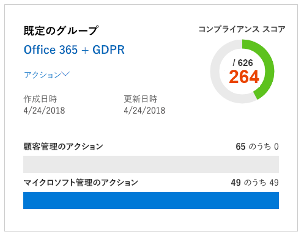
  
一般的なアクションの基本ワークフローは次のとおりです。Here's the basic workflow for a typical Action:
  
1. 組織のコンプライアンス、リスク、プライバシーやデータ保護の責任者は、コントロール実装のタスクを組織内の次のようなユーザーに割り当てます。The Compliance, Risk, Privacy, and/or Data Protection Officer of an organization assigns the task to someone in the organization to implement a control. That person could be:

    - ビジネス ポリシーの所有者A business policy owner
    
    - IT 担当者An IT implementer
    
    - 組織内の別の個人ユーザーで、タスク実行の責任者Another individual in the organization who has responsibility for performing the task
    
2. 上記ユーザーは、コントロールを実装するために必要なタスクを実行し、実装の証拠をコンプライアンス マネージャーにアップロードし、アクションに関連付けられているコントロールを実装済みとして記録します。これらのタスクが完了したら、検証の評価者にアクションを割り当てます。次のようなユーザーが評価者となります。That individual performs the tasks necessary to implement the control, uploads evidence of implementation into Compliance Manager, and marks the control(s) tied to the Action as implemented. Once these tasks are completed, they assign the Action to an Assessor for validation. Assessors can be:
    
    - 組織内のコントロールを検証する内部評価者Internal assessors that perform validation of controls within an organization
    
    - コンプライアンスの検査、検証、証明を行う外部評価者 (Microsoft クラウド サービスを監査する、独立したサード パーティの組織など)External assessors that examine, verify, and certify compliance, such as the third-party independent organizations that audit Microsoft's cloud services
    
3. 評価者は、コントロールの検証と証拠の精査を行い、評価済みとしてコントロールと評価の結果を記録します (例: 合格)。The Assessor validates the control and examines the evidence and marks the control(s) as assessed and the results of the assessment (e.g., passed).
    
Assessment に関連付けられたコントロールをすべて評価すると、Assessment は完了したものと見なされます。Once all the controls associated with an Assessment have been assessed, the Assessment is considered completed.
  
マイクロソフトが責任を持つコントロールの要件を満たすために、コンプライアンス マネージャーのすべての Assessment は、マイクロソフトが実施するアクションの詳細情報と共にプリロードされます。この情報には、マイクロソフトが各コントロールを実装した方法、Microsoft の実装を評価した方法とタイミング、サード パーティの監査人による検証方法とタイミングに関する詳細が含まれます。そのため、各 Assessment のマイクロソフト管理のコントロールは評価済みとして記録され、Assessment のコンプライアンス スコアに反映されます。Every Assessment in Compliance Manager comes pre-loaded with information that provides details about the Actions taken by Microsoft to satisfy the requirements of the controls for which Microsoft is responsible. This information includes details about how Microsoft has implemented each control and how and when Microsoft's implementation was assessed and verified by a third-party auditor. For this reason, the Microsoft Managed Controls for each Assessment are marked as Assessed, and the Compliance Score for the Assessment reflects this.
  
各 Assessment には、共有責任モデルに基づくコンプライアンス スコアの合計が含まれます。Office 365 のコントロールに関するマイクロソフトの実装とテストは、GDPR 評価関連の取得可能な合計ポイントの一部に該当します。ユーザーが、各顧客アクションの実装とテストを完了すると、その Assessment のコンプライアンス スコアにはコントロールに割り当てられた値が追加されます。Each Assessment includes a total Compliance Score based on the shared responsibility model. Microsoft's implementation and testing of controls for Office 365 contributes a portion of the total possible points associated with a GDPR assessment. As the customer implements and tests each of the customer Actions, the Compliance Score for the Assessment will increase by the value assigned to the control. 
  
 ### リスクベースのスコアリングの手法Risk-based scoring methodology
  
コンプライアンス マネージャーでは、1 から 10 の範囲によるリスクベースのスコアリングの手法を使用します。コントロールが失敗したイベントまたは非準拠のイベントにおいて、高いリスクが示されているコントロールには、高い値が割り当てられます。コンプライアンス スコアに適用されるスコアリング システムは、次のような重要な要因に基づいています。Compliance Manager uses a risk-based scoring methodology with a scale from 1-10 that assigns a higher value to controls that represent a higher risk in the event the control fails or is non-compliant. The scoring system used by Compliance Score is based on several key factors, such as:
  
- コントロールの本質The essence of the control
    
- 脅威の種類に基づくコントロールのリスク レベルThe level of risk of the control based on the kinds of threats
    
- コントロールの外的要因The external drivers for the control
    
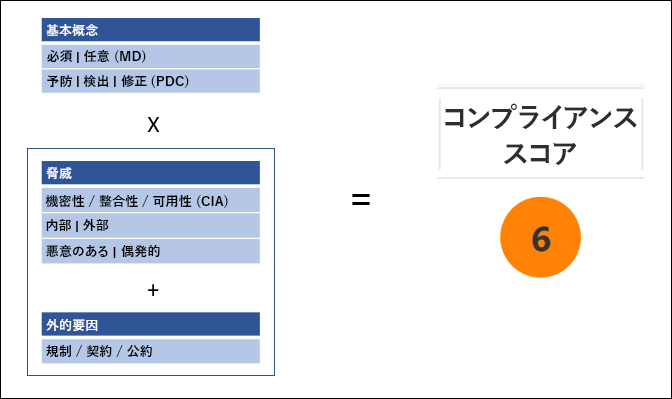
  
 ### コントロールの本質Essence of the control
  
コントロールの本質は、コントロールが必須か任意のどちらであるか、および予防、検出、または修正のいずれであるかに基づきます。The essence of the control is based on whether the control is Mandatory or Discretionary, and whether it is Preventative, Detective, or Corrective.
  
 ### 必須または任意Mandatory or discretionary
  
 *必須のコントロール*は、意図的にも偶発的にもバイパスできないコントロールです。一般的な必須のコントロールの例は、パスワードの長さ、複雑さ、有効期限の要件を設定する一元管理されたパスワード ポリシーです。システムにアクセスするためには、ユーザーはこれらの要件に準拠する必要があります。*Mandatory controls*  are controls that cannot be bypassed either intentionally or accidentally. An example of a common mandatory control is a centrally-managed password policy that sets requirements for password length, complexity, and expiration. Users must comply with these requirements in order to access the system. 
  
 *任意のコントロール*は、ユーザーがポリシーを理解し、状況に応じて実行するものです。たとえば、退席するときにコンピューターのロックをユーザーに要求するポリシーは、ユーザーに依存するものであるため、任意のコントロールになります。*Discretionary controls*  rely upon users to understand policy and act accordingly. For example, a policy requiring users to lock their computer when they leave it is a discretionary control because it relies on the user. 
  
 ### 予防、検出、または修正Preventative, detective, or corrective
  
 *予防のコントロール*は、特定のリスクを防ぐものです。たとえば、暗号化による保存情報の保護は、攻撃や漏洩などに対する予防のコントロールです。また、職務権限の分離は、利益を公正に分かち合い、不正行為を防ぐための予防のコントロールになります。*Preventative controls*  are those that prevent specific risks. For example, protecting information at rest using encryption is a preventative control against attacks, breaches, etc. Separation of duties is a preventative control to manage conflict of interest and to guard against fraud. 
  
 *検出のコントロール*は、リスクにつながる不規則な状態や行動を検出するために、システムをアクティブに監視するもので、侵入の検出や違反の発生の判別に使用できます。システム アクセスの監査や、特権のある管理操作の監査は、検出のコントロールで監視の部類に該当します。規制のコンプライアンスの監査は、プロセスの問題を見つけるために使用する、検出のコントロールになります。*Detective controls*  are those that actively monitor systems to identify irregular conditions or behaviors that represent risk or that can be used to detect intrusions or determine if a breach has occurred. System access auditing and privileged administrative actions auditing are types of detective monitoring controls; regulatory compliance audits are a type of detective control used to find process issues. 
  
 *修正のコントロール*は、セキュリティに関するインシデントの影響を最小限に抑えるものです。直後の影響を少なくするための是正措置を取り、可能であればダメージの修復を行います。プライバシーに関するインシデントへの対応は、ダメージを抑え、違反発生後にシステムを通常の稼働状態に復元する修正のコントロールになります。*Corrective controls*  are those that try to keep the adverse effects of a security incident to a minimum, take corrective action to reduce the immediate effect, and reverse the damage, if possible. Privacy incident response is a corrective control to limit damage and restore systems to an operational state after a breach. 
  
これらの要因を使用して各コントロールを評価することで、コントロールの本質を判断します。そして、コントロールの本質に、その本質が表すリスクに相当する値を割り当てます。By evaluating each control using these factors, we determine the essence of the control and assign it a value relative to the risk that it represents.
  
 **脅威****Threat**
  
||||
|:-----|:-----|:-----|
||**必須****Mandatory**   |**任意****Discretionary**   |
|**予防****Preventative**   |高リスクHigh risk    |中程度のリスクMedium risk    |
|**検出****Detective**   |中程度のリスクMedium risk    |低リスクLow risk    |
|**修正****Corrective**   |中程度のリスクMedium risk    |低リスクLow risk    |
   
脅威は、データの CIA (機密性、整合性、可用性) トライアドと呼ばれる、基本的でかつ広く受け入れられているセキュリティ標準に対してリスクを引き起こすものを意味します。Threat refers to anything that poses a risk to the fundamental, universally-accepted security standard known as the CIA triad for data: Confidentiality, Integrity, and Availability:
  
- 機密性は、信頼でき、承認された関係者のみが情報の閲覧と確認ができることを意味します。Confidentiality means that information can be read and understood only by trusted, authorized parties.
    
- 整合性は、情報が承認されていない関係者によって変更または破棄されていないこと意味します。Integrity means that information has not been modified or destroyed by unauthorized parties.
    
- 可用性は、高いレベルのサービスの品質で情報にアクセスする用意ができていることを意味します。Availability means that information can be accessed readily with a high level of quality of service.
    
これらの特性に欠けていることはすべて、システム全体の侵害と見なされます。脅威の原因は内部ソースと外部ソースの両方が考えられ、脅威を行った者の目的に関しては、偶発的である場合と悪意がある場合があります。これらの要因は、脅威マトリックスで予測され、シナリオの各組み合わせに、高、中、低のいずれかの脅威レベルが割り当てられます。A failure of any of these characteristics is considered a compromise of the system as a whole. Threats can come from both internal and external sources, and an actor's intent can be accidental or malicious. These factors are estimated in a threat matrix that assigns threat levels of either High, Moderate, or Low to each combination of scenarios.

||**内部****Internal** ||**外部****External** ||||
|:-----|:-----|:-----|:-----|:-----|:-----|:-----|
||*悪意**Malicious* |*偶発的**Accidental* |*悪意**Malicious* |*偶発的**Accidental* |||
|**機密性****Confidentiality** |(高、中、低)(H, M, or L)    |(高、中、低)(H, M, or L)    |(高、中、低)(H, M, or L)    |(高、中、低)(H, M, or L)|
|**整合性****Integrity** |(高、中、低)(H, M, or L)    |(高、中、低)(H, M, or L)    |(高、中、低)(H, M, or L)    |(高、中、低)(H, M, or L)|
|**可用性****Availability** |(高、中、低)(H, M, or L)    |(高、中、低)(H, M, or L)    |(高、中、低)(H, M, or L)    |(高、中、低)(H, M, or L)|
   
 **外的要因****External drivers**
  
|**契約****Contracts**|**規制****Regulations**|**公約****Public commitments**|
|:-----|:-----|:-----|
|(高、中、低)(H, M, or L)    |(高、中、低)(H, M, or L)    |(高、中、低)(H, M, or L)    |
   
適用される規制、契約、公約などの外的要因は、データを保護してデータ違反を防ぐように設計されたコントロールに影響を及ぼす場合があります。そのため、これらの要因のそれぞれに、高、中、低のリスク値が割り当てられます。External factors such as applicable regulations, contracts, and public commitments can influence controls designed to protect data and prevent data breaches, and each of these factors are assigned risk values or High, Moderate or Low.
  
CIA/脅威および法的/外的要因で示された、可能性のある 15 個のリスク シナリオでの高、中、低のリスク値の予想発生回数は、リスクの重み付けのために結合されます。リスクの重み付けでは、指定された値におけるリスクの可能性と発生数が重要視されます。リスクの重み付けの検討は、コントロールの重大度ランキングを計算するときに行います。The estimated number of occurrences of these risk values of High, Moderate, or Low across the 15 possible risk scenarios represented in the CIA/Threat and Legal/External Drivers are combined to provide a risk weighting, which considers the likelihood and number of occurrences of risks at a given value as significant and is taken into consideration when calculating the severity ranking of the control.
  
コントロールの重大度ランキングに基づいて、コントロールにコンプライアンス スコアの値として 1 (低) から 10 (高) の数値が割り当てられ、次のリスクのカテゴリに分類されます。Based on the control's severity ranking, the control is assigned its compliance score value, a number between 1 (low) and 10 (high), grouped into the following categories of risk:
  
|**リスク レベル****Risk level**|**コントロール値****Control value**|
|:-----|:-----|
|低Low    |1-31-3    |
|中Moderate    |66.    |
|高High    |88    |
|重大Severe    |1010    |
   
最も高いコンプライアンス スコアの値で評価コントロールの優先度を設定することで、組織は最もリスクの高い項目に集中できるようになります。コントロールの評価を完了するごとに、組織は、評価に対するコンプライアンス スコアの合計にさらにポイントが追加された形で、比例的に高い値のフィードバックを受け取ります。By prioritizing assessment controls with the highest compliance score values, the organization will be concentrating on the highest risk items and receive proportionally higher positive feedback in the form of more points added to the total compliance score for the assessment for each control assessment completed.
  
### スコアリングの手法の要約Summmary of scoring methodology
  
コンプライアンス スコアはコンプライアンス マネージャーのコア コンポーネントで、組織がコンプライアンスを理解し管理するのに役立ちます。評価のためのコンプライアンス スコアは、所定の標準や規制に対する組織のコンプライアンス状況を数値で表したもので、高いスコアは (Assessment に割り当てられた最大ポイントを上限として) 組織のコンプライアンスへの取り組みがより適切であることを意味します。評価コントロールをリスクの重大度により 1 - 10 (低 - 高) で行うコンプライアンス スコアリングの手法と、完了したコントロールの評価がどのようにコンプライアンス スコアの合計に加点されるかを理解することは、組織がアクションの優先順位を決めるうえで重要になります。The Compliance Score is a core component of the way that Compliance Manager helps organizations understand and manage their compliance. The Compliance Score for an assessment is an expression of the company's compliance with a given standard or regulation as a number, where the higher the score (up to the maximum number of points allocated for the Assessment), the better the company's compliance posture. Understanding the compliance scoring methodology in which assessment controls are assigned risk severity values between 1- 10 (low to high), and how completed control assessments add to the total compliance score is crucial to organizations for prioritizing their actions.

## Assessment のグループ化Grouping Assessments

新しい Assessment を作成すると、グループを作成して Assessment を割り当てるか、既存のグループに Assessment を割り当てるかの選択が求められます。When you create a new Assessment, you're prompted to create a new group to assign the Assessment to or assign the Assessment to an existing group. Groups allow you to logically organize Assessments and share common information and workflow tasks between Assessments that have the same or related customer managed controls. グループを使用すると、Assessment を論理的に整理し、同じまたは関連する顧客管理のコントロールを持つ Assessment 間で共通の情報やワークフロー タスクを共有できます。When you create a new Assessment, you're prompted to create a new group to assign the Assessment to or assign the Assessment to an existing group. Groups allow you to logically organize Assessments and share common information and workflow tasks between Assessments that have the same or related customer managed controls.
  
たとえば、年ごとや、組織内のチーム/部門/機関ごとに Assessment をグループ化することができます。さらに、そのグループ化した Assessment を年ごとにグループにまとめることもできます。グループとその中に含まれる可能性のある Assessment の例を次に示します。For example, you could group Assessments by year or teams, departments, or agencies within your organization or group them by year. Here are some examples of groups and the Assessments they might contain.
  
- GDPR Assessment - 2018GDPR Assessments - 2018
    
  - Office 365 + GDPROffice 365 + GDPR
    
  - Azure + GDPRAzure + GDPR
    
  - Dynamics + GDPRDynamics + GDPR
    
- Azure Assessment - 2018Azure Assessments - 2018
    
  - Azure + GDPRAzure + GDPR
    
  - Azure + ISO 27001:2013Azure + ISO 27001:2013
    
  - Azure + ISO 27018:2014Azure + ISO 27018:2014
    
- データ セキュリティとプライバシー AssessmentData Security and Privacy Assessments
    
  - Office 365 + ISO 27001:2013Office 365 + ISO 27001:2013
    
  - Office 365 + ISO 27018:2014Office 365 + ISO 27018:2014
    
  - Azure + ISO 27001:2013Azure + ISO 27001:2013
    
  - Azure + ISO 27018:2014Azure + ISO 27018:2014
    
> [!TIP]
> 組織のグループ化の戦略を決めてから、新しい評価を追加することをお勧めします。We recommend that your determine a grouping strategy for your organization before adding new assessments. 
  
Assessment のグループ化の要件は以下のとおりです。These are the requirements for grouping Assessments:
  
- グループ名 (\* グループ ID とも呼ばれます) は組織内で一意にする必要があります。Group names (also called  Group IDs  ) must be unique within your organization. 
    
- グループには同じ証明書/規制の Assessment を含めることができますが、各グループには、特定のクラウド サービス/証明書ペアの Assessment を 1 つしか含めることができません。たとえば、1 つのグループに Office 365 と GDPR の 2 つの Assessment を含めることはできません。各クラウド サービスの対応する証明書/規制が異なっていれば、1 つのグループに同じクラウド サービスに対する複数の Assessment を含めることができます。Groups can contain Assessments for the same certification/regulation, but each group can only contain one Assessment for a specific cloud service/certification pair. For example, a group can't contain two Assessments for Office 365 and GDPR. Similarly, a group can contain multiple Assessments for the same cloud service as long as the corresponding certification/regulation for each one is different.
    
評価グループに評価を追加すると、そのグループを変更することはできません。Once an assessment has been added to an assessment grouping, the grouping cannot be changed. 評価グループの名前は変更できます。これにより、そのグループに関連付けられているすべての評価の評価グループ名が変更されます。You can rename the assessment group, which changes the name of the assessment grouping for all of the assessments associated with that group. 評価と新しい評価グループを作成し、既存の評価から情報をコピーできます。これにより、その評価の複製が別の評価グループに効率よく作成されます。You can create an assessment and a new assessment group and copy information from an existing assessment, which effectively creates a duplicate of that assessment in a different assessment group. 評価をアーカイブすると、評価と評価グループの関係が壊れます。Archiving an assessment breaks the relationship between that assessment and the assessment group. 他の関連する評価に対する更新プログラムは、アーカイブされた評価に反映されなくなります。Any further updates to other related assessments are no longer reflected in the archived assessment.
  
前述のように、グループを使用することの重要な利点の 1 つは、同じグループ内の 2 つの異なる Assessment が同じ顧客管理のコントロールを共有しているので (つまり、各コントロールで顧客アクションが同じになるので)、1 つの Assessments のコントロールに関する実装の詳細、テスト情報、および状態のすべてが、同じグループに含まれる他の Assessment の同じコントロールに同期されます。As previous explained, one key advantage of using groups is that when two different Assessments in the same group share the same customer-managed control (and therefore the customer actions would be the same for each control), then the completion of implementation details, testing information, and status for the control in one Assessment would be synchronized to the same control in any other Assessment in the group. 言い換えると、Assessment が同じコントロールを共有し、それらの Assessment が同じグループにある場合、コントロールの評価プロセスを 1 つの Assessment で管理するだけで済みます。In other words, if Assessments share the same control and those Assessments are in the same group, you'd only have to manage the assessment process for the control in one Assessment. そのコントロールの結果は、自動的に他の Assessment に同期されます。The results for that control will be automatically synchronized to other Assessments. たとえば、ISO 27001 と ISO 27018 のいずれにも、パスワード ポリシーに関連するコントロールがあります。For example, ISO 27001 and ISO 27018 both have a control related to password policies. ある Assessment でコントロールのテスト状態が "合格" に設定された場合、両方の評価が同じ Assessment グループに含まれている限り、そのコントロールは他の Assessment で更新されます ("合格" とマークされます)。If the Test Status for the control is set to "Passed" in one Assessment, the control is updated (and marked as "Passed") in the other Assessment, as long as both assessments are part of the same Assessment Group.
  
この例として、Office 365 - GDPR 評価内のコントロール 6.10.1.2 と Office 365 - NIST 800-53 評価内のコントロール SC-13 の 2 つの関連する評価コントロールについて考えてみます。それぞれがパブリック ネットワークでデータの暗号化を処理する必要があります。As an example of this, consider these two related assessment controls, each having to do with encryption of data on public networks, control 6.10.1.2 in the Office 365 - GDPR assessment, and control SC-13 in the Office 365 - NIST 800-53 assessment. These are related assessment controls, in two different assessments, both in the Default Group; initially, neither assessment has completed any customer control assessments, as is displayed on the Compliance Manager Dashboard that shows these two Assessments. これらは、2 つの異なる評価内の関連する評価コントロールで、両方とも既定のグループ内にあります。These are related assessment controls, in two different assessments, both in the Default Group. これら 2 つの Assessment が表示された次のコンプライアンス マネージャー ダッシュボードで示されるように、初めは、どちらの評価でも顧客コントロール評価が完了していません。Initially, neither assessment has completed any customer control assessments, as is displayed on the Compliance Manager Dashboard that shows these two Assessments.
  
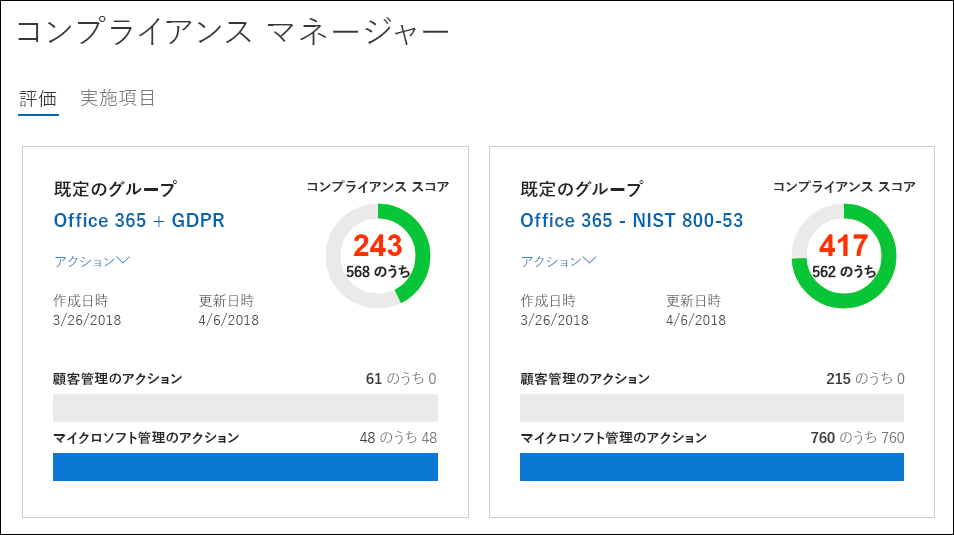
  
**[Office 365 - GDPR]** 評価をクリックして、フィルター コントロールを使用し、GDPR コントロール 6.10.1.2 を表示します。関連コントロールとして、NIST 800-53 コントロール SC-13 が表示されていることが確認できます。By clicking the **Office 365 - GDPR** assessment, and using the filter controls to view GDPR control 6.10.1.2, we see that NIST 800-53 control SC-13 is listed as a related control.
  
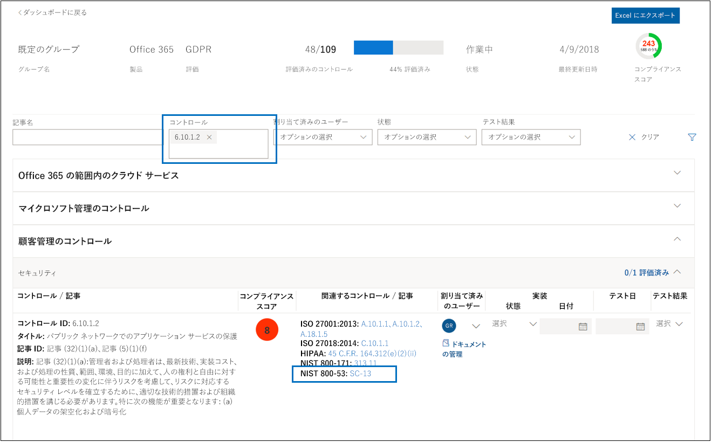
  
 ここでは、GDPR コントロール 6.10.1.2 の実装とテストが完了していることを示しています。Here we show the completion of the implementation and testing of GDPR control 6.10.1.2. 
  
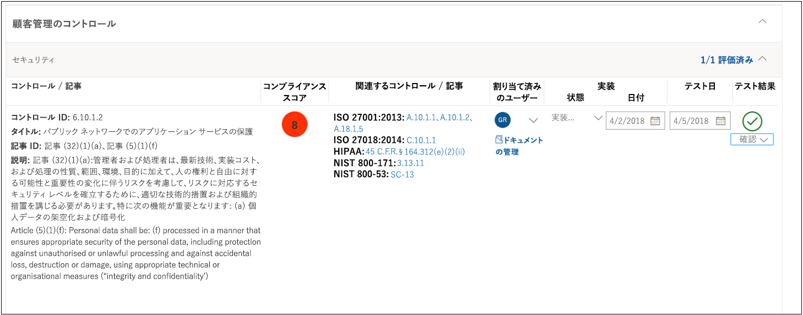
  
グループ化された評価内の関連コントロールに移動すると、NIST 800-53 SC-13 も同じ日時で完了済みとして記録されていることが確認できます。その他の実装やテストの作業は必要ありません。By navigating to the related control in the grouped assessment, we see that NIST 800-53 SC-13 has also been marked as completed with the same date and time, with no additional implementation or testing effort.
  
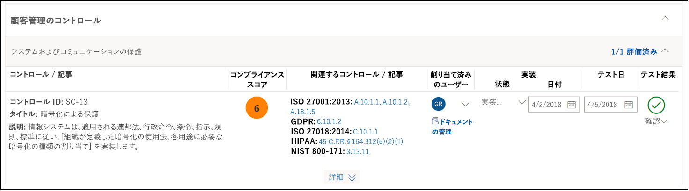
  
ダッシュボードに戻ると、各評価で 1 つのコントロール評価が完了しており、各評価のコンプライアンス スコアの合計が 8 (その共有コントロールのコンプライアンス スコア値) 増えていることが確認できます。Back at the Dashboard, we can see that each assessment has 1 control assessment completed and that the total Compliance Score for each assessment has increased by 8 (the compliance score value of that shared control).
  
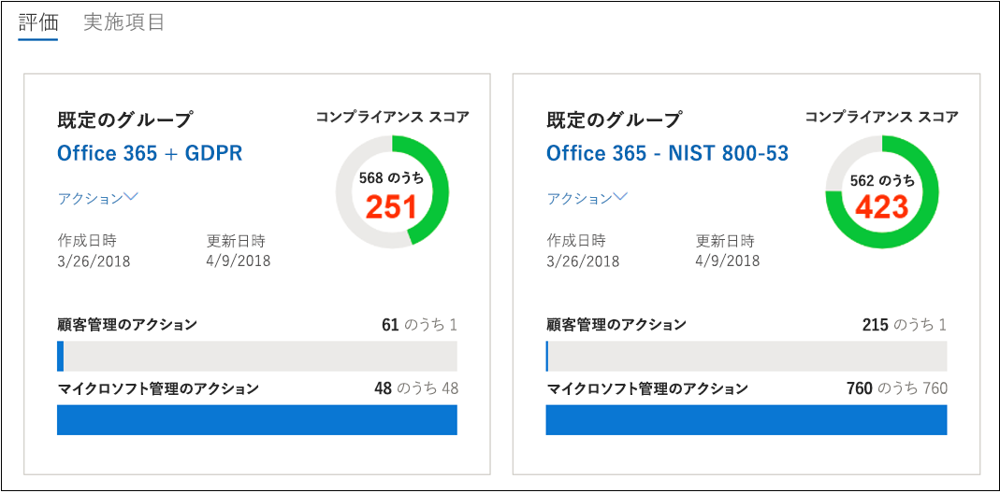

## 管理機能Administrative functions

テナント管理者アカウントでのみ使用できる特定の管理機能があり、グローバル管理者としてログインした場合にのみ表示されます。There are specific administrative functions that are only available to the tenant administrator account, and will only be visible when logged in as a global administrator.
  
> [!NOTE]
> 管理者はドロップダウン リストの [制限付きドキュメントへのアクセス] アクセス許可を使用して、マイクロソフトが Service Trust Portal で共有する制限付きドキュメントへのアクセスをユーザーに許可できます。制限付きドキュメントの機能は現在使用できませんが、近日中にリリースされる予定です。The Access to Restricted Documents permission in the drop-down list will allow administrators to give users access to restricted documents that Microsoft shares on the Service Trust Portal. The Restricted Documents feature isn't available, but is coming soon. 
  
### コンプライアンス マネージャーのロールをユーザーに割り当てるAssigning Compliance Manager roles to users

コンプライアンス マネージャーの各ロールのアクセス許可は、少し異なります。Service Trust Portal を使用すると、各ロールに割り当てられているアクセス許可を表示したり、どのユーザーがどのロールに属しているかを確認したりすることができます。ロールへのユーザーの追加、あるいはロールからのユーザーの削除も行えます。これを実行するには、**[管理]** メニュー項目を選択し、**[設定]** を設定します。Each Compliance Manager role has slightly different permissions. You can view the permissions assigned to each role, see which users are in which roles, and add or remove users from that role through the Service Trust Portal by selecting the **Admin** menu item, and then choosing **Settings**. 
  
![STP 管理者メニュー - [設定] を選択済み](media/65a82b1b-d462-452f-988b-7e4263bd638e.png)
  
コンプライアンス マネージャーのロールにユーザーを追加したり、ロールからユーザーを削除したりするには、次の操作を行います。To add or remove users from Compliance Manager roles.
  
1. [https://servicetrust.microsoft.com](https://servicetrust.microsoft.com) に移動します。Go to [https://servicetrust.microsoft.com](https://servicetrust.microsoft.com).
    
2. Azure Active Directory 全体管理者アカウントでサインインします。Sign in with your Azure Active Directory global administrator account.
    
3. Service Trust Portal のトップ メニュー バーで、**[管理]** を選択してから、**[設定]** を選択します。On the Service Trust Portal top menu bar, click **Admin** and then choose **Settings**. 
    
4. **[ロールの選択]** ドロップダウン リストで、管理するロールをクリックします。In the **Select Role** drop-down list, click the role that you want to manage. 
    
5. 各ロールに追加されたユーザーは、**[ロールの選択]** ページに一覧表示されます。Users added to the each role are listed on the **Select Role** page. 
    
6. このロールにユーザーを追加するには、**[追加]** をクリックします。**[ユーザーの追加]** ダイアログ ボックスで [ユーザー] フィールドをクリックします。使用可能なユーザーの一覧をスクロールしたり、ユーザー名を入力して検索語句に基づいて一覧をフィルター処理したりすることができます。そのロールでプロビジョニングするには、ユーザー名をクリックして、**[ユーザーの追加]** 一覧にそのアカウントを追加します。複数のユーザーを同時に追加する場合は、ユーザー名を入力して一覧をフィルター処理します。その後、ユーザーをクリックして一覧にユーザーを追加します。追加したユーザーに対して選択したロールのプロビジョニングを行うには、**[保存]** をクリックします。To add users to this role, click **Add**. In the **Add Users** dialog, click the user field. You can scroll through the list of available users or begin typing the user name to filter the list based on your search term. Click the user to add that account to the **Add Users** list to be provisioned with that role. If you would like to add multiple users concurrently, begin typing a user name to filter the list, and then click the user to add to the list. Click **Save** to provision the selected role to these users. 
    
    
  
7. このロールからユーザーを削除するには、ユーザーを選択し、**[削除]** をクリックします。To remove users from this role, select the user(s) and click **Delete**. 
    
    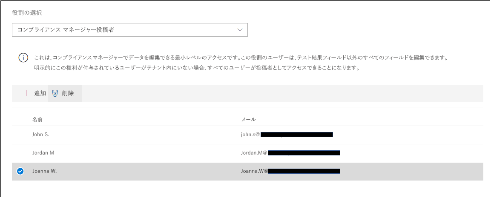
 
## ユーザー プライバシーの設定User Privacy settings

一部の規制に関しては、組織がユーザーの履歴データを削除できるようにする必要があります。これを有効にするために、コンプライアンス マネージャーでは**ユーザー プライバシーの設定**機能が用意されており、管理者は次の操作を行うことができます。Certain regulations require that an organization must be able to delete user history data. To enable this, Compliance Manager provides the **User Privacy Settings** functions, that allow administrators to: 
  
- [ユーザーの検索Search for a user](#search-for-a-user)

- [アカウント データ履歴のレポートのエクスポートExport a report of account data history](#export-a-report-of-account-data-history)

- [実施項目の再割り当てReassign action items](#reassign-action-items)

- [ユーザー データの履歴の削除Delete user data history](#delete-user-data-history)
    
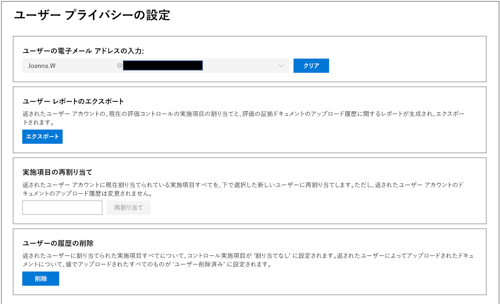
  
### ユーザーの検索Search for a user

ユーザー アカウントを検索するには、次のようにします。To search for a user account:
  
1. エイリアス (@ 記号の左側の情報) を入力し、右側のドメイン サフィックス リストをクリックすることでドメイン名を選択し、ユーザー メール アドレスを入力します。Enter the user email address by typing in the alias (the information to the left of the @ symbol) and choosing the domain name by clicking on the domain suffix list on the right. If this is tenant with multiple registered domains, you can double check the email address domain name suffix to ensure that it is correct. これが複数の登録されたドメインを含むテナントの場合、メール アドレスのドメイン名サフィックスを確認すると、これが正しいことを確認できます。If this is tenant with multiple registered domains, you can double check the email address domain name suffix to ensure that it is correct.
    
2. ユーザー名を正しく入力したら、**[検索]** をクリックします。When you have the username correctly entered, click **Search**. 
    
3. ユーザー アカウントが見つからない場合は、'ユーザーが見つかりませんでした' というエラー メッセージがページ上に表示されます。もう一度試すには、ユーザーのメール アドレス情報を確認して、必要に応じて修正を行い、**[検索]** をクリックします。If the user account is not found, the error message 'User not found' will be displayed on the page. Check the user's email address information, make corrections as necessary and click **Search** to try again. 
    
4. ユーザー アカウントが見つかった場合、ボタンのテキストは **[検索]** から **[クリア]** に変更されます。これは、返されたユーザー アカウントは以下に示される追加機能の操作のコンテキストであり、この追加機能を実行すると、このユーザー アカウントに適用されることを示します。If user account is found, the text of the button will change from **Search** to **Clear**, which indicates that the returned user account is the operating context for the additional functions that will be displayed below, that running those functions will apply to this user account. 
    
5. 検索結果をクリアして別のユーザーを検索するには、**[クリア]** ボタンをクリックします。To clear search results and search for a different user, click **Clear**. 
    
### アカウント データ履歴のレポートのエクスポートExport a report of account data history

ユーザー アカウントが識別されたら、このアカウントにリンクされている依存関係のレポートの生成が必要な場合があります。Once the user account has been identified, you may wish to generate a report of dependencies that exist linked to this account. This information will allow you to reassign open action items or ensure access to previously uploaded evidence. この情報によって、オープンのアクション アイテムを割り当てたり、前にアップロードされたエビデンスへのアクセス権を確保したりできます。This information allows you to reassign open action items or ensure access to previously uploaded evidence. 
  
 レポートを生成してエクスポートするには:To generate and export a report:
  
1. **[エクスポート]** をクリックして、現在、返されたユーザー アカウントに割り当てられているコンプライアンス マネージャーのアクション アイテムのレポート、およびそのユーザーによってアップロードされたドキュメントのリストを生成してダウンロードします。Click **Export** to generate and download a report of the Compliance Manager control action items currently assigned to the returned user account, as well as the list of documents uploaded by that user. If there are no assigned actions or uploaded documents, an error message will state "No data for this user". 割り当てられたアクションやアップロードされたドキュメントがない場合、"このユーザーのデータがありません" というエラー メッセージが表示されます。If there are no assigned actions or uploaded documents, an error message will state "No data for this user". 
    
2. レポートはアクティブなブラウザー ウィンドウのバックグラウンドでダウンロードされます。ダウンロードのポップアップが表示されない場合は、ブラウザーのダウンロード履歴を確認する必要があります。The report downloads in the background of the active browser window - if you don't see a download popup you want to check your browser download history.
    
3. ドキュメントを開いてレポート データを確認します。Open the document to review the report data.
    
> [!NOTE]
> このデータは、実施項目の割り当て履歴の変更状態を保持および表示する、履歴のレポートではありません。生成されたレポートは、レポート実行時 (レポートに書き込まれた日付と時刻のタイムスタンプ) に割り当てられたコントロールの実施項目のスナップショットです。たとえば、後で実施項目の再割り当てをすると、同じユーザー用にこのレポートが再度生成される場合は、スナップショット レポート データが異なります。This is not a historical report that retains and displays state changes to action item assignment history. The generated report is a snapshot of the control action items assigned at the time that the report is run (date and time stamp written into the report). For instance, any subsequent reassignment of action items will result in different snapshot report data if this report is generated again for the same user. 
  
### 実施項目の再割り当てReassign action items

この機能で、組織はユーザー アカウントのアクティブまたは未処理の依存関係を削除することができます。すべての実施項目の所有権 (アクティブと完了済みの実施項目の両方が含まれます) を、返されたユーザー アカウントから、以下で選択した新しいユーザーに再割り当てすると削除できるようになります。この操作では、返されたユーザー アカウントのドキュメントのアップロード履歴は変更されません。This function enables an organization to remove any active or outstanding dependencies on the user account by reassigning all action item ownership (which includes both active and completed action items) from the returned user account to a new user selected below. This action does not change document upload history for the returned user account. 
  
 他のユーザーに実施項目を再割り当てするには、次のようにします。To reassign action items to another user:
  
1. 参照する入力ボックスをクリックして、返されたユーザーの実施項目を割り当てる必要がある、組織内の別のユーザーを選択します。Click the input box to browse for and select another user within the organization to whom the returned user's action items should be assigned.
    
2. **[置換]** を選択して、コントロールの実施項目すべてを、返されたユーザーから新しく選択したユーザーに再割り当てします。Select **Replace** to reassign all control action items from the returned user to the newly selected user. 
    
3. 確認ダイアログ ボックスには次のように表示されます: “これによりすべてのコントロール アクションが現在のユーザーから選択したユーザーに再度割り当てられます。A confirmation dialog box appear stating "This will reassign all control action items from the current user to the selected user. This action cannot be undone. Are you sure you want to continue?" この操作は元に戻せません。This action cannot be undone. 続行してよろしいですか?"Are you sure you want to change it?"
    
4. 続行するには **[OK]** をクリックします。続行しない場合は **[キャンセル]** をクリックします。To continue click **OK**, otherwise click **Cancel**. 
    
> [!NOTE]
> すべての実施項目 (アクティブと完了済みの両方) が新しく選択したユーザーに割り当てられますが、この操作はドキュメントのアップロード履歴には反映されません。前に割り当てられたユーザーによってアップロードされたドキュメントには、前に割り当てられたユーザーの日時と名前が引き続き表示されます。All action items (both active and completed) will be assigned to the newly selected user. However, this action does not affect the document upload history; any documents uploaded by the previously assigned user will still show the date/time and name of the previously assigned user. 
  
前に割り当てられたユーザーを削除するためにドキュメントのアップロード履歴を変更するには、手動でプロセスを実行する必要があります。その場合、管理者は次のようにする必要があります。Changing the document upload history to remove the previously assigned user will have to be done as a manual process. In that case, the administrator will need to:
  
1. 以前にダウンロードしたエクスポート レポートを開きます。Open the previously downloaded Export report.
  
2. 目的のコントロールの実施項目を特定し、そこに移動します。Identify and navigate to the desired control action item.
  
3. **[ドキュメントの管理]** をクリックして、そのコントロールの証拠のリポジトリに移動します。Click **Manage Documents** to navigate to the evidence repository for that control. 
  
4. ドキュメントをダウンロードします。Download the document.
  
5. 証拠のリポジトリでドキュメントを削除します。Delete the document in the evidence repository.
  
6. ドキュメントを再度アップロードします。ドキュメントには、新しいアップロードの日付、時刻、アップロードしたユーザー名が反映されるようになります。Re-upload the document. The document will now have a new upload date, time and Uploaded By username. 
  
### ユーザー データの履歴の削除Delete user data history

この操作を行うと、返されたユーザーに割り当てられたすべての実施項目におけるコントロールの実施項目は '割り当てなし' の設定になります。また、返されたユーザーによってアップロードされたドキュメントに関する場合で、値によってアップロードされたものは '削除されたユーザー' として設定されます。This sets control action items to 'unassigned' for all action items assigned to the returned user. This also sets uploaded by value to 'user removed' for any documents uploaded by the returned user
  
 ユーザー アカウントの実施項目とドキュメントのアップロード履歴を削除するには、次のようにします。To delete the user account action item and document upload history:
  
1. **[削除]** をクリックします。Click **Delete**. 

    "これによりコントロールの実施項目すべての割り当てと、選択したユーザーのドキュメントのアップロード履歴が削除されます。この操作は元に戻すことができません。続行しますか?" というメッセージが確認ダイアログ ボックスに表示されます。A confirmation dialog will be displayed, stating "This will remove all control action item assignments and the document upload history for the selected user. This action cannot be undone. Are you sure you want to continue?"
    
3. 続行するには **[OK]** をクリックします。続行しない場合は **[キャンセル]** をクリックします。To continue click **OK**, otherwise click **Cancel**. 
  
## コンプライアンス マネージャーの使用Using Compliance Manager

コンプライアンス マネージャーには、コンプライアンスと、評価に関連するアクティビティの割り当て、追跡、記録ができるツールが用意されています。チーム間の障壁が少なくなり、組織のコンプライアンスの目標が達成しやすくなります。Compliance Manager provides you with tools to assign, track, and record compliance and assessment-related activities, and to help your organization cross team barriers to achieve your organization's compliance goals.
  
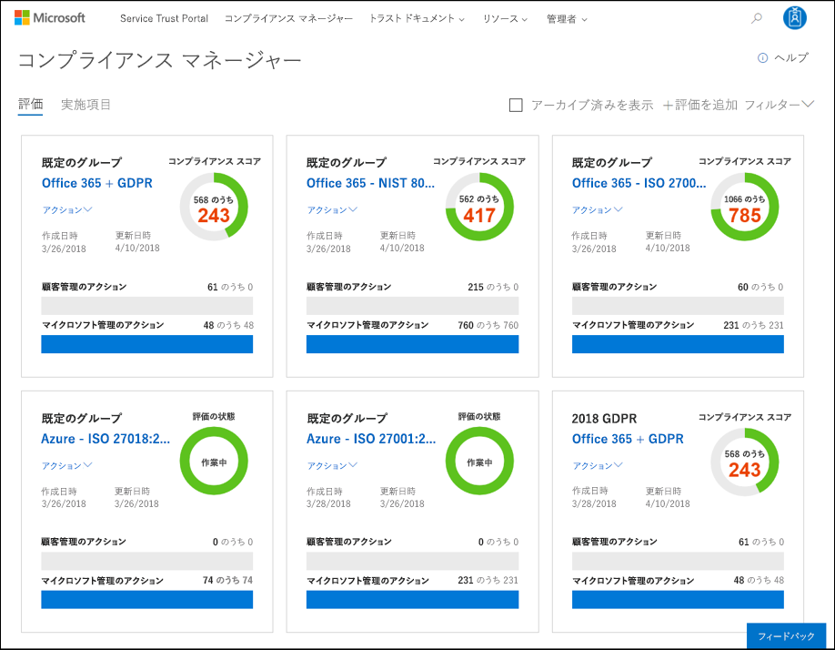

## コンプライアンス マネージャーへのアクセスAccessing Compliance Manager

コンプライアンス マネージャーには Service Trust Portal からアクセスします。Microsoft アカウントまたは Azure Active Directory の組織アカウントを持つすべてのユーザーがコンプライアンス マネージャーにアクセスできます。You access Compliance Manager from the Service Trust Portal. Anyone with a Microsoft account or Azure Active Directory organizational account can access Compliance Manager.
  

  
1. [https://servicetrust.microsoft.com](https://servicetrust.microsoft.com/) に移動します。Go to [https://servicetrust.microsoft.com](https://servicetrust.microsoft.com/).
    
2. Azure Active Directory (Azure AD) ユーザー アカウントでサインインします。Sign in with your Azure Active Directory (Azure AD) user account.
    
3. Service Trust Portal で、**[コンプライアンス マネージャー]** をクリックします。In the Service Trust Portal, click **Compliance Manager**. 
    
4. 秘密保持契約書が表示されたら、内容を確認し、**[同意する]** をクリックして続行します。これを実行するのは 1 回のみです。クリックすると、コンプライアンス マネージャーのダッシュボードが表示されます。When the Non-Disclosure Agreement is displayed, read it, and then click **Agree** to continue. You'll only have to do this once, and then the Compliance Manager dashboard is displayed. 

    作業を開始するために、既定で以下の Assessment を追加してあります。To get you started, we've added the following Assessments by default:
    
    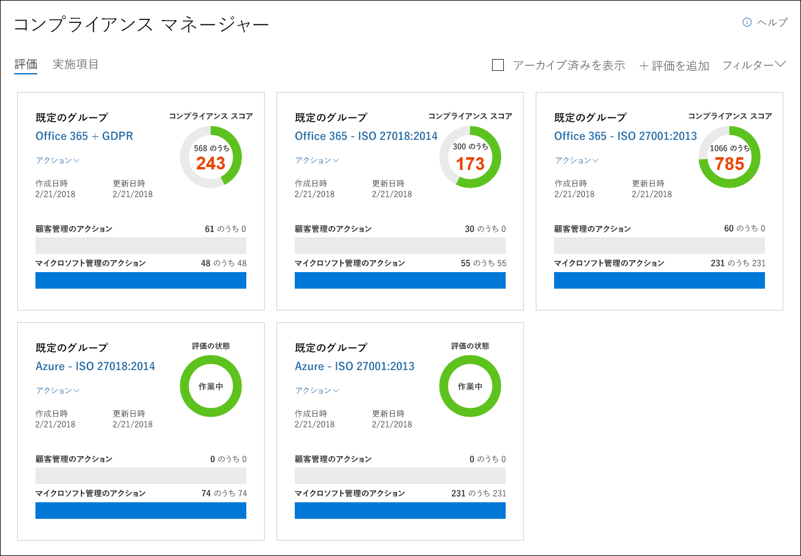
    
5. コンプライアンス マネージャーのショート ツアーを開始するには、![コンプライアンス マネージャーの [ヘルプ] アイコン](media/c1b3092f-6ac7-43ab-b1c4-63a54598450c.png) **[ヘルプ]** をクリックします。Click  **Help** to take a short tour of Compliance Manager. 
  
## 実施項目の表示Viewing action items

コンプライアンス マネージャーには、割り当てられているすべてのコントロール評価アクション アイテムが表示される便利なビューが用意されているため、迅速かつ簡単にアクション アイテムを実行できます。Compliance Manager provides a convenient view of all your assigned control assessment action items, enabling you to quickly and easily take action on them. すべてのアクション アイテムを表示したり、特定の証明書に対応するアクション アイテムを選択したりすることができます。これを実行するには、その評価に関連するタブをクリックします。You can view all action items or select the action items that correspond with a specific certification by clicking the tab associated with that assessment. たとえば、次の図では [GDPR] タブが選択されており、その GDPR 評価に関連するコントロールが表示されています。For instance, in the image below, the GDPR tab has been selected, showing controls that related to the GDPR assessment.
  
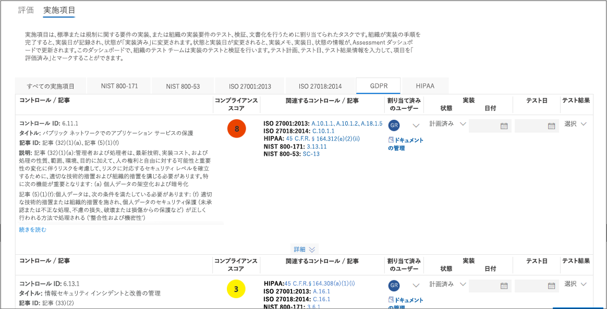
  
実施項目を表示するには、次のようにします。To view your action items:
  
1. コンプライアンス マネージャーのダッシュ ボードに移動します。Go to the Compliance Manager dashboard
    
2. **[実施項目]** リンクをクリックすると、ページが更新され、自分に割り当てられている実施項目が表示されます。Click the **Action Items** link, and the page will refresh to show the action items that have been assigned to you. 
    
    既定では、すべての実施項目が表示されます。複数の証明書に実施項目がある場合は、評価コントロールの上のタブに証明書の名前が表示されます。特定の証明書の実施項目を表示するには、そのタブをクリックします。By default, all action items are shown. If you have action items across multiple certifications, the names of the certifications will be listed in tabs across the top of the assessment control. To see the action items for a specific certification, click that tab.

## Assessment の追加Adding an Assessment

コンプライアンス マネージャーに Assessment を追加するには、次のようにします。To add an Assessment to Compliance Manager:
  
1. コンプライアンス マネージャーのダッシュボードで、![[追加] アイコン](media/ITPro-EAC-AddIcon.gif) **[Assessment の追加]** をクリックします。In the Compliance Manager dashboard, click  **Add Assessment**. 
    
2. **[Assessment の追加]** ウィンドウでは、新しいグループを作成して Assessment を追加したり、既存のグループに追加したりすることができます (組み込みのグループ名は "初期グループ" です)。選択したオプションに応じて、新しいグループの名前を入力するか、ドロップダウン リストから既存のグループを選択します。詳細については、「[Assessment のグループ化](#grouping-assessments)」を参照してください。In the **Add an Assessment** window, you can create a new group to add the Assessment to or you can add it to an existing group (the built-in group is named "Initial Group".) Depending on the option you choose, either type the name of a new group or select an existing group from the drop-down list. For more information, see [Grouping Assessments](#grouping-assessments).
    
    グループを作成する場合、既存のグループの情報を新しい Assessment にコピーすることもできます。If you create a group, you also have the option to copy information from an existing group to the new Assessment. つまり、コピー元のグループの Assessment の [実装の詳細] フィールドと [テスト計画と管理の反応] フィールドに追加されたすべての情報が、新しい Assessment の同じ (または関連する) 顧客管理のコントロールにコピーされます。That means any information that was added to the Implementation Details and Test Plan and Management Response fields of customer-managed controls from Assessments in the group that you're copying from are copied to the same (or related) customer-managed controls in the new Assessment. 既存のグループに新しい Assessment を追加する場合、そのグループの Assessment の共通する情報が新しい Assessment にコピーされます。If you're adding a new Assessment to an existing group, common information from Assessments in that group will be copied to the new Assessment. 詳細については、「[既存の Assessment から情報をコピーする](#copying-information-from-existing-assessments)」を参照してください。For more information, see [Copying information from existing Assessments](#copying-information-from-existing-assessments).
    
3. **[次へ]** をクリックし、以下のことを行います。Click **Next**, and do the following:
    
    a. a. Microsoft クラウド サービスを選択して、**[製品の選択]** ドロップダウン リストからコンプライアンスを評価します。a. Choose a Microsoft cloud service to assess for compliance from the **Select a product** drop down list. 
    
    b. b. **[証明書の選択]** ドロップダウン リストから、選択したクラウド サービスを評価する証明書を選択します。b. Choose a certification to assess the selected cloud service against from the **Select a certification** drop down list. 
    
4. **[ダッシュボードに追加]** をクリックして、Assessment を作成します。評価は、既存のタイル一覧の最後に新しいタイルとしてコンプライアンス マネージャーのダッシュボードに追加されます。Click **Add to Dashboard** to create the Assessment; the assessment will be added to the Compliance Manager dashboard as a new tile at the end of the list of existing tiles. 
    
    コンプライアンス マネージャーのダッシュボードの**Assessment タイル**には、評価グループ、評価の名前 (サービス名と選択した証明書の組み合わせとして自動的に作成されます)、作成日と最終変更日、コンプライアンス スコアの合計 (実装およびテストして合格した割り当て済みコントロールのリスク値すべての合計)、評価されたコントロールの数を示す進捗状況インジケーター (下部) が表示されます。The **Assessment Tile** on the Compliance Manager dashboard, displays the assessment grouping, the name of the assessment (automatically created as a combination of the Service name and the certification selected), the date it was created and when it was last modified, the Total Compliance Score (which is the sum of all of the assigned control risk values that have been implemented, tested and passed), and progress indicators along the bottom that show the number of controls that have been assessed. 
    
5. Assessment 名をクリックして開き、Assessment の詳細を表示します。Click the Assessment name to open it, and view the details of the Assessment.
    
6. **[アクション]** メニューをクリックして、割り当て済みの実施項目の表示、評価グループの名前の変更、評価レポートのエクスポート、または評価のアーカイブを行います。Click on the **Actions** menu to view your assigned action items, rename the assessment group, export the assessment report, or archive the assessment. 
    
    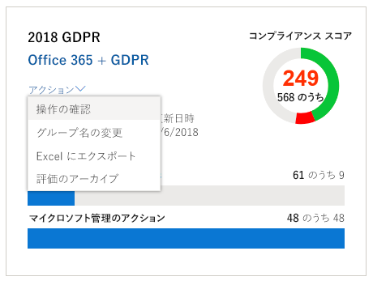

## 既存の Assessment から情報をコピーするCopying information from existing Assessments

前述のように、評価グループを作成する場合、既存のグループの Assessment から新しいグループの新しい Assessment に情報をコピーできます。As previously explained, when you create an assessment group, you have the option to copy information from Assessments in an existing group to the new Assessment in the new group. そのため、完了した評価とテストの作業を、新しい Assessment の同じ顧客管理のコントロールに適用できます。This allows you to apply the assessment and testing work that's been completed to the same customer-managed controls in the new Assessment. たとえば、組織内のすべての GDPR に関連する Assessment グループがある場合、グループに新しい Assessment を追加するときに、既存の評価作業から共通の情報をコピーできます。For example, if you have a group for all GDPR-related Assessments in your organization, you can copy common information from existing assessment work when add a new Assessment to the group.
  
お客様から新しい Assessment に次の情報をコピーすることができます。You can copy the following information from customer to a new Assessment:
  
- Assessment ユーザー。Assessment ユーザーは、コントロールが割り当てられているユーザーです。Assessment Users. An Assessment user is a user who the control is assigned to.
    
- 状態、テスト日、テスト結果。Status, Test Date, and Test Results.
    
- 実装の詳細とテスト計画の情報。Implementation details and test plan information.
    
同様に、同じ Assessment グループ内の共有顧客管理のコントロールの情報も同期されます。Similarly, information from shared customer-managed controls within the same Assessment group is synchronized. また、同じ Assessment 内の関連する顧客管理のコントロールの情報も同期されます。And information in related customer-managed controls within the same Assessment is also synchronized.

## Assessment の表示Viewing Assessments

1. 表示したい評価に対応する Assessment タイルを見つけて、評価名をクリックして開くと、その Assessment に関連付けられたマイクロソフト管理のコントロールと顧客管理のコントロールが、Assessment の範囲内のクラウド サービスの一覧と共に表示されます。Locate the Assessment Tile corresponding to the assessment you wish to view, then click the assessment name to open it and view the Microsoft and customer managed controls associated with the Assessment, along with a list of the cloud services that are in-scope for the Assessment. Here's an example of the Assessment for Office 365 and GDPR. 以下は、Office 365 と GDPR の Assessment の例です。Here's an example of the Assessment for Office 365 and GDPR.
    
    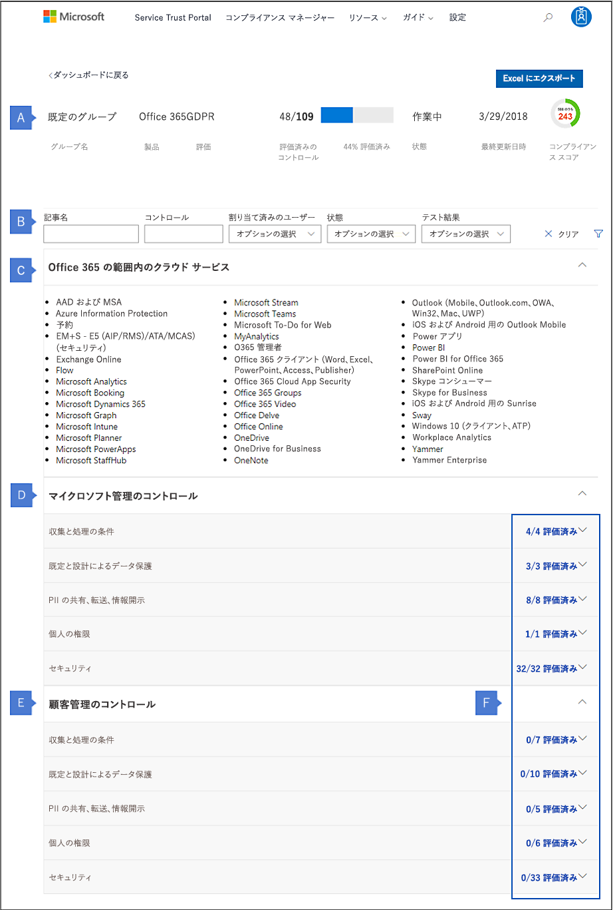
  
1. このセクションには、Assessment グループの名前、製品、Assessment 名、評価コントロールの数など、Assessment の要約情報が表示されます。This section shows the Assessment summary information, including the name of the Assessment Grouping, Product, Assessment name, number of Assess controls
    
2. このセクションには、Assessment フィルター コントロールが表示されます。Assessment フィルター コントロールの使用方法の詳細については、「[評価プロセスの管理](#managing-the-assessment-process)」セクションを参照してください。This section shows the Assessment Filter controls. For a more detailed explanation of how to use the Assessment Filter controls see the [Managing the assessment process](#managing-the-assessment-process) section. 
    
3. このセクションには、評価の範囲内のそれぞれのクラウド サービスが表示されます。This section shows the individual cloud services that are in-scope for the assessment.
    
4. このセクションには、マイクロソフト管理のコントロールが含まれます。This section contains Microsoft-managed controls. 関連するコントロールは、コントロール ファミリー別にまとめられています。Related controls are organized by control family. コントロール ファミリーをクリックして展開すると、個々のコントロールが表示されます。This section contains customer managed controls, which are also organized by control family. Click a control family to expand it and display individual controls.
    
5. このセクションには、顧客管理のコントロールが含まれます。これもコントロール ファミリー別にまとめられています。This section contains customer-managed controls, which are also organized by control family. コントロール ファミリーをクリックして展開すると、個々のコントロールが表示されます。This section contains customer managed controls, which are also organized by control family. Click a control family to expand it and display individual controls.
    
6. コントロール ファミリーのコントロールの合計数と、評価されているコントロールの数が表示されます。Displays the total number of controls in the control family, and how many of those controls have been assessed. コンプライアンス マネージャーの重要な機能は、顧客管理のコントロールの評価の組織の進捗状況を追跡することです。A key capability of Compliance Manager is tracking your organization's progress on assessing the customer-managed controls. 詳細については、「[コンプライアンス スコアの概要](#understanding-the-compliance-score)」を参照してください。For more information, see the [Understanding the Compliance Score](#understanding-the-compliance-score) section. 

## 評価プロセスの管理Managing the assessment process

最初の Assessment の作成者は Assessment ユーザーのみです。The creator of an Assessment is initially the only Assessment User. 顧客管理の各コントロールについて、組織内のユーザーにアクション アイテムを割り当て、そのユーザーを推奨される顧客アクションの実行およびエビデンスの収集とアップロードが可能な Assessment ユーザーにできます。For each customer-managed control, you can assign an Action Item to a person in your organization so that person becomes an Assessment User who can perform the recommended Customer Actions, and gather and upload evidence. アクション アイテムを割り当てると、推奨される顧客アクションとアクション アイテムの優先度などの詳細を含むメールをそのユーザーに送信するよう選択できます。When you assign an Action Item, you can choose to send an email to the person that contains details including the recommended Customer Actions and the Action Item priority. メール通知には、**[アクション アイテム]** ダッシュボードへのリンクが含まれます。このダッシュボードでは、そのユーザーに割り当てられているすべてのアクション アイテムが一覧表示されます。The email notification includes a link to the **Action Items** dashboard, which lists all Action Items assigned to that person. 
  
ここでは、コンプライアンス マネージャーのワークフロー機能を使用して実行できるタスクを一覧表示しています。Here's a list of tasks that you can perform using the workflow features of Compliance Manager.
  
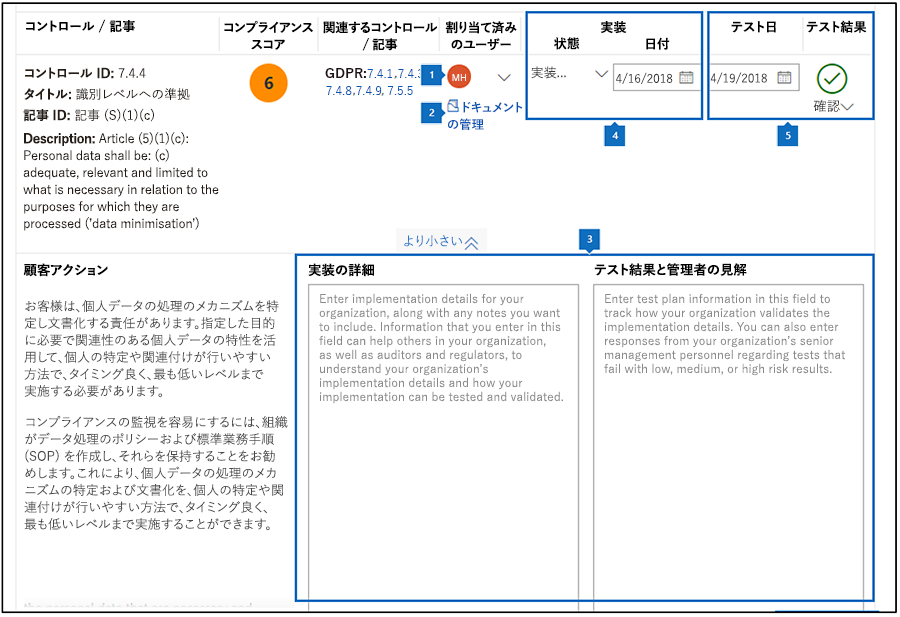
  
1. **フィルター オプションを使用して特定の評価コントロールを見つける** - コンプライアンス マネージャーには、**フィルター オプション**が用意されています。これにより、評価コントロールを表示するための詳細な選択基準に基づいて、コンプライアンス作業の特定分野を正確に見極めることができます。**Use the Filter Options to find specific assessment controls** - Compliance Manager provides **Filter Options**, giving you highly granular selection criteria for displaying assessment controls, helping you to precisely target specific areas of your compliance efforts. 
    
    **[フィルター オプション]** コントロールの表示または非表示を切り替えるには、ページの右側にあるじょうごアイコンをクリックします。Click the funnel icon on the right-hand side of the page to show or hide the **Filter Options** controls. これらのコントロールを使用すると、フィルター条件を指定できるため、条件を満たす評価コントロールだけが下部に表示されます。Click on the funnel icon on the right hand side of the page to show or hide the Filter Options controls. These controls allow you to specify filter criteria, and only the assessment controls that fit those criteria will be displayed below. Compliance Manager Assessments filter controls 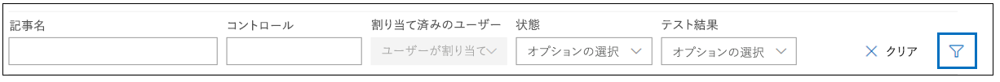
  
    - **条項** - 条項名をフィルター処理し、その条項に関連付けられている評価のコントロールを返します。**Articles** - filters on the article name and returns the assessment controls associated to that article. たとえば、"条項 (5)" と入力すると、名前にその文字列が含まれる条項の選択リストが返されます (条項 (5)(1)(a)、条項 (5)(1)(b)、条項 (5)(1)(c) など)。条項 (5)(1)(c) を選択すると、条項 (5)(1)(c) に関連付けられているコントロールが返されます。For instance, typing in "Article (5)" returns a selection list of articles whose name includes that string, i.e. Article (5)(1)(a), Article (5)(1)(b), Article (5)(1)(c), etc. Selecting Article (5)(1)(c) will return the controls associated with Article (5)(1)(c). これは、OR 演算子を複数の値と共に使用する複数選択フィールドです。たとえば、条項 (5)(1)(a) を選択してから、条項 (5)(1)(c) を追加すると、条項 (5)(1)(a) または条項 (5)(1)(c) に関連付けられているコントロールが返されます。This is multiselect field that uses an OR operator with multiple values — for instance, if you select Article (5)(1)(a) and then add Article (5)(1)(c), the filter will return controls associated with either Article (5)(1)(a) or Article (5)(1)(c). 
    
      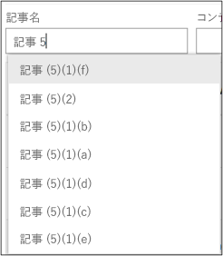
  
    - **コントロール** - フィルターに一致する名前を持つコントロールの一覧を返します。たとえば、7.3 と入力すると、7.3.1、7.3.4、7.3.5 などの項目の選択リストが返されます。これは、OR 演算子を複数の値と共に使用する複数選択フィールドです。たとえば、7.3.1 を選択してから、7.3.4 を追加すると、7.3.1 または 7.3.4 に関連付けられているコントロールが、フィルターによって返されます。**Controls** - returns the list of controls whose names fit the filter, i.e. typing in 7.3 returns a selection list of items like 7.3.1, 7.3.4, 7.3.5, etc. This is multiselect field that uses an OR operator with multiple values -- for instance, if you select 7.3.1 and then add 7.3.4, the filter will return controls associated with either 7.3.1 or 7.3.4. 
    
      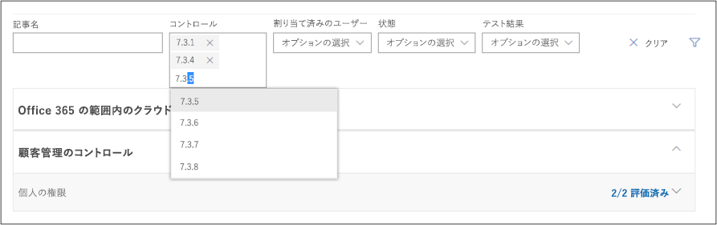
  
    - **割り当て済みのユーザー** - 選択したユーザーに割り当てられているコントロールの一覧を返します。**Assigned Users** - returns the list of controls who are assigned to the selected user. 
    
    - **状態** - 選択した状態のコントロールの一覧を返します。**Status** - returns the list of controls with the selected status. 
    
    - **テスト結果** - 選択したテスト結果を持つコントロールの一覧を返します。**Test Result** - returns the list of controls with the selected test result. 
    
    フィルター条件を適用すると、フィルター条件に応じて、該当するコントロールの表示が変更されます。コントロール ファミリーのセクションを展開すると、コントロールの詳細が下に表示されます。As you apply filter conditions, the view of applicable controls will change to correspond to your filter conditions. Expand the control family sections to show the control details below. 
    
    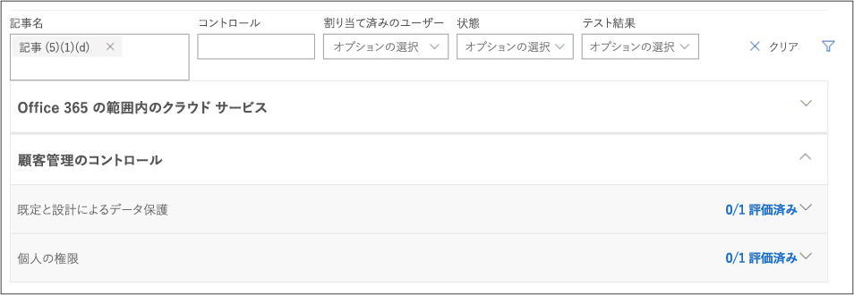
  
2. 目的のフィルターを選択しても、結果が表示されない場合は、指定したフィルター条件に該当するコントロールがないことを意味します。たとえば、**[割り当て済みのユーザー]** で特定のユーザーを選択して、**[コントロール]** でそのユーザーに割り当てられていないコントロール名を選択すると、下のページには評価が表示されません。If after selecting the desired filters no results are shown, that means there are no controls that correspond to the specified filter conditions. For instance, if you select a particular **Assigned User** and then choose a **Control** name that does correspond to the control assigned to that user, no assessments will be shown in the page below. 
    
3. **ユーザーへの実施項目の割り当て** - 実施項目を担当者に割り当てて、証明書/規則の要件の実装や、組織の実装要件のテスト、検証、文書化などができます。実施項目を割り当てると、推奨される顧客アクションと実施項目の優先度などの詳細が記載されたメールをその担当者に送信できるようになります。実施項目の割り当てを解除したり、別の担当者に再割り当てしたりすることもできます。**Assign an Action Item to a user** - You can assign an Action Item to a person to implement the requirements of a certification/regulation, or to test, verify, and document your organization's implementation requirements. When you assign an Action Item, you can choose to send an email to the person that contains details including the recommended Customer Actions and the Action Item priority. You can also unassign or reassign an Action Item to a different person. 
    
4. **ドキュメントの管理** - 顧客管理のコントロールには、タスクの実装、タスクのテストおよび検証に関連するドキュメントを管理する場所もあります。**Manage documents** - Customer-managed controls also have a place to manage documents that are related to performing implementation tasks and for performing testing and validation tasks. コンプライアンス マネージャーでデータを編集する権限を持つすべてのユーザーは、**[ドキュメントの管理]** をクリックすることでドキュメントをアップロードできます。Anyone with permissions to edit data in Compliance Manager can upload documents by clicking **Manage Documents**. ドキュメントのアップロード後、**[ドキュメントの管理]** をクリックしてファイルを表示およびダウンロードできます。After a documented has been uploaded, you can click **Manage Documents** to view and download files. 
    
5. **実装およびテスト詳細の入力** - すべての顧客管理のコントロールには編集可能なフィールドがあります。ユーザーはそのフィールドに実装の詳細を入力して、証明書や規則の要件を満たすために組織が行った手順を文書化したり、組織がどのように要件を満たしているかを検証したりできます。**Provide implementation and testing details** - Every customer managed control has an editable field where users can add implementation details that document the steps taken by your organization to meet the requirements of the certification/regulation, and to validate and document how your organization meets those requirements.
    
6. **状態の設定** - 評価プロセスの一環として、各項目の状態を設定します。使用できるステータスの値は、**実装済み**、**別の実装**、**計画済み**、**範囲外** です。**Set Status** - Set the Status for each item as part of the assessment process. Available status values are **Implemented**, **Alternative Implementation**, **Planned**, and **Not in Scope**. 
    
7. **テスト日とテスト結果の入力** - コンプライアンス マネージャー評価者ロールのユーザーは、適切なテストが実施されたことを検証し、実装の詳細、テスト計画、テスト結果、およびアップロードされたエビデンスをレビューし、[テスト日] および [テスト結果] を設定します。**Enter test date and test result** - The person with the Compliance Manager Assessor role can verify that proper testing performed, review the implementation details, test plan, test results, and any uploaded evidence, and then set the Test Date and Test Result. Available test result values are Passed, Failed-Low Risk, Failed-Medium Risk, and Failed-High Risk. 使用可能なテスト結果の値は、**[成功]**、**[失敗 - リスク低]**、**[失敗 - リスク中]**、および **[失敗 - リスク高]** です。Available test result values are **Passed**, **Failed-Low Risk**, **Failed-Medium Risk**, and **Failed-High Risk**. 

## アクション アイテムの管理Managing action items

組織内で評価プロセスに関与しているユーザーは、コンプライアンス マネージャーを使用して、使用するすべての Assessment からユーザー管理のコントロールをレビューできます。The people involved in the assessment process in your organization can use Compliance Manager to review the customer-managed controls from all Assessments for which they are users. ユーザーがコンプライアンス マネージャーにサインインし、**[アクション アイテム]** ダッシュボードを開くと、割り当てられているアクション アイテムのリストが表示されます。When a user signs in to Compliance Manager and opens the **Action Items** dashboard, a list of Action Items assigned to them is displayed. ユーザーに割り当てられているコンプライアンス マネージャー ロールによっては、実装またはテストの詳細の入力、ステータスの更新、アクション アイテムの割り当てを行うことができます。Depending on the Compliance Manager role assigned to the user, they can provide implementation or test details, update the Status, or assign Action Items. 
  
証明書のコントロールの実装とテストは通常、それぞれ異なる担当者によって行われるため、初めは実装を行う人にコントロールの実施項目を割り当てることができます。実装が完了すると、その人は、コントロールのテストと、証拠のアップロードを行う次の担当者にコントロールの実施項目を再割り当てすることができます。このコントロール操作の割り当て/再割り当ては、多くのアクセス許可を持つ、コンプライアンス マネージャーの役割を持つユーザーが実行できます。これにより、コントロール割り当ての集中管理や、実装者からテスト担当者への、コントロール実施項目の適切な分散ルーティングが可能になります。As certification controls are generally implemented by one person and tested by another, the control action item can be initially assigned to one person for implementation, and once that is complete, that person can reassign the control action item to the next person for control testing and uploading of evidence. This assignment/reassignment of control actions can be performed by any users who have a Compliance Manager role with sufficient permissions, allowing for central management of control assignments, or decentralized routing of control action items, from implementer to tester as appropriate.
  
実施項目を割り当てるには、次のようにします。To assign an action item:
  
1. コンプライアンス マネージャーのダッシュボードで、操作する評価の評価タイルを見つけて、評価名をクリックし、評価の詳細ページに移動します。On the Compliance Manager dashboard, locate the assessment tile of the assessment you wish to work with and click on the name of the assessment to go to the assessment details page.
    
2. **[フィルター]** をクリックし、フィルター コントロールを使用して、割り当てる特定の評価コントロールを検索します。または、You can click **Filter** and use the filter controls to find the specific assessment control you wish to assign, or 
    
3. 顧客管理のコントロールのセクションまで下にスクロールして、コントロール ファミリーを展開し、割り当てる評価が見つかるまで、評価コントロールのリストをスクロールします。Scroll down to the Customer Managed Controls section, expand the control family, and scroll through the list of control until you have located the assessment control to be assigned
    
4. **[割り当て済みのユーザー]** の列で、**[割り当て]** をクリックします。Under the **Assigned User** column, click **Assign**. 
    
5. **[実施項目の割り当て]** ダイアログ ボックスで、[割り当て先] フィールドをクリックして、操作を割り当てることができるユーザーのリストを設定します。リストをスクロールして対象のユーザーを見つけるか、フィールドへの入力を行ってユーザー名を検索します。In the Assign Action Item dialog box, click the **Assign To** field to populate the list of users to whom the action can be assigned. You can scroll through the list to find the target user or start typing in the field to search for the username. 
    
6. この実施項目を割り当てるユーザーをクリックします。Click the user to assign them this action item.
    
7. ユーザーにメール通知を送信する場合は、**[メール通知を送信する]** チェック ボックスがオンになっていることを確認します。If you wish to send an email notification to the user notifying them, ensure that the **Send Email Notification** checkbox is checked. 
    
8. そのユーザーに表示するメモの内容を入力し、**[割り当て]** をクリックします。Type any notes you wish to be displayed to that user and click **Assign**. 
 
    割り当てられたユーザーは、実施項目の割り当てに関する通知と、前の操作で入力したメモを受け取ります。The user will receive notification of their action item assignment and any notes you have provided.
    
実施項目に関連するメモは、[メモ] セクションに保存されるため、次に実施項目を割り当てるときに使用できます。これらのメモは読み取り専用ではないため、実施項目を割り当てる人は、編集、置換、削除の操作を行えます。The notes that are associated with the action item are persisted in the notes section, available for the next time the action item is assigned. These notes are not read-only, can be edited, replaced or removed by the person assigning the action item.

## Assessment から情報をエクスポートするExporting information from an Assessment

Assessment を Excel ファイルにエクスポートできます。これは、組織内のコンプライアンス関係者がレビューでき、監査人や規制機関に提供できます。You can export an Assessment to an Excel file, which can be reviewed by compliance stakeholders in your organization, and provided to auditors and regulators. この評価レポートは、レポートを作成した日時における評価のスナップショットです。これには、その評価のマイクロソフト管理のコントロールと顧客管理のコントロールの両方の詳細 (コントロールの実装状態、コントロールのテスト日、テストの結果など)、およびアップロードされたエビデンスのドキュメントへのリンクが含まれています。You can export an Assessment to an Excel file, which can be reviewed by compliance stakeholders in your organization, and provided to auditors and regulators. This assessment report is a snapshot of the assessment as of the date and time that the report is created, and it contains the details of both the Microsoft-managed controls and the customer managed controls for that assessment, including control implementation status, control test date and test results, and provides links to the uploaded evidence documents. It is recommended that you export the assessment report prior to archiving an assessment, as archived assessments do not retain their links to uploaded documents. 評価をアーカイブする前に、評価レポートをエクスポートすることをお勧めします。アーカイブされた評価にはアップロードされたドキュメントへのリンクが保持されていないためです。It is recommended that you export the assessment report prior to archiving an assessment, as archived assessments do not retain their links to uploaded documents.
  
Assessment レポートをエクスポートするには、次のようにします。To export an Assessment report:
  
- コンプライアンス マネージャーのダッシュボードで、エクスポートする評価のタイルの **[操作]** リンクをクリックし、**[Excel にエクスポート]** を選択します。On the Compliance Manager dashboard, click **Actions** on the tile of the assessment you wish to export, and then choose **Export to Excel**

  またはOr
    
- Assessment の詳細ページを表示している場合は、**[Excel にエクスポート]** ボタンをクリックします。ボタンは、評価のコンプライアンス スコアの上のページの右上隅にあります。If you are viewing the Assessment details page, click on the **Export to Excel** button, which is located in the upper right hand corner of the page above the assessment's Compliance Score.
    
評価レポートは、ブラウザー セッションでダウンロードされます。ダウンロードを通知するポップアップが表示されない場合は、ブラウザーのダウンロード フォルダーを確認する必要があります。The assessment report will be downloaded in your browser session. If you don't see a popup informing you of this, you may wish to check your browser's downloads folder.

## Assessment のアーカイブArchiving an Assessment

Assessment が完了し、コンプライアンスに使用する必要がない場合は、アーカイブできます。Assessment をアーカイブすると、Assessment ダッシュボードから削除されます。When you have completed an Assessment and no longer need it for compliance purposes, you can archive it. When an Assessment is archived, it is removed from Assessments dashboard.
  
> [!NOTE]
> Assessment のアーカイブ後は、'アーカイブされていない状態' にしたり、読み取り/書き込みの進行中の状態に戻したりすることはできません。アーカイブされた Assessment には、アップロードされた証拠のドキュメントへのリンクが反映されませんので、アーカイブ前に Assessment のエクスポートを実行することを強くお勧めします。エクスポートした評価レポートには、証拠のドキュメントへのリンクが記載されているため、レポートからドキュメントにアクセスすることができます。When an Assessment is Archived, it cannot be 'unarchived' or restored to a read-write in progress state. Please note that Archived Assessments do not retain their links to uploaded evidence documents, so it is highly recommended that you perform an Export of the Assessment before archiving it, as the exported assessment report will contain links to the evidence documents, enabling you to continue to access them. 
  
評価のアーカイブを行うには、次のようにします。To archive an assessment:
  
1. アーカイブしたい評価のダッシュボード タイルで、**[操作]** をクリックします。On the dashboard tile of the desired assessment, click **Actions**. 
    
2. **[Assessment のアーカイブ]** を選択します。Select **Archive Assessment**. 
 
    **[Assessment のアーカイブ]** ダイアログ ボックスが表示され、評価をアーカイブするかどうかの確認を求められます。The **Archive Assessments** dialog is displayed, asking you to confirm that you want to archive the assessment.
    
4. 続行してアーカイブする場合は **[アーカイブ]** をクリックし、アーカイブしない場合は **[キャンセル]** をクリックします。To continue with archiving, click **Archive**, or else click **Cancel**. 
    
アーカイブした Assessment を表示するには、次のようにします。To view archived Assessments:
  
1. コンプライアンス マネージャーのダッシュボードで、**[アーカイブ済みを表示]** チェック ボックスをオンにします。On the Compliance Manager dashboard, check the **Show Archived** checkbox. 
    
    アーカイブされた評価は、**アーカイブした評価**というタイトルが付いたバーの下の残りのアクティブな評価の下にある新しいセクションに表示されます。The archived assessments will appear in a newly visible section below the rest of the active assessments under a bar titled **Archived Assessments**.
    
3. 表示する評価の名前をクリックします。Click the name of the assessment you wish to view.
    
アーカイブした評価を表示しても、通常は編集できるコントロール (実装、テスト結果) はアクティブにならず、**[管理対象ドキュメント]** ボタンもありません。When viewing an archived assessment, none of the normally editable controls (i.e. Implementation, Test Results) will be active, and the **Managed Documents** button will be absent.

## 検索を使用するUsing search

  
ページの右上隅の虫眼鏡をクリックして検索入力フィールドを拡大し、検索用語を入力した後に Enter キーを押します。検索ウィンドウの入力フィールドに検索用語が入力された状態で、検索コントロールが表示され、その下に検索結果が表示されます。Click the magnifying glass in the upper right-hand corner of the page by to expand the Search input field, enter your search terms and press Enter. The Search control will appear, with the search term in the search pane input field, and search results will appear beneath.
  
既定では、検索はドキュメントの検索結果を返します。表示されるドキュメント一覧を絞り込むには、[フィルター] ドロップダウン リストを使用します。検索結果をビューに追加したり、ビューから削除したりすることができます。同時に複数のフィルター属性を使用すると、返されるドキュメントを、特定のクラウド サービス、コンプライアンスやセキュリティ プラクティスのカテゴリ、全世界の地域、業種などに絞り込むことができます。ドキュメントをダウンロードするには、ドキュメント名のリンクをクリックします。By default, Search returns Document results, and you can use the Filter By dropdown lists to refine the list of documents displayed, to add or remove search results from view. You can use multiple filter attributes at the same time to narrow the returned documents to specific cloud services, categories of compliance or security practices, regions of the world, or industries. Click the document name link to download the document.
  

  
コンプライアンス マネージャー評価コントロールの検索結果を表示するには、[コンプライアンス マネージャー] リンクをクリックします。Click on the Compliance Manager link to display Search results for Compliance Manager assessment controls. 表示された検索結果には、評価作成日、評価グループ名、該当するクラウド サービス、コントロールがマイクロソフト管理コントロールなのかそれとも顧客管理コントロールなのか、などが表示されます。Click on the Compliance Manager link to display Search results for Compliance Manager assessment controls. The listed search results show the date the assessment was created, the name of the assessment grouping, the applicable cloud service, and whether the controls is Microsoft or Customer Managed.
  

  
> [!NOTE]
> Service Trust Portal のレポートとドキュメントは、公開後少なくとも 12 か月間、またはドキュメントの新しいバージョンが使用可能になるまで、ダウンロードできます。Service Trust Portal reports and documents are available to download for at least twelve months after publishing or until a new version of document becomes available. 
 
## ローカライズのサポートLocalization support

Service Trust Portal では、ページ コンテンツをさまざまな言語で表示できます。ページの言語を変更するには、ページ左下隅の地球のアイコンをクリックし、変更したい言語を選択します。Service Trust Portal enables you to view the page content in different languages. To change the page language, simply click on the globe icon in the lower left corner of the page and select the language of your choice. 
  

## 顧客管理のコントロールの変更ログChange log for Customer Managed Controls

コンプライアンス マネージャーは定期更新されるよう設計されており、規制に関する要件の変更内容、および当社のクラウド サービスの変更内容が常に反映されます。Compliance Manager is designed to be regularly updated to keep pace with changes in regulatory requirements, as well as changes in our cloud services. これらの更新プログラムには、顧客管理のコントロールに対する変更が含まれています。These updates include changes to the Customer-Managed Controls. 追加または変更されているコンテンツの詳細や、変更が既存の Assessment に及ぼす影響に関するガイダンスなど、そのような変更が及ぼす影響を理解するのに役立つ変更ログが用意されています。Compliance Manager is designed to be regularly updated to keep pace with changes in regulatory requirements, as well as changes in our cloud services. These updates include changes to the Customer Managed Controls. A Change Log is provided to help you understand the impact of these changes, including the details of the content being added or changed, and guidance as to what effect the changes have on existing Assessments. Generally, there are two types of changes: 通常、変更には次の 2 種類があります。Generally, there are two types of encoding:
  
- **メジャー**変更とは、顧客アクションへの重要な変更を指します。コントロールや特定の番号付き手順の追加や削除、あるいは、責任、推奨事項、証拠などに関するガイダンスの変更などが該当します。メジャー変更については、影響を受ける統制の実装や評価を再評価することをお勧めします。A **Major** change is a significant change to a Customer Action, such as the addition or removal of a control or specific numbered steps, or a change in the guidance around responsibilities, recommendations, or evidence. For Major changes, we recommend that you re-evaluate your implementation and/or assessment of the affected control.
    
- **マイナー**変更は、顧客アクションへの小規模な変更を指します。入力ミスの修正や書式設定の問題、ハイパーリンクの更新や修正などが該当します。マイナー変更では通常、コントロールの再評価は必要ありませんが、更新された顧客アクションを確認することをお勧めします。A **Minor** change is an insignificant change to a Customer Actions, such as fixing a typo or formatting issues, or updating or correcting hyperlinks. Minor changes generally do not require the control to be re-evaluated; however, we do recommend that you review the updated Customer Action.
  
### Office 365 顧客管理のコントロール - 2018 年 7 月の変更ログOffice 365 Customer Managed Controls - Change Log for July 2018

|**コントロール ID****Control ID**|**Assessment****Assessment**|**変更の種類****Type of change**|**変更の説明****Description of change**|**お客様への推奨アクション****Recommended actions for customers**|
|:-----|:-----|:-----|:-----|:-----|:-----|:-----|:-----|:-----|
|45 C.F.R. § 164.308(a)(7)(ii)(A)45 C.F.R. § 164.308(a)(7)(ii)(A)  |Office 365: HIPAAOffice 365: HIPAA|メジャーMajor|Office 365 の HIPAA Assessment に HITECH コントロールが追加されました。Added HITECH control to HIPAA Assessment for Office 365 |追加されたコントロールと推奨される顧客アクションを確認してくださいReview the added control and recommended Customer Actions  |
|45 C.F.R.  164.312(a)(6)(ii)45 C.F.R.  164.312(a)(6)(ii)|Office 365: HIPAAOffice 365: HIPAA|メジャーMajor|Office 365 の HIPAA Assessment に HITECH コントロールが追加されました。Added HITECH control to HIPAA Assessment for Office 365|追加されたコントロールと推奨される顧客アクションを確認してくださいReview the added control and recommended Customer Actions |
45 C.F.R. § 164.312(c)(1)45 C.F.R. § 164.312(c)(1)| Office 365: HIPAAOffice 365: HIPAA|メジャーMajor| Office 365 の HIPAA Assessment に HITECH コントロールが追加されました。Added HITECH control to HIPAA Assessment for Office 365 |追加されたコントロールと推奨される顧客アクションを確認してくださいReview the added control and recommended Customer Actions  |
45 C.F.R.  § 164.316(b)(2)(iii)45 C.F.R.  § 164.316(b)(2)(iii)| Office 365: HIPAAOffice 365: HIPAA|メジャーMajor|Office 365 の HIPAA Assessment に HITECH コントロールが追加されました。Added HITECH control to HIPAA Assessment for Office 365|追加されたコントロールと推奨される顧客アクションを確認してくださいReview the added control and recommended Customer Actions |
|

### Office 365 顧客管理のコントロール - 2018 年 4 月の変更ログOffice 365 Customer Managed Controls - Change Log for April 2018

|**GDPR****GDPR**|**HIPAA****HIPAA**|**ISO 27001****ISO 27001**|**ISO 27018****ISO 27018**|**NIST 800-53****NIST 800-53**|**NIST 800-171****NIST 800-171**|**変更の種類****Type of change**|**変更の説明****Description of change**|**お客様への推奨アクション****Recommended actions for customers**|
|:-----|:-----|:-----|:-----|:-----|:-----|:-----|:-----|:-----|
|6.13.26.13.2    |||C.16.1.1C.16.1.1    |||メジャーMajor    |以前の番号は 6.12.1.1 です。Previously numbered as 6.12.1.1.    推奨事項に詳細を追加しました。Added details to recommendations.    |コントロールの再評価: 顧客アクションの更新されたガイダンスを確認し、コントロールの実装と評価の推奨される手順を実行します。Re-assess the control: Review the updated guidance in the Customer Actions and follow the recommended steps for implementing and assessing the control.    |
||||||3.1.63.1.6    |メジャーMajor    |監査の有効化と監査ログの検索を含むガイダンスに手順を追加しました。Added steps to guidance that include enabling auditing and searching audit logs.    |顧客アクションの更新された推奨事項を確認してください。Review the updated recommendations in the Customer Actions.    |
|6.8.26.8.2    |||A.10.2A.10.2    |||メジャーMajor    |以前の番号は 6.7.2.9 です。Previously numbered as 6.7.2.9.    追加の推奨事項、および実施項目をガイダンスに追記して更新しました。Updated guidance with additional recommendations and action items.    |コントロールの再評価: 顧客アクションの更新されたガイダンスを確認し、コントロールの実装と評価の推奨される手順を実行します。Re-assess the control: Review the updated guidance in the Customer Actions and follow the recommended steps for implementing and assessing the control.    |
|6.6.46.6.4    |45 C.F.R. § 164.312(a)(2)(i)45 C.F.R. § 164.312(a)(2)(i)              45 C.F.R. § 164.312(d)45 C.F.R. § 164.312(d)    |A.9.4.2A.9.4.2    ||IA-2IA-2    |3.5.13.5.1    |メジャーMajor    |以前の番号は 6.5.2.3 です。Previously numbered as 6.5.2.3.    追加の推奨事項、および実施項目をガイダンスに追記して更新しました。Updated guidance with additional recommendations and action items.    |コントロールの再評価: 顧客アクションの更新されたガイダンスを確認し、コントロールの実装と評価の推奨される手順を実行します。Re-assess the control: Review the updated guidance in the Customer Actions and follow the recommended steps for implementing and assessing the control.    |
|6.13.16.13.1    |45 C.F.R. § 164.308(a)(1)(i)45 C.F.R. § 164.308(a)(1)(i)    |A.16.1A.16.1    |C.16.1C.16.1    |IR-4(a)IR-4(a)    |3.6.13.6.1    |メジャーMajor    |以前の番号は 6.12.1 です。Previously numbered as 6.12.1.    追加の推奨事項、および実施項目をガイダンスに追記して更新しました。Updated guidance with additional recommendations and action items.    |コントロールの再評価: 顧客アクションの更新されたガイダンスを確認し、コントロールの実装と評価の推奨される手順を実行します。Re-assess the control: Review the updated guidance in the Customer Actions and follow the recommended steps for implementing and assessing the control.    |
|6.76.7    ||||||メジャーMajor    |以前の番号は 6.6.1.1 です。Previously numbered as 6.6.1.1.    追加の推奨事項、および実施項目をガイダンスに追記して更新しました。Updated guidance with additional recommendations and action items.    |コントロールの再評価: 顧客アクションの更新されたガイダンスを確認し、コントロールの実装と評価の推奨される手順を実行します。Re-assess the control: Review the updated guidance in the Customer Actions and follow the recommended steps for implementing and assessing the control.    |
|6.6.56.6.5    |||A.10.8A.10.8    |IA-3IA-3    |3.5.23.5.2    |メジャーMajor    |以前の番号は 6.5.4.2 です。Previously numbered as 6.5.4.2.    追加の推奨事項、および実施項目をガイダンスに追記して更新しました。Updated guidance with additional recommendations and action items.    |コントロールの再評価: 顧客アクションの更新されたガイダンスを確認し、コントロールの実装と評価の推奨される手順を実行します。Re-assess the control: Review the updated guidance in the Customer Actions and follow the recommended steps for implementing and assessing the control.    |
|6.15.16.15.1    ||||||メジャーMajor    |以前の番号は 6.14.1.3 です。Previously numbered as 6.14.1.3.    追加の推奨事項、および実施項目をガイダンスに追記して更新しました。Updated guidance with additional recommendations and action items.    |コントロールの再評価: 顧客アクションの更新されたガイダンスを確認し、コントロールの実装と評価の推奨される手順を実行します。Re-assess the control: Review the updated guidance in the Customer Actions and follow the recommended steps for implementing and assessing the control.    |
|||||AC-2(h)(2)AC-2(h)(2)    ||マイナーMinor    |[監査の有効化] ブレードへのリンクを追加しました。Added link to Enable Auditing blade.    |必要な操作はありません。No action necessary.    |
|||||AC-2(7)(b)AC-2(7)(b)    ||マイナーMinor    |[監査の有効化] ブレードへのリンクを追加しました。Added link to Enable Auditing blade.    |必要な操作はありません。No action necessary.    |
|||||AC-2(h)(1)AC-2(h)(1)    ||マイナーMinor    |[監査の有効化] ブレードへのリンクを追加しました。Added link to Enable Auditing blade.    |必要な操作はありません。No action necessary.    |
||45 C.F.R. § 164.308(a)(5)(ii)(C)45 C.F.R. § 164.308(a)(5)(ii)(C)    |||AC-2(g)AC-2(g)    ||マイナーMinor    |[監査の有効化] ブレードへのリンクを追加しました。Added link to Enable Auditing blade.    |必要な操作はありません。No action necessary.    |
|||||AC-2(12)AC-2(12)    ||マイナーMinor    |[監査の有効化] ブレードへのリンクを追加しました。Added link to Enable Auditing blade.    |必要な操作はありません。No action necessary.    |
||45 C.F.R. § 164.312(b)45 C.F.R. § 164.312(b)    |A.12.4.3A.12.4.3    ||AU-2(d)AU-2(d)    ||マイナーMinor    |[監査の有効化] ブレードへのリンクを追加しました。Added link to Enable Auditing blade.    |必要な操作はありません。No action necessary.    |
|||||AC-2(4)AC-2(4)    ||マイナーMinor    |[監査の有効化] ブレードへのリンクを追加しました。Added link to Enable Auditing blade.    |必要な操作はありません。No action necessary.    |
||||||3.1.73.1.7    |マイナーMinor    |[監査の有効化] ブレードへのリンクを追加しました。Added link to Enable Auditing blade.    |必要な操作はありません。No action necessary.    |
|||A.16.1.7A.16.1.7    |C.12.4.2, Part 2C.12.4.2, Part 2    |||マイナーMinor    |[監査の有効化] ブレードへのリンクを追加しました。Added link to Enable Auditing blade.    |必要な操作はありません。No action necessary.    |
|||||AC-2(h)(3)AC-2(h)(3)    ||マイナーMinor    |[監査の有効化] ブレードへのリンクを追加しました。Added link to Enable Auditing blade.    |必要な操作はありません。No action necessary.    |
|||A.12.4.2A.12.4.2    ||||マイナーMinor    |[監査の有効化] ブレードへのリンクを追加しました。Added link to Enable Auditing blade.    |必要な操作はありません。No action necessary.    |
|||A.7.2.8A.7.2.8    ||||マイナーMinor    |コンテンツ検索のブレードと DSR ポータルへのリンクを追加しました。Added links to Content Search blade and to DSR portal.    |必要な操作はありません。No action necessary.    |
||45 C.F.R. § 164.308(a)(3)(ii)(C)45 C.F.R. § 164.308(a)(3)(ii)(C)    |||||マイナーMinor    |[監査の有効化] ブレードへのリンクと、Office 365 の管理者の役割のサポート トピックへのリンクを追加しました。Added links to Enable Auditing blade and to Office 365 admin role support topics.    |必要な操作はありません。No action necessary.    |
|5.2.15.2.1    ||||||マイナーMinor    |以前の番号は 5.2.2 です。Previously numbered as 5.2.2.    ガイダンス内のお客様の責任範囲を明確にしました。Clarified customer responsibilities within guidance.    |顧客アクションの更新された推奨事項を確認してください。Review the updated recommendations in the Customer Actions.    |
|6.11.16.11.1    |45 C.F.R. § 164.312(e)(2)(ii)45 C.F.R. § 164.312(e)(2)(ii)    |A.10.1.1          A.10.1.2          A.18.1.5A.10.1.1          A.10.1.2          A.18.1.5    |C.10.1.1C.10.1.1    |SC-13SC-13    |3.13.113.13.11    |マイナーMinor    |以前の番号は 6.10.1.2 です。Previously numbered as 6.10.1.2.    入力ミスを修正しました。Fixed typo.    |必要な操作はありません。No action necessary.    |
|7.5.17.5.1    ||||||マイナーMinor    |以前の番号は A.7.4.1 です。Previously numbered as A.7.4.1.    入力ミスを修正しました。Fixed typo.    |必要な操作はありません。No action necessary.    |
|||A.8.2.3A.8.2.3    |||3.1.33.1.3    |マイナーMinor    |不要な文を削除しました。Removed extra unnecessary sentence.    |必要な操作はありません。No action necessary.    |
||45 C.F.R. § 164.308(a)(4)(i)45 C.F.R. § 164.308(a)(4)(i)    |A.6.1.2A.6.1.2    ||AC-5(a)AC-5(a)    |3.1.2          3.1.43.1.2          3.1.4    |マイナーMinor    |追加の推奨事項、および実施項目をガイダンスに追記して更新しました。Updated guidance with additional recommendations and action items.    |顧客アクションの更新された推奨事項を確認してください。Review the updated recommendations in the Customer Actions.    |
||45 C.F.R. § 164.308(a)(7)(ii)(E)45 C.F.R. § 164.308(a)(7)(ii)(E)    |||RA-2(a)RA-2(a)    ||マイナーMinor    |FWLink を使用するために、インポート サービスのヘルプ トピックを更新しました。Updated import service help topic link to use FWLink.    |必要な操作はありません。No action necessary.    |
|

### GDPR Assessment コントロール ID 変更の参照情報 - 2018 年 2 月の変更ログGDPR Assessment Control ID Change Reference - Change Log for February 2018 

|**以前のコントロール ID (2017 年 11 月プレビュー)****Previous Control ID (November 2017 Preview)**|**新しいコントロール ID (2018 年 2 月 GA リリース)****New Control ID (February 2018 GA release)**|
|:-----|:-----|
|5.2.25.2.2    |5.2.15.2.1    |
|5.2.35.2.3    |5.2.25.2.2    |
|5.2.45.2.4    |5.2.35.2.3    |
|6.1.1.16.1.1.1    |6.26.2    |
|6.10.1.26.10.1.2    |6.11.16.11.1    |
|6.10.2.56.10.2.5    |6.11.26.11.2    |
|6.11.1.26.11.1.2    |6.126.12    |
|6.12.16.12.1    |6.13.16.13.1    |
|6.12.1.16.12.1.1    |6.13.26.13.2    |
|6.12.1.56.12.1.5    |6.13.36.13.3    |
|6.14.1.36.14.1.3    |6.15.16.15.1    |
|6.14.2.16.14.2.1    |6.15.26.15.2    |
|6.14.2.36.14.2.3    |6.15.36.15.3    |
|6.2.1.16.2.1.1    |6.36.3    |
|6.3.2.26.3.2.2    |6.46.4    |
|6.4.3.16.4.3.1    |6.5.26.5.2    |
|6.4.3.26.4.3.2    |6.8.16.8.1    |
|6.4.3.36.4.3.3    |6.5.36.5.3    |
|6.5.26.5.2    |6.6.16.6.1    |
|6.5.2.16.5.2.1    |6.6.26.6.2    |
|6.5.2.26.5.2.2    |6.6.36.6.3    |
|6.5.2.36.5.2.3    |6.6.46.6.4    |
|6.5.4.26.5.4.2    |6.6.56.6.5    |
|6.6.1.16.6.1.1    |6.76.7      |
|6.7.2.76.7.2.7    |6.8.16.8.1    |
|6.7.2.96.7.2.9    |6.8.26.8.2    |
|6.8.1.46.8.1.4    |6.9.16.9.1    |
|6.8.4.16.8.4.1    |6.9.36.9.3    |
|6.8.4.26.8.4.2    |6.9.46.9.4    |
|6.9.2.16.9.2.1    |6.10.16.10.1   |
|6.9.2.36.9.2.3    |6.10.26.10.2   |
|A.7.1.1A.7.1.1    |7.2.17.2.1    |
|A.7.1.2A.7.1.2    |7.2.27.2.2    |
|A.7.1.3A.7.1.3    |7.2.37.2.3    |
|A.7.1.4A.7.1.4    |7.2.47.2.4    |
|A.7.1.5A.7.1.5    |7.2.57.2.5    |
|A.7.1.6A.7.1.6    |7.2.67.2.6    |
|A.7.1.7A.7.1.7    |7.2.77.2.7    |
|A.7.2.1A.7.2.1    |7.3.17.3.1    |
|A.7.2.10A.7.2.10   |7.3.97.3.9    |
|A.7.2.11A.7.2.11   |7.3.107.3.10   |
|A.7.2.2A.7.2.2    |7.3.27.3.2    |
|A.7.2.3A.7.2.3    |7.3.37.3.3    |
|A.7.2.4A.7.2.4    |7.3.47.3.4    |
|A.7.2.5A.7.2.5    |7.3.57.3.5    |
|A.7.2.6A.7.2.6    |7.3.67.3.6    |
|A.7.2.7A.7.2.7    |7.3.77.3.7    |
|A.7.2.8A.7.2.8    |7.3.87.3.8    |
|A.7.3.1A.7.3.1    |7.4.17.4.1    |
|A.7.3.10A.7.3.10   |7.4.107.4.10   |
|A.7.3.2A.7.3.2    |7.4.27.4.2    |
|A.7.3.3A.7.3.3    |7.4.37.4.3    |
|A.7.3.4A.7.3.4    |7.4.47.4.4    |
|A.7.3.5A.7.3.5    |7.4.57.4.5    |
|A.7.3.6A.7.3.6    |7.4.67.4.6    |
|A.7.3.7A.7.3.7    |7.4.77.4.7    |
|A.7.3.8A.7.3.8    |7.4.87.4.8    |
|A.7.3.9A.7.3.9    |7.4.97.4.9    |
|A.7.4.1A.7.4.1    |7.5.17.5.1    |
|A.7.4.2A.7.4.2    |7.5.27.5.2    |
|A.7.4.3A.7.4.3    |7.5.37.5.3    |
|A.7.4.4A.7.4.4    |7.5.47.5.4    |
|A.7.4.5A.7.4.5    |7.5.57.5.5    |
|B.8.1.1B.8.1.1    |8.2.18.2.1    |
|B.8.1.2B.8.1.2    |8.2.28.2.2    |
|B.8.1.3B.8.1.3    |8.2.38.2.3    |
|B.8.1.4B.8.1.4    |8.2.48.2.4    |
|B.8.1.5B.8.1.5    |8.2.58.2.5    |
|B.8.1.6B.8.1.6    |8.2.68.2.6    |
|B.8.2.1B.8.2.1    |8.3.18.3.1    |
|B.8.3.1B.8.3.1    |8.4.18.4.1    |
|B.8.3.2B.8.3.2    |8.4.28.4.2    |
|B.8.3.3B.8.3.3    |8.4.38.4.3    |
|B.8.4.1B.8.4.1    |8.5.18.5.1    |
|B.8.4.2B.8.4.2    |8.5.28.5.2    |
|B.8.4.3B.8.4.3    |8.5.48.5.4    |
|B.8.4.4B.8.4.4    |8.5.58.5.5    |
|B.8.4.5B.8.4.5    |8.5.38.5.3    |
|B.8.4.6B.8.4.6    |8.5.68.5.6    |
|B.8.4.7B.8.4.7    |8.5.78.5.7    |
|B.8.4.8B.8.4.8    |8.5.88.5.8    |
|
   
## 関連項目See also

- [コンプライアンス マネージャーの対話型ガイドCompliance Manager Interactive guide](https://content.cloudguides.com/guides/Compliance%20Manager)

- [コンプライアンス マネージャーの一般提供の発表Announcing Compliance Manager general availability](https://techcommunity.microsoft.com/t5/Security-Privacy-and-Compliance/Announcing-Compliance-Manager-general-availability/ba-p/161922)

- [Microsoft 365 は GDPR 対応を進めるために情報保護戦略を提供Microsoft 365 provides an information protection strategy to help with the GDPR](https://blogs.office.com/en-us/2018/02/22/microsoft-365-provides-an-information-protection-strategy-to-help-with-the-gdpr)
