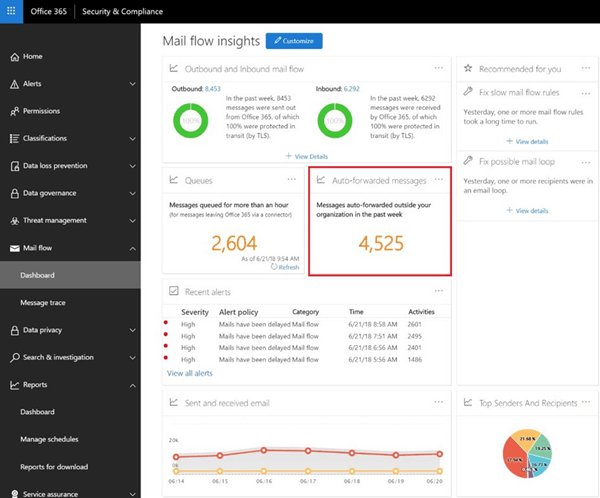

# レポートのメッセージの自動転送

メール フローのダッシュ ボードにレポート**メッセージの自動転送**では、Office 365 の組織から外部ドメイン内の受信者に自動的に転送されるメッセージに関する情報が表示されます。

## メッセージの自動転送の詳細

ウィジェット内のメッセージの数をクリックすると、メッセージの自動転送の状態を示すポップアップ ウィンドウが表示されます。**レポートの転送**リンクをクリックして詳細を表示できます。

## 分析情報

レポートのデータに基づく 2 つの情報を生成:**新しい転送先のユーザー**と**新規のドメインを転送**します。それぞれの見解では、2 種類のデータのより詳細な情報を提供する**新しい転送レポート**に新しいフォワーダーまたはリンクを含むドメインの数の概要を提供します。**転送の新しいレポート**は、新しい活動項目と詳細な情報の表の転送を開始したのと、どのドメインには、タイムライン ビューにも表示されます。
