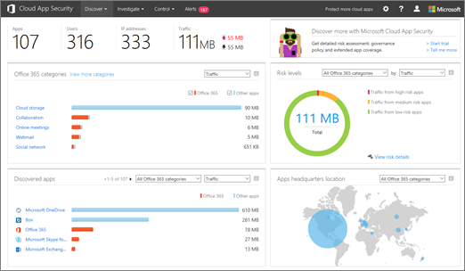

# Office 365 Cloud App Security の概要
  
|評価 * *\>**|計画 * *\>**|配置 * *\>**|使用率。|
|:-----|:-----|:-----|:-----|
|コースです!    [次の手順](get-ready-for-office-365-cas.md)   |[計画の開始します。](get-ready-for-office-365-cas.md)   |[展開を開始します。](turn-on-office-365-cas.md)   |[使用します。](utilization-activities-for-ocas.md)   |
   
> [!NOTE]
> Office 365 のクラウド アプリケーションのセキュリティは、Office 365 エンタープライズ E5 に使用できます。組織は、別の Office 365 エンタープライズ サブスクリプションで使用されている場合、Office 365 のクラウド アプリケーションのセキュリティがアドオンとして購入できます。(グローバル管理者は、Office 365 管理センターを選択して**請求** \> **サブスクリプションを追加**します)。詳細についてを参照してください[Office 365 のプラットフォーム サービスの説明: Office 365 のセキュリティ&amp;コンプライアンス センター](https://technet.microsoft.com/en-us/library/dn933793.aspx) [購入またはビジネスのための Office 365 のアドオンを編集](https://support.office.com/article/4e7b57d6-b93b-457d-aecd-0ea58bff07a6)するとします。 
  
Office 365 のクラウド アプリケーションのセキュリティを使用する可能性のある問題があると、必要な場合は、セキュリティ問題に対処するアクションを実行するような状況を調査することができますので、Office 365 で不審な動作を把握できます。Office 365 のクラウド アプリケーションのセキュリティ、例外、または不審な活動に対してトリガーされたアラートの通知を受け取る、Office 365 の組織のデータがアクセス方法と使用方法、ユーザー アカウントが、不審なアクティビティが発生することを中断し、必要とするを参照してください。アラートがトリガーされた後、Office 365 アプリケーションに再度ログインするユーザーです。Office 365 のクラウド アプリケーションのセキュリティ機能と機能の概要を取得するには、この資料を参照してください。
  
    
## Office 365 のクラウド アプリケーションのセキュリティ関連ポータルを検索する方法

> [!NOTE]
> Office 365 のクラウド アプリケーションのセキュリティ関連ポータルにアクセスするには、グローバル管理者、セキュリティ管理者、またはセキュリティのリーダーが必要です。詳細についてを参照してください[では、Office 365 のセキュリティ アクセス許可&amp;コンプライアンス センター](permissions-in-the-security-and-compliance-center.md)です。 
  
Office 365 のセキュリティを通じて Office 365 のクラウド アプリケーションのセキュリティのポータルを表示する&amp;コンプライアンス センターです。これを行う方法の 1 つを以下に示します。
  
1. [https://protection.office.com](https://protection.office.com)し、職場、学校のアカウントを使用して Office 365 にサインインします。(これで、セキュリティには、&amp;コンプライアンス センター)。 
    
2. セキュリティで&amp;コンプライアンス センターでは、**アラート**を選択して\>**管理警告の詳細**です。 
    
    
  
    (Office 365 のクラウド アプリケーションのセキュリティはまだ有効でない、グローバル管理者は、 [Office 365 のクラウド アプリケーションのセキュリティを有効にする](turn-on-office-365-cas.md)) 場合
    
3. **Office 365 のクラウド アプリケーションのセキュリティ**を選択します。 
    
## [Policies]

Office 365 クラウド アプリケーションのセキュリティは、組織に対して定義されているポリシーと連携します。Office 365 クラウド アプリケーションのセキュリティでは、組織は、10 個の定義済みの異常検出のポリシーとポリシーのアクティビティ テンプレートがいくつかを取得します。全般の異常を検出、危険な IP アドレスからログインするユーザーを識別する、ransomware アクティビティを検出、企業以外の IP アドレス、および複数の管理者のアクティビティを検出するのには、これらのポリシーが設計されています。
  

  
ビュー/ポリシー テンプレート、Office 365 のクラウド アプリケーションのセキュリティ関連ポータルに、使用する**コントロール**に移動して\>**のテンプレート**です。 
  

  
ポリシーに関する詳細については、次のリソースを参照してください。
  
- [Office 365 Cloud App Security のアクティビティ ポリシーと警告](activity-policies-and-alerts.md)
    
- [Office 365 Cloud App Security の異常検出ポリシー](anomaly-detection-policies-in-ocas.md)
    
## アラート

ポリシーを定義したら、検出された疑わしい、または典型的な活動について通知します。組織の警告を表示するには、画面の上部にナビゲーション ・ バーの**アラート**を選択します。 
  
![[アラート] ページで、トリガーされたアラートと行った操作を確認できます。](media/3b53d4c9-4b13-435d-8547-8c0f9ae6b914.png)
  
アラートがトリガーされると、何が起こっているの詳細については、それらを確認できます。次に、アクティビティがまだ疑わしい場合は、アクションを実行できます。問題についてユーザーに通知することができますから、Office 365 にサインインするユーザーを一時停止にもう一度アプリケーションを Office 365 にサインインするユーザーを必要とします。
  
警告に関する詳細については、次のリソースを参照してください。
  
- [Office 365 Cloud App Security のアクティビティ ポリシーと警告](activity-policies-and-alerts.md)
    
- [Office 365 Cloud App Security の異常検出ポリシー](anomaly-detection-policies-in-ocas.md)
    
- [Office 365 のクラウド アプリケーションのセキュリティの警告を確認して処理](review-office-365-cas-alerts.md)
    
## 動作状況のログ

Office 365 のクラウド アプリケーションのセキュリティで、利用状況ログ] ページで、ユーザーの活動に関する情報を表示します。
  

  
**調査**には、Office 365 のクラウド アプリケーションのセキュリティ ポータルでは、このページを表示するのには\>**のアクティビティのログ**です。 
  

  
すぎると Office 365 のクラウド アプリケーションのセキュリティ、web のトラフィックのログを使用できます。ログ ファイルの詳細については、それらに含まれている、可視性が向上すれば、ユーザーの利用状況にします。Barracuda、青いコート、チェック ポイント、シスコ、Clavister、Dell の SonicWALL、Fortinet、ビャクシン、McAfee、マイクロソフト、パロアルト、Sophos、Squid、Websence、Zscaler などからのログ ファイルを使用することができます。
  
[Office 365 のクラウド アプリケーションのセキュリティは、web トラフィックのログとデータ ソースについてください。](web-traffic-logs-and-data-sources-for-ocas.md)
  
## アプリケーションのアクセス許可

Office 365 のクラウド アプリケーションのセキュリティ、許可したり、Office 365 のデータにアクセスするサードパーティ製アプリケーションを使用する組織内のユーザーを禁止できます。
  
![O365 の CA では、[調査] メニューの [アプリケーション アクセス許可の管理] ページを表示できます。](media/78272cda-986f-4b3b-bbbe-8c236c74f5d3.png)
  
**調査**にこのページを表示して、 \> **アプリケーションのアクセスを許可**します。 
  

  
[Office 365 Cloud App Security を使用してアプリのアクセス許可を管理する](manage-app-permissions-in-ocas.md)
  
## クラウド探索のダッシュ ボード

**クラウド探索のダッシュ ボード****の生産性アプリケーションの検出**とも呼ばれるには、組織内でのクラウド アプリケーションの使用状況に関する情報が表示されます。アプリケーション、ユーザー、トラフィック、トランザクション、およびデジタル ダッシュ ボードを使用して複数の情報を表示することができます。クラウド探索のダッシュ ボードには、次のイメージが似ています。 
  

  
**検出**には、Office 365 のクラウド アプリケーションのセキュリティのポータルでは、このダッシュ ボードを表示する\>**クラウド探索のダッシュ ボード**です。 
  

  
[Office 365 Cloud App Security でアプリ検出結果を確認する](review-app-discovery-findings-in-ocas.md)
  
## 次の手順

- [Office 365 クラウド アプリケーション セキュリティの使用例と使用に関するガイド](https://aka.ms/O365CASGuide)
    
- [Office 365 Cloud App Security の使用準備](get-ready-for-office-365-cas.md)
    

