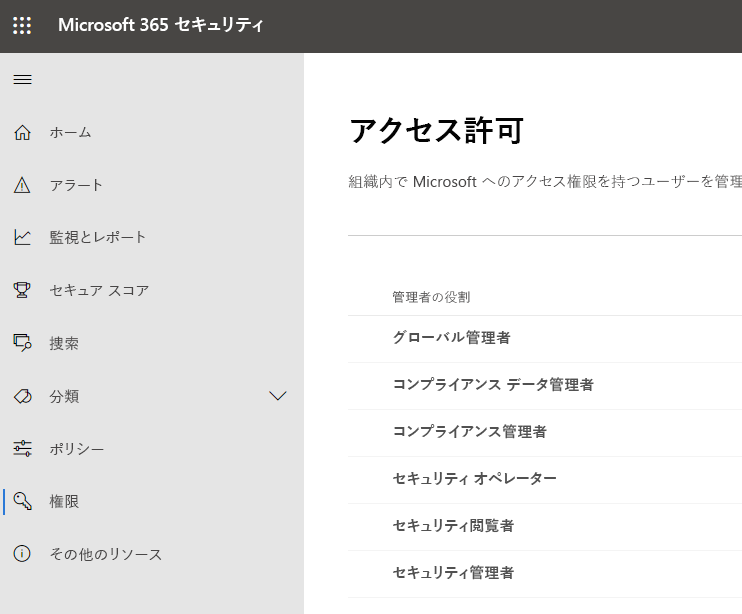
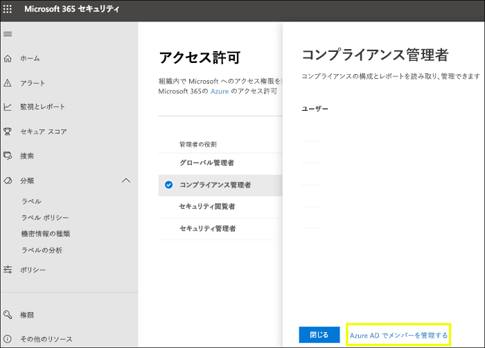
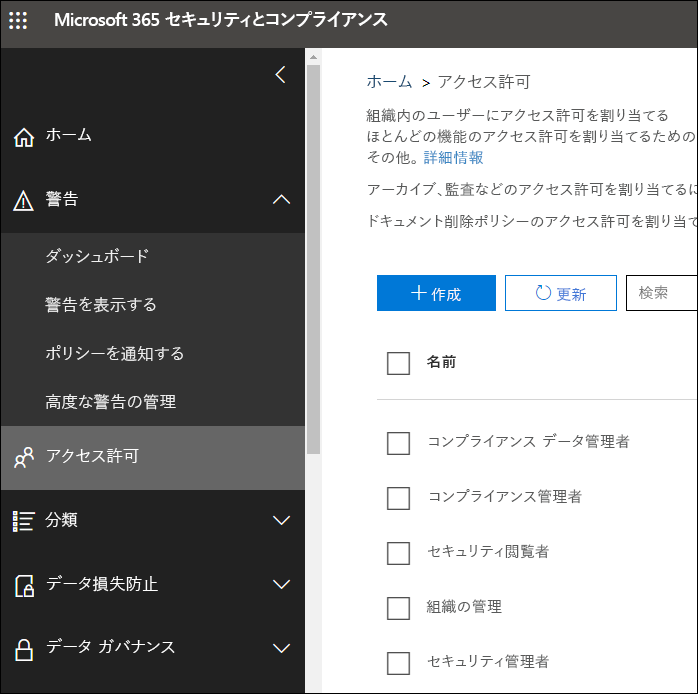

# Microsoft 365 コンプライアンス センターと Microsoft 365 セキュリティ センターのアクセス許可

組織は、すべての Microsoft 365 サービスに関するセキュリティとコンプライアンスのシナリオを管理する必要があります。 また、組織の IT グループ内の適切なユーザーに、適切な管理者権限を付与する柔軟性も必要です。 Microsoft 365 セキュリティ センターまたは Microsoft 365 コンプライアンス センターを使用すると、セキュリティまたはコンプライアンスに関連するすべてのタスクについて、アクセス許可を一元的に管理できます。

全体管理者がこれらの管理者のロールを割り当てると、管理者は、Microsoft 365 セキュリティ センター、Microsoft 365 コンプライアンス センター、Azure、Office 365、Enterprise Mobility + Security など、Microsoft 365 のすべてのサービスに及ぶ機能やデータにアクセスできます。

## Microsoft 365 のロール

Microsoft 365 コンプライアンス センターと Microsoft 365 セキュリティ センターには、Azure Active Directory のロールが表示されます。 これらのロールは、組織の IT グループの職務に合わせて設計されており、仕事を遂行するために必要なすべての権限をユーザーに簡単に付与できます。

|**ロール**|**説明**|
|:-----|:-----|
|**全体管理者**|このロールを持つユーザーは、すべての Microsoft 365 サービスのすべての管理機能にアクセスできます。 他の管理者ロールを割り当てることができるのは全体管理者だけです。|
|**コンプライアンス データ管理者**|このロールを持つユーザーは、Microsoft 365 全体の組織のデータを追跡し、保護されていることを確認し、あらゆる問題を把握してリスクを軽減することができます。|
|**コンプライアンス管理者**|このロールを持つユーザーは、組織が規制要件を遵守し続けること、電子情報開示ケースを管理すること、および Microsoft 365 の場所、ID、アプリ全体のデータ ガバナンス ポリシーを維持することを支援できます。|
|**セキュリティ オペレーター**|このロールを持つユーザーは、Microsoft 365 のユーザー、デバイス、コンテンツに対するアクティブな脅威を表示、調査、および対処できます。|
|**セキュリティ閲覧者**|このロールを持つユーザーは、Microsoft 365 のユーザー、デバイス、コンテンツに対するアクティブな脅威を表示と調査ができますが、セキュリティ オペレーターとは異なり、アクションを実行するアクセス許可はありません。|
|**セキュリティ管理者**|このロールを持つユーザーは、セキュリティ ポリシーを管理し、Microsoft 365 製品全体のセキュリティ分析とレポートを確認し、脅威の情勢を十分に把握し続けることで、組織の全体的なセキュリティを制御できます。|

## Microsoft 365 のロールのアクセス

ここでは、使用可能なロールとロールに割り当てられたユーザーができることを説明します。

### 全体管理者

このロールが割り当てられたユーザーは、Azure Active Directory のすべての管理機能と、Azure Active Directory の ID を使用するサービス (Microsoft 365 セキュリティ センター、Microsoft 365 コンプライアンス センター、Exchange Online、SharePoint Online、Skype for Business Online など) にアクセスできます。 Azure Active Directory テナントにサインアップしたユーザーが全体管理者になります。 他の管理者ロールを割り当てることができるのは全体管理者だけです。 会社に複数の全体管理者が存在してかまいません。 すべてのユーザーと他のすべての管理者のパスワードをリセットできます。

### コンプライアンス管理者

このロールのユーザーには、Microsoft 365 コンプライアンス センター、Microsoft 365 管理センター、Azure、および Office 365 セキュリティ/コンプライアンス センターのコンプライアンス関連の機能を管理する権限があります。 また、ユーザーは、Exchange 管理センター、Teams および Skype for Business の管理センター内のすべての機能を管理したり、Azure および Microsoft 365 のサポート チケットを作成したりすることもできます。

|**サービス**|**コンプライアンス管理者ができること**|
|:-----|:-----|
|[**Microsoft 365 コンプライアンス センター**](https://compliance.microsoft.com/)|Microsoft 365 サービス全体での組織のデータの保護および管理。    コンプライアンス アラートの管理。|
|[**コンプライアンス マネージャー**](https://docs.microsoft.com/office365/securitycompliance/meet-data-protection-and-regulatory-reqs-using-microsoft-cloud)|組織の法令遵守活動の追跡、割り当て、確認。|
|[**Office 365 セキュリティ/コンプライアンス センター**](https://support.office.com/article/About-Office-365-admin-roles-da585eea-f576-4f55-a1e0-87090b6aaa9d)|データ ガバナンスの管理。    法律およびデータ調査の実行。    データ主体の要求の管理。|
|[**Intune**](https://docs.microsoft.com/intune/role-based-access-control)|Intune のすべての監査データの表示。|
|[**Cloud App Security**](https://docs.microsoft.com/cloud-app-security/manage-admins)|読み取り専用アクセス許可があり、アラートを管理できる。    ファイル ポリシーの作成と変更、ファイル ガバナンス アクションの許可。    データ管理下のすべての組み込みレポートの表示。|

### コンプライアンス データ管理者

この役割を持つユーザーは、Microsoft 365 コンプライアンス センター、Microsoft 365 管理センター、Azure のデータを保護し、追跡するアクセス許可を持ちます。 また、ユーザーは、Exchange 管理センター、コンプライアンス マネージャー、Teams および Skype for Business の管理センター内のすべての機能を管理したり、Azure および Microsoft 365 のサポート チケットを作成したりすることもできます。

|**このサービスで…**|**コンプライアンス データ管理者は…**|
|:-----|:-----|
|[**Microsoft 365 コンプライアンス センター**](https://compliance.microsoft.com/)|Microsoft 365 サービス全体での組織のデータの保護および管理。    コンプライアンス アラートの管理。    機密ラベルの管理。|
|[**コンプライアンス マネージャー**](https://docs.microsoft.com/office365/securitycompliance/meet-data-protection-and-regulatory-reqs-using-microsoft-cloud)|組織の法令遵守活動の追跡、割り当て、確認。|
|[**Office 365 セキュリティ/コンプライアンス センター**](https://support.office.com/article/About-Office-365-admin-roles-da585eea-f576-4f55-a1e0-87090b6aaa9d)|データ ガバナンスの管理。    法律およびデータ調査の実行。    データ主体の要求の管理。    機密ラベルの管理。|
|[**Intune**](https://docs.microsoft.com/intune/role-based-access-control) (準備中)|Intune のすべての監査データの表示。|
|[**Cloud App Security**](https://docs.microsoft.com/cloud-app-security/manage-admins)|読み取り専用アクセス許可を使用して情報を表示する。  通知の管理。    ファイル ポリシーの作成と変更、ファイル ガバナンス アクションの許可。    データ管理下のすべての組み込みレポートの表示。|

### セキュリティ管理者

このロールが割り当てられたユーザーは、Microsoft 365 セキュリティ センター、Azure Active Directory Identity Protection、Azure Information Protection、Office 365 セキュリティ/コンプライアンス センターのセキュリティ関連機能を管理するアクセス許可を持ちます。

|**このサービスで…**|**セキュリティ管理者は…**|
|:-----|:-----|
|[**Microsoft 365 セキュリティ センター**](https://security.microsoft.com/)|Microsoft 365 サービス全体のセキュリティ関連ポリシーの監視。     セキュリティの脅威とアラートの管理。    レポートの表示。    機密ラベルの管理。|
|**Identity Protection Center**|セキュリティ閲覧者ロールができるすべてのことに加え、パスワードの再設定以外のすべての Identity Protection Center の操作の実行。|
|[**Privileged Identity Management**](https://docs.microsoft.com/azure/active-directory/privileged-identity-management/pim-configure)|セキュリティ閲覧者ロールができるすべてのこと。    Azure AD ロールの割り当てまたは設定を管理することは**できません**。|
|[**Office 365 セキュリティ/コンプライアンス センター**](https://support.office.com/article/About-Office-365-admin-roles-da585eea-f576-4f55-a1e0-87090b6aaa9d)|セキュリティ ポリシーの管理。    セキュリティの脅威の表示、調査、対応    レポートの表示。    機密ラベルの管理。|
|**Azure Advanced Threat Protection**|疑わしいセキュリティ アクティビティの監視と対応。|
|**Windows Defender ATP および EDR**|ロールの割り当て。    コンピューター グループの管理。    エンドポイントの脅威の検出と自動修復の構成。    アラートの表示、調査、対応。|
|[**Intune**](https://docs.microsoft.com/intune/role-based-access-control)|ユーザー、デバイス、登録、構成、アプリケーション情報の表示。    Intune に変更を加えることは**できません**。|
|[**Cloud App Security**](https://docs.microsoft.com/cloud-app-security/manage-admins)|管理者の追加、ポリシーと設定の追加、ログのアップロード、ガバナンス アクションの実行。|
|[**Azure Security Center**](https://docs.microsoft.com/azure/role-based-access-control/built-in-roles) (準備中)|セキュリティ ポリシーの表示、セキュリティ状態の表示、セキュリティ ポリシーの編集、アラートと推奨事項の表示、アラートと推奨事項の却下。|
|[**Office 365 サービス正常性**](https://docs.microsoft.com/office365/enterprise/view-service-health)|Office 365 サービスの正常性の表示。|

### セキュリティ オペレーター

このロールのユーザーはアラートを管理することができ、Microsoft 365 セキュリティ センター、Azure Active Directory、Identity Protection、Privileged Identity Management におけるすべての情報を含むセキュリティ関連機能への読み取り専用グローバル アクセス権に加えて、Azure Active Directory サインイン レポートと監査ログ、および Office 365 セキュリティ/コンプライアンス センターで閲覧する権限があります。

|**このサービスで…**|**セキュリティ オペレーターは…**|
|:-----|:-----|
|[**Microsoft 365 セキュリティ センター**](https://security.microsoft.com/)|セキュリティ閲覧者ロールができるすべてのこと。    セキュリティの警告の表示、調査、対応。|
|**Identity Protection Center** (近日対応予定)|セキュリティ閲覧者ロールができるすべてのこと。|
|[**Privileged Identity Management**](https://docs.microsoft.com/azure/active-directory/privileged-identity-management/pim-configure)|セキュリティ閲覧者ロールができるすべてのこと。|
|[**Office 365 セキュリティ/コンプライアンス センター**](https://support.office.com/article/About-Office-365-admin-roles-da585eea-f576-4f55-a1e0-87090b6aaa9d)|セキュリティ閲覧者ロールができるすべてのこと。    セキュリティの脅威の表示、調査、対応|
|**Windows Defender ATP および EDR**|セキュリティ閲覧者ロールができるすべてのこと。    アラートの表示、調査、対応。|
|[**Intune**](https://docs.microsoft.com/intune/role-based-access-control)|ユーザー、デバイス、登録、構成、アプリケーション情報の表示。    Intune に変更を加えることは**できません**。|
|[**Cloud App Security**](https://docs.microsoft.com/cloud-app-security/manage-admins)|セキュリティ閲覧者ロールができるすべてのことに加え、アラートの表示および破棄。|
|[**Office 365 サービス正常性**](https://docs.microsoft.com/office365/enterprise/view-service-health)|Office 365 サービスの正常性の表示。|

### セキュリティ閲覧者

このロールのユーザーには、Microsoft 365 セキュリティ センター、Azure Active Directory、Identity Protection、Privileged Identity Management におけるすべての情報を含むセキュリティ関連機能への読み取り専用グローバル アクセス権に加えて、Azure Active Directory サインイン レポートと監査ログ、および Office 365 セキュリティ/コンプライアンス センターで閲覧する権限があります。

|**このサービスで…**|**セキュリティ閲覧者は…**|
|:-----|:-----|
|[**Microsoft 365 セキュリティ センター**](https://security.microsoft.com/)|Microsoft 365 サービス全体のセキュリティ関連ポリシーの表示。    セキュリティの脅威とアラートの表示。    レポートの表示。|
|**Identity Protection Center**|各セキュリティ機能の全セキュリティ レポートと設定情報の閲覧: スパム対策、暗号化、データ損失防止 (DLP)、マルウェア対策、Advanced Threat Protection (ATP)、フィッシング詐欺対策、メール フロー ルール (トランスポート ルールとも呼ばれる)。|
|[**Privileged Identity Management**](https://docs.microsoft.com/azure/active-directory/privileged-identity-management/pim-configure)|読み取り専用アクセスを使用した Azure AD PIM に記載されているすべての情報の表示: Azure AD ロールの割り当てに関するポリシーとレポート、セキュリティレビュー、および将来的には Azure AD ロールの割り当て以外のシナリオでのポリシー データとレポート。    Azure AD PIM へのサインアップおよび Azure AD PIM の変更を行うことは**できません**。 このロールのユーザーは、追加のロール (グローバル管理者や特権ロール管理者など) の資格がある場合、PIM ポータルまたは PowerShell からそれらのロールを有効化することができます。|
|[**Office 365 セキュリティ/コンプライアンス センター**](https://support.office.com/article/About-Office-365-admin-roles-da585eea-f576-4f55-a1e0-87090b6aaa9d)|セキュリティ ポリシーの表示。    セキュリティの脅威の表示および調査。    レポートの表示。|
|**Windows Defender ATP および EDR**|アラートの表示と調査。|
|[**Intune**](https://docs.microsoft.com/intune/role-based-access-control)|ユーザー、デバイス、登録、構成、アプリケーション情報の表示。    Intune に変更を加えることは**できません**。|
|[**Cloud App Security**](https://docs.microsoft.com/cloud-app-security/manage-admins)|読み取り専用アクセス許可を使用して情報を表示する。    通知の管理。|
|[**Azure Security Center**](https://docs.microsoft.com/azure/role-based-access-control/built-in-roles)|推奨事項とアラートの表示。    セキュリティ ポリシーの表示。    セキュリティの状態を表示することはできますが、変更することはできません。|
|[**Office 365 サービス正常性**](https://docs.microsoft.com/office365/enterprise/view-service-health)|Office 365 サービスの正常性の表示。|

## 全体管理者は Azure Active Directory のロール管理が可能

Microsoft 365 コンプライアンス センターと Microsoft 365 セキュリティ センターでロールを選択すると、その割り当てを表示できます。 割り当てを管理するには、Azure Active Directory に移動する必要があります。

詳しくは、「[Azure Active Directory で管理者ロールを表示して割り当てる](https://docs.microsoft.com/azure/active-directory/users-groups-roles/directory-manage-roles-portal)」をご覧ください。

## Azure Active Directory の代わりにサービスのロールを管理する

Microsoft 365 コンプライアンス センターと Microsoft 365 セキュリティ センターに表示されるロールは、アクセス許可を持つサービスにも表示されます。 たとえば、これらのロールは Office 365 セキュリティ/コンプライアンス センターで確認できます。

### 継承の解除

Azure Active Directoryでこれらのロールを管理するときは、**すべて**の Microsoft 365 サービスを一元的に管理しているということを理解しておくことが重要です。 ただし、Office 365 セキュリティ/コンプライアンス センターなどの特定のサービスでロールを管理する場合は、その特定のサービスにおけるロール**のみ**を管理しています。 サービスにおけるロールの割り当てとアクセス許可は、Azure Active Directory のロールに与えられているアクセス許可より優先されます。

これは、たとえば、セキュリティ管理者ロールに割り当てられているユーザーが、インシデントを管理するためのアクセス許可を持っていない場合に便利です。 ただし、Windows Defender Advanced Threat Protection でアクセス許可を使用して、そのサービスのインシデント管理に特定のアクセス許可を与えることができます。

## Microsoft 365 の各サービスのロール情報の場所

ユーザーを Microsoft 365 のコンプライアンス管理者またはセキュリティ管理者のロールのいずれかに割り当てると、そのユーザーには さまざまな Microsoft 365 サービスへのアクセス許可が与えられます。 各サービスのロールについての詳細情報については、以下のリンクを参照してください。

|**Microsoft 365 サービス**|**ロール情報**|
|:-----|:-----|
|Office 365 と Microsoft 365 のビジネス プランでの管理者ロール|[Office 365 の管理者ロール](https://docs.microsoft.com/office365/admin/add-users/about-admin-roles?view=o365-worldwide)|
|Azure Active Directory (Azure AD) および Azure AD Identity Protection|[Azure AD 管理者ロール](https://docs.microsoft.com/azure/active-directory/users-groups-roles/directory-assign-admin-roles)|
|Azure Advanced Threat Protection|[Azure ATP ロール グループ](https://docs.microsoft.com/azure-advanced-threat-protection/atp-role-groups)|
|Azure Information Protection|[Azure AD 管理者ロール](https://docs.microsoft.com/azure/active-directory/users-groups-roles/directory-assign-admin-roles)|
|Compliance Manager|[Compliance Manager ロール](https://docs.microsoft.com/office365/securitycompliance/meet-data-protection-and-regulatory-reqs-using-microsoft-cloud#permissions-and-role-based-access-control)|
|Exchange Online|[Exchange のロール ベースのアクセス制御](https://docs.microsoft.com/exchange/understanding-role-based-access-control-exchange-2013-help)|
|Intune|[Intune のロール ベースのアクセス制御](https://docs.microsoft.com/intune/role-based-access-control)|
|管理対象デスクトップ|[Azure AD 管理者ロール](https://docs.microsoft.com/azure/active-directory/users-groups-roles/directory-assign-admin-roles)|
|Microsoft Cloud App Security|[ロールベースのアクセス制御](https://docs.microsoft.com/cloud-app-security/manage-admins)|
|Office 365 セキュリティ/コンプライアンス センター|[Office 365 の管理者ロール](https://docs.microsoft.com/office365/SecurityCompliance/permissions-in-the-security-and-compliance-center)|
|Privileged Identity Management|[Azure AD 管理者ロール](https://docs.microsoft.com/azure/active-directory/users-groups-roles/directory-assign-admin-roles)|
|セキュリティ スコア|[Azure AD 管理者ロール](https://docs.microsoft.com/azure/active-directory/users-groups-roles/directory-assign-admin-roles)|
|SharePoint Online|[Azure AD 管理者ロール](https://docs.microsoft.com/azure/active-directory/users-groups-roles/directory-assign-admin-roles)    [Office 365 での SharePoint 管理者ロールについて](https://docs.microsoft.com/sharepoint/sharepoint-admin-role)|
|Teams/Skype for Business|[Azure AD 管理者ロール](https://docs.microsoft.com/azure/active-directory/users-groups-roles/directory-assign-admin-roles)|
|Windows Defender Advanced Threat Protection|[Windows Defender ATP のロール ベースのアクセス制御](https://docs.microsoft.com/windows/security/threat-protection/windows-defender-atp/rbac-windows-defender-advanced-threat-protection)|

## まもなく提供される機能

Microsoft 365 コンプライアンス センターと Microsoft 365 セキュリティ センターのアクセス許可については準備中です。 現時点では、次の機能のサポートに取り組んでいます。

- Azure Active Directory に移動せずに、Microsoft 365 コンプライアンス センターと Microsoft 365 セキュリティ センターで、ロールを管理する。

- 特定のアクセス許可を追加または削除して、ロールをカスタマイズする。

- 選択したアクセス許可を持つカスタム ロールを作成する。
