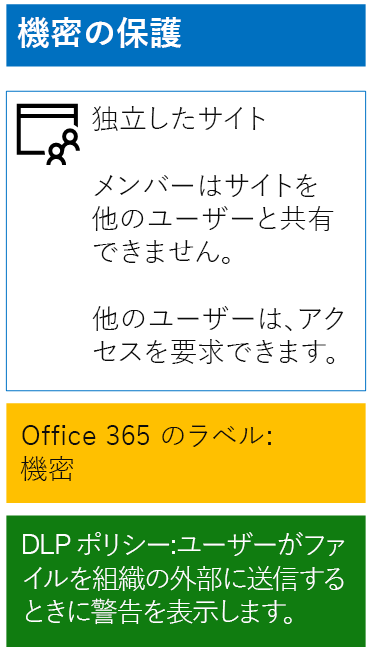
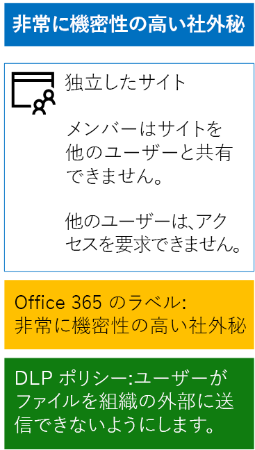

# 保持ラベルと DLP による SharePoint Online ファイルの保護

 **概要:** 情報保護のレベルが多様な SharePoint Online チーム サイトには、保持ラベルとデータ損失防止 (DLP) ポリシーを適用してください。
  
この記事に示した手順を使用して、ベースライン、機密、および高機密の SharePoint Online チーム サイトに対応する保持ラベルと DLP ポリシーを設計および展開します。 この 3 層の保護の詳細については、「[SharePoint Online サイトとファイルをセキュリティで保護する](secure-sharepoint-online-sites-and-files.md)」を参照してください。
  
## そのしくみ
1. 目的の保持ラベルを作成して、そのラベルを発行します。 発行されるまでに最大 12 時間かかることがあります。
2. 目的の SharePoint サイトで、ドキュメント ライブラリの設定を編集して、そのライブラリ内のアイテムに目的の保持ラベルを適用します。
3. 保持ラベルに基づいてアクションを実行する DLP ポリシーを作成します。

ユーザーがライブラリにドキュメントを追加すると、そのドキュメントには割り当てられた保持ラベルが既定で付けられます。 ユーザーは、このラベルを必要に応じて変更できます。 ユーザーが組織の外部とドキュメントを共有するときには、DLP によってラベルが割り当てられているかどうかが確認され、そのラベルと DLP ポリシーが一致するとアクションが実行されます。 DLP では、クレジット カード番号が含まれているファイルなど、その他のポリシーの一致も確認されます (この種のポリシーが構成されている場合)。 

## SharePoint Online サイトの保持ラベル

保持ラベルを作成して、SharePoint Online チーム サイトにラベルを割り当てるためのフェーズは 3 つあります。
  
### フェーズ 1: 保持ラベルの名前を決定する

このフェーズでは、SharePoint Online チーム サイトに適用される情報保護の 4 つのレベルに応じた保持ラベルの名前を決定します。 次の表は、各レベルに推奨される名前の一覧です。
  
|**SharePoint Online チーム サイトの保護レベル**|**ラベル名**|
|:-----|:-----|
|ベースライン - パブリック    |内部パブリック    |
|ベースライン - プライベート    |Kirkland    |
|機密    |機密    |
|非常に機密性の高い社外秘    |非常に機密性の高い社外秘    |
   
### フェーズ 2: 保持ラベルを作成する

このフェーズでは、情報保護の各レベルに応じて決定したラベルを作成して発行します。
  
1. セキュリティ管理者または会社の管理者のロールが付与されたアカウントで、[Microsoft 365 セキュリティ ポータル](https://security.microsoft.com)にサインインします。
    
2. ブラウザーの **[ホーム - Microsoft 365 セキュリティ]** タブで、**[分類] > [ラベル]** をクリックします。
    
3. **[保持ラベル] > [ラベルの作成]** をクリックします。
    
4. **[ラベルの名前の設定]** ウィンドウで、ラベルの名前と、管理者およびユーザーの説明を入力して、**[次へ]** をクリックします。

5. **[ファイル計画の記述子]** ウィンドウで、必要事項を入力してから **[次へ]** をクリックします。
    
6. **[ラベルの設定]** ウィンドウで、**[保持]** を **[オン]** にして保持設定を構成します (必要な場合)。 **[次へ]** をクリックします。
    
7. **[設定の確認]** ウィンドウで、**[ラベルを作成する]** をクリックします。
    
8. 追加のラベルごとに、**[ラベルの作成]** をクリックして、手順 4 から 7 を繰り返します。
    

### 新しいラベルを発行する

次は、新しい保持ラベルを発行するために、次に示す手順を使用します。
  
1. **[ラベル]** ウィンドウで、**[保持ラベル]** タブをクリックして、**[ラベルの発行]** をクリックします。
    
2. **[発行するラベルの選択]** ウィンドウで、**[発行するラベルの選択]** をクリックします。
    
3. **[ラベルの選択]** ウィンドウで **[追加]** をクリックして、4 つのラベルをすべて選択してから **[追加]** をクリックします。
    
4. [ **完了**] をクリックします。
    
5. **[発行するラベルを選択]** ウィンドウで、 **[次へ]** をクリックします。
    
6. **[場所の選択]** ウィンドウで、**[次へ]** をクリックします。
    
7. **[ポリシーに名前をつける]** ウィンドウで、**[名前]** にラベルのセットの名前を入力し、**[次へ]** をクリックします。
    
8. **[設定の確認]** ウィンドウで、 **[ラベルの発行]** をクリックしてから **[閉じる]** をクリックします。

    
### フェーズ 3: SharePoint Online サイトに保持ラベルを適用する

次の手順を使用して、SharePoint Online チーム サイトのドキュメント フォルダーに保持ラベルを適用します。
  
1. [Office 365 ポータル](https://www.office.com)にサインインして、**[SharePoint]** アプリをクリックします。
    
2. ブラウザーの新しい **[SharePoint]** タブで、ラベルを割り当てる必要のあるサイトをクリックします。
    
3. ブラウザーの新しい SharePoint サイト タブで、**[ドキュメント]** をクリックします。
    
4. 設定アイコンをクリックし、**[ライブラリの設定]** をクリックします。
    
5. **[権限と管理]** をクリックして、 **[このライブラリ内の項目にラベルを適用]** をクリックします。
    
6. **[設定 - ラベルの適用]** で、適切なラベルを選択してから **[保存]** をクリックします。
    
7. SharePoint Online サイトのタブを閉じます。
    
8. 手順 2 から 8 を繰り返して、追加の SharePoint Online サイトに保持ラベルを割り当てます。
    
最終的な構成をここに示します。
  

  
## SharePoint Online サイトの DLP ポリシー

以下の手順で、SharePoint Online の機密チーム サイト上のドキュメントを組織外と共有するときにユーザーに通知する DLP ポリシーを構成します。

1. セキュリティ管理者または会社の管理者のロールが付与されたアカウントで [Microsoft 365 コンプライアンス ポータル](https://compliance.microsoft.com/)にサインインします。
    
2. ブラウザーの新しい **[Microsoft 365 コンプライアンス]** タブで、**[ポリシー] > [データ損失防止]** をクリックします。
    
3. **[ホーム] > [データ損失防止]** ウィンドウで、**[ポリシーの作成]** をクリックします。
    
4. **[テンプレートを利用するか、カスタム ポリシーを作成します]** ウィンドウで、**[カスタム]** をクリックしてから **[次へ]** をクリックします。
    
5. **[ポリシーに名前をつける]** ウィンドウの **[名前]** に機密レベル DLP ポリシーの名前を入力して、**[次へ]** をクリックします。
    
6. **[場所の選択]** ウィンドウで、**[特定の場所を選択]** をクリックしてから **[次へ]** をクリックします。
    
7. 場所の一覧で、**[Exchange メール]**、**[OneDrive アカウント]**、および **[Teams のチャットとチャネルのメッセージ]** の場所を無効にして、**[次へ]** をクリックします。
    
8. **[保護するコンテンツの種類をカスタマイズする]** ウィンドウで、**[編集]** をクリックします。
    
9. **[保護するコンテンツの種類を選ぶ]** ウィンドウのドロップダウン ボックスで **[追加]** をクリックしてから、**[保持ラベル]** をクリックします。
    
10. **[保持ラベル]** ウィンドウで、**[追加]** をクリックして **[機密]** ラベルを選択し、**[追加]** をクリックしてから **[完了]** をクリックします。
    
11. **[保護するコンテンツの種類を選択する]** ウィンドウで、 **[保存]** をクリックします。
    
12. **[Customize the type of content you want to protect]\(保護するコンテンツの種類をカスタマイズする\)** ウィンドウで、**[次へ]** をクリックします。

13. **[What do you want to do if we detect sensitive info?]\(機密性の高い情報が検出された場合に実行する操作\)** ウィンドウで、**[Customize the tip and email]\(ヒントと電子メールをカスタマイズする\)** をクリックします。
    
14. **[ポリシー ヒントと電子メール通知をカスタマイズする]** ウィンドウで、**[ポリシー ヒント テキストをカスタマイズする]** をクリックします。
    
15. 機密性の高いファイルを保護するために Azure Information Protection を実装したかどうかに応じて、テキスト ボックスに、次のいずれかのヒントを入力するか、貼り付けます。
    
  - 組織外のユーザーと共有するには、ファイルをダウンロードしてから開きます。[ファイル]、[文書の保護]、[パスワードを使用して暗号化] の順にクリックし、強力なパスワードを指定します。別の電子メールまたはその他の通信手段でパスワードを送信します。
  - 機密性の高いファイルは、暗号化によって保護されます。IT 部門によってこれらのファイルへのアクセス許可が与えられている外部ユーザーのみが、それらを読み取ることができます。
    
    あるいは、ファイルを共有する方法について組織外のユーザーに指示する独自のポリシー ヒントを入力するか、貼り付けます。
    
16. **[OK]** をクリックします。
    
17. **[機密性の高い情報が検出された場合に実行する操作]** ウィンドウで、**[次へ]** をクリックします。
    
18. **[ポリシーを有効にしますか、または最初にテストしますか?]** ウィンドウで、 **[すぐ有効にします]** をクリックし、 **[次へ]** をクリックします。
    
19. **[設定の確認]** ウィンドウで、**[作成]** をクリックして、**[閉じる]** をクリックします。
    
機密 SharePoint Online チーム サイトの最終的な構成をここに示します。
  

  
次に、以下の手順で、SharePoint Online の非常に機密性の高い社外秘チーム サイト上のドキュメントを組織外と共有するときにユーザーをブロックする DLP ポリシーを構成します。
  
1. ブラウザーの新しい **[Microsoft 365 コンプライアンス]** タブで、**[ポリシー] > [データ損失防止]** をクリックします。
    
2. **[データ損失防止]** ウィンドウで、**[ポリシーの作成]** をクリックします。
    
3. **[テンプレートを使って開始するか、カスタム ポリシーを作成する]** ウィンドウで、 **[カスタム]** をクリックしてから、 **[次へ]** をクリックします。
    
4. **[ポリシーに名前をつける]** ウィンドウの **[名前]** に高機密レベル DLP ポリシーの名前を入力して、**[次へ]** をクリックします。
    
5. **[場所の選択]** ウィンドウで、 **[自分で特定の場所を選択する]** をクリックしてから、 **[次へ]** をクリックします。
    
6. 場所の一覧で、**[Exchange メール]**、**[OneDrive アカウント]**、および **[Teams のチャットとチャネルのメッセージ]** の場所を無効にして、**[次へ]** をクリックします。
    
7. **[保護する機密情報の種類をカスタマイズする]** ウィンドウで、**[編集]** をクリックします。
    
8. **[保護するコンテンツの種類を選ぶ]** ウィンドウのドロップダウン ボックスで **[追加]** をクリックしてから、**[保持ラベル]** をクリックします。
    
9. **[保持ラベル]** ウィンドウで、**[追加]** をクリックして **[高機密]** ラベルを選択し、**[追加]** をクリックしてから **[完了]** をクリックします。
    
10. **[保護するコンテンツの種類を選択する]** ウィンドウで、 **[保存]** をクリックします。
    
12. **[Customize the types of sensitive info you want to protect]\(保護する機密情報の種類のカスタマイズ\)** ウィンドウで、**[次へ]** をクリックします。
    
13. **[What do you want to do if we detect sensitive info?]\(機密情報が検出された場合の処理\)** ウィンドウで、**[Customize the tip and email]\(ヒントと電子メールをカスタマイズする)** をクリックします。
    
14. **[Customize policy tips and email notifications]\(ポリシー ヒントと電子メール通知のカスタマイズ\)** ウィンドウで、**[Customize the policy tip text]\(ポリシー ヒントのテキストをカスタマイズする\)** をクリックします。
    
15. 次の内容をテキスト ボックスに入力するか、貼り付けます。
    
  - 組織外のユーザーと共有するには、ファイルをダウンロードしてから開きます。[ファイル]、[文書の保護]、[パスワードを使用して暗号化] の順にクリックし、強力なパスワードを指定します。別の電子メールまたはその他の通信手段でパスワードを送信します。
    
    あるいは、ファイルを共有する方法について組織外のユーザーに指示する独自のポリシー ヒントを入力するか、貼り付けます。
    
16. **[OK]** をクリックします。
    
17. **[機密性の高い情報が検出された場合に実行する操作]** ウィンドウで、**[次へ]** をクリックします。
    
18. **[ポリシーを有効にしますか、または最初にテストしますか?]** ウィンドウで、 **[すぐ有効にします]** をクリックし、 **[次へ]** をクリックします。
    
19. **[設定の確認]** ウィンドウで、**[作成]** をクリックして、**[閉じる]** をクリックします。
    
非常に機密性の高い社外秘 SharePoint Online チーム サイトの最終的な構成をここに示します。
  

  
## 次の手順

[Azure Information Protection を使用して SharePoint Online ファイルを保護する](protect-sharepoint-online-files-with-azure-information-protection.md)
    
## 関連項目

[SharePoint Online サイトとファイルをセキュリティで保護する](secure-sharepoint-online-sites-and-files.md)
  
[選挙運動、非営利組織、およびその他のアジャイル組織のための Microsoft Security ガイダンス](microsoft-security-guidance-for-political-campaigns-nonprofits-and-other-agile-o.md)
  
[クラウド導入およびハイブリッド ソリューション](https://docs.microsoft.com/office365/enterprise/cloud-adoption-and-hybrid-solutions)

