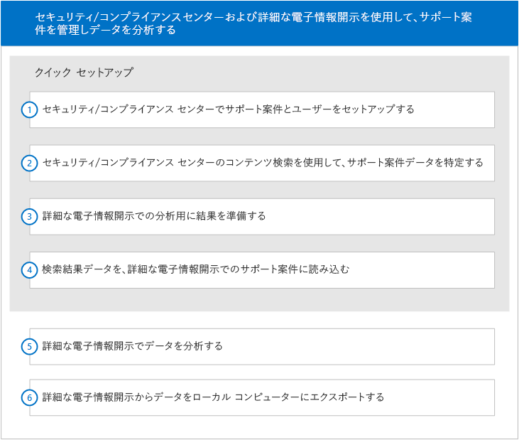

# Office 365 Advanced eDiscovery のクイック セットアップ

このセットアップ セクションでは、Microsoft 365 セキュリティ&amp;コンプライアンス センターの電子情報開示管理者に、Advanced eDiscovery を開始する方法を示します。 両方に関して、実際上の知識があるものと想定しています。
  
> [!NOTE]
> Advanced eDiscovery を使用するには、Advanced Compliance アドオンが含まれている Office 365 E3、または E5 のサブスクリプションが組織で必要になります。このプランを利用しておらず、Advanced eDiscovery をお試しになりたい場合は、[Office 365 Enterprise E5 の試用版にサインアップ](https://go.microsoft.com/fwlink/p/?LinkID=698279)してください。 
  
## Advanced eDiscovery のケースへのアクセス

セキュリティ&amp;コンプライアンス センターから Advanced eDiscovery にアクセスします。Advanced eDiscovery のケースにアクセスするには、セキュリティ&amp;コンプライアンス センターの電子情報開示ケースのメンバーである必要があります。電子情報開示ケースのアクセス許可の割り当て方法、電子情報開示ケースへのユーザーの追加方法については、「[Office 365 で電子情報開示ケースを管理する](manage-ediscovery-cases.md)」を参照してください。 
  
Advanced eDiscovery のケースに移動するには、以下を実施します: 
  
1. [Office 365 セキュリティ&amp;コンプライアンス センターに移動します](go-to-the-securitycompliance-center.md)。 
    
2. セキュリティ&amp;コンプライアンス センターで、**[検索&amp;調査]** \> **[電子情報開示]** の順にクリックし、組織内のケースの一覧を表示します。 
    
3. **[電子情報開示]** ページで、Advanced eDiscovery で移動するケースの横にある **[開く]** をクリックします。 
    
4. ケースの **[ホーム]** ページで、**[Advanced eDiscovery]** をクリックします。
    
    **[Advanced eDiscovery へ接続しています]** の進行状況バーが表示されます。接続されると、Advanced eDiscovery のケースが開きます。 
    
## ワークフロー

次の図は、セキュリティ&amp;コンプライアンス センターおよび Advanced eDiscovery において、電子情報開示ケースを管理および使用する一般的なワークフローを表したものです。 
  

  
このセットアップ セクションでは、上記ワークフローの最初の 4 つの手順について説明します。ワークフローの他の手順については、以下を参照してください。
  
## 分析

[ケース データの分析](analyze-case-data-with-advanced-ediscovery.md): さまざまなパラメーターでファイルの識別および整理を行い、テーマの使用を有効にして、結果を表示します。ユーザーは分析機能をカスタマイズして、詳細な結果を得ることができます。 
  
## 関連性のセットアップおよび関連性

[関連性のセットアップ](manage-relevance-setup-in-advanced-ediscovery.md)と[関連性モジュールの使用](use-relevance-in-advanced-ediscovery.md): ファイルのランダムなサンプルに基づく評価と関連性トレーニングを有効にし、その評価と関連性トレーニングを使用して、予測されるコーディング プロセスを決定します。プロセスの統計上の妥当性を監視しながら、中間結果を計算して表示します。校閲の意思決定を容易にする結果を表示します。 
  
## エクスポート

[ケース データのエクスポート](export-case-data-in-advanced-ediscovery.md): 外部で校閲できるように、Advanced eDiscovery のコンテンツと結果のエクスポートを有効にします。 
  
## レポート

[レポートを実行する](run-reports-in-advanced-ediscovery.md): 選択したレポートで Advanced eDiscovery の処理に関連するものの生成を有効にします。 
  
## 関連項目

[Office 365 Advanced eDiscovery](office-365-advanced-ediscovery.md)
  
[ユーザーとケースのセットアップ](set-up-users-and-cases-in-advanced-ediscovery.md)
  
[データの準備](prepare-data-for-advanced-ediscovery.md)

