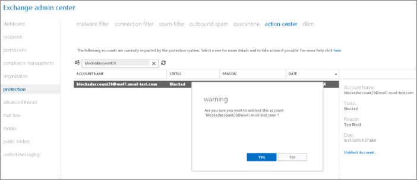

# ユーザー、ドメイン、または IP アドレスをスパム電子メール送信後のブロック一覧から削除するRemoving a user, domain, or IP address from a block list after sending spam email

スパムとして分類されている Office 365 からメール メッセージをユーザーが送り続ける場合、メッセージを送信しないようブロックされます。 If a user continuously sends email messages from Office 365 that is classified as spam, they will be blocked from sending any more messages. 
  

送信者がメール メッセージを送信しないようブロックされると、配信不能レポート (NDR つまりメールはメッセージの送信に失敗した) を受信します。このレポートは、ブロックを解除するために取る必要がある手順に関する特定の情報を提供します。When a sender is blocked from sending emails messages, they receive a Non-Delivery Report (NDR or email failed to send message) that provides specific information about the steps that they have to take to unblock themselves.
  
サービスが特定の web サイト、ドメイン、個々 のユーザーがブロックされ、だけでなく、IP アドレスをブロックすることもできます。場合によっては、ドメインまたは web サイト追加できますブロック リストに迷惑メール メッセージに表示されているからといって。として Office 365 の管理者、ユーザー、web サイト、ドメイン、およびサード パーティのブロック リストから削除する IP アドレスを取得しようことができます。このトピックの下部にあるテーブルのリンクを使用して、各サード パーティに連絡し、指示に従って操作します。場合は、Office 365 アカウントに他のユーザーが Office 365 の外部メッセージを送信できません、自分のアカウント可能性がありますが、最終的に外部の受信拒否リストに。Office 365 の外部のユーザーは、自分を[delisting のセルフ サービス ポータル](https://technet.microsoft.com/library/mt661881%28v=exchg.150%29.aspx)を使用して受信拒否リストから削除を試行できます。Not only can individual users be blocked by the service, but specific websites, domains, and IP addresses can also be blocked. In some cases, domains or websites can be added to a block list just because they appear in a spam message. As the Office 365 admin, you can try to get users, websites, domains, and IP addresses removed from third-party block lists. Use the links in the table at the bottom of this topic to contact each third party, and then follow the instructions. If someone outside Office 365 cannot send messages to your Office 365 account, their account may have ended up on the external blocked senders list. Users outside Office 365 can try to remove themselves from the blocked senders list by using the [self-service delisting portal](https://technet.microsoft.com/library/mt661881%28v=exchg.150%29.aspx).
  
スパムとして分類されているメールを送信しないよう Office 365 ユーザーがブロックされたときに、通知を受け取るよう送信スパム設定を構成できます。ユーザーのメールボックスの問題が解決されると、その送信者のブロックを解除できるようになります。You can configure outbound spam settings so that you get anotification when an Office 365 user is blocked from sending email that's classified as spam. After the problem with the user's mailbox is resolved, you can remove the block on that sender.
  
## ブロックされている Office 365 メール アカウントのブロックを解除するUnblock a blocked Office 365 email account

Exchange 管理センター (EAC) では、このタスクを完了するとします。EAC の詳細については、 [Exchange 管理センターでは、Exchange オンライン保護](exchange-admin-center-in-exchange-online-protection-eop.md)を確認します。You complete this task in the Exchange admin center (EAC). Check out [Exchange admin center in Exchange Online Protection](exchange-admin-center-in-exchange-online-protection-eop.md) for details about the EAC. 
  
> [!NOTE]
> Exchange Online の EAC 以外では、アクション センターは表示されません。You won't see the action center unless you're in the EAC for Exchange Online. 
  
1. EAC で**の保護**に移動\>**アクション センター**です。In the EAC, navigate to **protection** \> **action center**.
    
    
  
2. **[検索]** アイコンを選択し、ブロックされているユーザーの SMTP アドレスを入力します。Select the **Search** icon, and then enter the SMTP address of the blocked user. 
    
    
  
3. 説明ウィンドウの **[アカウントのブロック解除]** をクリックします。Click **Unblock Account** in the description pane. 
    
    
  
4. **[はい]** をクリックして変更を確定します。Click **Yes** to confirm the change. 
    
> [!NOTE]
> テナント管理者がアカウントのブロックを解除できる回数には制限があります。ユーザーに関して制限を超えると、エラー メッセージが表示されます。ユーザーのブロックを解除するには、サポートにお問い合わせください。There's a limit to the number of times that an account can be unblocked by the tenant admin. If the limit for a user has been exceeded, an error message appears. Contact Support to unblock the user. 
  
## サード パーティのブロック リストThird-party block lists

|**リスト名****List Name**|**リスト削除ポータル****Delisting Portal**|**詳細情報****For more information**|
|:-----|:-----|:-----|
|URIBLURIBL    |[https://admin.uribl.com/?section=lookup](https://admin.uribl.com/?section=lookup)   |[URIBL web サイトURIBL website ](https://uribl.com/)   |
|SURBLSURBL    |[http://www.surbl.org/surbl-analysis](http://www.surbl.org/surbl-analysis)   |[SURBL URI の評判のデータの概要Introducing SURBL URI reputation data](http://www.surbl.org/)   |
|Spamhaus Spamhaus    |[https://www.spamhaus.org/lookup/](https://www.spamhaus.org/lookup/)   |[DNSBL フィルタ リングを理解します。Understanding DNSBL Filtering](https://www.spamhaus.org/whitepapers/dnsbl_function/)   |
|invaluementinvaluement    |[http://dnsbl.invaluement.com/lookup/](http://dnsbl.invaluement.com/lookup/)   |[invaluement スパム対策リストinvaluement anti-spam list](http://dnsbl.invaluement.com/)   |
|PhishtankPhishtank    |[https://www.phishtank.com/](https://www.phishtank.com/)   |[PhishTank のよく寄せられる質問PhishTank FAQ](https://www.phishtank.com/faq.php)   |
   
> [!NOTE]
> また、Exchange のオンライン保護は、スパムのフィルタ リングのサード パーティのブロック リストを使用します。Exchange Online Protection also uses third-party block lists for spam filtering. 
   
## 詳細情報For more information

[送信スパム ポリシーを構成するConfigure the outbound spam policy](configure-the-outbound-spam-policy.md)
  
[送信メッセージにおける危険度の高い配信プールHigh-risk delivery pool for outbound messages](high-risk-delivery-pool-for-outbound-messages.md)

[リストから除外のポータルを使って Office 365 の受信拒否リストから自分自身を削除するUse the delist portal to remove yourself from the Office 365 blocked senders list](use-the-delist-portal-to-remove-yourself-from-the-office-365-blocked-senders-lis.md)
  

  

