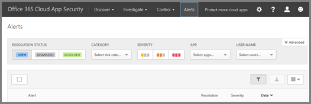

# Office 365 Cloud App Security の警告の確認と処理Review and take action on alerts in Office 365 Cloud App Security
  
|評価 \* *\>*\*\*\*\*\*Evaluation\*\* \>\*\*|計画 \* *\>*\*\*\*\*\*Planning\*\* \>\*\*|展開 \* *\>*\*\*\*\*\*Deployment\*\* \>\*\*|使用率 \* \* \* \*\*\*\*\*Utilization\*\*\*\*|
|:-----|:-----|:-----|:-----|
|[評価の開始Start evaluating](office-365-cas-overview.md)   |[計画を開始するStart planning](get-ready-for-office-365-cas.md)   |[展開を開始するStart deploying](turn-on-office-365-cas.md)   |ここでは、You are here!    [次の手順Next steps](#next-steps)   |
   
Office 365 Cloud App Security の [通知] ページを使用して、潜在的な問題を表示したり、必要に応じてアクションを実行したりできます。You can use the Alerts page in Office 365 Cloud App Security to view potential issues and, if needed, take action.
  
> [!NOTE]
> この記事に記載されているタスクを実行するには、全体管理者またはセキュリティ管理者である必要があります。You must be a global administrator or security administrator to perform the tasks in this article. 「 [Office 365 セキュリティ&amp;コンプライアンスセンターのアクセス許可」を](permissions-in-the-security-and-compliance-center.md)参照してください。See [Permissions in the Office 365 Security &amp; Compliance Center](permissions-in-the-security-and-compliance-center.md). 
  
## [通知] ページにアクセスする方法How to get to the Alerts page

1. Cloud App Security ポータル ([https://portal.cloudappsecurity.com](https://portal.cloudappsecurity.com)) に移動し、サインインします。Go to the Cloud App Security portal ([https://portal.cloudappsecurity.com](https://portal.cloudappsecurity.com)) and sign in.
  
2. 画面上部のナビゲーションバーで、[**通知**] を選択します。In the navigation bar across the top of the screen, choose **Alerts**. ![[通知] ページには、トリガーされた通知と実行されたアクションが表示されます。](media/3b53d4c9-4b13-435d-8547-8c0f9ae6b914.png)
 
> [!NOTE]
> Cloud App security alerts は、Security & コンプライアンスセンターにも表示されます ([**アラート** > **表示**] [アラート] に移動します。Cloud App Security alerts are also visible in the Security & Compliance Center (go to **Alerts** > **View alerts**. ただし、現時点では、Cloud App security ポータルと security & コンプライアンスセンターの両方でこれらのアラートを解決する必要があります。Currently, however, you must resolve these alerts in both the Cloud App Security portal and the Security & Compliance Center. 詳細については、「 [Cloud App Security alerts を表示](alert-policies.md#viewing-cloud-app-security-alerts)する」を参照してください)。To learn more, see [Viewing Cloud App Security alerts](alert-policies.md#viewing-cloud-app-security-alerts).) 
 
## 通知を確認して処理するReview and handle alerts

通知は、さらに調べる必要がある Office 365 クラウド環境内のアクティビティを識別するのに役立ちます。Alerts help you identify activities in your Office 365 cloud environment that you might want to investigate further. 表示される通知に基づいて、新しいポリシーを作成したり、既存のポリシーを編集したりすることもできます。You might also decide to create new policies or edit existing policies based on the alerts you see. たとえば、奇妙な場所からログオンしている管理者が表示された場合は、管理者が特定の場所から Office 365 にサインインできないようにするポリシーを設定することができます。For example, if you see an administrator logging on from a strange location, you may decide to set up a policy that prevents administrators from signing in to Office 365 from certain locations.
  
> [!TIP]
> 最も重要なものを最初に管理できるように、アラートを**カテゴリ**または**重要度**別にフィルター処理できます。You can filter the alerts by **Category** or by **Severity** so you can manage the most important ones first. 
  
各警告について、どのようなアクションを実行するかを決定できるようにするために、原因を調べます。For each alert, look into what caused it so you can decide what action to take. アラートの解決やユーザーアカウントの中断など、アラートの詳細を確認し、アクションを実行するには、通知を選択して [詳細] ページを開きます。To see more details about an alert and to take action, such as resolving the alert or suspending a users account, choose the alert to open a details page. [詳細] ページでは、通知に関連するアクティビティログ、アカウント、およびユーザーを確認し、次のような操作を実行できます。On the details page, you can review the activity log, accounts, and users that are related to the alert, and take actions such as the following:
  
- **アラームを消す**警告が誤検知であった場合は、それを閉じます。**Dismiss** If the alert was a false positive, dismiss it. 必要に応じて、省略した理由を説明するコメントを追加することもできます。You can optionally add a comment explaining why you dismissed it. 
    
- **アラートの解決**脅威ではないと判断された通知が発生した場合は、それを解決します。**Resolve alert** If the alert was triggered by an activity that you know isn't a threat, resolve it. 必要に応じて、解決理由を説明するコメントを追加することもできます。You can optionally add a comment explaining why you resolved it. 
    
- **Suspend**アカウントに対して認証されていないサインインが疑われる場合、たとえば他の国からサインインしている場合は、その人物が物理的にローカルオフィスにいることがわかっている場合は、何が起こっているのかを調査している間、[そのアカウントを中断](suspend-or-restore-an-account-in-ocas.md)することができます。**Suspend** If you suspect unauthorized sign ins on an account, for example, someone signing in from another country when you know that person is physically at a local office, you can [suspend the account](suspend-or-restore-an-account-in-ocas.md) while you investigate what's going on. 
    
## 次の手順Next steps

- [アクティビティを調べるInvestigate an activity](investigate-an-activity-in-office-365-cas.md)
    
- [ユーザーアカウントを中断または復元するSuspend or restore a user account](suspend-or-restore-an-account-in-ocas.md)
    
- サポートされている[Web トラフィックログとデータソース](web-traffic-logs-and-data-sources-for-ocas.md)の一覧を表示するView a list of supported [Web traffic logs and data sources](web-traffic-logs-and-data-sources-for-ocas.md)
    
- [Office 365 Cloud App Security の使用率のアクティビティを](utilization-activities-for-ocas.md)確認するReview your [utilization activities for Office 365 Cloud App Security](utilization-activities-for-ocas.md)
    

