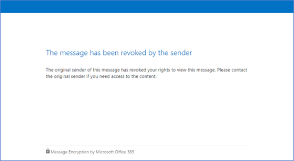

# <a name="office-365-message-encryption-email-revocation"></a><span data-ttu-id="c27f0-103">Office 365 のメッセージの暗号化メールの取り消し</span><span class="sxs-lookup"><span data-stu-id="c27f0-103">Office 365 Message Encryption email revocation</span></span>

<span data-ttu-id="c27f0-p101">この資料は、 [Office 365 のメッセージの暗号化](ome.md)についての記事の大規模な一連の一部です。プレビューでは、現在、暗号化された電子メールの取り消しです。当社の製品を改善していく機能と、コンテンツに対する更新や変更を期待してください。</span><span class="sxs-lookup"><span data-stu-id="c27f0-p101">This article is part of a larger series of articles about [Office 365 Message Encryption](ome.md). Right now, encrypted email revocation is in preview. Expect updates and changes to the feature and the content as we continue to improve our offering.</span></span>

<span data-ttu-id="c27f0-p102">必要がありますが既に送信されている電子メールを無効にします。電子メールが Office 365 のメッセージの暗号化を使用して暗号化された Office 365 管理者は、する場合は、これを行う特定の条件下でメールをします。[どのような状況は考えられるとそれを行う方法について説明します。</span><span class="sxs-lookup"><span data-stu-id="c27f0-p102">You may find it necessary to revoke an email that has already been sent. If the email was encrypted using Office 365 Message Encryption, and you are an Office 365 admin, you can do this for email under certain conditions. This article describes under what circumstances this is possible and how to do it.</span></span>
  
## <a name="encrypted-emails-that-you-can-revoke"></a><span data-ttu-id="c27f0-110">暗号化された電子メールを無効にすること</span><span class="sxs-lookup"><span data-stu-id="c27f0-110">Encrypted emails that you can revoke</span></span>

<span data-ttu-id="c27f0-p103">受信者を受信した場合、リンク ・ ベース、暗号化された電子メールのブランドは、暗号化された電子メールを取り消すことができます。受信者は、サポートされている Outlook クライアントで、インラインのネイティブ機能を受信する場合は、これらの e メールを取り消すことはできません。</span><span class="sxs-lookup"><span data-stu-id="c27f0-p103">You can revoke encrypted emails if the recipient received a link-based, branded encrypted email. If the recipient received a native inline experience in a supported Outlook client, then those emails cannot be revoked.</span></span>

<span data-ttu-id="c27f0-p104">リンク ベースの操作性を受け取った受信者かどうか、またはインライン経験は、受信者の id の種類によって異なります: Office 365 と Microsoft アカウントの受信者 (たとえば、outlook.com ユーザー) がサポートされている Outlook クライアントでインライン経験を取得します。すべての他の受信者の種類など Gmail の受信者は、リンク ベースの操作性を取得します。</span><span class="sxs-lookup"><span data-stu-id="c27f0-p104">Whether a recipient receives a link-based experience or an inline experience depends on the recipient identity type: Office 365 and Microsoft Account recipients (for example, outlook.com users) get an inline experience in supported Outlook clients. All other recipient types, such as Gmail recipients, get a link-based experience.</span></span>

<span data-ttu-id="c27f0-p105">まもなく、組織は、受信者の id に関係なくリンク ベースのエクスペリエンスを強制する機能があります。この方法では、すべての受信者にブランドの電子メールと暗号化された電子メールを読み、返信できないこと、Office 365 のメッセージの暗号化のポータルへのリンクが表示されます。このようなすべての暗号化された電子メールは取り消しになります。</span><span class="sxs-lookup"><span data-stu-id="c27f0-p105">Coming soon, organizations will have the ability to force a link-based experience regardless of the recipient identity. This way, all recipients will get a branded email with a link to the Office 365 Message Encryption portal where they will be able to read and reply to encrypted emails. All such encrypted emails will be revocable.</span></span>
  
## <a name="recipient-experience-for-revoked-encrypted-emails"></a><span data-ttu-id="c27f0-118">失効した暗号化された電子メールの受信者の経験</span><span class="sxs-lookup"><span data-stu-id="c27f0-118">Recipient experience for revoked encrypted emails</span></span>

<span data-ttu-id="c27f0-119">電子メールが取り消された後、受信者エラーが表示されます Office 365 のメッセージの暗号化のポータルを通じて、暗号化された電子メールにアクセスしようとしています:「メッセージは、送信者によって失効されています」。</span><span class="sxs-lookup"><span data-stu-id="c27f0-119">Once an email has been revoked, the recipient will get an error when trying to access the encrypted email through the Office 365 Message Encryption portal: “The message has been revoked by the sender”.</span></span>



## <a name="how-to-revoke-an-encrypted-email"></a><span data-ttu-id="c27f0-121">暗号化された電子メールを破棄する方法</span><span class="sxs-lookup"><span data-stu-id="c27f0-121">How to revoke an encrypted email</span></span>

### <a name="step-1-obtain-the-message-id-of-the-email"></a><span data-ttu-id="c27f0-p106">手順 1 です。電子メールのメッセージ ID を取得します。</span><span class="sxs-lookup"><span data-stu-id="c27f0-p106">Step 1. Obtain the Message ID of the email</span></span>

<span data-ttu-id="c27f0-p107">暗号化されたメールを取り消すことができる前に、メールのメッセージ ID を収集する必要があります。メッセージ Id は、通常の形式。</span><span class="sxs-lookup"><span data-stu-id="c27f0-p107">Before you can revoke an encrypted mail you need to gather the Message ID of the mail. The MessageId is usually of the format:</span></span>

`<xxxxxxxxxxxxxxxxxxxxxxx@xxxxxx.xxxx.prod.outlook.com>`  

<span data-ttu-id="c27f0-p108">無効にする電子メールのメッセージ ID を検索する複数の方法があります。いくつかのオプションの説明ですが、ID を提供する任意のメソッドを使用することができます。</span><span class="sxs-lookup"><span data-stu-id="c27f0-p108">There are multiple ways to find the Message ID of the email that you want to revoke. This section describes a couple of options, but you can use any method that provides the ID.</span></span>

#### <a name="to-identify-the-message-id-of-the-email-you-want-to-revoke-by-using-message-trace-in-the-security-amp-compliance-center"></a><span data-ttu-id="c27f0-128">セキュリティ メッセージのトレースを使用して無効に電子メールのメッセージ ID を識別する&amp;コンプライアンス センター</span><span class="sxs-lookup"><span data-stu-id="c27f0-128">To identify the Message ID of the email you want to revoke by using Message Trace in the Security &amp; Compliance Center</span></span>

1. <span data-ttu-id="c27f0-129">送信者または受信者が[Office 365 のセキュリティ & コンプライアンス センターに新しいメッセージのトレース](https://blogs.technet.microsoft.com/exchange/2018/05/02/new-message-trace-in-office-365-security-compliance-center/)を使用して電子メールを検索します。</span><span class="sxs-lookup"><span data-stu-id="c27f0-129">Search for the email by sender or recipient using [New Message Trace in Office 365 Security & Compliance Center](https://blogs.technet.microsoft.com/exchange/2018/05/02/new-message-trace-in-office-365-security-compliance-center/).</span></span>
2. <span data-ttu-id="c27f0-p109">見つけた後、電子メールは**メッセージのトレースの詳細**ペインを表示を選択します。メッセージ ID を検索するのには**詳細情報**を展開します。</span><span class="sxs-lookup"><span data-stu-id="c27f0-p109">Once you've located the email select it to bring up the **Message trace details** pane. Expand **More Information** to locate the Message ID.</span></span>

#### <a name="to-identify-the-message-id-of-the-email-you-want-to-revoke-by-using-office-message-encryption-reports-in-the-security-amp-compliance-center"></a><span data-ttu-id="c27f0-132">セキュリティで Office のメッセージの暗号化のレポートを使用して解除しメールのメッセージ ID を識別する&amp;コンプライアンス センター</span><span class="sxs-lookup"><span data-stu-id="c27f0-132">To identify the Message ID of the email you want to revoke by using Office Message Encryption reports in the Security &amp; Compliance Center</span></span>

1. <span data-ttu-id="c27f0-133">セキュリティ&amp;コンプライアンス センターでは、**メッセージの暗号化のレポート**に移動します。</span><span class="sxs-lookup"><span data-stu-id="c27f0-133">In the Security &amp; Compliance Center, navigate to the **Message Encryption Report**.</span></span>
2. <span data-ttu-id="c27f0-134">**詳細を表示する**テーブルを選択し、無効にするメッセージを識別します。</span><span class="sxs-lookup"><span data-stu-id="c27f0-134">Choose the **View details** table and identify the message that you want to revoke.</span></span>
3. <span data-ttu-id="c27f0-135">メッセージ ID を含む詳細を表示するメッセージをダブルクリックしてください。</span><span class="sxs-lookup"><span data-stu-id="c27f0-135">Double-click the message to view details that include the Message ID.</span></span>

### <a name="step-2-revoke-the-mail"></a><span data-ttu-id="c27f0-p110">手順 2 です。メールを取り消す</span><span class="sxs-lookup"><span data-stu-id="c27f0-p110">Step 2. Revoke the mail</span></span>  

<span data-ttu-id="c27f0-138">無効に電子メールのメッセージ ID がわかったら、セット OMEMessageRevocation コマンドレットを使用して電子メールを取り消すことができます。</span><span class="sxs-lookup"><span data-stu-id="c27f0-138">Once you know the Message ID of the email you want to revoke, you can revoke the email by using the Set-OMEMessageRevocation cmdlet.</span></span>

1. <span data-ttu-id="c27f0-139">[オンライン リモート PowerShell を使用して Exchange に接続](https://docs.microsoft.com/powershell/exchange/exchange-online/connect-to-exchange-online-powershell/connect-to-exchange-online-powershell?view=exchange-ps)します。</span><span class="sxs-lookup"><span data-stu-id="c27f0-139">[Connect to Exchange Online Using Remote PowerShell](https://docs.microsoft.com/powershell/exchange/exchange-online/connect-to-exchange-online-powershell/connect-to-exchange-online-powershell?view=exchange-ps).</span></span>

2. <span data-ttu-id="c27f0-140">とおりセット OMEMessageRevocation コマンドレットを実行します。</span><span class="sxs-lookup"><span data-stu-id="c27f0-140">Run the Set-OMEMessageRevocation cmdlet as follows:</span></span>

    ```powershell
    Set-OMEMessageRevocation -Revoke $true -MessageId "<messageId>"
    ```  

3. <span data-ttu-id="c27f0-141">電子メールが無効になっているかどうかを確認するには、次のように Get OMEMessageStatus コマンドレットを実行します。</span><span class="sxs-lookup"><span data-stu-id="c27f0-141">To check whether the email was revoked, run the Get-OMEMessageStatus cmdlet as follows:</span></span>

    ```powershell
    Get-OMEMessageStatus -MessageId "<messageId>" | fl Revoked
    ```  
    <span data-ttu-id="c27f0-142">取り消しが成功した場合、コマンドレットは、次の結果を返します。</span><span class="sxs-lookup"><span data-stu-id="c27f0-142">If revocation was successful, the cmdlet returns the following result:</span></span>  

    `Revoked: True`
