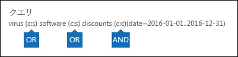

# <a name="run-a-content-search-in-the-office-365-security-amp-compliance-center"></a>Office 365 のセキュリティ コンテンツの検索を実行する&amp;コンプライアンス センター

Office 365 のセキュリティで電子的証拠開示されているコンテンツの検索ツールを使用する&amp;など、電子メール、ドキュメント、およびインスタント メッセージの会話、Office 365 の組織内の項目を検索するコンプライアンス センターです。これらの Office 365 サービスの項目を検索するには、このツールを使用します。
  
- オンラインの Exchange メールボックスとパブリック フォルダー
    
- SharePoint Online とビジネス サイトの OneDrive
    
- Skype のビジネス会話
    
- Microsoft Teams 
    
- Office 365 グループ
    
コンテンツの検索は、新規あるいは強化された拡張とパフォーマンスの機能を備えた新しい電子的証拠開示検索ツールです。コンテンツの検索を使用すると、非常に大規模な電子的証拠開示検索を実行できます。ビジネス アカウントを 1 つのコンテンツ検索では、すべてのメールボックス、すべての Exchange パブリック フォルダー、およびすべての SharePoint Online サイトと OneDrive を検索できます。検索可能なコンテンツの場所の数に制限はありません。同時に実行できる検索の数に制限はありません。コンテンツの検索、コンテンツの場所の数を実行すると、詳細ペインで、[**コンテンツの検索**] ページで、検索結果の推定数が表示されます。検索を実行した後、結果をプレビュー表示、1 つのキーワードの統計情報を取得、または他の検索エンジンは、コンテンツの検索を一括編集し、結果をローカル コンピューターにエクスポートします。 
  
 **内容**
  
[検索を作成します。](run-a-content-search-in-the-security-and-compliance-center.md#create)
  
[検索結果をエクスポートする](run-a-content-search-in-the-security-and-compliance-center.md#export)
  
[検索結果のプレビュー](run-a-content-search-in-the-security-and-compliance-center.md#preview)
  
[検索結果の更新](run-a-content-search-in-the-security-and-compliance-center.md#restart)
  
[検索を編集する](run-a-content-search-in-the-security-and-compliance-center.md#edit)
  
[検索をやり直す](run-a-content-search-in-the-security-and-compliance-center.md#retry)
  

  
## <a name="before-you-begin"></a>はじめに

- 情報および建物の検索クエリと、ブール検索演算子を使用して[クエリのキーワードとコンテンツの検索の検索条件](keyword-queries-and-search-conditions.md)を参照してください。この資料には、機密性の高い情報の種類を検索し、組織の内外のユーザーと共有されているコンテンツの検索に関する情報も含まれています。
    
- 検索およびプレビューを実行し、検索結果をエクスポートする**コンテンツの検索**ページへのアクセスを持つ、管理者、法令遵守責任者、または電子的証拠開示マネージャーする必要があります、セキュリティで電子的証拠開示マネージャーの役割グループのメンバー&amp;コンプライアンスセンターです。追加の検索またはアクセス許可、Exchange Online 日、SharePoint Online では、OneDrive ビジネス サイトを割り当てる必要はありません。詳細についてを参照してください[Office 365 のセキュリティ、電子的証拠開示のアクセス許可を割り当てる&amp;コンプライアンス センター](assign-ediscovery-permissions.md)です。
    
- 状態と Office 365 の組織に提供するサービスの品質を維持するためにコンテンツの検索に適用される制限があります。ほとんどの場合、これらの制限を変更することはできませんが、注意すべきことのできるように、計画、実行、および検索をトラブルシューティングする際の考慮事項にこれらの制限を行うことができます。詳細についてを参照してください[の検索では、Office 365 のセキュリティの制限&amp;コンプライアンス センター](limits-for-content-search.md)です。
    
- 1 つのコンテンツの検索で検索対象となるメールボックスの数に基づく推定検索時間のセクションを参照してください。 
    
- 前述したように、Office 365 のグループおよびマイクロソフトのチームのコンテンツを検索するコンテンツの検索を使用できます。これは、グループのメールボックス、共有の予定表、および Office 365 グループとマイクロソフトのチームに関連付けられている SharePoint サイトを検索することを意味します。さらに、マイクロソフトのチームで、チャネルの会話を検索できます。Office 365 のグループとマイクロソフトのチームについてを参照してください。
    
  - [Office 365 グループについてください。](https://support.office.com/article/b565caa1-5c40-40ef-9915-60fdb2d97fa2)
    
  - [マイクロソフトのチームを支援します。](https://support.office.com/article/23156c0c-2c6e-49dd-8b7b-7c564b76508c)
    
    Office 365 のグループとマイクロソフトのチーム内のコンテンツの検索に関するヒントを参照してください。 
    
[Return to top](run-a-content-search-in-the-security-and-compliance-center.md#top)
  
## <a name="create-a-search"></a>検索を作成します。
<a name="create"> </a>

1. [https://protection.office.com](https://protection.office.com) に移動します。
    
2. 職場、学校のアカウントを使用して Office 365 にサインインします。
    
3. セキュリティ/コンプライアンス センターの左側のウィンドウで、**[検索と調査]** \> **[コンテンツ検索]** の順にクリックします。
    
4. **[新規作成]**![[追加] アイコン](media/O365-MDM-CreatePolicy-AddIcon.gif)をクリックします。
    
5. **[新規検索]** ページで、コンテンツ検索の名前を入力します。この名前は、組織内で固有である必要があります。 
    
6. 検索するコンテンツの場所を選択します。同じ検索では、メールボックス、サイト、およびパブリック フォルダーを検索できます。
    
    
  
1. **すべての場所の検索**組織内のすべてのコンテンツの場所を検索するには、このオプションを選択します。このオプションを選択すると (を含む非アクティブなメールボックスとメールボックスのすべての Office 365 のグループとマイクロソフトのチーム) のすべてのメールボックスを検索することができますすべての SharePoint とビジネス サイトの OneDrive (Office 365 のすべてのグループのサイトが含まれていますが、マイクロソフトのチームの場合)、およびすべてのパブリック フォルダーです。
    
    
  
2. **カスタムの場所の選択**メールボックスを検索するサイトを選択するには、このオプションを選択します。このオプションを選択した場合 (すべての Exchange メールボックスを検索するには) などの特定のサービスのすべてのコンテンツの場所を検索するのには柔軟性がある場合や、Office 365 サービスの特定のコンテンツの場所を検索することができます。
    
    検索するコンテンツの場所を追加する場合は、以下に注意してください。
    
    **メールボックス**
    
  - **追加**をクリックすると、を検索するメールボックスを指定するには表示されているメールボックスの選択が空です。これはパフォーマンスを強化するための仕様です。このリストに受信者を追加するのには、[検索] ボックスに名前 (3 文字以上) を入力し、[**検索**] をクリックして。
    
  - 検索するメールボックスの一覧には、非アクティブなメールボックスと配布グループを追加できます。配布グループがグループのメンバーのメールボックスが検索されます。動的配布グループがサポートされていないことに注意してください。
    
  - コマンドを実行して、組織内の非アクティブなメールボックスの一覧を取得するには、`Get-Mailbox -InactiveMailboxOnly`では、Exchange オンライン PowerShell。代わりに、**データ ・ ガバナンス**に進むことができます\>、セキュリティの**保持**&amp;コンプライアンス センターでは、[**詳細**] をクリックし、 \> **非アクティブなメールボックス**。
    
  - Office 365 グループまたはマイクロソフト チームに関連付けられているメールボックスを追加することもできます。この例では、グループまたはチームのメールボックスのみが検索されます。グループまたはチームのメンバーのメールボックスが検索されません。それらを検索するには、具体的には、検索に追加するのにはあります。
    
  - 検索するすべてのメールボックスが含まれていない場合は、**特定のメールボックスを検索するオプションを指定して**、選択が、メールボックスを一覧に追加しません。
    
    **サイト**
    
  - [**追加**] をクリックしてサイトを検索に追加します。検索する各サイトの URL を入力します。コンテンツの検索ツールは、URL を検証しを検索するサイトの一覧に追加します。 
    
  - Office 365 グループまたはマイクロソフト チームに関連付けられている SharePoint を追加することができます。グループまたはチームの URL を検索する方法に関するガイダンスについてを参照してください。 
    
  - サイトに含まれるすべての検索にする場合は、選択**オプションを指定して特定のサイト**がサイトを一覧に追加しません。
    
    **パブリック フォルダー**
    
    パブリック フォルダーは、Exchange Online 組織内のすべてのパブリック フォルダーを検索または任意のパブリック フォルダーを検索することができます。
    
7. [ **次へ**] をクリックします。
    
8. **[新しい検索]** ページで、検索クエリを作成するためのキーワードと条件を追加できます。 
    
    
  
1. の下のボックスで**たい項目を検索することですか?**、ボックスに検索クエリを入力します。キーワード、プロパティは次のように送信し、日付、またはファイル名などのドキュメント プロパティ、またはドキュメントが最後に変更された日付を受信したメッセージを指定できます。**AND**、**または**、**ない**、 **NEAR**、または**ONEAR**などのブール演算子を使用するより複雑なクエリを使用することができます。などの機密情報 (社会保障番号) のドキュメント、または外部で共有されているドキュメントの検索で検索することもできます。場合は、[キーワード] ボックスを空白のままにすると、指定されたコンテンツの場所にあるすべてのコンテンツが検索結果に含まれます。 
    
2. それぞれの行のキーワード**キーワードの一覧を表示**] チェック ボックスと種類をクリックします。これを行うには、それぞれの行のキーワードが作成される検索クエリで**OR**演算子で接続されています。 
    
    
  
    キーワードの一覧を使用する理由各キーワードに一致する数の項目を表示する統計情報を取得できます。どのキーワードは、(と最も少ない) 効果をすばやく識別できます。(かっこで囲まれている) のキーワード句は、行にも使用できます。検索の統計情報の詳細については、[コンテンツの検索結果のキーワードの統計情報を表示](view-keyword-statistics-for-content-search.md)を参照してください。
    
    キーワードの一覧の使用方法のガイダンスについては、「を参照してください。 
    
3. サポートされていない文字および資本化する可能性がありますいないブール型の演算子は、クエリを確認する**クエリの入力ミスのチェック**をクリックします。サポートされていない文字は多くの場合は非表示にし、通常検索エラーが発生するまたは意図しない結果が返されます。チェックがサポートされていない文字の詳細については、[エラーのためにコンテンツの検索クエリを確認する](check-your-content-search-query-for-errors.md)を参照してください。
    
4. **条件**の下では、検索を絞り込むより洗練された結果セットを返す検索クエリに条件を追加します。各条件は、KQL 検索クエリが作成され、検索を開始するときに実行するに句を追加します。条件の論理的な**AND**演算子によってキーワード クエリ ([キーワード] ボックスで指定) に接続します。キーワード クエリと結果に含まれる条件の両方を満たすために項目があることを意味します。これは、結果を絞り込む条件がどのように役立つか。 
    
||
|:-----|
|検索クエリを作成し、条件を使用する方法の詳細については、[キーワード クエリとコンテンツの検索の検索条件](keyword-queries-and-search-conditions.md)を参照してください。 |
   
9. **[検索]** をクリックして、検索設定を保存して検索を開始します。 
    
    検索が開始されます。検索が完了したら、詳細ペインで、次の情報が表示されます。
    
    
  
1. 日付と時刻、検索が最後に実行します。
    
2. 数 (と合計サイズ) の項目が検出された検索クエリと一致します。項目の種類の例には、電子メール メッセージ、予定表アイテム、およびドキュメントが含まれます。項目に検索されているキーワードの複数のインスタンスが含まれている場合のみ 1 回のアイテムの合計数に数えられます。たとえば、「株式」の単語を検索するか、「ヒント」と電子メール メッセージに「株式」という単語の 3 つのインスタンスが含まれている、だけ数えられます 1 回**アイテム**] フィールドで。 
    
3. 数と検索されたコンテンツの場所のインデックスの項目の合計サイズ。検索条件に一致しないインデックスの項目の数は、詳細ペインに表示される検索の統計情報に含まれます。(その他のメッセージまたはドキュメントのプロパティは、検索条件を満たす) ため、検索クエリを実行する項目のインデックスを持たない一致の場合は、インデックスの項目の推定数に含まれません。ただし、インデックスを持たないアイテムは、検索条件によって除外されて場合、インデックス付けされない品目の見積に含まはありません。
    
4. 検索対象となったコンテンツの場所の種類ごとの数です。、メールボックスのアーカイブ メールボックスが検索されたメールボックスの合計数に含まれることに注意してください。前の例では、4 つのユーザーのメールボックスが検索され、これらのユーザーごとのアーカイブ先のメールボックスが有効になっています。その 8 個のメールボックスが検索の統計で示されています。
    
5. 検索のプレビューへのリンクは、結果または検索の統計情報を更新するには、もう一度検索を実行します。
    
    **更新**] をクリックして、必要に応じて詳細ペインで、選択した検索の情報を更新します。 
    
[Return to top](run-a-content-search-in-the-security-and-compliance-center.md#top)
  
## <a name="export-search-results"></a>検索結果をエクスポートする
<a name="export"> </a>

検索が正常に実行すると、検索結果をローカル コンピューターにエクスポートできます。メールの結果をエクスポートする場合は、PST ファイルとしてコンピューターにダウンロードしています。SharePoint および OneDrive からビジネス サイトのコンテンツをエクスポートする場合は、ネイティブの Office ドキュメントのコピーがエクスポートされます。追加のドキュメント、エクスポートした検索結果に含まれているレポートもあります。詳細についてを参照してください[Office 365 のセキュリティのエクスポートの検索結果を&amp;コンプライアンス センター](export-search-results.md)です。
  
## <a name="preview-search-results"></a>検索結果のプレビュー
<a name="preview"> </a>

検索が正常に完了したら、検索結果をプレビューできます。いくつかのコンテンツの検索結果のプレビューに関連する制限があります。詳細についてを参照してください[の検索では、Office 365 のセキュリティの制限&amp;コンプライアンス センター](limits-for-content-search.md)です。インデックスを持たないアイテムをプレビューするため使用できないことに注意してください。
  
1. **コンテンツの検索**ページで、検索を選択します。 
    
2. 詳細ペインの **[結果]** にある **[検索結果のプレビュー]** をクリックします。**[検索結果のプレビュー]** ページが開き、検索結果アイテムの一覧が示されます。 
    
    件名、種類、送信者、または移動元のメールボックスのアイテムが受信された日付に基づいて結果を並べ替えるには列ヘッダーをクリックすることができます。
    
3. アイテムをプレビューする] をクリックします。
    
    プレビュー ウィンドウで、アイテムを開きます。
    
4. プレビューを表示するか、ドキュメントのコピーをダウンロードするファイルの種類がサポートされていない場合は、**元のファイルをダウンロード**してローカル コンピューターにダウンロードするをクリックできます。Web ページ、.aspx のページの URL は、ページにアクセスする権限がない可能性が含まれています。 
    
> [!NOTE]
> 7 日以上前が最後に実行した検索の検索結果をプレビューする場合は、検索結果の更新が求められます。検索は、検索クエリに一致する最新の結果を得るため再実行します。 
  
### <a name="file-types-that-can-be-previewed"></a>プレビューできるファイルの種類

プレビュー ウィンドウでサポートされているファイルの種類をプレビューすることができます。ファイルの種類がサポートされていない場合は、それを表示するのにはローカル コンピューターにファイルのコピーをダウンロードする必要があります。次のファイルの種類はサポートされているし、[**検索結果のプレビュー** ] ページのプレビューを表示できます。 
  
- .txt、.html、.mhtml
    
- .eml
    
- .doc、.docx、.docm
    
- .pptm、.pptx
    
- .pdf
    
さらに、次のファイルのコンテナーの種類はサポートされています。プレビュー ウィンドウ内のコンテナーには、ファイルの一覧を表示できます。
  
- .zip
    
- .gzip
    
[Return to top](run-a-content-search-in-the-security-and-compliance-center.md#top)
  
## <a name="update-search-results"></a>検索結果の更新
<a name="restart"> </a>

既存のコンテンツ検索の結果を更新すると、指定されたコンテンツの場所をすべての検索クエリが再実行します。検索結果を更新するのには明確な理由は、最新のデータです。
  
1. **[コンテンツ検索]** ページで、結果を更新する検索を選択します。 
    
2. 詳細ペインの **[結果]** にある **[検索結果の更新]** をクリックします。
    
    結果が取得されることを示すステータス メッセージが表示されます。検索が完了したらは、詳細ペインで、[**結果**] で更新された情報が表示されます。現在の日付と時刻の詳細ペインで、**検索**] フィールドに日付が更新されることに注意してください。コンテンツの検索結果の一覧の情報を更新するのには [**更新**] をクリックします。
    
[Return to top](run-a-content-search-in-the-security-and-compliance-center.md#top)
  
## <a name="edit-a-search"></a>検索を編集する
<a name="edit"> </a>

移行元のメールボックスと、検索クエリを変更するには、既存のコンテンツ検索の。
  
1. **コンテンツの検索**ページで、検索を選択します。 
    
2. 詳細ペインの **[クエリ]** にある **[検索を編集する]** をクリックします。
    
3. [**場所**] ページで、メールボックス、グループ、SharePoint サイトやビジネス サイトの検索の OneDrive を変更できます。選択することもできます (または選択を解除します) Exchange のすべてのパブリック フォルダーを検索します。 
    
4. [**クエリ**] ページで、検索クエリを編集できます。 
    
5. 改訂版の検索を開始するには、**ソース**または**場所**のいずれかのページで**検索**をクリックします。 
    
    改訂後の検索が開始されます。検索が完了したら、改訂後の検索の推定結果が表詳細ウィンドウに示されます。
    
## <a name="retry-a-search"></a>検索をやり直す
<a name="retry"> </a>

検索では、すべてのエラーが返された場合は再度すべてのコンテンツの場所を検索する必要はありません。失敗したコンテンツの場所だけをもう一度検索ができるように、検索を再実行できます。再すべてのコンテンツの場所を検索するには、検索結果を更新できます。
  
1. **コンテンツの検索**] ページで、[再検索するコンテンツの場所を含む検索を選択します。 
    
2. 詳細ペインの **[エラー]** にある **[検索をやり直す]** をクリックします。
    
    結果が取得されることを示すステータス メッセージが表示されます。検索が完了するは、詳細ペインで、[**結果**の更新情報が表示されます。現在の日付と時刻の詳細ペインで、**検索**] フィールドに日付が更新されることに注意してください。検索のリスト内の情報を更新するのには [**更新**] をクリックします。
    
[先頭へ戻る](run-a-content-search-in-the-security-and-compliance-center.md#top)
  
## <a name="more-information"></a>詳細情報
<a name="moreinfo"> </a>

コンテンツの検索の詳細については、ここで。
  
[制限事項とパフォーマンス](run-a-content-search-in-the-security-and-compliance-center.md#limits)
  
[インデックス付けされない項目](run-a-content-search-in-the-security-and-compliance-center.md#unindexeditems)
  
[マイクロソフトのチームと Office 365 のグループ](run-a-content-search-in-the-security-and-compliance-center.md#teams)
  
[OneDrive for Business](run-a-content-search-in-the-security-and-compliance-center.md#onedrive)
  
[検索クエリ](run-a-content-search-in-the-security-and-compliance-center.md#queries)
  
[非アクティブなメールボックスを検索](run-a-content-search-in-the-security-and-compliance-center.md#inactivemailboxes)
  
[その他](run-a-content-search-in-the-security-and-compliance-center.md#misc)
  
[(先頭に戻る)](run-a-content-search-in-the-security-and-compliance-center.md#top)
  
 **制限事項とパフォーマンス**
  
- コンテンツの検索機能に適用される制限についてを参照してください[の検索では、Office 365 のセキュリティの制限&amp;コンプライアンス センター](limits-for-content-search.md)です。
    
- マイクロソフトでは、すべての Office 365 の組織で実行するコンテンツの検索のパフォーマンスに関する情報を収集します。検索クエリの複雑さは、検索回数に影響を与える、一方は、検索の実行のメールボックスの数はどのくらいの期間に影響を与える最大の要素が検索されます。マイクロソフトでは、検索時間のサービス レベル契約を提供しない、次の表は、検索対象に含まれているメールボックスの数に基づいたコンテンツ検索の平均検索時間を一覧します。
    
|**メールボックスの数**|**平均検索時間**|
|:-----|:-----|
|100  <br/> |30 秒  <br/> |
|1,000  <br/> |45 秒  <br/> |
|10,000  <br/> |4 分  <br/> |
|25,000  <br/> |10 分  <br/> |
|50,000  <br/> |20 分  <br/> |
|100,000  <br/> |25 分  <br/> |
   

  
 **インデックス付けされない項目**
  
- 検索対象となるコンテンツの場所で以前に説明されている、インデックスの項目としては、予想される検索結果に含まれます。(その他のメッセージまたはドキュメントのプロパティは、検索条件を満たす) ため、検索クエリを実行する項目のインデックスを持たない一致の場合は、インデックスの項目の推定数に含まれません。インデックスを持たないアイテムは、検索条件によって除外されて場合に、もに含まれませんインデックスの項目の推定数。詳細については、[コンテンツの検索インデックスの項目](https://go.microsoft.com/fwlink/p/?LinkId=780739)を参照してください。
    

  
 **マイクロソフトのチームと Office 365 のグループ**
  
- Office 365 コミュニティでは、マイクロソフトのチームがビルドされます。したがって、ファイルを検索することが非常に似ています。マイクロソフトのチームと Office 365 のグループ内のコンテンツを検索するときは次の点に注意してください。
    
  - マイクロソフトのチームと Office 365 のグループ内にあるコンテンツを検索するには、メールボックス ストアと、チームまたはグループに関連付けられている SharePoint サイトを指定する必要です。
    
  - マイクロソフト チーム、または、Office 365 のグループのプロパティを表示するのには Exchange のオンラインでは、 **Get UnifiedGroup**コマンドレットを実行します。これは、チームまたはグループに関連付けられているサイトの URL を取得するのには良い方法です。たとえば、次のコマンドでは、Office 365 グループ シニア ・ リーダーシップ ・ チームをという名前の選択したプロパティが表示されます。 
    
  ```
  Get-UnifiedGroup "Senior Leadership Team" | FL DisplayName,Alias,PrimarySmtpAddress,SharePointSiteUrl
  DisplayName            : Senior Leadership Team
  Alias                  : seniorleadershipteam
  PrimarySmtpAddress     : seniorleadershipteam@contoso.onmicrosoft.com
  SharePointSiteUrl      : https://contoso.sharepoint.com/sites/seniorleadershipteam
  
  ```

    > [!NOTE]
    > **Get UnifiedGroup**コマンドレットを実行するには、受信者の参照の役割を割り当てるには、Exchange オンラインする必要がある、または役割グループのメンバーであること役割が割り当て参照受信者です。 
  
  - ユーザーのメールボックスが検索されると、すべてのマイクロソフト チームまたはメンバーであるユーザーの Office 365 のグループを検索するはありません。同様に、マイクロソフト チームまたは Office 365] で指定したメールボックスのグループとグループのサイトのみを検索する場合に検索されます。メールボックスおよびグループのメンバーのアカウントをビジネスの OneDrive は、検索に明示的に追加しない限り、検索は。
    
  - マイクロソフト チームまたは、Office 365 のグループのメンバーの一覧を取得するには、プロパティを表示することができます、**ホーム\>グループ**Office 365 管理センターのページです。または、Exchange オンライン PowerShell で次のコマンドを実行できます。 
    
  ```
  Get-UnifiedGroupLinks <group or team name> -LinkType Members | FL DisplayName,PrimarySmtpAddress 
  ```

    > [!NOTE]
    > **Get UnifiedGroupLinks**コマンドレットを実行するには、受信者の参照の役割を割り当てるには、Exchange オンラインする必要がある、または役割グループのメンバーであること役割が割り当て参照受信者です。 
  
  - マイクロソフト チームのチャネルの一部である会話は、マイクロソフトのチームに関連付けられているメールボックスに格納されます。同様に、チーム メンバーがチャネルで共有するファイルは、チームの SharePoint サイトに格納されます。したがって、チャネルでの会話とファイルを検索するコンテンツの場所として、マイクロソフトのチームのメールボックス データベースと SharePoint サイトを追加する必要が。
    
  - 
    
    または、マイクロソフトのチームの [チャット] ボックスの一覧に含まれている会話は、Exchange のオンライン チャットに参加するユーザーのメールボックスに格納されます。ファイルを共有するユーザーのアカウントをビジネスの OneDrive のユーザーがチャットで会話を共有するファイルが格納されます。したがって、ビジネス アカウントのチャット リストでチャットやファイルを検索するコンテンツの場所として、個々 のユーザーのメールボックスと OneDrive を追加する必要があります。
    
    > [!NOTE]
    > マイクロソフト チームの [チャット] ボックスの一覧に含まれている会話に参加するユーザーには、チャットの会話を検索するために Exchange Online (クラウド ・ ベース) のメールボックスが必要です。チャットに参加して、クラウド ベースのメールボックスで、[チャット] ボックスの一覧の一部である会話が保存されるためです。チャットの参加者には、Exchange Online のメールボックスが割り当てられていない、チャットの会話を検索することはできません。たとえば、Exchange ハイブリッド展開の場合は、オンプレミスのメールボックスを持つユーザーありますマイクロソフト チームの [チャット] ボックスの一覧に含まれている会話に参加すること。ただしここでは、これらの会話の内容は検索可能なユーザーがクラウド ベースのメールボックスを持っていないためです。 
  
  - マイクロソフト チームまたはチームのすべてのチャネルには、ノートとのコラボレーションの Wiki が含まれています。Wiki のコンテンツは自動的に .mht 形式のファイルに保存されます。このファイルは、チームの SharePoint サイトの Wiki のデータをチームのドキュメント ライブラリに格納されます。検索するのにコンテンツの場所として、チームの SharePoint サイトを指定することで、Wiki を検索するのにコンテンツの検索ツールを使用できます。 
    
    > [!NOTE]
    > (チームの SharePoint サイトを検索する) ときに、マイクロソフトのチームまたはチャネルの Wiki を検索する機能は、2017 年 6 月 22 日にリリースされました。Wiki ページを保存または更新された後、検索対象となる利用可能なまたは日付です。Wiki ページが最後に保存またはその日付より前に更新は、検索に使用できません。 
  

  
 **OneDrive for Business **
  
- 組織内のビジネス サイトの OneDrive の Url の一覧を収集するには、[組織内のすべての OneDrive 場所のリストの作成](https://support.office.com/article/8e200cb2-c768-49cb-88ec-53493e8ad80a)を参照してください。この資料のスクリプトでは、ビジネス サイトのすべての OneDrive の一覧を含むテキスト ファイルを作成します。このスクリプトを実行するをインストールして、SharePoint のオンライン管理シェルを使用する必要があります。ビジネス サイトを検索するには、各 OneDrive に、組織の個人用サイトのドメインの URL を追加することを確認します。これは、ビジネスは、すべての OneDrive が含まれるドメインたとえば、 `https://contoso-my.sharepoint.com`。ビジネス サイトのユーザーの OneDrive の URL の例を次のとおりです: `https://contoso-my.sharepoint.com/personal/sarad_contoso_onmicrosoft.com`。
    

  
 **検索クエリ**
  
- 検索クエリを作成するキーワードの一覧を使用する場合は、次の点に注意を維持します。
    
  - 必要がある**キーワードの一覧を表示**] チェック ボックスを選択し、検索クエリを作成するのには別々 の行にそれぞれのキーワードを入力し、 **OR**演算子で、(キーワードまたはキーフレーズ) でそれぞれの行が接続されています。キーワード ボックスにキーワードのリストを貼り付けまたはキーワードを入力した後**Enter**キーを押すだけは、 **OR**演算子で接続しません。誤った方法と正しいキーワードのリストを追加する例を次に示します。 
    
    **正しくありません。**
    
    ![(に貼り付けることによって、一覧の [キーワード] ボックス)、[キーワード] ボックスの一覧の書式を設定するのには不適切な方法](media/fb54e3df-232a-439a-b3d7-27a60ec76a4c.png)
  
    **そうです**
    
    ![(チェック ボックスをオンし、[貼り付けのリストを選択する) で、[キーワード] ボックスの一覧の書式を設定する正しい方法](media/5d511a7b-c1f9-499c-bffe-e075bfc9adec.png)
  
  - キーワードまたはキーフレーズで Excel ファイルまたはテキスト形式のファイルの一覧を準備し、コピーして、キーワードの一覧で、リストを貼り付けます。これを行うには、**キーワードの一覧を表示**] チェック ボックスを選択する必要。キーワードの一覧の最初の行をクリックし、リストを貼り付けます。キーワード リスト内の行を区切るために、Excel ファイルまたはテキスト ファイルの各明細行が貼り付けられます。 
    
  - (選択した検索の詳細ウィンドウ) に検索クエリの構文を確認することをお勧めは、[キーワード] ボックスの一覧を使用してクエリを作成したら、検索するクエリは、意図したとおりです。詳細ペインで、**クエリ**の下に表示されている検索クエリでは、キーワード、テキスト **(c:s)** で区切られます。 これは、キーワードを**OR**演算子で接続されていることを示します。同様に、検索クエリには、条件が含まれている場合、キーワードと条件がで区切られたテキスト **(c:c)**. これは、 **AND**演算子によって、キーワードが条件に接続されていることを示します。ここでは、(詳細ウィンドウに表示されます)、[キーワード] ボックスの一覧と条件を使用する場合に発生する検索クエリの例です。 
    
    
  
  - 英語以外の文字 (漢字) などのキーワードを含む検索クエリの場合は、**セット ComplianceSearch**コマンドレットを使用してコンテンツの検索の [言語] プロパティを構成する必要があります。セキュリティの GUI を使用してコンテンツの検索を作成するとき&amp;コンプライアンス センターでは、既定の言語がニュートラルです。 
    
    確認する方法のコンテンツの検索言語の設定を変更するかどうかに必要ですか。なら特定のコンテンツの場所にはで検索している、英語以外の文字が含まれていますが、検索結果が返されない、言語の設定が原因で可能性があります。
    
    既存のコンテンツ検索の言語設定を変更するには、セキュリティの次のコマンドを実行&amp;コンプライアンス センター PowerShell:
    
  ```
  Set-ComplianceSearch <name of content search> -Language <culture code value>
  ```

    たとえば、体字中国語に言語設定を変更するにを使用する`zh-CN`のカルチャ コードの値。言語設定を変更した後は、検索を再実行する必要があります。可能なカルチャ コードの値のリストは、 [CultureInfo クラス](https://go.microsoft.com/fwlink/p/?LinkID=184859)を参照してください。コンテンツの検索をお勧め、言語設定の値には、次の 2 つのカルチャ コードを使用することたとえば、`ja-JP`ではなく`ja`。
    

  
 **非アクティブなメールボックスを検索**
  
前述したように、コンテンツの検索に非アクティブなメールボックスを検索できます。非アクティブなメールボックスを検索するときに留意する点を次に示します。
  
- コンテンツの検索には、ユーザーのメールボックスが含まれていて、そのメールボックスが無効になりましたが、コンテンツの検索が引き続き非アクティブにした後再度検索を実行すると、アクティブでないメールボックスを検索します。
    
- いくつかの場合、ユーザーは、アクティブなメールボックスと同じ SMTP アドレスを持つ、非アクティブなメールボックスがあります。この例では、コンテンツの検索場所として選択した特定のメールボックスのみが検索されます。つまり、検索するには、ユーザーのメールボックスを追加する場合があると、ことは、両方のアクティブおよび非アクティブなメールボックスが検索されます。検索を明示的に追加するメールボックスのみが検索されます。
    
- アクティブなメールボックスと同じ SMTP アドレスを持つメールボックスを非アクティブすることを避けることを強くお勧めします。非アクティブなメールボックスに現在割り当てられている SMTP アドレスを再利用する場合をお勧めアクティブでないメールボックスを回復またはアクティブなメールボックス (またはアクティブなメールボックスのアーカイブ) では、非アクティブなメールボックスの内容を復元しているし、削除します非アクティブなメールボックスです。詳細については、次のトピックを参照してください。
    
  - [Office 365 で、非アクティブなメールボックスをリカバリします。](recover-an-inactive-mailbox.md)
    
  - [Office 365 で、非アクティブなメールボックスを復元します。](restore-an-inactive-mailbox.md)
    
  - [Office 365 で、非アクティブなメールボックスを削除します。](delete-an-inactive-mailbox.md)
    

  
 **その他**
  
- コンテンツのセキュリティ**コンテンツの検索**] ページで作成された検索&amp;のコンプライアンス センターが表示されません、 **、インプレース電子証拠開示&amp;を保持**Exchange 管理センターのページです。これは、セキュリティ、コンテンツ検索のアーキテクチャと検索オブジェクトが作成されるため、&amp;コンプライアンス センターでは、Exchange Online では、埋め込み電子的証拠開示機能を完全に異なっています。 
    
    セキュリティ、電子的証拠開示のケースの**検索**ページに表示されていない**コンテンツの検索**ページに作成された検索同じ理由で、&amp;コンプライアンス センターです。 
    
- 再起動して、検索を再試行中の違いは何ですか。検索を再起動すると、検索で指定されているすべてのコンテンツの場所が新しいプレビュー検索でもう一度検索されます。ただし、検索を再試行すると、検索が最後に実行したときに失敗したコンテンツの場所だけがもう一度検索されます。
   

