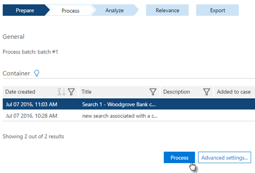

# プロセス モジュールを実行し Office 365 Advanced eDiscovery にデータを読み込む

> [!NOTE]
> 高度な電子的証拠開示では、組織のコンプライアンスを高度なアドオンや、E5 のサブスクリプションの Office 365 E3 が必要です。その計画して高度な電子的証拠開示を実行する、 [Office 365 エンタープライズ E5 の試用版にサインアップ](https://go.microsoft.com/fwlink/p/?LinkID=698279)することができます。 
  
このセクションでは、高度な電子的証拠開示プロセスのモジュールの機能について説明します。 
  
ファイルのデータをファイルの種類、拡張子、場所またはパス、作成日、作成者、管理者と件名などのメタデータに読み込める電子的証拠開示の詳細し、それぞれのケースのために保存します。いくつかのメタデータは、ネイティブのファイルが読み込まれるときになど、高度な電子的証拠開示、によって計算されます。 
  
高度な電子的証拠開示では、メタデータの値、重複の近くのグループ化などの関連性スコア システムを提供します。管理者によっては、ファイルのコメントなど、他のメタデータを追加できます。 
  
## 実行中のプロセス

> [!NOTE]
> バッチ番号は、ファイルの追跡を許可するのには、ファイル、プロセス中に割り当てられます。バッチ番号は、再処理のオプションのバッチ処理の識別も可能です。バッチ番号およびセッションをフィルター処理するための追加のフィルターを利用できます。 
  
プロセスを実行するのには次の手順を実行します。
  
1. [Office 365 のセキュリティを開く&amp;コンプライアンス センター](go-to-the-securitycompliance-center.md)です。 
    
2. 移動**検索&amp;調査** \> **電子的証拠開示**し、**高度な電子的証拠開示に移動**] をクリックします。
    
3. 高度な電子的証拠開示、表示されている**場合**のページで、適切な大文字と小文字を選択で**ケースに移動**] をクリックします。
    
4. **準備**」の\>**プロセス** \> **のセットアップ**、使用可能なコンテナーの一覧からコンテナーを選択します。
    
    
  
5. シード ファイルまたは事前に名札付きのファイルとして、コンテナーを追加する場合は、 **[詳細設定]** をクリックします。 
    
    シード ファイルを使用して、低の豊富な機能に問題のトレーニングを高速化する (通常 2% 以下)。シード ・ ファイルをお勧めさまざまな互いに関連するファイルと、選択したプロセスに関する問題が (多くのシード ファイルは関連性の高い結果をスキューできます) あたり 20 ~ 50 シードです。シード ファイルは、問題のトレーニングは同じ人で見直す必要があります。
    
    事前にタグ付けされたファイルを使用すると、関連性の高いトレーニングを自動化できます。1,500 以上のファイルにタグを付けるし、関連性に追加されたコレクションの場合と同様の非関連ファイルに関連する比率を維持する必要があります。これらのファイルを手動でタグ付けする必要があります、およびタグ付けの品質を確実にする必要があります。
    
    
  
  - **シード**に記載します。 
    
    コンテナーをシード ファイルとしてマークする**シード ファイルとしてマーク**] を選択します。**問題の**ドロップダウン リストから案件ごとを割り当てるを選択する必要があるも。**タグ**のドロップダウン リストから、**関連性**または**関係のない**のいずれかを選択します。 
    
    > [!NOTE]
    > **シード**ファイルを設定するとは、**タグ付け済み**としてマークできません。 
  
  - **事前にタグ付きのファイル**のセクション。 
    
    コンテナーを事前に名札付きのファイルとしてマークするのには**事前に名札付きのファイルとしてマーク**] を選択します。案件ごと**の問題の**ドロップダウン リストから割り当てる必要があります。**タグ**のドロップダウン リストから、**関連性**または**関係のない**のいずれかを選択します。 
    
    > [!NOTE]
    > **タグを事前**にファイルを設定すると後、は、**シード**としてマークできません。 
  
  - 「 **E メールへのタグ付け**します。シードまたは事前にタグ付きとしてマークするのには、処理済みのメールのどの部分を設定します。 
    
6. 開始するには、**プロセス**をクリックします。完了すると、処理結果が表示されます。
    
7. (省略可能)データ ソースを特定の管理者に割り当てる場合は、追加および**通告**の保管担当者の名前を編集\>**通告**での**管理**と割り当ての通告\>**を割り当てます**。 
    
ケースに追加する場合処理できますから。
  
## 関連項目

[Office 365 Advanced eDiscovery](office-365-advanced-ediscovery.md)
  
[プロセス モジュールの結果を表示します。](view-process-module-results-in-advanced-ediscovery.md)

