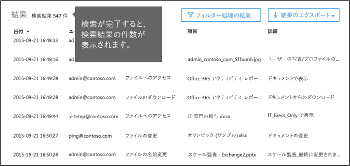
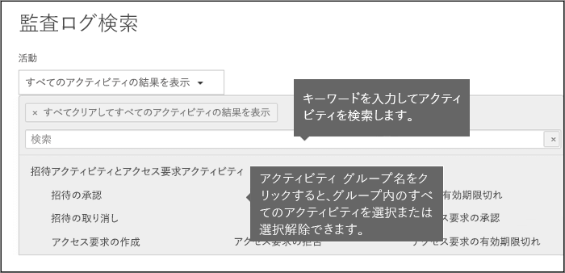
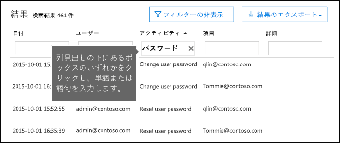

# <a name="search-the-audit-log-in-the-security--compliance-center"></a>セキュリティ/コンプライアンス センターで監査ログを検索する

## <a name="introduction"></a>はじめに

ユーザーが特定のドキュメントを表示したかどうか、またはメールボックスからアイテムを消去したかどうかを確認する必要がある場合、Office 365 セキュリティ/コンプライアンス センターを使用して、統合監査ログで Office 365 組織内のユーザーおよび管理者のアクティビティを検索し、表示することができます。統合監査ログでは、Office 365 内のユーザーおよび管理者の次の種類のアクティビティを検索できます。
  
- SharePoint Online および OneDrive for Business 内のユーザー アクティビティ
    
- Exchange Online 内のユーザー アクティビティ (Exchange メールボックス監査ログ)
  
- SharePoint Online 内の管理者アクティビティ
    
- Azure Active Directory (Office 365 のディレクトリ サービス) 内の管理者アクティビティ
    
- Exchange Online 内の管理者アクティビティ (Exchange 管理者監査ログ)
    
- Sway 内のユーザーおよび管理者のアクティビティ
    
- セキュリティ/コンプライアンス センター内の電子情報開示アクティビティ
    
- Power BI 内のユーザーおよび管理者のアクティビティ
    
- Microsoft Teams 内のユーザーおよび管理者のアクティビティ

- Dynamics 365 内のユーザーおよび管理者のアクティビティ
    
- Yammer 内のユーザーおよび管理者のアクティビティ
 
- Microsoft Flow 内のユーザーおよび管理者のアクティビティ
    
- Microsoft Stream 内のユーザーおよび管理者のアクティビティ

- Microsoft Workplace Analytics でのアナリストと管理者のアクティビティ

- Microsoft PowerApps 内のユーザーおよび管理者のアクティビティ
    
   
## <a name="before-you-begin"></a>始める前に

Office 365 監査ログを検索する前に、次の注意事項を必ずお読みください。
  
- Office 365 監査ログの検索を開始する前に、自分 (または別の管理者) が監査ログを有効にする必要があります。 有効にするには、セキュリティ/コンプライアンス センターの [**監査ログの検索**] ページで [**ユーザーと管理者のアクティビティの記録を開始する**] をクリックします。 (このリンクが表示されない場合、組織の監査はすでに有効になっています)。有効にすると、監査ログの準備中で、準備が完了してから数時間で検索を実行できることを通知するメッセージが表示されます。 これを行う必要があるのは 1 回だけです。 
    
    > [!NOTE]
    > 現在、既定で監査が有効になるように準備を進めています。 それまでは、前述のように監査を有効にすることができます。 
  
- Office 365 の監査ログを検索するには、Exchange Online で閲覧限定の監査ログまたは監査ログの役割が割り当てられている必要があります。 既定では、これらの役割は Exchange 管理センターの [**アクセス許可**] ページでコンプライアンス管理役割グループまたは組織管理役割グループに割り当てられています。 Office 365 および Microsoft 365 のグローバル管理者は自動的に、組織管理役割グループのメンバーとして Exchange Online に追加されます。 最小限の特権レベルで Office 365 の監査ログを検索する権限をユーザーに付与するには、Exchange Online でカスタムの役割グループを作成し、閲覧限定の監査ログまたは監査ログの役割を追加し、この新しい役割グループのメンバーとしてユーザーを追加します。 詳細については、「[Exchange Online で役割グループを管理する](https://go.microsoft.com/fwlink/p/?LinkID=730688)」を参照してください。
    
    > [!IMPORTANT]
    > セキュリティ/コンプライアンス センターの **[アクセス許可]** ページでユーザーに View-Only Audit Logs (閲覧限定の監査ログ) または Audit Logs (監査ログ) の役割を割り当てると、Office 365 の監査ログを検索できなくなります。 Exchange Online でアクセス許可を割り当てる必要があります。 これは、監査ログの検索に使用される基本のコマンドレットが ExchangeOnline コマンドレットだからです。 
  
- 監査対象アクティビティがユーザーまたは管理者によって実行されると、監査レコードが生成され、組織の Office 365 監査ログに格納されます。監査レコードの保持期間 (および監査ログで検索可能な期間) は、Office 365 サブスクリプション、具体的には、特定のユーザーに割り当てられたライセンスの種類によって異なります。

     - **Office 365 E3:** 監査レコードは 90 日間保持されます。 つまり、監査ログでは 90 日以内に実行されたアクティビティを検索できます。

     - **Office 365 E5:** 監査レコードは 90 日間保持されます。 監査記録を 1 年間保持することにより、最終的には E5 ユーザーと、E3 ライセンスおよび Office 365 Advanced Compliance アドオン ライセンスを持つユーザーが利用できるようになります。

        > [!NOTE]
        > E5 組織 (または Advanced Compliance アドオン ライセンスを所有している E3 組織のユーザー) の監査記録を 1 年間保持するプライベート プレビュー プログラムは、新規登録を終了しました。 この記事は、1 年間の保持期間がパブリック プレビューで使用可能になるか、一般向けにリリースされたときに更新されます。

- 自社の Office 365 で監査ログの検索を無効にする場合は、Exchange Online 組織に接続されたリモート PowerShell で次のコマンドを実行できます。
    
  ```
  Set-AdminAuditLogConfig -UnifiedAuditLogIngestionEnabled $false
  ```

    監査検索を再度有効にするには、Exchange Online PowerShell で次のコマンドを実行できます。
    
  ```
  Set-AdminAuditLogConfig -UnifiedAuditLogIngestionEnabled $true
  ```

    詳細については、「[Office 365 で監査ログの検索を無効にする](turn-audit-log-search-on-or-off.md)」を参照してください。
    
- 前述のように、監査ログの検索に使用される基礎となるコマンドレットは Exchange Online コマンドレットの **Search-UnifiedAuditLog** です。 つまり、セキュリティ/コンプライアンス センターの **[監査ログの検索]** ページではなく、このコマンドレットを使用して Office 365 監査ログを検索できます。 このコマンドレットは、Exchange Online 組織に接続されているリモートの PowerShell で実行する必要があります。 詳細については、「[Search-UnifiedAuditLog](https://go.microsoft.com/fwlink/p/?linkid=834776)」を参照してください。 

    **Search-UnifiedAuditLog** コマンドレットによって返された検索結果を CSV ファイルにエクスポートする方法の詳細については、「[監査ログ レコードをエクスポート、構成、表示する](export-view-audit-log-records.md#tips-for-exporting-and-viewing-the-audit-log)」の「監査ログをエクスポート、表示するためのヒント」のセクションを参照してください。  

- プログラムを使用して Office 365 監査ログからデータをダウンロードする場合、PowerShell スクリプトを使用する代わりに、Office 365 Management Activity API を使用することをお勧めします。Office 365 Management Activity API は、組織の運用、セキュリティ、コンプライアンス監視ソリューションの開発に使用する REST Web サービスです。詳細については、「[Office 365 マネージメント アクティビティ API リファレンス](https://docs.microsoft.com/office/office-365-management-api/office-365-management-activity-api-reference)」を参照してください。
    
- イベントが発生してから対応する監査ログ エントリが検索結果に表示されるまで最長 30 分または最長 24 時間かかる場合があります。次の表は、Office 365 のさまざまなサービスで、この処理に要する時間を示しています。
    
    |**Office 365 サービス**|**30 分**|**24 時間**|
    |:-----|:-----|:-----|
    |Advanced Threat Protection および脅威インテリジェンス  <br/> || |
    |Azure Active Directory (ユーザー ログイン イベント)  <br/> ||           <br/> |
    |Azure Active Directory (管理イベント)  <br/> || |
    |データ損失防止  <br/> |       <br/>| |
    |Dynamics 365 CRM <br/> |           <br/>| |
    |電子情報開示  <br/> |           <br/>| |
    |Exchange Online  <br/> |           <br/> ||
    |Microsoft Flow  <br/> |           <br/>| |
    |Microsoft Project  <br/> |           <br/>| |
    |Microsoft Stream  <br/> |           <br/>| |
    |Microsoft Teams  <br/> |           <br/> ||
    |Power BI  <br/> |           <br/>| |
    |セキュリティ/コンプライアンス センター  <br/> |           <br/> ||
    |SharePoint Online と OneDrive for Business  <br/> |           <br/> ||
    |Sway  <br/> ||           <br/> |
    |Workplace Analytics<br/> |           <br/> || 
    |Yammer  <br/> ||           <br/> |
   
- Azure Active Directory (Azure AD) は、Office 365 のディレクトリ サービスです。 統合監査ログには、Microsoft 365 管理センターまたは Azure 管理ポータルで実行されたユーザー、グループ、アプリケーション、ドメイン、およびディレクトリのアクティビティが記録されます。 Azure AD のイベントの全リストについては、「[Azure Active Directory 監査レポートのイベント](https://go.microsoft.com/fwlink/p/?LinkID=616549)」を参照してください。
    
- Power BI の監査ログは、既定で有効になりません。Office 365 監査ログで Power BI アクティビティを検索するには、Power BI 管理ポータルで監査を有効にする必要があります。手順については、[Power BI 管理ポータル](https://docs.microsoft.com/power-bi/service-admin-portal#audit-logs)の [監査ログ] セクションを参照してください。
    
    
## <a name="search-the-audit-log"></a>監査ログの検索

以下に、Office 365 で監査ログを検索するためのプロセスを示します。
  
[手順 1: 監査ログの検索を実行する](#step-1-run-an-audit-log-search)
  
[手順 2: 検索結果を表示する](#step-2-view-the-search-results)

[手順 3: 検索結果をフィルター処理する](#step-3-filter-the-search-results)

[手順 4: 検索結果をファイルにエクスポートする](#step-4-export-the-search-results-to-a-file)


  
### <a name="step-1-run-an-audit-log-search"></a>手順 1: 監査ログの検索を実行する

1. [https://protection.office.com](https://protection.office.com) に移動します。
    
    > [!TIP]
    > 現在ログオンしている資格情報が使用されないようにするために、プライベート ブラウズ セッション (通常のセッションではありません) を使用してセキュリティ/コンプライアンス センターにアクセスします。 Internet Explorer または Microsoft Edge で InPrivate ブラウズ セッションを開くには、Ctrl + Shift + P キーを押します。 Google Chrome でプライベート ブラウズ セッション (シークレット ウィンドウと呼ばれる) を開くには、Ctrl + Shift + N キーを押します。 
  
2. 職場または学校のアカウントを使用して、Office 365 にサインインします。
    
3. セキュリティ/コンプライアンス センターの左側のウィンドウで、**[検索]** をクリックし、**[監査ログの検索]** をクリックします。
    
    [**監査ログの検索**] ページが表示されます。 
    
    ![検索条件を設定し、[検索] をクリックしてレポートを実行する](media/8639d09c-2843-44e4-8b4b-9f45974ff7f1.png)
  
    > [!NOTE]
    > 監査ログの検索を実行する前に、監査ログをあらかじめ有効にする必要があります。[**ユーザーと管理者のアクティビティの記録を開始する**] リンクが表示される場合、それをクリックして監査を有効にします。このリンクが表示されない場合は、組織に対して監査が既に有効になっています。 
  
4. 次の検索条件を設定します。
    
    a.  [**アクティビティ**] ドロップダウン リストをクリックして検索できるアクティビティを表示します。 ユーザーと管理者のアクティビティが、関連するアクティビティのグループに編成されています。 特定のアクティビティを選択することも、アクティビティ グループ名をクリックして、グループ内のすべてのアクティビティを選択することもできます。 選択したアクティビティをクリックして、選択を解除することもできます。 検索の実行後、選択したアクティビティの監査ログ エントリのみが表示されます。 [**すべてのアクティビティの結果を表示**] を選択すると、選択したユーザーまたはユーザーのグループによって実行されたすべてのアクティビティの結果が表示されます。 
    
    Office 365 の監査ログには、100 件以上のユーザーおよび管理者アクティビティが記録されます。この記事の内容にある [**監査されるアクティビティ**] タブをクリックすると、さまざまな Office 365 サービスそれぞれのすべてのアクティビティに関する説明を確認できます。 
    
    b. **開始日**と**終了日**。既定では過去 7 日間が選択されています。特定の期間内に発生したイベントを表示するには、その日付と時刻の範囲を選択します。日付と時刻は、協定世界時 (UTC) 形式で指定します。指定できる最大の日付範囲は 90 日間です。選択された日付範囲が 90 日間より長い場合、エラーが表示されます。 
    
    > [!TIP]
    > 最大の日付範囲である 90 日を使用する場合は、[**開始日**] で現在の時刻を選択してください。それ以外の時刻を選択すると、開始日が終了日より前であるというエラーが返されます。過去 90 日以内に監査を有効にした場合、最大の日付範囲の開始日を監査を有効にした日付より前にすることはできません。 
  
    c. **ユーザー**。このボックスをクリックし、検索結果を表示する 1 人以上のユーザーを選択します。このボックスで選択したユーザーによって実行された、選択されたアクティビティの監査ログ エントリが結果の一覧に表示されます。組織のすべてのユーザー (およびサービス アカウント) のエントリを返すには、このボックスを空白のままにします。 
    
    d.  [**ファイル、フォルダー、またはサイト**] 指定したキーワードを含むフォルダーのファイルに関連するアクティビティを検索するには、ファイルまたはフォルダー名の一部またはすべてを入力します。 ファイルまたはフォルダーの URL を指定することもできます。 URL を使用する場合は、完全な URL パスを入力するか、URL の一部を入力する場合は、特殊文字やスペースを含めないでください。 
    
    組織内のすべてのファイルおよびフォルダーのエントリを返すには、このボックスを空白のままにします。
    
   **ヒント**

   - ある**サイト**に関するすべてのアクティビティを検索する場合、URL の後ろにワイルドカード文字 (\*) を追加して、そのサイトのすべてのエントリが返されるようにします。例: **"https://contoso-my.sharepoint.com/personal/*"**

   - 特定の**ファイル**に関連するすべてのアクティビティを探す場合は、ファイル名の前にワイルドカード文字 (\*) を追加すると、そのファイルのすべてのエントリが返されます (例: **"*Customer_Profitability_Sample.csv"**)。
    

    
5. [**検索**] をクリックして、設定した検索条件で検索を実行します。 
    
    検索結果が読み込まれ、しばらくすると、それらが [**結果**] の下に表示されます。 検索が完了すると、検索結果の件数が表示されます。 [**結果**] ウィンドウには、イベント 150 件の増分で最大 5,000 件のイベントが表示されます。 検索条件を満たすイベントが 5,000 件を超える場合、最新の5,000 件のイベントが表示されます。 
    
    
  
  
#### <a name="tips-for-searching-the-audit-log"></a>監査ログを検索するためのヒント

- 検索する特定のアクティビティを選択するには、アクティビティ名をクリックします。 またはグループ名をクリックして、グループ内のすべてのアクティビティ ([**ファイルとフォルダーのアクティビティ**] など) を検索できます。 アクティビティが選択されている場合は、そのアクティビティをクリックして、選択を取り消すことができます。 また、検索ボックスを使用して、入力したキーワードを含むアクティビティを表示することもできます。
    
    
  
- Exchange 管理者監査ログのイベントを表示するには、[**アクティビティ**] リストの [**すべてのアクティビティの結果を表示**] を選択する必要があります。 この監査ログのイベントには、結果の [**アクティビティ**] 列にコマンドレット名 (**Set-Mailbox** など) が表示されます。 詳細については、 このトピックの [**監査されるアクティビティ**] タブをクリックし、[**Exchange 管理者アクティビティ**] をクリックします。
    
    同様に、[**アクティビティ**] の一覧に対応する項目がない監査アクティビティがいくつかあります。これらのアクティビティの操作名がわかっている場合は、[**アクティビティ**] 列のボックスに操作名を入力してすべてのアクティビティを検索し、結果をフィルター処理することができます。結果のフィルター処理の詳細については、「[手順 3: 検索結果をフィルター処理する](#step-3-filter-the-search-results)」を参照してください。 
    
- 現在の検索条件をクリアするには、[**クリア**] をクリックします。日付の範囲は、既定の過去 7 日間に戻ります。[**すべてをクリアしてすべてのアクティビティの結果を表示する**] をクリックして、選択したすべてのアクティビティを取り消すこともできます。 
    
- 5,000 件の結果が見つかった場合、検索条件に一致するイベントが 5,000 件を超えていると見なすことができます。 検索条件を絞り込み、返される結果が少なくなるように検索を再実行するか、[**結果のエクスポート**] \> [**すべての結果をダウンロード**] を選択して、すべての検索結果をエクスポートできます。

  
### <a name="step-2-view-the-search-results"></a>手順 2: 検索結果を表示する

監査ログの検索の結果は、[**監査ログの検索**] ページの [**結果**] の下に表示されます。前述のとおり、最大 5,000 件 (最新) のイベントが 150 件ずつ表示されます。さらにイベントを表示するには、**結果**ウィンドウにあるスクロール バーを使用するか、**Shift + End**キーを押して、次の 150 件のイベントを表示することができます。 
  
検索結果には、検索によって返された各イベントに関する次の情報が含まれます。
  
- **日付:** イベントが発生した日付と時刻 (UTC 形式)。 
    
- **IP アドレス:** アクティビティが記録されたときに使用されたデバイスの IP アドレス。IP アドレスは、IPv4 または IPv6 アドレスの形式で表示されます。 
    
- **ユーザー:** イベントをトリガーしたアクションを実行したユーザー (またはサービス アカウント)。 
    
- **アクティビティ:** ユーザーが実行したアクティビティ。この値は [**アクティビティ**] ドロップダウン リストで選択したアクティビティと一致します。Exchange 管理監査ログのイベントの場合は、この列の値は、Exchange コマンドレットです。 
    
- **項目:** 対応するアクティビティの結果として作成または変更されたオブジェクト。たとえば、表示または変更されたファイルや、更新されたユーザー アカウントなど。すべてのアクティビティについて、この列の値が表示されるとは限りません。 
    
- **詳細:** アクティビティに関する追加の詳細。 ここでも、すべてのアクティビティに値があるとは限りません。 
    
> [!TIP]
> 検索結果を並べ替えるには、[**結果**] の列見出しをクリックします。検索結果を昇順または降順で並べ替えることができます。検索結果を日付の古い順または新しい順に並べ替える場合は、[**日付**] ヘッダーをクリックします。 
  
#### <a name="view-the-details-for-a-specific-event"></a>特定のイベントの詳細を表示する

検索結果の一覧でイベント レコードをクリックすると、イベントの詳細を表示できます。イベント レコードの詳しいプロパティを示す [**詳細**] ページが表示されます。表示されるプロパティは、イベントが発生した Office 365 サービスによって異なります。これらの詳細を表示するには、[**詳細情報**] をクリックします。詳細については、「[Office 365 監査ログの詳細なプロパティ](detailed-properties-in-the-office-365-audit-log.md)」を参照してください。
  
![[詳細情報] をクリックして監査ログのイベント レコードの詳細なプロパティを表示する](media/6df582ae-d339-4735-b1a6-80914fb77a08.png)

  
### <a name="step-3-filter-the-search-results"></a>手順 3: 検索結果をフィルター処理する

並べ替えに加えて、監査ログの検索の結果をフィルター処理することもできます。 これは、特定のユーザーやアクティビティに結果をすばやくフィルター処理できる優れた機能です。 最初に広範な検索を作成してから、結果をすばやくフィルター処理し、特定のイベントを表示できます。 さらに、より小さく簡潔な一連の結果が返されるようにするには、検索条件を絞り込み、検索を再実行します。
  
結果をフィルター処理するには、次の手順を実行します。
  
1. 監査ログの検索を実行します。
    
2. 結果が表示されたら、[**結果をフィルター**] をクリックします。
    
    各列見出しの下にキーワード ボックスが表示されます。
    
3. フィルター処理の対象となる列の列見出しの下に表示されたボックスのいずれかをクリックして語句を入力します。検索結果が動的に調整され、フィルターに一致するイベントが表示されます。
    
    
  
4. フィルターを解除するには、フィルター ボックスの [**X**] をクリックするか、[**フィルターの非表示**] をクリックします。
    
> [!TIP]
> Exchange 管理監査ログのイベントを表示するには、[**アクティビティ**] フィルター ボックスに「**-**」 (ダッシュ) を入力します。これにより、Exchange 管理イベントの [**アクティビティ**] 列に表示されるコマンドレット名が表示されます。この後、コマンドレット名をアルファベット順に並べ替えることができます。 

### <a name="step-4-export-the-search-results-to-a-file"></a>手順 4: 検索結果をファイルにエクスポートする

監査ログの検索の結果を、ローカル コンピューター上のコンマ区切り値 (CSV) ファイルにエクスポートできます。 このファイルを Microsoft Excel で開いて、検索、並べ替え、フィルター処理、および単一の列 (複数のプロパティが含まれる) の複数列への分割などの機能を使用できます。
  
1. 監査ログの検索を実行して、目的の結果が得られるまで検索条件を変更します。
    
2. [**結果のエクスポート**] をクリックして、次のいずれかのオプションを選択します。 
    
     - **読み込まれた結果を保存:** [**監査ログの検索**] ページの [**結果**] に表示されたエントリのみをエクスポートするには、このオプションを選択します。 ダウンロードした CSV ファイルには、ページに表示されている同じ列 (およびデータ) (日付、ユーザー、アクティビティ、アイテム、詳細) が含まれています。 CSV ファイルには、監査ログ エントリからの詳細な情報を含む追加の列 ([**その他**] と呼ばれる) が含まれます。 [**監査ログの検索**] ページに読み込まれた (および表示可能な) 同じ結果をエクスポートしているため、最大 5,000 件のエントリがエクスポートされます。 
    
     - **すべての結果をダウンロード:** - 検索条件に一致する Office 365 監査ログのすべてのエントリをエクスポートするには、このオプションを選択します。 検索結果セットが大きい場合、このオプションを選択すると、[**監査ログの検索**] ページに表示できる 5,000 個の監査レコードに加えて、監査ログのすべてのエントリがダウンロードされます。 このオプションは、監査ログから CSV ファイルに生データをダウンロードし、**AuditData** という名前の列に監査ログ エントリからの追加情報を格納します。 このエクスポート オプションを選択した場合、ファイルが他のオプションを選択した場合にダウンロードされるファイルよりはるかに大きくなる可能性があるため、ファイルのダウンロードには時間がかかることがあります。
    
       > [!IMPORTANT]
       > 1 回の監査ログの検索で、最大 50,000 件のエントリを CSV ファイルにダウンロードできます。50,000 件のエントリが CSV ファイルにダウンロードされた場合、検索条件に一致したエントリが 50,000 件を超える可能性があります。この制限を超えてエクスポートするには、日付範囲を使用して監査ログ エントリの件数を削減してみてください。50,000 件を超えるエントリをエクスポートするには、日付範囲を狭めて検索を複数回実行することが必要な場合があります。 
  
3. エクスポート オプションを選択すると、ウィンドウの下部にメッセージが表示され、CSV ファイルを開く、[ダウンロード] フォルダーに保存する、または特定のフォルダーに保存するかを選択するように求められます。
 
#### <a name="more-information-about-exporting-and-viewing-audit-log-search-results"></a>監査ログの検索結果のエクスポートと表示に関する詳細情報

- すべての検索結果をダウンロードすると、その CSV ファイルには **AuditData** という列が含まれており、その列に各イベントに関する追加情報が格納されています。 この列のデータは、監査ログ レコードの複数のプロパティを含む JSON オブジェクトで構成されています。 この JSON オブジェクトに含まれる *property:value* の各ペアは、コンマで区切られます。 Excel の Power Query エディターに含まれる JSON 変換ツールを使用すると、[**AuditData**] 列を複数の列に分割し、JSON オブジェクトのプロパティごとに個別の列を設定できます。 このようにすると、これらの 1 つ以上のプロパティで並べ替えやフィルター処理を行うことができます。 Power Query エディターを使用して JSON オブジェクトを変換するための詳しい手順については、「[監査ログ レコードをエクスポート、構成、表示する](export-view-audit-log-records.md)」を参照してください。
    
    **AuditData** 列を分割した後、[**操作**] 列でフィルター処理して、特定の種類のアクティビティの詳細なプロパティを表示できます。 
    
- **[すべての結果をダウンロード]** オプションは、Office 365 監査ログから CSV ファイルに生データをダウンロードします。 このファイルには **[読み込まれた結果を保存]** オプションを選択した場合にダウンロードされるファイルと異なる列名 (CreationDate、UserIds、Operation、AuditData) が含まれます。 同じアクティビティに対する 2 つの別の CSV ファイル内の値が異なる場合もあります。 たとえば、CSV ファイル内の [**アクション**] 列のアクティビティが、[**監査ログの検索**] ページの [**アクティビティ**] 列に表示される "わかりやすい" 名前とは異なる値になることがあります。 たとえば、MailboxLogin と メールボックスへのユーザーのサインインです。

- さまざまな Office 365 サービスのイベントが含まれている検索クエリからすべての結果をダウンロードすると、CSV ファイルの [**AuditData**] 列には、そのアクションが実行されたサービスに応じて異なるプロパティが含まれます。 たとえば、Exchange と Azure AD の監査ログのエントリには、アクションが成功したかどうかを示す **ResultStatus** というプロパティが含まれます。 このプロパティは、SharePoint のイベントには含まれません。 同様に、SharePoint イベントには、ファイルおよびフォルダー関連のアクティビティのサイト URL を識別するプロパティがあります。 この動作を軽減するには、別々の検索を使用して、1 つのサービスからのアクティビティの結果をエクスポートすることを検討してください。 
    
    すべての結果をダウンロードする場合に CSV ファイルの [**AuditData**] 列に一覧表示されるプロパティの多く、および各プロパティが適用されるサービスについては、「[Office 365 監査ログの詳細なプロパティ](detailed-properties-in-the-office-365-audit-log.md)」を参照してください。

## <a name="audited-activities"></a>監査されるアクティビティ

このセクションの表で、Office 365 で監査されるアクティビティについて説明します。 これらのイベントを検索するには、セキュリティ/コンプライアンス センターで監査ログを検索します。
  
これらの表では、関連するアクティビティまたは特定の Office 365 サービスのアクティビティがグループ分けされています。表には、[**アクティビティ**] ドロップダウン リストに表示されるフレンドリ名、および監査レコードの詳細情報と検索結果がエクスポートされた CSV ファイルに表示される、対応する操作名が含まれます。詳細情報については、「[Office 365 監査ログの詳細なプロパティ](detailed-properties-in-the-office-365-audit-log.md)」を参照してください。
  
特定の表に移動するには、次のいずれかのリンクをクリックしてください。
  
||||
|:-----|:-----|:-----|
|[ファイル アクティビティとページ アクティビティ](#file-and-page-activities)<br/> |[フォルダー アクティビティ](#folder-activities)<br/> |[SharePoint リスト アクティビティ](#sharepoint-list-activities)<br/>|
|[共有アクティビティとアクセス要求アクティビティ](#sharing-and-access-request-activities)<br/> |[同期アクティビティ](#synchronization-activities)<br/> |[サイトの権限のアクティビティ](#site-permissions-activities)<br/> |
|[サイト管理アクティビティ](#site-administration-activities)<br/> |[Exchange メールボックス アクティビティ](#exchange-mailbox-activities)<br/> |[Sway アクティビティ](#sway-activities) <br/> |
|[ユーザー管理アクティビティ](#user-administration-activities) <br/> |[Azure AD グループ管理アクティビティ](#azure-ad-group-administration-activities) <br/> |[アプリケーション管理アクティビティ](#application-administration-activities) <br/> |
|[役割管理アクティビティ](#role-administration-activities) <br/> |[ディレクトリ管理アクティビティ](#directory-administration-activities) <br/>|[電子情報開示アクティビティ](#ediscovery-activities) <br/> |
|[Advanced eDiscovery アクティビティ](#advanced-ediscovery-activities)<br/> |[Power BI アクティビティ](#power-bi-activities) <br/> |[Microsoft Workplace Analytics](#microsoft-workplace-analytics-activities)<br/>|
|[Microsoft Teams アクティビティ](#microsoft-teams-activities) <br/> |[Yammer アクティビティ](#yammer-activities) <br/> |[Microsoft Flow アクティビティ](#microsoft-flow-activities) <br/>|
|[Microsoft PowerApps アクティビティ](#microsoft-powerapps)<br/>|[Microsoft Stream アクティビティ](#microsoft-stream-activities) <br/>|[Exchange 管理アクティビティ](#exchange-admin-audit-log)<br/>|
||||
  
### <a name="file-and-page-activities"></a>ファイル アクティビティとページ アクティビティ
  
次の表では、SharePoint Online および OneDrive for Business 内のファイル アクティビティとページ アクティビティについて説明します。
  
|**フレンドリ名**|**操作名**|**説明**|
|:-----|:-----|:-----|
|ファイルへのアクセス  <br/> |FileAccessed  <br/> |ユーザーまたはシステム アカウントがファイルにアクセスします。  <br/> |
|(なし)  <br/> |FileAccessedExtended  <br/> |これは、"ファイルへのアクセス" (FileAccessed) アクティビティに関連します。 同じユーザーが長時間 (最大 3 時間) にわたって、ファイルに継続的にアクセスすると、FileAccessedExtended イベントがログに記録されます。 FileAccessedExtended イベントをログに記録する目的は、ファイルが継続的にアクセスされたときにログに記録される FileAccessed イベントの数を減らすことにあります。 これにより、本質的に同じユーザーのアクティビティであるファイル アクセスに対する無意味な複数の FileAccessed レコードが減り、初期の (より重要な) FileAccessed イベントに注目できます。  <br/> |
|コンプライアンス ポリシー ラベルが変更されました<br/> |ComplianceSettingChanged<br/> |保持ラベルがドキュメントに適用またはドキュメントから削除されました。 このイベントは、保持ラベルが手動または自動でメッセージに適用されたときにトリガーされます。<br/> |
|レコードのステータスがロックに変更されました<br/> |LockRecord<br/> |ドキュメントをレコードとして分類する保持ラベルのレコード ステータスがロックされました。 これは、ドキュメントを変更したり削除したりできないことを意味します。 ドキュメントのレコード ステータスを変更できるのは、共同作成者以上のアクセス許可がサイトで割り当てられているユーザーだけです。<br/> |
|レコード ステータスが、ロック解除に変更されました<br/> |UnlockRecord<br/> |ドキュメントをレコードとして分類する保持ラベルのレコード ステータスのロックが解除されました。 これは、ドキュメントを変更したり削除したりできることを意味します。 ドキュメントのレコード ステータスを変更できるのは、共同作成者以上のアクセス許可がサイトで割り当てられているユーザーだけです。<br/><br/> |
|ファイルのチェックイン  <br/> |FileCheckedIn  <br/> |ユーザーがドキュメント ライブラリからチェックアウトしたドキュメントをチェックインしました。  <br/> |
|ファイルのチェックアウト  <br/> |FileCheckedOut  <br/> |ユーザーがドキュメント ライブラリにあるドキュメントをチェックアウトしました。ユーザーは、共有されているドキュメントをチェックアウトし、変更できます。  <br/> |
|ファイルのコピー  <br/> |FileCopied  <br/> |ユーザーがサイトのドキュメントをコピーしました。コピーしたファイルは、サイトの別のフォルダーに保存できます。  <br/> |
|ファイルの削除  <br/> |FileDeleted  <br/> |ユーザーがサイトからドキュメントを削除しました。  <br/> |
|ごみ箱からのファイルの削除  <br/> |FileDeletedFirstStageRecycleBin  <br/> |ユーザーがサイトのごみ箱からファイルを削除しました。  <br/> |
|第 2 段階のごみ箱からのファイルの削除  <br/> |FileDeletedSecondStageRecycleBin  <br/> |ユーザーがサイトの第 2 段階のごみ箱からファイルを削除しました。  <br/> |
|削除されたレコードのコンプライアンス ポリシー ラベル<br/> |ComplianceRecordDelete<br/> |レコードとして分類されたドキュメントが削除されました。 ドキュメントがレコードとしてみなされるのは、ドキュメントをレコードとして分類する保持ラベルがドキュメントに適用されている場合です。 <br/> |
|検出されたドキュメントの秘密度の不一致 <br/>|DocumentSensitivityMismatchDetected<br/>|ユーザーが、ドキュメントのアップロード先サイトに適用されている機密ラベルよりも高い優先度の機密ラベルで分類されたドキュメントをアップロードします。 サイトに適用されている機密ラベルの方が、サイトにアップロードされたドキュメントに適用されている機密ラベルよりも優先順位が高い場合、このイベントは発生しません。 機密ラベルの優先度の詳細については、「[機密ラベルの概要](sensitivity-labels.md#label-priority-order-matters)」の「ラベルの優先度」セクションを参照してください。<br/>|
|ファイルでのマルウェアの検出  <br/> |FileMalwareDetected  <br/> |SharePoint ウイルス対策エンジンにより、ファイル内でマルウェアが検出されました。  <br/> |
|ファイル チェックアウトの破棄  <br/> |FileCheckOutDiscarded  <br/> |ユーザーは、チェックアウトしたファイルを破棄します (または元に戻します)。つまり、チェックアウト時にファイルに加えた変更はすべて破棄され、ドキュメント ライブラリ内のドキュメントのバージョンには保存されないということです。  <br/> |
|ファイルのダウンロード  <br/> |FileDownloaded  <br/> |ユーザーがサイトからドキュメントをダウンロードしました。  <br/> |
|ファイルの変更  <br/> |FileModified  <br/> |ユーザーまたはシステム アカウントがサイトにあるドキュメントのコンテンツまたはプロパティを変更します。  <br/> |
|(なし)  <br/> |FileModifiedExtended  <br/> |これは、"ファイルの変更" (FileModified) アクティビティに関連しています。 同じユーザーが長時間 (最大 3 時間) にわたって、ファイルの変更を継続的に行うと、FileModifiedExtended イベントがログに記録されます。 FileModifiedExtended イベントをログに記録する目的は、ファイルの変更が継続的に行われたときにログに記録される FileModified イベントの数を減らすことにあります。 これにより、本質的に同じユーザーのアクティビティであるファイル変更に対する無意味な複数の FileModified レコードを減り、初期 (のより重要な) FileModified イベントに注目できます。  <br/> |
|ファイルの移動  <br/> |FileMoved  <br/> |ユーザーがドキュメントをサイトの現在の場所から新しい場所に移動しました。  <br/> |
|(なし)  <br/> |FilePreviewed  <br/> |ユーザーが SharePoint または OneDrive for Business サイトにあるファイルをプレビューします。 通常、これらのイベントは、イメージ ギャラリーの表示などの 1 つのアクティビティに基づいて、大きいボリュームで発生します。  <br/> |
|ファイルのすべてのマイナー バージョンのリサイクル  <br/> |FileVersionsAllMinorsRecycled  <br/> |ユーザーが、ファイルのバージョン履歴からすべてのマイナー バージョンを削除しました。削除されたバージョンは、サイトのごみ箱に移動されます。  <br/> |
|ファイルのすべてのバージョンのリサイクル  <br/> |FileVersionsAllRecycled  <br/> |ユーザーが、ファイルのバージョン履歴からすべてのバージョンを削除しました。削除されたバージョンは、サイトのごみ箱に移動されます。  <br/> |
|ファイルのバージョンのリサイクル  <br/> |FileVersionRecycled  <br/> |ユーザーが、ファイルのバージョン履歴から 1 つのバージョンを削除しました。削除されたバージョンは、サイトのごみ箱に移動されます。  <br/> |
|ファイルの名前変更  <br/> |FileRenamed  <br/> |ユーザーがサイトのドキュメントの名前を変更しました。  <br/> |
|ファイルの復元  <br/> |FileRestored  <br/> |ユーザーがサイトのごみ箱からドキュメントを復元しました。  <br/> |
|ファイルのアップロード  <br/> |FileUploaded  <br/> |ユーザーがサイトのフォルダーにドキュメントをアップロードしました。  <br/> |
|ページの表示  <br/> |PageViewed  <br/> |ユーザーがサイトのページを表示します。これには、Web ブラウザー使用してドキュメント ライブラリ内にあるファイルを表示する操作は含まれません。  <br/> |
|(なし)  <br/> |PageViewedExtended  <br/> |これは、"ページの表示" (PageViewed) アクティビティに関連しています。 同じユーザーが長時間 (最大 3 時間) にわたって、継続的に Web ページを表示すると、PageViewedExtended イベントがログに記録されます。 PageViewedExtended イベントをログに記録する目的は、ページが継続的に表示されたときにログに記録される PageViewed イベントの数を減らすことにあります。 これにより、本質的に同じユーザーのアクティビティであるページ表示に対する無意味な複数の PageViewed レコードが減り、初期 (のより重要な) PageViewed イベントに注目できます。  <br/> |
|クライアントが表示をシグナル <br/>|ClientViewSignaled<br/>|ユーザーのクライアント (Web サイトやモバイル アプリなど) が、示されるページをユーザーが表示したことをシグナルしました。 多くの場合、ページでの PagePrefetched イベントに続いてこのアクティビティがログに記録されます。 <br/><br/>**注**: ClientViewSignaled イベントはサーバーではなくクライアントによりシグナルされるため、イベントがサーバーによってログに記録されず、監査ログに表示されない場合があります。 また、監査レコードの情報の信頼性が低い可能性もあります。 ただし、ユーザーの ID はシグナルの作成に使用されたトークンによって検証されるため、対応する監査レコードに記載されているユーザーの ID は正確です。 |
|(なし) <br/>|PagePrefetched<br/>|示されるページにユーザーがアクセスした際のパフォーマンスを上げるため、ユーザーのクライアント (Web サイトやモバイル アプリなど) がそのページを要求しました。 このイベントは、ページの内容がユーザーのクライアントに配信されたことを示すため、ログに記録されます。 このイベントは、ユーザーがページに移動したことをはっきりと示します。 (ユーザーの要求に従って) ページのコンテンツがクライアントによってレンダリングされると、ClientViewSignaled イベントが生成されます。 プレフェッチの指摘はすべてのクライアントでサポートされているわけではないため、プレフェッチされた一部のアクティビティは PageViewed イベントとしてログ記録される可能性があります。<br/>|
||||
  
### <a name="folder-activities"></a>フォルダー アクティビティ
  
次の表では、SharePoint Online および OneDrive for Business 内のフォルダー アクティビティについて説明します。
  
|**フレンドリ名**|**操作名**|**説明**|
|:-----|:-----|:-----|
|フォルダーのコピー  <br/> |FolderCopied  <br/> |ユーザーがフォルダーをサイトから SharePoint または OneDrive for Business の別の場所にコピーしました。  <br/> |
|フォルダーの作成  <br/> |FolderCreated  <br/> |ユーザーがサイトにフォルダーを作成しました。  <br/> |
|フォルダーの削除  <br/> |FolderDeleted  <br/> |ユーザーがサイトからフォルダーを削除しました。  <br/> |
|ごみ箱からのフォルダーの削除  <br/> |FolderDeletedFirstStageRecycleBin  <br/> |ユーザーがサイトのごみ箱からフォルダーを削除しました。  <br/> |
|第 2 段階のごみ箱からのフォルダーの削除  <br/> |FolderDeletedSecondStageRecycleBin  <br/> |ユーザーがサイトの第 2 段階のごみ箱からフォルダーを削除しました。  <br/> |
|フォルダーの変更  <br/> |FolderModified  <br/> |ユーザーがサイトのフォルダーを変更しました。これには、フォルダーのメタデータの変更 (タグおよびプロパティの変更など) が含まれます。  <br/> |
|フォルダーの移動  <br/> |FolderMoved  <br/> |ユーザーがフォルダーをサイトの別の場所に移動しました。  <br/> |
|フォルダーの名前変更  <br/> |FolderRenamed  <br/> |ユーザーがサイトのフォルダーの名前を変更しました。  <br/> |
|フォルダーの復元  <br/> |FolderRestored  <br/> |ユーザーがサイトのごみ箱から削除されたフォルダーを復元しました。  <br/> |
||||
  
### <a name="sharepoint-list-activities"></a>SharePoint リスト アクティビティ
  
次の表では、ユーザーが SharePoint Online のリストとリストアイテムを操作する際に関連するアクティビティを説明します。

|**フレンドリ名**|**操作名**|**説明**|
|:-----|:-----|:-----|
| リストの作成              | ListCreated              | ユーザーが SharePoint リストを作成しました。|
| リスト列の作成       | ListColumnCreated        | ユーザーが SharePoint リスト列を作成しました。 リスト列は、1 つまたは複数の SharePoint リストに関連付けられている列です。 |
| リスト コンテンツ タイプの作成 | ListContentTypeCreated   | ユーザーがリスト コンテンツ タイプを作成しました。 リスト コンテンツ タイプは、1 つまたは複数の SharePoint リストに関連付けられているコンテンツ タイプです。|
| リスト アイテムの作成         | ListItemCreated          | ユーザーが既存の SharePoint リストにアイテムを作成しました。|
| サイト列の作成       | SiteColumnCreated        | ユーザーが SharePoint サイト列を作成しました。 サイト列とは、リストに関連付けられていない列のことです。 サイト列は、特定の Web のすべてのリストで使用できるメタデータ構造でもあります。|
| サイト コンテンツ タイプの作成 | サイトの ContentType の作成 | ユーザーがサイト コンテンツ タイプを作成しました。 サイト コンテンツ タイプは、親サイトに関連付けられているコンテンツ タイプです。|
| リストの削除              | ListDeleted              | ユーザーが SharePoint リストを削除しました。|
| リスト列の削除       | 削除されたリスト列      | ユーザーが SharePoint リスト列を削除しました。|
| リスト コンテンツ タイプの削除 | ListContentTypeDeleted   | ユーザーがリスト コンテンツ タイプを削除しました。 |
| リスト アイテムの削除         | 削除されたリスト アイテム        | ユーザーが SharePoint リスト アイテムを削除しました。|
| サイト列の削除       | SiteColumnDeleted        | ユーザーが SharePoint サイト列を削除しました。 |
| サイト コンテンツ タイプの削除 | SiteContentTypeDeleted   | ユーザーがサイト コンテンツ タイプを削除しました。|
| リスト アイテムのリサイクル        | ListItemRecycled         | ユーザーが SharePoint リスト アイテムをごみ箱に移動しました。|
| リストの復元             | ListRestored             | ユーザーが SharePoint リストをごみ箱から復元しました。|
| リスト アイテムの復元        | ListItemRestored         | ユーザーが SharePoint リスト アイテムをごみ箱から復元しました。|
| リストの更新              | ListUpdated              | ユーザーが 1 つ以上のプロパティを変更して SharePoint リストを更新しました。|
| リスト列の更新       | ListColumnUpdated        | ユーザーが 1 つ以上のプロパティを変更して SharePoint リスト列を更新しました。|
| リスト コンテンツ タイプの更新 | ListContentTypeUpdated   | ユーザーが 1 つ以上のプロパティを変更してリスト コンテンツ タイプを更新しました。|
| リスト アイテムの更新         | ListItemUpdated          | ユーザーが 1 つ以上のプロパティを変更して SharePoint リスト アイテムを更新しました。|  
| サイト列の更新       | SiteColumnUpdated        | ユーザーが 1 つ以上のプロパティを変更して SharePoint サイト列を更新しました。|
| サイト コンテンツ タイプの更新 | SiteContentTypeUpdated   | ユーザーが 1 つ以上のプロパティを変更してサイト コンテンツ タイプを更新しました。|
||||

### <a name="sharing-and-access-request-activities"></a>共有アクティビティとアクセス要求アクティビティ
  
次の表では、SharePoint Online and OneDrive for Business 内のユーザー共有アクティビティおよびアクセス要求アクティビティについて説明します。共有イベントの場合、[**結果**] の下の [**詳細**] 列で、項目の共有相手のユーザーまたはグループの名前と、そのユーザーまたはグループが組織内のメンバーかゲストかが識別されます。詳細については、「[Office 365 監査ログで共有監査を使用する](use-sharing-auditing.md)」を参照してください。
  
> [!NOTE]
> ユーザーは、ユーザー オブジェクトの UserType プロパティに従って*メンバー*または*ゲスト*のいずれかになります。通常、メンバーは従業員で、ゲストは組織外の共同作業者です。ユーザーが共有への招待を承諾すると (ユーザーがまだ組織のメンバーではない場合)、組織のディレクトリ内にそのユーザー用のゲスト アカウントが作成されます。ゲスト ユーザーがディレクトリ内にアカウントを持つと、リソースをそれらのユーザーと直接共有できます (ユーザーが招待を要求する必要はありません)。 
  
|**フレンドリ名**|**操作名**|**説明**|
|:-----|:-----|:-----|
|サイト コレクションへのアクセス許可レベルの追加  <br/> |PermissionLevelAdded  <br/> |サイト コレクションにアクセス許可レベルが追加されました。  <br/> |
|アクセス要求の承諾  <br/> |AccessRequestAccepted  <br/> |サイト、フォルダー、またはドキュメントに対するアクセス要求が承諾されて、要求したユーザーがアクセスを許可されました。  <br/> |
|共有への招待の承諾  <br/> |SharingInvitationAccepted  <br/> |ユーザー (メンバーまたはゲスト) が共有の招待を承諾し、リソースに対するアクセス権が付与されました。このイベントには、招待されたユーザーと招待の承諾に使用されたメール アドレス (招待されたユーザーのメール アドレスとは異なる可能性があります) に関する情報が含まれています。多くの場合、このアクティビティには、リソースに対してどのようなアクセス権がユーザーに付与されたか、という 2 つ目のイベントが伴います。たとえば、リソースに対するアクセス権を持つグループへのユーザーの追加などです。   <br/> |
|共有の招待がブロックされました  <br/> |SharingInvitationBlocked  <br/> | 組織内のユーザーによって送信された共有への招待は、ターゲット ユーザーのドメインに基づいて外部共有を許可または拒否する外部共有ポリシーのためにブロックされます。この場合、次の理由により、共有への招待がブロックされました。<br/>  ターゲット ユーザーのドメインが、許可されたドメインの一覧に含まれていない。  <br/>  または  <br/>  ターゲット ユーザーのドメインが、ブロックするドメインの一覧に含まれている。  <br/>  ドメインに基づく外部共有の許可またはブロックの詳細については、「[SharePoint Online and OneDrive for Business での制限付きドメイン共有](https://support.office.com/article/5d7589cd-0997-4a00-a2ba-2320ec49c4e9)」を参照してください。  <br/> |
|アクセス要求の作成  <br/> |AccessRequestCreated  <br/> |アクセス許可がないサイト、フォルダー、またはドキュメントに対するアクセスをユーザーが要求しました。  <br/> |
|会社の共有可能なリンクの作成  <br/> |CompanyLinkCreated  <br/> |ユーザーがリソースへの全社的なリンクを作成しました。全社的なリンクは、組織内のメンバーのみが使用できます。ゲストは使用できません。  <br/> |
|匿名リンクの作成  <br/> |AnonymousLinkCreated  <br/> |ユーザーがリソースへの匿名リンクを作成しました。このリンクを使用できるすべてのユーザーが、認証なしでリソースにアクセスできます。  <br/> |
|セキュリティで保護されたリンクの作成  <br/> |SecureLinkCreated  <br/> |セキュリティで保護された、このアイテムへの共有リンクが作成されました。  <br/> |
|共有への招待の作成  <br/> |SharingInvitationCreated  <br/> |ユーザーが、組織のディレクトリ内に含まれていないユーザーと SharePoint Online または OneDrive for Business のリソースを共有しました。  <br/> |
|セキュリティで保護されたリンクの削除  <br/> |SecureLinkDeleted  <br/> |セキュリティで保護されたリンクが削除されました。  <br/> |
|アクセス要求の拒否  <br/> |AccessRequestDenied  <br/> |サイト、フォルダー、またはドキュメントに対するアクセスが拒否されました。  <br/> |
|会社の共有可能なリンクが削除されました  <br/> |CompanyLinkRemoved  <br/> |ユーザーがリソースへの全社的なリンクを削除しました。リソースへのアクセスにリンクを使用できなくなります。  <br/> |
|匿名リンクの削除  <br/> |AnonymousLinkRemoved  <br/> |ユーザーがリソースに対する匿名リンクを削除しました。リソースにアクセスするリンクは使用できなくなります。  <br/> |
|ファイル、フォルダー、サイトが共有されました  <br/> |SharingSet  <br/> |ユーザー (メンバーまたはゲスト) が、組織のディレクトリ内のユーザーと SharePoint または OneDrive for Business のファイル、フォルダー、またはサイトを共有しました。 このアクティビティの [**詳細**] 列の値で、リソースを共有したユーザー名と、そのユーザーがメンバーかゲストかが識別されます。 多くの場合、このアクティビティには、リソースに対してどのようなアクセス権がユーザーに付与されたか、という 2 つ目のイベントが伴います。 たとえば、リソースへのアクセス権を持つグループへのユーザーの追加などです。  <br/> |
|アクセス要求の更新  <br/> |AccessRequestUpdated  <br/> |アイテムに対するアクセス要求が更新されました。  <br/> |
|匿名リンクの更新  <br/> |AnonymousLinkUpdated  <br/> |ユーザーがリソースへの匿名リンクを更新しました。検索結果をエクスポートする場合、更新されたフィールドが EventData プロパティに含まれます。  <br/> |
|共有への招待の更新  <br/> |SharingInvitationUpdated  <br/> |外部共有への招待が更新されました。  <br/> |
|匿名リンクの使用  <br/> |AnonymousLinkUsed  <br/> |匿名ユーザーが匿名リンクを使用してリソースにアクセスしました。ユーザーの ID が不明な可能性がありますが、ユーザーの IP アドレスなどの他の詳細を取得できます。  <br/> |
|ファイル、フォルダー、またはサイトの共有解除  <br/> |SharingRevoked  <br/> |ユーザー (メンバーまたはゲスト) が、以前別のユーザーと共有していたファイル、フォルダー、またはサイトの共有を解除しました。  <br/> |
|会社の共有可能なリンクの使用  <br/> |CompanyLinkUsed  <br/> |ユーザーが全社的なリンクを使用してリソースにアクセスしました。  <br/> |
|セキュリティで保護されたリンクの使用  <br/> |SecureLinkUsed  <br/> |ユーザーが、セキュリティで保護されたリンクを使用しました。  <br/> |
|セキュリティで保護されたリンクへのユーザーの追加  <br/> |AddedToSecureLink  <br/> |ユーザーが、セキュリティで保護された共有リンクを使用できるエンティティの一覧に追加されました。  <br/> |
|セキュリティで保護されたリンクからのユーザーの削除  <br/> |RemovedFromSecureLink  <br/> |ユーザーが、セキュリティで保護された共有リンクを使用できるエンティティの一覧から削除されました。  <br/> |
|共有への招待の取り消し  <br/> |SharingInvitationRevoked  <br/> |ユーザーが、リソースの共有への招待を取り消しました。  <br/> |
||||
  
### <a name="synchronization-activities"></a>同期アクティビティ
  
次の表では、SharePoint Online および OneDrive for Business 内のファイル同期アクティビティを一覧表示します。
  
|**フレンドリ名**|**操作名**|**説明**|
|:-----|:-----|:-----|
|コンピューターに対するファイル同期の許可  <br/> |ManagedSyncClientAllowed  <br/> |ユーザーがサイトとの同期関係を正常に確立しました。 ユーザーのコンピューターが、組織内のドキュメント ライブラリにアクセスできるドメインのリスト (*宛先セーフ リスト*と呼ばれる) に追加されているドメインのメンバーであるため、同期関係は成功しました。  <br/> この機能の詳細については、「[Windows PowerShell コマンドレットを使用して宛先セーフ リスト上のドメインに対して OneDrive 同期を有効にする](https://go.microsoft.com/fwlink/p/?LinkID=534609)」を参照してください。  <br/> |
|コンピューターに対するファイル同期のブロック  <br/> |UnmanagedSyncClientBlocked  <br/> |ユーザーが、組織のドメインのメンバーではないか、組織のドキュメント ライブラリにアクセスできるドメインのリスト (*信頼できる宛先のリスト*と呼ばれる) に追加されていないドメインのメンバーであるコンピューターから、サイトとの同期関係を確立しようとしました。同期関係は許可されず、ユーザーのコンピューターは、ドキュメント ライブラリのファイルの同期、ダウンロード、またはアップロードを行うことができません。<br/> この機能については、「[Windows PowerShell コマンドレットを使用して宛先セーフ リスト上のドメインに対して OneDrive 同期を有効にする](https://go.microsoft.com/fwlink/p/?LinkID=534609)」を参照してください。  <br/> |
|コンピューターへのファイルのダウンロード  <br/> |FileSyncDownloadedFull  <br/> |ユーザーが同期関係を確立して、ドキュメント ライブラリからコンピューターに初めてファイルを正常にダウンロードしました。  <br/> |
|コンピューターへのファイル変更のダウンロード  <br/> |FileSyncDownloadedPartial  <br/> |ユーザーがファイルに対する変更をドキュメント ライブラリから正常にダウンロードしました。このアクティビティは、ドキュメント ライブラリ内のファイルに加えられた変更がユーザーのコンピューターにダウンロードされたことを示します。ドキュメント ライブラリは、(**コンピューターへのファイルのダウンロード** アクティビティで示されているように) 以前にユーザーによってダウンロードされているため、変更のみがダウンロードされました。<br/> |
|ドキュメント ライブラリへのファイルのアップロード  <br/> |FileSyncUploadedFull  <br/> |ユーザーが同期関係を確立して、コンピューターからドキュメント ライブラリに初めてファイルを正常にアップロードしました。  <br/> |
|ドキュメント ライブラリへのファイル変更のアップロード  <br/> |FileSyncUploadedPartial  <br/> |ユーザーはドキュメント ライブラリ上のファイルの変更を正常にアップロードしました。 このイベントは、ドキュメント ライブラリからダウンロードしたローカル バージョンのファイルに加えた変更内容が、ドキュメント ライブラリに正常にアップロードされたことを示します。 それらのファイルは、(「**ドキュメント ライブラリへのファイルのアップロード**」 アクティビティによって示されるように) 以前にユーザーによってアップロードされているため、変更内容のみがアップロードされます。  <br/> |
||||

### <a name="site-permissions-activities"></a>サイトの権限のアクティビティ

次の表では、SharePoint でのアクセス許可の割り当てとグループの使用によるサイトへのアクセス権の付与に関連するイベントを一覧表示します。

|**フレンドリ名**|**操作名**|**説明**|
|:-----|:-----|:-----|
|サイト コレクション管理者の追加  <br/> |SiteCollectionAdminAdded  <br/> |サイト コレクション管理者または所有者が、サイトのサイト コレクション管理者としてユーザーを追加します。 サイト コレクション管理者には、サイト コレクションとすべてのサブサイトのフル コントロール権限があります。 このアクティビティは、SharePoint 管理センターでユーザー プロファイルを編集するか [Microsoft 365 管理センターを使用](https://docs.microsoft.com/office365/admin/add-users/get-access-to-and-back-up-a-former-user-s-data#part-1---get-access-to-the-former-employees-onedrive-for-business-documents)することにより、管理者がユーザーの OneDrive アカウントへのアクセス権限を自分自身に付与する際にも記録されます。 <br/> |
|SharePoint グループへのユーザーまたはグループの追加  <br/> |AddedToGroup  <br/> |ユーザーが SharePoint グループにメンバーまたはゲストを追加しました。これは、意図したアクション、または別のアクティビティ (共有イベントなど) の結果の可能性があります。  <br/> |
|アクセス許可レベルの継承の停止  <br/> |PermissionLevelsInheritanceBroken  <br/> |アイテムが変更されたので、アクセス許可レベルが親から継承されなくなりました。  <br/> |
|共有の継承の停止  <br/> |SharingInheritanceBroken  <br/> |アイテムが変更されたので、共有アクセス許可が親から継承されなくなりました。  <br/> |
|グループの作成  <br/> |GroupAdded  <br/> |サイトの管理者または所有者がサイトのグループを作成したか、グループが作成されるタスクを実行しました。たとえば、ユーザーがファイルを共有するためのリンクを初めて作成すると、システム グループがユーザーの OneDrive for Business サイトに追加されます。このイベントは、ユーザーが共有ファイルに対する編集アクセス許可を含むリンクを作成した結果の場合もあります。  <br/> |
|グループの削除  <br/> |GroupRemoved  <br/> |ユーザーがサイトからグループを削除しました。  <br/> |
|アクセス要求の設定の変更  <br/> |WebRequestAccessModified  <br/> |サイトでアクセス要求の設定が変更されました。  <br/> |
|[メンバーが共有可能] 設定の変更  <br/> |WebMembersCanShareModified  <br/> |サイトで [**メンバーが共有可能**] 設定が変更されました。  <br/> |
|サイト コレクションのアクセス許可レベルの変更  <br/> |PermissionLevelModified  <br/> |サイト コレクションでアクセス許可レベルが変更されました。  <br/> |
|サイト アクセス許可の変更  <br/> |SitePermissionsModified  <br/> |サイト管理者または所有者 (またはシステム アカウント) がサイトのグループに割り当てられたアクセス許可レベルを変更しました。 すべてのアクセス許可がグループから削除された場合も、このアクティビティが記録されます。  <br/><br/> **注**: この操作は、SharePoint Online で廃止されました。 関連するイベントを見つけるには、**サイト コレクション管理者の追加**、**SharePoint グループへのユーザーまたはグループの追加**、**ユーザーに対するグループ作成の許可**、**グループの作成**、**グループの削除**などのその他のアクセス許可関連のアイテムを検索することができます。|
|サイト コレクションからのアクセス許可レベルの削除  <br/> |PermissionLevelRemoved  <br/> |サイト コレクションからアクセス許可レベルが削除されました。  <br/> |
|サイト コレクション管理者の削除  <br/> |SiteCollectionAdminRemoved <br/> |サイト コレクション管理者または所有者が、サイトのサイト コレクション管理者としてユーザーを削除します。 このアクティビティは、(SharePoint 管理センターでユーザー プロファイルを編集することにより) 管理者がユーザーの OneDrive アカウントのサイト コレクション管理者のリストから自分自身を削除する際にも記録されます。  監査ログの検索結果にこのアクティビティを返すには、すべてのアクティビティを検索する必要があります。 <br/> |
|SharePoint グループからのユーザーまたはグループの削除  <br/> |RemovedFromGroup  <br/> |ユーザーが SharePoint グループからメンバーまたはゲストを削除しました。これは、意図したアクション、または別のアクティビティ (共有解除イベントなど) の結果の可能性があります。  <br/> |
|サイト管理者アクセス許可の要求  <br/> |SiteAdminChangeRequest  <br/> |ユーザーが、サイト コレクションのサイト コレクション管理者として追加するように要求しました。サイト コレクション管理者には、サイト コレクションとすべてのサブサイトのフル コントロール権限があります。  <br/> |
|共有の継承の復元  <br/> |SharingInheritanceReset  <br/> |変更が加えられたので、共有アクセス許可が親から継承されなくなりました。  <br/> |
|グループの更新  <br/> |GroupUpdated  <br/> |サイトの管理者または所有者がサイトのグループの設定を変更しました。これには、グループ名の変更、グループのメンバーシップを表示または変更できるユーザーの変更、メンバーシップ要求の処理方法の変更などがあります。  <br/> |
||||

  
### <a name="site-administration-activities"></a>サイト管理アクティビティ
  
次の表では、SharePoint Online 内のサイト管理タスクによって発生するイベントを一覧表示します。
  
|**フレンドリ名**|**操作名**|**説明**|
|:-----|:-----|:-----|
|許可されるデータの場所の追加<br/>|AllowedDataLocationAdded|SharePoint 管理者またはグローバル管理者が、複数地域環境で許可されるデータの場所を追加しました。 <br/>|
|適用除外ユーザー エージェントの追加  <br/> |ExemptUserAgentSet  <br/> |SharePoint 管理者またはグローバル管理者が、SharePoint 管理センターで適用除外ユーザー エージェントの一覧にユーザー エージェントを追加しました。  <br/> |
|地理的位置の管理者の追加<br/>|GeoAdminAdded<br/>|SharePoint 管理者またはグローバル管理者が、地理的位置の管理者としてユーザーを追加しました。 <br/>|
|ユーザーに対するグループ作成の許可  <br/> |AllowGroupCreationSet  <br/> |サイトの管理者または所有者がアクセス許可レベルをサイトに追加しました。そのアクセス許可が割り当てられているユーザーは、そのサイトのグループを作成することが許可されます。  <br/> |
|サイトの地域の移動の取り消し  <br/> |SiteGeoMoveCancelled  <br/> |SharePoint 管理者または全体管理者が、SharePoint サイトまたは OneDrive サイトの地域の移動を正常に取り消しました。Multi-Geo Capabilities を使用すると、Office 365 組織は複数の Office 365 データセンター地域 (geo と呼ばれる) にまたがることができます。詳細については、「[Office 365 の OneDrive および SharePoint Online での Multi-Geo Capabilities](https://go.microsoft.com/fwlink/?linkid=860840)」を参照してください。<br/> |
|共有ポリシーの変更  <br/> |SharingPolicyChanged  <br/> |SharePoint 管理者または全体管理者が、Office 365 管理ポータル、SharePoint 管理ポータル、または SharePoint Online 管理シェルを使用して SharePoint 共有ポリシーを変更しました。組織の共有ポリシーに加えられた変更はすべて記録されます。変更されたポリシーは、イベント レコードの詳細プロパティの **ModifiedProperties**フィールドで識別されます。<br/> |
|デバイス アクセス ポリシーの変更  <br/> |DeviceAccessPolicyChanged  <br/> |SharePoint 管理者または全体管理者が、組織の管理されていないデバイスに関するポリシーを変更しました。このポリシーは、組織に参加していないデバイスからの SharePoint、OneDrive、Office 365 へのアクセスを制御します。このポリシーを構成するには、Enterprise Mobility + Security サブスクリプションが必要です。詳細については、「[管理されていないデバイスからのアクセスを制御する](https://support.office.com/article/5ae550c4-bd20-4257-847b-5c20fb053622)」を参照してください。<br/> |
|適用除外ユーザー エージェントの変更  <br/> |CustomizeExemptUsers  <br/> |SharePoint 管理者または全体管理者が、SharePoint 管理センターで適用除外ユーザー エージェントの一覧をカスタマイズしました。インデックスを作成する Web ページ全体を受け取らせないように除外するユーザー エージェントを指定できます。つまり、除外対象として指定されたユーザー エージェントが InfoPath フォームを検出すると、フォームは、Web ページ全体ではなく XML ファイルとして返されます。これにより InfoPath フォームのインデックス作成の速度が向上します。  <br/> |
|ネットワーク アクセス ポリシーの変更  <br/> |NetworkAccessPolicyChanged  <br/> |SharePoint 管理者または全体管理者が、SharePoint 管理センター内で、または SharePoint Online PowerShell を使用して、場所に基づくアクセス ポリシー (信頼されたネットワーク境界とも呼ばれる) を変更しました。この種類のポリシーは、指定された承認済み IP アドレスの範囲に基づいて、組織内の SharePoint および OneDrive リソースにアクセスできるユーザーを制御します。詳細については、「[ネットワークの場所に基づいて SharePoint Online および OneDrive データへのアクセスを制御する](https://support.office.com/article/b5a5f1f1-1174-4c6b-91d0-9273a6b6971f)」を参照してください。<br/> |
|サイトの地域の移動の完了  <br/> |SiteGeoMoveCompleted  <br/> |組織で全体管理者によってスケジュールされたサイトの地域の移動が正常に完了しました。Multi-Geo Capabilities を使用すると、Office 365 組織は複数の Office 365 データセンター地域 (geo と呼ばれる) にまたがることができます。詳細については、「[Office 365 の OneDrive および SharePoint Online での Multi-Geo Capabilities](https://go.microsoft.com/fwlink/?linkid=860840)」を参照してください。<br/> |
|送信接続の作成  <br/> |SendToConnectionAdded  <br/> |SharePoint 管理者または全体管理者が、SharePoint 管理センターの [レコード管理] ページで、新しい送信接続を作成しました。[送信接続] では、ドキュメント リポジトリまたはレコード センターの設定を指定します。送信接続を作成すると、コンテンツ オーガナイザーにより、指定された場所にドキュメントを送信できます。  <br/> |
|サイト コレクションの作成  <br/> |SiteCollectionCreated  <br/> |SharePoint 管理者または全体管理者が、SharePoint Online 組織でサイト コレクションを作成したか、ユーザーが OneDrive for Business サイトをプロビジョニングしました。  <br/> |
|孤立したハブ サイトの削除<br/>|HubSiteOrphanHubDeleted<br/>|SharePoint 管理者またはグローバル管理者が、孤立したハブサイトを削除しました。これは、それに関連付けられているサイトがないハブサイトです。 孤立したハブは、元のハブサイトの削除が原因である可能性が大きいです。 <br/>|
|送信接続の削除  <br/> |SendToConnectionRemoved  <br/> |SharePoint 管理者または全体管理者が、SharePoint 管理センターの [レコード管理] ページで、送信接続を削除しました。  <br/> |
|サイトの削除  <br/> |SiteDeleted  <br/> |サイト管理者がサイトを削除しました。  <br/> |
|ドキュメント プレビューの有効化  <br/> |PreviewModeEnabledSet  <br/> |サイト管理者がサイトのドキュメントのプレビューを有効にしました。  <br/> |
|レガシー ワークフローの有効化  <br/> |LegacyWorkflowEnabledSet  <br/> |サイト管理者または所有者が、SharePoint 2013 ワークフロー タスク コンテンツの種類をサイトに追加します。グローバル管理者は、SharePoint 管理センターの組織全体のワーク フローを有効にすることもできます。  <br/> |
|オンデマンドでの Office の有効化  <br/> |OfficeOnDemandSet  <br/> |サイト管理者が Office オンデマンドを有効にして、ユーザーが最新バージョンの Office デスクトップ アプリケーションにアクセスできるようにしました。Office オンデマンドは、SharePoint 管理センターで有効になり、フル機能の Office アプリケーションを含む Office 365 サブスクリプションを必要とします。  <br/> |
|人の検索の検索先の有効化<br/>|PeopleResultsScopeSet<br/>|サイト管理者が、サイトの人の検索の検索先を作成しました。<br/>|
|RSS フィードの有効化  <br/> |NewsFeedEnabledSet  <br/> |サイトの管理者または所有者がサイトの RSS フィードを有効にしました。全体管理者は、SharePoint 管理センターで組織全体の RSS フィードを有効にすることができます。  <br/> |
|サイトのハブサイトへの結合<br/>|HubSiteJoined<br/>|サイト所有者が、サイトをハブサイトに関連付けました。<br/>|
|ハブサイトの登録<br/>|HubSiteRegistered<br/>|SharePoint またはグローバル管理者がハブ サイトを作成しました。 その結果、サイトがハブ サイトとして登録されます。 <br/>|
|許可されるデータの場所の削除<br/>|AllowedDataLocationDeleted<br/>|SharePoint 管理者またはグローバル管理者が、複数地域環境で許可されるデータの場所を削除しました。<br/>|
|地理的位置の管理者の削除<br/>|GeoAdminDeleted<br/>|SharePoint 管理者またはグローバル管理者が、ユーザーの地理的位置の管理者の役割を削除しました。<br/>|
|サイトの名前変更  <br/> |SiteRenamed  <br/> |サイトの管理者または所有者がサイトの名前を変更しました  <br/> |
|サイトの地域の移動のスケジュール設定  <br/> |SiteGeoMoveScheduled  <br/> |SharePoint 管理者または全体管理者が、SharePoint サイトまたは OneDrive サイトの地域の移動のスケジュールを正常に設定しました。Multi-Geo Capabilities を使用すると、Office 365 組織は複数の Office 365 データセンター地域 (geo と呼ばれる) にまたがることができます。詳細については、「[Office 365 の OneDrive および SharePoint Online での Multi-Geo Capabilities](https://go.microsoft.com/fwlink/?linkid=860840)」を参照してください。<br/> |
|ホスト サイトの設定  <br/> |HostSiteSet  <br/> |SharePoint 管理者または全体管理者が、個人用サイトまたは OneDrive for Business サイトをホストするために指定されたサイトを変更しました。  <br/> |
|地理的位置のストレージ クォータの構成  <br/> |GeoQuotaAllocated<br/> |SharePoint 管理者またはグローバル管理者が、複数地域環境での地理的位置のストレージ クォータを構成しました。<br/> |
|サイトのハブサイトへの結合解除<br/>|HubSiteUnjoined<br/>|サイト所有者が、ハブサイトへのサイトの関連付けを解除しました。<br/>|
|ハブサイトの登録解除<br/>|HubSiteUnregistered<br/>|SharePoint またはグローバル管理者が、ハブサイトとしてのサイトの登録を解除しました。 ハブサイトが解除されると、そのサイトはハブサイトとして機能しなくなります。 <br/>|
||||
  
### <a name="exchange-mailbox-activities"></a>Exchange メールボックス アクティビティ
  
次の表に、メールボックス監査ログに記録される可能性があるアクティビティを示します。 メールボックス所有者、委任されたユーザー、または管理者によって実行されたメールボックス アクティビティは、Office 365 監査ログに最大 90 日間自動的に記録されます。 管理者は、組織のすべてのユーザーについて、メールボックス監査ログをオフにできます。 この場合、いずれのユーザーのメールボックス操作もログに記録されません。 詳細については、「[メールボックスの監査を管理する](enable-mailbox-auditing.md)」を参照してください。

 メールボックス操作の検索は、Exchange Online PowerShell で [Search-MailboxAuditLog](https://docs.microsoft.com/powershell/module/exchange/policy-and-compliance-audit/search-mailboxauditlog) コマンドレットを使用しても行えます。 
  
|**フレンドリ名**|**操作名**|**説明**|
|:-----|:-----|:-----|
|代理メールボックス アクセス許可の追加  <br/> |AddMailboxPermissions  <br/> |管理者が、ユーザー (代理人と呼ばれる) に対して、別のユーザーのメールボックスに対する FullAccess アクセス許可を割り当てました。FullAccess アクセス許可は、代理人が他のユーザーのメールボックスを開いて、そのメールボックスの内容を読み取り、管理することを許可します。  <br/> |
|代理人アクセス許可を持つユーザーが予定表フォルダーに追加または削除されました<br/> |UpdateCalendarDelegation<br/> |ユーザーが、別のユーザーのメールボックスの予定表に代理人として追加または削除されました。 予定表の委任により、同じ組織の他のユーザーに、メールボックス所有者の予定表を管理する権限が付与されます。 <br/> |
|フォルダーへのアクセス許可が追加されました<br/> |AddFolderPermissions<br/> |フォルダーのアクセス許可が追加されました。 フォルダーのアクセス許可では、メールボックス内のフォルダーとそれらのフォルダーに格納されているメッセージにアクセスできる組織内のユーザーを制限します。<br/> |
|別のフォルダーへのメッセージのコピー  <br/> |Copy  <br/> |メッセージが別のフォルダーにコピーされました。  <br/> |
|メールボックス アイテムの作成  <br/> |Create  <br/> |アイテムが、メールボックスの予定表、連絡先、メモ、またはタスク フォルダーに作成されます。 たとえば、新しい会議出席依頼が作成されます。 メッセージの作成、送信、または受信は監査されません。 また、メールボックス フォルダーの作成も監査されません。  <br/> |
|Outlook Web App の新しい受信トレイ ルールの作成  <br/> |NewInboxRule<br/> |メールボックスの所有者またはメールボックスにアクセスできる別のユーザーが、Outlook Web App で受信トレイ ルールを作成しました。<br/> |
|削除済みアイテム フォルダーからのメッセージの削除  <br/> |SoftDelete  <br/> |メッセージが完全に削除されたか、削除済みアイテム フォルダーから削除されました。これらのアイテムは、回復可能なアイテム フォルダーに移動されます。ユーザーがメッセージを選択し、**Shift + Delete** キーを押した場合も、回復可能なアイテム フォルダーにメッセージが移動されます。<br/> |
|メッセージをレコードとして分類しました  <br/> |ApplyRecordLabel<br/> |メッセージがレコードとして分類されました。 これは、コンテンツをレコードとして分類する保持ラベルが手動または自動でメッセージに適用されるときに発生します。<br/> |
|別のフォルダーへのメッセージの移動  <br/> |Move  <br/> |メッセージが別のフォルダーに移動されました。  <br/> |
|削除済みアイテム フォルダーへのメッセージの移動  <br/> |MoveToDeletedItems  <br/> |メッセージが削除され、削除済みアイテム フォルダーに移動されました。  <br/> |
|フォルダーのアクセス許可の変更  <br/> |UpdateFolderPermissions  <br/> |フォルダーのアクセス許可が変更されました。フォルダーのアクセス許可は、メールボックスのフォルダーとそのフォルダー内のメッセージにアクセスできる組織内のユーザーを制御します。  <br/> |
|Outlook Web App の受信トレイ ルールが変更されました<br/> |SetInboxRule<br/> |メールボックスの所有者またはメールボックスにアクセスできる別のユーザーが、Outlook Web App を使用して受信トレイ ルールを変更しました。<br/> |
|メールボックスからのメッセージの消去  <br/> |HardDelete  <br/> |メッセージが回復可能なアイテム フォルダーから削除されました (メールボックスから完全に削除されました)。  <br/> |
|代理メールボックス アクセス許可の削除  <br/> |Remove-MailboxPermission  <br/> |管理者がユーザーのメールボックスから FullAccess アクセス許可 (代理人に割り当て済み) を削除しました。FullAccess アクセス許可が削除されると、代理人は、他のユーザーのメールボックスを開くことも、その内容にアクセスすることもできません。  <br/> |
|フォルダーからアクセス許可が削除されました<br/> |RemoveFolderPermissions<br/> |フォルダーのアクセス許可が削除されました。 フォルダーのアクセス許可では、メールボックス内のフォルダーとそれらのフォルダーに格納されているメッセージにアクセスできる組織内のユーザーを制限します。<br/> |
|送信者権限を使ったメッセージの送信  <br/> |SendAs  <br/> |SendAs アクセス許可を使用してメッセージが送信されました。 つまり、別のユーザーがこのメールボックスの所有者を装ってメッセージを送信したということです。  <br/> |
|代理送信権限を使ったメッセージの送信  <br/> |SendOnBehalf  <br/> |SendOnBehalf アクセス許可を使用してメッセージが送信されました。 つまり、別のユーザーがこのメールボックスの所有者の代理人としてメッセージを送信したということです。 このメッセージは、代わりにメッセージが送信されたユーザーと実際にメッセージを送信したユーザーを受信者に示します。  <br/> |
|Outlook クライアントの受信トレイ ルールの更新<br/> |UpdateInboxRules<br/> |メールボックスの所有者またはメールボックスにアクセスできる別のユーザーが、Outlook クライアントで受信トレイ ルールを変更しました。<br/> |
|メッセージの更新  <br/> |Update  <br/> |メッセージまたはそのプロパティが変更されました。  <br/> |
|メールボックスへのユーザーのサインイン  <br/> |MailboxLogin  <br/> |ユーザーが自分のメールボックスにサインインしました。  <br/> |
||||

### <a name="sway-activities"></a>Sway アクティビティ
  
次の表では、Sway 内のユーザーおよび管理者アクティビティを一覧表示します。Sway は、ユーザーが Web ベースの対話型キャンバスでアイデア、ストーリー、プレゼンテーションの収集、書式設定、共有を行うために役立つ Office 365 アプリです。詳細については、「[Sway についてよく寄せられる質問 - 管理者向けヘルプ](https://support.office.com/article/446380fa-25bf-47b2-996c-e12cb2f9d075)」を参照してください。
  
|**フレンドリ名**|**操作名**|**説明**|
|:-----|:-----|:-----|
|Sway の共有レベルの変更  <br/> |SwayChangeShareLevel  <br/> |ユーザーが、Sway の共有レベルを変更しました。このイベントは、ユーザーによる、Sway に関連付けられた共有範囲の変更 (たとえば、「パブリック」と「組織内」) をキャプチャします。  <br/> |
|Sway の作成  <br/> |SwayCreate  <br/> |ユーザーが Sway を作成しました。  <br/> |
|Sway の削除  <br/> |SwayDelete  <br/> |ユーザーが Sway を削除しました。  <br/> |
|Sway の複製の無効化  <br/> |SwayDisableDuplication  <br/> |ユーザーが Sway の複製を無効にしました。  <br/> |
|Sway の複製  <br/> |SwayDuplicate  <br/> |ユーザーが Sway を複製しました。  <br/> |
|Sway の編集  <br/> |SwayEdit  <br/> |ユーザーが Sway を編集しました。  <br/> |
|Sway の複製の有効化  <br/> |EnableDuplication  <br/> |ユーザーは Sway を複製できます。 ユーザーが Sway の複製を有効にする機能は、既定で有効になっています。  <br/> |
|Sway の共有の取り消し  <br/> |SwayRevokeShare  <br/> |ユーザーが Sway へのアクセスを取り消して Sway の共有を停止しました。アクセスの取り消しにより、Sway に関連付けられたリンクが変更されます。  <br/> |
|Sway の共有  <br/> |SwayShare  <br/> |ユーザーが Sway を共有しようとしています。このイベントは、Sway 共有メニュー内で特定の共有先をクリックするユーザー アクションをキャプチャします。このイベントでは、ユーザーが共有アクションを完了したかどうかは示されません。  <br/> |
|Sway の外部共有の無効化  <br/> |SwayExternalSharingOff  <br/> |管理者が Microsoft 365 管理センターを使用して、組織全体に対して Sway の外部共有を無効にしました。  <br/> |
|Sway の外部共有の有効化  <br/> |SwayExternalSharingOn  <br/> |管理者が Microsoft 365 管理センターを使用して、組織全体に対して Sway の外部共有を有効にしました。  <br/> |
|Sway のサービスの無効化  <br/> |SwayServiceOff  <br/> |管理者が Microsoft 365 管理センターを使用して、組織全体に対して Sway を無効にしました。  <br/> |
|Sway のサービスの有効化  <br/> |SwayServiceOn  <br/> |管理者が Microsoft 365 管理センターを使用して、組織全体に対して Sway を有効にしました (Sway サービスは既定で有効になります)。  <br/> |
|Sway の表示  <br/> |SwayView  <br/> |ユーザーが Sway を表示しました。  <br/> |
||||

  
### <a name="user-administration-activities"></a>ユーザー管理アクティビティ
  
次の表では、管理者が Microsoft 365 管理センターまたは Azure 管理ポータルを使用してユーザー アカウントを追加または変更したときに記録されるユーザー管理アクティビティを一覧表示します。
  
|**アクティビティ**|**操作名**|**説明**|
|:-----|:-----|:-----|
|ユーザーの追加  <br/> |Add user  <br/> |Office 365 ユーザー アカウントが作成されました。  <br/> |
|ユーザー ライセンスの変更  <br/> |Change user license  <br/> |ユーザーに割り当てられたライセンスが変更されました。どのライセンスが変更されたかを確認するには、対応する **ユーザーの更新**アクティビティを参照してください。<br/> |
|ユーザー パスワードの変更  <br/> |Change user password  <br/> |管理者がユーザーのパスワードを変更しました。  <br/> |
|ユーザーの削除  <br/> |Delete user  <br/> |Office 365 ユーザー アカウントが削除されました。  <br/> |
|パスワードの再設定  <br/> |Reset user password  <br/> |管理者がユーザーのパスワードを再設定しました。  <br/> |
|ユーザーへパスワードの変更を強制するプロパティの設定  <br/> |Set force change user password  <br/> |管理者が、ユーザーが次に Office 365 にサインインしたときにパスワードを強制的に変更させるプロパティを設定しました。  <br/> |
|ライセンス プロパティの設定  <br/> |Set license properties  <br/> |管理者が、ユーザーに割り当てられたライセンスのプロパティを変更しました。  <br/> |
|ユーザーの更新  <br/> |Update user  <br/> |管理者がユーザー アカウントの 1 つ以上のプロパティを変更しました。更新可能なユーザー プロパティの一覧については、「[Azure Active Directory 監査レポート イベント](https://go.microsoft.com/fwlink/p/?LinkID=616549)」の「ユーザー属性の更新」セクションを参照してください。<br/> |
||||
  
### <a name="azure-ad-group-administration-activities"></a>Azure AD グループ管理アクティビティ
  
次の表に、管理者かユーザーが Office 365 グループを作成または変更したとき、あるいは管理者が Microsoft 365 管理センターか Azure 管理ポータルを使用してセキュリティ グループを作成したときに記録されるグループ管理アクティビティを示します。 Office 365 のグループの詳細については、「[Microsoft 365 管理センターでグループを表示、作成、削除する](https://support.office.com/article/a6360120-2fc4-46af-b105-6a04dc5461c7)」を参照してください。
  
|**フレンドリ名**|**操作名**|**説明**|
|:-----|:-----|:-----|
|グループの追加  <br/> |Add group  <br/> |グループが作成されました。  <br/> |
|グループへのメンバーの追加  <br/> |Add member to group  <br/> |メンバーがグループに追加されました。  <br/> |
|グループの削除  <br/> |Delete group  <br/> |グループが削除されました。  <br/> |
|グループからのメンバーの削除  <br/> |Remove member from group  <br/> |メンバーがグループから削除されました。  <br/> |
|グループの更新  <br/> |Update group  <br/> |グループのプロパティが変更されました。  <br/> |
||||
   
### <a name="application-administration-activities"></a>アプリケーション管理アクティビティ
  
次の表では、管理者が Azure AD にアプリケーションを登録したか、登録されているアプリケーションを変更したときに記録されるアプリケーション管理アクティビティを一覧表示します。認証を Azure AD に依存するアプリケーションはすべて、Azure AD に登録する必要があります。
  
|**フレンドリ名**|**操作名**|**説明**|
|:-----|:-----|:-----|
|委任エントリの追加  <br/> |Add delegation entry  <br/> |Azure AD 内のアプリケーションに対して認証アクセス許可が作成または付与されました。  <br/> |
|サービス プリンシパルの追加  <br/> |Add service principal  <br/> |Azure AD にアプリケーションが登録されました。Azure AD では、アプリケーションはサービス プリンシパルで表されます。  <br/> |
|サービス プリンシパルへの資格情報の追加  <br/> |Add service principal credentials  <br/> |Azure AD 内のサービス プリンシパルに資格情報が追加されました。Azure AD では、サービス プリンシパルはアプリケーションを表します。  <br/> |
|委任エントリの削除  <br/> |Remove delegation entry  <br/> |Azure AD 内のアプリケーションから認証アクセス許可が削除されました。  <br/> |
|ディレクトリからのサービス プリンシパルの削除  <br/> |Remove service principal  <br/> |Azure AD からアプリケーションが削除/登録解除されました。Azure AD では、アプリケーションはサービス プリンシパルで表されます。  <br/> |
|サービス プリンシパルからの資格情報の削除  <br/> |Remove service principal credentials  <br/> |Azure AD 内のサービス プリンシパルから資格情報が削除されました。Azure AD では、サービス プリンシパルはアプリケーションを表します。  <br/> |
|委任エントリの設定  <br/> |Set delegation entry  <br/> |Azure AD 内のアプリケーションの認証アクセス許可が更新されました。  <br/> |
||||

### <a name="role-administration-activities"></a>役割管理アクティビティ
  
次の表に、管理者が Microsoft 365 管理センターまたは Azure 管理ポータルで管理者の役割を管理したときに記録される Azure AD の役割管理アクティビティを示します。
  
|**フレンドリ名**|**操作名**|**説明**|
|:-----|:-----|:-----|
|役割へのメンバーの追加  <br/> |Add role member to role  <br/> |Office 365 の管理者の役割にユーザーが追加されました。  <br/> |
|ディレクトリ ロールからのユーザーの削除  <br/> |Remove role member from role  <br/> |Office 365 の管理者の役割からユーザーが削除されました。  <br/> |
|会社の連絡先情報の設定  <br/> |会社の連絡先情報の設定  <br/> |Office 365 組織の会社レベルの連絡先設定が更新されました。 これには、Office 365 によって送信されるサブスクリプション関連の電子メールのメール アドレスや、Office 365 のサービスに関する技術的な通知が含まれます。  <br/> |
||||
   
### <a name="directory-administration-activities"></a>ディレクトリ管理アクティビティ
  
次の表に、管理者が Microsoft 365 管理センターまたは Azure 管理ポータルで Office 365 組織を管理したときに記録される Azure AD ディレクトリおよびドメイン関連のアクティビティを示します。
  
|**フレンドリ名**|**操作名**|**説明**|
|:-----|:-----|:-----|
|会社へのドメインの追加  <br/> |Add domain to company  <br/> |Office 365 組織にドメインが追加されました。  <br/> |
|ディレクトリへのパートナーの追加  <br/> |Add partner to company  <br/> |Office 365 組織にパートナー (代理管理者) が追加されました。  <br/> |
|会社からのドメインの削除  <br/> |Remove domain from company  <br/> |Office 365 組織からドメインが削除されました。  <br/> |
|ディレクトリからのパートナーの削除  <br/> |Remove partner from company  <br/> |Office 365 組織からパートナー (代理管理者) が削除されました。  <br/> |
|会社情報の設定  <br/> |会社情報の設定  <br/> |Office 365 組織の会社情報が更新されました。 これには、Office 365 によって送信されるサブスクリプション関連の電子メールのメール アドレスや、Office 365 のサービスに関する技術的な通知が含まれます。  <br/> |
|ドメイン認証の設定  <br/> |Set domain authentication  <br/> |Office 365 組織のドメイン認証の設定が変更されました。  <br/> |
|ドメインのフェデレーション設定の更新  <br/> |Set federation settings on domain  <br/> |Office 365 組織のフェデレーション (外部共有) 設定が変更されました。  <br/> |
|パスワード ポリシーの設定  <br/> |Set password policy  <br/> |Office 365 組織のユーザー パスワードに対する長さと文字の制約が変更されました。  <br/> |
|Azure AD Sync の有効化  <br/> |Set DirSyncEnabled flag on company  <br/> |Azure AD Sync のディレクトリを有効にするプロパティが設定されました。  <br/> |
|ドメインの更新  <br/> |Update domain  <br/> |Office 365 組織内のドメインの設定が更新されました。  <br/> |
|ドメインの検証  <br/> |Verify domain  <br/> |組織がドメインの所有者であるかどうかが検証されました。  <br/> |
|メールで確認済みのドメインの検証  <br/> |Verify email verified domain  <br/> |メールによる確認を使用して、組織がドメインの所有者であるかどうかが検証されました。  <br/> |
||||
   
### <a name="ediscovery-activities"></a>電子情報開示アクティビティ
  
セキュリティ/コンプライアンス センターで実行された (または対応する PowerShell コマンドレットを使用して実行された) コンテンツ検索と電子情報開示関連のアクティビティは監査ログに記録されます。 これには次のアクティビティが含まれます。
  
- 電子情報開示ケースの作成と管理
    
- コンテンツ検索の作成、開始、編集
    
- コンテンツ検索アクション (検索結果のプレビュー、エクスポート、削除など) の実行
    
- コンテンツ検索用のアクセス許可フィルターの構成
    
- 電子情報開示管理者の役割の管理
    
記録される電子情報開示アクティビティの一覧と詳細な説明については、「[Office 365 監査ログで電子情報開示アクティビティを検索する](search-for-ediscovery-activities-in-the-audit-log.md)」を参照してください。
  
> [!NOTE]
> [**アクティビティ**] ドロップダウン リストの [**電子情報開示アクティビティ**] に一覧表示されるアクティビティによって発生するイベントが、検索結果に表示されるまで最大 30 分かかります。これに対して、電子情報開示コマンドレット アクティビティによって発生する、対応するイベントが検索結果に表示されるまで最大 24 時間かかります。 
  
### <a name="advanced-ediscovery-activities"></a>Advanced eDiscovery アクティビティ

次の表では、IT 担当者および法務担当者が Microsoft 365 の Advanced eDiscovery でタスクを実行した場合に発生するアクティビティを一覧表示します。 詳細については、「[Microsoft 365 の Advanced eDiscovery ソリューションの概要](compliance20/overview-ediscovery-20.md)」を参照してください。

|**フレンドリ名**|**操作名**|**説明**|
|:-----|:-----|:-----|
| 別のレビュー セットへのデータの追加<br/>         | AddWorkingSetQueryToWorkingSet<br/>  |  ユーザーが、1つのレビュー セットから別のレビュー セットにドキュメントを追加しました。<br/>|
| レビュー セットへのデータの追加 <br/>                | AddQueryToWorkingSet<br/>            |  ユーザーが、Advanced eDiscovery のケースに関連付けられているコンテンツ検索の検索結果をレビュー セットに追加しました。<br/>|
| Office 365 以外のデータのレビュー セットへの追加<br/>  | AddNonOffice365DataToWorkingSet<br/> |  ユーザーが、Office 365 以外のデータをレビュー セットに追加しました。<br/>|
| レビュー セットへの修復済みドキュメントの追加<br/> | AddRemediatedData<br/>               |  ユーザーが、インデックス作成エラーがあったドキュメントを修復したものをレビュー セットにアップロードしました。<br/>|
| レビュー セット内のデータの分析 <br/>             | RunAlgo<br/>                         |  ユーザーが、レビュー セット内のドキュメントの分析を実行しました。 <br/>|
| レビュー セット内ドキュメントへの注釈付け <br/>        | AnnotateDocument<br/>                |  ユーザーが、レビュー セット内のドキュメントに注釈を付けました。 注釈付けには、ドキュメントのコンテンツの編集が含まれます。 <br/>|
| 読み込みセットの比較 <br/>                      | LoadComparisonJob<br/>               |ユーザーが、レビュー セット内の 2 つの異なる読み込みセットを比較しました。 読み込みセットは、ケースに関連付けられているコンテンツ検索からのデータがレビュー セットに追加されたときに比較されます。  <br/>|
| 編集されたドキュメントの PDF への変換<br/>      | BurnJob<br/>                         |ユーザーが、レビュー セット内のすべての編集されたドキュメントを PDF ファイルに変換しました。<br/>|
| レビュー セットの作成<br/>                       | CreateWorkingSet<br/>                |ユーザーがレビュー セットを作成しました。<br/>|
| レビュー セット検索の作成<br/>                | CreateWorkingSetSearch<br/>          |ユーザーが、レビュー セット内のドキュメントを検索する検索クエリを作成しました。 <br/>|
| タグの作成<br/>                              | CreateTag<br/>                       |ユーザーが、レビュー セット内でタグ グループを作成しました。 タグ グループには、1つまたは複数の子タグを含めることができます。 これらのタグは、レビュー セット内のドキュメントへのタグ付けに使用されます。<br/>|
| レビュー セット検索の削除 <br/>               | DeleteWorkingSetSearch<br/>          |ユーザーが、レビュー セット内の検索クエリを削除しました。<br/>|
| タグの削除<br/>                              | DeleteTag<br/>                       |ユーザーが、レビュー セット内のタグまたはタグ グループを削除しました。<br/>|
| ダウンロードしたドキュメント<br/>                      | DownloadDocument<br/>                |ユーザーが、レビュー セットからドキュメントをダウンロードしました。<br/>|
| タグの編集 <br/>                              | DownloadDocument<br/>                |ユーザーが、レビュー セット内のタグを変更しました。<br/>|
| レビュー セットからのドキュメントのエクスポート <br/>      | ExportJob<br/>                       |ユーザーが、レビュー セットからドキュメントをエクスポートしました。<br/>|
| ケースの設定の変更 <br/>                   | UpdateCaseSettings<br/>              | ユーザーがケースの設定を変更しました。 ケースの設定には、ケース情報、アクセス許可、検索と分析の動作を制御する設定などがあります。<br/>|
| レビュー セット検索の変更<br/>               | UpdateWorkingSetSearch<br/>          |  ユーザーが、レビュー セット内の検索クエリを編集しました。<br/>|
| レビュー セット検索のプレビュー <br/>             | PreviewWorkingSetSearch<br/>         |  ユーザーが、レビュー セット内で検索クエリの結果をプレビューしました。<br/>|
| エラー ドキュメントの修復 <br/>              | ErrorRemediationJob<br/>             |  ユーザーが、インデックス作成エラーを含むファイルを修正しました。 <br/>|
| ドキュメントのタグ付け<br/>                          | TagFiles<br/>                        |  ユーザーが、レビュー セット内のドキュメントにタグを付けました。<br/>|
| クエリ結果のタグ付け<br/>                | TagJob<br/>                          |  ユーザーが、レビュー セット内の、検索クエリの条件に一致するすべてのドキュメントにタグを付けました。<br/>|
| レビュー セット内ドキュメントの表示<br/>            | ViewDocument<br/>                    |  ユーザーが、レビュー セット内のドキュメントを表示しました。<br/>|
|||

### <a name="power-bi-activities"></a>Power BI アクティビティ
  
監査ログで Power BI のアクティビティを検索できます。 Power BI アクティビティについては、「[組織内での監査の使用](https://docs.microsoft.com/power-bi/service-admin-auditing#activities-audited-by-power-bi)」の「Power BI の監査対象アクティビティ」セクションを参照してください。
  
Power BI の監査ログは、既定で有効になりません。Office 365 監査ログで Power BI アクティビティを検索するには、Power BI 管理ポータルで監査を有効にする必要があります。手順については、[Power BI 管理ポータル](https://docs.microsoft.com/power-bi/service-admin-portal#audit-logs)の [監査ログ] セクションを参照してください。
  
### <a name="microsoft-workplace-analytics-activities"></a>Microsoft Workplace Analytics アクティビティ

Workplace Analytics では、Office 365 組織において各グループが共同作業を行う方法に関する洞察が得られます。次の表に、Microsoft Workplace Analytics での管理者役割とアナリスト役割を割り当てられたユーザーによって実行されるアクティビティを一覧表示しています。アナリスト役割を割り当てられたユーザーはすべてのサービス機能への完全なアクセス権を持ち、この製品を使用して分析を行うことができます。管理者役割を割り当てられたユーザーはプライバシーの設定とシステムの既定値を構成し、Workplace Analytics で組織データを準備、アップロード、検証することができます。詳しくは、「[Workplace Analytics](https://docs.microsoft.com/ja-JP/workplace-analytics/index-orig)」をご覧ください。

|**フレンドリ名**|**操作名**|**説明**|
|:-----|:-----|:-----|
|OData リンクのアクセス <br/> |AccessedOdataLink <br/> |アナリストはクエリの OData リンクにアクセスしました。|
|クエリのキャンセル <br/> |CanceledQuery <br/> |アナリストはクエリの実行をキャンセルしました。|
|会議の除外の作成 <br/> |MeetingExclusionCreated <br/> |アナリストは会議の除外ルールを作成しました。|
|結果の削除 <br/> |DeletedResult <br/> |アナリストはクエリ結果を削除しました。|
|レポートのダウンロード <br/> |DownloadedReport <br/> |アナリストはクエリ結果のファイルをダウンロードしました。|
|クエリの実行 <br/> |ExecutedQuery <br/> |アナリストはクエリを実行しました。|
|データ アクセス設定の更新 <br/> |UpdatedDataAccessSetting <br/> |管理者はデータ アクセス設定を更新しました。|
|プライバシー設定の更新 <br/> |UpdatedPrivacySetting <br/> |管理者は、プライバシーの設定 (最小グループ サイズなど) を更新しました。|
|組織データのアップロード <br/> |UploadedOrgData <br/> |管理者は組織データのファイルをアップロードしました。|
|参照の表示 <br/> |ViewedExplore <br/> |アナリストは、1 つまたは複数の参照ページ タブで視覚エフェクトを表示しました。|
||||

### <a name="microsoft-teams-activities"></a>Microsoft Teams アクティビティ
  
次の表には、Office 365 監査ログに記録された Microsoft Teams のユーザー アクティビティおよび管理者アクティビティの一覧が表示されています。 Microsoft Teams は Office 365 のチャット中心のワークスペースです。 これにより、チームの会話、会議、ファイル、およびノートが 1 つの場所に集められます。 詳細およびヘルプ トピックへのリンクについては、以下を参照してください。
  
- [Microsoft Teams についてよく寄せられる質問 - 管理者向けヘルプ](https://support.office.com/article/05cbe533-2181-4e95-a4b0-52cd7695fafc)
    
- [Microsoft Teams ヘルプ センター](https://support.office.com/article/23156c0c-2c6e-49dd-8b7b-7c564b76508c)
    
|**フレンドリ名**|**操作名**|**説明**|
|:-----|:-----|:-----|
|チームへのボットの追加  <br/> |BotAddedToTeam  <br/> |ユーザーがチームにボットを追加しました。  <br/> |
|チャネルの追加  <br/> |ChannelAdded  <br/> |ユーザーがチームにチャネルを追加しました。  <br/> |
|コネクタの追加  <br/> |ConnectorAdded  <br/> |ユーザーがチャネルにコネクタを追加しました。  <br/> |
|チームへのメンバーの追加  <br/> |MemberAdded  <br/> |チーム所有者がチームにメンバーを追加しました。  <br/> |
|タブの追加  <br/> |TabAdded  <br/> |ユーザーがチャネルにタブを追加しました。  <br/> |
|チャネルの設定の変更  <br/> |ChannelSettingChanged  <br/> | 次のアクティビティがチーム メンバーにより実行されると、ChannelSettingChanged 操作が記録されます。 これらの各アクティビティについては、変更された設定 (以下のかっこ内) の説明が、監査ログの検索結果の [**項目**] 列に表示されます。  <br/> <br/>- チーム チャネルの名前が変更されます (**チャネル名**)。  <br/>  <br/>- チーム チャネルの説明が変更されます (**チャネルの説明**)。  <br/> |
|組織の設定の変更  <br/> |TeamsTenantSettingChanged  <br/> | TeamsTenantSettingChanged は、全体管理者が Microsoft 365 管理センターを使用して次のアクティビティを実行したときに記録されます。これらのアクティビティは組織全体の Microsoft Teams の設定に影響を及ぼすことに注意してください。 詳細については、「[Microsoft Teams の管理者設定](https://support.office.com/article/3966a3f5-7e0f-4ea9-a402-41888f455ba2)」を参照してください。  <br/>  これらの各アクティビティについては、変更された設定 (以下のかっこ内) の説明が、監査ログの検索結果の [**項目**] 列に表示されます。  <br/><br/>- 組織に対して Microsoft Teams が有効または無効になります (**Microsoft Teams**)。  <br/><br/>- 組織に対して Microsoft Teams と Skype for Business の相互運用が有効または無効になります (**Skype for Business の相互運用性**)。<br/><br/>- Microsoft Teams クライアントの組織図ビューを有効または無効にします (組織図ビュー **)。<br/><br/> - チーム メンバーがプライベート会議をスケジュールする機能を有効または無効にします (** プライベート会議のスケジュール **)。<br/><br/> - チーム メンバーがチャネル会議をスケジュールする機能を有効または無効にします (チャネル会議のスケジュール**)。  <br/><br/>- Teams 会議のビデオ通話を有効または無効にします (Skype 会議のビデオ **)。<br/><br/> -組織に対して Microsoft Teams ミートアップの画面共有を有効または無効にします (** Skype 会議の画面共有 **)。<br/><br/> - (Giphys と呼ばれる) アニメーション画像を Teams の会話 (アニメーション画像**) に追加する機能を有効または無効にします。  <br/><br/>- 組織のコンテンツの評価設定を変更します (**コンテンツの評価**)。 コンテンツの評価により、会話に表示されるアニメーション画像の種類が制限されます。  <br/><br/>- チーム メンバーがインターネット上の (カスタム ミーム と呼ばれる) カスタマイズ可能な画像 をチームの会話に追加する機能を有効または無効にします (インターネット上のカスタマイズ可能な画像 **)。<br/><br/> - チーム メンバーが (ステッカーと呼ばれる) 編集可能な画像をチームの会話に追加する機能を有効または無効にします (** 編集可能な画像 **)。<br/><br/> - Microsoft Teams のチャットとチャネルで、チーム メンバーがボットを使用する機能を有効または無効にします (組織全体のボット**)。<br/><br/>- Microsoft Teams に特定のボットを有効にします。 組織でボットを有効にすると利用可能になる、Teams のヘルプ ボットである T-Bot はこれに含まれません (**個々のボット**)。  <br/><br/>- チーム メンバーが拡張機能またはタブを追加する機能を有効または無効にします (**拡張機能またはタブ**)。  <br/><br/>- Microsoft Teams に対して専用ボットのサイドローディングが有効または無効になります (**ボットのサイドローディング**)。  <br/><br/>- ユーザーがメール メッセージを Microsoft Teams に送信する機能が、有効または無効になります (**チャネルのメール**)。  <br/> |
|チーム内のメンバーの役割変更  <br/> |MemberRoleChanged  <br/> |チーム所有者がチームのメンバーの役割を変更します。 次の値は、ユーザーに割り当てられる役割の種類を示します。  <br/><br/><br/> **1** - 所有者ロールを示します。<br/>**2** - メンバー ロールを示します。 <br/>**3** - ゲスト ロールを示します。 <br/>メンバー プロパティには、組織の名前とメンバーのメール アドレスも含まれます。  <br/> |
|チームの設定の変更  <br/> |TeamSettingChanged  <br/> | 次のアクティビティがチームの所有者により実行されると、TeamSettingChanged 操作が記録されます。 これらの各アクティビティについては、変更された設定 (以下のかっこ内) の説明が、監査ログの検索結果の [**項目**] 列に表示されます。  <br/><br/>- チームのアクセスの種類を変更します。 チームは非公開または公開として設定できます (**チームのアクセスの種類**)。 チームが非公開 (既定の設定) の場合、ユーザーはチームには招待状でのみアクセスでき暗ます。 チームが公開されている場合、誰でもチームにアクセスできます。  <br/><br/>- チームの情報の分類を変更します (**チームの分類**)。  <br/>  たとえば、チーム データは、事業影響度高、事業影響度中、事業影響度低として分類できます。<br/><br/>- チームの名前を変更します (**チーム名**)。  <br/><br/>- チームの説明を変更します (チームの説明**)。 <br/><br/>- チームの設定のいずれかが変更されました。チーム所有者は、チームを右クリックし、[**チームの管理**]、[**設定**] タブの順にクリックして、Teams クライアントのこれらの設定にアクセスできます。これらのアクティビティについては、変更された設定の名前が、監査ログの検索結果の [**項目**] 列に表示されます。<br/> |
|チームの作成  <br/> |TeamCreated  <br/> |ユーザーがチームを作成しました。  <br/> |
|チャネルの削除  <br/> |ChannelDeleted  <br/> |ユーザーがチームからチャネルを削除しました。  <br/> |
|チームの削除  <br/> |TeamDeleted  <br/> |チーム所有者がチームを削除しました。  <br/> |
|チームからのボットの削除  <br/> |BotRemovedFromTeam  <br/> |ユーザーがチームからボットを削除しました。  <br/> |
|コネクタの削除  <br/> |ConnectorRemoved  <br/> |ユーザーがチャネルからコネクタを削除しました。  <br/> |
|チームからのメンバーの削除  <br/> |MemberRemoved  <br/> |チーム所有者がチームからメンバーを削除しました。  <br/> |
|タブの削除  <br/> |TabRemoved  <br/> |ユーザーがチャネルからタブを削除しました。  <br/> |
|コネクタの更新  <br/> |ConnectorUpdated  <br/> |ユーザーがチャネルのコネクタを変更しました。  <br/> |
|タブの更新  <br/> |TabUpdated  <br/> |ユーザーがチャネルのタブを変更しました。  <br/> |
|Teams へのユーザーのサインイン  <br/> |TeamsSessionStarted  <br/> |ユーザーが Microsoft Teams クライアントにサインインしました。  <br/> |
||||

### <a name="yammer-activities"></a>Yammer アクティビティ
  
次の表では、Office 365 監査ログに記録される Yammer 内のユーザー アクティビティと管理者アクティビティを一覧表示します。Office 365 監査ログから Yammer 関連のアクティビティを返すには、[**アクティビティ**] の一覧で [**すべてのアクティビティの結果を表示**] を選択する必要があります。検索結果を絞り込むには、日付範囲ボックスと [**ユーザー**] の一覧を使用します。 
  
|**フレンドリ名**|**操作名**|**説明**|
|:-----|:-----|:-----|
|データ保持ポリシーの変更  <br/> |SoftDeleteSettingsUpdated  <br/> |認証管理者が、ネットワーク データ保持ポリシーの設定を物理的な削除または論理的な削除に更新しました。この操作を実行できるのは、認証管理者のみです。  <br/> |
|ネットワークの構成の変更  <br/> |NetworkConfigurationUpdated  <br/> |ネットワーク管理者または認証管理者が、Yammer ネットワークの構成を変更しました。これには、データのエクスポートの間隔の設定およびチャットの有効化が含まれます。  <br/> |
|ネットワーク プロファイル設定の変更  <br/> |ProcessProfileFields  <br/> |ネットワーク管理者または認証管理者が、ネットワーク ユーザーのネットワークのメンバー プロファイルに表示される情報を変更しました。  <br/> |
|プライベート コンテンツ モードの変更  <br/> |SupervisorAdminToggled  <br/> |認証管理者が、[*プライベート コンテンツ モード*] をオンまたはオフに切り替えます。 管理者は、このモードを使用して、プライベート グループの投稿や、各ユーザー (またはユーザーのグループ) 間のプライベート メッセージを閲覧できます。 この操作を実行できるのは、認証管理者のみです。  <br/> |
|セキュリティの構成が変更されました  <br/> |NetworkSecurityConfigurationUpdated  <br/> |認証管理者が、Yammer ネットワークのセキュリティの構成を更新しました。これには、パスワードの有効期限ポリシーの設定や IP アドレスの制限の設定が含まれます。この操作を実行できるのは、認証管理者のみです。  <br/> |
|ファイルの作成  <br/> |FileCreated  <br/> |ユーザーがファイルをアップロードしました。  <br/> |
|グループの作成  <br/> |GroupCreation  <br/> |ユーザーがグループを作成しました。  <br/> |
|グループの削除  <br/> |GroupDeletion  <br/> |Yammer からグループが削除されました。  <br/> |
|メッセージの削除  <br/> |MessageDeleted  <br/> |ユーザーがメッセージを削除しました。  <br/> |
|ファイルのダウンロード  <br/> |FileDownloaded  <br/> |ユーザーがファイルをダウンロードしました。  <br/> |
|データのエクスポート  <br/> |DataExport  <br/> |認証管理者が、Yammer ネットワーク データをエクスポートしました。この操作を実行できるのは、認証管理者のみです。  <br/> |
|ファイルの共有  <br/> |FileShared  <br/> |ユーザーが別のユーザーとファイルを共有しました。  <br/> |
|ネットワーク ユーザーの一時停止  <br/> |NetworkUserSuspended  <br/> |ネットワーク管理者または認証管理者が、Yammer からユーザーを一時停止 (非アクティブ化) しました。  <br/> |
|ユーザーの一時停止  <br/> |UserSuspension  <br/> |ユーザー アカウントが一時停止 (非アクティブ化) されました。  <br/> |
|ファイルの説明の更新  <br/> |FileUpdateDescription  <br/> |ユーザーがファイルの説明を変更しました。  <br/> |
|ファイル名の更新  <br/> |FileUpdateName  <br/> |ユーザーがファイルの名前を変更しました。  <br/> |
|ファイルの表示  <br/> |FileVisited  <br/> |ユーザーがファイルを表示しました。  <br/> |
||||
   
### <a name="microsoft-flow-activities"></a>Microsoft Flow アクティビティ

監査ログで Microsoft Flow のアクティビティを検索できます。 これらのアクティビティには、フローの作成、編集、および削除と、フローのアクセス許可の変更があります。 フロー アクティビティの監査の詳細については、ブログ「[セキュリティ/コンプライアンス センターで利用可能な Microsoft Flow 監査イベント](https://flow.microsoft.com/blog/security-and-compliance-center)」を参照してください。

### <a name="microsoft-powerapps"></a>Microsoft PowerApps

PowerApps では、アプリ関連のアクティビティの監査ログを検索できます。 これらのアクティビティには、アプリの作成、起動、公開が含まれます。 アプリへのアクセス許可の割り当ても監査されます。 PowerApps のすべてのアクティビティの説明については、「[Activity logging for PowerApps のアクティビティのログ](https://docs.microsoft.com/ja-JP/power-platform/admin/logging-powerapps#what-events-are-audited)」を参照してください。

### <a name="microsoft-stream-activities"></a>Microsoft Stream アクティビティ
  
監査ログで Microsoft Stream 内のアクティビティを検索できます。これらのアクティビティには、ユーザーによって実行される動画関連アクティビティ、グループ チャネル アクティビティ、管理アクティビティ (ユーザーの管理、組織設定の管理、レポートのエクスポートなど) が含まれます。これらのアクティビティについては、「[Microsoft Stream の監査ログ](https://docs.microsoft.com/stream/audit-logs)」の「Microsoft Stream に記録されるアクティビティ」セクションを参照してください。

### <a name="exchange-admin-audit-log"></a>Exchange 管理者監査ログ
  
(Office 365 において既定で有効になっている) 管理者監査ログは、管理者 (または管理者権限が割り当てられているユーザー) が Exchange Online の組織で変更を行ったときに、Office 365 監査ログにイベントを記録します。 Exchange 管理センターを使用するか、Exchange Online PowerShell でコマンドレットを実行して加えられた変更は、Exchange 管理者監査ログに記録されます。 Office 365 監査ログには、動詞の **Get-**、**Search-**、または **Test-** で始まるコマンドレットが記録されません。 Exchange の管理者監査ログの詳細については、「[管理者監査ログ](https://go.microsoft.com/fwlink/p/?LinkID=619225)」を参照してください。

> [!IMPORTANT]
> Exchange 管理者監査ログ (または Office 365 監査ログ) に記録されていない一部の Exchange Online コマンドレット。 これらのコマンドレットの多くは、Exchange Online サービスの保守に関連しており、Microsoft データセンサーの担当者またはサービス アカウントによって実行されます。 "雑音の多い" 監査イベントが多数発生するため、これらのコマンドレットはログに記録されません。 監査されていない Exchange Online コマンドレットがある場合は、[Office 365 セキュリティ & コンプライアンスのユーザー音声フォーラム](https://office365.uservoice.com/forums/289138-office-365-security-compliance)に提案を送信して、監査を有効にするよう依頼してください。 Microsoft サポートには、デザイン変更依頼 (DCR) を送信することもできます。
  
Office 365 監査ログを検索するときに Exchange 管理者のアクティビティを検索するためのヒントをいくつか紹介します。
  
- Exchange 管理者監査ログのエントリを返すには、[**アクティビティ**] の一覧で [**すべてのアクティビティの結果を表示**] を選択する必要があります。特定の日付範囲内で特定の Exchange 管理者によって実行されるコマンドレットの検索結果を絞り込むには、日付範囲ボックスと [**ユーザー**] の一覧を使用します。 
    
- Exchange 管理者監査ログのイベントを表示するには、検索結果をフィルター処理し、[**アクティビティ**] フィルター ボックスに「**-**」(ダッシュ) を入力します。 これにより、Exchange 管理者イベントの [**アクティビティ**] 列にコマンドレット名が表示されます。 次に、コマンドレット名をアルファベット順に並べ替えることができます。 
    
    ![[アクティビティ] ボックスにダッシュを入力して Exchange 管理イベントをフィルター処理する](media/7628e7aa-6263-474a-a28b-2dcf5694bb27.png)
  
- 実行されたコマンドレット、使用されたパラメーターおよびパラメーター値、影響を受けたオブジェクトに関する情報を取得するには、[**すべての結果をダウンロードする**] オプションを選択することで検索結果をエクスポートできます。 詳細については、「[監査ログ レコードをエクスポート、構成、表示する](export-view-audit-log-records.md)」を参照してください。 
    

- Exchange 管理センターを使用して Exchange 管理者監査ログのイベントを表示することもできます。手順については、「[管理者監査ログを表示する](https://technet.microsoft.com/library/dn342832%28v=exchg.150%29.aspx)」を参照してください。

> [!IMPORTANT]
>  Exchange Online 管理者権限の使用を検索して追跡するには、*Search-UnifiedAuditLog* 上にコマンドレット *Search-AdminAuditLog* を使用します。


- Exchange Online PowerShell の `Search-UnifiedAuditLog -RecordType ExchangeAdmin` コマンドを使用して、Exchange 管理者監査ログの監査レコードのみを返すこともできます。 Exchange コマンドレットの実行後、対応する監査ログ エントリが検索結果に返されるまで、最大で 30 分かかる場合があります。 詳細については、「[Search-UnifiedAuditLog](https://docs.microsoft.com/powershell/module/exchange/policy-and-compliance-audit/search-unifiedauditlog)」を参照してください。 **Search-UnifiedAuditLog** コマンドレットによって返された検索結果を CSV ファイルにエクスポートする方法の詳細については、「[監査ログ レコードをエクスポート、構成、表示する](export-view-audit-log-records.md#tips-for-exporting-and-viewing-the-audit-log)」の「監査ログをエクスポート、表示するためのヒント」のセクションを参照してください。

- Exchange 管理センターを使用して、または Exchange Online PowerShell で **Search-AdminAuditLog** を実行して、Exchange 管理者監査ログのイベントを表示することもできます。 手順については、以下を参照してください。
   - [管理者監査ログを表示する](https://technet.microsoft.com/library/dn342832%28v=exchg.150%29.aspx)。 
   
   -  [Search-AdminAuditLog](https://docs.microsoft.com/powershell/module/exchange/policy-and-compliance-audit/search-adminauditlog)
   
   Exchange 管理者監査ログと Office 365 監査ログの両方に同じ Exchange 管理者アクティビティが記録されますので注意してください。
  
## <a name="frequently-asked-questions"></a>よく寄せられる質問

**Office 365 の監査サービスによって提供される機能については、どこを参照すればよいですか? **

Office 365 で使用可能な監査およびレポート機能の詳細については、「[Office 365 での監査とレポート](office-365-auditing-and-reporting-overview.md)」を参照してください。 

**現在監査対象となっている Office 365 サービスは何ですか?**

Exchange Online、SharePoint Online、OneDrive for Business、Azure Active Directory、Microsoft Teams、Dynamics 365、Advanced Threat Protection、Power BI など、最も使用頻度の高い Office 365 サービスが監査されます。 監査対象のサービスのリストについては、[この記事の冒頭](search-the-audit-log-in-security-and-compliance.md)を参照してください。

**Office 365 の監査サービスでは、どんなアクティビティが監視されますか? **

Office 365 で監査されるアクティビティの一覧と説明については、この記事の 「[監査されるアクティビティ](#audited-activities)」セクションを参照してください。

**イベント発生後、監査レコードが使用できるようになるまでどのくらいの時間がかかりますか? **

ほとんどの監査データは 30 分以内に使用できるようになります。ただし、イベント発生後、対応する監査ログ エントリが検査結果に表示されるまで最大 24 時間かかる場合があります。さまざまな Office 365 サービスのイベントが使用できるまでの所要時間については、この記事の「[始める前に](#before-you-begin)」セクションの表を参照してください。

**監査レコードの保持期間はどのくらいですか? **

前述のとおり、監査レコードの保持期間は、組織の Office 365 サブスクリプションによって異なります。  

- **Office 365 E3:** 監査レコードは 90 日間保持されます。

- **Office 365 E5:** 監査レコードは 90 日間保持されます。 監査記録を 1 年間保持することにより、最終的には E5 ユーザーと、E3 ライセンスおよび Office 365 Advanced Compliance アドオン ライセンスを持つユーザーが利用できるようになります。

     > [!NOTE]
     > 前述のように、E5 組織 (または Advanced Compliance アドオン ライセンスを所有している E3 組織) の監査記録を 1 年間保持するプライベート プレビュー プログラムは、新規登録を終了しました。 この記事は、1 年間の保持期間がパブリック プレビューで使用可能になるか、一般向けにリリースされたときに更新されます。

また、監査レコードの保持期間は、ユーザーごとのライセンス設定によっても異なります。 たとえば、組織内のユーザーに Office 365 の E3 または E5 ライセンスが割り当てられている場合、そのユーザーによって実行されるアクティビティの監査レコードは 90 日間保持されます。

**プログラムを使用して監査データにアクセスできますか? **

はい。プログラムで監査ログを取得するには、Office 365 マネージメント アクティビティ API を使用します。使用を開始するには、「[Office 365 Management API の使用を開始する](https://docs.microsoft.com/office/office-365-management-api/get-started-with-office-365-management-apis)」を参照してください。

**セキュリティ/コンプライアンス センターまたは Office 365 マネージメント アクティビティ API の使用以外に、監査ログを取得する方法はありますか?**

いいえ。Office 365 監査サービスからデータを取得する方法は、この 2 つの方法のみです。 

**監査ログを取得したい各サービスで監査を個別に有効にする必要がありますか? **

Office 365 のほとんどのサービスでは、最初に Office 365 組織の監査を有効にした後で、既定で監査が有効になります (この記事の「[はじめに](#before-you-begin)」のセクションを参照してください)。

**Office 365 監査サービスは、レコードの重複除去をサポートしますか? **

いいえ。監査サービス パイプラインはほとんどリアルタイムであるため、重複除去をサポートできません。
 
**Office 365 監査データは地域を超えて流出しますか? **

いいえ。 現在、NA (北米)、EMEA (ヨーロッパ、中東、アフリカ)、および APAC (アジア太平洋) 地域に、監査パイプラインを展開しています。 ただし、負荷分散や、ライブサイトの問題発生時にのみ、こういった地域にデータを転送する場合があります。 これらのアクティビティを実行すると、転送中のデータが暗号化されます。   
 
**監査データは暗号化されますか? **

監査データは、監査パイプラインが配置されている地域と同一の地域の Exchange メールボックスに格納されます。このデータは暗号化されません。ただし、送信中のデータは常に暗号化されます。 
