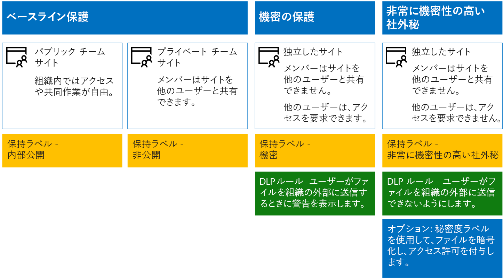

# SharePoint Online サイトとファイルをセキュリティで保護するSecure SharePoint Online sites and files

 **概要:** SharePoint Online および Office 365 内のファイルを保護するために推奨されている構成を取り上げます。**Summary:** Configuration recommendations for protecting files in SharePoint Online and Office 365.
  
この記事では、SharePoint Online チーム サイトとファイルの保護を、セキュリティとコラボレーションのしやすさのバランスを取りながら構成するための推奨事項を示します。この記事では、4 つの異なる構成を定義します。最初は、最もオープンな共有ポリシーを使用した、組織内のパブリック サイトです。それ以外の各構成は、保護のセットアップには有効な手段ですが、リソースへのアクセスやリソース上でのコラボレーションは、関連したユーザーのセットに限定されます。これらの推奨事項を開始点として使用し、組織のニーズを満たすように構成を調整してください。This article provides recommendations for configuring SharePoint Online team sites and file protection that balances security with ease of collaboration. This article defines four different configurations, starting with a public site within your organization with the most open sharing policies. Each additional configuration represents a meaningful step up in protection, but the ability to access and collaborate on resources is reduced to the relevant set of users. Use these recommendations as a starting point and adjust the configurations to meet the needs of your organization. 
  
この記事で示されている構成は、データ、ID、デバイスを保護するための 3 つの層に関する Microsoft の推奨事項と調和しています。The configurations in this article align with Microsoft's recommendations for three tiers of protection for data, identities, and devices:
  
- 基準の保護Baseline protection
    
- 機密の保護Sensitive protection
    
- 非常に機密性の高い社外秘の保護Highly confidential protection
    
以上の層と各層に推奨される機能については、次の情報源をご覧ください。For more information about these tiers and capabilities recommended for each tier, see the following resources. 
  
- [Office 365 の ID とデバイス保護Identity and Device Protection for Office 365](https://docs.microsoft.com/office365/enterprise/microsoft-cloud-it-architecture-resources#BKMK_O365IDP)
    
- [Office 365 のファイル保護ソリューションFile Protection Solutions in Office 365](https://docs.microsoft.com/office365/enterprise/microsoft-cloud-it-architecture-resources#BKMK_O365fileprotect)
    
## 機能の概要Capability overview

SharePoint Online チーム サイトの推奨事項は、Microsoft 365 のさまざまな機能に基づいています。Recommendations for SharePoint Online team sites draw on a variety of Microsoft 365 capabilities. 次の図は、4 つの SharePoint Online チーム サイトについて推奨されている構成を示しています。The following illustration shows the recommended configurations for four SharePoint Online team sites.

次の点が示されています。As illustrated:
  
- ベースライン保護には、SharePoint Online チーム サイト用の 2 つのオプション、つまりパブリック サイトとプライベート サイトが含まれます。パブリック サイトは、組織内のだれもが検出およびアクセスできます。プライベート サイトは、サイトのメンバーのみが検出とアクセスを行うことができます。どちらのサイト構成においても、グルーブの外部との共有を行うことができます。Baseline protection includes two options for SharePoint Online team sites — a public site and private site. Public sites can be discovered and accessed by anybody in the organization. Private sites can only be discovered and accessed by members of the site. Both of these site configurations allow for sharing outside the group. 
    
- 機密および高機密保護のためのサイトは、アクセスを特定のグループのメンバーのみに限定しているプライベート サイトになります。Sites for sensitive and highly confidential protection are private sites with access limited only to members of specific groups.
    
- [保持ラベル](labels.md)は、サイト内のファイルを分類する方法を提供します。[Retention labels](labels.md) provide a way to classify files within the sites. SharePoint Online チーム サイトはそれぞれ、ドキュメント ライブラリのファイルにサイトの既定の保持ラベルを自動的に付けるように構成されています。Each of the SharePoint Online team sites are configured to automatically label files in document libraries with a default retention label for the site. 4 つのサイト構成に合わせ、このサンプルのラベルは「内部公開」、「プライベート」、「機密」、「機密性の高い社外秘」になっています。Corresponding to the four site configurations, the labels in this example are Internal Public, Private, Sensitive, and Highly Confidential. ユーザーはラベルを変更できますが、この構成ですべてのファイルに既定のラベルが確実に与えられます。Users can change the labels, but this configuration ensures all files receive a default label.
    
- [データ損失防止](data-loss-prevention-policies.md) (DLP) ポリシーは、機密および高機密の保持ラベル向けに構成されており、これらのタイプのファイルをユーザーが組織外に送信しようとすると警告を表示したり、その処理を防止したりします。[Data loss prevention](data-loss-prevention-policies.md) (DLP) policies are configured for the Sensitive and Highly Confidential retention labels to either warn or prevent users when they attempt to send these types of files outside the organization.
    
- シナリオの必要に応じて、[機密ラベル](sensitivity-labels.md)を使用して、暗号化やアクセス許可によって機密性の高いファイルを保護することができます。If needed for your scenario, you can use [sensitivity labels](sensitivity-labels.md) to protect highly confidential files with encryption and permissions. Azure Information Protection のお客様は、Microsoft 365 コンプライアンス センターで、Azure Information Protection ラベルを使用することができ、追加の構成や高度な構成を行うように選択すると、ラベルは Azure portal と同期されます。For Azure Information Protection customers, you can use your Azure Information Protection labels in the Microsoft 365 compliance center, and your labels will be synced with the Azure portal in case you choose to perform additional or advanced configuration. Azure Information Protection ラベルと Office 365 機密ラベルは、互いに完全な互換性があります。Azure Information Protection labels and Office 365 sensitivity labels are fully compatible with each other. そのため、たとえば、Azure Information Protection によってラベル付けされたコンテンツがある場合、そのコンテンツの分類やラベル付けをやり直す必要はありません。この保護レベルはすべてのお客様に必要な訳ではありません。This means, for example, if you have content labeled by Azure Information Protection, you won’t need to reclassify or relabel your content.Not all customers need this level of protection. 
    
## SharePoint Online と OneDrive for Business に関するテナント全体の設定Tenant-wide settings for SharePoint Online and OneDrive for Business

SharePoint Online と OneDrive for Business には、すべてのサイトとユーザーに影響を及ぼすテナント全体の設定が含まれています。これらの設定の中には、サイト レベルにおいてより制限の強いもの (ただし、既定以下にはできません) に調整できるものもあります。このセクションでは、セキュリティとコラボレーションに影響を与えるテナント全体の設定について取り上げます。SharePoint Online and OneDrive for Business include tenant-wide settings that affect all sites and users. Some of these settings can also be adjusted at the site level to be more restrictive (but not less). This section discusses tenant-wide settings that affect security and collaboration. 
  
### 共有Sharing

このソリューションでは、次のテナント全体設定を推奨しています。For this solution, we recommend the following tenant-wide settings:
  
- 匿名の共有を含む、あらゆるアカウント タイプとのあらゆる共有を許可する既定の共有ポリシーを維持します。Keep the default sharing policy that allows all sharing with all account types, including anonymous sharing.
    
- 必要に応じて、匿名リンクの有効期間を設定します。Set anonymous links to expire, if desired.
    
- 既定のリンクの種類を「内部」に変更します。これにより、組織外で意図せずデータが漏洩する事態を避けることができます。Change the default link type for sharing to Internal. This helps prevent accidental data leakage outside your organization.
    
外部共有を許可することは直感に反しているように思えるかもしれませんが、これは電子メールでファイルを送信するよりもファイル共有をより制御できます。SharePoint Online と Outlook は連携して、セキュリティで保護されたファイルのコラボレーションを提供します。While it might seem counterintuitive to allow external sharing, this approach provides more control over file sharing compared to sending files in email. SharePoint Online and Outlook work together to provide secure collaboration on files. 
  
- 既定では、Outlook は、電子メールでファイルを送信する代わりに、ファイルへのリンクを共有します。By default, Outlook shares a link to a file instead of sending the file in email. 
    
- SharePoint Online と OneDrive for Business を使用すると、組織の内部と外部の共同作成者にファイルへのリンクを簡単に共有できます。SharePoint Online and OneDrive for Business make it easy to share links to files with contributors who are both inside and outside your organization
    
また、外部共有を管理することもできます。たとえば、以下の事柄が可能です。You also have controls to help govern external sharing. For example, you can:
  
- 匿名ゲスト リンクを無効にします。Disable an anonymous guest link.
    
- サイトへのユーザー アクセスを取り消す。Revoke user access to a site.
    
- 特定のサイトまたはドメインにアクセスできるユーザーを確認する。See who has access to a specific site or document.
    
- 匿名の共有リンクに期限を設定する (テナント設定)。Set anonymous sharing links to expire (tenant setting).
    
- 組織外で共有できるユーザーを制限する (テナント設定)。Limit who can share outside your organization (tenant setting).
    
### データ損失防止 (DLP) を外部共有と併用します。Use external sharing together with data loss prevention (DLP)

外部共有を許可しない場合、ビジネスで必要なユーザーは、代替のツールと手段を使用することになります。Microsoft は、機密ファイルおよび高機密ファイルを保護するために DLP ポリシーと外部共有を組み合わせることをお勧めします。If you don't allow external sharing, users with a business need will find alternate tools and methods. Microsoft recommends you combine external sharing with DLP policies to protect sensitive and highly confidential files.
  
### デバイス アクセスの設定Device access settings

SharePoint Online と OneDrive for Business のデバイス アクセスの設定では、アクセスを参照のみ (ファイルのダウンロード不可) に限定するか、アクセスをブロックするかを指定できます。Device access settings for SharePoint Online and OneDrive for Business let you determine whether access is limited to browser only (files can't be downloaded) or if access is blocked. 詳細については、「[非管理対象デバイスからのアクセスを制御する](https://docs.microsoft.com/ja-JP/sharepoint/control-access-from-unmanaged-devices)」を参照してください。For more information, see [Control access from unmanaged devices](https://docs.microsoft.com/ja-JP/sharepoint/control-access-from-unmanaged-devices). 

Azure Active Directory で推奨される条件付きアクセス ポリシーで、デバイス アクセスの設定を使用するには、「[SharePoint サイトおよびファイルをセキュリティで保護するためのポリシーの推奨事項](https://docs.microsoft.com/ja-JP/microsoft-365/enterprise/sharepoint-file-access-policies)」を参照してください。To use device access settings with recommended conditional access policies in Azure Active Directory, see [Policy recommendations for securing SharePoint sites and files](https://docs.microsoft.com/ja-JP/microsoft-365/enterprise/sharepoint-file-access-policies).
  
### OneDrive for BusinessOneDrive for Business

これらの設定を確認し、OneDrive for Business サイトの既定の設定を変更するかどうかを判断してください。現在、共有とデバイス アクセスの設定は SharePoint Online 管理センターの設定からコピーされており、両方の環境に適用されます。Visit these settings to decide if you want to change the default settings for OneDrive for Business sites. Currently, the sharing and device access settings are duplicated from the SharePoint Online admin center and apply to both environments.
  
## SharePoint チーム サイトの構成SharePoint team site configuration

次の表に、この記事で前述した各チーム サイトの構成をまとめます。これらの構成を開始点の推奨事項として使用し、組織のニーズに合うようサイトの種類と構成を調整します。すべての組織がすべてのサイトの種類を必要とするわけではありません。高機密保護が必要となる組織はごくわずかです。The following table summarizes the configuration for each of the team sites described earlier in this article. Use these configurations as starting point recommendations and adjust the site types and configurations to meet the needs of your organization. Not every organization needs every type of site. Only a small number of organizations require highly confidential protection.
  
||||||
|:-----|:-----|:-----|:-----|:-----|
||**ベースライン保護 1****Baseline protection #1**   |**基準の保護 #2****Baseline protection #2**   |**機密の保護****Sensitive protection**   |**非常に機密性の高い社外秘****Highly confidential**   |
|説明Description    |組織内ではアクセスや共同作業が自由。Open discovery and collaboration within the organization.    |グループ外で共有が許可されている、プライベート サイトとグループ。Private site and group with sharing allowed outside the group.    |アクセス レベルが特定のグループのメンバーシップによって定義されている、独立したサイト。共有はサイトのメンバーにのみ許可されます。組織外にファイルを送信しようとすると、DLP はユーザーに警告します。Isolated site, in which levels of access are defined by membership in specific groups. Sharing is only allowed to members of the site. DLP warns users when attempting to send files outside the organization.    |独立したサイトと、Azure Information Protection によるファイルの暗号化とアクセス許可。DLP はユーザーがファイルを組織の外部に送信できないようにします。Isolated site + file encryption and permissions with Azure Information Protection. DLP prevents users from sending files outside the organization.    |
|プライベート サイトまたはパブリック チーム サイトPrivate or public team site    |パブリックPublic    |プライベートPrivate    |プライベートPrivate    |プライベートPrivate    |
|誰にアクセス権が与えられるかWho has access?    |B2B のユーザーとゲスト ユーザーを含む、組織の全員。Everybody in the organization, including B2B users and guest users.    |サイトのメンバーのみ。他のユーザーは、アクセス権を要求できます。Members of the site only. Others can request access.    |サイトのメンバーのみ。他のユーザーは、アクセス権を要求できます。Members of the site only. Others can request access.    |メンバーのみ。他のユーザーは、アクセス権を要求できません。Members only. Others cannot request access.    |
|サイト レベルの共有制御Site-level sharing controls    |すべてのユーザーと共有できます。既定の設定です。Sharing allowed with anybody. Default settings.    |すべてのユーザーと共有できます。既定の設定です。Sharing allowed with anybody. Default settings.    |メンバーはサイトへのアクセスを共有できません。Members cannot share access to the site.    メンバー以外の人はサイトへのアクセスを要求できますが、要求はサイトの管理者に対して行う必要があります。Non-members can request access to the site, but these requests need to be addressed by a site administrator.    |メンバーはサイトへのアクセスを共有できません。Members cannot share access to the site.    メンバー以外の人はサイトまたはコンテンツへのアクセスを要求できません。Non-members cannot request access to the site or contents.    |
|サイトレベルのデバイス アクセス制御Site-level device access controls    |付加的な制御はありません。No additional controls.    |付加的な制御はありません。No additional controls.    |ユーザーは、非準拠デバイスまたはドメインに参加していないデバイスにファイルをダウンロードできません。他のすべてのデバイスからは参照専用のアクセスが許可されます。Site-level controls are coming soon, which prevents users from downloading files to non-compliant or non-domain joined devices. This allows browser-only access from all other devices.    |非準拠デバイスまたはドメインに参加していないデバイスへのファイルのダウンロードをブロックします。Site-level controls are coming soon, which blocks downloading of files to non-compliant or non-domain joined devices.    |
|保持ラベルRetention labels    |内部パブリックInternal Public    |プライベートPrivate    |機密Sensitive    |非常に機密性の高い社外秘Highly Confidential    |
|DLP ポリシーDLP policies    |||機密ラベルが付けられたファイルを組織の外に送信しようとするとユーザーに警告が表示されます。Warn users when sending files that are labeled as Sensitive outside the organization.    クレジット カード番号や他の個人データなど、機密データの種類の外部共有をブロックするには、これらのデータの種類 (自分で構成したカスタム データの種類を含む) に追加の DLP ポリシーを構成できます。To block external sharing of sensitive data types, such as credit card numbers or other personal data, you can configure additional DLP policies for these data types (including custom data types you configure).    |ユーザーが高機密のラベルが付けられているファイルを組織の外部に送信できないようにします。ファイルの共有相手など、理由を提供することよって、ユーザーはこの設定を上書きできます。Block users from sending files that are labeled as highly confidential outside organization. Allow users to override this by providing justification, including who they are sharing the file with.    |
|機密ラベルSensitivity labels    ||||機密ラベルを使用して、ファイルの暗号化とファイルへのアクセス許可の付与を自動化します。Use sensitivity labels to automatically encrypt and grant permissions to files. 機密ラベルは Azure Information Protection を使用して、ファイルを暗号化します。Sensitivity labels use Azure Information Protection to encrypt files. ファイルが流出した場合も、暗号化やアクセス許可は維持されます。This protection travels with the files in case they are leaked.    Office 365 は、Azure Information Protection で暗号化されたファイルを読み取ることができません。さらに、DLP ポリシーが操作できるのはメタデータ (ラベルを含む) のみで、これらのファイルのコンテンツ (ファイル内のクレジット カード番号など) を操作することはできません。Office 365 cannot read files encrypted with Azure Information Protection. Additionally, DLP policies can only work with the metadata (including labels) but not the contents of these files (such as credit card numbers within files).    |
   
このソリューションで異なる 4 種類の SharePoint Online チーム サイトを展開する手順については、「[3 つの層による保護用のサイトを展開する](deploy-sharepoint-online-sites-for-three-tiers-of-protection.md)」を参照してください。For the steps to deploy the four different types of SharePoint Online team sites in this solution, see [Deploy sites for three tiers of protection](deploy-sharepoint-online-sites-for-three-tiers-of-protection.md). 
  
## Office 365 保持ラベルOffice 365 retention labels

機密データが存在する環境には、保持ラベルの使用が推奨されます。Using retention labels is recommended for environments with sensitive data. 保持ラベルの構成と発行が完了した後、次のことを行えるようになります。After you configure and publish retention labels:
  
- SharePoint Online チーム サイトのドキュメント ライブラリに既定のラベルを適用することにより、それらのライブラリ内のすべてのドキュメントに既定のラベルを適用することができます。You can apply a default label to a document library in a SharePoint Online team site, so that all documents in that library get the default label. 
    
- コンテンツが特定の条件に一致するときには、ラベルを自動的に適用できます。You can apply labels to content automatically if it matches specific conditions.
    
- 保持ラベルに基づいた DLP ポリシーを適用できます。You can apply DLP policies that are based on retention labels.
    
- 組織内のユーザーは、Outlook on the web、Outlook 2010 以降、OneDrive for Business、SharePoint Online、Office 365 グループのコンテンツに手動でラベルを適用できます。ユーザーは自分が操作するコンテンツの種類を最もよく知っているので、コンテンツを分類して適切な DLP ポリシーを適用できます。People in your organization can apply a label manually to content in Outlook on the web, Outlook 2010 and later, OneDrive for Business, SharePoint Online, and Office 365 groups. Users often know best what type of content they're working with, so they can classify it and have the appropriate DLP policy applied.
    

  
図に示されているように、このソリューションでは次の保持ラベルを作成します。As illustrated, this solution includes creating the following retention labels:
  
- 非常に機密性の高い社外秘Highly Confidential
    
- 機密Sensitive
    
- プライベートPrivate
    
- 内部パブリックInternal Public
    
これらのラベルは、図で推奨されているサイトと、この記事で前述したグラフにマップされます。このソリューションでは、機密および高機密というラベルの付いたファイルの漏洩を防ぐために DLP ポリシーを構成することをお勧めします。These labels are mapped to the recommended sites in the illustrations and charts earlier in this article. This solution recommends configuring DLP policies to help prevent the leakage of files labeled as Sensitive and Highly Confidential.
  
このソリューションで保持ラベルと DLP ポリシーを構成する手順については、「[保持ラベルと DLP による SharePoint Online ファイルの保護](protect-sharepoint-online-files-with-office-365-labels-and-dlp.md)」を参照してください。For the steps to configure retention labels and DLP policies in this solution, see [Protect SharePoint Online files with retention labels and DLP](protect-sharepoint-online-files-with-office-365-labels-and-dlp.md).
  
## 機密ラベルSensitivity labels 

セキュリティ シナリオで保証される場合には、機密ラベルを使用して、ファイルが移動する場所に関係なく、保護を適用することができます。If warranted for your security scenario, you can use sensitivity labels to apply protections that follow the files wherever they go. Microsoft 365 コンプライアンス センターの機密ラベルと Azure Information Protection ラベルは同じです。Sensitivity labels in the Microsoft 365 compliance center and Azure Information Protection labels are the same. このソリューションでは、Azure Information Protection のスコープ付きポリシーと非常に機密性の高い社外秘ラベルのサブラベルを利用して、高いレベルのセキュリティで保護する必要があるファイルを暗号化し、アクセス許可を与えることをお勧めしています。For this solution, we recommend you use a scoped Azure Information Protection policy and a sub-label of the Highly Confidential label to encrypt and grant permissions to files that need to be protected with the highest level of security. 
  
Office 365 に保存されているファイルに Azure Information Protection の暗号化が適用されている場合、サービスはそのようなファイルの中身を処理できません。Be aware that when Azure Information Protection encryption is applied to files stored in Office 365, the service cannot process the contents of these files. 共同編集、電子情報開示、検索、Delve、その他の共同作業機能は機能しません。Co-authoring, eDiscovery, search, Delve, and other collaborative features do not work. DLP ポリシーが操作できるのはメタデータ (保持ラベルを含む) のみで、それらのファイルのコンテンツ (ファイル内のクレジットカード番号など) を操作することはできません。DLP policies can only work with the metadata (including retention labels) but not the contents of these files (such as credit card numbers within files).

詳細については、「[機密ラベルの概要](sensitivity-labels.md)」をご覧ください。For more information, see [Overview of sensitivity labels](sensitivity-labels.md).

    
### 外部ユーザーに対するアクセス許可の追加Adding permissions for external users

Azure Information Protection で保護されているファイルへのアクセス権を外部ユーザーに付与するには、2 つの方法があります。どちらの場合も外部ユーザーには Azure AD アカウントが必要です。外部ユーザーが Azure AD を使用する組織のメンバーでない場合は、サインアップ ページ ([https://aka.ms/aip-signup](https://aka.ms/aip-signup)) を使用して個人で Azure AD アカウントを取得できます。There are two ways you can grant external users access to files protected with Azure Information Protection. In both these cases, external users must have an Azure AD account. If external users aren't members of an organization that uses Azure AD, they can obtain an Azure AD account as an individual by using this sign-up page: [https://aka.ms/aip-signup](https://aka.ms/aip-signup).
  
- 外部ユーザーを、ラベルの保護の構成に使用する Azure AD グループに追加します。Add external users to an Azure AD group that is used to configure protection for a label
    
     最初に、ご使用のディレクトリでアカウントを B2B ユーザーとして追加する必要があります。[Azure Rights Management によるグループ メンバーシップのキャッシュ](https://docs.microsoft.com/information-protection/plan-design/prepare#group-membership-caching-by-azure-rights-management) には、数時間かかることがあります。この方法を使用すると、ラベルで保護された既存のファイルすべてに、アクセス許可が付与されます (ユーザーが Azure AD グループに追加される前に保護されていたファイルも含む)。You'll need to first add the account as a B2B user in your directory. It can take a couple of hours for [group membership caching by Azure Rights Management](https://docs.microsoft.com/information-protection/plan-design/prepare#group-membership-caching-by-azure-rights-management). With this method, permissions are granted to all existing files protected with the label (even files protected before a user is added to the Azure AD group).
    
- 外部ユーザーを、ラベル保護に直接追加します。Add external users directly to the label protection
    
     組織 (例: Fabrikam.com) のすべてのユーザー、Azure AD グループ (例: 組織内の財務グループ)、個々のユーザーを追加できます。たとえば、ラベルの保護に、規制機関の外部ユーザーを追加できます。この方法を使用すると、外部エンティティが保護に追加された後にラベルを使用して保護されたファイルにのみ、アクセス許可が付与されます。You can add all users from an organization (e.g. Fabrikam.com), an Azure AD group (such as a finance group within an organization), or an individual user. For example, you can add an external team of regulators to the protection for a label. With this method, permissions are granted only to files protected with the label after the external entity is added to the protection.
    
### Azure Information Protection の展開と使用Deploying and using Azure Information Protection

このソリューションで Azure Information Protection を構成する手順については、「[Azure Information Protection を使用して SharePoint Online ファイルを保護する](protect-sharepoint-online-files-with-azure-information-protection.md)」を参照してください。For the steps to configure Azure Information Protection in this solution, see [Protect SharePoint Online files with Azure Information Protection](protect-sharepoint-online-files-with-azure-information-protection.md).
  
## 関連項目See Also

[選挙運動、非営利組織、およびその他のアジャイル組織のための Microsoft Security ガイダンスMicrosoft Security Guidance for Political Campaigns, Nonprofits, and Other Agile Organizations](microsoft-security-guidance-for-political-campaigns-nonprofits-and-other-agile-o.md)
  
[クラウド導入およびハイブリッド ソリューションCloud adoption and hybrid solutions](https://docs.microsoft.com/office365/enterprise/cloud-adoption-and-hybrid-solutions)
  
