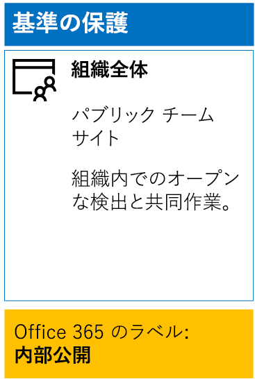
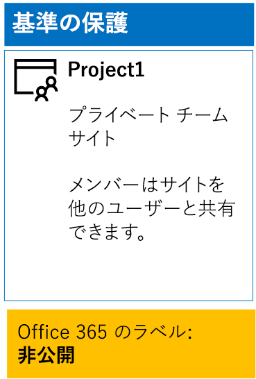
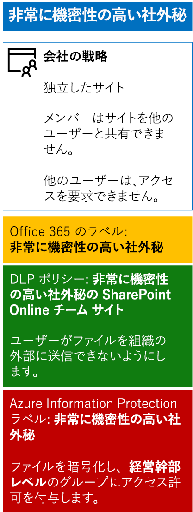

# <a name="secure-sharepoint-online-sites-in-a-devtest-environment"></a><span data-ttu-id="62cef-103">開発/テスト環境の SharePoint Online サイトをセキュリティで保護する</span><span class="sxs-lookup"><span data-stu-id="62cef-103">Secure SharePoint Online sites in a dev/test environment</span></span>

 <span data-ttu-id="62cef-104">**概要:** 開発/テスト環境で、パブリック、プライベート、機密、および高機密の SharePoint Online チーム サイトを作成します。</span><span class="sxs-lookup"><span data-stu-id="62cef-104">**Summary:** Create public, private, sensitive, and highly confidential SharePoint Online team sites in a dev/test environment.</span></span>
  
<span data-ttu-id="62cef-105">この記事では、4 つの異なるタイプの SharePoint Online チーム サイトを含む開発/テスト環境を [SharePoint Online サイトとファイルをセキュリティで保護する](secure-sharepoint-online-sites-and-files.md) ソリューション用に作成する手順を順を追って説明します。</span><span class="sxs-lookup"><span data-stu-id="62cef-105">This article provides step-by-step instructions to create a dev/test environment that includes the four different types of SharePoint Online team sites for the [Secure SharePoint Online sites and files](secure-sharepoint-online-sites-and-files.md) solution.</span></span>
  

  
<span data-ttu-id="62cef-107">SharePoint Online チーム サイトを運用環境に展開する前に、この開発/テスト環境を使用して情報保護の動作を試し、特定の必要に応じて設定を微調整します。</span><span class="sxs-lookup"><span data-stu-id="62cef-107">Use this dev/test environment to experiment with the information protection behaviors and fine-tune settings for your specific needs before deploying SharePoint Online team sites in production.</span></span>
  
## <a name="phase-1-create-your-devtest-environment"></a><span data-ttu-id="62cef-108">フェーズ 1: 開発/テスト環境を作成する</span><span class="sxs-lookup"><span data-stu-id="62cef-108">Phase 1: Create your dev/test environment</span></span>

<span data-ttu-id="62cef-109">このフェーズでは、架空の組織用に Office 365 と Enterprise Mobility + Security の試用版サブスクリプションを取得します。</span><span class="sxs-lookup"><span data-stu-id="62cef-109">In this phase, you obtain trial subscriptions for Office 365 and Enterprise Mobility + Security for a fictional organization.</span></span>
  
<span data-ttu-id="62cef-110">まず、「[Office 365 開発/テスト環境](https://docs.microsoft.com/office365/enterprise/office-365-dev-test-environment)」の**フェーズ 2**に記されている手順を実行します</span><span class="sxs-lookup"><span data-stu-id="62cef-110">First, follow the instructions in **Phase 2** of the [Office 365 dev/test environment](https://docs.microsoft.com/office365/enterprise/office-365-dev-test-environment).</span></span>
  
<span data-ttu-id="62cef-111">次に、EMS 試用版サブスクリプションにサインアップして、Office 365 試用版サブスクリプションと同じ組織に追加します。</span><span class="sxs-lookup"><span data-stu-id="62cef-111">Next, sign up for the EMS trial subscription and add it to the same organization as your Office 365 trial subscription.</span></span>
  
1. <span data-ttu-id="62cef-p101">必要に応じて、Office 365 ポータルに、試用版サブスクリプション用の全体管理者アカウントの資格情報でサインインします。ヘルプについては、「[一般法人向け Office 365 にサインインする場所](https://support.office.com/Article/Where-to-sign-in-to-Office-365-e9eb7d51-5430-4929-91ab-6157c5a050b4)」を参照してください。</span><span class="sxs-lookup"><span data-stu-id="62cef-p101">If needed, sign in to the Office 365 portal with the credentials of the global administrator account of your trial subscription. For help, see [Where to sign in to Office 365](https://support.office.com/Article/Where-to-sign-in-to-Office-365-e9eb7d51-5430-4929-91ab-6157c5a050b4).</span></span>
    
2. <span data-ttu-id="62cef-114">
            \*\*[管理]\** タイルをクリックします。</span><span class="sxs-lookup"><span data-stu-id="62cef-114">Click the **Admin** tile.</span></span>
    
3. <span data-ttu-id="62cef-115">ブラウザーの **[Office 管理センター]** タブの左側のナビゲーションで **[請求] > [サービスを購入する]** の順にクリックします。</span><span class="sxs-lookup"><span data-stu-id="62cef-115">On the **Office Admin center** tab in your browser, in the left navigation, click **Billing > Purchase services**.</span></span>
    
4. <span data-ttu-id="62cef-p102">**[サービスを購入]** ページで、 **[Enterprise Mobility + Security E5]** 項目を探します。その項目の上にマウス ポインターを移動させ、 **[無料試用版を起動する]** をクリックします。</span><span class="sxs-lookup"><span data-stu-id="62cef-p102">On the **Purchase services** page, find the **Enterprise Mobility + Security E5** item. Hover your mouse pointer over it and click **Start free trial**.</span></span>
    
5. <span data-ttu-id="62cef-118">**[注文の確認]** ページで、 **[今すぐ実行]** をクリックします。</span><span class="sxs-lookup"><span data-stu-id="62cef-118">On the **Confirm your order** page, click **Try now**.</span></span>
    
6. <span data-ttu-id="62cef-119">**[注文の受領書]** ページで、**[続行]** をクリックします。</span><span class="sxs-lookup"><span data-stu-id="62cef-119">On the **Order receipt** page, click **Continue**.</span></span>
    
<span data-ttu-id="62cef-120">次に、全体管理者アカウントの Enterprise Mobility + Security E5 ライセンスを有効にします。</span><span class="sxs-lookup"><span data-stu-id="62cef-120">Next, enable the Enterprise Mobility + Security E5 license for your global administrator account.</span></span>
  
1. <span data-ttu-id="62cef-121">ブラウザーの **[Office 365 管理センター]** タブの左側のナビゲーションで **[ユーザー] > [アクティブなユーザー]** の順にクリックします。</span><span class="sxs-lookup"><span data-stu-id="62cef-121">On the **Office 365 Admin center** tab in your browser, in the left navigation, click **Users > Active users**.</span></span>
    
2. <span data-ttu-id="62cef-122">全体管理者アカウントをクリックしてから、 **[製品ライセンス]** で **[編集]** をクリックします。</span><span class="sxs-lookup"><span data-stu-id="62cef-122">Click your global administrator account, and then click **Edit** for **Product licenses**.</span></span>
    
3. <span data-ttu-id="62cef-123">**[製品ライセンス]** ウィンドウで、 **Enterprise Mobility + Security E5** の製品ライセンスを **[オン]** にして、 **[保存]** をクリックしてから、 **[閉じる]** を 2 回クリックします。</span><span class="sxs-lookup"><span data-stu-id="62cef-123">On the **Product licenses** pane, turn the product license for **Enterprise Mobility + Security E5** to **On**, click **Save,** and then click **Close** twice.</span></span>
    
## <a name="phase-2-create-and-configure-your-azure-active-directory-ad-groups-and-users"></a><span data-ttu-id="62cef-124">フェーズ 2: Azure Active Directory (AD) グループとユーザーを作成して構成する</span><span class="sxs-lookup"><span data-stu-id="62cef-124">Phase 2: Create and configure your Azure Active Directory (AD) groups and users</span></span>

<span data-ttu-id="62cef-125">このフェーズでは、架空の組織用の Azure AD のグループとユーザーを作成して構成します。</span><span class="sxs-lookup"><span data-stu-id="62cef-125">In this phase, you create and configure the Azure AD groups and users for your fictional organization.</span></span>
  
<span data-ttu-id="62cef-126">最初に、Azure Portal で一般的な組織のグループのセットを作成します。</span><span class="sxs-lookup"><span data-stu-id="62cef-126">First, create a set of groups for a typical organization with the Azure portal.</span></span>
  
1. <span data-ttu-id="62cef-p103">ブラウザーで別のタブを作成し、Azure portal ([https://portal.azure.com](https://portal.azure.com)) に移動します。必要に応じて、Office 365 E5 の試用版サブスクリプション用の全体管理者アカウントの資格情報でサインインします。</span><span class="sxs-lookup"><span data-stu-id="62cef-p103">Create a separate tab in your browser, and then go to the Azure portal at [https://portal.azure.com](https://portal.azure.com). If needed, sign in with the credentials of the global administrator account for your Office 365 E5 trial subscription.</span></span>
    
2. <span data-ttu-id="62cef-129">Azure Portal で **[Azure Active Directory] > [グループ]** の順にクリックします。</span><span class="sxs-lookup"><span data-stu-id="62cef-129">In the Azure portal, click **Azure Active Directory > Groups**.</span></span>
    
3. <span data-ttu-id="62cef-130">**[グループ] - [すべてのグループ]** ブレードで、**[+ 新しいグループ]** をクリックします。</span><span class="sxs-lookup"><span data-stu-id="62cef-130">On the **Groups - All groups** blade, click **+ New group**.</span></span>
    
4. <span data-ttu-id="62cef-131">**[グループ]** ブレードでの手順:</span><span class="sxs-lookup"><span data-stu-id="62cef-131">On the **Group** blade:</span></span>
    
  - <span data-ttu-id="62cef-132">**[グループの種類]** で **[Office 365]** を選択します。</span><span class="sxs-lookup"><span data-stu-id="62cef-132">Select **Office 365** in **Group type**.</span></span>
    
  - <span data-ttu-id="62cef-133">**[名前]** に「**C スイート**」と入力します。</span><span class="sxs-lookup"><span data-stu-id="62cef-133">Type **C-Suite** in **Name**.</span></span>
    
  - <span data-ttu-id="62cef-134">**[メンバーシップの種類]** で **[割り当て済み]** を選択します。</span><span class="sxs-lookup"><span data-stu-id="62cef-134">Select **Assigned** in **Membership type**.</span></span>
      
5. <span data-ttu-id="62cef-135">**[作成]** をクリックして、 **[グループ]** ブレードを閉じます。</span><span class="sxs-lookup"><span data-stu-id="62cef-135">Click **Create**, and then close the **Group** blade.</span></span>
    
6. <span data-ttu-id="62cef-136">次のグループ名について手順 3 から 5 を繰り返します。</span><span class="sxs-lookup"><span data-stu-id="62cef-136">Repeat steps 3-5 for the following group names:</span></span>
    
  - <span data-ttu-id="62cef-137">IT staff (IT スタッフ)</span><span class="sxs-lookup"><span data-stu-id="62cef-137">IT staff</span></span>
    
  - <span data-ttu-id="62cef-138">Research staff (研究スタッフ)</span><span class="sxs-lookup"><span data-stu-id="62cef-138">Research staff</span></span>
    
  - <span data-ttu-id="62cef-139">Regular staff (正規スタッフ)</span><span class="sxs-lookup"><span data-stu-id="62cef-139">Regular staff</span></span>
    
  - <span data-ttu-id="62cef-140">Marketing staff (マーケティング スタッフ)</span><span class="sxs-lookup"><span data-stu-id="62cef-140">Marketing staff</span></span>
    
  - <span data-ttu-id="62cef-141">Sales staff (営業スタッフ)</span><span class="sxs-lookup"><span data-stu-id="62cef-141">Sales staff</span></span>
    
7. <span data-ttu-id="62cef-142">ブラウザーの [Azure Portal] タブを開いたままにします。</span><span class="sxs-lookup"><span data-stu-id="62cef-142">Keep the Azure portal tab in your browser open.</span></span>
    
<span data-ttu-id="62cef-143">次に、グループのメンバーが、Office 365 と EMS のサブスクリプションのライセンスを自動的に割り当てられるように、自動ライセンスを構成します。</span><span class="sxs-lookup"><span data-stu-id="62cef-143">Next, you configure automatic licensing so that members of your groups are automatically assigned licenses for your Office 365 and EMS subscriptions.</span></span>
  
1. <span data-ttu-id="62cef-144">Azure Portal で **[Azure Active Directory] > [ライセンス] > [すべての製品]** の順にクリックします。</span><span class="sxs-lookup"><span data-stu-id="62cef-144">In the Azure portal, click **Azure Active Directory > Licenses > All products**.</span></span>
    
2. <span data-ttu-id="62cef-145">一覧で、 **[Enterprise Mobility + Security E5]** と **[Office 365 Enterprise E5]** を選択し、 **[割り当て]** をクリックします。</span><span class="sxs-lookup"><span data-stu-id="62cef-145">In the list, select **Enterprise Mobility + Security E5** and **Office 365 Enterprise E5**, and then click **Assign**.</span></span>
    
3. <span data-ttu-id="62cef-146">**[ライセンスの割り当て]** ブレードで、 **[ユーザーとグループ]** をクリックします。</span><span class="sxs-lookup"><span data-stu-id="62cef-146">In the **Assign license** blade, click **Users and groups**.</span></span>
    
4. <span data-ttu-id="62cef-147">グループの一覧で、以下を選択します。</span><span class="sxs-lookup"><span data-stu-id="62cef-147">In the list of groups, select the following:</span></span>
    
  - <span data-ttu-id="62cef-148">C-Suite (C スイート)</span><span class="sxs-lookup"><span data-stu-id="62cef-148">C-Suite</span></span>
    
  - <span data-ttu-id="62cef-149">IT staff (IT スタッフ)</span><span class="sxs-lookup"><span data-stu-id="62cef-149">IT staff</span></span>
    
  - <span data-ttu-id="62cef-150">Research staff (研究スタッフ)</span><span class="sxs-lookup"><span data-stu-id="62cef-150">Research staff</span></span>
    
  - <span data-ttu-id="62cef-151">Regular staff (正規スタッフ)</span><span class="sxs-lookup"><span data-stu-id="62cef-151">Regular staff</span></span>
    
  - <span data-ttu-id="62cef-152">Marketing staff (マーケティング スタッフ)</span><span class="sxs-lookup"><span data-stu-id="62cef-152">Marketing staff</span></span>
    
  - <span data-ttu-id="62cef-153">営業スタッフ</span><span class="sxs-lookup"><span data-stu-id="62cef-153">Sales staff</span></span>
    
5. <span data-ttu-id="62cef-154">**[選択]** をクリックし、 **[割り当て]** をクリックします。</span><span class="sxs-lookup"><span data-stu-id="62cef-154">Click **Select**, and then click **Assign**.</span></span>
    
6. <span data-ttu-id="62cef-155">ブラウザーの [Azure Portal] タブを閉じます。</span><span class="sxs-lookup"><span data-stu-id="62cef-155">Close the Azure portal tab in your browser.</span></span>
    
<span data-ttu-id="62cef-156">次に [Azure Active Directory V2 PowerShell モジュールを使用して接続](https://go.microsoft.com/fwlink/?linkid=842218)します。</span><span class="sxs-lookup"><span data-stu-id="62cef-156">Next, you [Connect with the Azure Active Directory V2 PowerShell module](https://go.microsoft.com/fwlink/?linkid=842218).</span></span>
  
<span data-ttu-id="62cef-157">組織名、場所、および共通のパスワードを入力し、PowerShell コマンド プロンプトまたは Integrated Script Environment (ISE) からこれらのコマンドを実行し、ユーザー アカウントを作成し、それぞれのグループに追加します。</span><span class="sxs-lookup"><span data-stu-id="62cef-157">Fill in your organization name, your location, and a common password, and then run these commands from the PowerShell command prompt or Integrated Script Environment (ISE) to create user accounts and add them to their groups:</span></span>
  
```
$orgName="<organization name, such as contoso for the contoso.onmicrosoft.com trial subscription domain name>"
$location="<the ISO ALPHA2 country code, such as US for the United States>"
$commonPassword="<common password for all the new accounts>"

$PasswordProfile=New-Object -TypeName Microsoft.Open.AzureAD.Model.PasswordProfile
$PasswordProfile.Password=$commonPassword

$groupName="C-Suite"
$userNames=@("CEO","CFO","CIO") 
$groupID=(Get-AzureADGroup | Where { $_.DisplayName -eq $groupName }).ObjectID
ForEach ($element in $userNames){ 
New-AzureADUser -DisplayName $element -PasswordProfile $PasswordProfile -UserPrincipalName ($element + "@" + $orgName + ".onmicrosoft.com") -AccountEnabled $true -MailNickName $element -UsageLocation $location 
Add-AzureADGroupMember -RefObjectId (Get-AzureADUser | Where { $_.DisplayName -eq $element }).ObjectID -ObjectId $groupID
}
$groupName="IT staff"
$userNames=@("ITAdmin1","ITAdmin2") 
$groupID=(Get-AzureADGroup | Where { $_.DisplayName -eq $groupName }).ObjectID
ForEach ($element in $userNames){ 
New-AzureADUser -DisplayName $element -PasswordProfile $PasswordProfile -UserPrincipalName ($element + "@" + $orgName + ".onmicrosoft.com") -AccountEnabled $true -MailNickName $element -UsageLocation $location 
Add-AzureADGroupMember -RefObjectId (Get-AzureADUser | Where { $_.DisplayName -eq $element }).ObjectID -ObjectId $groupID
}
$groupName="Research staff"
$userNames=@("Researcher1") 
$groupID=(Get-AzureADGroup | Where { $_.DisplayName -eq $groupName }).ObjectID
ForEach ($element in $userNames){ 
New-AzureADUser -DisplayName $element -PasswordProfile $PasswordProfile -UserPrincipalName ($element + "@" + $orgName + ".onmicrosoft.com") -AccountEnabled $true -MailNickName $element -UsageLocation $location 
Add-AzureADGroupMember -RefObjectId (Get-AzureADUser | Where { $_.DisplayName -eq $element }).ObjectID -ObjectId $groupID
}
$groupName="Regular staff"
$userNames=@("Regular1", "Regular2") 
$groupID=(Get-AzureADGroup | Where { $_.DisplayName -eq $groupName }).ObjectID
ForEach ($element in $userNames){ 
New-AzureADUser -DisplayName $element -PasswordProfile $PasswordProfile -UserPrincipalName ($element + "@" + $orgName + ".onmicrosoft.com") -AccountEnabled $true -MailNickName $element -UsageLocation $location 
Add-AzureADGroupMember -RefObjectId (Get-AzureADUser | Where { $_.DisplayName -eq $element }).ObjectID -ObjectId $groupID
}
$groupName="Marketing staff"
$userNames=@("Marketing1", "Marketing2") 
$groupID=(Get-AzureADGroup | Where { $_.DisplayName -eq $groupName }).ObjectID
ForEach ($element in $userNames){ 
New-AzureADUser -DisplayName $element -PasswordProfile $PasswordProfile -UserPrincipalName ($element + "@" + $orgName + ".onmicrosoft.com") -AccountEnabled $true -MailNickName $element -UsageLocation $location 
Add-AzureADGroupMember -RefObjectId (Get-AzureADUser | Where { $_.DisplayName -eq $element }).ObjectID -ObjectId $groupID
}
$groupName="Sales staff"
$userNames=@("SalesPerson1") 
$groupID=(Get-AzureADGroup | Where { $_.DisplayName -eq $groupName }).ObjectID
ForEach ($element in $userNames){ 
New-AzureADUser -DisplayName $element -PasswordProfile $PasswordProfile -UserPrincipalName ($element + "@" + $orgName + ".onmicrosoft.com") -AccountEnabled $true -MailNickName $element -UsageLocation $location 
Add-AzureADGroupMember -RefObjectId (Get-AzureADUser | Where { $_.DisplayName -eq $element }).ObjectID -ObjectId $groupID
}
```

> [!NOTE]
> <span data-ttu-id="62cef-p104">ここで共通のパスワードを使用することで、自動化と、開発/テスト環境の構成を容易にします。運用サブスクリプションでの使用はお勧めしません。</span><span class="sxs-lookup"><span data-stu-id="62cef-p104">The use of a common password here is for automation and ease of configuration for a dev/test environment. This is not recommended for production subscriptions.</span></span> 
  
<span data-ttu-id="62cef-160">次の手順を使用して、グループ ベースのライセンスが正しく機能していることを確認します。</span><span class="sxs-lookup"><span data-stu-id="62cef-160">Use these steps to verify that group-based licensing is working correctly.</span></span>
  
1. <span data-ttu-id="62cef-161">ブラウザーの **[Microsoft Office Home]** タブで、 **[管理者]** タイルをクリックします。</span><span class="sxs-lookup"><span data-stu-id="62cef-161">From the **Microsoft Office Home** tab of your browser, click the **Admin** tile.</span></span>
    
2. <span data-ttu-id="62cef-162">ブラウザーの新しい **Office 管理センター**のタブで、**[ユーザー]** をクリックします。</span><span class="sxs-lookup"><span data-stu-id="62cef-162">From the new **Office Admin center** tab of your browser, click **Users**.</span></span>
    
3. <span data-ttu-id="62cef-163">ユーザーの一覧で、**[CEO]** をクリックします。</span><span class="sxs-lookup"><span data-stu-id="62cef-163">In the list of users, click **CEO**.</span></span>
    
4. <span data-ttu-id="62cef-164">**CEO** ユーザー アカウントのプロパティが一覧表示されているウィンドウで、(**[Product licenses]\(製品ライセンス\)** の) **Enterprise Mobility + Security E5** および **Office 365 Enterprise E5** のライセンスが割り当てられていることを確認します。</span><span class="sxs-lookup"><span data-stu-id="62cef-164">In the pane that lists the properties of the **CEO** user account, verify that it has been assigned the **Enterprise Mobility + Security E5** and **Office 365 Enterprise E5** licenses (in **Product licenses**).</span></span>
    
## <a name="phase-3-create-office-365-labels"></a><span data-ttu-id="62cef-165">フェーズ 3: Office 365 のラベルを作成する</span><span class="sxs-lookup"><span data-stu-id="62cef-165">Phase 3: Create Office 365 labels</span></span>

<span data-ttu-id="62cef-166">このフェーズでは、SharePoint Online チーム サイトのドキュメント フォルダーに対してさまざまなセキュリティ レベルのラベルを作成します。</span><span class="sxs-lookup"><span data-stu-id="62cef-166">In this phase, you create the labels for the different levels of security for SharePoint Online team site documents folders.</span></span>
  
1. <span data-ttu-id="62cef-p105">必要に応じて、インターネット ブラウザーのプライベート インスタンスを使用し、Office 365 E5 の試用版サブスクリプションの全体管理者アカウントで Office 365 ポータルにサインインします。ヘルプについては、「[一般法人向け Office 365 にサインインする場所](https://support.office.com/Article/Where-to-sign-in-to-Office-365-e9eb7d51-5430-4929-91ab-6157c5a050b4)」を参照してください。</span><span class="sxs-lookup"><span data-stu-id="62cef-p105">If needed, use a private instance of your Internet browser and sign in to the Office 365 portal with the global administrator account of your Office 365 E5 trial subscription. For help, see [Where to sign in to Office 365](https://support.office.com/Article/Where-to-sign-in-to-Office-365-e9eb7d51-5430-4929-91ab-6157c5a050b4).</span></span>
    
2. <span data-ttu-id="62cef-169">**[Microsoft Office Home]** タブで、 **[管理者]** タイルをクリックします。</span><span class="sxs-lookup"><span data-stu-id="62cef-169">From the **Microsoft Office Home** tab, click the **Admin** tile.</span></span>
    
3. <span data-ttu-id="62cef-170">ブラウザーの新しい **[Office 管理者センター]** タブで、**[管理センター] > [セキュリティとコンプライアンス]** をクリックします。</span><span class="sxs-lookup"><span data-stu-id="62cef-170">From the new **Office Admin center** tab of your browser, click **Admin centers > Security &amp; Compliance**.</span></span>
    
4. <span data-ttu-id="62cef-171">ブラウザーの新しい **[ホーム – セキュリティとコンプライアンス]** タブをクリックして、**[分類] > [ラベル]** をクリックします。</span><span class="sxs-lookup"><span data-stu-id="62cef-171">From the new **Home - Security &amp; Compliance** tab of your browser, click **Classifications > Labels**.</span></span>
    
5. <span data-ttu-id="62cef-172">**[ホーム] > [ラベル]** ウィンドウで、**[保持]** タブをクリックして、**[ラベルを作成]** をクリックします。</span><span class="sxs-lookup"><span data-stu-id="62cef-172">From the **Home > Labels** pane, click the **Retention** tab, and then click **Create a label**.</span></span>
    
6. <span data-ttu-id="62cef-173">**[ラベルに名前をつける]** ウィンドウで、「 **内部パブリック**」と入力してから、 **[次へ]** をクリックします。</span><span class="sxs-lookup"><span data-stu-id="62cef-173">On the **Name your label** pane, type **Internal Public**, and then click **Next**.</span></span>
    
7. <span data-ttu-id="62cef-174">**[ラベル設定]** ウィンドウで、 **[次へ]** をクリックします。</span><span class="sxs-lookup"><span data-stu-id="62cef-174">On the **Label settings** pane, click **Next**.</span></span>
    
8. <span data-ttu-id="62cef-175">**[設定の確認]** ウィンドウで、 **[このラベルを作成する]** をクリックしてから **[閉じる]** をクリックします。</span><span class="sxs-lookup"><span data-stu-id="62cef-175">On the **Review your settings** pane, click **Create this label**, and then click **Close**.</span></span>
    
9. <span data-ttu-id="62cef-176">次の追加ラベルについて手順 5 から 8 を繰り返します。</span><span class="sxs-lookup"><span data-stu-id="62cef-176">Repeat steps 5-8 for these additional labels:</span></span>
    
  - <span data-ttu-id="62cef-177">Kirkland</span><span class="sxs-lookup"><span data-stu-id="62cef-177">Private</span></span>
    
  - <span data-ttu-id="62cef-178">機密</span><span class="sxs-lookup"><span data-stu-id="62cef-178">Sensitive</span></span>
    
  - <span data-ttu-id="62cef-179">非常に機密性の高い社外秘</span><span class="sxs-lookup"><span data-stu-id="62cef-179">Highly Confidential</span></span>
    
10. <span data-ttu-id="62cef-180">**[ホーム]、[ラベル]** ウィンドウで、**[Publish labels]\(ラベルの発行\)** をクリックします。</span><span class="sxs-lookup"><span data-stu-id="62cef-180">From the **Home > Labels** pane, click **Publish labels**.</span></span>
    
11. <span data-ttu-id="62cef-181">**[発行するラベルを選択]** ウィンドウで、 **[発行するラベルを選択]** をクリックします。</span><span class="sxs-lookup"><span data-stu-id="62cef-181">On the **Choose labels to publish** pane, click **Choose labels to publish**.</span></span>
    
12. <span data-ttu-id="62cef-182">**[Choose labels]\(ラベルの選択\)** ウィンドウで、**[追加]** をクリックして 4 つのラベルをすべて選択します。</span><span class="sxs-lookup"><span data-stu-id="62cef-182">On the **Choose labels** pane, click **Add** and select all four labels.</span></span>
    
13. <span data-ttu-id="62cef-183">[ **完了**] をクリックします。</span><span class="sxs-lookup"><span data-stu-id="62cef-183">Click **Done**.</span></span>
    
14. <span data-ttu-id="62cef-184">**[発行するラベルを選択]** ウィンドウで、 **[次へ]** をクリックします。</span><span class="sxs-lookup"><span data-stu-id="62cef-184">On the **Choose labels to publish** pane, click **Next**.</span></span>
    
15. <span data-ttu-id="62cef-185">**[場所の選択]** ウィンドウで、 **[次へ]** をクリックします。</span><span class="sxs-lookup"><span data-stu-id="62cef-185">On the **Choose locations** pane, click **Next**.</span></span>
    
16. <span data-ttu-id="62cef-186">**[ポリシーに名前をつける]** ウィンドウで、 **[名前]** に「 **サンプル組織**」と入力してから、 **[次へ]** をクリックします。</span><span class="sxs-lookup"><span data-stu-id="62cef-186">On the **Name your policy** pane, type **Example organization** in **Name**, and then click **Next**.</span></span>
    
17. <span data-ttu-id="62cef-187">**[設定の確認]** ウィンドウで、 **[ラベルの発行]** をクリックしてから **[閉じる]** をクリックします。</span><span class="sxs-lookup"><span data-stu-id="62cef-187">On the **Review your settings** pane, click **Publish labels**, and then click **Close**.</span></span>
    
## <a name="phase-4-create-your-sharepoint-online-team-sites"></a><span data-ttu-id="62cef-188">フェーズ 4: SharePoint Online チーム サイトを作成する</span><span class="sxs-lookup"><span data-stu-id="62cef-188">Phase 4: Create your SharePoint Online team sites</span></span>

<span data-ttu-id="62cef-189">このフェーズでは、例の組織に 4 種類の SharePoint Online チーム サイトを作成して構成します。</span><span class="sxs-lookup"><span data-stu-id="62cef-189">In this phase, you create and configure the four types of SharePoint Online team sites for your example organization.</span></span>
  
### <a name="organization-wide-team-site"></a><span data-ttu-id="62cef-190">Organization wide チーム サイト</span><span class="sxs-lookup"><span data-stu-id="62cef-190">Organization wide team site</span></span>

<span data-ttu-id="62cef-191">ベースラインのパブリック SharePoint Online チーム サイトを作成するには、次の操作を行います。</span><span class="sxs-lookup"><span data-stu-id="62cef-191">To create a baseline public SharePoint Online team site, do the following:</span></span>
  
1. <span data-ttu-id="62cef-p106">必要に応じて、ローカル コンピューターのブラウザーを使用し、全体管理者アカウントで Office 365 ポータルにサインインします。ヘルプについては、「[一般法人向け Office 365 にサインインする場所](https://support.office.com/Article/Where-to-sign-in-to-Office-365-e9eb7d51-5430-4929-91ab-6157c5a050b4)」を参照してください。</span><span class="sxs-lookup"><span data-stu-id="62cef-p106">If needed, use a browser on your local computer and sign in to the Office 365 portal using your global administrator account. For help, see [Where to sign in to Office 365](https://support.office.com/Article/Where-to-sign-in-to-Office-365-e9eb7d51-5430-4929-91ab-6157c5a050b4).</span></span>
    
2. <span data-ttu-id="62cef-194">タイルのリストで、 **[SharePoint]** をクリックします。</span><span class="sxs-lookup"><span data-stu-id="62cef-194">In the list of tiles, click **SharePoint**.</span></span>
    
3. <span data-ttu-id="62cef-195">ブラウザーの新しい **SharePoint** タブで、**[+ サイトの作成]** をクリックします。</span><span class="sxs-lookup"><span data-stu-id="62cef-195">On the new **SharePoint** tab in your browser, click **+ Create site**.</span></span>
    
4. <span data-ttu-id="62cef-196">**[サイトの作成]** ページで、**[チーム サイト]** をクリックします。</span><span class="sxs-lookup"><span data-stu-id="62cef-196">On the **Create a site** page, click **Team site**.</span></span>
    
5. <span data-ttu-id="62cef-197">**[サイト名]** に「**組織全体**」と入力します。</span><span class="sxs-lookup"><span data-stu-id="62cef-197">In **Site name**, type **Organization wide**.</span></span> 
    
6. <span data-ttu-id="62cef-198">**[チーム サイトの説明]** に、「 **組織全体の SharePoint サイト**」と入力します。</span><span class="sxs-lookup"><span data-stu-id="62cef-198">In **Team site description**, type **SharePoint site for the entire organization**.</span></span>
    
7. <span data-ttu-id="62cef-199">**[プライバシー設定]** で、 **[パブリック - 組織の全ユーザーがこのサイトにアクセス可能]** を選択して **[次へ]** をクリックします。</span><span class="sxs-lookup"><span data-stu-id="62cef-199">In **Privacy settings**, select **Public - anyone in the organization can access this site**, and then click **Next**.</span></span>
    
8. <span data-ttu-id="62cef-200">**[誰を追加しますか]** ウィンドウで、 **[完了]** をクリックします。</span><span class="sxs-lookup"><span data-stu-id="62cef-200">On the **Who do you want to add?** pane, click **Finish**.</span></span>
    
<span data-ttu-id="62cef-201">次に、組織全体のチーム サイトのドキュメント フォルダーを [内部パブリック] ラベル用に構成します。</span><span class="sxs-lookup"><span data-stu-id="62cef-201">Next, configure the documents folder of the Organization wide team site for the Internal Public label.</span></span>
  
1. <span data-ttu-id="62cef-202">ブラウザーの **[組織全体 - ホーム]** タブで、 **[ドキュメント]** をクリックします。</span><span class="sxs-lookup"><span data-stu-id="62cef-202">In the **Organization wide-Home** tab of your browser, click **Documents**.</span></span>
    
2. <span data-ttu-id="62cef-203">[設定] アイコンをクリックしてから、 **[ライブラリの設定]** をクリックします。</span><span class="sxs-lookup"><span data-stu-id="62cef-203">Click the settings icon, and then click **Library settings**.</span></span>
    
3. <span data-ttu-id="62cef-204">**[権限と管理]** をクリックして、 **[このライブラリ内の項目にラベルを適用]** をクリックします。</span><span class="sxs-lookup"><span data-stu-id="62cef-204">Under **Permissions and Management**, click **Apply label to items in this library**.</span></span>
    
4. <span data-ttu-id="62cef-205">**[設定 - ラベルの適用]** で **[内部パブリック]** をクリックし、 **[保存]** をクリックします。</span><span class="sxs-lookup"><span data-stu-id="62cef-205">In **Settings-Apply Label**, select **Internal Public**, and then click **Save**.</span></span>
    
<span data-ttu-id="62cef-206">最終的な構成をここに示します。</span><span class="sxs-lookup"><span data-stu-id="62cef-206">Here is your resulting configuration.</span></span>
  

  
### <a name="project-1-team-site"></a><span data-ttu-id="62cef-208">プロジェクト 1 チーム サイト</span><span class="sxs-lookup"><span data-stu-id="62cef-208">Project 1 team site</span></span>

<span data-ttu-id="62cef-209">組織内のプロジェクト用にベースラインのプライベート SharePoint Online チーム サイトを作成するには、次の手順を実行します。</span><span class="sxs-lookup"><span data-stu-id="62cef-209">To create a baseline private SharePoint Online team site for a project within the organization, do the following:</span></span>
  
1. <span data-ttu-id="62cef-p107">必要に応じて、ローカル コンピューターのブラウザーを使用し、全体管理者アカウントで Office 365 ポータルにサインインします。ヘルプについては、「[一般法人向け Office 365 にサインインする場所](https://support.office.com/Article/Where-to-sign-in-to-Office-365-e9eb7d51-5430-4929-91ab-6157c5a050b4)」を参照してください。</span><span class="sxs-lookup"><span data-stu-id="62cef-p107">If needed, use a browser on your local computer and sign in to the Office 365 portal using your global administrator account. For help, see [Where to sign in to Office 365](https://support.office.com/Article/Where-to-sign-in-to-Office-365-e9eb7d51-5430-4929-91ab-6157c5a050b4).</span></span>
    
2. <span data-ttu-id="62cef-212">タイルのリストで、 **[SharePoint]** をクリックします。</span><span class="sxs-lookup"><span data-stu-id="62cef-212">In the list of tiles, click **SharePoint**.</span></span>
    
3. <span data-ttu-id="62cef-213">ブラウザーの新しい **SharePoint** タブで、**[+ サイトの作成]** をクリックします。</span><span class="sxs-lookup"><span data-stu-id="62cef-213">On the new **SharePoint** tab in your browser, click **+ Create site**.</span></span>
    
4. <span data-ttu-id="62cef-214">**[サイトの作成]** ページで、**[チーム サイト]** をクリックします。</span><span class="sxs-lookup"><span data-stu-id="62cef-214">On the **Create a site** page, click **Team site**.</span></span>
    
5. <span data-ttu-id="62cef-215">**[サイト名]** に、「 **プロジェクト 1**」と入力します。</span><span class="sxs-lookup"><span data-stu-id="62cef-215">In **Site name**, type **Project 1**.</span></span> 
    
6. <span data-ttu-id="62cef-216">**[チーム サイトの説明]** に、「 **プロジェクト 1 の SharePoint サイト**」と入力します。</span><span class="sxs-lookup"><span data-stu-id="62cef-216">In **Team site description,** type **SharePoint site for Project 1**.</span></span>
    
7. <span data-ttu-id="62cef-217">**[プライバシー設定]** で、 **[プライベート - メンバーのみがこのサイトにアクセス可能**」を選択して **[次へ]** をクリックします。</span><span class="sxs-lookup"><span data-stu-id="62cef-217">In **Privacy settings**, select **Private - only members can access this site**, and then click **Next**.</span></span>
    
8. <span data-ttu-id="62cef-218">**[誰を追加しますか]** ウィンドウで、 **[完了]** をクリックします。</span><span class="sxs-lookup"><span data-stu-id="62cef-218">On the **Who do you want to add?** pane, click **Finish**.</span></span>
    
<span data-ttu-id="62cef-219">次に、プライベート ラベル用に Project 1 チーム サイトのドキュメント フォルダーを構成します。</span><span class="sxs-lookup"><span data-stu-id="62cef-219">Next, configure the documents folder of the Project 1 team site for the Private label.</span></span>
  
1. <span data-ttu-id="62cef-220">ブラウザーの **[プロジェクト 1 - ホーム]** タブで、 **[ドキュメント]** をクリックします。</span><span class="sxs-lookup"><span data-stu-id="62cef-220">In the **Project 1-Home** tab of your browser, click **Documents**.</span></span>
    
2. <span data-ttu-id="62cef-221">[設定] アイコンをクリックしてから、 **[ライブラリの設定]** をクリックします。</span><span class="sxs-lookup"><span data-stu-id="62cef-221">Click the settings icon, and then click **Library settings**.</span></span>
    
3. <span data-ttu-id="62cef-222">**[権限と管理]** をクリックして、 **[このライブラリ内の項目にラベルを適用]** をクリックします。</span><span class="sxs-lookup"><span data-stu-id="62cef-222">Under **Permissions and Management**, click **Apply label to items in this library**.</span></span>
    
4. <span data-ttu-id="62cef-223">**[設定 - ラベルの適用]** で **[プライベート]** をクリックし、 **[保存]** をクリックします。</span><span class="sxs-lookup"><span data-stu-id="62cef-223">In **Settings-Apply Label**, select **Private**, and then click **Save**.</span></span>
    
<span data-ttu-id="62cef-224">最終的な構成をここに示します。</span><span class="sxs-lookup"><span data-stu-id="62cef-224">Here is your resulting configuration.</span></span>
  

  
### <a name="marketing-campaigns-team-site"></a><span data-ttu-id="62cef-226">マーケティング キャンペーン チーム サイト</span><span class="sxs-lookup"><span data-stu-id="62cef-226">Marketing campaigns team site</span></span>

<span data-ttu-id="62cef-227">マーケティング キャンペーン リソース用の機密レベルの分離した SharePoint Online チーム サイトを作成するには、次の手順を実行します。</span><span class="sxs-lookup"><span data-stu-id="62cef-227">To create a sensitive-level isolated SharePoint Online team site for marketing campaign resources, do the following:</span></span>
  
1. <span data-ttu-id="62cef-p108">ローカル コンピューターのブラウザーを使用し、全体管理者アカウントで Office 365 ポータルにサインインします。ヘルプについては、「[一般法人向け Office 365 にサインインする場所](https://support.office.com/Article/Where-to-sign-in-to-Office-365-e9eb7d51-5430-4929-91ab-6157c5a050b4)」を参照してください。</span><span class="sxs-lookup"><span data-stu-id="62cef-p108">Using a browser on your local computer, sign in to the Office 365 portal using your global administrator account. For help, see [Where to sign in to Office 365](https://support.office.com/Article/Where-to-sign-in-to-Office-365-e9eb7d51-5430-4929-91ab-6157c5a050b4).</span></span>
    
2. <span data-ttu-id="62cef-230">タイルのリストで、 **[SharePoint]** をクリックします。</span><span class="sxs-lookup"><span data-stu-id="62cef-230">In the list of tiles, click **SharePoint**.</span></span>
    
3. <span data-ttu-id="62cef-231">ブラウザーの新しい **SharePoint** タブで、**[+ サイトの作成]** をクリックします。</span><span class="sxs-lookup"><span data-stu-id="62cef-231">On the new **SharePoint** tab in your browser, click **+ Create site**.</span></span>
    
4. <span data-ttu-id="62cef-232">**[サイトの作成]** ページで、**[チーム サイト]** をクリックします。</span><span class="sxs-lookup"><span data-stu-id="62cef-232">On the **Create a site** page, click **Team site**.</span></span>
    
5. <span data-ttu-id="62cef-233">**[Team site name]\(チーム サイト名\)** に、「**Marketing campaigns**」と入力します。</span><span class="sxs-lookup"><span data-stu-id="62cef-233">In **Team site name**, type **Marketing campaigns**.</span></span>
    
6. <span data-ttu-id="62cef-234">**[チーム サイトの説明]** に、「 **マーケティング キャンペーン リソースの SharePoint サイト (機密)**」と入力します。</span><span class="sxs-lookup"><span data-stu-id="62cef-234">In **Team site description**, type **SharePoint site for marketing campaign resources (sensitive)**.</span></span>
    
7.  <span data-ttu-id="62cef-235">**[プライバシー設定]** で、 **[プライベート - メンバーのみがこのサイトにアクセス可能**」を選択して **[次へ]** をクリックします。</span><span class="sxs-lookup"><span data-stu-id="62cef-235">In **Privacy settings**, select **Private - only members can access this site**, and then click **Next**.</span></span>
    
8. <span data-ttu-id="62cef-236">**[誰を追加しますか]** ウィンドウで、 **[完了]** をクリックします。</span><span class="sxs-lookup"><span data-stu-id="62cef-236">On the **Who do you want to add?** pane, click **Finish**.</span></span>
    
9. <span data-ttu-id="62cef-237">ブラウザーの新しい **[マーケティング キャンペーン]** タブのツール バーで、設定アイコンをクリックしてから、 **[サイトのアクセス許可]** をクリックします。</span><span class="sxs-lookup"><span data-stu-id="62cef-237">On the new **Marketing campaigns** tab in your browser, in the tool bar, click the settings icon, and then click **Site permissions**.</span></span>
    
10. <span data-ttu-id="62cef-238">**[サイトの権限]** ウィンドウで、 **[高度な権限の設定]** をクリックします。</span><span class="sxs-lookup"><span data-stu-id="62cef-238">In the **Site permissions** pane, click **Advanced permissions settings**.</span></span>
    
11. <span data-ttu-id="62cef-239">ブラウザーの新しい **[アクセス許可]** タブで、**[アクセス要求の設定]** をクリックします。</span><span class="sxs-lookup"><span data-stu-id="62cef-239">In the new **Permissions** tab in your browser, click **Access Request Settings**.</span></span>
    
12. <span data-ttu-id="62cef-240">**[アクセス要求の設定]** ダイアログ ボックスで、**[サイトと個別のファイルおよびフォルダーの共有をメンバーに許可します]** および **[メンバーが、他のユーザーをサイト メンバー グループに招待することを許可します]** チェック ボックスをクリアし、**[すべてのアクセス要求を送信する]** に「**ITAdmin1@**\<組織名>**.onmicrosoft.com**」と入力し、**[OK]** をクリックします。</span><span class="sxs-lookup"><span data-stu-id="62cef-240">In the **Access Request Settings** dialog box, clear the **Allow members to share the site and individual files and folders** and **Allow members to invite others to the site members group** check boxes, type **ITAdmin1@**\<your organization name>**.onmicrosoft.com** in **Send all requests for access**, and then click **OK**.</span></span>
    
13. <span data-ttu-id="62cef-241">一覧にある **[マーケティング キャンペーン メンバー]** をクリックします。</span><span class="sxs-lookup"><span data-stu-id="62cef-241">Click **Marketing campaigns Members** in the list.</span></span>
    
14. <span data-ttu-id="62cef-242">**[ユーザーとグループ]** ページで、 **[新規]** をクリックします。</span><span class="sxs-lookup"><span data-stu-id="62cef-242">On the **People and Groups** page, click **New**.</span></span>
    
15. <span data-ttu-id="62cef-243">**[共有]** ダイアログ ボックスで、「 **マーケティング スタッフ**」と入力し、それを選択してから、 **[共有]** をクリックします。</span><span class="sxs-lookup"><span data-stu-id="62cef-243">In the **Share** dialog box, type **Marketing staff**, select it, and then click **Share**.</span></span>
    
16. <span data-ttu-id="62cef-244">**Researcher1** ユーザー アカウントに対して手順 14 と 15 を繰り返します。</span><span class="sxs-lookup"><span data-stu-id="62cef-244">Repeat steps 14 and 15 for the **Researcher1** user account.</span></span>
    
17. <span data-ttu-id="62cef-245">ブラウザーの戻るボタンをクリックします。</span><span class="sxs-lookup"><span data-stu-id="62cef-245">Click the back button on your browser.</span></span>
    
18. <span data-ttu-id="62cef-246">一覧にある **[マーケティング キャンペーン所有者]** をクリックします。</span><span class="sxs-lookup"><span data-stu-id="62cef-246">Click **Marketing campaigns Owners** in the list.</span></span>
    
19. <span data-ttu-id="62cef-247">**[ユーザーとグループ]** ページで、 **[新規]** をクリックします。</span><span class="sxs-lookup"><span data-stu-id="62cef-247">On the **People and Groups** page, click **New**.</span></span>
    
20. <span data-ttu-id="62cef-248">**[共有]** ダイアログ ボックスに「 **IT スタッフ**」と入力し、それを選択して、 **[共有]** をクリックします。</span><span class="sxs-lookup"><span data-stu-id="62cef-248">In the **Share** dialog box, type **IT staff**, select it, and then click **Share**.</span></span>
    
21. <span data-ttu-id="62cef-249">ブラウザーの戻るボタンをクリックします。</span><span class="sxs-lookup"><span data-stu-id="62cef-249">Click the back button on your browser.</span></span>
    
22. <span data-ttu-id="62cef-250">ブラウザーの **[ユーザーとグループ]** タブを閉じて、ブラウザーの **[マーケティング キャンペーン - ホーム]** タブをクリックしてから、 **[サイトのアクセス許可]** ウィンドウを閉じます。</span><span class="sxs-lookup"><span data-stu-id="62cef-250">Close the **People and Groups** tab in your browser, click the **Marketing campaigns-Home** tab in your browser, and then close the **Site permissions** pane.</span></span>
    
<span data-ttu-id="62cef-251">権限を構成した結果を以下に示します。</span><span class="sxs-lookup"><span data-stu-id="62cef-251">Here are the results of configuring permissions:</span></span>
  
- <span data-ttu-id="62cef-252">**Marketing campaigns - メンバー** SharePoint グループには、**Marketing campaigns** グループ (全体管理者ユーザー アカウントを含む)、**Marketing staff (マーケティング スタッフ)** グループ (Marketing1 および Marketing2 のユーザー アカウントを含む)、および **Researcher1** ユーザー アカウントのみが含まれます。</span><span class="sxs-lookup"><span data-stu-id="62cef-252">The **Marketing campaigns-Members** SharePoint group contains only the **Marketing campaigns** group (which contains the global administrator user account), the **Marketing staff** group (which contains the Marketing1 and Marketing2 user accounts), and the **Researcher1** user account.</span></span>
    
- <span data-ttu-id="62cef-253">**Marketing campaigns - 所有者** SharePoint グループには、**IT staff (IT スタッフ)** グループ (ITAdmin1 および ITAdmin2 のユーザー アカウントのみを含む) のみが含まれます。</span><span class="sxs-lookup"><span data-stu-id="62cef-253">The **Marketing campaigns-Owners** SharePoint group contains only the **IT staff** group (which contains only the ITAdmin1 and ITAdmin2 user accounts).</span></span>
    
- <span data-ttu-id="62cef-254">**Marketing campaigns - 閲覧者** SharePoint グループには、グループまたはユーザー アカウントは含まれません。</span><span class="sxs-lookup"><span data-stu-id="62cef-254">The **Marketing campaigns-Visitors** SharePoint group contains no groups or user accounts.</span></span>
    
- <span data-ttu-id="62cef-255">メンバーは、サイト レベルのアクセス許可を変更できません (これを実行できるのは、 **[マーケティング キャンペーン - 所有者]** グループのメンバーだけです)。</span><span class="sxs-lookup"><span data-stu-id="62cef-255">Members cannot modify site-level permissions (this can only be done by members of the **Marketing campaigns-Owners** group).</span></span>
    
- <span data-ttu-id="62cef-256">他のユーザー アカウントは、サイトやそのリソースにアクセスできませんが、サイトへのアクセスを要求することができます。これにより、ITAdmin1 ユーザー アカウントのメールボックスに電子メールが送信されます。</span><span class="sxs-lookup"><span data-stu-id="62cef-256">Other user accounts cannot access the site or its resources, but can request access to the site, which will send an email to the ITAdmin1 user account mailbox.</span></span>
    
<span data-ttu-id="62cef-257">次に、マーケティング キャンペーン チーム サイトのドキュメント フォルダーを [機密] ラベル用に構成します。</span><span class="sxs-lookup"><span data-stu-id="62cef-257">Next, configure the documents folder of the Marketing campaigns team site for the Sensitive label.</span></span>
  
1. <span data-ttu-id="62cef-258">ブラウザーの **[マーケティング キャンペーン - ホーム]** タブで、 **[ドキュメント]** をクリックします。</span><span class="sxs-lookup"><span data-stu-id="62cef-258">In the **Marketing campaigns-Home** tab of your browser, click **Documents**.</span></span>
    
2. <span data-ttu-id="62cef-259">[設定] アイコンをクリックしてから、 **[ライブラリの設定]** をクリックします。</span><span class="sxs-lookup"><span data-stu-id="62cef-259">Click the settings icon, and then click **Library settings**.</span></span>
    
3. <span data-ttu-id="62cef-260">**[権限と管理]** をクリックして、 **[このライブラリ内の項目にラベルを適用]** をクリックします。</span><span class="sxs-lookup"><span data-stu-id="62cef-260">Under **Permissions and Management**, click **Apply label to items in this library**.</span></span>
    
4. <span data-ttu-id="62cef-261">**[設定 - ラベルの適用]** で **[機密]** をクリックし、 **[保存]** をクリックします。</span><span class="sxs-lookup"><span data-stu-id="62cef-261">In **Settings-Apply Label**, select **Sensitive**, and then click **Save**.</span></span>
    
<span data-ttu-id="62cef-262">次に、機密ラベルのある SharePoint Online チーム サイト上のドキュメントを共有しようとしているユーザーに通知を行うデータ損失防止 (DLP) ポリシーを構成します。このチーム サイトには、組織外部のマーケティング キャンペーン サイトが含まれます。</span><span class="sxs-lookup"><span data-stu-id="62cef-262">Next, configure a data loss prevention (DLP) policy that notifies users when they share a document on a SharePoint Online team site with the Sensitive label, which includes the Marketing campaigns site, outside the organization.</span></span>
  
1. <span data-ttu-id="62cef-263">ブラウザーの **[Microsoft Office Home]** タブで、**[セキュリティとコンプライアンス]** タイルをクリックします。</span><span class="sxs-lookup"><span data-stu-id="62cef-263">From the **Microsoft Office Home** tab in your browser, click the **Security &amp; Compliance** tile.</span></span>
    
2. <span data-ttu-id="62cef-264">ブラウザーの新しい **[セキュリティとコンプライアンス]** タブで、**[データ損失防止] > [ポリシー]** をクリックします。</span><span class="sxs-lookup"><span data-stu-id="62cef-264">On the new **Security &amp; Compliance** tab in your browser, click **Data loss prevention > Policy**.</span></span>
    
3. <span data-ttu-id="62cef-265">**[データ損失防止]** ウィンドウで、 **[+ ポリシーの作成]** をクリックします。</span><span class="sxs-lookup"><span data-stu-id="62cef-265">In the **Data loss prevention** pane, click **+ Create a policy**.</span></span>
    
4. <span data-ttu-id="62cef-266">**[テンプレートを使って開始するか、カスタム ポリシーを作成する]** ウィンドウで、 **[カスタム]** をクリックしてから、 **[次へ]** をクリックします。</span><span class="sxs-lookup"><span data-stu-id="62cef-266">In the **Start with a template or create a custom policy** pane, click **Custom**, and then click **Next**.</span></span>
    
5. <span data-ttu-id="62cef-267">**[ポリシーに名前をつける]** ウィンドウで、 **[名前]** に「 **機密ラベル SharePoint Online チーム サイト**」と入力してから、 **[次へ]** をクリックします。</span><span class="sxs-lookup"><span data-stu-id="62cef-267">In the **Name your policy** pane, type **Sensitive label SharePoint Online team sites** in **Name**, and then click **Next**.</span></span>
    
6. <span data-ttu-id="62cef-268">**[場所の選択]** ウィンドウで、 **[自分で特定の場所を選択する]** をクリックしてから、 **[次へ]** をクリックします。</span><span class="sxs-lookup"><span data-stu-id="62cef-268">In the **Choose locations** pane, click **Let me choose specific locations**, and then click **Next**.</span></span>
    
7. <span data-ttu-id="62cef-269">場所の一覧で、 **Exchange メール**と **OneDrive アカウント**の場所を無効にし、 **[次へ]** をクリックします。</span><span class="sxs-lookup"><span data-stu-id="62cef-269">In the list of locations, disable the **Exchange email** and **OneDrive accounts** locations, and then click **Next**.</span></span>
    
8. <span data-ttu-id="62cef-270">**[保護する機密性の高い情報の種類をカスタマイズする]** ウィンドウで、 **[編集]** をクリックします。</span><span class="sxs-lookup"><span data-stu-id="62cef-270">In the **Customize the types of sensitive info you want to protect** pane, click **Edit**.</span></span>
    
9. <span data-ttu-id="62cef-271">**[保護するコンテンツの種類を選択する]** ウィンドウのドロップダウン ボックスで **[追加]** をクリックしてから、 **[ラベル]** をクリックします。</span><span class="sxs-lookup"><span data-stu-id="62cef-271">In the **Choose the types of content to protect** pane, click **Add** in the drop-down box, and then click **Labels**.</span></span>
    
10. <span data-ttu-id="62cef-272">**[ラベル]** ウィンドウで、 **[+ 追加]** をクリックして、 **[機密]** ラベルを選択し、 **[追加]** をクリックしてから、 **[完了]** をクリックします。</span><span class="sxs-lookup"><span data-stu-id="62cef-272">In the **Labels** pane, click **+ Add**, select the **Sensitive** label, click **Add**, and then click **Done**.</span></span>
    
11. <span data-ttu-id="62cef-273">**[保護するコンテンツの種類を選択する]** ウィンドウで、 **[保存]** をクリックします。</span><span class="sxs-lookup"><span data-stu-id="62cef-273">In the **Choose the types of content to protect** pane, click **Save**.</span></span>
    
12. <span data-ttu-id="62cef-274">**[Customize the types of sensitive info you want to protect]\(保護する機密情報の種類のカスタマイズ\)** ウィンドウで、**[次へ]** をクリックします。</span><span class="sxs-lookup"><span data-stu-id="62cef-274">In the **Customize the types of sensitive info you want to protect** pane, click **Next**.</span></span>
    
13. <span data-ttu-id="62cef-275">**[What do you want to do if we detect sensitive info?]\(機密情報が検出された場合の処理\)** ウィンドウで、**[Customize the tip and email]\(ヒントと電子メールをカスタマイズする)** をクリックします。</span><span class="sxs-lookup"><span data-stu-id="62cef-275">In the **What do you want to do if we detect sensitive info?** pane, click **Customize the tip and email**.</span></span>
    
14. <span data-ttu-id="62cef-276">**[Customize policy tips and email notifications]\(ポリシー ヒントと電子メール通知のカスタマイズ\)** ウィンドウで、**[Customize the policy tip text]\(ポリシー ヒントのテキストをカスタマイズする\)** をクリックします。</span><span class="sxs-lookup"><span data-stu-id="62cef-276">In the **Customize policy tips and email notifications** pane, click **Customize the policy tip text**.</span></span>
    
15. <span data-ttu-id="62cef-277">次の内容をテキスト ボックスに入力するか、貼り付けます。</span><span class="sxs-lookup"><span data-stu-id="62cef-277">In the text box, type or paste in the following:</span></span>
    
  - <span data-ttu-id="62cef-p109">組織外のユーザーと共有するには、ファイルをダウンロードしてから開きます。[ファイル]、[文書の保護]、[パスワードを使用して暗号化] の順にクリックし、強力なパスワードを指定します。別の電子メールまたはその他の通信手段でパスワードを送信します。</span><span class="sxs-lookup"><span data-stu-id="62cef-p109">To share with a user outside the organization, download the file and then open it. Click File, then Protect Document, and then Encrypt with Password, and then specify a strong password. Send the password in a separate email or other means of communication.</span></span>
    
16. <span data-ttu-id="62cef-281">**[OK]** をクリックします。</span><span class="sxs-lookup"><span data-stu-id="62cef-281">Click **OK**.</span></span>
    
17. <span data-ttu-id="62cef-282">**[機密性の高い情報が検出された場合に実行する操作]** ウィンドウで、 **[ユーザーが共有できないようにし、共有コンテンツへのアクセスを制限する]** チェックボックスをクリアしてから、 **[次へ]** をクリックします。</span><span class="sxs-lookup"><span data-stu-id="62cef-282">In the **What do you want to do if we detect sensitive info?** pane, clear the **Block people from sharing, and restrict access to shared content** check box, and then click **Next**.</span></span>
    
18. <span data-ttu-id="62cef-283">**[ポリシーを有効にしますか、または最初にテストしますか?]** ウィンドウで、 **[すぐ有効にします]** をクリックし、 **[次へ]** をクリックします。</span><span class="sxs-lookup"><span data-stu-id="62cef-283">In the **Do you want to turn on the policy or test things out first?** pane, click **Yes, turn it on right away**, and then click **Next**.</span></span>
    
19. <span data-ttu-id="62cef-284">**[設定の確認]** ウィンドウで、 **[作成]** をクリックしてから **[閉じる]** をクリックします。</span><span class="sxs-lookup"><span data-stu-id="62cef-284">In the **Review your settings** pane, click **Create**, and then click **Close**.</span></span>
    
<span data-ttu-id="62cef-285">最終的な構成をここに示します。</span><span class="sxs-lookup"><span data-stu-id="62cef-285">Here is your resulting configuration.</span></span>
  

  
### <a name="company-strategy-team-site"></a><span data-ttu-id="62cef-287">会社戦略のチーム サイト</span><span class="sxs-lookup"><span data-stu-id="62cef-287">Company strategy team site</span></span>

<span data-ttu-id="62cef-288">組織の最高責任者の戦略上の会社のリソース用に高機密レベルで分離した SharePoint Online チーム サイトを作成するには、次の手順を実行します。</span><span class="sxs-lookup"><span data-stu-id="62cef-288">To create an isolated SharePoint Online team site at the highly confidential level for strategic company resources of the chief executives of the organization, do the following:</span></span>
  
1. <span data-ttu-id="62cef-p110">必要に応じて、ローカル コンピューターのブラウザーを使用し、全体管理者アカウントで Office 365 ポータルにサインインします。ヘルプについては、「[一般法人向け Office 365 にサインインする場所](https://support.office.com/Article/Where-to-sign-in-to-Office-365-e9eb7d51-5430-4929-91ab-6157c5a050b4)」を参照してください。</span><span class="sxs-lookup"><span data-stu-id="62cef-p110">If needed, use a browser on your local computer and sign in to the Office 365 portal using your global administrator account. For help, see [Where to sign in to Office 365](https://support.office.com/Article/Where-to-sign-in-to-Office-365-e9eb7d51-5430-4929-91ab-6157c5a050b4).</span></span>
    
2. <span data-ttu-id="62cef-291">タイルのリストで、 **[SharePoint]** をクリックします。</span><span class="sxs-lookup"><span data-stu-id="62cef-291">In the list of tiles, click **SharePoint**.</span></span>
    
3. <span data-ttu-id="62cef-292">ブラウザーの新しい **SharePoint** タブで、**[+ サイトの作成]** をクリックします。</span><span class="sxs-lookup"><span data-stu-id="62cef-292">On the new **SharePoint** tab in your browser, click **+ Create site**.</span></span>
    
4. <span data-ttu-id="62cef-293">**[サイトの作成]** ページで、 **[チーム サイト]** をクリックします。</span><span class="sxs-lookup"><span data-stu-id="62cef-293">On the **Create a site** page, click **Team site**.</span></span>
    
5. <span data-ttu-id="62cef-294">**[Team site name]\(チーム サイト名\)** に「**Company strategy**」と入力します。</span><span class="sxs-lookup"><span data-stu-id="62cef-294">In **Team site name**, type **Company strategy**.</span></span>
    
6. <span data-ttu-id="62cef-295">**[チーム サイトの説明]** に、「 **会社戦略の SharePoint サイト (高機密)**」と入力します。</span><span class="sxs-lookup"><span data-stu-id="62cef-295">In **Team site description**, type **SharePoint site for company strategy (highly confidential)**.</span></span>
    
7.  <span data-ttu-id="62cef-296">**[プライバシー設定]** で、 **[プライベート - メンバーのみがこのサイトにアクセス可能**」を選択して **[次へ]** をクリックします。</span><span class="sxs-lookup"><span data-stu-id="62cef-296">In **Privacy settings**, select **Private - only members can access this site**, and then click **Next**.</span></span>
    
8. <span data-ttu-id="62cef-297">**[誰を追加しますか]** ウィンドウで、 **[完了]** をクリックします。</span><span class="sxs-lookup"><span data-stu-id="62cef-297">On the **Who do you want to add?** pane, click **Finish**.</span></span>
    
9. <span data-ttu-id="62cef-298">ブラウザーの新しい **[会社戦略]** タブのツール バーで、設定アイコンをクリックしてから、 **[サイトのアクセス許可]** をクリックします。</span><span class="sxs-lookup"><span data-stu-id="62cef-298">On the new **Company strategy** tab in your browser, in the tool bar, click the settings icon, and then click **Site permissions**.</span></span>
    
10. <span data-ttu-id="62cef-299">**[サイトの権限]** ウィンドウで、 **[高度な権限の設定]** をクリックします。</span><span class="sxs-lookup"><span data-stu-id="62cef-299">In the **Site permissions** pane, click **Advanced permissions settings**.</span></span>
    
11. <span data-ttu-id="62cef-300">ブラウザーの新しい **[アクセス許可]** タブで、 **[アクセス要求の設定]** をクリックします。</span><span class="sxs-lookup"><span data-stu-id="62cef-300">In the new **Permissions** tab in your browser, click **Access Request Settings**.</span></span>
    
12. <span data-ttu-id="62cef-301">**[アクセス要求の設定]** ダイアログ ボックスの **[サイトと個別のファイルおよびフォルダーの共有をメンバーに許可します]** と **[メンバーが、他のユーザーをサイト メンバー グループに招待することを許可します]** をクリアし (これによって、3 つのチェック ボックスがすべてクリアされる)、 **[OK]** をクリックします。</span><span class="sxs-lookup"><span data-stu-id="62cef-301">In the **Access Request Settings** dialog box, clear **Allow members to share the site and individual files and folders** and **Allow members to invite others to the site members group** (so that all three check boxes are cleared), and then click **OK**.</span></span>
    
13. <span data-ttu-id="62cef-302">一覧にある **[会社戦略メンバー]** をクリックします。</span><span class="sxs-lookup"><span data-stu-id="62cef-302">Click **Company strategy Members** in the list.</span></span>
    
14. <span data-ttu-id="62cef-303">**[ユーザーとグループ]** ページで、 **[新規]** をクリックします。</span><span class="sxs-lookup"><span data-stu-id="62cef-303">On the **People and Groups** page, click **New**.</span></span>
    
15. <span data-ttu-id="62cef-304">**[共有]** ダイアログ ボックスで、「 **C スイート**」と入力し、それを選択してから、 **[共有]** をクリックします。</span><span class="sxs-lookup"><span data-stu-id="62cef-304">In the **Share** dialog box, type **C-Suite**, select it, and then click **Share**.</span></span>
    
16. <span data-ttu-id="62cef-305">一覧にある **[会社戦略所有者]** をクリックします。</span><span class="sxs-lookup"><span data-stu-id="62cef-305">Click **Company strategy Owners** in the list.</span></span>
    
17. <span data-ttu-id="62cef-306">**[ユーザーとグループ]** ページで、 **[新規]** をクリックします。</span><span class="sxs-lookup"><span data-stu-id="62cef-306">On the **People and Groups** page, click **New**.</span></span>
    
18. <span data-ttu-id="62cef-307">**[共有]** ダイアログ ボックスに「 **IT スタッフ**」と入力し、それを選択して、 **[共有]** をクリックします。</span><span class="sxs-lookup"><span data-stu-id="62cef-307">In the **Share** dialog box, type **IT staff**, select it, and then click **Share**.</span></span>
    
19. <span data-ttu-id="62cef-308">ブラウザーの戻るボタンをクリックします。</span><span class="sxs-lookup"><span data-stu-id="62cef-308">Click the back button on your browser.</span></span>
    
20. <span data-ttu-id="62cef-309">ブラウザーの **[ユーザーとグループ]** タブを閉じて、ブラウザーの **[会社戦略 - ホーム]** タブをクリックしてから、 **[サイトのアクセス許可]** ウィンドウを閉じます。</span><span class="sxs-lookup"><span data-stu-id="62cef-309">Close the **People and Groups** tab in your browser, click the **Company strategy-Home** tab in your browser, and then close the **Site permissions** pane.</span></span>
    
<span data-ttu-id="62cef-310">権限を構成した結果を以下に示します。</span><span class="sxs-lookup"><span data-stu-id="62cef-310">Here are the results of configuring permissions:</span></span>
  
- <span data-ttu-id="62cef-311">**[会社戦略 - メンバー]** SharePoint グループには、 **[C スイート]** グループ (CEO、CFO、および CIO ユーザー アカウントのみを含む) と **[会社戦略]** グループ (全体管理者ユーザー アカウントのみを含む) のみが含まれています。</span><span class="sxs-lookup"><span data-stu-id="62cef-311">The **Company strategy-Members** SharePoint group contains only the **C-Suite** group (which contains only the CEO, CFO, and CIO user accounts) and the **Company strategy** group (which contains only the global administrator user account).</span></span>
    
- <span data-ttu-id="62cef-312">**[会社戦略 - 所有者]** SharePoint グループには、 **[IT スタッフ]** グループ (ITAdmin1 ユーザー アカウントと ITAdmin2 ユーザー アカウントのみを含む) のみが含まれています。</span><span class="sxs-lookup"><span data-stu-id="62cef-312">The **Company strategy-Owners** SharePoint group contains only the **IT staff** group (which contains only the ITAdmin1 and ITAdmin2 user accounts).</span></span>
    
- <span data-ttu-id="62cef-313">**[会社戦略 - 訪問者]** SharePoint グループには、グループまたはユーザー アカウントは含まれていません。</span><span class="sxs-lookup"><span data-stu-id="62cef-313">The **Company strategy-Visitors** SharePoint group contains no groups or user accounts.</span></span>
    
- <span data-ttu-id="62cef-314">メンバーはサイト レベルのアクセス許可を変更できません (これを実行できるのは、 **[会社戦略 - 所有者]** グループのメンバーだけです)。</span><span class="sxs-lookup"><span data-stu-id="62cef-314">Members cannot modify site-level permissions (this can only be done by members of the **Company strategy-Owners** group).</span></span>
    
- <span data-ttu-id="62cef-p111">その他のユーザー アカウントは、サイトやそのリソースにアクセスすることも、そのサイトへのアクセスを要求することもできません。サイトへの追加のアクセス許可は、全体管理者または **[会社戦略 - 所有者]** グループのメンバーが行う必要があります。</span><span class="sxs-lookup"><span data-stu-id="62cef-p111">Other user accounts cannot access the site or its resources or request access to the site. Additional permissions to the site must be done by the global administrator or by a member of the **Company strategy-Owners** group.</span></span>
    
<span data-ttu-id="62cef-317">次に、会社戦略チーム サイトのドキュメント フォルダーを [高機密] ラベル用に構成します。</span><span class="sxs-lookup"><span data-stu-id="62cef-317">Next, configure the documents folder of the Company strategy team site for the Highly Confidential label.</span></span>
  
1. <span data-ttu-id="62cef-318">ブラウザーの **[会社戦略 - ホーム]** タブで、 **[ドキュメント]** をクリックします。</span><span class="sxs-lookup"><span data-stu-id="62cef-318">In the **Company strategy-Home** tab of your browser, click **Documents**.</span></span>
    
2. <span data-ttu-id="62cef-319">[設定] アイコンをクリックしてから、 **[ライブラリの設定]** をクリックします。</span><span class="sxs-lookup"><span data-stu-id="62cef-319">Click the settings icon, and then click **Library settings**.</span></span>
    
3. <span data-ttu-id="62cef-320">**[権限と管理]** をクリックして、 **[このライブラリ内の項目にラベルを適用]** をクリックします。</span><span class="sxs-lookup"><span data-stu-id="62cef-320">Under **Permissions and Management**, click **Apply label to items in this library**.</span></span>
    
4. <span data-ttu-id="62cef-321">**[設定 - ラベルの適用]** で **[高機密]** をクリックし、 **[保存]** をクリックします。</span><span class="sxs-lookup"><span data-stu-id="62cef-321">In **Settings-Apply Label**, select **Highly Confidential**, and then click **Save**.</span></span>
    
<span data-ttu-id="62cef-322">次に、高機密ラベルのある SharePoint Online チーム サイト上のドキュメントをユーザーが共有するのをブロックする DLP ポリシーを構成します。このチーム サイトには、組織外部の会社戦略サイトが含まれます。</span><span class="sxs-lookup"><span data-stu-id="62cef-322">Next, configure a DLP policy that blocks users when they share a document on a SharePoint Online team site with the Highly Confidential label, which includes the Company strategy site, outside the organization.</span></span>
  
1. <span data-ttu-id="62cef-p112">必要に応じて、ローカル コンピューターのブラウザーを使用して、セキュリティ管理者または会社管理者の役割のアカウントで、Office 365 ポータルにサインインします。ヘルプを表示するには、「[一般法人向け Office 365 にサインインする場所](https://support.office.com/Article/Where-to-sign-in-to-Office-365-e9eb7d51-5430-4929-91ab-6157c5a050b4)」を参照してください。</span><span class="sxs-lookup"><span data-stu-id="62cef-p112">If needed, use a browser on your local computer and sign in to the Office 365 portal with an account that has the Security Administrator or Company Administrator role. For help, see [Where to sign in to Office 365](https://support.office.com/Article/Where-to-sign-in-to-Office-365-e9eb7d51-5430-4929-91ab-6157c5a050b4).</span></span>
    
2. <span data-ttu-id="62cef-325">ブラウザーの **[Microsoft Office Home]** タブで、**[セキュリティとコンプライアンス]** タイルをクリックします。</span><span class="sxs-lookup"><span data-stu-id="62cef-325">From the **Microsoft Office Home** tab in your browser, click the **Security &amp; Compliance** tile.</span></span>
    
3. <span data-ttu-id="62cef-326">ブラウザーの新しい **[セキュリティとコンプライアンス]** タブで、**[データ損失防止] > [ポリシー]** をクリックします。</span><span class="sxs-lookup"><span data-stu-id="62cef-326">On the new **Security &amp; Compliance** tab in your browser, click **Data loss prevention > Policy**.</span></span>
    
4. <span data-ttu-id="62cef-327">**[データ損失防止]** ウィンドウで、 **[+ ポリシーの作成]** をクリックします。</span><span class="sxs-lookup"><span data-stu-id="62cef-327">In the **Data loss prevention** pane, click **+ Create a policy**.</span></span>
    
5. <span data-ttu-id="62cef-328">**[テンプレートを使って開始するか、カスタム ポリシーを作成する]** ウィンドウで、 **[カスタム]** をクリックしてから、 **[次へ]** をクリックします。</span><span class="sxs-lookup"><span data-stu-id="62cef-328">In the **Start with a template or create a custom policy** pane, click **Custom**, and then click **Next**.</span></span>
    
6. <span data-ttu-id="62cef-329">**[ポリシーに名前をつける]** ウィンドウで、 **[名前]** に「 **高機密ラベル SharePoint Online チーム サイト**」と入力してから、 **[次へ]** をクリックします。</span><span class="sxs-lookup"><span data-stu-id="62cef-329">In the **Name your policy** pane, type **Highly Confidential label SharePoint Online team sites** in **Name**, and then click **Next**.</span></span>
    
7. <span data-ttu-id="62cef-330">**[場所の選択]** ウィンドウで、 **[自分で特定の場所を選択する]** をクリックしてから、 **[次へ]** をクリックします。</span><span class="sxs-lookup"><span data-stu-id="62cef-330">In the **Choose locations** pane, click **Let me choose specific locations**, and then click **Next**.</span></span>
    
8. <span data-ttu-id="62cef-331">場所の一覧で、 **Exchange メール**と **OneDrive アカウント**の場所を無効にし、 **[次へ]** をクリックします。</span><span class="sxs-lookup"><span data-stu-id="62cef-331">In the list of locations, disable the **Exchange email** and **OneDrive accounts** locations, and then click **Next**.</span></span>
    
9. <span data-ttu-id="62cef-332">**[保護する機密性の高い情報の種類をカスタマイズする]** ウィンドウで、 **[編集]** をクリックします。</span><span class="sxs-lookup"><span data-stu-id="62cef-332">In the **Customize the types of sensitive info you want to protect** pane, click **Edit**.</span></span>
    
10. <span data-ttu-id="62cef-333">**[保護するコンテンツの種類を選択する]** ウィンドウのドロップダウン ボックスで **[追加]** をクリックしてから、 **[ラベル]** をクリックします。</span><span class="sxs-lookup"><span data-stu-id="62cef-333">In the **Choose the types of content to protect** pane, click **Add** in the drop-down box, and then click **Labels**.</span></span>
    
11. <span data-ttu-id="62cef-334">**[ラベル]** ウィンドウで、 **[+ 追加]** をクリックして、 **[高機密]** ラベルを選択し、 **[追加]** をクリックしてから、 **[完了]** をクリックします。</span><span class="sxs-lookup"><span data-stu-id="62cef-334">In the **Labels** pane, click **+ Add**, select the **Highly Confidential** label, click **Add**, and then click **Done**.</span></span>
    
12. <span data-ttu-id="62cef-335">**[保護するコンテンツの種類を選択する]** ウィンドウで、 **[保存]** をクリックします。</span><span class="sxs-lookup"><span data-stu-id="62cef-335">In the **Choose the types of content to protect** pane, click **Save**.</span></span>
    
13. <span data-ttu-id="62cef-336">**[Customize the types of sensitive info you want to protect]\(保護する機密情報の種類のカスタマイズ\)** ウィンドウで、**[次へ]** をクリックします。</span><span class="sxs-lookup"><span data-stu-id="62cef-336">In the **Customize the types of sensitive info you want to protect** pane, click **Next**.</span></span>
    
14. <span data-ttu-id="62cef-337">**[What do you want to do if we detect sensitive info?]\(機密情報が検出された場合の処理\)** ウィンドウで、**[Customize the tip and email]\(ヒントと電子メールをカスタマイズする)** をクリックします。</span><span class="sxs-lookup"><span data-stu-id="62cef-337">In the **What do you want to do if we detect sensitive info?** pane, click **Customize the tip and email**.</span></span>
    
15. <span data-ttu-id="62cef-338">**[Customize policy tips and email notifications]\(ポリシー ヒントと電子メール通知のカスタマイズ\)** ウィンドウで、**[Customize the policy tip text]\(ポリシー ヒントのテキストをカスタマイズする\)** をクリックします。</span><span class="sxs-lookup"><span data-stu-id="62cef-338">In the **Customize policy tips and email notifications** pane, click **Customize the policy tip text**.</span></span>
    
16. <span data-ttu-id="62cef-339">次の内容をテキスト ボックスに入力するか、貼り付けます。</span><span class="sxs-lookup"><span data-stu-id="62cef-339">In the text box, type or paste in the following:</span></span>
    
  - <span data-ttu-id="62cef-p113">組織外のユーザーと共有するには、ファイルをダウンロードしてから開きます。[ファイル]、[文書の保護]、[パスワードを使用して暗号化] の順にクリックし、強力なパスワードを指定します。別の電子メールまたはその他の通信手段でパスワードを送信します。</span><span class="sxs-lookup"><span data-stu-id="62cef-p113">To share with a user outside the organization, download the file and then open it. Click File, then Protect Document, and then Encrypt with Password, and then specify a strong password. Send the password in a separate email or other means of communication.</span></span>
    
17. <span data-ttu-id="62cef-343">**[OK]** をクリックします。</span><span class="sxs-lookup"><span data-stu-id="62cef-343">Click **OK**.</span></span>
    
18. <span data-ttu-id="62cef-344">**[機密性の高い情報が検出された場合に実行する操作]** ウィンドウで、**[次へ]** をクリックします。</span><span class="sxs-lookup"><span data-stu-id="62cef-344">In the **What do you want to do if we detect sensitive info?** pane, click **Next**.</span></span>
    
19. <span data-ttu-id="62cef-345">**[ポリシーを有効にしますか、または最初にテストしますか?]** ウィンドウで、 **[すぐ有効にします]** をクリックし、 **[次へ]** をクリックします。</span><span class="sxs-lookup"><span data-stu-id="62cef-345">In the **Do you want to turn on the policy or test things out first?** pane, click **Yes, turn it on right away**, and then click **Next**.</span></span>
    
20. <span data-ttu-id="62cef-346">**[設定の確認]** ウィンドウで、 **[作成]** をクリックしてから **[閉じる]** をクリックします。</span><span class="sxs-lookup"><span data-stu-id="62cef-346">In the **Review your settings** pane, click **Create**, and then click **Close**.</span></span>
    
<span data-ttu-id="62cef-347">次に、「[Office 365 管理センターから Azure Rights Management をアクティブ化する方法](https://docs.microsoft.com/information-protection/deploy-use/activate-office365)」にある指示に従います。</span><span class="sxs-lookup"><span data-stu-id="62cef-347">Next, follow the instructions in [Activate Azure RMS with the Office 365 admin center](https://docs.microsoft.com/information-protection/deploy-use/activate-office365).</span></span>
  
<span data-ttu-id="62cef-348">次に、以下の手順に従い、保護とアクセス許可用に C-Suite グループを対象とした新しいポリシーとサブラベルを使用して、Azure Information Protection を構成します。</span><span class="sxs-lookup"><span data-stu-id="62cef-348">Next, configure Azure Information Protection with a new policy and sub-label scoped for the C-Suite group for protection and permissions with the following steps:</span></span>
  
1. <span data-ttu-id="62cef-p114">セキュリティ管理者または会社管理者のロールのアカウントを使用して、Office 365 ポータルにサインインします。ヘルプを表示するには、「[Office 365 にサインインする場所](https://support.office.com/Article/Where-to-sign-in-to-Office-365-e9eb7d51-5430-4929-91ab-6157c5a050b4)」を参照してください。</span><span class="sxs-lookup"><span data-stu-id="62cef-p114">Sign in to the Office 365 portal with an account that has the Security Administrator or Company Administrator role. For help, see [Where to sign in to Office 365](https://support.office.com/Article/Where-to-sign-in-to-Office-365-e9eb7d51-5430-4929-91ab-6157c5a050b4).</span></span>
    
2. <span data-ttu-id="62cef-351">ブラウザーで別のタブを開き、Azure portal ([https://portal.azure.com](https://portal.azure.com)) に移動します。</span><span class="sxs-lookup"><span data-stu-id="62cef-351">In a separate tab of your browser, go to the Azure portal ([https://portal.azure.com](https://portal.azure.com)).</span></span>
    
3. <span data-ttu-id="62cef-352">初めて Azure Information Protection を構成する場合は、これらの[手順](https://docs.microsoft.com/information-protection/deploy-use/configure-policy#to-access-the-azure-information-protection-blade-for-the-first-time)を参照してください。</span><span class="sxs-lookup"><span data-stu-id="62cef-352">If this is the first time you are configuring Azure Information Protection, see these [instructions](https://docs.microsoft.com/information-protection/deploy-use/configure-policy#to-access-the-azure-information-protection-blade-for-the-first-time).</span></span>
    
4. <span data-ttu-id="62cef-353">リスト ウィンドウで、**[すべてのサービス]** をクリックして、「**information**」と入力し、**[Azure Information Protection]** をクリックします。</span><span class="sxs-lookup"><span data-stu-id="62cef-353">In the list pane, click **All services**, type **information**, and then click **Azure Information Protection**.</span></span>

5. <span data-ttu-id="62cef-354">**[ラベル]** をクリックします。</span><span class="sxs-lookup"><span data-stu-id="62cef-354">Click **Labels**.</span></span>
    
6. <span data-ttu-id="62cef-355">**[非常に機密性の高い社外秘]** ラベルを右クリックしてから、**[サブラベルの追加]** をクリックします。</span><span class="sxs-lookup"><span data-stu-id="62cef-355">Right-click the **Highly Confidential** label, and then click **Add a sub-label**.</span></span>
    
7. <span data-ttu-id="62cef-356">**[名前]** と **[説明]** に「**C-Suite members**」と入力します。</span><span class="sxs-lookup"><span data-stu-id="62cef-356">Type **C-Suite members** in **Name** and **Description**.</span></span>
    
8. <span data-ttu-id="62cef-357">**[このラベルを含むドキュメントやメールに対するアクセス許可の設定]** で、**[保護]** をクリックします。</span><span class="sxs-lookup"><span data-stu-id="62cef-357">In **Set permissions for documents and emails containing this label**, click **Protect**.</span></span>
    
9. <span data-ttu-id="62cef-358">**[保護]** セクションで **[Azure (クラウド キー)]** をクリックします。</span><span class="sxs-lookup"><span data-stu-id="62cef-358">In the **Protection** section, click **Azure (cloud key)**.</span></span>
    
10. <span data-ttu-id="62cef-359">**[保護]** ブレードで **[保護設定]** の **[+ アクセス許可の追加]** をクリックします。</span><span class="sxs-lookup"><span data-stu-id="62cef-359">On the **Protection** blade, under **Protection settings**, click **+ Add permissions**.</span></span>
    
11. <span data-ttu-id="62cef-360">**[アクセス許可を追加する]** ブレードの **[ユーザーとグループの指定]** で、 **[+ ディレクトリを参照]** をクリックします。</span><span class="sxs-lookup"><span data-stu-id="62cef-360">On the **Add permissions** blade, under **Specify users and groups**, click **+ Browse directory**.</span></span>
    
12. <span data-ttu-id="62cef-361">**[AAD ユーザーとグループ]** ウィンドウで、**[C スイート]** を選択してから、**[選択]** をクリックします。</span><span class="sxs-lookup"><span data-stu-id="62cef-361">On the **AAD Users and Groups** pane, select **C-Suite**, and then click **Select**.</span></span>
    
13. <span data-ttu-id="62cef-362">**[事前設定またはカスタムの設定からアクセス許可を選択する]** の **[カスタム]** をクリックし、次に **[権限の表示]**、**[コンテンツの編集]**、**[保存]**、**[返信]**、**[全員へ返信]** の各チェックボックスをオンにします。</span><span class="sxs-lookup"><span data-stu-id="62cef-362">Under **Choose permissions from the preset or set custom**, click **Custom**, and then click the **View Rights**, **Edit Content**, **Save**, **Reply**, and **Reply all** check boxes.</span></span>
    
14. <span data-ttu-id="62cef-363">**[OK]** を 2 回クリックします。</span><span class="sxs-lookup"><span data-stu-id="62cef-363">Click **OK** twice.</span></span>
    
15. <span data-ttu-id="62cef-364">**[サブラベル]** ブレードで **[保存]** をクリックし、次に **[OK]** をクリックします。</span><span class="sxs-lookup"><span data-stu-id="62cef-364">On the **Sub-label** blade, click **Save**, and then click **OK**.</span></span>

16. <span data-ttu-id="62cef-365">**[Azure Information Protection]** ブレードで **[ポリシー] > [+ 新しいポリシーの追加]** をクリックします。</span><span class="sxs-lookup"><span data-stu-id="62cef-365">On the **Azure Information protection** blade, click **Policies > + Add a new policy**.</span></span>
    
17. <span data-ttu-id="62cef-366">**[ポリシー名]** に「**CompanyStrategy**」と入力し、**[説明]** に「**会社戦略チーム サイトのドキュメント**」と入力します。</span><span class="sxs-lookup"><span data-stu-id="62cef-366">Type **CompanyStrategy** in **Policy name** and **Documents in the Company strategy team site** in **Description**.</span></span>
    
18. <span data-ttu-id="62cef-367">**[このポリシーを取得するユーザーまたはグループを選択してください] > [ユーザー/グループ]** をクリックし、 **[C スイート]** を選択します。</span><span class="sxs-lookup"><span data-stu-id="62cef-367">Click **Select which users or groups get this policy > User/Groups**, and then select **C-Suite**.</span></span>
    
19. <span data-ttu-id="62cef-368">**[選択] > [OK]** をクリックします。</span><span class="sxs-lookup"><span data-stu-id="62cef-368">Click **Select > OK**.</span></span>

20. <span data-ttu-id="62cef-p115">**[ラベルの追加または削除]** をクリックします。**[ポリシー: ラベルの追加または削除]** ペインで **[C-Suite]** をクリックしてから、**[OK]** をクリックます。</span><span class="sxs-lookup"><span data-stu-id="62cef-p115">Click **Add or remove labels**. In the **Policy: Add or remove labels** pane, click **C-Suite**, and then click **OK**.</span></span>   

21. <span data-ttu-id="62cef-371">**[保存]** をクリックし、**[OK]** をクリックします。</span><span class="sxs-lookup"><span data-stu-id="62cef-371">Click **Save**, and then click **OK**.</span></span>
    
<span data-ttu-id="62cef-372">Azure Information Protection とこの新しいラベルでドキュメントを保護するには、テスト マシンに [Azure Information Protection クライアントをインストール](https://docs.microsoft.com/information-protection/rms-client/install-client-app)し、Office 365 ポータルから Office をインストールしてから、試用版サブスクリプションの **[C スイート]** グループのアカウントを使用して Microsoft Word からサインインする必要があります。</span><span class="sxs-lookup"><span data-stu-id="62cef-372">To protect a document with Azure Information Protection and this new label, you must [install the Azure Information Protection client](https://docs.microsoft.com/information-protection/rms-client/install-client-app) on a test machine, install Office from the Office 365 portal, and then sign in from Microsoft Word with an account in the **C-Suite** group of your trial subscription.</span></span>
  
<span data-ttu-id="62cef-373">最終的な構成をここに示します。</span><span class="sxs-lookup"><span data-stu-id="62cef-373">Here is your resulting configuration.</span></span>
  

  
<span data-ttu-id="62cef-375">これら 4 つのサイトでドキュメントを作成し、試用版サブスクリプションでさまざまなユーザー アカウントを使用して、それらへのアクセスをテストする準備が整いました。</span><span class="sxs-lookup"><span data-stu-id="62cef-375">You are now ready to create documents in these four sites and test access to them with various user accounts in your trial subscription.</span></span>
  
<span data-ttu-id="62cef-376">ここに 4 つの SharePoint Online チーム サイト全体の構成を示します。</span><span class="sxs-lookup"><span data-stu-id="62cef-376">Here is the overall configuration for all four SharePoint Online team sites.</span></span>
  

  
## <a name="next-step"></a><span data-ttu-id="62cef-378">次の手順</span><span class="sxs-lookup"><span data-stu-id="62cef-378">Next step</span></span>

<span data-ttu-id="62cef-379">セキュリティで保護された SharePoint Online サイトの本番展開の準備が整ったら、「[SharePoint Online サイトとファイルをセキュリティで保護する](secure-sharepoint-online-sites-and-files.md)」を参照して、詳細情報と、展開を順を追って説明した記事へのリンクをご確認ください。</span><span class="sxs-lookup"><span data-stu-id="62cef-379">When you are ready for production deployment of secure SharePoint Online sites, see [Secure SharePoint Online sites and files](secure-sharepoint-online-sites-and-files.md) for detailed information and links to step-by-step deployment articles.</span></span>
  
## <a name="see-also"></a><span data-ttu-id="62cef-380">関連項目</span><span class="sxs-lookup"><span data-stu-id="62cef-380">See Also</span></span>

[<span data-ttu-id="62cef-381">SharePoint Online サイトとファイルをセキュリティで保護する</span><span class="sxs-lookup"><span data-stu-id="62cef-381">Secure SharePoint Online sites and files</span></span>](secure-sharepoint-online-sites-and-files.md)
  
[<span data-ttu-id="62cef-382">クラウド導入およびハイブリッド ソリューション</span><span class="sxs-lookup"><span data-stu-id="62cef-382">Cloud adoption and hybrid solutions</span></span>](https://docs.microsoft.com/office365/enterprise/cloud-adoption-and-hybrid-solutions)
  
[<span data-ttu-id="62cef-383">選挙運動、非営利組織、およびその他のアジャイル組織のための Microsoft Security ガイダンス</span><span class="sxs-lookup"><span data-stu-id="62cef-383">Microsoft Security Guidance for Political Campaigns, Nonprofits, and Other Agile Organizations</span></span>](microsoft-security-guidance-for-political-campaigns-nonprofits-and-other-agile-o.md)


