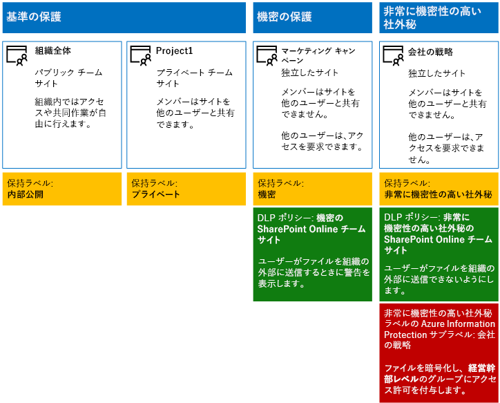

# <a name="secure-sharepoint-online-sites-in-a-devtest-environment"></a>開発/テスト環境の SharePoint Online サイトをセキュリティで保護する

 **概要:** 開発/テスト環境で、パブリック、プライベート、機密、および高機密の SharePoint Online チーム サイトを作成します。
  
この記事では、4 つの異なるタイプの SharePoint Online チーム サイトを含む開発/テスト環境を [SharePoint Online サイトとファイルをセキュリティで保護する](secure-sharepoint-online-sites-and-files.md) ソリューション用に作成する手順を順を追って説明します。
  

  
SharePoint Online チーム サイトを運用環境に展開する前に、この開発/テスト環境を使用して情報保護の動作を試し、特定の必要に応じて設定を微調整します。
  
## <a name="phase-1-create-your-devtest-environment"></a>フェーズ 1: 開発/テスト環境を作成する

このフェーズでは、架空の組織用に Office 365 と Enterprise Mobility + Security (EMS) の試用版サブスクリプションを取得します。
  
まず、「[Office 365 開発/テスト環境](https://docs.microsoft.com/office365/enterprise/office-365-dev-test-environment)」の**フェーズ 2**に記されている手順を実行します
  
次に、EMS 試用版サブスクリプションにサインアップして、Office 365 試用版サブスクリプションと同じ組織に追加します。
  
1. 必要に応じて、試用版サブスクリプション用の全体管理者アカウントの資格情報で [Microsoft 365 管理センター](https://admin.microsoft.com)にサインインします。
    
2. 左側のナビゲーションで **[請求]、[サービスを購入する]** の順にクリックします。
    
3. **[サービスを購入]** ページで、 **[Enterprise Mobility + Security E5]** 項目を探します。その項目の上にマウス ポインターを移動させ、 **[無料試用版を起動する]** をクリックします。
    
4. **[注文の確認]** ページで、 **[今すぐ実行]** をクリックします。
    
5. **[注文の受領書]** ページで、**[続行]** をクリックします。
    
次に、全体管理者アカウントの Enterprise Mobility + Security E5 ライセンスを有効にします。
  
1. ブラウザーの **[Microsoft 365 管理センター]** タブの左側のナビゲーションで **[ユーザー] > [アクティブなユーザー]** の順にクリックします。
    
2. 全体管理者アカウントをクリックしてから、 **[製品ライセンス]** で **[編集]** をクリックします。
    
3. **[製品ライセンス]** ウィンドウで、 **Enterprise Mobility + Security E5** の製品ライセンスを **[オン]** にして、 **[保存]** をクリックしてから、 **[閉じる]** を 2 回クリックします。
    
## <a name="phase-2-create-and-configure-your-azure-active-directory-ad-groups-and-users"></a>フェーズ 2: Azure Active Directory (AD) グループとユーザーを作成して構成する

このフェーズでは、架空の組織用の Azure AD のグループとユーザーを作成して構成します。
  
最初に、Azure Portal で一般的な組織のグループのセットを作成します。
  
1. ブラウザーで別のタブを作成し、Azure portal ([https://portal.azure.com](https://portal.azure.com)) に移動します。必要に応じて、Office 365 E5 の試用版サブスクリプション用の全体管理者アカウントの資格情報でサインインします。
    
2. Azure Portal で **[Azure Active Directory] > [グループ]** の順にクリックします。
    
3. **[グループ] - [すべてのグループ]** ブレードで、**[+ 新しいグループ]** をクリックします。
    
4. **[グループ]** ブレードでの手順:
    
  - **[グループの種類]** で **[Office 365]** を選択します。
    
  - **[名前]** に「**C スイート**」と入力します。
    
  - **[メンバーシップの種類]** で **[割り当て済み]** を選択します。
      
5. **[作成]** をクリックして、 **[グループ]** ブレードを閉じます。
    
6. 次のグループ名について手順 3 から 5 を繰り返します。
    
  - IT staff (IT スタッフ)
    
  - Research staff (研究スタッフ)
    
  - Regular staff (正規スタッフ)
    
  - Marketing staff (マーケティング スタッフ)
    
  - Sales staff (営業スタッフ)
    
7. ブラウザーの [Azure Portal] タブを開いたままにします。
    
次に、グループのメンバーが、Office 365 と EMS のサブスクリプションのライセンスを自動的に割り当てられるように、自動ライセンスを構成します。
  
1. Azure Portal で **[Azure Active Directory] > [ライセンス] > [すべての製品]** の順にクリックします。
    
2. 一覧で、 **[Enterprise Mobility + Security E5]** と **[Office 365 Enterprise E5]** を選択し、 **[割り当て]** をクリックします。
    
3. **[ライセンスの割り当て]** ブレードで、 **[ユーザーとグループ]** をクリックします。
    
4. グループの一覧で、以下を選択します。
    
  - C-Suite (C スイート)
    
  - IT staff (IT スタッフ)
    
  - Research staff (研究スタッフ)
    
  - Regular staff (正規スタッフ)
    
  - Marketing staff (マーケティング スタッフ)
    
  - 営業スタッフ
    
5. **[選択]** をクリックし、 **[割り当て]** をクリックします。
    
6. ブラウザーの [Azure Portal] タブを閉じます。
    
次に、[Graph 用 Azure Active Directory PowerShell モジュールに接続](https://docs.microsoft.com/office365/enterprise/powershell/connect-to-office-365-powershell#connect-with-the-azure-active-directory-powershell-for-graph-module)します。
  
組織名、場所、および共通のパスワードを入力し、PowerShell コマンド プロンプトまたは Integrated Script Environment (ISE) からこれらのコマンドを実行し、ユーザー アカウントを作成し、それぞれのグループに追加します。
  
```
$orgName="<organization name, such as contoso for the contoso.onmicrosoft.com trial subscription domain name>"
$location="<the ISO ALPHA2 country code, such as US for the United States>"
$commonPassword="<common password for all the new accounts>"

$PasswordProfile=New-Object -TypeName Microsoft.Open.AzureAD.Model.PasswordProfile
$PasswordProfile.Password=$commonPassword

$groupName="C-Suite"
$userNames=@("CEO","CFO","CIO") 
$groupID=(Get-AzureADGroup | Where { $_.DisplayName -eq $groupName }).ObjectID
ForEach ($element in $userNames){ 
New-AzureADUser -DisplayName $element -PasswordProfile $PasswordProfile -UserPrincipalName ($element + "@" + $orgName + ".onmicrosoft.com") -AccountEnabled $true -MailNickName $element -UsageLocation $location 
Add-AzureADGroupMember -RefObjectId (Get-AzureADUser | Where { $_.DisplayName -eq $element }).ObjectID -ObjectId $groupID
}
$groupName="IT staff"
$userNames=@("ITAdmin1","ITAdmin2") 
$groupID=(Get-AzureADGroup | Where { $_.DisplayName -eq $groupName }).ObjectID
ForEach ($element in $userNames){ 
New-AzureADUser -DisplayName $element -PasswordProfile $PasswordProfile -UserPrincipalName ($element + "@" + $orgName + ".onmicrosoft.com") -AccountEnabled $true -MailNickName $element -UsageLocation $location 
Add-AzureADGroupMember -RefObjectId (Get-AzureADUser | Where { $_.DisplayName -eq $element }).ObjectID -ObjectId $groupID
}
$groupName="Research staff"
$userNames=@("Researcher1") 
$groupID=(Get-AzureADGroup | Where { $_.DisplayName -eq $groupName }).ObjectID
ForEach ($element in $userNames){ 
New-AzureADUser -DisplayName $element -PasswordProfile $PasswordProfile -UserPrincipalName ($element + "@" + $orgName + ".onmicrosoft.com") -AccountEnabled $true -MailNickName $element -UsageLocation $location 
Add-AzureADGroupMember -RefObjectId (Get-AzureADUser | Where { $_.DisplayName -eq $element }).ObjectID -ObjectId $groupID
}
$groupName="Regular staff"
$userNames=@("Regular1", "Regular2") 
$groupID=(Get-AzureADGroup | Where { $_.DisplayName -eq $groupName }).ObjectID
ForEach ($element in $userNames){ 
New-AzureADUser -DisplayName $element -PasswordProfile $PasswordProfile -UserPrincipalName ($element + "@" + $orgName + ".onmicrosoft.com") -AccountEnabled $true -MailNickName $element -UsageLocation $location 
Add-AzureADGroupMember -RefObjectId (Get-AzureADUser | Where { $_.DisplayName -eq $element }).ObjectID -ObjectId $groupID
}
$groupName="Marketing staff"
$userNames=@("Marketing1", "Marketing2") 
$groupID=(Get-AzureADGroup | Where { $_.DisplayName -eq $groupName }).ObjectID
ForEach ($element in $userNames){ 
New-AzureADUser -DisplayName $element -PasswordProfile $PasswordProfile -UserPrincipalName ($element + "@" + $orgName + ".onmicrosoft.com") -AccountEnabled $true -MailNickName $element -UsageLocation $location 
Add-AzureADGroupMember -RefObjectId (Get-AzureADUser | Where { $_.DisplayName -eq $element }).ObjectID -ObjectId $groupID
}
$groupName="Sales staff"
$userNames=@("SalesPerson1") 
$groupID=(Get-AzureADGroup | Where { $_.DisplayName -eq $groupName }).ObjectID
ForEach ($element in $userNames){ 
New-AzureADUser -DisplayName $element -PasswordProfile $PasswordProfile -UserPrincipalName ($element + "@" + $orgName + ".onmicrosoft.com") -AccountEnabled $true -MailNickName $element -UsageLocation $location 
Add-AzureADGroupMember -RefObjectId (Get-AzureADUser | Where { $_.DisplayName -eq $element }).ObjectID -ObjectId $groupID
}
```

> [!NOTE]
> ここで共通のパスワードを使用することで、自動化と、開発/テスト環境の構成を容易にします。 運用環境のサブスクリプションは避けるように強くお勧めします。 
  
次の手順を使用して、グループ ベースのライセンスが正しく機能していることを確認します。
  
1. ブラウザーの **[Microsoft Office Home]** タブで、 **[管理者]** タイルをクリックします。
    
2. ブラウザーの新しい **Office 管理センター**のタブで、**[ユーザー]** をクリックします。
    
3. ユーザーの一覧で、**[CEO]** をクリックします。
    
4. **CEO** ユーザー アカウントのプロパティが一覧表示されているウィンドウで、(**[Product licenses]\(製品ライセンス\)** の) **Enterprise Mobility + Security E5** および **Office 365 Enterprise E5** のライセンスが割り当てられていることを確認します。
    
## <a name="phase-3-create-office-365-retention-labels"></a>フェーズ 3: Office 365 保持ラベルを作成する

このフェーズでは、SharePoint Online チーム サイトのドキュメント フォルダーに対してさまざまなセキュリティ レベルの保持ラベルを作成します。


1. 全体管理者アカウントで、[Microsoft 365 コンプライアンス ポータル](https://compliance.microsoft.com)にサインインします。
    
2. ブラウザーの **[ホーム - Microsoft 365 コンプライアンス]** タブで、**[分類] > [ラベル]** をクリックします。
    
3. **[保持ラベル] > [ラベルの作成]** をクリックします。
    
4. **[ラベルに名前をつける]** ウィンドウで、**[ラベルに名前をつける]** のところに「**内部パブリック**」と入力してから、**[次へ]** をクリックします。

5. **[ファイル計画記述子]** ウィンドウで **[次へ]** をクリックします。
    
6. **[ラベルの設定]** ウィンドウで、必要に応じて **[保持]** を **[オン]** にして **[次へ]** をクリックします。
    
7. **[設定の確認]** ウィンドウで、**[ラベルを作成する]** をクリックします。
    
8. 次の名前の追加ラベルについて、手順 3 から 7 を繰り返します。
    
  - プライベート
    
  - 機密
    
  - 非常に機密性の高い社外秘
  
9. **[ホーム]、[ラベル]** ウィンドウで、**[Publish labels]\(ラベルの発行\)** をクリックします。
    
10. **[発行するラベルを選択]** ウィンドウで、 **[発行するラベルを選択]** をクリックします。
    
11. **[Choose labels]\(ラベルの選択\)** ウィンドウで、**[追加]** をクリックして 4 つのラベルをすべて選択します。
    
12. [ **完了**] をクリックします。
    
13. **[発行するラベルを選択]** ウィンドウで、 **[次へ]** をクリックします。
    
14. **[場所の選択]** ウィンドウで、 **[次へ]** をクリックします。
    
15. **[ポリシーに名前をつける]** ウィンドウで、 **[名前]** に「 **サンプル組織**」と入力してから、 **[次へ]** をクリックします。
    
16. **[設定の確認]** ウィンドウで、 **[ラベルの発行]** をクリックしてから **[閉じる]** をクリックします。
    
## <a name="phase-4-create-your-sharepoint-online-team-sites"></a>フェーズ 4: SharePoint Online チーム サイトを作成する

このフェーズでは、例の組織に 4 種類の SharePoint Online チーム サイトを作成して構成します。
  
### <a name="organization-wide-team-site"></a>Organization wide チーム サイト

ベースラインのパブリック SharePoint Online チーム サイトを作成するには、次の操作を行います。
  
1. 必要な場合は、試用版サブスクリプションの全体管理者アカウントの資格情報で [Office 365 ポータル](https://portal.office.com)にサインインします。
    
2. タイルのリストで、**[SharePoint]** をクリックします。
    
3. ブラウザーの新しい **SharePoint** タブで、**[+ サイトの作成]** をクリックします。
    
4. **[サイトの作成]** ページで、**[チーム サイト]** をクリックします。
    
5. **[サイト名]** に「**組織全体**」と入力します。 
    
6. **[チーム サイトの説明]** に、「 **組織全体の SharePoint サイト**」と入力します。
    
7. **[プライバシー設定]** で、 **[パブリック - 組織の全ユーザーがこのサイトにアクセス可能]** を選択して **[次へ]** をクリックします。
    
8. **[誰を追加しますか]** ウィンドウで、 **[完了]** をクリックします。
    
次に、組織全体のチーム サイトのドキュメント フォルダーを [内部パブリック] ラベル用に構成します。
  
1. ブラウザーの **[組織全体 - ホーム]** タブで、 **[ドキュメント]** をクリックします。
    
2. [設定] アイコンをクリックしてから、 **[ライブラリの設定]** をクリックします。
    
3. **[権限と管理]** をクリックして、 **[このライブラリ内の項目にラベルを適用]** をクリックします。
    
4. **[設定 - ラベルの適用]** で **[内部パブリック]** をクリックし、 **[保存]** をクリックします。
    
### <a name="project-1-team-site"></a>プロジェクト 1 チーム サイト

組織内のプロジェクト用にベースラインのプライベート SharePoint Online チーム サイトを作成するには、次の手順を実行します。
  
1. 必要な場合は、試用版サブスクリプションの全体管理者アカウントの資格情報で [Office 365 ポータル](https://portal.office.com)にサインインします。
    
2. タイルのリストで、**[SharePoint]** をクリックします。
    
3. ブラウザーの新しい **SharePoint** タブで、**[+ サイトの作成]** をクリックします。
    
4. **[サイトの作成]** ページで、**[チーム サイト]** をクリックします。
    
5. **[サイト名]** に、「 **プロジェクト 1**」と入力します。 
    
6. **[チーム サイトの説明]** に、「 **プロジェクト 1 の SharePoint サイト**」と入力します。
    
7. **[プライバシー設定]** で、 **[プライベート - メンバーのみがこのサイトにアクセス可能**」を選択して **[次へ]** をクリックします。
    
8. **[誰を追加しますか]** ウィンドウで、 **[完了]** をクリックします。
    
次に、プライベート ラベル用に Project 1 チーム サイトのドキュメント フォルダーを構成します。
  
1. ブラウザーの **[プロジェクト 1 - ホーム]** タブで、 **[ドキュメント]** をクリックします。
    
2. [設定] アイコンをクリックしてから、 **[ライブラリの設定]** をクリックします。
    
3. **[権限と管理]** をクリックして、 **[このライブラリ内の項目にラベルを適用]** をクリックします。
    
4. **[設定 - ラベルの適用]** で **[プライベート]** をクリックし、**[保存]** をクリックします。
    
### <a name="marketing-campaigns-team-site"></a>マーケティング キャンペーン チーム サイト

マーケティング キャンペーン リソース用の機密レベルの分離した SharePoint Online チーム サイトを作成するには、次の手順を実行します。

 
1. 必要な場合は、試用版サブスクリプションの全体管理者アカウントの資格情報で [Office 365 ポータル](https://portal.office.com)にサインインします。
    
2. タイルのリストで、**[SharePoint]** をクリックします。
    
3. ブラウザーの新しい **SharePoint** タブで、**[+ サイトの作成]** をクリックします。
    
4. **[サイトの作成]** ページで、**[チーム サイト]** をクリックします。
    
5. **[Team site name]\(チーム サイト名\)** に、「**Marketing campaigns**」と入力します。
    
6. **[チーム サイトの説明]** に、「 **マーケティング キャンペーン リソースの SharePoint サイト (機密)**」と入力します。
    
7.  **[プライバシー設定]** で、 **[プライベート - メンバーのみがこのサイトにアクセス可能**」を選択して **[次へ]** をクリックします。
    
8. **[誰を追加しますか]** ウィンドウで、 **[完了]** をクリックします。
    
9. ブラウザーの新しい **[マーケティング キャンペーン]** タブのツール バーで、設定アイコンをクリックしてから、 **[サイトのアクセス許可]** をクリックします。
    
10. **[サイトの権限]** ウィンドウで、 **[高度な権限の設定]** をクリックします。
    
11. ブラウザーの新しい **[アクセス許可]** タブで、**[アクセス要求の設定]** をクリックします。
    
12. **[アクセス要求の設定]** ダイアログ ボックスで、**[サイトと個別のファイルおよびフォルダーの共有をメンバーに許可します]** および **[メンバーが、他のユーザーをサイト メンバー グループに招待することを許可します]** チェック ボックスをクリアし、**[すべてのアクセス要求を送信する]** に「**ITAdmin1@**\<組織名>**.onmicrosoft.com**」と入力し、**[OK]** をクリックします。
    
13. 一覧にある **[マーケティング キャンペーン メンバー]** をクリックします。
    
14. **[ユーザーとグループ]** ページで、 **[新規]** をクリックします。
    
15. **[共有]** ダイアログ ボックスで、「 **マーケティング スタッフ**」と入力し、それを選択してから、 **[共有]** をクリックします。
    
16. **Researcher1** ユーザー アカウントに対して手順 14 と 15 を繰り返します。
    
17. ブラウザーの戻るボタンをクリックします。
    
18. 一覧にある **[マーケティング キャンペーン所有者]** をクリックします。
    
19. **[ユーザーとグループ]** ページで、 **[新規]** をクリックします。
    
20. **[共有]** ダイアログ ボックスに「 **IT スタッフ**」と入力し、それを選択して、 **[共有]** をクリックします。
    
21. ブラウザーの戻るボタンをクリックします。
    
22. ブラウザーの **[ユーザーとグループ]** タブを閉じて、ブラウザーの **[マーケティング キャンペーン - ホーム]** タブをクリックしてから、 **[サイトのアクセス許可]** ウィンドウを閉じます。
    
権限を構成した結果を以下に示します。
  
- **Marketing campaigns - メンバー** SharePoint グループには、**Marketing campaigns** グループ (全体管理者ユーザー アカウントを含む)、**Marketing staff (マーケティング スタッフ)** グループ (Marketing1 および Marketing2 のユーザー アカウントを含む)、および **Researcher1** ユーザー アカウントのみが含まれます。
    
- **Marketing campaigns - 所有者** SharePoint グループには、**IT staff (IT スタッフ)** グループ (ITAdmin1 および ITAdmin2 のユーザー アカウントのみを含む) のみが含まれます。
    
- **Marketing campaigns - 閲覧者** SharePoint グループには、グループまたはユーザー アカウントは含まれません。
    
- メンバーは、サイト レベルのアクセス許可を変更できません (これを実行できるのは、 **[マーケティング キャンペーン - 所有者]** グループのメンバーだけです)。
    
- 他のユーザー アカウントは、サイトやそのリソースにアクセスできませんが、サイトへのアクセスを要求することができます。これにより、ITAdmin1 ユーザー アカウントのメールボックスに電子メールが送信されます。
    
次に、マーケティング キャンペーン チーム サイトのドキュメント フォルダーを [機密] ラベル用に構成します。
  
1. ブラウザーの **[マーケティング キャンペーン - ホーム]** タブで、 **[ドキュメント]** をクリックします。
    
2. [設定] アイコンをクリックしてから、 **[ライブラリの設定]** をクリックします。
    
3. **[権限と管理]** をクリックして、 **[このライブラリ内の項目にラベルを適用]** をクリックします。
    
4. **[設定 - ラベルの適用]** で **[機密]** をクリックし、 **[保存]** をクリックします。
    
次に、機密ラベルのある SharePoint Online チーム サイト上のドキュメントを共有しようとしているユーザーに通知を行うデータ損失防止 (DLP) ポリシーを構成します。このチーム サイトには、組織外部のマーケティング キャンペーン サイトが含まれます。

1. 全体管理者アカウントで、[Microsoft 365 コンプライアンス ポータル](https://compliance.microsoft.com/)にサインインします。
    
2. ブラウザーの新しい **[Microsoft 365 コンプライアンス]** タブで、**[ポリシー] > [データ損失防止]** をクリックします。
    
3. **[ホーム] > [データ損失防止]** ウィンドウで、**[ポリシーの作成]** をクリックします。
    
4. **[テンプレートを利用するか、カスタム ポリシーを作成します]** ウィンドウで、**[カスタム]** をクリックしてから **[次へ]** をクリックします。
    
5. **[ポリシーに名前をつける]** ウィンドウで、 **[名前]** に「 **機密ラベル SharePoint Online チーム サイト**」と入力してから、 **[次へ]** をクリックします。
    
6. **[場所の選択]** ウィンドウで、**[特定の場所を選択]** をクリックしてから **[次へ]** をクリックします。
    
7. 場所の一覧で、**[Exchange メール]**、**[OneDrive アカウント]**、および **[Teams のチャットとチャネルのメッセージ]** の場所を無効にして、**[次へ]** をクリックします。
    
8. **[保護するコンテンツの種類をカスタマイズする]** ウィンドウで、**[編集]** をクリックします。
    
9. **[保護するコンテンツの種類を選ぶ]** ウィンドウのドロップダウン ボックスで **[追加]** をクリックしてから、**[保持ラベル]** をクリックします。
    
10. **[保持ラベル]** ウィンドウで、**[追加]** をクリックして **[機密]** ラベルを選択し、**[追加]** をクリックしてから **[完了]** をクリックします。
    
11. **[保護するコンテンツの種類を選択する]** ウィンドウで、 **[保存]** をクリックします。
    
12. **保護するコンテンツの種類をカスタマイズする** ウィンドウで、**[次へ]** をクリックします。

13. **機密性の高い情報が検出された場合に実行する操作** ウィンドウで、**ヒントと電子メールをカスタマイズする** をクリックします。
    
14. **[ポリシー ヒントと電子メール通知をカスタマイズする]** ウィンドウで、**[ポリシー ヒント テキストをカスタマイズする]** をクリックします。
    
15. 機密性の高いファイルを保護するために Azure Information Protection を実装したかどうかに応じて、テキスト ボックスに、次のいずれかのヒントを入力するか、貼り付けます。
    
  - 組織外のユーザーと共有するには、ファイルをダウンロードしてから開きます。[ファイル]、[文書の保護]、[パスワードを使用して暗号化] の順にクリックし、強力なパスワードを指定します。別の電子メールまたはその他の通信手段でパスワードを送信します。
    
16. **[OK]** をクリックします。
    
17. **[機密性の高い情報が検出された場合に実行する操作]** ウィンドウで、**[次へ]** をクリックします。
    
18. **[ポリシーを有効にしますか、または最初にテストしますか?]** ウィンドウで、 **[すぐ有効にします]** をクリックし、 **[次へ]** をクリックします。
    
19. **[設定の確認]** ウィンドウで、**[作成]** をクリックしてから **[閉じる]** をクリックします。
  
### <a name="company-strategy-team-site"></a>会社戦略のチーム サイト

組織の最高責任者の戦略上の会社のリソース用に高機密レベルで分離した SharePoint Online チーム サイトを作成するには、次の手順を実行します。
  
1. 必要な場合は、試用版サブスクリプションの全体管理者アカウントの資格情報で [Office 365 ポータル](https://portal.office.com)にサインインします。
    
2. タイルのリストで、**[SharePoint]** をクリックします。
    
3. ブラウザーの新しい **SharePoint** タブで、**[+ サイトの作成]** をクリックします。
    
4. **[サイトの作成]** ページで、 **[チーム サイト]** をクリックします。
    
5. **[Team site name]\(チーム サイト名\)** に「**Company strategy**」と入力します。
    
6. **[チーム サイトの説明]** に、「 **会社戦略の SharePoint サイト (高機密)**」と入力します。
    
7.  **[プライバシー設定]** で、 **[プライベート - メンバーのみがこのサイトにアクセス可能**」を選択して **[次へ]** をクリックします。
    
8. **[誰を追加しますか]** ウィンドウで、 **[完了]** をクリックします。
    
9. ブラウザーの新しい **[会社戦略]** タブのツール バーで、設定アイコンをクリックしてから、 **[サイトのアクセス許可]** をクリックします。
    
10. **[サイトの権限]** ウィンドウで、 **[高度な権限の設定]** をクリックします。
    
11. ブラウザーの新しい **[アクセス許可]** タブで、 **[アクセス要求の設定]** をクリックします。
    
12. **[アクセス要求の設定]** ダイアログ ボックスの **[サイトと個別のファイルおよびフォルダーの共有をメンバーに許可します]** と **[メンバーが、他のユーザーをサイト メンバー グループに招待することを許可します]** をクリアし (これによって、3 つのチェック ボックスがすべてクリアされる)、 **[OK]** をクリックします。
    
13. 一覧にある **[会社戦略メンバー]** をクリックします。
    
14. **[ユーザーとグループ]** ページで、 **[新規]** をクリックします。
    
15. **[共有]** ダイアログ ボックスで、「 **C スイート**」と入力し、それを選択してから、 **[共有]** をクリックします。
    
16. 一覧にある **[会社戦略所有者]** をクリックします。
    
17. **[ユーザーとグループ]** ページで、 **[新規]** をクリックします。
    
18. **[共有]** ダイアログ ボックスに「 **IT スタッフ**」と入力し、それを選択して、 **[共有]** をクリックします。
    
19. ブラウザーの戻るボタンをクリックします。
    
20. ブラウザーの **[ユーザーとグループ]** タブを閉じて、ブラウザーの **[会社戦略 - ホーム]** タブをクリックしてから、 **[サイトのアクセス許可]** ウィンドウを閉じます。
    
権限を構成した結果を以下に示します。
  
- **[会社戦略 - メンバー]** SharePoint グループには、 **[C スイート]** グループ (CEO、CFO、および CIO ユーザー アカウントのみを含む) と **[会社戦略]** グループ (全体管理者ユーザー アカウントのみを含む) のみが含まれています。
    
- **[会社戦略 - 所有者]** SharePoint グループには、 **[IT スタッフ]** グループ (ITAdmin1 ユーザー アカウントと ITAdmin2 ユーザー アカウントのみを含む) のみが含まれています。
    
- **[会社戦略 - 訪問者]** SharePoint グループには、グループまたはユーザー アカウントは含まれていません。
    
- メンバーはサイト レベルのアクセス許可を変更できません (これを実行できるのは、 **[会社戦略 - 所有者]** グループのメンバーだけです)。
    
- その他のユーザー アカウントは、サイトやそのリソースにアクセスすることも、そのサイトへのアクセスを要求することもできません。サイトへの追加のアクセス許可は、全体管理者または **[会社戦略 - 所有者]** グループのメンバーが行う必要があります。
    
次に、会社戦略チーム サイトのドキュメント フォルダーを [高機密] ラベル用に構成します。
  
1. ブラウザーの **[会社戦略 - ホーム]** タブで、 **[ドキュメント]** をクリックします。
    
2. [設定] アイコンをクリックしてから、 **[ライブラリの設定]** をクリックします。
    
3. **[権限と管理]** をクリックして、 **[このライブラリ内の項目にラベルを適用]** をクリックします。
    
4. **[設定 - ラベルの適用]** で **[高機密]** をクリックし、 **[保存]** をクリックします。
    
次に、高機密ラベルのある SharePoint Online チーム サイト上のドキュメントをユーザーが共有するのをブロックする DLP ポリシーを構成します。このチーム サイトには、組織外部の会社戦略サイトが含まれます。
  
1. 全体管理者で、[Microsoft 365 コンプライアンス ポータル](https://compliance.microsoft.com/)にサインインします。
    
2. ブラウザーの新しい **[Microsoft 365 コンプライアンス]** タブで、**[ポリシー] > [データ損失防止]** をクリックします。
    
3. **[ホーム] > [データ損失防止]** ウィンドウで、**[ポリシーの作成]** をクリックします。
    
4. **[テンプレートを利用するか、カスタム ポリシーを作成します]** ウィンドウで、**[カスタム]** をクリックしてから **[次へ]** をクリックします。
    
5. **[ポリシーに名前をつける]** ウィンドウで、 **[名前]** に「 **高機密ラベル SharePoint Online チーム サイト**」と入力してから、 **[次へ]** をクリックします。
    
6. **[場所の選択]** ウィンドウで、**[特定の場所を選択]** をクリックしてから **[次へ]** をクリックします。
    
7. 場所の一覧で、**[Exchange メール]**、**[OneDrive アカウント]**、および **[Teams のチャットとチャネルのメッセージ]** の場所を無効にして、**[次へ]** をクリックします。
    
8. **[保護するコンテンツの種類をカスタマイズする]** ウィンドウで、**[編集]** をクリックします。
    
9. **[保護するコンテンツの種類を選ぶ]** ウィンドウのドロップダウン ボックスで **[追加]** をクリックしてから、**[保持ラベル]** をクリックします。
    
10. **[保持ラベル]** ウィンドウで、**[追加]** をクリックして **[高機密]** ラベルを選択し、**[追加]** をクリックしてから **[完了]** をクリックします。
    
11. **[保護するコンテンツの種類を選択する]** ウィンドウで、 **[保存]** をクリックします。
    
12. **保護するコンテンツの種類をカスタマイズする** ウィンドウで、**[次へ]** をクリックします。

13. **機密性の高い情報が検出された場合に実行する操作** ウィンドウで、**ヒントと電子メールをカスタマイズする** をクリックします。
    
14. **[ポリシー ヒントと電子メール通知をカスタマイズする]** ウィンドウで、**[ポリシー ヒント テキストをカスタマイズする]** をクリックします。
    
15. 機密性の高いファイルを保護するために Azure Information Protection を実装したかどうかに応じて、テキスト ボックスに、次のいずれかのヒントを入力するか、貼り付けます。
    
  - 組織外のユーザーと共有するには、ファイルをダウンロードしてから開きます。[ファイル]、[文書の保護]、[パスワードを使用して暗号化] の順にクリックし、強力なパスワードを指定します。別の電子メールまたはその他の通信手段でパスワードを送信します。
    
16. **[OK]** をクリックします。
    
17. **[ポリシーを有効にしますか、または最初にテストしますか?]** ウィンドウで、 **[すぐ有効にします]** をクリックし、 **[次へ]** をクリックします。

18. **[ポリシーを有効にしますか、または最初にテストしますか?]** ウィンドウで、 **[すぐ有効にします]** をクリックし、 **[次へ]** をクリックします。
    
19. **[設定の確認]** ウィンドウで、 **[作成]** をクリックしてから **[閉じる]** をクリックします。
   
    
次に、「[Microsoft 365 管理センターから Azure Rights Management をアクティブ化する方法](https://docs.microsoft.com/information-protection/deploy-use/activate-office365)」にある指示に従います。
  
次に、以下の手順に従い、保護とアクセス許可用に C-Suite グループを対象とした新しいポリシーとサブラベルを使用して、Azure Information Protection を構成します。
  
1. 必要に応じて、全体管理者アカウントを使用して、[Microsoft 365 管理センター](https://admin.microsoft.com)にサインインします。
    
2. ブラウザーで別のタブを開き、Azure portal ([https://portal.azure.com](https://portal.azure.com)) に移動します。
    
3. 初めて Azure Information Protection を構成する場合は、これらの[手順](https://docs.microsoft.com/information-protection/deploy-use/configure-policy#to-access-the-azure-information-protection-blade-for-the-first-time)を参照してください。
    
4. リスト ウィンドウで、**[すべてのサービス]** をクリックして、「**information**」と入力し、**[Azure Information Protection]** をクリックします。

5. **[ラベル]** をクリックします。
    
6. **[非常に機密性の高い社外秘]** ラベルを右クリックしてから、**[サブラベルの追加]** をクリックします。
    
7. **[名前]** と **[説明]** に「**C-Suite members**」と入力します。
    
8. **[このラベルを含むドキュメントやメールに対するアクセス許可の設定]** で、**[保護]** をクリックします。
    
9. **[保護]** セクションで **[Azure (クラウド キー)]** をクリックします。
    
10. **[保護]** ブレードで **[保護設定]** の **[+ アクセス許可の追加]** をクリックします。
    
11. **[アクセス許可を追加する]** ブレードの **[ユーザーとグループの指定]** で、 **[+ ディレクトリを参照]** をクリックします。
    
12. **[AAD ユーザーとグループ]** ウィンドウで、**[C スイート]** を選択してから、**[選択]** をクリックします。
    
13. **[事前設定またはカスタムの設定からアクセス許可を選択する]** の **[カスタム]** をクリックし、次に **[権限の表示]**、**[コンテンツの編集]**、**[保存]**、**[返信]**、**[全員へ返信]** の各チェックボックスをオンにします。
    
14. **[OK]** を 2 回クリックします。
    
15. **[サブラベル]** ブレードで **[保存]** をクリックし、次に **[OK]** をクリックします。

16. **[Azure Information Protection]** ブレードで **[ポリシー] > [+ 新しいポリシーの追加]** をクリックします。
    
17. **[ポリシー名]** に「**CompanyStrategy**」と入力し、**[説明]** に「**会社戦略チーム サイトのドキュメント**」と入力します。
    
18. **[このポリシーを取得するユーザーまたはグループを選択してください] > [ユーザー/グループ]** をクリックし、 **[C スイート]** を選択します。
    
19. **[選択] > [OK]** をクリックします。

20. **[ラベルの追加または削除]** をクリックします。**[ポリシー: ラベルの追加または削除]** ペインで **[C-Suite]** をクリックしてから、**[OK]** をクリックます。   

21. **[保存]** をクリックし、**[OK]** をクリックします。
    
Azure Information Protection とこの新しいラベルでドキュメントを保護するには、テスト マシンに [Azure Information Protection クライアントをインストール](https://docs.microsoft.com/information-protection/rms-client/install-client-app)し、管理センターから Office をインストールしてから、試用版サブスクリプションの **[C スイート]** グループのアカウントを使用して Microsoft Word からサインインする必要があります。
  
これら 4 つのサイトでドキュメントを作成し、試用版サブスクリプションでさまざまなユーザー アカウントを使用して、それらへのアクセスをテストする準備が整いました。
  
ここに 4 つの SharePoint Online チーム サイト全体の構成を示します。
  

  
## <a name="next-step"></a>次の手順

セキュリティで保護された SharePoint Online サイトの本番展開の準備が整ったら、「[SharePoint Online サイトとファイルをセキュリティで保護する](secure-sharepoint-online-sites-and-files.md)」を参照して、詳細情報と、展開を順を追って説明した記事へのリンクをご確認ください。
  
## <a name="see-also"></a>関連項目

[SharePoint Online サイトとファイルをセキュリティで保護する](secure-sharepoint-online-sites-and-files.md)
  
[クラウド導入およびハイブリッド ソリューション](https://docs.microsoft.com/office365/enterprise/cloud-adoption-and-hybrid-solutions)
  
[選挙運動、非営利組織、およびその他のアジャイル組織のための Microsoft Security ガイダンス](microsoft-security-guidance-for-political-campaigns-nonprofits-and-other-agile-o.md)


