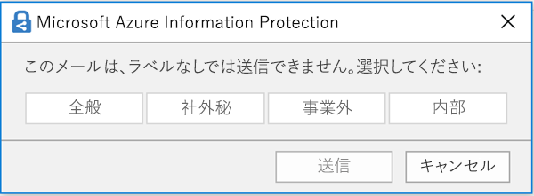

# 機密ラベルの概要

業務を達成するために、組織の従業員は、組織の内外の関係者と共同作業する必要があります。そのため、コンテンツがファイアウォールの内側にとどまることはなくなりました。コンテンツは、デバイス、アプリ、およびサービスを通じて、どこにでもローミングされます。そこで、コンテンツのローミング時には、組織のビジネス ポリシーとコンプライアンス ポリシーを満たすように、コンテンツを安全な状態で保護することが必要になります。

Office 365 の機密ラベルを使用すると、機密コンテンツの分類が可能になり、機密コンテンツの保護に役立てることができます。このラベルの使用によって、共同作業の生産性や機能性が低下することはありません。

機密ラベルは、次の目的に使用できます。
  
- **ラベルが付けられたコンテンツに、暗号化や透かしなどの保護設定を強制適用します。** たとえば、ユーザーはドキュメントや電子メールに「社外秘」ラベルを適用できます。そのラベルによって、コンテンツを暗号化して「社外秘」の透かしを適用できます。    

- **各種のプラットフォームおよびデバイスを通じて Office アプリのコンテンツを保護します。** 機密ラベルは、Windows、Mac、iOS、および Android の Office アプリで機能します。近日中には、Office Web アプリケーションについてもサポートされます。
    
- **Windows を実行するデバイスでは、機密コンテンツの組織外への流出を防止します。** これには、Microsoft Intune の Endpoint Protection を使用します。Windows デバイスに存在するコンテンツに機密ラベルが適用されていると、Endpoint Protection により、そのコンテンツがサード パーティ製アプリ (Twitter や Gmail など)、またはリムーバブル記憶域 (USB ドライブなど) にコピーされることを防止できます。

- **サード パーティ製アプリおよびサービスに機密ラベルを拡張します。** Microsoft Information Protection SDK を使用すると、Windows、Mac、および Linux 上のサード パーティ製アプリは、機密ラベルを認識して、保護設定を適用できるようになります。近日中には、iOS および Android もサポートされます。

- **保護設定を使用することなくコンテンツを分類します。** コンテンツに分類のみを (ステッカーのように) 割り当てることもできます。この分類は、コンテンツの使用時や共有時にコンテンツに永続してローミングされます。この分類を使用することで、機密コンテンツの使用レポートを生成して、アクティビティ データを確認できます。この情報に基づいて、後からいつでも保護設定を適用することができます。
    
いずれの場合も、Office 365 の機密ラベルは、そのコンテンツに相応しい措置を講じる際に役立ちます。機密ラベルを使用すると、組織全体のデータを分類して、その分類に応じた保護設定を強制適用できます。
  
機密ラベルは、Office 365 セキュリティ/コンプライアンス センターで作成します。Azure Information Protection および Office 365 全体の機密ラベルの構成は、セキュリティ/コンプライアンス センターで一元的に構成できるようになりました。こうした機密ラベルは、Azure Information Protection、Office アプリ、および Office 365 サービスで使用できます。

Azure Information Protection のお客様は、セキュリティ/コンプライアンス センターで独自の Azure Information Protection ラベルを使用できます。また、追加の構成や高度な構成を実行する場合は、そのラベルを Azure portal に同期できます。**Azure Information Protection ラベルと Office 365 機密ラベルは、相互に完全な互換性があります。** そのため、たとえば、Azure Information Protection でラベル付けしたコンテンツがある場合は、そのコンテンツの分類やラベル付けをやり直す必要はありません。

![セキュリティ/コンプライアンス センターの [ラベル] ページにある [機密] タブ](media/Sensitivity_label_tab_on_Labels_page.png)

## 機密ラベルとは

機密ラベルをドキュメントや電子メールに割り当てると、そのラベルは次の特徴を持つタグのようになります。

- **カスタマイズ可能。** さまざまな機密レベルのコンテンツに対応する組織内での分類項目 (「個人」、「公開」、「一般」、「社外秘」、「極秘」など) を作成できます。

- **クリア テキスト。** ラベルはクリア テキストになっているため、サード パーティ製アプリおよびサービスで、ラベルが付けられたコンテンツに保護アクションを適用する際に使用できます。

- **永続的。** コンテンツにラベルが適用されると、適用されたラベルは電子メールやドキュメントのメタデータに永続します。つまり、ラベルは保護設定も含めてコンテンツと共にローミングされ、ポリシーの適用と強制実施の際の基準になるということです。

Office アプリでは、機密ラベルは単に電子メールやドキュメントのタグとして表示されます。

コンテンツの各アイテムには、単一の機密ラベルを適用できます。ただし、1 つのアイテムに 1 つの機密ラベルと 1 つの[保持ラベル](labels.md)の両方が適用可能である点に注意してください。

## 機密ラベルでできること

電子メールやドキュメントに機密ラベルが適用されると、そのラベルに応じた保護設定がコンテンツに強制適用されます。機密ラベルを使用すると、次のことができます。

- 電子メールとドキュメントのどちらかまたは両方を**暗号化**します。どのユーザーまたはグループに、どれだけの期間、どのアクションを実行するためのアクセス許可を付与するかを選択できます。たとえば、組織外の特定のドメイン内のユーザーに、コンテンツにラベルを付けてから 7 日間のみコンテンツをレビューするためのアクセス許可を付与することができます。詳しくは、「[機密ラベルの暗号化を使用してコンテンツへのアクセスを制限する](encryption-sensitivity-labels.md)」をご覧ください。

- ラベルが適用された電子メールまたはドキュメントに、ユーザー設定の透かし、ヘッダー、またはフッターを追加して、**コンテンツにマークを付けます**。透かしを適用できるのはドキュメントのみで、電子メールには使用できません。透かしで使用できる文字数は、255 文字までです。また、ヘッダーとフッターに使用できる文字数は 1024 文字までとなります (Excel で使用できるのは 255 文字までとなり、ドキュメントにヘッダーやフッター、あるいは他の要因が含まれているかによって、使用できる文字数が異なります)。

    

- Intune の Endpoint Protection を有効にすることで、**データ損失を防止します**。機密コンテンツがダウンロードされたときに、Windows デバイスからのデータ損失防止に利用できます。たとえば、ラベルが付けられたコンテンツは Dropbox、Gmail、または USB ドライブにコピーできなくなります。機密ラベルで Windows 情報保護 (WIP) が使用できるようになるまでは、最初に Azure portal でアプリ保護ポリシーを作成する必要があります。詳細については、「[Windows 情報保護で機密ラベル付きのファイルを保護する方法](https://docs.microsoft.com/en-us/windows/security/information-protection/windows-information-protection/how-wip-works-with-labels?branch=vsts17546553)」を参照してください。

- **機密情報を含むコンテンツに自動的にラベルを適用します。** どのような種類の機密情報にラベルをつけるか、また、ラベルを自動でつけるか、あるいは推奨するラベルを適用するようにユーザーに確認メッセージを表示するか選択することができます。ラベルを推奨する場合、ダイアログに任意に選択したテキストを表示することができます。詳細については、「[機密ラベルを自動的にコンテンツに適用する](apply_sensitivity_label_automatically.md)」を参照してください。

    

これらすべてのオプションは、セキュリティ/コンプライアンス センターでラベルを作成した場合に利用できます。

### ラベルの優先度 (順序の問題)

セキュリティ/コンプライアンス センターで機密ラベルを作成すると、そのラベルは **[ラベル]** ページの **[機密]** タブに一覧表示されます。この一覧では、ラベルの順序が重要になります。その理由は、この順序がラベルの優先度を反映しているからです。最も制限の厳しい機密ラベル (「極秘」など) は一覧の**末尾**に表示されるようにして、制限の緩い機密ラベルは一覧の**先頭**に表示されるようにします。

ドキュメントや電子メールには、1 つの機密ラベルのみを適用できます。ラベルの分類を低く変更する場合の正当性を示すようにユーザーに要求す必要がある場合は、この一覧の順序によって、より低い分類を判断します。

### サブラベル (ラベルのグループ化)

サブラベルを使用すると、Office アプリのヘッダーでユーザーに表示される親ラベルの下に 1 つ以上のラベルをグループ化できます。 たとえば、「社外秘」について、組織では、その分類の特定の種類ごとに複数の異なるラベルを使用できます。 この例では、親ラベル「社外秘」は保護設定のない単なるテキスト ラベルであり、サブラベルが存在するラベルのため、コンテンツに適用することはできません。 その代わりに、ユーザーが「社外秘」を選択してからサブラベルを表示して、コンテンツに適用するサブラベルを選択できます。

サブラベルは、論理グループ内のユーザーにラベルを提示する簡単な方法です。 サブラベルは、その親ラベルから設定を継承することはありません。 サブラベルはコンテンツに適用できます。親ラベルは適用できません。

(また、親ラベルは Azure Information Protection 統合ラベル付けクライアントを使用する Office アプリのコンテンツには適用されないため、親ラベルを既定のラベルとして選択したり (次のセクションを参照)、親ラベルを自動適用または推奨するように構成したりしないでください。)

### 機密ラベルの編集または削除

セキュリティ/コンプライアンス センターで機密ラベルを削除しても、そのラベルがコンテンツから削除されることはなく、コンテンツに対する保護設定の強制適用が継続される点に注意してください。

セキュリティ/コンプライアンス センターで機密ラベルを編集した場合は、コンテンツに適用されていたラベルのバージョンが、そのコンテンツに強制適用される内容になります。

## ラベル ポリシーでできること

機密ラベルの作成後には、その機密ラベルを発行し、組織内のユーザーが機密ラベルを選択してコンテンツに適用できるようにする必要があります。すべての Exchange メールボックスなどの場所に発行される保持ラベルとは異なり、機密ラベルはユーザーやグループに発行されます。発行後に、機密ラベルは該当するユーザーとグループの Office アプリに表示されます。

ラベル ポリシーを使用すると、次のことができます。

- **ラベルが表示されるユーザーとグループを選択します。** ラベルは、電子メールが有効なセキュリティ グループ、配布グループ、Office 365 グループ、または動的配布グループに発行できます。

- ラベル ポリシーに含まれているユーザーとグループが作成したすべての新しいドキュメントと電子メールに**既定のラベルを適用します**。 この既定のラベルにより、すべてのコンテンツに適用する保護設定の基本レベルを設定できます。 (注意事項)

- **ラベルの変更に対する正当性を要求します。** コンテンツに「社外秘」のマークが付けられているときに、そのラベルをユーザーが削除しようとした場合や低い分類 (ラベル名「公開」など) に置き換えようとした場合は、そのアクションの実行時に、ユーザーに正当性を提示するように要求できます。こうした正当性は、管理者が確認するために利用できます。Microsoft では、現在、管理者がユーザーの正当性を確認できるレポートの開発を進めています。

    

- **メールとドキュメントにラベルを適用するようユーザーに要求します。** ユーザーのすべてのコンテンツにラベル付けする場合は、ユーザーのすべての保存ドキュメントと送信メールに必ずラベルを適用するよう要求することができます。ラベルはユーザーが手動で割り当てるか、条件の結果として自動的に割り当てるか、既存で割り当てることができます (既存のラベル オプションについては前述のとおりです)。これは、Outlook で表示されるユーザーにラベルを割り当てるように要求するダイアログです。

    > [!NOTE]
    > ラベル付けが必須な場合、Azure Information Protection サブスクリプションが必要になります。この機能を使用するには、[Azure Information Protection クライアント](https://www.microsoft.com/en-us/download/details.aspx?id=53018)または [Azure Information Protection 統合ラベル付けクライアント](https://docs.microsoft.com/ja-JP/azure/information-protection/rms-client/install-unifiedlabelingclient-app)のどちらかをダウンロードしてインストールする必要があります。Azure Information Protection クライアントが不要になるように、Office アプリのこの機能のネイティブ サポートに取り組んでいます。また、このクライアントは、Windows 上でのみ実行されるため、この機能は、Mac、iOS、Android ではまだサポートされていません。

    

- **カスタムのヘルプ ページへのヘルプ リンクを提示します。** ユーザーが機密ラベルの意味や使用方法について明確に理解できない場合に、Office アプリの機密ラベル メニューの末尾に表示される詳細な説明の URL を提供できます。

    ![リボンの [機密] ボタンに示された詳細な説明のリンク](media/Sensitivity_label_learn_more.png)

ラベル ポリシーを作成して、ユーザーおよびグループに機密ラベルを割り当てると、そのユーザーおよびグループは、1 時間以内に Office アプリで使用できるラベルを確認できるようになります。

## 始める方法

機密ラベルの使用は、簡単なプロセスで開始できます。

1. **ラベルを定義します。** まず、さまざまなレベルの機密コンテンツを定義するための分類を規定します。ユーザーが理解できるような、一般的な名前または用語を使用してください。たとえば、最初は「個人」、「公開」、「一般」、「社外秘」、「極秘」などのラベルを使用します。サブラベルを使用すると、同様のラベルをカテゴリごとにグループ化できます。また、ラベルの作成時には、ツール ヒントも必要になります。このツール ヒントは、ユーザーがリボンに示されるラベル オプションにポインターを重ねたときに Office アプリに表示されます。

1. **各ラベルで可能にすることを定義します。** 次に、各ラベルに関連付ける保護設定を定義します。たとえば、緩い機密コンテンツ (「一般」ラベル) には単にヘッダーやフッターを適用し、厳格な機密コンテンツ (「社外秘」ラベル) には透かし、暗号化、および WIP を適用します。これは、特権があるユーザーのみが機密コンテンツにアクセスできるようにするために役立ちます。
 
1. **ラベルの対象になるユーザーを定義します。** 組織のラベルを定義したら、そのラベルをラベル ポリシーで発行します。このポリシーによって、どのユーザーおよびグループにラベルを表示するかを制御します。1 つのラベルを再使用できるため、一度定義したラベルは、さまざまなユーザーに割り当てる複数のラベル ポリシーに含めることができます。ただし、コンテンツにラベルを割り当てるには、まず、そのラベルを発行して Office アプリなどのサービスで使用できるようにしておく必要があります。開始したばかりのときには、少数のユーザーに機密ラベルを割り当てて試験運用してください。

機密ラベルが機能するために、管理者、ユーザー、Office アプリが実行する内容の基本的なフローを次に示します。

## 機密ラベルを表示できる場所

機密ラベルは、Office アプリの UI に表示されます。現時点で利用可能な具体的なアプリとプラットフォームを確認するには、「**[現在、機能はどこで入手できますか?](https://support.office.com/ja-JP/article/apply-sensitivity-labels-to-your-documents-and-email-within-office-2f96e7cd-d5a4-403b-8bd7-4cc636bae0f9?ad=US&ui=en-US&rs=en-US#bkmk_whereavailable)**」を参照してください。

### Windows 上の Office アプリ

Windows を実行するデバイス上の Office アプリでは、機密ラベルはリボンの **[ホーム]** タブにある **[機密]** ボタンに表示されます。適用されているラベルは、ウィンドウの下側にあるステータス バーにも表示されます。

Windows 上の Office アプリの機密ラベルは、近日中にネイティブ サポートされます。

既に Azure Information Protection を使用しているお客様は、機密ラベルをサポートしている Azure Information Protection 統合ラベル付けクライアントを近日中に展開できるようになります。クライアントのダウンロードの詳細については「[Azure Information Protection 統合ラベル付けクライアント: バージョン リリース情報](https://docs.microsoft.com/ja-JP/azure/information-protection/rms-client/unifiedlabelingclient-version-release-history)」を参照してください。現在、Windows 上の Office アプリの機密ラベルに対するネイティブ サポートが開発中であり、今後は Azure Information Protection 統合ラベル付けクライアントは不要になります。

![Windows の Excel のリボンに示された [機密] ボタン](media/Sensitivity_label_Sensitivity_button.png)

### Mac 上の Office アプリ

Mac デバイス上の Office アプリでは、機密ラベルはリボンの **[ホーム]** タブにある **[機密]** タブに表示されます。適用されているラベルは、ウィンドウの下側にあるステータス バーにも表示されます。

![Mac 上の Office のリボンに示された [機密] ボタン](media/Sensitivity_label_on_Mac.png)

### iOS 上の Office アプリ

iOS デバイス上の Office アプリでは、機密ラベルはリボンの **[ホーム]** タブにある **[機密]** ボタンに表示されます。適用されているラベルは、ウィンドウの下側にあるステータス バーにも表示されます。

![iOS 上の Office のリボンに示された [機密] ボタン](media/Sensitivity_label_on_iOS.png)

### Android 上の Office アプリ

Android デバイス上の Office アプリでは、機密ラベルはリボンの **[ホーム]** タブにある **[機密]** タブに表示されます。適用されているラベルは、ウィンドウの下側にあるステータス バーにも表示されます。

![Android 上の Office のリボンに示された [機密] ボタン](media/Sensitivity_label_on_Android.png)

### Office アプリの機密ラベルに関する詳細情報

- [Office 内の文書やメールに機密ラベルを適用する](https://support.office.com/ja-JP/article/apply-sensitivity-labels-to-your-documents-and-email-within-office-2f96e7cd-d5a4-403b-8bd7-4cc636bae0f9)
- [Office ファイルに機密ラベルを適用した場合の既知の問題](https://support.office.com/ja-JP/article/known-issues-when-you-apply-sensitivity-labels-to-your-office-files-b169d687-2bbd-4e21-a440-7da1b2743edc)

## 機密ラベルが既存の Azure Information Protection ラベルと連動する方法

Azure Information Protection のユーザーは、現在、Azure Information Protection 統合ラベル付けクライアントを使用することで、コンテンツの分類とラベル付けを実行できます。既存の Azure Information Protection ラベルは、新しい機密ラベルとシームレスに連動します。そのため、次のことができます。

- 既存の Azure Information Protection ラベルをドキュメントと電子メールに保持する。
- 既存の Azure Information Protection ラベル構成を保持する。

Azure Information Protection ラベルを使用している場合、今のところは移行が完了するまで、セキュリティ/コンプライアンス センターで新しいラベルを作成しないようにしてください。[Azure Information Protection の移行に関するトピック](https://docs.microsoft.com/ja-JP/azure/information-protection/configure-policy-migrate-labels)には、重要な情報と補足説明が記載されています。実稼働テナントの機密ラベルへの移行準備が整っていない場合、懸念事項はありません。当分の間、ユーザーは引き続き Azure Information Protection クライアントを使用できます。また、管理者は引き続き管理に Azure portal を使用できます。

## Microsoft Intune の Endpoint Protection を使用して Windows デバイス上のコンテンツを保護する

機密ラベルの作成時には、このラベルの付いたファイルは機密であり、Windows デバイスに保存する際にはデータ漏えいに対する保護が必要であることを Windows に通知するオプションを選択できます。このオプションを使用することで、このラベルが付いたコンテンツは、エンドポイントに保存されていたとしても、許可された場所でのみ共有およびコピーを許可することが可能になります。実質的に、このオプションを機密ラベルに対して有効にすることで、このデータは追加の使用制限が必要になる非常に重要なデータであることを Windows に通知します。

このオプションを有効にすると、Windows はドキュメントの機密ラベルを読み取って、認識し、対処できるようになり、コンテンツに対して自動的に Windows 情報保護 (WIP) を適用します。そのコンテンツがマネージ Windows デバイスにどのように送られたかは関係ありません。これにより、暗号化適用の有無にかかわらず、ラベルが付けられたファイルの不用意な漏えいを防止できるようになります。

たとえば、Windows はユーザーのマシンに存在する Word 文書に「社外秘」ラベルが適用されていることを認識して、そのデバイスから業務に関係ない場所 (個人用 OneDrive、個人用電子メール アカウント、ソーシャル メディア、USB ドライブなど) にデータがコピーまたは共有されることを防止するために WIP を適用できます。

ユーザーがラベル付きのコンテンツを個人用の Gmail アカウントにアップロードしようとすると、次のメッセージが表示されます。

また、ユーザーがラベル付きのコンテンツを USB ドライブに保存しようとすると、次のメッセージが表示されます。

### 重要な前提条件

機密ラベルで WIP が使用できるようにするには、まず、「[Windows 情報保護で機密ラベル付きのファイルを保護する方法](https://docs.microsoft.com/en-us/windows/security/information-protection/windows-information-protection/how-wip-works-with-labels?branch=vsts17546553)」で説明する前提条件を満たしておく必要があります。このトピックには、次の前提条件についての説明があります。

- Windows 10 バージョン 1809 以降を実行していることを確認する。
- [Windows Defender Advanced Threat Protection (WDATP) をセットアップする。](https://docs.microsoft.com/ja-JP/windows/security/threat-protection/windows-defender-atp/get-started)これにより、ラベルについてコンテンツがスキャンされ、それに対応する WIP 保護が適用されます。ATP は、いくつかのアクション (異常の報告など) を WIP とは無関係に実行します。
- エンドポイント デバイスに適用する Windows 情報保護 (WIP) ポリシーを作成する。次のいずれかの方法で作成することができます。
    - [Microsoft Intune の Azure portal を使用して MDM で Windows 情報保護 (WIP) ポリシーを作成する](https://docs.microsoft.com/ja-JP/windows/security/information-protection/windows-information-protection/create-wip-policy-using-intune-azure)
    - [System Center Configuration Manager を使用した Windows 情報保護 (WIP) ポリシーの作成と展開](https://docs.microsoft.com/ja-JP/windows/security/information-protection/windows-information-protection/create-wip-policy-using-sccm)

## Microsoft Information Protection SDK を使用して機密ラベルをサード パーティ製アプリおよびサービスに拡張する

機密ラベルはクリア テキストとしてドキュメントのメタデータ内に存在するため、そうしたラベルを含むコンテンツの識別と保護をサード パーティ製アプリとサービスでサポートすることもできます。その他のアプリとサービスでのサポートは常に拡張中です。

[Microsoft Information Protection SDK](https://docs.microsoft.com/ja-JP/information-protection/develop/) を使用すると、サード パーティ製アプリおよびサービスで機密ラベルの読み取りおよび適用が可能になり、ドキュメントを保護できるようになります。近日中には、iOS および Android もサポートされます。

この SDK を使用することで、その他の Microsoft 情報保護アプリおよびサービス (Office アプリ、Office 365 サービス、Azure Information Protection スキャナー、Microsoft Cloud App Security などと、その他いくつかのパートナーのソリューション) での操作方法でコンテンツのラベル付けと保護が可能になります。その例として、[Adobe Acrobat での機密ラベルのサポート](https://techcommunity.microsoft.com/t5/Azure-Information-Protection/Starting-October-use-Adobe-Acrobat-Reader-for-PDFs-protected-by/ba-p/262738)について調べてください。

Microsoft Information Protection SDK の詳細については、[Tech Community ブログでのお知らせ](https://techcommunity.microsoft.com/t5/Microsoft-Information-Protection/Microsoft-Information-Protection-SDK-Now-Generally-Available/ba-p/263144)を参照してください。また、[Microsoft 情報保護に統合されているパートナー ソリューション](https://techcommunity.microsoft.com/t5/Azure-Information-Protection/Microsoft-Information-Protection-showcases-integrated-partner/ba-p/262657)についても調べてください。

## アクセス許可

機密ラベルを作成するコンプライアンス チームのメンバーには、セキュリティ/コンプライアンス センターへのアクセス許可が必要です。既定では、テナント管理者はこの場所へのアクセス許可を持っています。そのため、法令遵守責任者や他のユーザーに対し、テナント管理者のすべてのアクセス許可を付与せずに、セキュリティ/コンプライアンス センターへのアクセスを許可できます。これを行うには、セキュリティ/コンプライアンス センターの **[アクセス許可]** ページに移動して、**[コンプライアンス管理者]** 役割グループを編集し、メンバーをその役割グループに追加することをお勧めします。

詳細については、「ユーザーに Office 365 セキュリティ/コンプライアンス センターへのアクセス権を付与する」を参照してください。

ラベルとラベル ポリシーを作成して適用するときにのみ、これらのアクセス許可が必要になります。ポリシーを適用する場合に、コンテンツへのアクセスは必要ありません。
