# 機密ラベルの概要Overview of sensitivity labels

業務を達成するために、組織の従業員は、組織の内外の関係者と共同作業する必要があります。そのため、コンテンツがファイアウォールの内側にとどまることはなくなりました。コンテンツは、デバイス、アプリ、およびサービスを通じて、どこにでもローミングされます。そこで、コンテンツのローミング時には、組織のビジネス ポリシーとコンプライアンス ポリシーを満たすように、コンテンツを安全な状態で保護することが必要になります。To get their work done, people in your organization need to collaborate with others both inside and outside the organization. This means that content no longer stays behind a firewall – it roams everywhere, across devices, apps, and services. And when it roams, you want it to do so in a secure, protected way that meets your organization’s business and compliance policies.

機密ラベルを使用すると、機密コンテンツの分類が可能になり、機密コンテンツの保護に役立ちます。このラベルを使用することで、共同作業の生産性や機能性が低下することはありません。With sensitivity labels, you can classify and help protect your sensitive content, while making sure that your people’s productivity and ability to collaborate isn’t hindered.

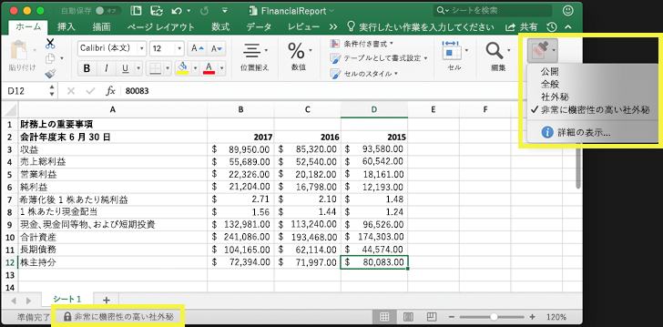

機密ラベルは、次の目的に使用できます。You can use sensitivity labels to:
  
- **ラベルが付けられたコンテンツに、暗号化や透かしなどの保護設定を強制適用します。** たとえば、ユーザーはドキュメントや電子メールに「社外秘」ラベルを適用できます。そのラベルによって、コンテンツを暗号化して「社外秘」の透かしを適用できます。**Enforce protection settings such as encryption or watermarks on labeled content.** For example, your users can apply a Confidential label to a document or email, and that label can encrypt the content and apply a Confidential watermark.    

- **各種のプラットフォームおよびデバイスを通じて Office アプリのコンテンツを保護します。** 機密ラベルは、Windows、Mac、iOS、および Android の Office アプリで機能します。近日中には、Office Web アプリケーションについてもサポートされます。**Protect content in Office apps across different platforms and devices.** Sensitivity labels work in Office apps on Windows, Mac, iOS, and Android. Support for Office web apps is coming soon.
    
- **Windows を実行するデバイスでは、機密コンテンツの組織外への流出を防止します。** これには、Microsoft Intune の Endpoint Protection を使用します。Windows デバイスに存在するコンテンツに機密ラベルが適用されていると、Endpoint Protection により、そのコンテンツがサード パーティ製アプリ (Twitter や Gmail など)、またはリムーバブル記憶域 (USB ドライブなど) にコピーされることを防止できます。**Prevent sensitive content from leaving your organization on devices running Windows**, by using endpoint protection in Microsoft Intune. After a sensitivity label has been applied to content that resides on a Windows device, endpoint protection can prevent that content from being copied to a third-party app, such as Twitter or Gmail, or being copied to removable storage, such as a USB drive.

- Microsoft Cloud App Security を使用して**サード パーティ製アプリおよびサービスのコンテンツを保護します**。**Protect content in third-party apps and services**, by using Microsoft Cloud App Security. Cloud App Security を使用すると、サード パーティ製アプリおよびサービス (SalesForce、Box、Dropbox など) のコンテンツを検出、分類、ラベル適用、および保護できます (サード パーティ製のアプリやサービスが機密ラベルを認識しない場合やサポートしない場合でも可能です)。With Cloud App Security, you can detect, classify, label, and protect content in third-party apps and services, such as SalesForce, Box, or DropBox, even if the third-party app or service does not read or support sensitivity labels.

- **サード パーティ製アプリおよびサービスに機密ラベルを拡張します。** Microsoft Information Protection SDK を使用すると、Windows、Mac、および Linux 上のサード パーティ製アプリは、機密ラベルを認識して、保護設定を適用できるようになります。近日中には、iOS および Android もサポートされます。**Extend sensitivity labels to third-party apps and services.** With the Microsoft Information Protection SDK, third-party apps on Windows, Mac, and Linux can read sensitivity labels and apply protection settings. Support for apps on iOS and Android is coming soon.

- **保護設定を使用することなくコンテンツを分類します。** コンテンツに分類のみを (ステッカーのように) 割り当てることもできます。この分類は、コンテンツの使用時や共有時にコンテンツに永続してローミングされます。この分類を使用することで、機密コンテンツの使用レポートを生成して、アクティビティ データを確認できます。この情報に基づいて、後からいつでも保護設定を適用することができます。**Classify content without using any protection settings.** You can also simply assign a classification to content (like a sticker) that persists and roams with the content as it's used and shared. You can use this classification to generate usage reports and see activity data for your sensitive content. Based on this information, you can always choose at a later time to apply protection settings.
    
いずれの場合も、Office 365 の機密ラベルは、そのコンテンツに相応しい措置を講じる際に役立ちます。機密ラベルを使用すると、組織全体のデータを分類して、その分類に応じた保護設定を強制適用できます。In all of these cases, sensitivity labels in Office 365 can help you take the right actions on the right content. With sensitivity labels, you can classify data across your organization and enforce protection settings based on that classification.
  
機密ラベルは、Microsoft 365 コンプライアンス センター、Microsoft 365 セキュリティ センター、または Office 365 セキュリティ/コンプライアンス センターで作成します。作成した機密ラベルは、Azure Information Protection、Office アプリ、および Office 365 サービスで使用できます。You create sensitivity labels in the Microsoft 365 compliance center, Microsoft 365 security center, or Office 365 Security & Compliance Center. These sensitivity labels can be used by Azure Information Protection, Office apps, and Office 365 services.

Azure Information Protection のお客様は、それ以外の管理センターで Azure Information Protection のラベルを使用できます。また、追加の構成や高度な構成を実施することで、ラベルは Azure portal と同期されるようになります。For Azure Information Protection customers, you can use your Azure Information Protection labels in the other admin centers, and your labels will be synced with the Azure portal in case you choose to perform additional or advanced configuration. **Azure Information Protection のラベルと Office 365 の機密ラベルは、相互に完全な互換性があります。****Azure Information Protection labels and Office 365 sensitivity labels are fully compatible with each other.** そのため、たとえば、Azure Information Protection でラベル付けされたコンテンツがある場合、そのコンテンツの分類やラベル付けをやり直す必要はありません。This means, for example, if you have content labeled by Azure Information Protection, you won’t need to reclassify or relabel your content.

## 機密ラベルとはWhat a sensitivity label is

機密ラベルをドキュメントや電子メールに割り当てると、そのラベルは次の特徴を持つタグのようになります。When you assign a sensitivity label to a document or email, it’s simply like a tag that is:

- **カスタマイズ可能。** さまざまな機密レベルのコンテンツに対応する組織内での分類項目 (「個人」、「公開」、「一般」、「社外秘」、「極秘」など) を作成できます。**Customizable.** You can create categories for different levels of sensitive content in your organization, such as Personal, Public, General, Confidential, and Highly Confidential.

- **クリア テキスト。** ラベルはクリア テキストになっているため、サード パーティ製アプリおよびサービスで、ラベルが付けられたコンテンツに保護アクションを適用する際に使用できます。**Clear text.** Because the label is in clear text, it’s available for third-party apps and services to apply protective actions to labeled content.

- **永続的。** コンテンツにラベルが適用されると、適用されたラベルは電子メールやドキュメントのメタデータに永続します。つまり、ラベルは保護設定も含めてコンテンツと共にローミングされ、ポリシーの適用と強制実施の際の基準になるということです。**Persistent.** After a sensitivity label is applied to content, it persists in the metadata of that email or document. This means the label roams with the content, including the protection settings, and becomes the basis for applying and enforcing policies.

Office アプリでは、機密ラベルは単に電子メールやドキュメントのタグとして表示されます。In the Office apps, a sensitivity label simply appears as a tag on an email or document.

コンテンツの各アイテムには、単一の機密ラベルを適用できます。ただし、1 つのアイテムに 1 つの機密ラベルと 1 つの[保持ラベル](labels.md)の両方が適用可能である点に注意してください。Each item of content can have a single sensitivity label applied to it. But note that an item can have both a single sensitivity label and a single [retention label](labels.md) applied to it.

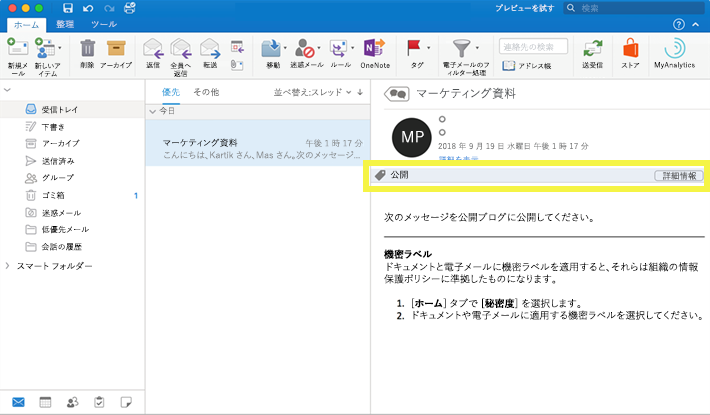

## 機密ラベルでできることWhat sensitivity labels can do

電子メールやドキュメントに機密ラベルが適用されると、そのラベルに応じた保護設定がコンテンツに強制適用されます。機密ラベルを使用すると、次のことができます。After a sensitivity label is applied to an email or document, the protection settings for that label are enforced on the content. With a sensitivity label, you can:

- 電子メールとドキュメントのどちらかまたは両方を**暗号化**します。どのユーザーまたはグループに、どれだけの期間、どのアクションを実行するためのアクセス許可を付与するかを選択できます。たとえば、組織外の特定のドメイン内のユーザーに、コンテンツにラベルを付けてから 7 日間のみコンテンツをレビューするためのアクセス許可を付与することができます。詳しくは、「[機密ラベルの暗号化を使用してコンテンツへのアクセスを制限する](encryption-sensitivity-labels.md)」をご覧ください。**Encrypt** email only or both email and documents. You can choose which users or group have permissions to perform which actions and for how long. For example, you can choose to allow users in a specific domain outside your organization to have permissions to review the content for only 7 days after the content is labeled. For more information, see [Restrict access to content by using encryption in sensitivity labels](encryption-sensitivity-labels.md).

- ラベルが適用された電子メールまたはドキュメントに、ユーザー設定の透かし、ヘッダー、またはフッターを追加して、**コンテンツにマークを付けます**。透かしを適用できるのはドキュメントのみで、電子メールには使用できません。透かしで使用できる文字数は、255 文字までです。また、ヘッダーとフッターに使用できる文字数は 1024 文字までとなります (Excel で使用できるのは 255 文字までとなり、ドキュメントにヘッダーやフッター、あるいは他の要因が含まれているかによって、使用できる文字数が異なります)。**Mark the content** by adding custom watermarks, headers, or footers to email or documents that have the label applied. Note that watermarks are applied only to documents, not email, and they're limited to 255 characters. Also, headers and footers are limited to 1024 characters (except in Excel, where they're limited to 255 characters or fewer, depending on whether the document contains other headers or footers and other factors.)

    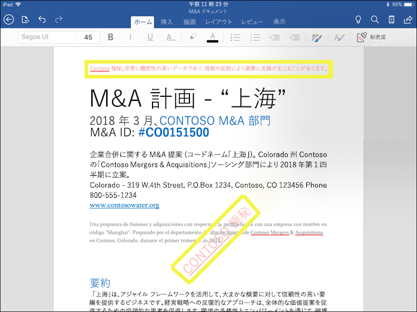

- Intune の Endpoint Protection を有効にすることで、**データ損失を防止します**。機密コンテンツがダウンロードされたときに、Windows デバイスからのデータ損失防止に利用できます。たとえば、ラベルが付けられたコンテンツは Dropbox、Gmail、または USB ドライブにコピーできなくなります。機密ラベルで Windows 情報保護 (WIP) が使用できるようになるまでは、最初に Azure portal でアプリ保護ポリシーを作成する必要があります。詳細については、「[Windows 情報保護で機密ラベル付きのファイルを保護する方法](https://docs.microsoft.com/windows/security/information-protection/windows-information-protection/how-wip-works-with-labels?branch=vsts17546553)」を参照してください。**Prevent data loss** by turning on endpoint protection in Intune. If sensitive content gets downloaded, you can help prevent the loss of data from Windows devices. For example, you can’t copy labeled content into Dropbox, Gmail, or USB drive. Before your sensitivity labels can use Windows Information Protection (WIP), you first need to create an app protection policy in the Azure portal. For more information, see [How Windows Information Protection protects files with a sensitivity label](https://docs.microsoft.com/windows/security/information-protection/windows-information-protection/how-wip-works-with-labels?branch=vsts17546553).

- **機密情報を含むコンテンツに自動的にラベルを適用します。** どのような種類の機密情報にラベルをつけるか、また、ラベルを自動でつけるか、あるいは推奨するラベルを適用するようにユーザーに確認メッセージを表示するか選択することができます。ラベルを推奨する場合、ダイアログに任意に選択したテキストを表示することができます。詳細については、「[機密ラベルを自動的にコンテンツに適用する](apply-sensitivity-label-automatically.md)」を参照してください。**Apply the label automatically to content that contains sensitive information.** You can choose what types of sensitive information that you want labeled, and the label can either be applied automatically, or you can prompt users to apply the label that you recommend. If you recommend a label, the prompt displays whatever text you choose. For more information, see [Apply a sensitivity label to content automatically](apply-sensitivity-label-automatically.md).

    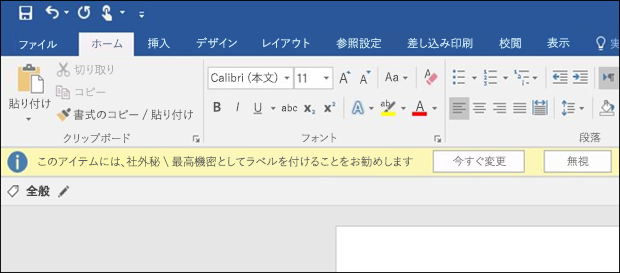

これらすべてのオプションは、機密ラベルを作成したときに使用できるようになります。All of these options are available when you create a sensitivity label.

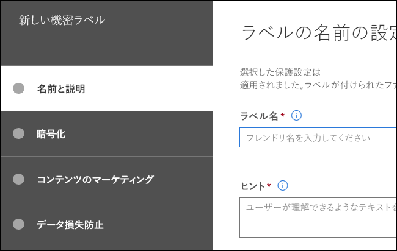

### ラベルの優先度 (順序の問題)Label priority (order matters)

機密ラベルを作成すると、そのラベルは **[ラベル]** ページの **[秘密度]** タブにあるリストに表示されます。When you create your sensitivity labels, they appear in a list on the **Sensitivity** tab on the **Labels** page. このリストでは、ラベルの順序が重要になります。その理由は、この順序がラベルの優先度を反映しているためです。In this list, the order of the labels is important because it reflects their priority. 最も厳密な機密ラベル (「極秘」など) はリストの**下側**に表示されるようにして、最も厳密でない機密ラベル (「公開」など) はリストの**上側**に表示されるようにします。You want your most restrictive sensitivity label, such as Highly Confidential, to appear at the **bottom** of the list, and your least restrictive sensitivity label, such as Public, to appear at the **top**.

ドキュメントや電子メールには、1 つの機密ラベルのみを適用できます。ラベルの分類を低く変更する場合の正当性を示すようにユーザーに要求す必要がある場合は、この一覧の順序によって、より低い分類を判断します。A document or email can have only a single sensitivity label applied to it. If you require your users to provide a justification for changing the label to a lower classification, the order of this list determines what's a lower classification.

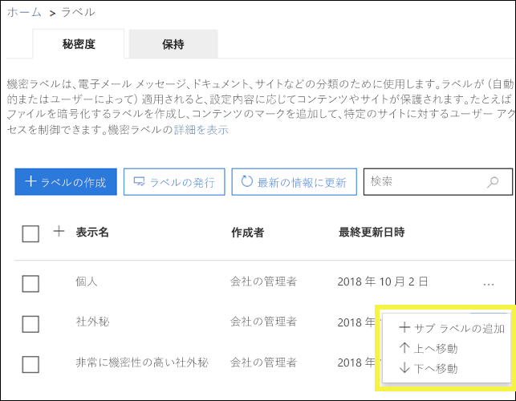

ラベルの優先度に加えて、ラベル ポリシーの順序も重要です。「[ラベル ポリシーの優先度 (順序の重要性)](#label-policy-priority-order-matters)」を参照してください。Note that in addition to label priority, the order of the label policies also matters - see [Label policy priority (order matters)](#label-policy-priority-order-matters).

### サブラベル (ラベルのグループ化)Sublabels (grouping labels)

サブラベルを使用すると、Office アプリのヘッダーでユーザーに表示される親ラベルの下に 1 つ以上のラベルをグループ化できます。With sublabels, you can group one or more labels below a parent label that a user sees in an Office app. たとえば、「社外秘」について、組織では、その分類の特定の種類ごとに複数の異なるラベルを使用できます。For example, under Confidential, your organization might use several different labels for specific types of that classification. この例では、親ラベル「社外秘」は保護設定のない単なるテキスト ラベルであり、サブラベルが存在するラベルのため、コンテンツに適用することはできません。In this example, the parent label Confidential is simply a text label with no protection settings, and because it has sublabels, it can’t be applied to content. その代わりに、ユーザーが「社外秘」を選択してからサブラベルを表示して、コンテンツに適用するサブラベルを選択できます。Instead, users must choose Confidential to view the sublabels, and then they can choose a sublabel to apply to content.

サブラベルは、論理グループ内のユーザーにラベルを提示する簡単な方法です。Sublabels are simply a way to present labels to users in logical groups. サブラベルは、その親ラベルから設定を継承することはありません。Sublabels don’t inherit any settings from their parent label. サブラベルはコンテンツに適用できます。親ラベルは適用できません。Sublabels can be applied to content; parent labels cannot.

(また、親ラベルは Azure Information Protection 統合ラベル付けクライアントを使用する Office アプリのコンテンツには適用されないため、親ラベルを既定のラベルとして選択したり (次のセクションを参照)、親ラベルを自動適用または推奨するように構成したりしないでください。)(Also, you should not choose a parent label as the default label (see next section), or configure a parent label to be auto-applied or recommended, because the parent label won't be applied to content in Office apps that use the Azure Information Protection unified labeling client.)

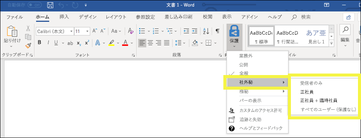

### 機密ラベルの編集または削除Editing or deleting a sensitivity label

機密ラベルを削除しても、そのラベルがコンテンツから削除されることはなく、コンテンツに対する保護設定の強制適用が継続される点に注意してください。If you delete a sensitivity label, note that the label is not removed from content, and any protection settings continue to be enforced on the content.

機密ラベルを編集した場合は、コンテンツに適用されていたラベルのバージョンが、そのコンテンツに強制適用される内容になります。If you edit a sensitivity label, the version of the label that was applied to content is what’s enforced on that content.

## ラベル ポリシーでできることWhat label policies can do

機密ラベルの作成後には、その機密ラベルを発行し、組織内のユーザーが機密ラベルを選択してコンテンツに適用できるようにする必要があります。すべての Exchange メールボックスなどの場所に発行される保持ラベルとは異なり、機密ラベルはユーザーやグループに発行されます。発行後に、機密ラベルは該当するユーザーとグループの Office アプリに表示されます。After you create your sensitivity labels, you need to publish them, to make them available to people in your organization, who can then apply the labels to content. Unlike retention labels, which are published to locations, such as all Exchange mailboxes, sensitivity labels are published to users or groups. Sensitivity labels then appear in Office apps for those users and groups.

ラベル ポリシーを使用すると、次のことができます。With a label policy, you can:

- **ラベルが表示されるユーザーとグループを選択します。** ラベルは、電子メールが有効なセキュリティ グループ、配布グループ、Office 365 グループ、または動的配布グループに発行できます。**Choose which users and groups see the labels.** Labels can be published to any email-enabled security group, distribution group, Office 365 group, or dynamic distribution group.

- ラベル ポリシーに含まれているユーザーとグループが作成したすべての新しいドキュメントと電子メールに**既定のラベルを適用します**。この既定のラベルにより、すべてのコンテンツに適用する保護設定の基本レベルを設定できます。**Apply a default label** to all new documents and email created by the users and groups included in the label policy. This default label can set a base level of protection settings that you want applied to all your content.

- **ラベルの変更に対する正当性を要求します。** コンテンツに「社外秘」のマークが付けられているときに、そのラベルをユーザーが削除しようとした場合や低い分類 (ラベル名「公開」など) に置き換えようとした場合は、そのアクションの実行時に、ユーザーに正当性を提示するように要求できます。こうした正当性は、管理者が確認するために利用できます。Microsoft では、現在、管理者がユーザーの正当性を確認できるレポートの開発を進めています。**Require a justification for changing a label.** If content is marked Confidential and a user wants to remove that label or replace it with a lower classification, such as a label named Public, you can require that the user provide a justification when performing this action. These justifications will be available for the admin to review. We’re currently working on a report where admins can view the user justifications.

    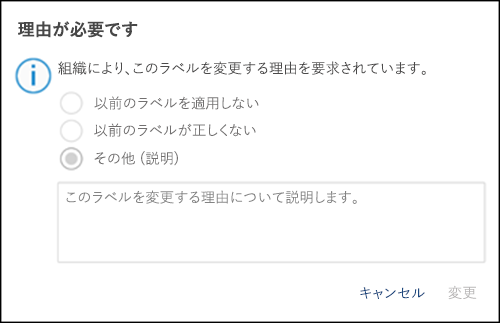

- **メールとドキュメントにラベルを適用するようユーザーに要求します。** ユーザーのすべてのコンテンツにラベル付けする場合は、ユーザーのすべての保存ドキュメントと送信メールに必ずラベルを適用するよう要求することができます。ラベルはユーザーが手動で割り当てるか、条件の結果として自動的に割り当てるか、既存で割り当てることができます (既存のラベル オプションについては前述のとおりです)。これは、Outlook で表示されるユーザーにラベルを割り当てるように要求するダイアログです。**Require users to apply a label to their email and documents.** If you want all of a user's content to be labeled, you can require that a label must be applied to all of their saved documents and sent emails. The label can be assigned manually by the user, automatically as a result of a condition, or be assigned by default (the default label option described above). Here's the prompt shown in Outlook when a user is required to assign a label.

    > [!NOTE]
    > ラベル付けが必須な場合、Azure Information Protection サブスクリプションが必要になります。この機能を使用するには、[Azure Information Protection クライアント](https://www.microsoft.com/download/details.aspx?id=53018)または [Azure Information Protection 統合ラベル付けクライアント](https://docs.microsoft.com/azure/information-protection/rms-client/install-unifiedlabelingclient-app)のどちらかをダウンロードしてインストールする必要があります。Azure Information Protection クライアントが不要になるように、Office アプリのこの機能のネイティブ サポートに取り組んでいます。また、このクライアントは、Windows 上でのみ実行されるため、この機能は、Mac、iOS、Android ではまだサポートされていません。Mandatory labeling requires an Azure Information Protection subscription. To use this feature, you must download and install either the [Azure Information Protection client](https://www.microsoft.com/download/details.aspx?id=53018) or the later [Azure Information Protection unified labeling client](https://docs.microsoft.com/azure/information-protection/rms-client/install-unifiedlabelingclient-app). We're working on native support for this feature in Office apps, so that it won't require the Azure Information Protection client. Also, the client runs only on Windows, so this feature is not yet supported on Mac, iOS, and Android.

    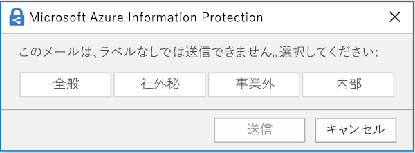

- **カスタムのヘルプ ページへのヘルプ リンクを提示します。** ユーザーが機密ラベルの意味や使用方法について明確に理解できない場合に、Office アプリの機密ラベル メニューの末尾に表示される詳細な説明の URL を提供できます。**Provide help link to a custom help page.** If your users aren’t sure what your sensitivity labels mean or how they should be used, you can provide a Learn More URL that appears at the bottom of the Sensitivity label menu in the Office apps.

    ![リボンの [機密] ボタンに示された詳細な説明のリンク](media/Sensitivity-label-learn-more.png)

ラベル ポリシーを作成して、ユーザーおよびグループに機密ラベルを割り当てると、そのユーザーおよびグループは、1 時間以内に Office アプリで使用できるラベルを確認できるようになります。After you create a label policy and assign sensitivity labels to users and groups, those people will see those labels available in the Office apps in an hour or less.

### ラベルのポリシー 優先度 (順序の問題)Label priority (order matters)

[**ラベル ポリシー**] ページの [**機密ポリシー**] タブのリストに表示される機密ラベル ポリシーで機密ラベルを発行して、ユーザーが利用できるようにします。You make your sensitivity labels available to users by publishing them in a sensitivity label policy, which appears in a list on the **Sensitivity policies** tab on the **Label policies** page. 機密ラベルと同じように (上記の「[ラベルの優先度 (順序の重要性)](#label-priority-order-matters)」セクションを参照)、機密ラベル ポリシーの順序は、優先度を反映しているため重要です。Just like sensitivity labels (see the above section [Label priority (order matters)](#label-priority-order-matters)), the order of the sensitivity label policies is important because it reflects their priority. 優先度が最も低いラベル ポリシーは**一番上**に表示され、優先度が最も高いラベル ポリシーは**一番下**に表示されます。The label policy with lowest priority is shown at the **top**, and label policy with the highest priority is shown at the **bottom**.

ラベル ポリシーは次のように構成されます。A label policy consists of:

- 一連のラベル。A set of modules.
- ラベル ポリシーの範囲 (ポリシーに含まれるユーザーとグループ)。The scope of the label policy, meaning the users and groups included in the policy.
- 上記のラベル ポリシーの設定 (既定のラベル、妥当性、必須ラベル、ヘルプのリンク)。The settings of the label policy described above (default label, justification, mandatory label, and help link).

ユーザーは複数のラベル ポリシーに含めることができ、その場合、複数のポリシーのすべての機密ラベルがユーザーに表示されます。You can include a user in multiple label policies, and the user will see all of the sensitivity labels from those policies. ただし、ユーザーに表示されるポリシー設定は、最も優先度の高いラベル ポリシーのもののみです。However, a user will see the policy settings from only the label policy with the highest priority.

既定のラベルや必須のラベルなど、組織内のユーザーまたはグループに意図したラベル ポリシーのオプションが表示されない場合、機密ラベル ポリシーの順序を確認してください。If a user or group in your organization is not seeing an option in the label policy that you intended, such as a default or mandatory label, check the order of the sensitivity label policies. ラベル ポリシーを並べ替えるには、機密ラベル ポリシーを選択し、右側にある省略記号を選択して**下へ移動**または**上へ移動**します。To re-order the label policies, select a sensitivity label policy > choose the ellipsis on the right > **Move down** or **Move up**.

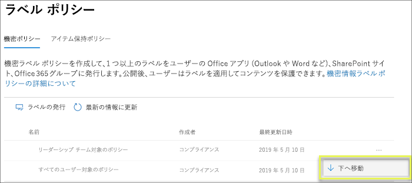

優先度は機密ラベル ポリシーには重要ですが、保持ラベル ポリシーには**重要ではありません**。Note that while priority matters for sensitivity label policies, it does **not** matter for retention label policies. 「[保持するための原則、または優先順位](labels.md#the-principles-of-retention-or-what-takes-precedence)」で説明したように、コンテンツは複数の保持ポリシーの対象となる可能性があります。As explained in [The principles of retention, or what takes precedence?](labels.md#the-principles-of-retention-or-what-takes-precedence), content can be subject to multiple retention policies.

## 始める方法How to get started

機密ラベルの使用は、簡単なプロセスで開始できます。Getting started with sensitivity labels is a quick process:

1. **ラベルを定義します。** まず、さまざまなレベルの機密コンテンツを定義するための分類を規定します。ユーザーが理解できるような、一般的な名前または用語を使用してください。たとえば、最初は「個人」、「公開」、「一般」、「社外秘」、「極秘」などのラベルを使用します。サブラベルを使用すると、同様のラベルをカテゴリごとにグループ化できます。また、ラベルの作成時には、ツール ヒントも必要になります。このツール ヒントは、ユーザーがリボンに示されるラベル オプションにポインターを重ねたときに Office アプリに表示されます。**Define the labels.** First, you want to establish your taxonomy for defining different levels of sensitive content. You should use common names or terms that make sense to your users. For example, you can start with labels such as Personal, Public, General, Confidential, and Highly Confidential. You can use sublabels to group similar labels by category. Also, when you create a label, a tool tip is required, which appears in the Office apps when a user hovers over a label option on the Ribbon.

1. **各ラベルで可能にすることを定義します。** 次に、各ラベルに関連付ける保護設定を定義します。たとえば、緩い機密コンテンツ (「一般」ラベル) には単にヘッダーやフッターを適用し、厳格な機密コンテンツ (「社外秘」ラベル) には透かし、暗号化、および WIP を適用します。これは、特権があるユーザーのみが機密コンテンツにアクセスできるようにするために役立ちます。**Define what each label can do.** Then, configure the protection settings you want associated with each label. For example, lower sensitivity content (a “General” label) might simply have a header or footer applied to it, while higher sensitivity content (a “Confidential” label) may have a watermark, encryption, and WIP applied to it, to help ensure that only privileged users can access it.
 
1. **ラベルの対象になるユーザーを定義します。** 組織のラベルを定義したら、そのラベルをラベル ポリシーで発行します。このポリシーによって、どのユーザーおよびグループにラベルを表示するかを制御します。1 つのラベルを再使用できるため、一度定義したラベルは、さまざまなユーザーに割り当てる複数のラベル ポリシーに含めることができます。ただし、コンテンツにラベルを割り当てるには、まず、そのラベルを発行して Office アプリなどのサービスで使用できるようにしておく必要があります。開始したばかりのときには、少数のユーザーに機密ラベルを割り当てて試験運用してください。**Define who gets the labels.** After you define your organization’s labels, you publish them in a label policy that controls which users and groups see those labels. A single label is reusable – you define it once, and then you can include it in several label policies assigned to different users. But in order for a label to be assigned to content, you must first publish that label so that it’s available in Office apps and other services. When just starting out, you can pilot your sensitivity labels by assigning them to just a few people.

機密ラベルが機能するために、管理者、ユーザー、Office アプリが実行する内容の基本的なフローを次に示します。Here’s the basic flow of what the admin, user, and Office app do to make sensitivity labels work.

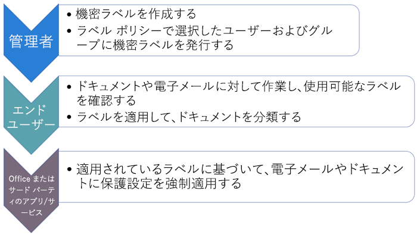

## 機密ラベルを表示できる場所Where sensitivity labels can appear

機密ラベルは、Office アプリの UI に表示されます。現時点で利用可能な具体的なアプリとプラットフォームを確認するには、「**[現在、機能はどこで入手できますか?](https://support.office.com/article/apply-sensitivity-labels-to-your-documents-and-email-within-office-2f96e7cd-d5a4-403b-8bd7-4cc636bae0f9?ad=US&ui=en-US&rs=en-US#bkmk_whereavailable)**」を参照してください。Sensitivity labels appear in the UI of Office apps. To view the current availability for specific apps and platforms, see **[Where is the feature available today?](https://support.office.com/article/apply-sensitivity-labels-to-your-documents-and-email-within-office-2f96e7cd-d5a4-403b-8bd7-4cc636bae0f9?ad=US&ui=en-US&rs=en-US#bkmk_whereavailable)**

### Windows 上の Office アプリOffice apps on Windows

Windows を実行するデバイス上の Office アプリでは、機密ラベルはリボンの **[ホーム]** タブにある **[機密]** ボタンに表示されます。適用されているラベルは、ウィンドウの下側にあるステータス バーにも表示されます。In Office apps on devices running Windows, sensitivity labels appear on the **Sensitivity** button, on the **Home** tab on the Ribbon. The label applied also appears in the Status bar at the bottom of the window.

Windows 上の Office アプリの機密ラベルは、近日中にネイティブ サポートされます。Coming soon is native support for sensitivity labels in Office apps on Windows.

既に Azure Information Protection を使用しているお客様は、機密ラベルをサポートしている Azure Information Protection 統合ラベル付けクライアントを近日中に展開できるようになります。クライアントのダウンロードの詳細については「[Azure Information Protection 統合ラベル付けクライアント: バージョン リリース情報](https://docs.microsoft.com/azure/information-protection/rms-client/unifiedlabelingclient-version-release-history)」を参照してください。現在、Windows 上の Office アプリの機密ラベルに対するネイティブ サポートが開発中であり、今後は Azure Information Protection 統合ラベル付けクライアントは不要になります。If you're an existing Azure Information Protection customer, you can deploy the Azure Information Protection unified labeling client, which supports sensitivity labels. For more information about downloading the client, see [Azure Information Protection unified labeling client: Version release information](https://docs.microsoft.com/azure/information-protection/rms-client/unifiedlabelingclient-version-release-history). We’re currently working on native support for sensitivity labels in Office apps on Windows, so that the Azure Information Protection unified labeling client will no longer be required.

![Windows の Excel のリボンに示された [機密] ボタン](media/Sensitivity-label-Sensitivity-button.png)

### Mac 上の Office アプリOffice apps on Mac

Mac デバイス上の Office アプリでは、機密ラベルはリボンの **[ホーム]** タブにある **[機密]** タブに表示されます。適用されているラベルは、ウィンドウの下側にあるステータス バーにも表示されます。In Office apps on Mac devices, sensitivity labels appear on the **Sensitivity** button, on the **Home** tab on the Ribbon. The label applied also appears in the Status bar at the bottom of the window.

![Mac 上の Office のリボンに示された [機密] ボタン](media/Sensitivity-label-on-Mac.png)

### iOS 上の Office アプリOffice apps on iOS

iOS デバイス上の Office アプリでは、機密ラベルはリボンの **[ホーム]** タブにある **[機密]** ボタンに表示されます。適用されているラベルは、ウィンドウの下側にあるステータス バーにも表示されます。In Office apps on iOS devices, sensitivity labels appear on the **Sensitivity** button, on the **Home** tab on the Ribbon. The label applied also appears in the Status bar at the bottom of the window.

![iOS 上の Office のリボンに示された [機密] ボタン](media/Sensitivity-label-on-iOS.png)

### Android 上の Office アプリOffice apps on Android

Android デバイス上の Office アプリでは、機密ラベルはリボンの **[ホーム]** タブにある **[機密]** タブに表示されます。適用されているラベルは、ウィンドウの下側にあるステータス バーにも表示されます。In Office apps on Android devices, sensitivity labels appear on the **Sensitivity** button, on the **Home** tab on the Ribbon. The label applied also appears in the Status bar at the bottom of the window.

![Android 上の Office のリボンに示された [機密] ボタン](media/Sensitivity-label-on-Android.png)

### Office アプリの機密ラベルに関する詳細情報More information on sensitivity labels in Office apps

- [Office 内の文書やメールに機密ラベルを適用するApply sensitivity labels to your documents and email within Office](https://support.office.com/article/apply-sensitivity-labels-to-your-documents-and-email-within-office-2f96e7cd-d5a4-403b-8bd7-4cc636bae0f9)
- [Office ファイルに機密ラベルを適用した場合の既知の問題Known issues when you apply sensitivity labels to your Office files](https://support.office.com/article/known-issues-when-you-apply-sensitivity-labels-to-your-office-files-b169d687-2bbd-4e21-a440-7da1b2743edc)

## 機密ラベルが既存の Azure Information Protection ラベルと連動する方法How sensitivity labels work with existing Azure Information Protection labels

Azure Information Protection のユーザーは、現在、Azure Information Protection 統合ラベル付けクライアントを使用することで、コンテンツの分類とラベル付けを実行できます。既存の Azure Information Protection ラベルは、新しい機密ラベルとシームレスに連動します。そのため、次のことができます。Azure Information Protection users are currently able to classify and label content on Windows by using the Azure Information Protection unified labeling client. Existing Azure Information Protection labels work seamlessly with new sensitivity labels. This means you can:

- 既存の Azure Information Protection ラベルをドキュメントと電子メールに保持する。Keep your existing Azure Information Protection labels on documents and email.
- 既存の Azure Information Protection ラベル構成を保持する。Keep your existing Azure Information Protection label configuration.

Azure Information Protection のラベルを使用している場合、現時点では、移行が完了するまで別の管理センターで新しいラベルを作成することは避けてください。If you are using Azure Information Protection labels, for now we recommend that you avoid creating new labels in other admin centers until after you’ve completed your migration. [Azure Information Protection の移行に関するトピック](https://docs.microsoft.com/azure/information-protection/configure-policy-migrate-labels)には、重要な情報と、いくつかの注意事項が記載されています。The [Azure Information Protection migration topic](https://docs.microsoft.com/azure/information-protection/configure-policy-migrate-labels) has important information and some specific caveats. 実稼働テナントを機密ラベルに移行する準備がまだ整っていないとしても、心配する必要はありません。今のところは、これまでどおりに、ユーザーが Azure Information Protection クライアントを使用することも、管理者が管理のために Azure portal ポータルを使用することもできます。If you are not yet ready to migrate your production tenants to sensitivity labels, there is no cause for concern: for the moment, your users can continue using the Azure Information Protection client, and admins can continue using the Azure portal for management.

## Microsoft Intune の Endpoint Protection を使用して Windows デバイス上のコンテンツを保護するProtect content on Windows devices by using endpoint protection in Microsoft Intune

機密ラベルの作成時には、このラベルの付いたファイルは機密であり、Windows デバイスに保存する際にはデータ漏えいに対する保護が必要であることを Windows に通知するオプションを選択できます。このオプションを使用することで、このラベルが付いたコンテンツは、エンドポイントに保存されていたとしても、許可された場所でのみ共有およびコピーを許可することが可能になります。実質的に、このオプションを機密ラベルに対して有効にすることで、このデータは追加の使用制限が必要になる非常に重要なデータであることを Windows に通知します。When you create a sensitivity label, you have the option to tell Windows that files with this label are sensitive and need to be protected against data leakage when stored on Windows devices. This option can help ensure that content with this label can be shared or copied only to sanctioned locations, even when it’s stored on an endpoint. In essence, turning on this option for a sensitivity label tells Windows that this is extra critical data that warrants additional usage constraints.

このオプションを有効にすると、Windows はドキュメントの機密ラベルを読み取って、認識し、対処できるようになり、コンテンツに対して自動的に Windows 情報保護 (WIP) を適用します。そのコンテンツがマネージ Windows デバイスにどのように送られたかは関係ありません。これにより、暗号化適用の有無にかかわらず、ラベルが付けられたファイルの不用意な漏えいを防止できるようになります。When you turn on this option, Windows can read, understand, and act on sensitivity labels in documents and automatically apply Windows Information Protection (WIP) on content, no matter how it reaches a managed Windows device. This helps protect labeled files from accidental leakage, with or without applying encryption.

たとえば、Windows はユーザーのマシンに存在する Word 文書に「社外秘」ラベルが適用されていることを認識して、そのデバイスから業務に関係ない場所 (個人用 OneDrive、個人用電子メール アカウント、ソーシャル メディア、USB ドライブなど) にデータがコピーまたは共有されることを防止するために WIP を適用できます。For example, Windows can understand that a Word document residing on a user’s machine has a Confidential label applied to it, and WIP can apply an app protection policy to prevent the copying or sharing of the data to any non-work location from that device (such as a personal OneDrive, personal email accounts, social media, or USB drives).

ユーザーがラベル付きのコンテンツを個人用の Gmail アカウントにアップロードしようとすると、次のメッセージが表示されます。If a user attempts to upload labeled content to a personal Gmail account, they see this message.

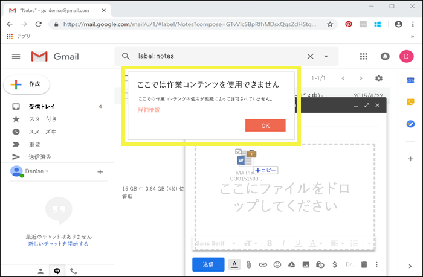

また、ユーザーがラベル付きのコンテンツを USB ドライブに保存しようとすると、次のメッセージが表示されます。And if a user attempts to save labeled content to a USB drive, they see this message.

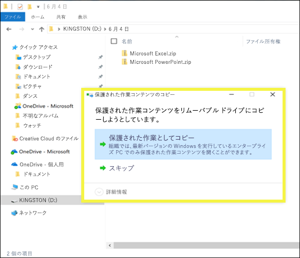

### 重要な前提条件Important prerequisites

機密ラベルで WIP が使用できるようにするには、まず、「[Windows 情報保護で機密ラベル付きのファイルを保護する方法](https://docs.microsoft.com/windows/security/information-protection/windows-information-protection/how-wip-works-with-labels?branch=vsts17546553)」で説明する前提条件を満たしておく必要があります。このトピックには、次の前提条件についての説明があります。Before your sensitivity labels can use WIP, you first need to do the prerequisites described here: [How Windows Information Protection protects files with a sensitivity label](https://docs.microsoft.com/windows/security/information-protection/windows-information-protection/how-wip-works-with-labels?branch=vsts17546553). This topic describes the following prerequisites:

- Windows 10 バージョン 1809 以降を実行していることを確認する。Make sure you're running Windows 10, version 1809 or later.
- 「[Microsoft Defender Advanced Threat Protection (Microsoft Defender ATP) のセットアップ](https://docs.microsoft.com/windows/security/threat-protection/microsoft-defender-atp/get-started)」では、ラベルのコンテンツをスキャンして、対応する WIP 保護を適用します。[Set up Windows Defender Advanced Threat Protection (WDATP)](https://docs.microsoft.com/windows/security/threat-protection/microsoft-defender-atp/get-started), which scans content for a label and applies the corresponding WIP protection. ATP performs some actions independently from WIP, such as reporting anomalies. ATP では、異常の報告など、WIP と独立した複数の操作が実行されます。ATP performs some actions independently from WIP, such as reporting anomalies.
- エンドポイント デバイスに適用する Windows 情報保護 (WIP) ポリシーを作成する。次のいずれかの方法で作成することができます。Create a Windows Information Protection (WIP) policy that applies to endpoint devices. You can do this in either of these locations:
    - [Microsoft Intune の Azure portal を使用して MDM で Windows 情報保護 (WIP) ポリシーを作成するCreate a Windows Information Protection (WIP) policy with MDM using the Azure portal for Microsoft Intune](https://docs.microsoft.com/windows/security/information-protection/windows-information-protection/create-wip-policy-using-intune-azure)
    - [System Center Configuration Manager を使用した Windows 情報保護 (WIP) ポリシーの作成と展開Create and deploy a Windows Information Protection (WIP) policy using System Center Configuration Manager](https://docs.microsoft.com/windows/security/information-protection/windows-information-protection/create-wip-policy-using-sccm)

## Microsoft Cloud App Security を使用してサード パーティ製アプリおよびサービスのコンテンツを保護するProtect content in third-party apps and services by using Microsoft Cloud App Security

Cloud App Security (CAS) を使用してサード パーティ製アプリおよびサービスのコンテンツを保護します。Protect content in third-party apps and services by using Cloud App Security (CAS). Cloud App Security を使用すると、サード パーティ製サービスおよびアプリ (SalesForce、Box、Dropbox など) のコンテンツを検出、分類、ラベル適用、および保護できます。With CAS, you can detect, classify, label, and protect content in third-party services and apps, such as SalesForce, Box, or Dropbox. たとえば、Dropbox で機密ラベルを認識できい場合でも、CAS はその場所にあるラベル付きコンテンツにアクセスして保護することができます。For example, Dropbox might not understand a sensitivity label, but CAS can reach out and protect labeled content in that location.

詳細については、「[Azure Information Protection 分類ラベルを自動的に適用する](https://docs.microsoft.com/cloud-app-security/use-case-information-protection)」を参照してください。For more information, see [Automatically apply Azure Information Protection classification labels](https://docs.microsoft.com/cloud-app-security/use-case-information-protection).

### 重要な前提条件Important prerequisites

機密ラベルで CAS を使用できるようにするには、まず、「[Azure Information Protection 分類ラベルを自動的に適用する](https://docs.microsoft.com/cloud-app-security/use-case-information-protection)」で説明する前提条件を満たしておく必要があります。Before your sensitivity labels can use CAS, you first need to do the prerequisites described here: [Automatically apply Azure Information Protection classification labels](https://docs.microsoft.com/cloud-app-security/use-case-information-protection). このトピックには、次の前提条件についての説明があります。This topic describes the following prerequisites:

- テナントに対する [Cloud App Security と Azure Information Protection を有効にする](https://docs.microsoft.com/cloud-app-security/azip-integration)。[Enable Cloud App Security and Azure Information Protection](https://docs.microsoft.com/cloud-app-security/azip-integration) for your tenant.
- Cloud App Security に[アプリを接続する](https://docs.microsoft.com/cloud-app-security/enable-instant-visibility-protection-and-governance-actions-for-your-apps)。[Connect the app](https://docs.microsoft.com/cloud-app-security/enable-instant-visibility-protection-and-governance-actions-for-your-apps) to Cloud App Security.

## Microsoft Information Protection SDK を使用して機密ラベルをサード パーティ製アプリおよびサービスに拡張するExtend sensitivity labels to third-party apps and services by using the Microsoft Information Protection SDK

機密ラベルはクリア テキストとしてドキュメントのメタデータ内に存在するため、そうしたラベルを含むコンテンツの識別と保護をサード パーティ製アプリとサービスでサポートすることもできます。その他のアプリとサービスでのサポートは常に拡張中です。Because a sensitivity label is persisted as clear text in the metadata of a document, third-party apps and services can choose to support identifying and protecting content that contains such a label. Support in other apps and services is always expanding.

[Microsoft Information Protection SDK](https://docs.microsoft.com/information-protection/develop/) を使用すると、サード パーティ製アプリおよびサービスで機密ラベルの読み取りおよび適用が可能になり、ドキュメントを保護できるようになります。近日中には、iOS および Android もサポートされます。With the [Microsoft Information Protection SDK](https://docs.microsoft.com/information-protection/develop/), third-party apps and services can read and apply sensitivity labels and protection to documents. The SDK supports apps on Windows, Mac, and Linux. Coming soon is support for apps on iOS and Android.

この SDK を使用することで、その他の Microsoft 情報保護アプリおよびサービス (Office アプリ、Office 365 サービス、Azure Information Protection スキャナー、Microsoft Cloud App Security などと、その他いくつかのパートナーのソリューション) での操作方法でコンテンツのラベル付けと保護が可能になります。その例として、[Adobe Acrobat での機密ラベルのサポート](https://techcommunity.microsoft.com/t5/Azure-Information-Protection/Starting-October-use-Adobe-Acrobat-Reader-for-PDFs-protected-by/ba-p/262738)について調べてください。Using the SDK, you can label and protect content in a way that works with other Microsoft Information Protection apps and services, such as Office apps, Office 365 services, the Azure Information Protection scanner, Microsoft Cloud App Security, and several other partner solutions. For example, learn more about [support for sensitivity labels in Adobe Acrobat](https://techcommunity.microsoft.com/t5/Azure-Information-Protection/Starting-October-use-Adobe-Acrobat-Reader-for-PDFs-protected-by/ba-p/262738).

Microsoft Information Protection SDK の詳細については、[Tech Community ブログでのお知らせ](https://techcommunity.microsoft.com/t5/Microsoft-Information-Protection/Microsoft-Information-Protection-SDK-Now-Generally-Available/ba-p/263144)を参照してください。また、[Microsoft 情報保護に統合されているパートナー ソリューション](https://techcommunity.microsoft.com/t5/Azure-Information-Protection/Microsoft-Information-Protection-showcases-integrated-partner/ba-p/262657)についても調べてください。To learn more about the Microsoft Information Protection SDK, see the [announcement on the Tech Community blog](https://techcommunity.microsoft.com/t5/Microsoft-Information-Protection/Microsoft-Information-Protection-SDK-Now-Generally-Available/ba-p/263144). You can also learn about [partner solutions that are integrated with Microsoft Information Protection](https://techcommunity.microsoft.com/t5/Azure-Information-Protection/Microsoft-Information-Protection-showcases-integrated-partner/ba-p/262657).

## アクセス許可Permissions

機密ラベルを作成するコンプライアンス チームのメンバーには、セキュリティ/コンプライアンス センターへのアクセス許可が必要です。既定では、テナント管理者はこの場所へのアクセス許可を持っています。そのため、法令遵守責任者や他のユーザーに対し、テナント管理者のすべてのアクセス許可を付与せずに、セキュリティ/コンプライアンス センターへのアクセスを許可できます。これを行うには、セキュリティ/コンプライアンス センターの **[アクセス許可]** ページに移動して、**[コンプライアンス管理者]** 役割グループを編集し、メンバーをその役割グループに追加することをお勧めします。Members of your compliance team who will create sensitivity labels need permissions to the Security & Compliance Center. By default, your tenant admin will have access to this location and can give compliance officers and other people access to the Security & Compliance Center, without giving them all of the permissions of a tenant admin. To do this, we recommend that you go to the **Permissions** page of the Security & Compliance Center, edit the **Compliance Administrator** role group, and add members to that role group.

詳細については、「[Office 365 セキュリティ/コンプライアンス センターへのアクセス権をユーザーに付与する](grant-access-to-the-security-and-compliance-center.md)」を参照してください。For more information, see [Give users access to the Office 365 Security & Compliance Center](grant-access-to-the-security-and-compliance-center.md).

ラベルとラベル ポリシーを作成して適用するときにのみ、これらのアクセス許可が必要になります。ポリシーを適用する場合に、コンテンツへのアクセスは必要ありません。These permissions are required only to create and apply labels and a label policy. Policy enforcement does not require access to the content.
