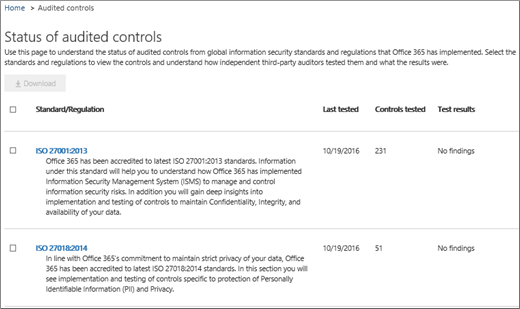

# サービスの Office 365 のセキュリティの保証&amp;コンプライアンス センター

サービスの保証を使用して、Office 365 のセキュリティで&amp;コンプライアンス センターは、さまざまなトピックを説明するドキュメントにアクセスするにします。 
  
- Office 365 に格納されている顧客データをマイクロソフトのセキュリティ プラクティスです。 
    
- Office 365 の独立したサードパーティの監査レポートします。 
    
- 実装し、セキュリティ、プライバシー、およびコンプライアンスへの対応のテストの詳細データを保護するために、Office 365 を使用します。 
    
Office 365 がお客様の業種については、次のように標準、法律、および規制を遵守を支援する方法を検索することもします。
  
-  国際標準化機構 (ISO) 27001 と 27018 機構 
    
- 医療保険の携行性と責任に関する法律 (Health Insurance Portability and Accountability Act of 1996 (HIPAA))
    
- 連邦リスクと承認の管理プログラム (FedRAMP)
    
## Office 365 サービスの保証、アクセスできるユーザーとどのようにしますか?

 **新規顧客、および顧客が Microsoft オンライン サービスを評価する**Office 365 エンタープライズ E3、E5 の計画 (サブスクリプションを試用版と有料の両方) に含まれているサービスの保証にアクセスできます。しないしている場合これらの計画のいずれかのサービスを保証したいは、 [Office 365 エンタープライズ E5 の試用版にサインアップ](https://go.microsoft.com/fwlink/p/?LinkID=698279)できます。 
  
 **既存のお客様**サービスの保証にアクセスできます。組織の Office 365 のグローバル管理者 (企業の管理者とも呼ばれる) 場合は、サービスの保証へのアクセス権を既に必要がありすることができますオンボード他のユーザーです。いない Office 365 のグローバル管理者、組織のサービスの保証へのアクセスが必要な場合は、サービス保証のユーザーの役割グループに追加するのには、管理者に問い合わせてください。 
  
 **O365 サブスクリプションのメンバー**は、サービス保証の役割ベースのアクセスは有料サービスに実装されていない場合、既定では Office365 保護センターで、サービス保証のセクションをアクセスできます。サービスの保証は、レポート、および Office 365 に格納されている顧客データのマイクロソフトのセキュリティの方法を説明するドキュメントを提供します。また、独立したサードパーティの監査は、Office 365 に関するレポートを提供します。 
  
> [!NOTE]
> 注: 会社が (これは、組織がカスタム レポートへのアクセスを提供されているかどうかがある可能性があります)、Office 365 サブスクリプションには、[Service Assurance Roles-Based のアクセスを実装および保証のサービスにアクセスする必要がありますが、左には含まれませんセキュリティ ウィンドウ&amp;コンプライアンス ・ センター、[**アクセス許可**] ページで、サービス保証のユーザーの役割グループに追加するのには、Office 365 の管理者に問い合わせてください。詳細については、サービス保証のユーザーまたはグループの他の Onboard を参照してください。 
  
 **サービス保証の役割に基づくアクセス ・ プロビジョニング ユーザー**会社には、サービス保証の役割ベースのアクセスが実装されている場合は、情報セキュリティ、リスク管理、コンプライアンスを含む、すべてのセキュリティおよびコンプライアンス担当者にサービスのアクセスの保証を提供して監査チーム内のスタッフ、組織です。詳細についてを参照してください[Onboard サービス保証のユーザーまたはグループの他の](service-assurance.md#addother)です。
  
セキュリティを使用してアクセス可能なサービスの保証は、&amp;コンプライアンス センターです。ここでは、そこに取得する方法です。
  
1. [https://protection.office.com](https://protection.office.com)。
    
2. 職場、学校のアカウントを使用して Office 365 にサインインします。 
    
3. 左側のウィンドウでは、**サービスの保証**を選択します。次へ][を選択してください、業界と地域の設定](service-assurance.md#Chooseyourindustryregional)と[Onboard サービス保証のユーザーまたはグループの他の](service-assurance.md#addother)です。
    
    > [!NOTE]
    > サービスの保証にアクセスする必要があり、セキュリティの左側のウィンドウに含まれていないかどうかは&amp;コンプライアンス ・ センター、[**アクセス許可**] ページで、サービス保証のユーザーの役割グループに追加するのには、Office 365 の管理者に問い合わせてください。 
  
## 業界と地域の設定を選択します。

アクセスすると、最初にサービスの保証、業界と地域の設定を構成するのには、まずです。これらの設定はいつでも変更できます。これらの設定を構成するには、組織に最も関連するコンテンツを提供するためのサービス保証が有効にします。業界および地域の設定を構成します。
  
1. サービスの保証にアクセスした後は、次のスクリーン ショットに示すようにページが表示されます**設定**し、地域や業界の設定を選択します。 
    
    ![保護センターの設定] ページを示しています。](media/101716e8-9c0a-4839-a2c0-f6aacf64eb9d.png)
  
2. [**設定**] ページで、**領域**の横にある下向き矢印を選択し、組織の適切な領域を確認します。 
    
3. **業界**の横の下向き矢印を選択し、組織の適切な業種を確認します。 
    
4. 地域や業種を選択したら、[**保存**] を選択します。
    
## 検索、レビュー、およびコンプライアンスとの信頼のコンテンツをダウンロード

確認し、コンテンツをダウンロードするには、ナビゲーション ウィンドウからオプションを選択します。
  
- 次の画面に示すように、独立した監査し、Office 365 とその他のマイクロソフトのクラウド サービスの評価を表示するのには、**コンプライアンス ・ レポート**は、次のショットです。 
    
    
  
- ショットの次の画面に表示されるように Microsoft が Office 365 を運用する方法に関する情報を表示する**ドキュメントを信頼する**です。 
    
    
  
- Office 365 を制御する方法に関する情報を表示するのには**Audited コントロール**は、次のスクリーン ショットに示すように、セキュリティ、コンプライアンス、およびプライバシーの要件を満たします。 
    
    
  
、ダウンロードするレポートを選択し、**保存**にお使いのコンピューターにダウンロードすることを選択します。Audited コントロールでは、**ダウンロード**を選択し、レポートを選択します。次の表では、各サービスの保証のページを検索することができますレポートについて説明します。 
  
> [!NOTE]
> サービス保証レポートやドキュメントを発行した後、またはドキュメントの新しいバージョンが使用可能になるまでに少なくとも 12 か月のダウンロードを利用できます。 
  
|**サービス保証ページ**|**利用可能なコンテンツ**|**説明**|
|:-----|:-----|:-----|
|コンプライアンス レポート    | FedRamp     GRC の評価     ISO     SOC/SSAE    |サービス コンプライアンス レポートを使用して、Office 365 サービスの配信操作のサード ・ パーティ製の独立監査人によって実行される監査の評価を確認します。    |
|ドキュメントの信頼    | よく寄せられる質問とホワイト ・ ペーパー     リスク管理レポート    |ホワイト ・ ペーパー、Faq、年末のレポートおよびその他のマイクロソフト社外秘リソースが割り当てられている場合、確認のための非開示契約の下で/リスクの評価を使用します。    |
|監査対象のコントロール    |世界標準と Office 365 が実装されている規制。    | リスクの評価から、ときに、契約時、または Office 365 サービスを使用する際に役立ちます。見つけてください：     -Office 365 は、セキュリティ、コンプライアンス、およびプライバシーの要件を満たすを制御します。   -Office 365 内のコントロールのテストについては、これらのテスト、およびそれらの完了時を発生します。    |
   
によって、特定のセットアップでは、ビューに含まれるオプションはいくつか相違点があります。
  
## オンボード サービス保証のユーザーまたはグループの他の

マイクロソフトのクラウドのすべてのサブスクリプションで一般的に使用される既定のレポートにアクセスする、サービス保証の役割ベースのアクセス モデルを実装する必要はありません、この手順をスキップすることができます。ただし、組織にカスタム レポートへのアクセスが提供されている場合、追加してください他のユーザーまたはグループ サービスの保証の役割。他のユーザーまたはグループを追加します。
  
1. セキュリティ&amp;コンプライアンス センターでは、次のスクリーン ショットに示すように左側のペインでは、select**のアクセス許可**。 
    
    ![セキュリティ&amp;準拠のアクセス許可] メニュー](media/8b479ad4-5c91-4e4c-a1db-372d50526db6.png)
  
2. 右側のウィンドウで**サービス保証のユーザー**を選択し**ロール グループの編集**] を選択し、[**メンバー** ] セクションで、**編集**を次のスクリーン ショットに示すように、サービス保証のユーザー ロールにメンバーを追加するを選択します。 
    
    
  
3. 次のダイアログ ボックスでを検索し、[個人またはグループのサービス保証の準拠性に関するレポートを表示し、リソースを信頼する必要がある、し、ウィンドウの右上隅の**X**をクリックするには各選択範囲の**追加**] を選択するときされたら完了です。 
    
    
  
4. すべてのユーザーまたはサービスの保証のユーザー ロールに追加したグループを今すぐサービスの保証を検索でき、レポートとセキュリティの他のドキュメントをダウンロードする&amp;コンプライアンス センターです。
    
多くのユーザーを追加するには、いつでも**アクセス許可**] ページに戻るか、既存を削除します。 
  
## サービスの保証に関するヘルプを表示します。

[ビジネス製品 - 管理者ヘルプのサポートに問い合わせてください](https://support.office.com/article/32a17ca7-6fa0-4870-8a8d-e25ba4ccfd4b)。
  
## よく寄せられる質問

 **理由サービス保証からのドキュメントが破損していることを示すエラーを取得しますか。**
  
サービス保証のほとんどのドキュメントは、PDF 形式では。**保存**するのには、これらのファイルを保存するのには」を選択し、ローカル コンピューターから開きます。 
