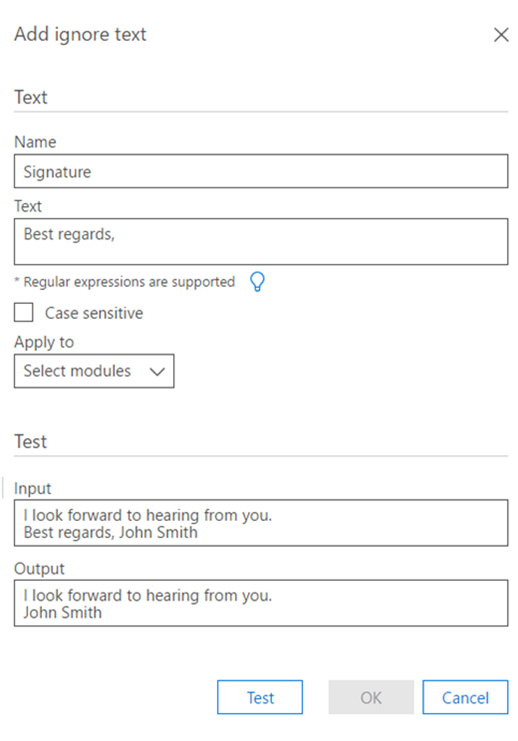

# Office 365 で分析の [テキストを無視] オプションを設定する Advanced eDiscoverySet Ignore Text option for Analyze in Office 365 Advanced eDiscovery

> [!NOTE]
> Advanced eDiscovery を使用するには、Advanced Compliance アドオンがインストールされた Office 365 E3 サブスクリプション、または E5 サブスクリプションがお客様の組織で必要になります。このプランを利用しておらず、Advanced eDiscovery をお試しになりたい場合は、[Office 365 Enterprise E5 の試用版にサインアップ](https://go.microsoft.com/fwlink/p/?LinkID=698279)してください。Advanced eDiscovery requires an Office 365 E3 with the Advanced Compliance add-on or an E5 subscription for your organization. If you don't have that plan and want to try Advanced eDiscovery, you can [sign up for a trial of Office 365 Enterprise E5](https://go.microsoft.com/fwlink/p/?LinkID=698279). 
  
[テキストを無視] 機能は、次の高度な電子情報開示モジュールのすべてまたはいずれかに適用できます: Analyze (重複、電子メールスレッド、テーマ) および関連性。The Ignore Text feature can be applied to all or any of the following Advanced eDiscovery modules: Analyze (Near-duplicates, Email Threads, Themes) and Relevance. 無視されたテキストは、関連性に表示されているファイルには表示されず、解析/計算では無視されたテキストが破棄されます。Ignored text will not appear in files displayed in Relevance, and the analysis/calculations will discard the ignored text.
  
既に実行しているモジュールに対して、[テキストを無視] 機能が以前に定義されていた場合は、[無視] テキスト設定が変更されないようになります。If the Ignore Text feature was previously defined for modules that have already run, the Ignore Text setting will now be protected from being modified. ただし、関連性モジュールの [テキストを無視] 機能は、いつでも変更できます。However, the Ignore Text feature for the Relevance module can still be changed at any time.
  
## テキストフィルターの適用方法How Ignore Text filters are applied

複数の Ignore テキストフィルターは、入力された順序で適用されます。Multiple Ignore Text filters are applied in the order that they were entered. 適用される順序を変更するには、それらを削除して、必要な順序で再入力する必要があります。To change the order in which they are applied, they must be deleted and re-entered in the desired order.
  
たとえば、テキストコンテンツが "DAVE BOB ALICE CAROL イブ" の場合、次に示すのは、無視するテキストエントリと結果の例です。For example, if the text content is: "DAVE BOB ALICE CAROL EVE", the following are samples of Ignore Text entries and the results:
  
||||
|:-----|:-----|:-----|
|**テキストの入力を無視する****Ignore Text entries**   |**==\>**   |**結果****Results**   |
|"ALICE"、"BOB CAROL""ALICE", "BOB CAROL"    |==\>    |"DAVE イブ""DAVE EVE"    |
|"ALICE"、"BOB ALICE CAROL""ALICE", "BOB ALICE CAROL"    |==\>    |"DAVE BOB CAROL イブ""DAVE BOB CAROL EVE"    |
   
最初の無視テキストが適用された後に、文字列が見つからないため、2番目の無視テキストエントリは実装されません。The second Ignore Text entry is not implemented because the string is not found as such AFTER the first Ignore Text has been applied.
  
## 無視するテキストを定義するときに正規表現を使用するUse regular expressions when defining Ignore Text

無視テキストを定義するときは、正規表現がサポートされています。Regular expressions are supported for use when defining Ignore Text. 正規表現の構文と使用法の例を次に示します。The following are examples of regular expression syntax and usage:
  
- 行頭から行末までテキストを削除 (無視) するには、次のようにします。To remove (ignore) text from Begin until the end of a line:
    
     `Begin(.*)$`
    
    ここで、"Begin" は行でこの文字列を最初に出現した位置です。where "Begin" is the initial occurrence of this string in the line.
    
    たとえば、次のようなテキストを入力します。For example, for the following text:
    
    **"これは最初の文と最初の行です。****"This is first sentence and first line**
    
    **これは2番目の文と2行目です。****This is second sentence and second line"**
    
    正規表現の最初 (.\*)$ は次のようになります。the Regular Expression first(.\*)$ will result in:
    
    **"これは****"This is**
    
    **これは2番目の文と2行目です。****This is second sentence and second line"**
    
- 電子メールスレッドの最後に自動的に挿入される免責事項と法的なステートメントを削除するには、次のようにします。To remove disclaimers and legal statements automatically inserted at the end of email threads:
    
     `Begin(.|\s)*End`
    
    "Begin" と "end" は、折り返したテキストの段落の先頭と末尾にある一意の文字列です。where "Begin" and "End" are unique strings at the beginning and end of a wrapped text paragraph. 
    
    たとえば、次の正規表現は、電子メールスレッドの Begin および End 文字列間の免責事項および法的なステートメントを削除します。For example, the following regular expression will remove disclaimers and legal statements that were in the email thread between the Begin and End strings:
    
    **このメッセージには機密情報が含まれています (. |\s)\*確認が必要な場合は、ハードコピーバージョンを要求してください。****This message contains confidential information (.|\s)\*If verification is required please request a hard-copy version**
    
- 免責事項 (特殊文字を含む) を削除するには、次のようにします。To remove a disclaimer (including special characters): 
    
    たとえば、次のようなテキストが含まれているとします (この免責事項は x で表されています)。For example, for the following text (with the disclaimer represented here by x's): 
    
    **/\*\ このメッセージには機密情報が含まれています。xxxx xxxx****/\*\ This message contains confidential information. xxxx xxxx**
    
    **xxxx xxxx xxxx xxxx xxxx xxxx xxxx xxxxx****xxxx xxxx xxxx xxxx xxxx xxxx xxxx**
    
    \**xxxx xxxx 確認が必要な場合は、ハードコピーバージョンを要求してください。/\*\**\**xxxx xxxx If verification is required, please request a hard-copy version. /\*\**
    
    上記の免責事項を削除する正規表現は、次のようになります。the regular expression to remove the above disclaimer should be: 
    
    **\/\\*\\このメッセージには機密\.情報が含まれています (. |\s)\*確認が必要な場合は、ハードコピーバージョン\.を要求してください。\/\\*\\****\/\\*\\ This message contains confidential information\.(.|\s)\* If verification is required please request a hard-copy version\. \/\\*\\**
    
- 正規表現ルール:Regular expression rules:
    
  - アルファベットの一部ではない文字 (スペースを除く)、"_"、および "-" は "" の前にする\"必要があります。Any characters that are not part of the alphabet except for space(s), "_" and "-" must be preceded by "\".
    
  - 通常の eexpression フィールドの長さに制限はありません。The regular eExpression field can be unlimited length.
    
> [!TIP]
> 正規表現の説明と詳細な構文については、「[正規表現言語-クイックリファレンス](https://msdn.microsoft.com/en-us/library/az24scfc%28v=vs.110%29.aspx)」を参照してください。For an explanation and detailed syntax of regular expressions, see: [Regular Expression Language - Quick Reference](https://msdn.microsoft.com/en-us/library/az24scfc%28v=vs.110%29.aspx). 
  
## 無視するテキストルールを定義するDefine Ignore Text rule

1. [ \*\* \>分析分析\>オプションの管理**] タブの [**無視するテキスト**] セクションで**+\*\* 、アイコンをクリックしてルールを追加します。In the **Manage \> Analyze \> Analyze options** tab, in the **Ignore Text** section, click the **+** icon to add a rule. 
    
2. [**無視するテキストを追加**] ダイアログの [**名前**] フィールドに、ignore テキストルールの名前を入力します。In the **Add Ignore Text** dialog, in the **Name** field, type a name for the Ignore Text rule. 
    
    
  
3. **テキスト**ボックスに、無視するテキストを入力します。In the **Text** box, type the text to be ignored. text フィールドに使用できる文字数に制限はありません。The text field allows an unlimited number of characters. 
    
    > [!TIP]
    > 上記のウィンドウに表示されているように、[**電球**] をクリックすると、Ignore テキストルールの一般的な構文のガイドラインが表示されます。As shown in the window above, click **light bulb** to see common syntax guidelines for the Ignore Text rule. 
  
4. 必要に応じて、[**大文字小文字を区別**する] チェックボックスをオンにします。Select the **Case sensitive** check box, if desired. 
    
5. [**適用先**] ボックスの一覧で、定義を適用するアドバンスド電子情報開示モジュールを選択します。In the **Apply to** list, select the Advanced eDiscovery modules in which to apply the definition. 
    
6. サンプルテキストに対してテストを実行する場合は、**入力**テキストボックスに「sample text」と入力し、[**テスト**] をクリックします。If you want a test run on sample text, type sample text in the **Input** text box and click **Test**. 結果が [**出力**] テキストボックスに表示されます。The results are displayed in the **Output** text box. 
    
7. [ **OK]** をクリックして、Ignore テキストルールを保存します。Click **OK** to save the Ignore Text rule. 定義済みの Ignore テキストルールが表示されます。The defined Ignore Text rule is displayed. 
    
    
  
## 関連項目See also

[Office 365 Advanced eDiscoveryOffice 365 Advanced eDiscovery](office-365-advanced-ediscovery.md)
  
[ドキュメントの類似点についてUnderstanding document similarity](understand-document-similarity-in-advanced-ediscovery.md)
  
[分析オプションの設定Setting Analyze options](set-analyze-options-in-advanced-ediscovery.md)
  
[[詳細設定の分析] の設定](set-analyze-advanced-settings-in-advanced-ediscovery.md)[Setting Analyze advanced settings](set-analyze-advanced-settings-in-advanced-ediscovery.md)
  
[分析結果の表示Viewing Analyze results](view-analyze-results-in-advanced-ediscovery.md)

