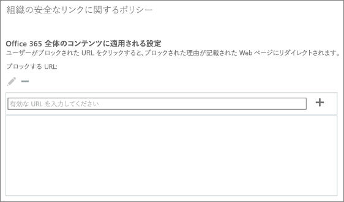

# Office 365 ATP の安全なリンク機能を使用して、ユーザー設定のブロック URL リストを設定する

> [!IMPORTANT]
> この記事は、 [Office 365 Advanced Threat Protection](office-365-atp.md)を使用しているビジネスのお客様を対象としています。 Outlook の安全なリンクに関する情報をお探しのホームユーザーの場合は、「 [Advanced Outlook.com security](https://support.office.com/article/advanced-outlook-com-security-for-office-365-subscribers-882d2243-eab9-4545-a58a-b36fee4a46e2)」を参照してください。

[Office 365 Advanced Threat Protection](office-365-atp.md) (ATP) を使用すると、組織はブロックされている Web サイト アドレスのユーザー設定リストを所有することができます。URL がブロックされると、ブロックされた URL へのリンクをクリックしたユーザーは次の画像のような[警告ページ](atp-safe-links-warning-pages.md)に移動します。 
  

  
ブロック URL リストは組織の Office 365 セキュリティ チームによって定義され、Office 365 ATP の安全なリンク ポリシーによって保護されている組織の全員に適用されます。 
  
この記事では、[Office 365 の ATP の安全なリンク](atp-safe-links.md)に、組織のユーザー設定のブロック URL リストを設定する方法について説明します。
  
## ユーザー設定のブロック URL リストを表示または編集する

[Office 365 の ATP の安全なリンク](atp-safe-links.md)では、組織のユーザー設定のブロック URL リストなど、いくつかのリストを使用します。必要なアクセス許可があれば、組織のユーザー設定リストを設定できます。これを行うには、組織の既定の安全なリンクのポリシーを編集します。

ATP ポリシーを編集 (または定義) するには、次の表に示す役割の 1 つが割り当てられている必要があります。 

|役割  |参照先/割り当て方法  |
|---------|---------|
|Office 365 グローバル管理者 |Office 365 の購入へのサインアップをする場合、既定ではグローバル管理者になります。詳細については、「[Office 365 の管理者の役割について](https://docs.microsoft.com/office365/admin/add-users/about-admin-roles)」を参照してください。         |
|セキュリティ管理者 |Azure Active Directory 管理センター ([https://aad.portal.azure.com](https://aad.portal.azure.com))|
|Exchange Online 組織の管理 |Exchange 管理センター ([https://outlook.office365.com/ecp](https://outlook.office365.com/ecp))  または    PowerShell コマンドレット (「[Exchange Online PowerShell](https://docs.microsoft.com/powershell/exchange/exchange-online/exchange-online-powershell?view=exchange-ps)」を参照してください) |

> [!TIP]
> 役割とアクセス許可の詳細については、「[Office 365 セキュリティ/コンプライアンス センターのアクセス許可](permissions-in-the-security-and-compliance-center.md)」を参照してください。

### ユーザー設定のブロック URL リストを表示または編集するには
  
1. [https://protection.office.com](https://protection.office.com) に移動し、職場または学校のアカウントでサインインします。 
    
2. 左側のナビゲーションの **[脅威の管理]** で **[ポリシー]** \> **[安全なリンク]** の順に選びます。
    
3. **[組織全体に適用されるポリシー]** セクションで、**[既定]**、**[編集]** (編集ボタンは鉛筆に似ています) の順に選びます。 ![[編集] をクリックして安全なリンクの保護に関する既定のポリシーを編集する](media/d08f9615-d947-4033-813a-d310ec2c8cca.png) これにより、ブロック URL リストを表示することができます。最初は、URL のリストが表示されないかもしれません。 
  
4. **[有効な URL を入力します]** ボックスを選んで、「URL」と入力し、プラス記号 (**+**) を選びます。 

5. 画面の右下隅で URL の追加が完了したら、**[保存]** を選択します。
    
## 注意事項

URL をリストに追加するときは、次の点に注意してください。 

- URL の最後にスラッシュ (**/**) を含めないでください。たとえば、「`http://www.contoso.com/`」と入力する代わりに、「`http://www.contoso.com`」と入力します。
    
- ドメイン専用の URL (`contoso.com` または `tailspintoys.com` など) を指定することができます。これにより、ドメインを含む URL のクリックがブロックされます。

- 完全なドメイン (`contoso.com` など) はブロックせずにサブドメイン (`toys.contoso.com*` など) を指定することができます。これにより、サブドメインを含む URL のクリックはブロックされますが、完全ドメインを含む URL のクリックはブロックされません。  
    
- URL ごとにワイルドカードのアスタリスク (\*) を 3 つまで含めることができます。次の表は、入力できる内容と、エントリにどのような効果があるかについていくつかの例を示しています。
    
|**エントリの例**|**機能**|
|:-----|:-----|
|`contoso.com` または `*contoso.com*`    |ドメイン、サブドメイン、パス (`https://www.contoso.com`、`http://sub.contoso.com`、`http://contoso.com/abc` など) をブロックします    |
|`http://contoso.com/a`    |サイト `http://contoso.com/a` をブロックしますが、`http://contoso.com/a/b` のような追加のサブパスはブロックしません    |
|`http://contoso.com/a*`    |サイト `http://contoso.com/a`、`http://contoso.com/a/b` のような追加のサブパスをブロックします    |
|`http://toys.contoso.com*`    |サブドメイン (この場合は「toys」) をブロックしますが、他のドメイン URL (`http://contoso.com` や `http://home.contoso.com` など) のクリックを許可します。    |
   

## 組織の特定のユーザーに対して例外を定義する方法

他のユーザーに対してブロックされる可能性のある URL を特定のグループが表示できるようにする場合、特定の受信者に適用される ATP の安全なリンクに関するポリシーを指定できます。「[ATP の安全なリンクを使用して、ユーザー設定の "書き換えない" URL リストを設定する](set-up-a-custom-do-not-rewrite-urls-list-with-atp.md)」を参照してください。
  

