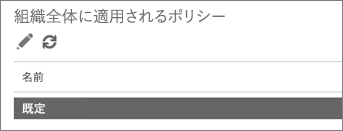

# Office 365 の ATP の安全なリンクを使用してカスタムのブロックされた Url リストを設定します。Set up a custom blocked URLs list using Office 365 ATP Safe Links

[Office 365 の高度な脅威保護](office-365-atp.md)(ATP)、組織はブロックされている web サイト アドレス (Url) のユーザー設定リストを持つことができます。URL がブロックされると、ブロックされた URL へのリンクをクリックするユーザーが次の図のような[警告ページ](atp-safe-links-warning-pages.md)に実行されます。With [Office 365 Advanced Threat Protection](office-365-atp.md) (ATP), your organization can have a custom list of website addresses (URLs) that are blocked. When a URL is blocked, people who click on links to the blocked URL are taken to a [warning page](atp-safe-links-warning-pages.md) that resembles the following image: 
  

  
組織の Office 365 のセキュリティ チームがブロックされている Url のリストが定義されているし、Office 365 の ATP の安全なリンク ポリシーの対象となる組織内の全員がそのリストが適用されます。The blocked URLs list is defined by your organization's Office 365 security team, and that list applies to everyone in the organization who is covered by Office 365 ATP Safe Links policies. 
  
[Office 365 の安全なリンクを ATP](atp-safe-links.md)の組織のカスタム ブロックされた Url の一覧を設定する方法の詳細については、この資料を参照してください。Read this article to learn how to set up your organization's custom blocked URLs list for [ATP Safe Links in Office 365](atp-safe-links.md).
  
## 表示またはブロックされた Url のカスタム リストを編集します。View or edit a custom list of blocked URLs

[Office 365 の ATP の安全なリンク](atp-safe-links.md)では、組織のカスタム ブロックされた Url の一覧を含む、いくつかのリストを使用します。必要な権限があれば、組織のユーザー設定リストを設定できます。組織の安全なリンクの既定のポリシーを編集することによってこれを行います。[ATP Safe Links in Office 365](atp-safe-links.md) uses several lists, including your organization's custom blocked URLs list. If you have the necessary permissions, you can set up your organization's custom list. You do this by editing your organization's default Safe Links policy.

ATP のポリシーを編集 (または定義) を割り当てる必要があります、次の表に記載されている役割のいずれか。To edit (or define) ATP policies, you must be assigned one of the roles described in the following table: 

|役割Role  |場所と方法が割り当てられています。Where/how assigned  |
|---------|---------|
|Office 365 のグローバル管理者Office 365 Global Administrator |Office 365 を購入するのに署名した人は、既定でグローバル管理者です。( [Office 365 の管理者の役割](https://docs.microsoft.com/office365/admin/add-users/about-admin-roles)の詳細についてを参照してください)。The person who signs up to buy Office 365 is a global admin by default. (See [About Office 365 admin roles](https://docs.microsoft.com/office365/admin/add-users/about-admin-roles) to learn more.)         |
|セキュリティ管理者Security Administrator |Azure Active Directory 管理センター ([https://aad.portal.azure.com](https://aad.portal.azure.com))Azure Active Directory admin center ([https://aad.portal.azure.com](https://aad.portal.azure.com))|
|Exchange オンライン組織の管理Exchange Online Organization Management |Exchange 管理センター ([https://outlook.office365.com/ecp](https://outlook.office365.com/ecp))Exchange admin center ([https://outlook.office365.com/ecp](https://outlook.office365.com/ecp))  またはor    PowerShell コマンドレット (を参照してください[Exchange オンライン PowerShell](https://docs.microsoft.com/powershell/exchange/exchange-online/exchange-online-powershell?view=exchange-ps))PowerShell cmdlets (See [Exchange Online PowerShell](https://docs.microsoft.com/powershell/exchange/exchange-online/exchange-online-powershell?view=exchange-ps)) |

> [!TIP]
> ロールとアクセス許可の詳細についてを参照してください[では、Office 365 のセキュリティ アクセス許可&amp;コンプライアンス センター](permissions-in-the-security-and-compliance-center.md)です。To learn more about roles and permissions, see [Permissions in the Office 365 Security &amp; Compliance Center](permissions-in-the-security-and-compliance-center.md).

### 表示またはブロックされた Url のユーザー設定リストを編集するにはTo view or edit a custom blocked URLs list
  
1. [https://protection.office.com](https://protection.office.com)と、職場、学校のアカウントでサインインします。Go to [https://protection.office.com](https://protection.office.com) and sign in with your work or school account. 
    
2. **脅威の管理**の下で、左側のナビゲーションで [**ポリシー** ] を選択します\>**安全なリンク**です。In the left navigation, under **Threat management**, choose **Policy** \> **Safe Links**.
    
3. **組織全体に適用されるポリシー** ] セクションで **[既定**] を選択しの**編集**([編集] ボタンのような鉛筆) します。In the **Policies that apply to the entire organization** section, select **Default**, and then choose **Edit** (the Edit button resembles a pencil). ![安全なリンクの保護のため、既定のポリシーを編集するのにはの編集] をクリックします。](media/d08f9615-d947-4033-813a-d310ec2c8cca.png) これにより、ブロックされた Url の一覧を表示することができます。最初は、ここで記載されているすべての Url をいない可能性があります。This enables you to view your list of blocked URLs. At first, you might not have any URLs listed here. ![安全なリンクの既定のポリシーの Url] ボックスの一覧のブロック](media/575e1449-6191-40ac-b626-030a2fd3fb11.png)
  
4. **有効な URL を入力**] ボックスを選択、URL を入力し、プラス記号を選択し、(**+**)。Select the **Enter a valid URL** box, type a URL, and then choose the plus sign (**+**). 

5. 画面の右下隅で、Url の追加が完了したら、**保存**を選択します。When you are finished adding URLs, in the lower right corner of the screen, choose **Save**.
    
## 点に留意してください。A few things to keep in mind

リストに Url を追加するときに、次の点に注意してください。While you add URLs to your list, keep the following points in mind: 

- スラッシュが含まれていない ( **/**)、URL の末尾にします。入力するのではなく、たとえば、 `http://www.contoso.com/`、入力`http://www.contoso.com`。Do not include a forward slash ( **/**) at the end of the URL. For example, instead of entering `http://www.contoso.com/`, enter `http://www.contoso.com`.
    
- ドメイン専用の URL を指定することができます (のような`contoso.com`または`tailspintoys.com`)。クリック ノイズをブロックするこのドメインが含まれる任意の URL にします。You can specify a domain-only URL (like `contoso.com` or `tailspintoys.com`). This will block clicks on any URL that contains the domain.

- サブドメインを指定することができます (のような`toys.contoso.com*`)、完全なドメインをブロックすることがなく (と同様に`contoso.com`)。このブロックは、サブドメインを含む任意の URL をクリックすると、クリック ノイズをブロックしない、完全なドメインを含む URL にします。You can specify a subdomain (like `toys.contoso.com*`) without blocking a full domain (like `contoso.com`). This will block clicks any URL that contains the subdomain, but it won't block clicks to a URL that contains the full domain.  
    
- 最大 3 つのワイルドカードのアスタリスクを含めることができます (\*) あたりの URL です。入力することができ、どのような効果のこれらのエントリの例をいくつかが次の表の一覧です。You can include up to three wildcard asterisks (\*) per URL. The following table lists some examples of what you can enter and what effect those entries have.
    
|**エントリの例****Example Entry**|**何します。****What It Does**|
|:-----|:-----|
|`contoso.com`または`*contoso.com*``contoso.com` or `*contoso.com*`    |ドメイン、サブドメイン、およびパスを次のようにブロック`https://www.contoso.com`、`http://sub.contoso.com`と`http://contoso.com/abc`Blocks the domain, subdomains, and paths, such as `https://www.contoso.com`, `http://sub.contoso.com`, and `http://contoso.com/abc`    |
|`http://contoso.com/a`    |サイトをブロックする`http://contoso.com/a`いない追加のサブパスのような`http://contoso.com/a/b`Blocks a site `http://contoso.com/a` but not additional subpaths like `http://contoso.com/a/b`    |
|`http://contoso.com/a*`    |サイトをブロックする`http://contoso.com/a`などの他のサブパスを含めると`http://contoso.com/a/b`Blocks a site `http://contoso.com/a` and additional subpaths like `http://contoso.com/a/b`    |
|`http://toys.contoso.com*`    |サブドメイン (この場合の「おもちゃ」)、ブロックは他のドメインの Url をクリックを許可する (のような`http://contoso.com`または`http://home.contoso.com`)。Blocks a subdomain ("toys" in this case) but allow clicks to other domain URLs (like `http://contoso.com` or `http://home.contoso.com`).    |
   

## 組織で特定のユーザーに対して例外を定義する方法How to define exceptions for certain users in an organization

特定のグループが他のユーザーがブロックされている Url を表示できるようにする場合は、特定の受信者に適用される分析ツールの安全なリンクのポリシーを指定できます。[ATP の安全なリンクを使用してカスタム」を書き換えない"Url リストを設定](set-up-a-custom-do-not-rewrite-urls-list-with-atp.md)を参照してください。If you want certain groups to be able to view URLs that might be blocked for others, you can specify an ATP Safe Links policy that applies to specific recipients. See [Set up a custom "do not rewrite" URLs list using ATP Safe Links](set-up-a-custom-do-not-rewrite-urls-list-with-atp.md).
  

