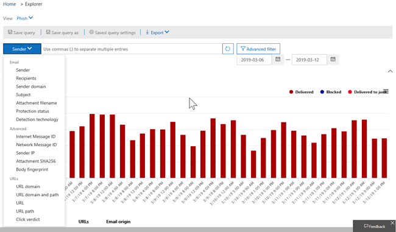

# 脅威エクスプローラー ビューThreat Explorer views

[脅威エクスプローラ](use-explorer-in-security-and-compliance.md)は、セキュリティ運用チームがセキュリティ&amp;コンプライアンスセンターで脅威を調査して対応するのに役立つ、強力でほぼリアルタイムのツールです。[Threat Explorer](use-explorer-in-security-and-compliance.md) is a powerful, near real-time tool to help Security Operations teams investigate and respond to threats in the Security &amp; Compliance Center. エクスプローラーは、疑いのあるマルウェアおよびフィッシングに関する情報を、Office 365 の電子メールやファイル、および組織に対する他のセキュリティ上の脅威やリスクと共に表示します。Explorer displays information about suspected malware and phish in email and files in Office 365, as well as other security threats and risks to your organization. 

エクスプローラーを最初に開くと、既定の表示で過去7日間の電子メールマルウェアの検出が表示されます。When you first open Explorer, the default view shows email malware detections for the past 7 days. 

エクスプローラーには、Office 365 のセキュリティ保護機能 ([安全なリンク](atp-safe-links.md)と[安全な添付ファイル](atp-safe-attachments.md)を含む) を表示することもできます。これにより、過去30日間のデータを表示するように変更することができます。Explorer can also show security protection features in Office 365, including [Safe Links](atp-safe-links.md) and [Safe Attachments](atp-safe-attachments.md) and can be modified to show data for the past 30 days. 

> [!NOTE]
> office 365 Advanced Threat Protection プラン2または office 365 E5 の試用版サブスクリプションをお持ちの場合は、過去7日間の検出とメールデータのみが表示されます。If you have a trial subscription for Office 365 Advanced Threat Protection Plan 2 or Office 365 E5, you will only see detections and email data for the past 7 days.
  
表示する情報を変更するには、[**表示**] メニューを使用します。Use the **View** menu to change what information is displayed. ツールヒントは、どのビューを使用するかを判断するのに役立ちます。Tooltips help you determine which view to use.
  
![脅威エクスプローラーの [表示] メニュー](media/ThreatExplorerViewMenu.png)

ビューを選択したら、フィルターを適用してクエリを設定し、さらに分析を行います。Once you have selected a view, you can apply filters and set up queries to conduct further analysis. 次のセクションでは、エクスプローラーで使用できるさまざまなビューの概要について説明します。The following sections provide a brief overview of the various views available in Explorer.  

## 電子メール > マルウェアEmail > Malware

このレポートを表示するには、エクスプローラーで [**電子メール** > の**マルウェア**を**表示** > する] を選択します。To view this report, in Explorer, choose **View** > **Email** > **Malware**. このビューには、マルウェアが含まれていると識別された電子メールメッセージに関する情報が表示されます。This view shows information about email messages that were identified as containing malware.  

 

[**送信者**] をクリックして、表示オプションの一覧を開きます。Click **Sender** to open your list of viewing options. このリストを使用して、送信者、受信者、送信者ドメイン、件名、検出テクノロジ、保護状態などのデータを表示します。Use this list to view data by sender, recipients, sender domain, subject, detection technology, protection status, and more. 

たとえば、検出された電子メールメッセージに対して実行されたアクションを確認するには、リストで [**保護の状態**] を選択します。For example, to see what actions were taken on detected email messages, choose **Protection status** in the list. オプションを選択し、[最新の情報に更新] をクリックして、そのフィルターをレポートに適用します。Select an option, and then click the Refresh button to apply that filter to your report.

グラフの下に、特定のメッセージの詳細を表示します。Below the chart, view more details about specific messages. リスト内の項目を選択すると、フライアウトウィンドウが開き、選択した項目の詳細を確認できます。When you select an item in the list, a fly-out pane opens, where you can learn more about the item you selected. 

## 電子メール > フィッシングEmail > Phish

このレポートを表示するには、エクスプローラーで [ **view** > **Email** > **フィッシング**] を選びます。To view this report, in Explorer, choose **View** > **Email** > **Phish**. このビューには、フィッシングとして識別された電子メールメッセージが表示されます。This view shows email messages identified as phishing attempts.  

 

[**送信者**] をクリックして、表示オプションの一覧を開きます。Click **Sender** to open your list of viewing options. このリストを使用して、送信者、受信者、送信者ドメイン、送信者の IP、URL ドメイン、[verdict] などのデータを表示します。Use this list to view data by sender, recipients, sender domain, sender IP, URL domain, click verdict, and more. 

たとえば、フィッシングとして識別された url をユーザーがクリックしたときに実行された操作を確認するには、一覧で **[verdict]** を選択し、1つ以上のオプションを選択して、[更新] ボタンをクリックします。For example, to see what actions were taken when people clicked on URLs that were identified as phishing attempts, choose **Click verdict** in the list, select one or more options, and then click the Refresh button.

グラフの下に、特定のメッセージ、url クリック、url、および電子メールの送信元に関する詳細を表示します。Below the chart, view more details about specific messages, URL clicks, URLs, and email origin. 

検出された URL など、リスト内の項目を選択すると、フライアウトウィンドウが開き、選択した項目の詳細を確認できます。When you select an item in the list, such as a URL that was detected, a fly-out pane opens, where you can learn more about the item you selected. 

## 電子メール > ユーザーによる報告Email > User-reported

このレポートを表示するには、Explorer で、[**表示** > **メール** > **ユーザー-レポート**] を選択します。To view this report, in Explorer, choose **View** > **Email** > **User-reported**. このビューには、ユーザーが迷惑メール、迷惑メールではないメールとして報告した電子メールが表示されます。This view shows email that users have reported as junk, not junk, or phishing email. 

 

[**送信者**] をクリックして、表示オプションの一覧を開きます。Click **Sender** to open your list of viewing options. この一覧を使用して、送信者、受信者、レポートの種類 (電子メールが迷惑メールではないか、迷惑メールではないか、またはフィッシング) ごとに情報を表示します。Use this list to view information by sender, recipients, report type (the user's determination that the email was junk, not junk, or phish), and more. 

たとえば、フィッシングとして報告された電子メールメッセージに関する情報を表示するには、[ **Sender** > **Report type**] をクリックし、[**フィッシング**] を選択してから、[更新] ボタンをクリックします。For example, to view information about email messages that were reported as phishing attempts, click **Sender** > **Report type**, select **Phish**, and then click the Refresh button.

グラフの下に、件名行、送信者の IP アドレス、メッセージを迷惑メールとして報告したユーザー、迷惑メール、フィッシングなど、特定の電子メールメッセージの詳細を表示します。Below the chart, view more details about specific email messages, such as subject line, the sender's IP address, the user that reported the message as junk, not junk, or phish, and more. 

一覧から項目を選択すると、追加の詳細が表示されます。Select an item in the list to view additional details.

## 電子メール > すべての電子メールEmail > All email

このレポートを表示するには、エクスプローラーで [\*\*\*\* > **すべてのメール**を**表示** > する] を選択します。To view this report, in Explorer, choose **View** > **Email** > **All mail**. このビューには、フィッシングまたはマルウェアによって悪意があると識別された電子メールや、悪意のあるメール (通常の電子メール、スパム、およびバルクメール) など、すべての電子メールアクティビティが表示されます。This views shows an all-up view of email activity, including email identified as malicious due to phishing or malware, as well all non-malicious mail (normal email, spam, and bulk mail). 

> [!NOTE]
> **表示するデータが多すぎる**というエラーが表示された場合は、フィルターを追加し、必要に応じて、表示している日付範囲を絞り込んでください。If you get an error that reads **Too much data to display**, add a filter and, if necessary, narrow the date range you're viewing. 

フィルターを適用するには、[**送信者**] を選択し、リスト内の項目を選択してから [最新の情報に更新] をクリックします。To apply a filter, choose **Sender**, select an item in the list, and then click the Refresh button. この例では、**検出テクノロジ**をフィルタとして使用しています (複数のオプションを使用できます)。In our example, we used **Detection technology** as a filter (there are several options available). 送信者、送信者のドメイン、受信者、件名、添付ファイル名、マルウェアファミリ、保護状態 (Office 365 の脅威保護機能およびポリシーによって行われた操作)、検出テクノロジ (マルウェアの検出方法)、およびもっとその。View information by sender, sender's domain, recipients, subject, attachment filename, malware family, protection status (actions taken by your threat protection features and policies in Office 365), detection technology (how the malware was detected), and more. 

 

グラフの下に、件名行、受信者、送信者、状態など、特定の電子メールメッセージの詳細を表示します。Below the chart, view more details about specific email messages, such as subject line, recipient, sender, status, and so on. 

## コンテンツ > マルウェアContent > Malware

このレポートを表示するには、エクスプローラーで [**コンテンツ** > **マルウェア**の**表示** > ] を選択します。To view this report, in Explorer, choose **View** > **Content** > **Malware**. このビューには[、SharePoint Online、OneDrive for business、Microsoft Teams で Office 365 Advanced Threat Protection](atp-for-spo-odb-and-teams.md)によって悪意のあるファイルとして識別されたファイルが表示されます。This view shows files that were identified as malicious by [Office 365 Advanced Threat Protection in SharePoint Online, OneDrive for Business, and Microsoft Teams](atp-for-spo-odb-and-teams.md).

マルウェアファミリ、検出テクノロジ (マルウェアの検出方法)、ワークロード (OneDrive、SharePoint、Teams) 別の情報を表示します。View information by malware family, detection technology (how the malware was detected), and workload (OneDrive, SharePoint, or Teams). 

  

グラフの下に、添付ファイルのファイル名、ワークロード、ファイルのサイズ、ファイルを最後に変更したユーザーなど、特定のファイルの詳細が表示されます。Below the chart, view more details about specific files, such as attachment filename, workload, file size, who last modified the file, and more. 
  
## クリックフィルター機能Click-to-filter capabilities

エクスプローラーでは、クリックでフィルターを適用することができます。With Explorer, you can apply a filter in a click. 凡例の項目をクリックすると、その項目がレポートのフィルターになります。Click an item in the legend, and that item becomes a filter for the report. たとえば、エクスプローラーのマルウェアビューを見ているとします。For example, suppose we are looking at the Malware view in Explorer:
  
![[脅威管理\>エクスプローラー] に移動します。](media/cab32fa2-66f1-4ad5-bc1d-2bac4dbeb48c.png)
  
このグラフの [ **ATP 分析**] をクリックすると、次のような表示になります。Clicking **ATP Detonation** in this chart results in a view like this: 
  

  
このビューでは、 [Office 365 ATP の安全な添付ファイル](atp-safe-attachments.md)によって分析されたファイルのデータを調べています。In this view, we are now looking at data for files that were detonated by [Office 365 ATP Safe Attachments](atp-safe-attachments.md). チャートの下には、ATP の安全な添付ファイルによって検出された添付ファイルがある特定の電子メールメッセージに関する詳細が表示されます。Below the chart, we can see details about specific email messages that had attachments that were detected by ATP Safe Attachments.
  

  
1つまたは複数のアイテムを選択すると、[ **Actions** ] メニューがアクティブ化され、選択したアイテムに対して選択できるいくつかの選択肢が提供されます。Selecting one or more items activates the **Actions** menu, which offers several choices from which to choose for the selected item(s). 
  
![アイテムを選択すると、[アクション] メニューがアクティブになります。](media/95f127a4-1b2a-4a76-88b9-096e3ba27d1b.png)
  
クリックして特定の詳細に移動する機能を使用すると、脅威の調査に長い時間をかけることができます。The ability to filter in a click and navigate to specific details can save you a lot of time in investigating threats.

## クエリとフィルターQueries and filters

エクスプローラーには、上位の対象ユーザー、上位マルウェアファミリ、検出テクノロジなどの詳細を掘り下げて表示できる、さまざまなフィルターとクエリ機能が用意されています。Explorer has several powerful filters and querying capabilities that enable you to drill into details, such as top targeted users, top malware families, detection technology and more. 各種類のレポートには、データの表示と探索にさまざまな方法が用意されています。Each kind of report offers a variety of ways to view and explore data.

> [!IMPORTANT]
> エクスプローラーのクエリバーでは、アスタリスク (\*) や疑問符 (?) などのワイルドカード文字を使用しないでください。Do not use wildcard characters, such as an asterisk (\*) or a question mark (?), in the query bar for Explorer. 電子メールメッセージの [件名] フィールドを検索すると、エクスプローラーは部分一致を実行し、ワイルドカード検索と同様の結果を生成します。When you search on the Subject field for email messages, Explorer will perform partial matching and yield results similar to a wildcard search.
