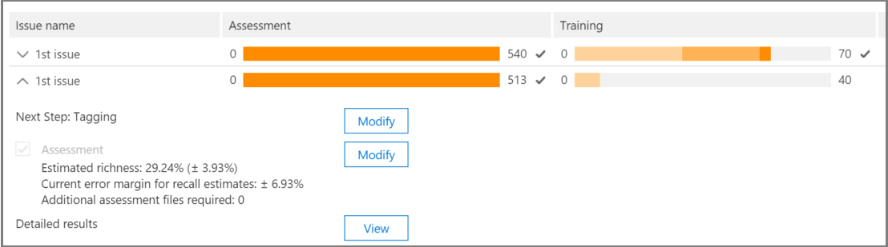

# Office 365 Advanced eDiscovery で関係性分析を追跡する

> [!NOTE]
> Advanced eDiscovery を使用するには、Advanced Compliance アドオンがインストールされた Office 365 E3 サブスクリプション、または E5 サブスクリプションがお客様の組織で必要になります。このプランを利用しておらず、Advanced eDiscovery をお試しになりたい場合は、[Office 365 Enterprise E5 の試用版にサインアップ](https://go.microsoft.com/fwlink/p/?LinkID=698279)してください。 
  
上級電子情報開示の場合、[関連性の追跡] タブには、[タグ] タブで実行された関連トレーニングの検証済みの有効性が表示され、関連性のある反復トレーニングプロセスにおける次の手順が示されます。 
  
## 関連性トレーニングの状態を追跡する

1. 次の [**問題名**] ダイアログの例に示されているように、ケースに関する問題については、次の詳細を参照してください。 
    
  - **評価**: この進捗状況の指標は、このポイントに対して関連性トレーニングを実施した結果が、エラーの範囲内で評価目標を達成したことを示しています。関連性のトレーニング結果の豊富さも表示されます。 
    
  - **トレーニング**: この色分けされた進行状況インジケーターとツールヒント表示は、関連性トレーニング結果の安定性と、各問題に対してタグ付けされた関連性トレーニングサンプルの数を示す数値スケールを示しています。専門家は、反復的な関連性トレーニングプロセスの進行状況を監視します。 
    
  - **バッチ計算**: この進捗状況のインジケーターは、バッチ計算の完了に関する情報を提供します。
    
  - **次の手順**: 実行する次の手順に関する推奨事項を表示します。 
    
    この例では、問題の評価が正常に完了したことが表示されます。これは、完了した色の進行状況インジケーターとチェックマークで示されます。タグ付けは進行中ですが、ケースは依然として不安定であると見なされます (安定性の状態もツールヒントに表示されます)。次に推奨される手順は、"トレーニング" です。 
    
    
  
    拡張ビューには、追加情報とオプションが表示されます。表示されている現在の誤差の余白は、既存の (既にタグ付けされた) 評価ファイルがある場合に、評価の現在の状態における呼び戻しの誤差範囲です。
    
    > [!NOTE]
    >  評価ステージは、問題ごとに [**評価**] チェックボックスをオフにしてから、[すべての問題] に対して省略できます。そのため、この問題に関する統計情報はありません。> [**評価**] チェックボックスをオフにするには、評価が実行される前にしか実行できません。複数の問題が存在する場合は、各問題のチェックボックスがオフになっている場合にのみ評価が省略されます。 
  
    最初のサンプルセットのファイルで評価が完了していない場合は、さらにファイルにタグ付けするための次の手順として評価されることがあります。 
    
    **関連性** \> **トラック**では、トレーニングの進行状況インジケーターとツールヒントは、安定性に必要な追加サンプルの推定数を示します。この推定は、必要な追加トレーニングのガイドラインを提供します。
    
    
  
2. タグ付けが完了し、トレーニングを続行する必要がある場合は、[**トレーニング**] をクリックします。ファイルの別のサンプルセットは、追加のトレーニング用に、読み込まれたファイルセットから生成されます。その後、[タグ] タブに戻り、追加のファイルのタグ付けとトレーニングを行います。
    
### 安定したトレーニングレベルへの到達

評価ファイルが安定したレベルのトレーニングを取得したら、高度な電子情報開示をバッチ計算の準備が整っています。
  
> [!NOTE]
> 通常、3つの安定したトレーニングサンプルの後、次の手順は "Batch calculation" です。前のサンプルからのファイルのタグ付けが変更された場合や、seed ファイルが追加された場合など、例外が発生することがあります。 
  
### バッチ計算の実行

一括計算は、トレーニングが正常に完了した後、次のステップとして実行されます (安定したトレーニングの状態が進行状況バーに表示されている場合、ツールヒントにチェックマークが付いている場合)。バッチ計算では、関連性トレーニング中に取得した知識を、ファイルの関連性を評価し、関連性スコアを割り当てるために、ファイルの作成全体に適用されます。
  
複数の問題がある場合、バッチ計算は問題ごとに実行されます。バッチの計算中に、すべてのファイルを処理している間、進行状況が監視されます。 
  
ここで、推奨される次の手順は "なし" で、これは、この時点で反復的な関連トレーニングが不要であることを示しています。次のフェーズは、 **[ \>関連性の決定**] タブです。 
  
バッチ計算後に新しいファイルをインポートする場合、管理者はインポートされたファイルを新しい負荷に追加できます。
  
> [!NOTE]
> [バッチ計算中に**キャンセル**] をクリックすると、プロセスは既に実行された処理を保存します。バッチ計算を再度実行すると、最後に実行された時点から処理が続行されます。 
  
### タグの一貫性の評価

ファイルのタグ付けに不整合がある場合は、分析に影響を与える可能性があります。高度な電子情報開示のタグ付けの一貫性のプロセスは、結果が最適でない場合、または一貫性が不明な場合に使用できます。一貫性のないタグ付きファイルの一覧が返され、必要に応じてレビューしてタグを再設定することができます。
  
> [!NOTE]
> 評価の後に7つ以上のトレーニングラウンドを行うと、**関連性** \> **トラック** \> **の問題** \>の**詳細な** \> **トレーニングの進行状況**でタグの一貫性を確認できます。このレビューは、一度に1つの問題に対して実行されます。 
  
1. **関連性\>トラック**で、問題の行を展開します。
    
2. **次の手順**の右側で、[**変更**] をクリックします。
    
3. 7つのトレーニングサンプル**** の後に [**タグの不一致**] オプションを選択し、[ **OK]** をクリックします。
    
4. [**タグの不整合**] を選択します。**タグ**タブが開き、必要に応じて再タグ付けするための不整合の一覧が表示されます。 
    
5. [**計算**] をクリックして変更を送信します。タグ付けの不整合の後の次の手順は、"トレーニング" です。 
    
## 関連性の結果の表示と使用

[**関連\>トラック**] タブで、問題の行を展開し、[**詳細な結果**] の横にある [**表示**] をクリックします。次に示すように、詳細な結果ウィンドウが表示されます。
  

  
### タグ付けの概要

 次に示す例では、**タグ付けの概要**に、評価、トレーニング、およびキャッチアップファイルのタグ付けプロセスごとの合計が表示されます。 
  

  
### キーワード

キーワードは、ファイルが関連しているかどうかを示す重要な指標として、Advanced 電子情報開示によって識別されたファイル内の一意の文字列、単語、語句、または一連の単語です。関連としてタグ付けされたファイルの "Include" 列のリストキーワードと重み、[除外] 列は、関連性がないファイルのキーワードと重みを一覧表示します。
  
上級電子情報開示では、負または正のキーワードの重み値が割り当てられます。重みが高くなるほど、キーワードが表示されるファイルの方が、バッチ計算の間により関連性の高いスコアが割り当てられる可能性が高くなります。 
  
上級電子情報開示リストは、エキスパートによって作成されたリストを補足するため、またはファイルレビュープロセスの任意の時点で間接的な正当性チェックとして使用できます。
  
### トレーニングの進捗状況

**トレーニングの進行状況**ウィンドウには、次の例に示すように、トレーニングの進行状況のグラフと品質インジケーター表示が含まれています。 
  

  
 **トレーニング品質インジケーター**: タグの一貫性の評価を次のように表示します。
  
- **良好**: ファイルに一貫したタグが付けられます。(緑色のライトが表示されます)
    
- **中**: 一部のファイルのタグが一貫していない可能性があります。(黄色のライトが表示されます)
    
- **警告**: 多くのファイルのタグ付けに一貫性がない可能性があります。(赤のライトが表示されます)
    
 **トレーニングの進行状況のグラフ**: 多くの関連性トレーニングサイクルを F メジャーの値と比較した場合の、関連性トレーニングの安定性の程度を示します。グラフ上の左から右に移動すると、関連性のトレーニング結果が最適化されている場合に、信頼性を向上させるために、高度な電子情報開示の関連性によって、信頼度の値が、F メジャーと共に使用されます。
  
> [!NOTE]
> 関連性は F2 を使用します。この指標では、呼び戻しが精度の2倍の重量を受け取る F メジャーの指標です。高 (25%) の場合、関連性は F1 (1:1 比) を使用します。[**関連性** \>の設定] の**詳細設定**では、F メジャーの比率を構成できます。 
  
### バッチ計算の結果

[**バッチ計算の結果**] ウィンドウには、次のように、関連性を考慮してスコアされたファイルの数が表示されます。 
  
- **Success**
    
- **Empty**: テキストを含まない (スペース/タブのみなど)
    
- **失敗**: サイズが大きすぎるか、読み取れませんでした
    
- **無視**: サイズが大きすぎるため
    
- **Nebulous**: 無意味なテキストが含まれているか、問題に関連する機能がありません
    
> [!NOTE]
> Empty、Failed、無視、または Nebulous は、-1 の関連性スコアを受け取ります。 
  
### トレーニングの統計

[**トレーニング統計**] ウィンドウには、高度な電子情報開示の関連性トレーニングからの結果に基づいて、統計とグラフが表示されます。 
  

  
このビューには次のものが表示されます。
  
- **レビュー-取り消し比率**: できる線型レビューの関連性スコアに従った結果の比較。呼び戻しは、レビューセットのサイズが設定されていると推定されます。
    
- **パラメーター**: ケース全体のファイルの作成に関連して、レビューセットに関連する累積計算された統計情報。
    
- **レビュー**: このカットオフに基づいてレビューするファイルのパーセンテージ。
    
- [**呼び戻し**: 校閲セット内の関連ファイルのパーセンテージ。 
    
- **関連性スコア別の配布**: 濃い灰色表示のファイルは、左側にカットオフスコアの下にあります。ツールヒントには、関連スコアと、レビューファイルセット内のファイルの関連パーセンテージが、ファイル総数に対して表示されます。
    
## 関連項目

[Office 365 Advanced eDiscovery](office-365-advanced-ediscovery.md)
  
[関連性の評価について](assessment-in-relevance-in-advanced-ediscovery.md)
  
[評価の実行とレビュー](tagging-and-assessment-in-advanced-ediscovery.md)
  
[関連性トレーニングの実行](tagging-and-relevance-training-in-advanced-ediscovery.md)
  
[結果に基づいて決定を行う](decision-based-on-the-results-in-advanced-ediscovery.md)
  
[関連性分析のテスト](test-relevance-analysis-in-advanced-ediscovery.md)

