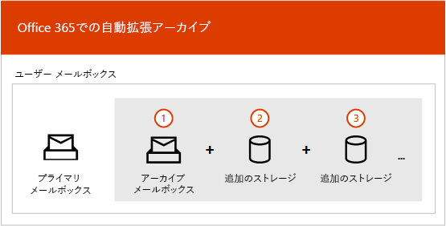
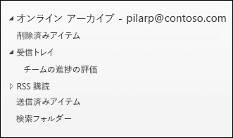
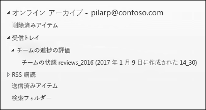

# Office 365 での無制限アーカイブの概要Overview of unlimited archiving in Office 365

Office 365 のアーカイブ メールボックスは、ユーザーに追加のメールボックス記憶領域を提供します。In Office 365, archive mailboxes provide users with additional mailbox storage space. ユーザーのアーカイブ メールボックスを有効にすると、最大 100 GB の追加記憶域を使用できます。After a user's archive mailbox is enabled, up to 100 GB of additional storage is available. 100 GB の記憶域クォータに達したとき、組織は、Microsoft に問い合わせてアーカイブ メールボックス用の追加記憶領域を要求する必要がありました。When the 100 GB storage quota is reached, organizations had to contact Microsoft to request additional storage space for an archive mailbox. このようなことはもうなくなります。That's no longer the case. Office 365 の新しい無制限アーカイブ機能 (*自動拡張アーカイブと呼ばれる*) は、アーカイブ メールボックスで無制限の記憶域を提供します。The new unlimited archiving feature in Office 365 (called *auto-expanding archiving*) provides an unlimited amount of storage in archive mailboxes. アーカイブ メールボックスの記憶域クォータに達した場合、Office 365 はアーカイブのサイズを自動的に増やします。これにより、ユーザーはメールボックスの記憶領域を使い切ることがなくなり、管理者はアーカイブ メールボックス用の追加記憶域を要求する必要がなくなります。Now, when the storage quota in the archive mailbox is reached, Office 365 automatically increases the size of the archive, which means that users won't run out of mailbox storage space and administrators won't have to request additional storage for archive mailboxes.
  
自動拡張アーカイブを有効にする詳しい手順については、「[Office 365 で無制限アーカイブを有効にする](enable-unlimited-archiving.md)」を参照してください。For step-by-step instructions for turning on auto-expanding archiving, see [Enable unlimited archiving in Office 365](enable-unlimited-archiving.md).
  
> [!NOTE]
> アーカイブの自動拡張では、共有メールボックスもサポートされます。Auto-expanding archiving also supports shared mailboxes. 共有メールボックスのアーカイブを有効にするには、Exchange Online プラン 2 のライセンス、または Exchange Online Archiving のライセンスの付いた Exchange Online プラン 1 のライセンスが必要です。To enable the archive for a shared mailbox, an Exchange Online Plan 2 license or an Exchange Online Plan 1 license with an Exchange Online Archiving license is required. 
  
## 自動拡張アーカイブのしくみHow auto-expanding archiving works

前に説明したように、ユーザーのアーカイブ メールボックスが有効になっていると、追加のメールボックス記憶領域が作成されます。As previously explained, additional mailbox storage space is created when a user's archive mailbox is enabled. 自動拡張アーカイブを有効にすると、Office 365 は定期的にアーカイブ メールボックスのサイズを確認します。When auto-expanding archiving is enabled, Office 365 periodically checks the size of the archive mailbox. アーカイブ メールボックスが記憶域の制限に近づくと、Office 365 はアーカイブに対する追加の記憶領域を自動的に作成します。When an archive mailbox gets close to its storage limit, Office 365 automatically creates additional storage space for the archive. ユーザーがこの追加記憶領域を使い切ると、Office 365 はユーザーのアーカイブの記憶領域をさらに追加します。If the user runs out of this additional storage space, Office 365 adds more storage space to the user's archive. この処理は自動的に行われるので、管理者は追加のアーカイブ記憶域を要求したり、自動拡張アーカイブを管理したりする必要はありません。This process happens automatically, which means administrators don't have to request additional archive storage or manage auto-expanding archiving. 
  
処理の概要は次のとおりです。Here's a quick overview of the process.
  

  
1. ユーザーのメールボックスまたは共有のメールボックスに対してアーカイブが有効になります。Archiving is enabled for a user mailbox or a shared mailbox. 100 GB の記憶領域を持つアーカイブ メールボックスが作成され、アーカイブ メールボックスの警告のクォータが 90 GB に設定されます。An archive mailbox with 100 GB of storage space is created, and the warning quota for the archive mailbox is set to 90 GB.
    
2. 管理者がメールボックスの自動拡張アーカイブを有効にします。An administrator enables auto-expanding archiving for the mailbox. 次に、アーカイブ メールボックス ([回復可能なアイテム] フィルダーを含む) が 90 GB に達すると、自動拡張アーカイブに変換されて、Office 365 はアーカイブに記憶領域を追加します。Then, when the archive mailbox (including the Recoverable Items folder) reaches 90 GB, it's converted to an auto-expanding archive, and Office 365 adds storage space to the archive. 追加の記憶領域がプロビジョニングされるには、最大 30 日かかる場合があります。Note that it can take up to 30 days for the additional storage space to be provisioned.
    
3. Office 365 は、必要に応じて自動的にアーカイブにさらに記憶領域を追加します。Office 365 automatically adds more storage space to the archive when necessary.
  
> [!IMPORTANT]
> メールボックスが保留にされているか、Office 365 のアイテム保持ポリシーに割り当てられている場合は、自動拡張アーカイブを有効にするとアーカイブ メールボックスの記憶領域のクォータが 110 GB に増やされます。If a mailbox is placed on hold or assigned to an Office 365 retention policy, the storage quota for the archive maibox is increased to 110 GB when auto-expanding archiving is enabled. 同様に、アーカイブ警告クォータは、100 GB に増やされます。Similarly, the archive warning quota is increased to 100 GB.

## 追加のアーカイブ記憶領域に移動されるものWhat gets moved to the additional archive storage space?

自動拡張アーカイブ記憶域を効率的に使用するために、フォルダーは移動される場合があります。To make efficient use of auto-expanding archive storage, folders might get moved. Office 365 では、追加記憶域がアーカイブに追加されたときに、どのフォルダーを移動するかを決定します。Office 365 determines which folders get moved when additional storage is added to the archive. フォルダーが移動されると、Outlook のフォルダー一覧のアーカイブ部分の元のフォルダーの下にサブフォルダーが自動的に作成されます。When a folder is moved, a subfolder is automatically created under the original folder in the archive portion of the folder list in Outlook. この新しいサブフォルダーは、移動されたアイテムを参照します。This new subfolder points to the items that were moved. Office 365 は、このフォルダーに **\<フォルダー名\>_yyyy (作成日: mmm dd、yyyy h_mm)** という名前を付けます。The naming convention that Office 365 uses to name this folder is **\<folder name\>_yyyy (Created on mmm dd, yyyy h_mm)**, where: 
  
- **yyyy** は、フォルダー内のメッセージが受信された年です。**yyyy** is the year the messages in the folder were received. 
    
- **mmm dd, yyyy h_m** は、Office 365 によってサブフォルダーが作成された日時 (UTC 形式) であり、Outlook でのユーザーのタイム ゾーンと地域の設定に基づきます。**mmm dd, yyyy h_m** is the date and time that the subfolder was created by Office 365, in UTC format, based on the user's time zone and regional settings in Outlook. 
    
次のスクリーンショットは、メッセージが自動拡張アーカイブに移動される前と後のフォルダー一覧です。The following screen shots show a folder list before and after messages are moved in an auto-expanded archive.
  
 **追加記憶域が追加される前****Before additional storage is added**
  

  
 **追加記憶域が追加された後****After additional storage is added**
  

  
## 自動拡張アーカイブ内のアイテムにアクセスするための Outlook の要件Outlook requirements for accessing items in an auto-expanded archive

自動拡張アーカイブに保存されているメッセージにアクセスするには、ユーザーは次のいずれかの Outlook クライアントを使う必要があります。To access messages that are stored in an auto-expanded archive, users have to use one of the following Outlook clients:
  
- Windows 版の Outlook 2016、Outlook 2019Outlook 2016 or Outlook 2019 for Windows
    
- Outlook on the webOutlook on the web 
    
- Mac 版の Outlook 2016、Outlook 2019Outlook 2016 or Outlook 2019 for Mac 
    
> [!NOTE]
> Outlook 2013 ユーザーは、アーカイブ メールボックスにもともと保存されていたアイテムのみにアクセスできます。Outlook 2013 users can only access items that were originally stored in their archive mailbox. 追加アーカイブ記憶域に移動されたアイテムにはアクセスできません。They won't be able to access items that are moved to additional archive storage. 
  
Outlook または Outlook on the web を使って自動拡張アーカイブに保存されているメッセージにアクセスするときは、いくつかのことを考慮する必要があります。Here are some things to consider when using Outlook or Outlook on the web to access messages stored in an auto-expanded archive.
  
- 自動拡張記憶域に移動されたものも含め、アーカイブ メールボックスの任意のフォルダーにアクセスできます。You can access any folder in your archive mailbox, including ones that were moved to the auto-expanded storage area.
    
- フォルダー自体を検索することによってのみ、追加記憶域に移動されたアイテムを検索できます。You can search for items that were moved to an additional storage area only by searching the folder itself. つまり、フォルダー一覧でアーカイブ フォルダーを選び、検索範囲として [**現在の​​フォルダー**] オプションを選ぶ必要があります。This means you have to select the archive folder in the folder list to select the **Current Folder** option as the search scope. 同様に、自動拡張記憶域内のフォルダーにサブフォルダーがある場合は、各サブフォルダーを個別に検索する必要があります。Similarly, if a folder in an auto-expanded storage area contains subfolders, you have to search each subfolder separately. 
    
- 自動拡張アーカイブ内の Outlook のアイテム数および閲覧済み/未読数 (Outlook および Outlook on the web) は正しくないことがあります。Item counts in Outlook and Read/Unread counts (in Outlook and Outlook on the web ) in an auto-expanded archive might not be accurate.
    
- 自動拡張記憶域を参照しているサブフォルダー内のアイテムを削除することはできますが、フォルダー自体を削除することはできません。You can delete items in a subfolder that points to an auto-expanded storage area, but the folder itself can't be deleted.
    
- [削除済みアイテムを復元] 機能を使って、自動拡張記憶域から削除されたアイテムを復元することはできません。You can't use the Recover Deleted Items feature to recover an item that was deleted from an auto-expanded storage area.
  
## 自動拡張アーカイブと Office 365 のその他の法令遵守機能Auto-expanding archiving and other Office 365 compliance features

ここでは、自動拡張アーカイブと、Office 365 のその他の法令遵守およびデータ ガバナンス機能の間の機能について説明します。This section explains the functionality between auto-expanding archiving and other Office 365 compliance and data governance features.
  
- **電子情報開示** - コンテンツ検索やインプレース電子情報開示などの Office 365 の電子情報開示ツールを使うと、自動拡張アーカイブ内の追加記憶域も検索されます。**eDiscovery** - When you use an Office 365 eDiscovery tool, such as Content Search or In-Place eDiscovery, the additional storage areas in an auto-expanded archive are also searched.
    
- **保持** - Exchange Online の訴訟ホールドや、のセキュリティ/コンプライアンス センターの電子情報開示ケースの保留リストと保持ポリシーなどのツールを使ってメールボックスを保留にすると、自動拡張アーカイブ内のコンテンツも保留になります。**Retention** - When you put a mailbox on hold by using tools such as Litigation Hold in Exchange Online or eDiscovery case holds and retention policies in the security and compliance center, content located in an auto-expanded archive is also placed on hold.
    
- **メッセージング レコード管理 (MRM)** - Exchange Online の MRM 削除ポリシーを使って期限切れのメールボックス アイテムを完全に削除した場合、自動拡張アーカイブにある期限切れアイテムも削除されます。**Messaging records management (MRM)** - If you use MRM deletion policies in Exchange Online to permanently delete expired mailbox items, expired items located in the auto-expanded archive will also be deleted.
    
- **インポート サービス** - Office 365 のインポート サービスを使うと、ユーザーの自動拡張アーカイブに PST ファイルをインポートできます。**Import service** - You can use the Office 365 Import service to import PST files to a user's auto-expanded archive. PST ファイルの最大 100 GB のデータをユーザーのアーカイブ メールボックスにインポートできます。You can import up to 100 GB of data from PST files to the user's archive mailbox. 

## 詳細情報More information

自動拡張アーカイブについての技術的な詳細については、「[Office 365: 自動拡張アーカイブに関する FAQ](https://blogs.technet.microsoft.com/exchange/2018/04/09/office-365-auto-expanding-archives-faq/)」を参照してください。For more technical details about auto-expanding archiving, see [Office 365: Auto-Expanding Archives FAQ](https://blogs.technet.microsoft.com/exchange/2018/04/09/office-365-auto-expanding-archives-faq/).