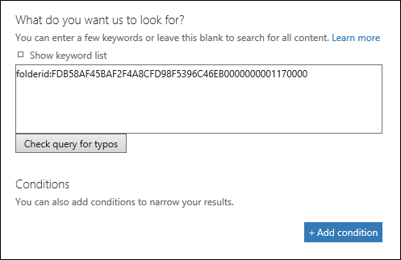

# <a name="use-content-search-in-office-365-for-targeted-collections"></a>Office 365 のコンテンツ検索を使用した対象コレクション

Office 365 セキュリティ&amp;コンプライアンスセンターのコンテンツ検索機能では、Exchange メールボックスまたは SharePoint および OneDrive for business サイトの特定のフォルダーを検索するための直接 UI を使用することはできません。ただし、実際の検索クエリ構文でフォルダー ID またはパスを指定すると、特定のフォルダー (*対象となるコレクション*と呼ばれる) を検索することができます。コンテンツ検索を使用して対象のコレクションを実行することは、特定のメールボックスまたはサイトフォルダーに、訴訟や権限のあるアイテムに応答するアイテムがあることを確信する場合に役立ちます。この記事に記載されているスクリプトを使用して、メールボックスフォルダーのフォルダー ID、または SharePoint および OneDrive for business サイト上のフォルダーのパスを取得できます。その後、検索クエリでフォルダー ID またはパスを使用して、フォルダー内にあるアイテムを返すことができます。
  
## <a name="before-you-begin"></a>はじめに

- 手順1でスクリプトを実行するには、セキュリティ&amp;コンプライアンスセンターの電子情報開示マネージャーの役割グループのメンバーである必要があります。詳細については、「 [Office 365 セキュリティ&amp;コンプライアンスセンターで電子情報開示のアクセス許可を割り当てる](assign-ediscovery-permissions.md)」を参照してください。
    
    さらに、Exchange Online 組織内のメール受信者の役割を割り当てる必要があります。これは、手順1でスクリプトに含まれている**get-mailboxfolderstatistics**コマンドレットを実行するために必要です。既定では、メール受信者の役割は、Exchange Online の [組織の管理] および [受信者の管理] 役割グループに割り当てられます。Exchange Online でのアクセス許可の割り当ての詳細については、「[役割グループのメンバーの管理](https://go.microsoft.com/fwlink/p/?linkid=692102)」を参照してください。また、カスタム役割グループを作成し、メール受信者の役割を割り当ててから、手順1でスクリプトを実行する必要があるメンバーを追加することもできます。詳細については、「[役割グループの管理](https://go.microsoft.com/fwlink/p/?linkid=730688)」を参照してください。
    
- 手順1でスクリプトを実行するたびに、新しいリモート PowerShell セッションが作成されます。そのため、使用可能なすべてのリモート PowerShell セッションを使用できます。この問題が発生しないようにするには、次のコマンドを実行して、アクティブなリモート PowerShell セッションを切断します。
    
  ```
  Get-PSSession | Remove-PSSession
  ```

    詳細については、「[Exchange Online PowerShell への接続](https://go.microsoft.com/fwlink/p/?linkid=396554)」を参照してください。
    
- スクリプトには、最小限のエラー処理が含まれています。このスクリプトの主な目的は、コンテンツ検索の検索クエリ構文で対象のコレクションを実行するために使用できるメールボックスフォルダー id またはサイトパスの一覧をすばやく表示することです。
    
- このトピックで提供されているサンプルスクリプトは、Microsoft 標準サポートプログラムまたはサービスではサポートされていません。このサンプルスクリプトは、あらゆる種類の保証なしに提供されています。さらに、Microsoft は、商品性、または特定の目的に対する適合性を明示的に保証することを含め、すべての黙示の保証を放棄します。サンプルスクリプトおよびドキュメントの使用によって発生した、またはパフォーマンスの低下によって生じるリスク全体は、そのままになります。いかなる場合でも、Microsoft、その作成者、またはスクリプトの作成、運用、または配信に関係するユーザーは、いかなる損害 (たとえば、損失を含む損害、ビジネスの中断、損失が発生しても含む) に対して責任を負わないものとします。このような損害が発生する可能性が Microsoft から通知されている場合でも、サンプルのスクリプトまたはドキュメントの使用または使用できないことによって発生する、ビジネス情報、またはその他の pecuniary 損失。
  
## <a name="step-1-run-the-script-to-get-a-list-of-folders-for-a-mailbox-or-site"></a>手順 1: スクリプトを実行して、メールボックスまたはサイトのフォルダーの一覧を取得する

この最初の手順で実行するスクリプトは、メールボックスフォルダーまたは SharePoint または OneDrive for business フォルダーの一覧、および各フォルダーの対応するフォルダー ID またはパスを返します。このスクリプトを実行すると、次の情報を求めるメッセージが表示されます。
  
- **電子メールアドレスまたはサイトの URL**Exchange メールボックスフォルダーとフォルダー id の一覧を返すには、保管担当者の電子メールアドレスを入力します。または、指定したサイトのパスの一覧を返すには、SharePoint サイトまたは OneDrive for business サイトの URL を入力します。次に例を示します。 
    
  - **Exchange** -stacig@contoso.onmicrosoft.com 
    
  - **SharePoint** - https://contoso.sharepoint.com/sites/marketing 
    
  - **OneDrive for business** - https://contoso-my.sharepoint.com/personal/stacig_contoso_onmicrosoft_com 
    
- **ユーザーの資格情報**-スクリプトは、資格情報を使用して Exchange Online に接続&amp;し、リモート PowerShell を使用してセキュリティ/コンプライアンスセンターに接続します。前述のように、このスクリプトを正常に実行するには、適切なアクセス許可を割り当てる必要があります。
    
メールボックスフォルダーまたはサイトパス名の一覧を表示するには、次のようにします。
  
1. ファイル名サフィックス. ps1 を使用して、次のテキストを Windows PowerShell スクリプトファイルに保存します。たとえば、 `GetFolderSearchParameters.ps1`のようになります。
    
  ```
  #########################################################################################################
  # This PowerShell script will prompt you for:                             #
  #    * Admin credentials for a user who can run the Get-MailboxFolderStatistics cmdlet in Exchange    #
  #      Online and who is an eDiscovery Manager in the Security &amp; Compliance Center.           #
  # The script will then:                                           #
  #    * If an email address is supplied: list the folders for the target mailbox.          #
  #    * If a SharePoint or OneDrive for Business site is supplied: list the folder paths for the site. #
  #    * In both cases, the script supplies the correct search properties (folderid: or path:)      #
  #      appended to the folder ID or path ID to use in a Content Search.               #
  # Notes:                                              #
  #    * For SharePoint and OneDrive for Business, the paths are searched recursively; this means the   #
  #      the current folder and all sub-folders are searched.                       #
  #    * For Exchange, only the specified folder will be searched; this means sub-folders in the folder #
  #      will not be searched.  To search sub-folders, you need to use the specify the folder ID for    #
  #      each sub-folder that you want to search.                               #
  #    * For Exchange, only folders in the user's primary mailbox will be returned by the script.       #
  #########################################################################################################
  # Collect the target email address or SharePoint Url
  $addressOrSite = Read-Host "Enter an email address or a URL for a SharePoint or OneDrive for Business site"
  # Authenticate with Exchange Online and the Security &amp; Compliance Center (Exchange Online Protection - EOP)
  if (!$credentials)
  {
      $credentials = Get-Credential
  }
  if ($addressOrSite.IndexOf("@") -ige 0)
  {
      # List the folder Ids for the target mailbox
      $emailAddress = $addressOrSite
      # Authenticate with Exchange Online
      if (!$ExoSession)
      {
          $ExoSession = New-PSSession -ConfigurationName Microsoft.Exchange -ConnectionUri https://ps.outlook.com/powershell-liveid/ -Credential $credentials -Authentication Basic -AllowRedirection
          Import-PSSession $ExoSession -AllowClobber -DisableNameChecking
      }
      $folderQueries = @()
      $folderStatistics = Get-MailboxFolderStatistics $emailAddress
      foreach ($folderStatistic in $folderStatistics)
      {
          $folderId = $folderStatistic.FolderId;
          $folderPath = $folderStatistic.FolderPath;
          $encoding= [System.Text.Encoding]::GetEncoding("us-ascii")
          $nibbler= $encoding.GetBytes("0123456789ABCDEF");
          $folderIdBytes = [Convert]::FromBase64String($folderId);
          $indexIdBytes = New-Object byte[] 48;
          $indexIdIdx=0;
          $folderIdBytes | select -skip 23 -First 24 | %{$indexIdBytes[$indexIdIdx++]=$nibbler[$_ -shr 4];$indexIdBytes[$indexIdIdx++]=$nibbler[$_ -band 0xF]}
          $folderQuery = "folderid:$($encoding.GetString($indexIdBytes))";
          $folderStat = New-Object PSObject
          Add-Member -InputObject $folderStat -MemberType NoteProperty -Name FolderPath -Value $folderPath
          Add-Member -InputObject $folderStat -MemberType NoteProperty -Name FolderQuery -Value $folderQuery
          $folderQueries += $folderStat
      }
      Write-Host "-----Exchange Folders-----"
      $folderQueries |ft
  }
  elseif ($addressOrSite.IndexOf("http") -ige 0)
  {
      $searchName = "SPFoldersSearch"
      $searchActionName = "SPFoldersSearch_Preview"
      # List the folders for the SharePoint or OneDrive for Business Site
      $siteUrl = $addressOrSite
      # Authenticate with the Security &amp; Compliance Center
      if (!$SccSession)
      {
          $SccSession = New-PSSession -ConfigurationName Microsoft.Exchange -ConnectionUri https://ps.compliance.protection.outlook.com/powershell-liveid -Credential $credentials -Authentication Basic -AllowRedirection
          Import-PSSession $SccSession -AllowClobber -DisableNameChecking
      }
      # Clean-up, if the script was aborted, the search we created might not have been deleted.  Try to do so now.
      Remove-ComplianceSearch $searchName -Confirm:$false -ErrorAction 'SilentlyContinue'
      # Create a Content Search against the SharePoint Site or OneDrive for Business site and only search for folders; wait for the search to complete
      $complianceSearch = New-ComplianceSearch -Name $searchName -ContentMatchQuery "contenttype:folder" -SharePointLocation $siteUrl
      Start-ComplianceSearch $searchName
      do{
          Write-host "Waiting for search to complete..."
          Start-Sleep -s 5
          $complianceSearch = Get-ComplianceSearch $searchName
      }while ($complianceSearch.Status -ne 'Completed')
      if ($complianceSearch.Items -gt 0)
      {
          # Create a Compliance Search Action and wait for it to complete. The folders will be listed in the .Results parameter
          $complianceSearchAction = New-ComplianceSearchAction -SearchName $searchName -Preview
          do
          {
              Write-host "Waiting for search action to complete..."
              Start-Sleep -s 5
              $complianceSearchAction = Get-ComplianceSearchAction $searchActionName
          }while ($complianceSearchAction.Status -ne 'Completed')
          # Get the results and print out the folders
          $results = $complianceSearchAction.Results
          $matches = Select-String "Data Link:.+[,}]" -Input $results -AllMatches
          foreach ($match in $matches.Matches)
          {
              $rawUrl = $match.Value
              $rawUrl = $rawUrl -replace "Data Link: " -replace "," -replace "}"
              Write-Host "path:""$rawUrl"""
          }
      }
      else
      {
          Write-Host "No folders were found for $siteUrl"
      }
      Remove-ComplianceSearch $searchName -Confirm:$false -ErrorAction 'SilentlyContinue'
  }
  else
  {
      Write-Error "Couldn't recognize $addressOrSite as an email address or a site URL"
  }
  ```

2. ローカルコンピューターで、Windows PowerShell を開き、スクリプトを保存したフォルダーに移動します。
    
3. スクリプトを実行します。例えば：
    
      ```
      .\GetFolderSearchParameters.ps1
      ```

4. スクリプトによってプロンプトが表示される情報を入力します。
    
    スクリプトによって、指定したユーザーのメールボックスフォルダーまたはサイトフォルダーの一覧が表示されます。フォルダー ID またはパス名をコピーして、手順2で検索クエリに貼り付けることができるように、このウィンドウを開いておきます。
    
    > [!TIP]
    > コンピューター画面にフォルダーの一覧を表示する代わりに、スクリプトの出力をテキストファイルにリダイレクトすることができます。このファイルは、スクリプトが配置されているフォルダーに保存されます。たとえば、スクリプトの出力をテキストファイルにリダイレクトするには、手順 3 `.\GetFolderSearchParameters.ps1 > StacigFolderIds.txt`で次のコマンドを実行します。次に、ファイルからフォルダー ID またはパスをコピーして、検索クエリで使用できます。
  
### <a name="script-output-for-mailbox-folders"></a>メールボックスフォルダーのスクリプト出力

メールボックスフォルダー id を取得している場合、スクリプトはリモート PowerShell を使用して Exchange Online に接続し、 **MailboxFolderStatisics**コマンドレットを実行して、指定したメールボックスのフォルダーの一覧を表示します。メールボックス内のすべてのフォルダーについて、スクリプトによって、 **FolderPath**列にフォルダーの名前と、フォルダー ID が**folderquery**列に表示されます。また、スクリプトは**folderId** (メールボックスプロパティの名前) のプレフィックスをフォルダー ID に追加します。**folderid**プロパティは検索可能なプロパティであるため、手順`folderid:<folderid>` 2 の検索クエリでそのフォルダーを検索するために使用します。 
  
メールボックスフォルダーのスクリプトによって返される出力の例を次に示します。
  

  
手順2の例は、ユーザーの [回復可能なアイテム] フォルダー内の [削除] サブフォルダーを検索するために使用されるクエリを示しています。
  
### <a name="script-output-for-site-folders"></a>サイトフォルダーのスクリプト出力

SharePoint または OneDrive for business サイトからパスを取得している場合、スクリプトはリモート&amp; PowerShell を使用してセキュリティコンプライアンスセンターに接続し、サイトを検索する新しいコンテンツ検索を作成し、フォルダーの一覧を表示します。指定したサイトにあります。このスクリプトは、各フォルダーの名前を表示し、**パス**のプレフィックス (サイトプロパティの名前) をフォルダーの URL に追加します。**path**プロパティは検索可能なプロパティであるため、手順`path:<path>` 2 の検索クエリでそのフォルダーを検索するために使用します。 
  
サイトフォルダーのスクリプトによって返される出力の例を次に示します。
  

  
## <a name="step-2-use-a-folder-id-or-path-to-perform-a-targeted-collection"></a>手順 2: フォルダー ID またはパスを使用して対象のコレクションを実行する

特定のユーザーのフォルダー id またはパスの一覧を収集するスクリプトを実行した後、次の手順では、セキュリティ&amp;コンプライアンスセンターに移動して、特定のフォルダーを検索する新しいコンテンツ検索を作成します。`folderid:<folderid>`または、コンテンツ検索`path:<path>`キーワードボックスで構成した検索クエリで or プロパティを使用します (または、 **new-compliancesearch**コマンドレットを使用する場合は、 *contentmatchquery*パラメーターの値として指定します)。`folderid`または`path`プロパティを他の検索パラメーターまたは検索条件と組み合わせることができます。`folderid`または`path`プロパティのみをクエリに含める場合、検索では指定したフォルダーにあるすべてのアイテムが返されます。 
  
> [!NOTE]
> OneDrive の`path`場所を検索するためにプロパティを使用しても、検索結果には .png, tiff ファイル、.wav ファイルなどのメディアファイルは返されません。 
  
1. [https://protection.office.com](https://protection.office.com) に移動します。
    
2. 手順1でスクリプトの実行に使用したアカウントと資格情報を使用して、Office 365 にサインインします。
    
3. セキュリティ&amp; /コンプライアンスセンターの左側のウィンドウで、[**検索&amp;調査** \> **コンテンツ検索**] をクリックし**** 追加] アイコンをクリックします。
    
4. **[新規検索]** ページで、コンテンツ検索の名前を入力します。この名前は、組織内で固有である必要があります。 
    
5. [検索する**場所**] で、次のいずれかの操作を行います。メールボックスフォルダーまたはサイトフォルダーのどちらを検索しているかによって決まります。
    
    - [**検索する特定のメールボックスを選択する**] をクリックし、手順1でスクリプトを実行したときに指定したものと同じメールボックスを追加します。 
    
      または
    
    - [検索する**特定のサイトを選択する**] をクリックし、手順1でスクリプトを実行したときに指定したものと同じサイト URL を追加します。 
    
6. **[次へ]** をクリックします。
    
7. [**検索する内容を選択**してください] ページの [キーワード] ボックスに、 `folderid:<folderid>`手順`path:<path>` 1 でスクリプトによって返された値を貼り付けます。 
    
    たとえば、次のスクリーンショットのクエリは、ユーザーの回復可能なアイテムフォルダーのパージサブフォルダー内のアイテムを検索します (パージ`folderid`サブフォルダーのプロパティの値は、手順1のスクリーンショットに示されています)。
    
    
  
8. [**検索**] をクリックして、対象となるコレクション検索を開始します。 
  
### <a name="examples-of-search-queries-for-targeted-collections"></a>対象となるコレクションの検索クエリの例

ここでは、 `folderid`検索クエリで and `path`プロパティを使用して対象となるコレクションを実行する例をいくつか示します。プレースホルダーは、スペースを節約`folderid:<folderid>`する`path:<path>`ために使用されることに注意してください。 
  
- この例では、3つの異なるメールボックスフォルダーを検索します。同じようなクエリ構文を使用して、ユーザーの回復可能なアイテムフォルダー内の隠しフォルダーを検索することができます。
    
  ```
  folderid:<folderid> OR folderid:<folderid> OR folderid:<folderid>
  ```

- この例では、完全に一致する語句を含むアイテムをメールボックスフォルダーから検索します。
    
  ```
  folderid:<folderid> AND "Contoso financial results"
  ```

- 次の使用例は、タイトルに "NDA" という文字が含まれるドキュメントのサイトフォルダー (およびすべてのサブフォルダー) を検索します。
    
  ```
  path:<path> AND filename:nda
  ```

- この例では、日付の範囲内で変更されたドキュメントのサイトフォルダー (およびすべてのサブフォルダー) を検索します。
    
  ```
  path:<path> AND (lastmodifiedtime>=01/01/2017 AND lastmodifiedtime<=01/21/2017)
  ```
  
## <a name="more-information"></a>詳細情報

この記事に記載されているスクリプトを使用して対象のコレクションを実行する場合は、次の点に注意してください。
  
- このスクリプトでは、結果からフォルダーは削除されません。そのため、検索結果に表示される一部のフォルダーには、システムによって生成されるコンテンツが含まれているため、検索できない (または、0個のアイテムを返します) 場合が
    
- このスクリプトは、ユーザーのプライマリメールボックスのフォルダー情報のみを返します。ユーザーのアーカイブメールボックス内のフォルダーに関する情報は返されません。
    
- メールボックスフォルダーを検索する場合、指定されたフォルダー `folderid` (そのプロパティで識別される) のみが検索されます。サブフォルダーは検索されません。サブフォルダーを検索するには、検索するサブフォルダーのフォルダー ID を使用する必要があります。 
    
- サイトフォルダーを検索すると、その`path`フォルダー (プロパティによって識別される) とすべてのサブフォルダーが検索されます。 
    
- 前述したように、プロパティ`path`を使用して、.png、tiff、.wav ファイルなどのメディアファイルを OneDrive の場所に配置することはできません。OneDrive フォルダーのメディアファイルを検索するには、別の[サイトプロパティ](keyword-queries-and-search-conditions.md#searchable-site-properties)を使用します。 

- 検索クエリで指定した`folderid`プロパティのみを使用した検索の結果をエクスポートする場合は、[最初のエクスポート] オプションを選択できます。「すべてのアイテム、認識できない形式のすべてのアイテム、暗号化されている、またはその他の理由でインデックスが作成されていません」というオプションがあります。フォルダー内のすべてのアイテムは、常にインデックス作成の状態にかかわらずエクスポートされます。フォルダー ID には常にインデックスが付けられています。
