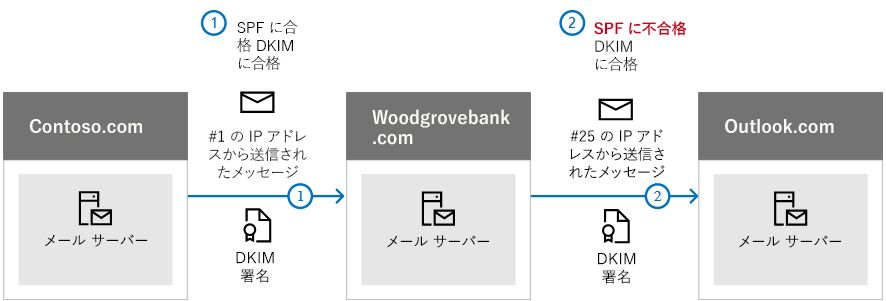

# <a name="use-dkim-to-validate-outbound-email-sent-from-your-custom-domain-in-office-365"></a><span data-ttu-id="6a2a1-103">DKIM を使用して、Office 365 のカスタム ドメインから送信される送信電子メールを検証する</span><span class="sxs-lookup"><span data-stu-id="6a2a1-103">Use DKIM to validate outbound email sent from your custom domain in Office 365</span></span>

 <span data-ttu-id="6a2a1-104">**概要:** この記事では、Office 365 で domainkeys 識別メール (dkim) を使用して、宛先の電子メールシステムが、カスタムドメインから送信されたメッセージを信頼するようにする方法について説明します。</span><span class="sxs-lookup"><span data-stu-id="6a2a1-104">**Summary:** This article describes how you use DomainKeys Identified Mail (DKIM) with Office 365 to ensure that destination email systems trust messages sent outbound from your custom domain.</span></span> 
  
<span data-ttu-id="6a2a1-p101">ドメインから送信されたように見えるメッセージをなりすまし者が送信できないようにするためには、SPF と DMARC に加え、DKIM を使用する必要があります。DKIM では、電子メール メッセージのメッセージ ヘッダー内にデジタル署名を追加することができます。複雑そうに思えますが、まったく複雑ではありません。DKIM の構成時に、関連付けるドメインを承認するか、暗号化認証を使用して電子メール メッセージにその名前を署名します。ドメインから電子メールを受信する電子メール システムでは、このデジタル署名を使用して、受け取った受信メールが正当であるかどうかを判断することができます。</span><span class="sxs-lookup"><span data-stu-id="6a2a1-p101">You should use DKIM in addition to SPF and DMARC to help prevent spoofers from sending messages that look like they are coming from your domain. DKIM lets you add a digital signature to email messages in the message header. Sounds complicated, but it's really not. When you configure DKIM, you authorize your domain to associate, or sign, its name to an email message by using cryptographic authentication. Email systems that receive email from your domain can use this digital signature to help determine if incoming email that they receive is legitimate.</span></span>
  
<span data-ttu-id="6a2a1-p102">基本的には、秘密キーを使用してドメインの送信メールのヘッダーを暗号化します。受信側サーバーが署名のデコードに使用できるドメインの DNS レコードに、公開キーを発行します。公開キーを使用することで、そのメッセージが送信者本人からのものであり、ドメイン偽装をしている他人からのものでないことを確認します。</span><span class="sxs-lookup"><span data-stu-id="6a2a1-p102">Basically, you use a private key to encrypt the header in your domain's outgoing email. You publish a public key to your domain's DNS records that receiving servers can then use to decode the signature. They use the public key to verify that the messages are really coming from you and not coming from someone spoofing your domain.</span></span>
  
<span data-ttu-id="6a2a1-p103">Office 365 は初期ドメインに DKIM を自動的にセットアップします。初期ドメインは、ユーザーが contoso.onmicrosoft.com などのサービスにサインアップしたときに、Office 365 が自動的に作成したドメインです。ユーザーは、初期ドメインに対する DKIM のセットアップに関して何も行う必要はありません。ドメインの詳細については、「[ドメインに関する FAQ](https://support.office.com/article/Domains-FAQ-1272bad0-4bd4-4796-8005-67d6fb3afc5a#bkmk_whydoihaveanonmicrosoft.comdomain)」を参照してください。</span><span class="sxs-lookup"><span data-stu-id="6a2a1-p103">Office 365 automatically sets up DKIM for initial domains. The initial domain is the domain that Office 365 created for you when you signed up with the service, for example, contoso.onmicrosoft.com. You don't need to do anything to set up DKIM for your initial domain. For more information about domains, see [Domains FAQ](https://support.office.com/article/Domains-FAQ-1272bad0-4bd4-4796-8005-67d6fb3afc5a#bkmk_whydoihaveanonmicrosoft.comdomain).</span></span>
  
<span data-ttu-id="6a2a1-p104">カスタム ドメインの DKIM に関しても、何も操作しなくて構いません。カスタム ドメインに対して DKIM を設定しない場合、Office 365 が秘密キーと公開キーのペアを作成して、DKIM 署名を有効にし、カスタム ドメインに対して Office 365 の既定ポリシーを構成します。ほとんどの Office 365 ユーザーの場合はこれで十分ですが、次の状況ではカスタム ドメインの DKIM を手動で構成する必要があります。</span><span class="sxs-lookup"><span data-stu-id="6a2a1-p104">You can choose to do nothing about DKIM for your custom domain too. If you do not set up DKIM for your custom domain, Office 365 creates a private and public key pair, enables DKIM signing, and then configures the Office 365 default policy for your custom domain. While this is sufficient coverage for most Office 365 customers, you should manually configure DKIM for your custom domain in the following circumstances:</span></span>
  
- <span data-ttu-id="6a2a1-120">Office 365 に複数のカスタム ドメインがある場合</span><span class="sxs-lookup"><span data-stu-id="6a2a1-120">You have more than one custom domain in Office 365</span></span>
    
- <span data-ttu-id="6a2a1-121">DMARC も設定する場合 (推奨)</span><span class="sxs-lookup"><span data-stu-id="6a2a1-121">You're going to set up DMARC too (recommended)</span></span>
    
- <span data-ttu-id="6a2a1-122">秘密キーを制御する場合</span><span class="sxs-lookup"><span data-stu-id="6a2a1-122">You want control over your private key</span></span>
    
- <span data-ttu-id="6a2a1-123">CNAME レコードをカスタマイズする場合</span><span class="sxs-lookup"><span data-stu-id="6a2a1-123">You want to customize your CNAME records</span></span>
    
- <span data-ttu-id="6a2a1-124">たとえば、サード パーティ製の大容量メーラーを使用する場合、サードパーティのドメインから発信される電子メールに DKIM キーを設定することがあります。</span><span class="sxs-lookup"><span data-stu-id="6a2a1-124">You want to set up DKIM keys for email originating out of a third-party domain, for example, if you use a third-party bulk mailer.</span></span>
    
<span data-ttu-id="6a2a1-125">この記事の内容</span><span class="sxs-lookup"><span data-stu-id="6a2a1-125">In this article:</span></span>
  
- [<span data-ttu-id="6a2a1-126">Office 365 での悪意のあるスプーフィング防止の点で DKIM のしくみが SPF 単独よりも優れているといえる理由</span><span class="sxs-lookup"><span data-stu-id="6a2a1-126">How DKIM works better than SPF alone to prevent malicious spoofing in Office 365</span></span>](use-dkim-to-validate-outbound-email.md#HowDKIMWorks)
    
- [<span data-ttu-id="6a2a1-127">Office 365 で DKIM を手動でセットアップする方法</span><span class="sxs-lookup"><span data-stu-id="6a2a1-127">What you need to do to manually set up DKIM in Office 365</span></span>](use-dkim-to-validate-outbound-email.md#SetUpDKIMO365)
    
- [<span data-ttu-id="6a2a1-128">Office 365 で DKIM の複数のドメインを構成するには</span><span class="sxs-lookup"><span data-stu-id="6a2a1-128">To configure DKIM for more than one custom domain in Office 365</span></span>](use-dkim-to-validate-outbound-email.md#DKIMMultiDomain)
    
- [<span data-ttu-id="6a2a1-129">Office 365 でカスタム ドメインの DKIM 署名ポリシーを無効にする</span><span class="sxs-lookup"><span data-stu-id="6a2a1-129">Disabling the DKIM signing policy for a custom domain in Office 365</span></span>](use-dkim-to-validate-outbound-email.md#DisableDKIMSigningPolicy)
    
- [<span data-ttu-id="6a2a1-130">DKIM と Office 365 の既定の動作</span><span class="sxs-lookup"><span data-stu-id="6a2a1-130">Default behavior for DKIM and Office 365</span></span>](use-dkim-to-validate-outbound-email.md#DefaultDKIMbehavior)
    
- [<span data-ttu-id="6a2a1-131">サードパーティのサービスがカスタム ドメインに代わって電子メールを送信つまり偽装できるように DKIM を設定する</span><span class="sxs-lookup"><span data-stu-id="6a2a1-131">Set up DKIM so that a third-party service can send, or spoof, email on behalf of your custom domain</span></span>](use-dkim-to-validate-outbound-email.md#SetUp3rdPartyspoof)
    
- [<span data-ttu-id="6a2a1-132">次の手順: Office 365 に SPF をセットアップした後</span><span class="sxs-lookup"><span data-stu-id="6a2a1-132">Next steps: After you set up DKIM for Office 365</span></span>](use-dkim-to-validate-outbound-email.md#DKIMNextSteps)
    
## <a name="how-dkim-works-better-than-spf-alone-to-prevent-malicious-spoofing-in-office-365"></a><span data-ttu-id="6a2a1-133">Office 365 での悪意のあるスプーフィング防止の点で DKIM のしくみが SPF 単独よりも優れているといえる理由</span><span class="sxs-lookup"><span data-stu-id="6a2a1-133">How DKIM works better than SPF alone to prevent malicious spoofing in Office 365</span></span>
<span data-ttu-id="6a2a1-134"><a name="HowDKIMWorks"> </a></span><span class="sxs-lookup"><span data-stu-id="6a2a1-134"></span></span>

<span data-ttu-id="6a2a1-p105">SPF ではメッセージ エンベロープに情報を追加しますが、DKIM は実際にメッセージ ヘッダー内の署名を暗号化します。メッセージを転送すると、そのメッセージのエンベロープの一部が転送サーバーによって取り除かれる可能性があります。デジタル署名は、電子メール ヘッダーの一部であるため、電子メール メッセージと共に残ります。したがって、DKIM はメッセージが転送された場合にも機能します。次の例で説明します。</span><span class="sxs-lookup"><span data-stu-id="6a2a1-p105">SPF adds information to a message envelope but DKIM actually encrypts a signature within the message header. When you forward a message, portions of that message's envelope can be stripped away by the forwarding server. Since the digital signature stays with the email message because it's part of the email header, DKIM works even when a message has been forwarded as shown in the following example.</span></span>
  

  
<span data-ttu-id="6a2a1-p106">この例で、ドメインに対して SPF TXT レコードしか発行しなかったとしたら、受信者のメール サーバーによってメールがスパムとしてマークされ、誤検知の結果になる可能性があります。このシナリオでは DKIM を追加することによって、誤検知のスパム報告が減少しています。DKIM は、IP アドレスだけではなく、公開キー暗号化を使って認証を行うので、SPF よりもはるかに強力な認証形態といえます。展開では DMARC だけでなく、SPF と DKIM の両方を使うことをお勧めします。</span><span class="sxs-lookup"><span data-stu-id="6a2a1-p106">In this example, if you had only published an SPF TXT record for your domain, the recipient's mail server could have marked your email as spam and generated a false positive result. The addition of DKIM in this scenario reduces false positive spam reporting. Because DKIM relies on public key cryptography to authenticate and not just IP addresses, DKIM is considered a much stronger form of authentication than SPF. We recommend using both SPF and DKIM, as well as DMARC in your deployment.</span></span>
  
<span data-ttu-id="6a2a1-p107">基本事項:DKIM では秘密キーを使用して、暗号化された署名をメッセージ ヘッダーに挿入します。署名ドメイン、つまり送信ドメインは、**d=** フィールドの値としてヘッダーに挿入されます。確認ドメイン、つまり受信者のドメインは、**d=** フィールドを使用して、DNS から公開キーを検索し、メッセージを認証します。メッセージが確認されれば、DKIM チェックは合格です。</span><span class="sxs-lookup"><span data-stu-id="6a2a1-p107">The nitty gritty: DKIM uses a private key to insert an encrypted signature into the message headers. The signing domain, or outbound domain, is inserted as the value of the **d=** field in the header. The verifying domain, or recipient's domain, then use the **d=** field to look up the public key from DNS and authenticate the message. If the message is verified, the DKIM check passes.</span></span> 
  
## <a name="what-you-need-to-do-to-manually-set-up-dkim-in-office-365"></a><span data-ttu-id="6a2a1-147">Office 365 で DKIM を手動でセットアップする方法</span><span class="sxs-lookup"><span data-stu-id="6a2a1-147">What you need to do to manually set up DKIM in Office 365</span></span>
<span data-ttu-id="6a2a1-148"><a name="SetUpDKIMO365"> </a></span><span class="sxs-lookup"><span data-stu-id="6a2a1-148"></span></span>

<span data-ttu-id="6a2a1-149">DKIM を構成するには、次の手順を完了します。</span><span class="sxs-lookup"><span data-stu-id="6a2a1-149">To configure DKIM, you will complete these steps:</span></span>
  
- [<span data-ttu-id="6a2a1-150">DNS でカスタム ドメインに対して 2 つの CNAME レコードを発行する</span><span class="sxs-lookup"><span data-stu-id="6a2a1-150">Publish two CNAME records for your custom domain in DNS</span></span>](use-dkim-to-validate-outbound-email.md#Publish2CNAME)
    
- [<span data-ttu-id="6a2a1-151">Office 365 でカスタム ドメインに対して DKIM 署名を有効にする</span><span class="sxs-lookup"><span data-stu-id="6a2a1-151">Enable DKIM signing for your custom domain in Office 365</span></span>](use-dkim-to-validate-outbound-email.md#EnableDKIMinO365)
    
### <a name="publish-two-cname-records-for-your-custom-domain-in-dns"></a><span data-ttu-id="6a2a1-152">DNS でカスタム ドメインに対して 2 つの CNAME レコードを発行する</span><span class="sxs-lookup"><span data-stu-id="6a2a1-152">Publish two CNAME records for your custom domain in DNS</span></span>
<span data-ttu-id="6a2a1-153"><a name="Publish2CNAME"> </a></span><span class="sxs-lookup"><span data-stu-id="6a2a1-153"></span></span>

<span data-ttu-id="6a2a1-154">DNS の DKIM 署名を追加する各ドメインに対して、2 つの CNAME レコードを発行する必要があります。</span><span class="sxs-lookup"><span data-stu-id="6a2a1-154">For each domain for which you want to add a DKIM signature in DNS, you need to publish two CNAME records.</span></span> <span data-ttu-id="6a2a1-155">CNAME レコードは、ドメインの 正規名が別のドメイン名のエイリアスであることを指定するために DNS によって使用されます。</span><span class="sxs-lookup"><span data-stu-id="6a2a1-155">A CNAME record is used by DNS to specify that the canonical name of a domain is an alias for another domain name.</span></span> <span data-ttu-id="6a2a1-156">CNAME レコードは、カスタマイズしたドメインのパブリックに使用可能な DNS サーバー上に作成する必要があります。</span><span class="sxs-lookup"><span data-stu-id="6a2a1-156">The CNAME records should be created on the publicly available DNS servers for your customized domains.</span></span> <span data-ttu-id="6a2a1-157">dns の CNAME レコードは、Office 365 用の Microsoft dns サーバー上の dns に存在するレコードが既に作成されていることを指します。</span><span class="sxs-lookup"><span data-stu-id="6a2a1-157">The CNAME records in your DNS will point to already created A records that exist in DNS on the Microsoft DNS servers for Office 365.</span></span>
  
 <span data-ttu-id="6a2a1-p109">Office 365 は、発行された 2 つのレコードを使用して自動的にキーの交換を実行します。Office 365 の初期ドメインに加えてプロビジョニングされたカスタム ドメインがある場合には、追加の各ドメインに対して 2 つの CNAME レコードを発行する必要があります。したがって、2 つのドメインがある場合は、さらに 2 つの CNAME レコードを発行するなどの操作が必要になります。</span><span class="sxs-lookup"><span data-stu-id="6a2a1-p109">Office 365 performs automatic key rotation using the two records that you establish. If you have provisioned custom domains in addition to the initial domain in Office 365, you must publish two CNAME records for each additional domain. So, if you have two domains, you must publish two additional CNAME records, and so on.</span></span>
  
<span data-ttu-id="6a2a1-161">CNAME レコードには、次の形式を使用します。</span><span class="sxs-lookup"><span data-stu-id="6a2a1-161">Use the following format for the CNAME records.</span></span>

> [!IMPORTANT]
> <span data-ttu-id="6a2a1-162">使用している GCC の数が多いお客様の場合は、 _domainguid_を異なるものとして計算します。</span><span class="sxs-lookup"><span data-stu-id="6a2a1-162">If you are one of our GCC High customers, we calculate _domainGuid_ differently!</span></span> <span data-ttu-id="6a2a1-163">_domainguid_を計算するために_initialdomain_の MX レコードを検索する代わりに、カスタマイズしたドメインから直接計算します。</span><span class="sxs-lookup"><span data-stu-id="6a2a1-163">Instead of looking up the MX record for your _initialDomain_ to calculate _domainGuid_, instead we calculate it directly from the customized domain.</span></span> <span data-ttu-id="6a2a1-164">たとえば、カスタマイズしたドメインが "contoso.com" の場合、domainguid は "contoso-com" になり、ピリオドはすべてダッシュに置き換えられます。</span><span class="sxs-lookup"><span data-stu-id="6a2a1-164">For example, if your customized domain is “contoso.com” your domainGuid becomes “contoso-com”, any periods are replaced with a dash.</span></span> <span data-ttu-id="6a2a1-165">そのため、initialdomain が指している MX レコードに関係なく、常に上記の方法を使用して、CNAME レコードで使用する domainguid を計算します。</span><span class="sxs-lookup"><span data-stu-id="6a2a1-165">So, regardless of what MX record your initialDomain points to, you’ll always use the above method to calculate the domainGuid to use in your CNAME records.</span></span>

  
```
Host name:          selector1._domainkey
Points to address or value: selector1-<domainGUID>._domainkey.<initialDomain> 
TTL:                3600

Host name:          selector2._domainkey
Points to address or value: selector2-<domainGUID>._domainkey.<initialDomain> 
TTL:                3600
```

<span data-ttu-id="6a2a1-166">ここで、</span><span class="sxs-lookup"><span data-stu-id="6a2a1-166">Where:</span></span>
  
- <span data-ttu-id="6a2a1-167">Office 365 では、セレクターは常に "selector1" または "selector2" になります。</span><span class="sxs-lookup"><span data-stu-id="6a2a1-167">For Office 365, the selectors will always be "selector1" or "selector2".</span></span> 
    
- <span data-ttu-id="6a2a1-168">_domainguid_は、mail.protection.outlook.com の前に表示されるカスタムドメインのカスタマイズされた MX レコードの_domainguid_と同じです。</span><span class="sxs-lookup"><span data-stu-id="6a2a1-168">_domainGUID_ is the same as the _domainGUID_ in the customized MX record for your custom domain that appears before mail.protection.outlook.com.</span></span> <span data-ttu-id="6a2a1-169">たとえば、ドメイン contoso.com の次の MX レコードでは、 _domainguid_は contoso-com です。</span><span class="sxs-lookup"><span data-stu-id="6a2a1-169">For example, in the following MX record for the domain contoso.com, the _domainGUID_ is contoso-com:</span></span> 
    
    ```
    contoso.com.  3600  IN  MX   5 contoso-com.mail.protection.outlook.com
    ```

- <span data-ttu-id="6a2a1-170">_initialDomain_ は、Office 365 にサインアップしたときに使用したドメインです。</span><span class="sxs-lookup"><span data-stu-id="6a2a1-170">_initialDomain_ is the domain that you used when you signed up for Office 365.</span></span> <span data-ttu-id="6a2a1-171">最初のドメインは常に onmicrosoft.com で終了します。</span><span class="sxs-lookup"><span data-stu-id="6a2a1-171">Initial domains always end in onmicrosoft.com.</span></span> <span data-ttu-id="6a2a1-172">初期ドメインを決定する方法の詳細については、「 [ドメインに関する FAQ](https://support.office.com/article/1272bad0-4bd4-4796-8005-67d6fb3afc5a#bkmk_whydoihaveanonmicrosoft.comdomain)」を参照してください。</span><span class="sxs-lookup"><span data-stu-id="6a2a1-172">For information about determining your initial domain, see [Domains FAQ](https://support.office.com/article/1272bad0-4bd4-4796-8005-67d6fb3afc5a#bkmk_whydoihaveanonmicrosoft.comdomain).</span></span>
    
<span data-ttu-id="6a2a1-173">たとえば、初期ドメイン (cohovineyardandwinery.onmicrosoft.com) と 2 つのカスタム ドメイン (cohovineyard.com と cohowinery.com) がある場合は、追加のそれぞれのドメインに対して 2 つの CNAME レコードをセットアップして、合計で 4 つの CNAME レコードをセットアップする必要があります。</span><span class="sxs-lookup"><span data-stu-id="6a2a1-173">For example, if you have an initial domain of cohovineyardandwinery.onmicrosoft.com, and two custom domains cohovineyard.com and cohowinery.com, you would need to set up two CNAME records for each additional domain, for a total of four CNAME records.</span></span>
  
```
Host name:          selector1._domainkey
Points to address or value: **selector1-cohovineyard-com**._domainkey.cohovineyardandwinery.onmicrosoft.com
TTL:                3600

Host name:          selector2._domainkey
Points to address or value: **selector2-cohovineyard-com**._domainkey.cohovineyardandwinery.onmicrosoft.com
TTL:                3600

Host name:          selector1._domainkey
Points to address or value: **selector1-cohowinery-com**._domainkey.cohovineyardandwinery.onmicrosoft.com 
TTL:                3600
 
Host name:          selector2._domainkey
Points to address or value: **selector2-cohowinery-com**._domainkey.cohovineyardandwinery.onmicrosoft.com 
TTL:                3600
```

### <a name="enable-dkim-signing-for-your-custom-domain-in-office-365"></a><span data-ttu-id="6a2a1-174">Office 365 でカスタム ドメインに対して DKIM 署名を有効にする</span><span class="sxs-lookup"><span data-stu-id="6a2a1-174">Enable DKIM signing for your custom domain in Office 365</span></span>
<span data-ttu-id="6a2a1-175"><a name="EnableDKIMinO365"> </a></span><span class="sxs-lookup"><span data-stu-id="6a2a1-175"></span></span>

<span data-ttu-id="6a2a1-p113">DNS に CNAME レコードを発行したら、Office 365 で DKIM 署名を有効にする準備が整ったことになります。これは、Office 365 管理センターか、PowerShell を使用して行うことができます。</span><span class="sxs-lookup"><span data-stu-id="6a2a1-p113">Once you have published the CNAME records in DNS, you are ready to enable DKIM signing through Office 365. You can do this either through the Office 365 admin center or by using PowerShell.</span></span>
  
#### <a name="to-enable-dkim-signing-for-your-custom-domain-through-the-office-365-admin-center"></a><span data-ttu-id="6a2a1-178">Office 365 管理センター経由でカスタム ドメインの DKIM 署名を有効にするには</span><span class="sxs-lookup"><span data-stu-id="6a2a1-178">To enable DKIM signing for your custom domain through the Office 365 admin center</span></span>

1. <span data-ttu-id="6a2a1-179">[Office 365 へのサインイン](https://support.office.microsoft.com/article/e9eb7d51-5430-4929-91ab-6157c5a050b4)、職場または学校のアカウントを使用します。</span><span class="sxs-lookup"><span data-stu-id="6a2a1-179">[Sign in to Office 365](https://support.office.microsoft.com/article/e9eb7d51-5430-4929-91ab-6157c5a050b4) with your work or school account.</span></span> 
    
2. <span data-ttu-id="6a2a1-180">左上隅にあるアプリ起動ツールのアイコンを選択し、 **[管理]** をクリックします。</span><span class="sxs-lookup"><span data-stu-id="6a2a1-180">Select the app launcher icon in the upper-left and choose **Admin**.</span></span>
    
3. <span data-ttu-id="6a2a1-181">左下のナビゲーションで、 **[管理者]** を展開し、 **[Exchange]** を選択します。</span><span class="sxs-lookup"><span data-stu-id="6a2a1-181">In the lower-left navigation, expand **Admin** and choose **Exchange**.</span></span>
    
4. <span data-ttu-id="6a2a1-182">**[保護]** \> **[dkim]** の順に移動します。</span><span class="sxs-lookup"><span data-stu-id="6a2a1-182">Go to **Protection** \> **dkim**.</span></span>
    
5. <span data-ttu-id="6a2a1-p114">DKIM を有効にするドメインを選択してから、 **[このドメインのメッセージに DKIM 署名で署名する]** で **[有効]** を選択します。各カスタム ドメインにこの手順を繰り返します。</span><span class="sxs-lookup"><span data-stu-id="6a2a1-p114">Select the domain for which you want to enable DKIM and then, for **Sign messages for this domain with DKIM signatures**, choose **Enable**. Repeat this step for each custom domain.</span></span>
    
#### <a name="to-enable-dkim-signing-for-your-custom-domain-by-using-powershell"></a><span data-ttu-id="6a2a1-185">PowerShell を使用してカスタム ドメインの DKIM 署名を有効にするには</span><span class="sxs-lookup"><span data-stu-id="6a2a1-185">To enable DKIM signing for your custom domain by using PowerShell</span></span>

1. <span data-ttu-id="6a2a1-186">[Exchange Online PowerShell に接続します](https://technet.microsoft.com/library/jj984289.aspx)。</span><span class="sxs-lookup"><span data-stu-id="6a2a1-186">[Connect to Exchange Online PowerShell](https://technet.microsoft.com/library/jj984289.aspx).</span></span>
    
2. <span data-ttu-id="6a2a1-187">次のコマンドを実行します。</span><span class="sxs-lookup"><span data-stu-id="6a2a1-187">Run the following command:</span></span>
    
    ```
    New-DkimSigningConfig -DomainName <domain> -Enabled $true
    ```

   <span data-ttu-id="6a2a1-188">ここで、 _domain_は、dkim 署名を有効にするカスタムドメインの名前です。</span><span class="sxs-lookup"><span data-stu-id="6a2a1-188">Where _domain_ is the name of the custom domain that you want to enable DKIM signing for.</span></span> 
    
   <span data-ttu-id="6a2a1-189">たとえば、ドメイン名 contoso.com の場合は次のようになります。</span><span class="sxs-lookup"><span data-stu-id="6a2a1-189">For example, for the domain contoso.com:</span></span>
    
    ```
    New-DkimSigningConfig -DomainName contoso.com -Enabled $true
    ```

#### <a name="to-confirm-dkim-signing-is-configured-properly-for-office-365"></a><span data-ttu-id="6a2a1-190">DKIM 署名が Office 365 に対して適切に構成されていることを確認するには</span><span class="sxs-lookup"><span data-stu-id="6a2a1-190">To Confirm DKIM signing is configured properly for Office 365</span></span>

<span data-ttu-id="6a2a1-p115">数分待ってから、これらの手順に従って、DKIM が適切に構成されていることを確認してください。待っている間に、ドメインに関する DKIM 情報がネットワーク全体に広まります。</span><span class="sxs-lookup"><span data-stu-id="6a2a1-p115">Wait a few minutes before you follow these steps to confirm that you have properly configured DKIM. This allows time for the DKIM information about the domain to be spread throughout the network.</span></span>
  
- <span data-ttu-id="6a2a1-193">Office 365 の DKIM が有効になっているドメイン内のアカウントから、Outlook.com や Hotmail.com などの別の電子メール アカウントにメッセージを送信します。</span><span class="sxs-lookup"><span data-stu-id="6a2a1-193">Send a message from an account within your Office 365 DKIM-enabled domain to another email account such as outlook.com or Hotmail.com.</span></span>
    
- <span data-ttu-id="6a2a1-p116">テスト目的には .aol.com アカウントは使用しないでください。AOL は SPF チェックに合格すると、DKIM チェックをスキップする場合があります。この場合、テストは成り立ちません。</span><span class="sxs-lookup"><span data-stu-id="6a2a1-p116">Do not use an aol.com account for testing purposes. AOL may skip the DKIM check if the SPF check passes. This will nullify your test.</span></span>
    
- <span data-ttu-id="6a2a1-p117">メッセージを開き、ヘッダーを確認します。メッセージのヘッダーを表示する方法は、メッセージング クライアントによって異なります。Outlook でメッセージ ヘッダーを表示する方法については、「[電子メール メッセージ ヘッダーを表示する](https://support.office.com/article/CD039382-DC6E-4264-AC74-C048563D212C)」をご覧ください。</span><span class="sxs-lookup"><span data-stu-id="6a2a1-p117">Open the message and look at the header. Instructions for viewing the header for the message will vary depending on your messaging client. For instructions on viewing message headers in Outlook, see [View e-mail message headers](https://support.office.com/article/CD039382-DC6E-4264-AC74-C048563D212C).</span></span>

  <span data-ttu-id="6a2a1-p118">DKIM 署名されたメッセージには、CNAME エントリの発行時に定義したホスト名とドメインが含まれます。メッセージは、次の例のようになります。</span><span class="sxs-lookup"><span data-stu-id="6a2a1-p118">The DKIM-signed message will contain the host name and domain you defined when you published the CNAME entries. The message will look something like this example:</span></span> 
    
    ```
    From: Example User <example@contoso.com> 
    DKIM-Signature: v=1; a=rsa-sha256; q=dns/txt; c=relaxed/relaxed; 
        s=selector1; d=contoso.com; t=1429912795; 
        h=From:To:Message-ID:Subject:MIME-Version:Content-Type; 
        bh=<body hash>; 
        b=<signed field>;
    ```

- <span data-ttu-id="6a2a1-p119">認証結果のヘッダーを確認します。各受信側のサービスでは受信メールのスタンプに若干異なる形式が使用されますが、結果には **DKIM=pass** や **DKIM=OK** などが含まれている必要があります。</span><span class="sxs-lookup"><span data-stu-id="6a2a1-p119">Look for the Authentication-Results header. While each receiving service uses a slightly different format to stamp the incoming mail, the result should include something like **DKIM=pass** or **DKIM=OK**.</span></span> 
    
## <a name="to-configure-dkim-for-more-than-one-custom-domain-in-office-365"></a><span data-ttu-id="6a2a1-204">Office 365 で DKIM の複数のドメインを構成するには</span><span class="sxs-lookup"><span data-stu-id="6a2a1-204">To configure DKIM for more than one custom domain in Office 365</span></span>
<span data-ttu-id="6a2a1-205"><a name="DKIMMultiDomain"> </a></span><span class="sxs-lookup"><span data-stu-id="6a2a1-205"></span></span>

<span data-ttu-id="6a2a1-p120">後で別のカスタム ドメインを追加して、その新しいドメインに対して DKIM を有効にする場合は、各ドメインに対してこの記事の手順を完了する必要があります。具体的には、「[Office 365 で DKIM を手動でセットアップする方法](use-dkim-to-validate-outbound-email.md#SetUpDKIMO365)」のすべての手順を完了します。</span><span class="sxs-lookup"><span data-stu-id="6a2a1-p120">If at some point in the future you decide to add another custom domain and you want to enable DKIM for the new domain, you must complete the steps in this article for each domain. Specifically, complete all steps in [What you need to do to manually set up DKIM in Office 365](use-dkim-to-validate-outbound-email.md#SetUpDKIMO365).</span></span>
  
## <a name="disabling-the-dkim-signing-policy-for-a-custom-domain-in-office-365"></a><span data-ttu-id="6a2a1-208">Office 365 でカスタム ドメインの DKIM 署名ポリシーを無効にする</span><span class="sxs-lookup"><span data-stu-id="6a2a1-208">Disabling the DKIM signing policy for a custom domain in Office 365</span></span>
<span data-ttu-id="6a2a1-209"><a name="DisableDKIMSigningPolicy"> </a></span><span class="sxs-lookup"><span data-stu-id="6a2a1-209"></span></span>

<span data-ttu-id="6a2a1-p121">署名ポリシーを無効にしても、DKIM は完全には無効になりません。一定の期間が経過すると、Office 365 はドメインの既定の Office 365 ポリシーを自動的に適用します。詳細については、「[DKIM と Office 365 の既定の動作](use-dkim-to-validate-outbound-email.md#DefaultDKIMbehavior)」を参照してください。</span><span class="sxs-lookup"><span data-stu-id="6a2a1-p121">Disabling the signing policy does not completely disable DKIM. After a period of time, Office 365 will automatically apply the default Office 365 policy for your domain. For more information, see [Default behavior for DKIM and Office 365](use-dkim-to-validate-outbound-email.md#DefaultDKIMbehavior).</span></span>
  
### <a name="to-disable-the-dkim-signing-policy-by-using-windows-powershell"></a><span data-ttu-id="6a2a1-213">Windows PowerShell を使用して DKIM 署名ポリシーを無効にするには</span><span class="sxs-lookup"><span data-stu-id="6a2a1-213">To disable the DKIM signing policy by using Windows PowerShell</span></span>

1. <span data-ttu-id="6a2a1-214">[Exchange Online PowerShell に接続します](https://technet.microsoft.com/library/jj984289.aspx)。</span><span class="sxs-lookup"><span data-stu-id="6a2a1-214">[Connect to Exchange Online PowerShell](https://technet.microsoft.com/library/jj984289.aspx).</span></span>
    
2. <span data-ttu-id="6a2a1-215">DKIM 署名を無効にする各ドメインに対して次のいずれかのコマンドを実行します。</span><span class="sxs-lookup"><span data-stu-id="6a2a1-215">Run one of the following commands for each domain for which you want to disable DKIM signing.</span></span>
    
    ```
    $p=Get-DkimSigningConfig -identity <domain>
    $p[0] | set-DkimSigningConfig -enabled $false
    ```

   <span data-ttu-id="6a2a1-216">次に例を示します。</span><span class="sxs-lookup"><span data-stu-id="6a2a1-216">For example:</span></span>
    
    ```
    $p=Get-DkimSigningConfig -identity contoso.com
    $p[0] | set-DkimSigningConfig -enabled $false
    ```

   <span data-ttu-id="6a2a1-217">または</span><span class="sxs-lookup"><span data-stu-id="6a2a1-217">Or</span></span>
    
    ```
    Set-DkimSigningConfig -identity $p[<number>].identity -enabled $false
    ```

    <span data-ttu-id="6a2a1-218">ここで、 _number_はポリシーのインデックスです。</span><span class="sxs-lookup"><span data-stu-id="6a2a1-218">Where _number_ is the index of the policy.</span></span> <span data-ttu-id="6a2a1-219">たとえば、</span><span class="sxs-lookup"><span data-stu-id="6a2a1-219">For example:</span></span> 
    
    ```
    Set-DkimSigningConfig -identity $p[0].identity -enabled $false
    ```

## <a name="default-behavior-for-dkim-and-office-365"></a><span data-ttu-id="6a2a1-220">DKIM と Office 365 の既定の動作</span><span class="sxs-lookup"><span data-stu-id="6a2a1-220">Default behavior for DKIM and Office 365</span></span>
<span data-ttu-id="6a2a1-221"><a name="DefaultDKIMbehavior"> </a></span><span class="sxs-lookup"><span data-stu-id="6a2a1-221"></span></span>

<span data-ttu-id="6a2a1-p123">DKIM を有効にしない場合、Office 365 はカスタム ドメインに対して 1024 ビットの DKIM 公開キーと、それに関連する秘密キー (これはデータセンターに内部的に保存されます) を作成します。既定では、Office 365 は、所定のポリシーを持たないドメインに対して既定の署名構成を使用します。これは、ユーザーが DKIM をセットアップしなければ、Office 365 が、その既定のポリシーと、自らが作成するキーを使用して、そのドメインに対して DKIM を有効にすることを意味しています。</span><span class="sxs-lookup"><span data-stu-id="6a2a1-p123">If you do not enable DKIM, Office 365 automatically creates a 1024-bit DKIM public key for your custom domain and the associated private key which we store internally in our datacenter. By default, Office 365 uses a default signing configuration for domains that do not have a policy in place. This means that if you do not set up DKIM yourself, Office 365 will use its default policy and keys it creates in order to enable DKIM for your domain.</span></span>
  
<span data-ttu-id="6a2a1-225">また、DKIM 署名を有効にしてから無効にした場合にも、一定の期間が過ぎると、Office 365 が自動的にドメインに対して Office 365 の既定のポリシーを適用します。</span><span class="sxs-lookup"><span data-stu-id="6a2a1-225">Also, if you disable DKIM signing after enabling it, after a period of time, Office 365 will automatically apply the Office 365 default policy for your domain.</span></span>
  
<span data-ttu-id="6a2a1-p124">次の例では、fabrikam.com の DKIM が、ドメインの管理者ではなく、Office 365 によって有効にされていることを想定しています。これは、必須の CNAME が DNS に存在しないことを意味します。このドメインからのメールの DKIM 署名は、次のようなものになります。</span><span class="sxs-lookup"><span data-stu-id="6a2a1-p124">In the following example, suppose that DKIM for fabrikam.com was enabled by Office 365, not by the administrator of the domain. This means that the required CNAMEs do not exist in DNS. DKIM signatures for email from this domain will look something like this:</span></span>
  
```
From: Second Example <second.example@fabrikam.com> 
DKIM-Signature: v=1; a=rsa-sha256; q=dns/txt; c=relaxed/relaxed; 
    s=selector1-fabrikam-com; d=contoso.onmicrosoft.com; t=1429912795; 
    h=From:To:Message-ID:Subject:MIME-Version:Content-Type; 
    bh=<body hash>; 
    b=<signed field>;
```

<span data-ttu-id="6a2a1-p125">この例のホスト名とドメインには、fabrikam.com の DKIM 署名がドメイン管理者によって有効にされた場合に CNAME が指し示す値が含まれています。最終的には、Office 365 から送信されるすべてのメッセージは DKIM 署名されたメッセージになります。自分で DKIM を有効にしている場合、ドメインは From: アドレス内のドメインと同じになります (この場合は fabrikam.com)。自分で DKIM を有効にしない場合は、ドメインは同じにならず、代わりに組織の初期ドメインが使用されます。初期ドメインを決定する方法の詳細については、「[ドメインに関する FAQ](https://support.office.com/article/1272bad0-4bd4-4796-8005-67d6fb3afc5a#bkmk_whydoihaveanonmicrosoft.comdomain)」を参照してください。</span><span class="sxs-lookup"><span data-stu-id="6a2a1-p125">In this example, the host name and domain contain the values to which the CNAME would point if DKIM-signing for fabrikam.com had been enabled by the domain administrator. Eventually, every single message sent from Office 365 will be DKIM-signed. If you enable DKIM yourself, the domain will be the same as the domain in the From: address, in this case fabrikam.com. If you don't, it will not align and instead will use your organization's initial domain. For information about determining your initial domain, see [Domains FAQ](https://support.office.com/article/1272bad0-4bd4-4796-8005-67d6fb3afc5a#bkmk_whydoihaveanonmicrosoft.comdomain).</span></span>
  
## <a name="set-up-dkim-so-that-a-third-party-service-can-send-or-spoof-email-on-behalf-of-your-custom-domain"></a><span data-ttu-id="6a2a1-234">サードパーティのサービスがカスタム ドメインに代わって電子メールを送信つまり偽装できるように DKIM を設定する</span><span class="sxs-lookup"><span data-stu-id="6a2a1-234">Set up DKIM so that a third-party service can send, or spoof, email on behalf of your custom domain</span></span>
<span data-ttu-id="6a2a1-235"><a name="SetUp3rdPartyspoof"> </a></span><span class="sxs-lookup"><span data-stu-id="6a2a1-235"></span></span>

<span data-ttu-id="6a2a1-p126">一部の一括電子メール サービス プロバイダー、または Software-as-a-Service プロバイダーでは、サービスから送信される電子メールに DKIM キーを設定できます。この場合、必要な DNS レコードを設定するために自分とサードパーティの間で調整が必要です。まったく同じ方法を用いる組織は 2 つとありません。それどころか、プロセスは完全に組織に依存します。</span><span class="sxs-lookup"><span data-stu-id="6a2a1-p126">Some bulk email service providers, or software-as-a-service providers, let you set up DKIM keys for email that originates from their service. This requires coordination between yourself and the third-party in order to set up the necessary DNS records. No two organizations do it exactly the same way. Instead, the process depends entirely on the organization.</span></span>
  
<span data-ttu-id="6a2a1-240">contoso.com および bulkemailprovider.com 用に適切に構成された DKIM を示すメッセージの例は、次のようになります。</span><span class="sxs-lookup"><span data-stu-id="6a2a1-240">An example message showing a properly configured DKIM for contoso.com and bulkemailprovider.com might look like this:</span></span>
  
```
Return-Path: <communication@bulkemailprovider.com>
 From: <sender@contoso.com>
 DKIM-Signature: s=s1024; d=contoso.com
 Subject: Here is a message from Bulk Email Provider's infrastructure, but with a DKIM signature authorized by contoso.com
```

<span data-ttu-id="6a2a1-241">この例では、この結果を達成するために、次を実行しました。</span><span class="sxs-lookup"><span data-stu-id="6a2a1-241">In this example, in order to achieve this result:</span></span>
  
1. <span data-ttu-id="6a2a1-242">一括電子メール プロバイダーは、Contosoc に DKIM の公開キーを付与しました。</span><span class="sxs-lookup"><span data-stu-id="6a2a1-242">Bulk Email Provider gave Contoso a public DKIM key.</span></span>
    
2. <span data-ttu-id="6a2a1-243">Contoso は、その DNS レコードに DKIM キーを発行しました。</span><span class="sxs-lookup"><span data-stu-id="6a2a1-243">Contoso published the DKIM key to its DNS record.</span></span>
    
3. <span data-ttu-id="6a2a1-p127">電子メールを送信する場合、一括電子メール プロバイダーは対応する秘密キーを使用してキーに署名しました。これにより、一括電子メール プロバイダーはメッセージ ヘッダーに DKIM 署名を添付します。</span><span class="sxs-lookup"><span data-stu-id="6a2a1-p127">When sending email, Bulk Email Provider signs the key with the corresponding private key. By doing so, Bulk Email Provider attached the DKIM signature to the message header.</span></span>
    
4. <span data-ttu-id="6a2a1-p128">受信側の電子メール システムでは、DKIM-Signature d=\<domain\> 値を以下の宛先のドメインに対して認証することによって、DKIM チェックを実行します。(5322.From) メッセージのアドレス。この例では、次の値が一致します。</span><span class="sxs-lookup"><span data-stu-id="6a2a1-p128">Receiving email systems perform a DKIM check by authenticating the DKIM-Signature d=\<domain\> value against the domain in the From: (5322.From) address of the message. In this example, the values match:</span></span>
    
    <span data-ttu-id="6a2a1-248">sender @**contoso.com**</span><span class="sxs-lookup"><span data-stu-id="6a2a1-248">sender@**contoso.com**</span></span>
    
    <span data-ttu-id="6a2a1-249">d =**contoso.com**</span><span class="sxs-lookup"><span data-stu-id="6a2a1-249">d=**contoso.com**</span></span>
    
## <a name="next-steps-after-you-set-up-dkim-for-office-365"></a><span data-ttu-id="6a2a1-250">次の手順: Office 365 に SPF をセットアップした後</span><span class="sxs-lookup"><span data-stu-id="6a2a1-250">Next steps: After you set up DKIM for Office 365</span></span>
<span data-ttu-id="6a2a1-251"><a name="DKIMNextSteps"> </a></span><span class="sxs-lookup"><span data-stu-id="6a2a1-251"></span></span>

<span data-ttu-id="6a2a1-252">DKIM はスプーフィングを防止するように設計されていますが、SPF と DMARC を併用すると DKIM はより適切に機能します。</span><span class="sxs-lookup"><span data-stu-id="6a2a1-252">Although DKIM is designed to help prevent spoofing, DKIM works better with SPF and DMARC.</span></span> <span data-ttu-id="6a2a1-253">DKIM をセットアップした後、まだ SPF を構成していなければ、SPF を構成する必要があります。</span><span class="sxs-lookup"><span data-stu-id="6a2a1-253">Once you have set up DKIM, if you have not already set up SPF you should do so.</span></span> <span data-ttu-id="6a2a1-254">SPF の概要と簡単な構成方法を確認するには、「[Set up SPF in Office 365 to help prevent spoofing](set-up-spf-in-office-365-to-help-prevent-spoofing.md)」を参照してください。</span><span class="sxs-lookup"><span data-stu-id="6a2a1-254">For a quick introduction to SPF and to get it configured quickly, see [Set up SPF in Office 365 to help prevent spoofing](set-up-spf-in-office-365-to-help-prevent-spoofing.md).</span></span> <span data-ttu-id="6a2a1-255">Office 365 における SPF の使用方法についての詳細や、ハイブリッド展開などの非標準の展開のトラブルシューティングについては、「[How Office 365 uses Sender Policy Framework (SPF) to prevent spoofing](how-office-365-uses-spf-to-prevent-spoofing.md)」をご確認ください。</span><span class="sxs-lookup"><span data-stu-id="6a2a1-255">For a more in-depth understanding of how Office 365 uses SPF, or for troubleshooting or non-standard deployments such as hybrid deployments, start with [How Office 365 uses Sender Policy Framework (SPF) to prevent spoofing](how-office-365-uses-spf-to-prevent-spoofing.md).</span></span> <span data-ttu-id="6a2a1-256">次は、「[DMARC を使用して Office 365 でメールを検証する](use-dmarc-to-validate-email.md)」を参照してください。</span><span class="sxs-lookup"><span data-stu-id="6a2a1-256">Next, see [Use DMARC to validate email in Office 365](use-dmarc-to-validate-email.md).</span></span> <span data-ttu-id="6a2a1-257">「[スパム対策メッセージ ヘッダー](anti-spam-message-headers.md)」には、Office 365 が DKIM チェックに使用する構文とヘッダー フィールドが含まれています。</span><span class="sxs-lookup"><span data-stu-id="6a2a1-257">[Anti-spam message headers](anti-spam-message-headers.md) includes the syntax and header fields used by Office 365 for DKIM checks.</span></span> 
  

