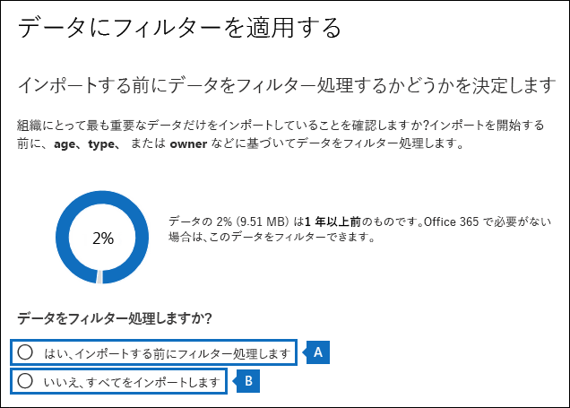
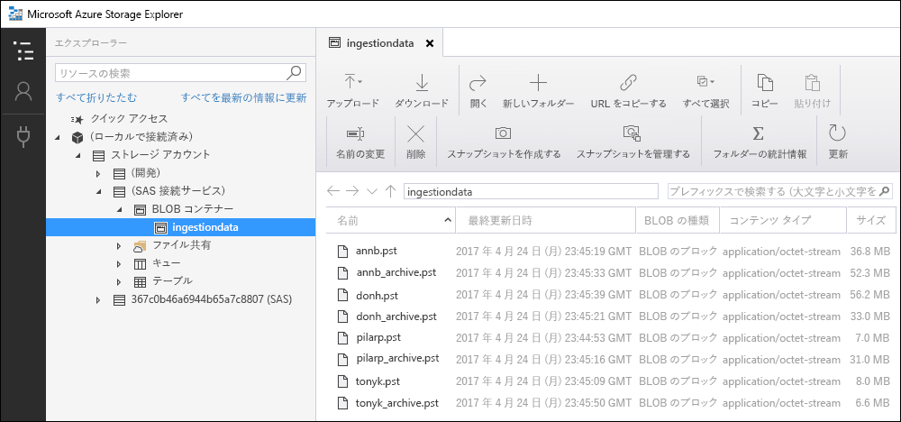

# <a name="use-drive-shipping-to-import-your-organization-pst-files-to-office-365"></a>ドライブの送付を使用して組織の PST ファイルを Office 365 にインポートする

**この記事は、管理者を対象としています。PST ファイルを自分のメールボックスにインポートしようとしていますか?「 [Outlook .pst ファイルからメール、連絡先、予定表をインポートする](https://go.microsoft.com/fwlink/p/?LinkID=785075)」を参照してください。**
   
Office 365 インポートサービスとドライブ配送を使用して、PST ファイルをユーザーのメールボックスに一括インポートします。ドライブの出荷とは、PST ファイルをハードディスクドライブにコピーし、ドライブを Microsoft に物理的に輸送することを意味します。microsoft がハードドライブを受け取ると、データセンターの担当者は、そのデータをハードドライブから microsoft クラウドのストレージ領域にコピーします。次に、インポートするデータを制御するフィルターを設定することにより、実際にターゲットメールボックスにインポートされた PST データをトリミングする機会があります。インポートジョブを開始すると、インポートサービスはストレージ領域の PST データをユーザーのメールボックスにインポートします。ドライブの送付を使用して PST ファイルをユーザーのメールボックスにインポートする方法は、組織の電子メールを Office 365 に移行する方法の1つです。
  
ドライブの配送を使用して、Office 365 メールボックスに PST ファイルをインポートするために必要な手順は次のとおりです。
  
[手順 1: セキュリティで保護されたストレージキーおよび PST インポートツールをダウンロードする](#step-1-download-the-secure-storage-key-and-pst-import-tool)

[手順 2: PST ファイルをハードドライブにコピーする](#step-2-copy-the-pst-files-to-the-hard-drive)

[手順 3: PST インポートのマッピングファイルを作成する](#step-3-create-the-pst-import-mapping-file)

[手順 4:Office 365 で PST インポート ジョブを作成する](#step-4-create-a-pst-import-job-in-office-365)

[手順 5:Microsoft にハード ドライブを送付する](#step-5-ship-the-hard-drive-to-microsoft)

[手順 6: データをフィルター処理し、PST インポートジョブを開始する](#step-6-filter-data-and-start-the-pst-import-job)
  
> [!IMPORTANT]
> セキュリティで保護されたストレージキーとインポートツールを読み込むには、手順1を実行する必要があります。これらの手順を実行した後、ハードドライブを Microsoft に出荷するたびに、手順 2 ~ 手順6に従います。 
  
ドライブの送付を使用して pst ファイルを Office 365 にインポートする方法についてよく寄せられる質問については、「[ドライブ出荷を使用して pst ファイルをインポートする](faqimporting-pst-files-to-office-365.md#using-drive-shipping-to-import-pst-files)」を参照してください。 
  
## <a name="before-you-begin"></a>始める前に

- PST ファイルを Office 365 メールボックスにインポートするには、Exchange Online でメールボックスのインポートのエクスポートの役割を割り当てられている必要があります。既定では、この役割は Exchange Online のどの役割グループにも割り当てられていません。[組織の管理] 役割グループに、メールボックスのインポートのエクスポートの役割を追加できます。または、新しい役割グループを作成し、メールボックスのインポートのエクスポート役割を割り当てて、自分をメンバーとして追加することもできます。詳細については、「 [Manage role groups](https://go.microsoft.com/fwlink/p/?LinkId=730688)」の「役割グループに役割を追加する」または「役割グループを作成する」のセクションを参照してください。
    
    さらに、Office 365 セキュリティ&amp;コンプライアンスセンターでインポートジョブを作成するには、次のいずれかの条件を満たしている必要があります。
    
  - Exchange Online では、メール受信者の役割が割り当てられている必要があります。既定では、この役割は組織の管理役割グループと受信者管理役割グループに割り当てられます。
    
    または
    
  - Office 365 組織の全体管理者である必要があります。
    
    > [!TIP]
    > Office 365 に PST ファイルをインポートするための特別な目的である Exchange Online に新しい役割グループを作成することを検討してください。PST ファイルのインポートに必要な最低限の特権レベルについては、メールボックスのインポートの役割とメール受信者の役割を新しい役割グループに割り当ててから、メンバーを追加します。 
  
- コピーする PST ファイルは、組織内のファイルサーバーまたは共有フォルダーのハードドライブに格納する必要があります。手順2では、このファイルサーバーまたは共有フォルダーに格納されている PST ファイルをハードドライブにコピーする Azure インポートエクスポートツール (waimportexport) を実行します。
    
- Office 365 インポートサービスでの使用には、2.5 インチのソリッドステートドライブ (ssd) または2.5 または3.5 インチの SATA II/III 内部ハードドライブのみがサポートされています。ハードドライブは最大 10 TB まで使用できます。インポートジョブの場合、ハードドライブ上の最初のデータボリュームのみが処理されます。データボリュームは NTFS でフォーマットされている必要があります。データをハードドライブにコピーする場合は、2.5 インチ ssd または2.5 または3.5 インチ sata ii/iii コネクタを使用して直接接続できます。また、外部の2.5 インチ ssd または2.5 または3.5 インチの sata ii/iii USB アダプターを使用して外部に接続することもできます。
    
    > [!IMPORTANT]
    > 組み込みの USB アダプターが付属している外部ハードドライブは、Office 365 インポートサービスではサポートされていません。さらに、外部ハードドライブの大文字と小文字の内部にあるディスクは使用できません。外部ハードドライブを送付しないでください。 
  
- PST ファイルのコピー先のハードドライブは、BitLocker で暗号化する必要があります。手順2で実行した waimportexport .exe ツールは、BitLocker のセットアップに役立ちます。また、microsoft データセンターの担当者が、PST ファイルを microsoft クラウドの Azure ストレージ領域にアップロードするために使用する BitLocker 暗号化キーを生成します。
    
- ドライブの配送は、Microsoft エンタープライズアグリーメント (EA) を通じて利用できます。ドライブの送付は、Microsoft 製品およびサービス契約 (mpsa) 経由では利用できません。
    
- ドライブの配送を使用して PST ファイルを Office 365 メールボックスにインポートするためのコストは、1 GB あたり $2 米ドルです。たとえば、PST ファイルの 1000 GB (1tb) を含むハードドライブを出荷した場合、コストは $2000 USD になります。パートナーと協力して、インポート料金を支払うことができます。パートナーの検索の詳細について[は、「Office 365 パートナーまたは販売店を検索](https://go.microsoft.com/fwlink/p/?LinkId=785197)する」を参照してください。
    
- お客様またはお客様の組織は、FedEx または DHL のアカウントを持っている必要があります。 
    
  - 米国、ブラジル、ヨーロッパの組織には、FedEx アカウントが必要です。
    
  - 東アジア、東南アジア、日本、韓国共和国、オーストラリアの組織には、DHL アカウントが必要です。
    
    Microsoft はこのアカウントを使用 (または課金) して、ハード ドライブをお客様に返却します。 
    
- Microsoft に送付するハード ドライブは、国境を超えて送付される場合があります。この場合は、お客様にはハード ドライブとそれに含まれるデータが適用法に従って輸入または輸出されることを保証する責任があります。ハード ドライブを送付する前に、指定された Microsoft データ センターにハード ドライブとデータを合法的に送付できるか法律顧問と一緒に確認してください。こうすることで、適切なタイミングで確実に Microsoft に届きます。
    
- この手順では、セキュリティで保護されたストレージキーと BitLocker 暗号化キーのコピーと保存を行います。パスワードやその他のセキュリティ関連の情報を保護するように、これらのキーを保護するための注意事項を必ず実行してください。たとえば、パスワードで保護された Microsoft Word 文書に保存するか、暗号化された USB ドライブに保存することができます。これらのキーの例については、「 [More information](use-drive-shipping-to-import-pst-files-to-office-365.md#moreinfo) 」セクションを参照してください。 
    
- PST ファイルが Office 365 メールボックスにインポートされると、メールボックスの保持ホールドの設定は無期限に有効になります。これは、メールボックスに割り当てられたアイテム保持ポリシーは、保存機能を無効にするか、保留を解除する日付を設定するまで処理されないことを意味します。なぜこれを行うのでしょうか。メールボックスにインポートされたメッセージが古くなっている場合は、メールボックスに対して構成されたアイテム保持ポリシーに基づいて保持期間が経過したために、削除 (パージ) される可能性があります。メールボックスの保存機能を有効にすると、メールボックスの所有者は新しくインポートされたメッセージを管理することができ、メールボックスの保存期間の設定を変更する時間を与えることができます。保持ホールドの管理に関する提案については、「 [More information](use-drive-shipping-to-import-pst-files-to-office-365.md#moreinfo) 」セクションを参照してください。 
    
- 既定では、Office 365 メールボックスで受信できる最大メッセージサイズは 35 MB です。これは、メールボックスの*MaxReceiveSize*プロパティの既定値が 35 MB に設定されているためです。ただし、Office 365 の最大メッセージ受信サイズの制限は 150 MB です。そのため、35 mb を超えるアイテムを含む PST ファイルをインポートすると、Office 365 インポートサービスによって、ターゲットメールボックスの*MaxReceiveSize*プロパティの値が 150 mb に自動的に変更されます。これにより、150 MB までのメッセージをユーザーのメールボックスにインポートできます。 
    
    > [!TIP]
    > メールボックスのメッセージ受信サイズを特定するには、Exchange Online PowerShell で次のコマンドを`Get-Mailbox <user mailbox> | FL MaxReceiveSize`実行します。 
  
- Office 365 の非アクティブなメールボックスに PST ファイルをインポートすることができます。これを行うには、PST インポートマッピングファイルの`Mailbox`パラメーターに非アクティブなメールボックスの GUID を指定します。詳細については[、「ステップ 3: PST インポートのマッピングファイルを作成](use-drive-shipping-to-import-pst-files-to-office-365.md#step3)する」を参照してください。 
    
- Exchange ハイブリッド展開では、プライマリメールボックスがオンプレミスであるユーザーのクラウドベースのアーカイブメールボックスに PST ファイルをインポートできます。これを行うには、PST インポートマッピングファイルで以下の手順を実行します。
    
  - `Mailbox`パラメーターに、ユーザーの社内メールボックスの電子メールアドレスを指定します。 
    
  - `IsArchive`パラメーターに**TRUE**の値を指定します。 
    
    詳細については[、「ステップ 3: PST インポートのマッピングファイルを作成](use-drive-shipping-to-import-pst-files-to-office-365.md#step3)する」を参照してください。 

## <a name="step-1-download-the-secure-storage-key-and-pst-import-tool"></a>手順 1: セキュリティで保護されたストレージキーおよび PST インポートツールをダウンロードする

最初の手順は、セキュリティで保護されたストレージキーとツールをダウンロードすることで、手順2で使用して PST ファイルをハードドライブにコピーします。
  
> [!IMPORTANT]
> drive 送付方法を使用して PST ファイルを正常にインポートするには、Azure インポート/エクスポートツールのバージョン 1 (WAimportExportV1) を使用する必要があります。Azure インポート/エクスポートツールのバージョン2はサポートされていません。これを使用すると、インポートジョブのハードドライブが正しく準備されない可能性があります。必ず、この手順の手順に従って、セキュリティ&amp;コンプライアンスセンターから Azure インポート/エクスポートツールをダウンロードしてください。 
  
1. に[https://protection.office.com/](https://protection.office.com/)移動し、Office 365 組織の管理者アカウントの資格情報を使用してサインインします。 
    
2. セキュリティ&amp; /コンプライアンスセンターの左側のウィンドウで、[**データガバナンス** \>の**インポート**] をクリックします。
    
    > [!NOTE]
    > 前述したように、セキュリティ&amp;コンプライアンスセンターの [**インポート**] ページにアクセスするには、適切なアクセス許可が割り当てられている必要があります。 
  
3. [**インポート**] ページで、  ] アイコン [**新しいインポートジョブ**] をクリックします。
    
4. [ジョブのインポート] ウィザードで、PST インポートジョブの名前を入力し、[**次へ**] をクリックします。小文字、数字、ハイフン、およびアンダースコアを使用してください。名前には、大文字を使用したり、スペースを含めたりすることはできません。
    
5. [**インポートジョブの種類の選択**] ページで、[**ハードドライブを物理的な場所の1つに出荷する**] をクリックし、[**次へ**] をクリックします。
    
    ![ドライブ送付インポートジョブを作成するには、[ハードドライブを物理的な場所の1つに出荷] をクリックします。](media/1584fdc5-cd4c-4e47-932e-db6c8e07f5f8.png)
  
6. [**データのインポート**] ページで、次の2つの操作を行います。 
    
    ![セキュリティで保護されたストレージキーをコピーして、[データのインポート] ページに Azure インポートエクスポートツールをダウンロードする](media/e22e0b48-e5ce-48e0-95bc-0490a2b3b983.png)
  
    a 手順2で、[**セキュリティで保護されたストレージキーをコピー**] をクリックします。ストレージキーが表示されたら、[**クリップボードにコピー** ] をクリックして貼り付け、ファイルに保存し、後でアクセスできるようにします。
    
    b. 手順3で、azure インポート/エクスポート**ツール**をダウンロードしてインストールし、azure インポート/エクスポート (バージョン 1) ツールをダウンロードします。
    
    - ポップアップウィンドウで、[名前を付け**** \> **て**保存] をクリックして、WaImportExportV1 ファイルをローカルコンピューター上のフォルダーに保存します。 
    
    - WaImportExportV1 ファイルを抽出します。
    
7. ウィザードを閉じるには、[**キャンセル**] をクリックします。 
    
    手順4でインポートジョブを**** 作成するときに、 &amp;セキュリティコンプライアンスセンターの [インポート] ページに戻ります。 

## <a name="step-2-copy-the-pst-files-to-the-hard-drive"></a>手順 2: PST ファイルをハードドライブにコピーする

次の手順では、waimportexport .exe ツールを使用して PST ファイルをハードドライブにコピーします。このツールは、BitLocker を使用してハードドライブを暗号化し、pst をハードドライブにコピーし、コピープロセスに関する情報を格納するジャーナルファイルを作成します。この手順を完了するには、組織内のファイル共有またはファイルサーバーに PST ファイルを配置する必要があります。これは、次の手順でソースディレクトリと呼ばれます。 
  
> [!IMPORTANT]
> 最初にハードドライブに対して waimportexport .exe ツールを実行した後は、その後毎回別の構文を使用する必要があります。この構文については、この手順のステップ4で、PST ファイルをハードドライブにコピーする方法について説明します。 
  
1. ローカル コンピューター上でコマンド プロンプトを開く。
    
    > [!TIP]
    > 管理者としてコマンド プロンプトを実行する場合 (コマンド プロンプトを開く際に [管理者として実行] を選択する)、コマンド プロンプト ウィンドウにエラー メッセージが表示されます。これにより、WAImportExport.exe ツールの実行に関する問題のトラブルシューティングが行えます。 
  
2. 手順 1 で WAImportExport ツールをインストールしたディレクトリに移動する。
    
3. 初めて WAImportExport.exe を使用してハード ドライブに PST ファイルをコピーする場合は、次のコマンドを実行する。

    ```
    WAImportExport.exe PrepImport /j:<Name of journal file> /t:<Drive letter> /id:<Name of session> /srcdir:<Location of PST files> /dstdir:<PST file path> /sk:<Storage account key> /encrypt /logdir:<Log file location>
    ```

    次の表は、パラメーターとそれに必要な値を説明したものです。
    
    |**パラメーター**|**説明**|**例**|
    |:-----|:-----|:-----|
    | `/j:` <br/> |ジャーナル ファイルの名前を指定します。このファイルは、WAImportExport.exe ツールがあるフォルダーと同じフォルダーに保存されます。Microsoft に送付するハード ドライブごとに 1 つのジャーナル ファイルが必要です。WAImportTool.exe を実行して PST ファイルをハード ドライブにコピーするたびに、そのドライブのジャーナル ファイルに情報が追加されます。 
  <br/> microsoft データセンター担当者は、ジャーナルファイルの情報を使用して、手順4で作成したインポートジョブにハードドライブを関連付け、PST ファイルを Microsoft クラウドの Azure ストレージ領域にアップロードします。  <br/> | `/j:PSTHDD1.jrn` <br/> |
    | `/t:` <br/> |ローカル コンピューターに接続されている場合は、ハード ドライブのドライブ文字を指定します。  <br/> | `/t:h` <br/> |
    | `/id:` <br/> |コピー セッションの名前を指定します。WAImportExport.exe ツールを実行してファイルをハード ドライブにコピーするたびに、セッションが定義されます。PST ファイルは、このパラメーターで指定されたセッション名の名前が付けられたフォルダーにコピーされます。   <br/> | `/id:driveship1` <br/> |
    | `/srcdir:` <br/> |セッション中にコピーされる PST ファイルを含む組織内のソースディレクトリを指定します。このパラメーターの値は二重引用符 ("") で囲むようにしてください。  <br/> | `/srcdir:"\\FILESERVER01\PSTs"` <br/> |
    | `/dstdir:` <br/> |pst がアップロードされる Microsoft クラウドの Azure ストレージ領域で、宛先ディレクトリを指定します。値`ingestiondata/`を使用する必要があります。このパラメーターの値は二重引用符 ("") で囲むようにしてください。<br/> 必要に応じて、このパラメーターの値に追加のファイルパスを追加することもできます。たとえば、ハードドライブ上のソースディレクトリのファイルパス (URL 形式に変換される) を使用できます。これは、 `/srcdir:`パラメーターで指定されています。たとえば、 `\\FILESERVER01\PSTs`はに`FILESERVER01/PSTs`変更されます。この場合も、ファイルパスに含める`ingestiondata`必要があります。そのため、この例では、 `/dstdir:`パラメーターの値は`"ingestiondata/FILESERVER01/PSTs"`になります。<br/> 同じファイル名を持つ pst ファイルがある場合は、追加のファイルパスを追加する理由の1つとして挙げられます。  <br/> > [!NOTE]> オプションのパス名を指定した場合、pst ファイルの名前空間には、[Azure storage] 領域にアップロードされた後に、pst ファイルのパス名と名前が含まれます。たとえば、 `FILESERVER01/PSTs/annb.pst`のようになります。pathname を指定しない場合、名前空間は PST ファイル名のみになります。例`annb.pst`を示します。           | `/dstdir:"ingestiondata/"` <br/> または  <br/>  `/dstdir:"ingestiondata/FILESERVER01/PSTs"` <br/> |
    | `/sk:` <br/> |手順1で取得したストレージアカウントキーを指定します。このパラメーターの値は二重引用符 ("") で囲むようにしてください。  <br/> | `"yaNIIs9Uy5g25Yoak+LlSHfqVBGOeNwjqtBEBGqRMoidq6/e5k/VPkjOXdDIXJHxHvNoNoFH5NcVUJXHwu9ZxQ=="` <br/> |
    | `/encrypt` <br/> |このスイッチは、ハード ドライブの BitLocker を有効にします。このパラメーターは、WAImportExport.exe ツールを初めて実行する際に必要です。  <br/> BitLocker 暗号化キーは、ジャーナルファイルと、 `/logfile:`パラメーターを使用した場合に作成されるログファイルにコピーされます。前述のように、ジャーナルファイルは、waimportexport .exe ツールが配置されているのと同じフォルダーに保存されます。<br/> | `/encrypt` <br/> |
    | `/logdir:` <br/> |このオプションパラメーターは、ログファイルを保存するフォルダーを指定します。指定しない場合、ログファイルは、waimportexport .exe ツールが配置されているのと同じフォルダーに保存されます。このパラメーターの値は二重引用符 ("") で囲むようにしてください。  <br/> | `/logdir:"c:\users\admin\desktop\PstImportLogs"` <br/> |
   
    各パラメーターの実際の値を使用する WAImportExport.exe ツールの構文の例を以下に示します。
    
    ```
    WAImportExport.exe PrepImport /j:PSTHDD1.jrn /t:f /id:driveship1 /srcdir:"\\FILESERVER01\PSTs" /dstdir:"ingestiondata/" /sk:"yaNIIs9Uy5g25Yoak+LlSHfqVBGOeNwjqtBEBGqRMoidq6/e5k/VPkjOXdDIXJHxHvNoNoFH5NcVUJXHwu9ZxQ==" /encrypt /logdir:"c:\users\admin\desktop\PstImportLogs"
    ```

    コマンドを実行すると、ハード ドライブへの PST ファイルのコピーの進行状況を示す状態メッセージが表示されます。最終の状態メッセージは、正常にコピーされたファイルの合計数を示しています。 
    
4. このコマンドを、WAImportExport.ext ツールを 2 回目以降に実行するたびに実行して、PST ファイルを同じハード ドライブにコピーする。

    ```
    WAImportExport.exe PrepImport /j:<Name of journal file> /id:<Name of new session> /srcdir:<Location of PST files> /dstdir:<PST file path> 
    ```

    以降のセッションを実行して PST ファイルを同じハード ドライブにコピーするための構文の例は、以下の通りです。  

    ```
    WAImportExport.exe PrepImport /j:PSTHDD1.jrn /id:driveship2 /srcdir:"\\FILESERVER01\PSTs\SecondBatch" /dstdir:"ingestiondata/"
    ```

## <a name="step-3-create-the-pst-import-mapping-file"></a>手順 3: PST インポートのマッピングファイルを作成する

Microsoft データセンターの担当者がハードドライブから Azure ストレージ領域に pst ファイルをアップロードした後、インポートサービスは、pst インポートマッピングファイル (csv) ファイル内の情報を使用して、pst をメールボックスを特定するユーザーを指定します。ファイルはにインポートされます。PST インポートジョブを作成する場合は、次の手順でこの CSV ファイルを送信します。
  
1. [PST インポートのマッピングファイルのコピーをダウンロード](https://go.microsoft.com/fwlink/p/?LinkId=544717)します。
    
2. CSV ファイルを開くか、ローカル コンピューターに保存します。次の例は、完了した PST インポートのマッピング ファイル (メモ帳で開いた) を示しています。Microsoft Excel を使って CSV ファイルを編集するほうが、はるかに簡単です。

    ```
    Workload,FilePath,Name,Mailbox,IsArchive,TargetRootFolder,ContentCodePage,SPFileContainer,SPManifestContainer,SPSiteUrl
    Exchange,FILESERVER01/PSTs,annb.pst,annb@contoso.onmicrosoft.com,FALSE,/,,,,
    Exchange,FILESERVER01/PSTs,annb_archive.pst,annb@contoso.onmicrosoft.com,TRUE,/ImportedPst,,,,
    Exchange,FILESERVER01/PSTs,donh.pst,donh@contoso.onmicrosoft.com,FALSE,/,,,,
    Exchange,FILESERVER01/PSTs,donh_archive.pst,donh@contoso.onmicrosoft.com,TRUE,/ImportedPst,,,,
    Exchange,FILESERVER01/PSTs,pilarp.pst,pilarp@contoso.onmicrosoft.com,FALSE,/,,,,
    Exchange,FILESERVER01/PSTs,pilarp_archive.pst,pilarp@contoso.onmicrosoft.com,TRUE,/ImportedPst,,,,
    Exchange,,tonyk.pst,tonyk@contoso.onmicrosoft.com,FALSE,/,,,,
    Exchange,,tonyk_archive.pst,tonyk@contoso.onmicrosoft.com,TRUE,,,,,
    Exchange,,zrinkam.pst,zrinkam@contoso.onmicrosoft.com,FALSE,/,,,,
    Exchange,,zrinkam_archive.pst,zrinkam@contoso.onmicrosoft.com,TRUE,,,,,
    ```

    CSV ファイルの最初の行、つまりヘッダー行には、pst ファイルをユーザーメールボックスにインポートするために pst インポートサービスによって使用されるパラメーターが一覧表示されます。各パラメーター名はコンマで区切ります。ヘッダー行の下の各行は、特定のメールボックスに PST ファイルをインポートするためのパラメーター値を表します。ハードドライブにコピーされた PST ファイルごとに1行が必要です。マッピングファイルのプレースホルダーデータを実際のデータに置き換えてください。

    > [!NOTE]
    > SharePoint パラメーターなど、ヘッダー行は何も変更しないでください。これらは PST インポートの処理中、無視されます。 
  
3. 次の表の情報を使って、必要な情報を含む CSV ファイルを作成します。
    
    |**パラメーター**|**説明**|**例**|
    |:-----|:-----|:-----|
    | `Workload` <br/> |データのインポート先となる Office 365 サービスを指定します。PST ファイルをユーザーのメールボックスにインポート`Exchange`するには、を使用します。<br/> | `Exchange` <br/> |
    | `FilePath` <br/> | ハードドライブが Microsoft に出荷されたときに PST ファイルがコピーされる Azure ストレージ領域内のフォルダーの場所を指定します。  <br/>  CSV ファイルのこの列に追加する内容は、前の手順で`/dstdir:`パラメーターに指定した内容によって異なります。  <br/>  を使用`/dstdir:"ingestiondata/"`した場合は、CSV ファイルでこのパラメーターを空白のままにします。  <br/>  `/dstdir:`パラメーターの値の省略可能なパス名 (たとえば`/dstdir:"ingestiondata/FILESERVER01/PSTs"`、) を指定した場合、CSV ファイルのこのパラメーターにはその pathname ("ingestiondata" を含まない) を使用します。このパラメーターの値は、大文字と小文字を区別します。<br/>  どちらの方法** でも、 `FilePath`パラメーターの値に "ingestiondata" を含めないでください。このパラメーターを空白のままにしておくか、省略可能なパス名のみを指定します。<br/> > [!IMPORTANT]> ファイルパス名の大文字と小文字は、前の手順で`/dstdir:`パラメーターで指定したものと同じである必要があります。たとえば、前の手順で`"ingestiondata/FILESERVER01/PSTs"`サブフォルダー名を使用していて、CSV ファイル`fileserver01/psts`の`FilePath`パラメーターで使用した場合、PST ファイルのインポートは失敗します。両方のインスタンスで同じケースを使用してください。           |(空白)  <br/> または  <br/>  `FILESERVER01/PSTs` <br/> |
    | `Name` <br/> |ユーザーメールボックスにインポートされる PST ファイルの名前を指定します。このパラメーターの値は、大文字と小文字を区別します。<br/> > [!IMPORTANT]> CSV ファイルの pst ファイル名の大文字と小文字は、手順2で Azure ストレージの場所にアップロードされた pst ファイルと同じである必要があります。たとえば、CSV ファイルの`annb.pst` `Name`パラメーターでを使用していて、実際の pst ファイルの名前が`AnnB.pst`である場合、その pst ファイルのインポートは失敗します。CSV ファイルの pst の名前では、実際の pst ファイルと同じ大文字と小文字が使用されていることを確認してください。           | `annb.pst` <br/> |
    | `Mailbox` <br/> |PST ファイルのインポート先となるメールボックスの電子メールアドレスを指定します。pst インポートサービスは、pst ファイルのパブリックフォルダーへのインポートをサポートしていないため、パブリックフォルダーを指定することはできません。<br/> 非アクティブなメールボックスに PST ファイルをインポートするには、このパラメーターのメールボックス GUID を指定する必要があります。この GUID を取得するには、Exchange Online で次の PowerShell コマンドを実行します。`Get-Mailbox <identity of inactive mailbox> -InactiveMailboxOnly | FL Guid` <br/> > [!NOTE]> 場合によっては、1つのメールボックスがアクティブなメールボックスで、もう一方のメールボックスが削除済み (または非アクティブ) 状態になっているメールボックスが同じメールアドレスを持つ複数のメールボックスが存在することがあります。このような状況では、PST ファイルをインポートするメールボックスを一意に識別するために、メールボックスの GUID を指定する必要があります。この GUID をアクティブなメールボックスに対して取得するには`Get-Mailbox <identity of active mailbox> | FL Guid`、次の PowerShell コマンドを実行します。回復可能な削除 (または非アクティブ) のメールボックスの GUID を取得する`Get-Mailbox <identity of soft-deleted or inactive mailbox> -SoftDeletedMailbox | FL Guid`には、次のコマンドを実行します。           | `annb@contoso.onmicrosoft.com` <br/> または  <br/>  `2d7a87fe-d6a2-40cc-8aff-1ebea80d4ae7` <br/> |
    | `IsArchive` <br/> | PST ファイルをユーザーのアーカイブ メールボックスにインポートするかどうかを指定します。次のような 2 つの選択肢があります。<br/> **FALSE**PST ファイルをユーザーのプライマリメールボックスにインポートします。  <br/> **TRUE**PST ファイルをユーザーのアーカイブメールボックスにインポートします。これ[は、ユーザーのアーカイブメールボックスが有効になっ](enable-archive-mailboxes.md)ていることを前提としています。このパラメーターをに`TRUE`設定し、ユーザーのアーカイブメールボックスが有効になっていない場合、そのユーザーのインポートは失敗します。1人のユーザーに対してインポートが失敗した場合 (アーカイブが有効になっておら`TRUE`ず、このプロパティがに設定されているため)、インポートジョブの他のユーザーに影響が及ぶことに注意してください。<br/>  このパラメーターを空白のままにすると、PST ファイルがユーザーのプライマリメールボックスにインポートされます。  <br/> **注:** プライマリメールボックスがオンプレミスであるユーザーのクラウドベースのアーカイブメールボックスに PST ファイルをインポートするには`TRUE` 、このパラメーターに対してを指定して、 `Mailbox`パラメーターのユーザーの社内メールボックスの電子メールアドレスを指定するだけです。  <br/> | `FALSE` <br/> または  <br/>  `TRUE` <br/> |
    | `TargetRootFolder` <br/> | PST ファイルのインポート先メールボックスフォルダーを指定します。  <br/>  このパラメーターを空白のままにした場合、PST はメールボックスのルートレベル (受信トレイフォルダーとその他の既定のメールボックスフォルダーと同じレベル) にある**インポート**された新しいフォルダーにインポートされます。  <br/>  を指定`/`した場合、PST ファイル内のアイテムは、ユーザーの受信トレイフォルダーに直接インポートされます。  <br/>  を指定`/<foldername>`した場合、PST ファイルのアイテムは、 * \<foldername\> *という名前のフォルダーにインポートされます。たとえば、を使用`/ImportedPst`すると、アイテムは**ImportedPst**という名前のフォルダーにインポートされます。このフォルダーは、受信トレイフォルダーと同じレベルにあるユーザーのメールボックスに配置されます。<br/> |(空白)  <br/> または  <br/>  `/` <br/> または  <br/>  `/ImportedPst` <br/> |
    | `ContentCodePage` <br/> |このオプションパラメーターは、ANSI ファイル形式で PST ファイルをインポートするために使用するコードページの数値を指定します。このパラメーターは、中国語、日本語、および韓国語 (CJK) の組織から PST ファイルをインポートするために使用されます。これらの言語では、通常、文字エンコードに2バイト文字セット (DBCS) を使用します。メールボックスフォルダー名に DBCS を使用する言語の PST ファイルをインポートするためにこのパラメーターを使用していない場合は、インポート後にフォルダー名が正しくないことがよくあります。<br/> このパラメーターに使用することがサポートされている値の一覧については、「[コードページ識別子](https://go.microsoft.com/fwlink/p/?LinkId=328514)」を参照してください。  <br/> > [!NOTE]> 前述のとおり、これはオプションのパラメーターであり、CSV ファイルに含める必要はありません。または、1つまたは複数の行の値を空白のままにしておくこともできます。           |(空白)  <br/> または  <br/>  `932`(ANSI/OEM 日本語のコードページ識別子)  <br/> |
    | `SPFileContainer` <br/> |PST インポートの場合は、このパラメーターを空白のままにします。   <br/> |該当なし  <br/> |
    | `SPManifestContainer` <br/> |PST インポートの場合は、このパラメーターを空白のままにします。   <br/> |該当なし  <br/> |
    | `SPSiteUrl` <br/> |PST インポートの場合は、このパラメーターを空白のままにします。   <br/> |該当なし  <br/> |

## <a name="step-4-create-a-pst-import-job-in-office-365"></a>手順 4:Office 365 で PST インポート ジョブを作成する

次の手順では、Office 365 のインポートサービスで PST インポートジョブを作成します。前述のように、手順3で作成した PST インポートマッピングファイルを送信します。新しいジョブを作成した後、インポートサービスはマッピングファイルの情報を使用して、pst ファイルがハードドライブから Azure ストレージ領域にコピーされた後に、指定されたユーザーメールボックスに pst ファイルをインポートします。その後、インポートジョブを作成して開始します。
  
1. に[https://protection.office.com](https://protection.office.com)移動し、Office 365 組織の管理者アカウントの資格情報を使用してサインインします。 
    
2. セキュリティ&amp; /コンプライアンスセンターの左側のウィンドウで、[**データガバナンス**] をクリックし、[**インポート**] をクリックします。
    
3. [**インポート**] ページで、  ] アイコン [**新しいインポートジョブ**] をクリックします。
    
    > [!NOTE]
    > 前述したように、セキュリティ&amp;コンプライアンスセンターの [**インポート**] ページにアクセスするには、適切なアクセス許可が割り当てられている必要があります。 
  
4. PST インポートジョブの名前を入力し、[**次へ**] をクリックします。小文字、数字、ハイフン、およびアンダースコアを使用してください。名前には、大文字を使用したり、スペースを含めたりすることはできません。
    
5. [**インポートジョブの種類の選択**] ページで、[**ハードドライブを物理的な場所の1つに出荷する**] をクリックし、[**次へ**] をクリックします。
    
    ![ドライブ送付インポートジョブを作成するには、[ハードドライブを物理的な場所の1つに出荷] をクリックします。](media/1584fdc5-cd4c-4e47-932e-db6c8e07f5f8.png)
  
6. 手順6で、[自分のハードドライブの準備ができました] をクリックし、**必要なドライブジャーナルファイルにアクセス**して、[**マッピングファイルにアクセス**できる] チェックボックスをオンにして、[**次へ**] をクリックします。
    
    
  
7. [**ドライブファイルの選択**] ページで、[**ドライブファイルの選択**] をクリックして、waimportexport .exe ツールが配置されているのと同じフォルダーに移動します。手順2で作成したジャーナルファイルは、このフォルダーにコピーされました。
    
    ![waimportexport .exe ツールを実行したときに作成されたジャーナルファイルを送信するには、[ドライブファイルの選択] をクリックします。](media/1ea35c04-bd88-4d7e-b7d9-dc390149d94f.png)
  
8. ジャーナルファイルを選択します。たとえば、 `PSTHDD1.jrn`のようになります。
    
    > [!TIP]
    > 手順2で waimportexport .exe ツールを実行したときに、ジャーナルファイルの名前が`/j:`パラメーターによって指定されています。 
  
9. ドライブファイルの名前が [**ドライブファイル名**] の下に表示されたら、[**検証**] をクリックして、ドライブファイルにエラーがないかどうかを確認します。 
    
    ![[検証] をクリックして、選択したドライブファイルを検証します。](media/4b707f5a-152a-4e74-b9f5-449c88d1fec4.png)
  
    PST インポートジョブを作成するには、ドライブファイルが正常に検証されている必要があります。メモファイル名が正常に検証された後に、緑に変更されます。検証が失敗した場合は、[ **View log** ] リンクをクリックします。検証エラーレポートが開き、ファイルが失敗した理由に関する情報が含まれたエラーメッセージが表示されます。 
    
    > [!NOTE]
    > Microsoft に出荷する各ハードドライブに対して、ジャーナルファイルを追加して検証する必要があります。 
  
10. Microsoft に出荷する各ハードドライブのジャーナルファイルを追加して検証した後、[**次へ**] をクリックします。
    
11. [ ![追加]](media/ITPro-EAC-AddIcon.gif)アイコン [**マッピングファイルの選択**] をクリックして、手順3で作成した PST インポートマッピングファイルを送信します。 
    
    ![[マッピングファイルの選択] をクリックして、インポートジョブ用に作成した CSV ファイルを送信します。](media/d30b1d73-80bb-491e-a642-a21673d06889.png)
  
12. csv ファイルの名前が [**マッピングファイル名**] の下に表示されたら、[**検証**] をクリックして csv ファイルにエラーがないか確認します。 
    
    ![[検証] をクリックして、CSV ファイルのエラーを確認します。](media/4680999d-5538-4059-b878-2736a5445037.png)
  
    PST インポートジョブを作成するには、CSV ファイルが正常に検証されている必要があります。メモファイル名が正常に検証された後に、緑に変更されます。検証が失敗した場合は、[ **View log** ] リンクをクリックします。検証エラーレポートが開き、エラーが発生したファイル内の各行に関するエラーメッセージが表示されます。 
    
13. PST マッピングファイルが正常に検証されたら、[**次へ**] をクリックします。
    
14. [**連絡先情報の入力**] ページで、該当するボックスに連絡先情報を入力します。 
    
    ハードドライブを送付する Microsoft の場所のアドレスが表示されていることに注意してください。このアドレスは、Office 365 データセンターの場所に基づいて自動生成されます。このアドレスをファイルにコピーするか、スクリーンショットを取ります。
    
15. 使用条件ドキュメントを読んで、チェックボックスをクリックし、[**保存**] をクリックしてインポートジョブを送信します。 
    
    インポートジョブが正常に作成されると、ドライブ出荷プロセスの次の手順を説明する状態ページが表示されます。
    
16. [**インポート**] ページで、 アイコンの**更新**] をクリックして、インポートジョブの一覧に新しいドライブ配送インポートジョブを表示します。状態は、**追跡番号を待機**するように設定されていることに注意してください。インポートジョブをクリックして、インポートジョブに関する詳細情報を含む状態ポップアップページを表示することもできます。
 
## <a name="step-5-ship-the-hard-drive-to-microsoft"></a>手順 5:Microsoft にハード ドライブを送付する

次の手順では、Microsoft にハードドライブを送付してから、ドライブ出荷ジョブの発送番号と返送情報を提供します。ドライブは、Microsoft によって受信された後、データセンターの担当者が組織の Azure ストレージ領域に PST ファイルをアップロードするのに 7 ~ 10 営業日かかります。
  
> [!NOTE]
> インポートジョブの作成から14日以内に追跡番号を指定せずに出荷情報を取得した場合、インポートジョブは期限切れになります。このような状況が発生した場合は、新しいドライブ送付インポートジョブを作成する必要があります (「[手順 4: Office 365 で pst インポートジョブを作成](use-drive-shipping-to-import-pst-files-to-office-365.md#step4)する」を参照し、ドライブファイルと pst インポートマッピングファイルを再送信します。 
  
### <a name="ship-the-hard-drive"></a>ハード ドライブを送付する

Microsoft にハード ドライブを送付する場合は、次の点に注意してください。
  
- シリアルから USB へのアダプターは送付しないでください。ハードドライブを送付するだけで済みます。
    
- ハード ドライブを適切に梱包する。たとえば、静電気防止バッグやクッション材など使用する。
    
- 任意の配送業者を使用して、Microsoft にハード ドライブを送付する。
    
- 手順4でインポートジョブを作成したときに表示された Microsoft の場所のアドレスにハードドライブを送付します。出荷先住所に「Office 365 Import Service」を含めるようにしてください。
    
- ハード ドライブの送付後、配送業者の名前と追跡番号を必ず書き留めてください。これらは次の手順で必要になります。
    
### <a name="enter-the-tracking-number-and-other-shipping-information"></a>追跡番号と他の配送情報を入力する

Microsoft にハード ドライブを送付した後、インポート サービスのページで次の手順を完了します。
  
1. に[https://protection.office.com](https://protection.office.com)移動し、Office 365 組織の管理者アカウントの資格情報を使用してサインインします。 
    
2. 左側のウィンドウで、[**データガバナンス**] をクリックし、[**インポート**] をクリックします。
    
3. [**インポート**] ページで、追跡番号を入力するドライブの出荷のジョブをクリックします。 
    
4. [状態のポップアップ] ページで、[**追跡番号の入力**] をクリックします。
    
5. 以下の送付情報を入力する。
    
1. **配送業者**ハードドライブを Microsoft に出荷する際に使用した配送業者の名前を入力します。 
    
2. **追跡番号**ハードドライブの出荷の追跡番号を入力します。 
    
3. **返品業者のアカウント番号**[**返品業者**] にリストされている通信業者の組織のアカウント番号を入力します。Microsoft は、このアカウントを使用して、お客様にハードドライブを送付します。米国およびヨーロッパの組織には、FedEx のアカウントが必要であることに注意してください。アジアおよび世界の他の組織は、DHL のアカウントを持っている必要があります。
    
6. **[保存]** をクリックして、インポート ジョブのこの情報を保存する。 
    
    [**インポート**] ページで、  **** アイコンの更新] をクリックして、ドライブの配送インポートジョブの情報を更新します。状態が **[転送中のドライブ**に設定されました。

## <a name="step-6-filter-data-and-start-the-pst-import-job"></a>手順 6: データをフィルター処理し、PST インポートジョブを開始する

Microsoft がハードドライブを受信すると、[**インポート**] ページのインポートジョブの状態が [受信した**ドライブ**] に変わります。データセンターの担当者は、ジャーナルファイルの情報を使用して、組織の Azure ストレージ領域に PST ファイルをアップロードします。この時点で、状態は [**インポート中**] に変わります。前述したように、ハードドライブを受け取った後、PST ファイルをアップロードするには、7 ~ 10 営業日かかります。
  
PST ファイルが Azure にアップロードされると、進行中の**分析**に状態が変更されます。これは、Office 365 が pst ファイルのデータ (安全かつ安全な方法) を分析して、アイテムの保存期間と pst ファイルに含まれるさまざまなメッセージの種類を識別することを示しています。分析が完了し、データをインポートする準備が整ったら、インポートジョブの状態が [**分析完了**] に変更されます。この時点で、PST ファイルに含まれるすべてのデータをインポートするか、インポートするデータを制御するフィルターを設定することによってインポートされたデータをトリミングするかを選択できます。
  
1. に[https://protection.office.com](https://protection.office.com)移動し、Office 365 組織の管理者アカウントの資格情報を使用してサインインします。 
    
2. 左側のウィンドウで、[**データガバナンス** > の**インポート**] をクリックします。
    
3. [**インポート**] ページで、手順4で作成したインポートジョブについて、[ **Office 365 にインポートする準備ができ**ました] をクリックします。 
    
    ![作成したインポートジョブの横にある [Office 365 にインポートする準備完了] をクリックします。](media/5760aac3-300b-4e31-b894-253c42a4b82b.png)
  
    フライアウトページには、PST ファイルおよびインポートジョブに関するその他の情報が表示されます。
    
4. [ **Office 365 へのインポート] を**クリックします。
    
5. [**データをフィルター**する] ページが表示されます。このファイルには、データの保存期間に関する情報を含む、Office 365 によって PST ファイルに対して実行された分析の結果として得られるデータ insights が含まれています。この時点で、インポートされるデータをフィルター処理するか、すべてのデータをそのものとしてインポートするかを選択できます。 
    
    
  
6. 次のいずれかを実行します。
    
    。インポートするデータをトリミングするには、[**はい、インポートする前にフィルターを適用**します] をクリックします。
    
    pst ファイルのデータをフィルター処理してからインポートジョブを開始する方法の詳細な手順については、「 [pst ファイルを Office 365 にインポートするときにデータをフィルターする](filter-data-when-importing-pst-files.md)」を参照してください。
    
    または
    
    b. PST ファイルのすべてのデータをインポートするには、[**いいえ、** すべてをインポートします] をクリックし、[**次へ**] をクリックします。
    
7. すべてのデータをインポートすることを選択した場合は、[**データのインポート**] をクリックしてインポートジョブを開始します。 
    
    インポートジョブの状態が [**インポート**] ページに表示されます。[  **** の更新] をクリックして、[**状態**] 列に表示される状態情報を更新します。インポートジョブをクリックして状態ポップアップページを表示すると、インポートされている各 PST ファイルに関する状態情報が表示されます。インポートが完了し、PST ファイルがユーザーのメールボックスにインポートされると、状態は [**完了**] に変更されます。

## <a name="view-a-list-of-the-pst-files-uploaded-to-office-365"></a>Office 365 にアップロードされた PST ファイルの一覧を表示する

microsoft azure ストレージエクスプローラー (無償のオープンソースツール) をインストールして使用すると、組織の Azure ストレージ領域に (microsoft データセンター担当者が) アップロードした PST ファイルの一覧を表示することができます。これにより、Microsoft に送信したハードドライブの PST ファイルが Azure ストレージ領域に正常にアップロードされたことを確認できます。
  
Microsoft Azure ストレージエクスプローラーはプレビュー段階です。
  
 **重要:** Azure ストレージエクスプローラーを使用して PST ファイルをアップロードまたは変更することはできません。PST ファイルを Office 365 にインポートするためにサポートされている唯一の方法は、azcopy を使用することです。また、Azure blob にアップロードした PST ファイルを削除することもできません。PST ファイルを削除しようとすると、必要なアクセス許可がないというエラーが表示されます。すべての PST ファイルが Azure ストレージ領域から自動的に削除されることに注意してください。進行中のインポートジョブがない場合、[* * ingestiondata * *] コンテナー内のすべての PST ファイルは、最新のインポートジョブが作成されてから30日後に削除されます。 
  
azure ストレージエクスプローラーをインストールして azure ストレージ領域に接続するには、次のようにします。
  
1. 組織の Shared Access Signature (SAS) URL を取得するには、次の手順を実行します。この url は、組織および SAS キーで使用される Microsoft クラウド内の Azure ストレージの場所のネットワーク URL の組み合わせです。このキーは、組織の Azure ストレージの場所にアクセスするために必要なアクセス許可を提供します。
    
1. に[https://protection.office.com/](https://protection.office.com/)移動し、Office 365 組織の管理者アカウントの資格情報を使用してサインインします。 
    
2. セキュリティ&amp; /コンプライアンスセンターの左側のウィンドウで、[**データガバナンス** \>の**インポート**] をクリックします。
    
3. [**インポート**] ページで、  ] アイコン [**新しいインポートジョブ**] をクリックします。
    
4. [ジョブのインポート] ウィザードで、PST インポートジョブの名前を入力し、[**次へ**] をクリックします。小文字、数字、ハイフン、およびアンダースコアを使用してください。名前には、大文字を使用したり、スペースを含めたりすることはできません。
    
5. [**インポートジョブの種類の選択**] ページで、[**データのアップロード**] をクリックし、[**次へ**] をクリックします。
    
6. 手順2で、[**ネットワークアップロード SAS URL を表示する**] をクリックします。
    
7. URL が表示されたら、それをコピーしてファイルに保存します。必ず URL 全体をコピーしてください。
    
    > [!IMPORTANT]
    > SAS URL を保護するための予防措置を講じてください。これは、組織の Azure ストレージ領域にアクセスするすべてのユーザーが使用できます。 
  
8. [**キャンセル**] をクリックして、ジョブのインポートウィザードを終了します。 
    
2. [Microsoft Azure ストレージエクスプローラーツール](https://go.microsoft.com/fwlink/p/?LinkId=544842)をダウンロードしてインストールします。
    
3. Microsoft Azure ストレージエクスプローラーを起動し、左側のウィンドウで [**ストレージアカウント**] を右クリックして、[ **Azure ストレージに接続] を**クリックします。
    
    ![[ストレージアカウント] を右クリックし、[Azure ストレージへの接続] をクリックします。](media/75b80cc3-c336-4f96-ad32-54ac9b96a7af.png)
  
4. [**共有アクセス署名 (SAS) URI または接続文字列を使用**する] をクリックし、[**次へ**] をクリックします。
    
5. [ **sas uri を使用**する] をクリックして、手順1で取得した sas URL を [ **uri**] の下のボックスに貼り付け、[**次へ**] をクリックします。
    
6. [**接続の概要**] ページで、接続情報を確認し、[**接続**] をクリックします。
    
    **ingestiondata**コンテナーが開きます。ハードドライブの PST ファイルが含まれています。**ingestiondata**コンテナーは、**ストレージアカウント** \> **(SAS 接続されたサービス)** \> **Blob コンテナー**の下にあります。
    
    
  
7. Microsoft azure ストレージエクスプローラーの使用が終了したら、[ **ingestiondata**] を右クリックし、 **** [切断] をクリックして azure ストレージ領域から切断します。そうしないと、次に接続しようとしたときにエラーが表示されます。 
    
    ![ingestion を右クリックして [デタッチ] をクリックし、Azure のストレージ エリアから切断する](media/1e8e5e95-4215-4ce4-a13d-ab5f826a0510.png)
  

  
## <a name="troubleshooting-tips"></a>トラブルシューティングのヒント
<a name="troubleshootingtips"> </a>

- **PST インポートの CSV マッピングファイルにエラーがあるためにインポートジョブが失敗した場合はどうなりますか。** マッピングファイルのエラーによってインポートジョブが失敗した場合は、新しいインポートジョブを作成するために、ハードドライブを Microsoft に再出荷する必要はありません。これは、ドライブ送付インポートジョブ用に送信したハードドライブからの PST ファイルが、組織の Azure ストレージ領域に既にアップロードされているためです。この場合は、PST インポート CSV マッピングファイルのエラーを修正してから、新しい "network upload" インポートジョブを作成し、改訂された CSV マッピングファイルを送信するだけで済みます。新しいネットワークアップロードインポートジョブを作成して開始するには、「[手順 5: office 365 で pst インポートジョブを作成](use-network-upload-to-import-pst-files.md#step-5-create-a-pst-import-job-in-office-365)する」および「[手順 6: データをフィルター処理](use-network-upload-to-import-pst-files.md#step-6-filter-data-and-start-the-pst-import-job)するために、ネットワークアップロードを使用して pst ファイルを Office 365 にインポートする」を参照してください。 
    
    > [!NOTE]
    > pst インポートの CSV マッピングファイルのトラブルシューティングに役立てるために、 [azure ストレージエクスプローラー](#view-a-list-of-the-pst-files-uploaded-to-office-365)ツールを使用して、azure ストレージ領域にアップロードされたハードディスクドライブからの pst ファイルの**ingestiondata**コンテナーにあるフォルダー構造を表示します。通常、ファイルのマッピングエラーは FilePath パラメーターの値が正しくないことが原因で発生します。このパラメーターには、Azure ストレージ領域内の PST ファイルの場所を指定します。[手順 3](#step-3-create-the-pst-import-mapping-file)の表の FilePath パラメーターの説明を参照してください。前述のように、[手順 2](#step-2-copy-the-pst-files-to-the-hard-drive)で waimportexport .exe ツールを実行したとき`/dstdir:`に、パラメーターによって、Azure ストレージ領域内の PST ファイルの場所が指定されました。 
  

  
## <a name="more-information"></a>詳細情報

- ドライブの配送は、組織で使用できるコンプライアンス機能を活用するために、大量のアーカイブメッセージングデータを Office 365 にインポートする効果的な方法です。アーカイブデータをユーザーのメールボックスにインポートした後、次のことを行うことができます。
    
  - [アーカイブメールボックス](enable-archive-mailboxes.md)および[自動拡張アーカイブ](enable-unlimited-archiving.md)を有効にして、ユーザーにデータの追加のメールボックス記憶領域を付与します。 
    
  - メールボックスを[訴訟ホールド](https://go.microsoft.com/fwlink/?linkid=856286)の対象にしてデータを保持します。 
    
  - Microsoft[電子情報開示ツール](search-for-content.md)を使用して、データを検索します。 
    
  - [Office 365 アイテム保持ポリシー](retention-policies.md)を適用して、データの保持期間を制御します。また、保持期間が経過した後に実行するアクションを制御します。 
    
  - このデータに関連するイベントについては、 [Office 365 監査ログ](search-the-audit-log-in-security-and-compliance.md)を検索します。 
    
  - コンプライアンスを目的として、[非アクティブなメールボックス](create-and-manage-inactive-mailboxes.md)にデータをアーカイブするためのデータをインポートします。 
    
  - 機密情報の[データ損失](data-loss-prevention-policies.md)から組織を保護します。 
    
- セキュリティで保護されたストレージ アカウント キーと BitLocker 暗号化キーの例を、次に示します。この例には、ハード ディスクに PST ファイルをコピーするために実行する WAImportExport.exe コマンドの構文も含まれています。パスワードやその他のセキュリティ関連情報を保護するのと同じように、これらのファイルを保護するための予防策を必ず講じてください。
    

    ```
    Secure storage account key: 

    yaNIIs9Uy5g25Yoak+LlSHfqVBGOeNwjqtBEBGqRMoidq6/e5k/VPkjOXdDIXJHxHvNoNoFH5NcVUJXHwu9ZxQ==

    BitLocker encryption key:

    397386-221353-718905-535249-156728-127017-683716-083391

  COMMAND SYNTAX

  First time:

  WAImportExport.exe PrepImport /j:<Name of journal file> /t:<Drive letter> /id:<Name of session> /srcdir:<Location of PST files> /dstdir:<PST file path> /sk:<Storage account key> /encrypt /logdir:<Log file location>

  Subsequent times:

  WAImportExport.exe PrepImport /j:<Name of journal file> /id:<Name of new session> /srcdir:<Location of PST files> /dstdir:<PST file path> 

  EXAMPLES

  First time:

  WAImportExport.exe PrepImport /j:PSTHDD1.jrn /t:f /id:driveship1 /srcdir:"\\FILESERVER1\PSTs" /dstdir:"ingestiondata/" /sk:"yaNIIs9Uy5g25Yoak+LlSHfqVBGOeNwjqtBEBGqRMoidq6/e5k/VPkjOXdDIXJHxHvNoNoFH5NcVUJXHwu9ZxQ==" /encrypt /logdir:"c:\users\admin\desktop\PstImportLogs"

  Subsequent times:

  WAImportExport.exe PrepImport /j:PSTHDD1.jrn /id:driveship2 /srcdir:"\\FILESERVER1\PSTs\SecondBatch" /dstdir:"ingestiondata/"
    ```
   
- 前述したように、Office 365 インポートサービスは、PST ファイルがメールボックスにインポートされた後、保持ホールドの設定 (無期限) を有効にします。つまり、 *RentionHoldEnabled*プロパティはに`True`設定されているため、メールボックスに割り当てられたアイテム保持ポリシーは処理されません。これにより、メールボックスの所有者は、削除またはアーカイブポリシーによる古いメッセージの削除またはアーカイブを禁止することにより、新しくインポートされたメッセージを管理できます。この保持ホールドを管理するために実行できるいくつかの手順を次に示します。 
    
  - 一定の期間が経過した後、 `Set-Mailbox -RetentionHoldEnabled $false`コマンドを実行して保存機能を無効にすることができます。手順については、「[メールボックスを保持ホールドの状態にする](https://go.microsoft.com/fwlink/p/?LinkId=544749)」を参照してください。
    
  - 今後、ある日付に無効になるように、保存機能を構成することができます。そのためには、 `Set-Mailbox -EndDateForRetentionHold <date>`コマンドを実行します。たとえば、今日の日付が2016年7月1日で、保持ホールドを30日以内に無効にする場合は、次のコマンド`Set-Mailbox -EndDateForRetentionHold 8/1/2016`を実行します。このシナリオでは、 *RentionHoldEnabled*プロパティを*True*に設定したままにします。詳細については、「[メールボックスの設定](https://go.microsoft.com/fwlink/p/?LinkId=150317)」を参照してください。
    
  - メールボックスに割り当てられているアイテム保持ポリシーの設定を変更して、インポートした古いアイテムがすぐに削除されるか、ユーザーのアーカイブメールボックスに移動されないようにすることができます。たとえば、メールボックスに割り当てられている削除ポリシーまたはアーカイブポリシーの保存期間を長くすることができます。このシナリオでは、アイテム保持ポリシーの設定を変更した後、メールボックスの保存機能をオフにします。詳細については、「 [Office 365 組織のメールボックスのアーカイブおよび削除ポリシーをセットアップする](set-up-an-archive-and-deletion-policy-for-mailboxes.md)」を参照してください。
    

  

