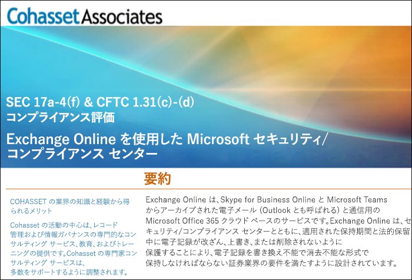

# Exchange Online および セキュリティ/コンプライアンス センターを使用して米国証券取引委員会規則 17a-4 (SEC Rule 17a-4) に準拠する

データ保持に関する規制基準への準拠が組織で必要な場合に、Office 365 セキュリティ/コンプライアンス センターは Exchange Online 上のデータのライフサイクル管理機能を提供します。これには、データを保持、監査、検索、およびエクスポートする機能が含まれます。これらの機能は、ほとんどの組織でのニーズを満たすために十分な機能です。

ただし、規制が厳しい業界の一部の組織は、より厳格な規制要件を遵守する必要があります。たとえば、銀行や株式仲介業者などの金融機関は、証券取引委員会 (SEC) が発行する規則 17a-4 を遵守する必要があります。規則 17a-4 には、記録保持の期間、形式、品質、可用性、および責任などの記録の管理に関する多くの側面を含む、電子データの記憶域に関する特定の要件が含まれます。

セキュリティ/コンプライアンス センターを活用して Exchange Online での規制上の義務 (特に、規則 17a-4 の要件に関する義務) を遵守することができ、これをこれらの組織でもっと知っていただくために、Microsoft は Cohasset Associates と協力して評価をリリースしました。

Exchange Online および セキュリティ/コンプライアンス センターは、推奨通りに構成した場合、米国商品先物取引委員会規則 1.31(c)-(d) (CFTC Rule 1.31(c)-(d) )、米国金融取引業規制機構規則 4511 (FINRA Rule 4511)、および米国証券取引委員会規則 17a-4 (SEC Rule 17a-4) における記憶域に関する該当要件に準拠することが、Cohasset により検証されました。これらの規則を検証の対象とした理由は、これらの規則は金融機関における記録保持に関する世界的に最も影響力のある規範のガイダンスであるためです。

## Cohasset 評価をダウンロードする

[Cohasset 評価はこちらからダウンロード](https://servicetrust.microsoft.com/ViewPage/TrustDocuments?command=Download&downloadType=Document&downloadId=9fa8349d-a0c9-47d9-93ad-472aa0fa44ec&docTab=6d000410-c9e9-11e7-9a91-892aae8839ad_FAQ_and_White_Papers)できます。

## この評価は、Exchange Online に固有のものです

この評価は Exchange Online にのみ関するものであることにご留意ください。将来的には SharePoint Online や OneDrive for Business などの他の Office 365 サービスでも米国証券取引委員会規則 17a-4 (SEC Rule 17a-4) に関するサポートを予定していますが、これらのサービスは本評価には含まれません。

Skype for Business および Teams も Exchange Online にデータを保存します。そのため、Skype for Business メッセージおよび Teams からのチャンネル メッセージおよびチャット メッセージも評価対象に含まれます。

## 推奨構成の鍵は保持ロックを使用することです

規制が厳しい業界では多くの場合、WORM (書き込みは一度だけ、読み取りは何度でも) 要件に準拠するために電子通信の保存が義務づけられます。WORM 要件に準拠するストレージ ソリューションでは、記録に関して次の条件を満たす必要があります。

- 記録は義務づけられた保持期間保持される必要があります。保持期間を短縮することはできず、延長のみが可能です。
- 記録は不変である必要があります。つまり、保持期間中は記録の上書き、消去、または変更をすることができません。

Exchange Online では、ユーザーのメール ボックスに[アイテム保持ポリシー](retention-policies.md)が適用された場合、ポリシーの条件に基づきユーザーのすべてのコンテンツが保持されます。実際に、ユーザーがメールの削除または変更を試みると、変更される前のメールのコピーがユーザーのメール ボックス内の保護された、非表示の場所に保存されます。アイテム保持ポリシーは組織での電子通信の保持を可能にしますが、それらのポリシーは変更することができます。

保持ロックをアイテム保持ポリシーに配置することにより、組織はポリシーの変更ができないようにすることができます。実際に、保持ロックがアイテム保持ポリシーに適用されると、次の操作が制限されます。

- ポリシーの保持期間は延長のみが可能で、短縮することはできません。
- ユーザーをポリシーに追加することはできますが、ユーザーを削除することはできません。
- アイテム保持ポリシーを管理者が削除することはできません。

保持ロックを使用して、米国証券取引委員会規則 17a-4 の規制要件を満たすことができます。

## 保持ロックを設定する方法

PowerShell を使用してアイテム保持ポリシーをロックすることができます。詳細については、「[アイテム保持ポリシーをロックする](retention-policies.md#locking-a-retention-policy)」を参照してください。

## 既知の制限

Exchange Online でいくつかの制限があることを把握しています。Microsoft ではこの問題に現在取り組んでおり、次のシナリオへのサポートを 2019 年 7 月にリリースする予定にしています。

- アイテム レベルの監査は Office 365 グループのメールボックスでサポートされていません。
- スレッド形式の通信は、Teams チャットおよびチャンネル メッセージでサポートされていません。
- Teams チャットおよびチャンネル メッセージでの "いいね" は保持されません。
