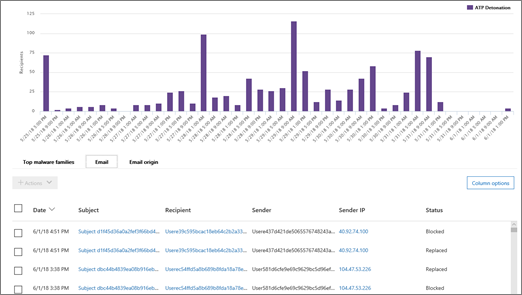

# エクスプ ローラーを使用して、セキュリティで&amp;コンプライアンス センター

場合は、組織に[Office 365 の脅威インテリジェンス](office-365-ti.md)があり、ユーザーが必要な権限を持っている場合は、識別し、脅威を分析するのにはエクスプ ローラーを使用できます。などの識別し配信された、悪意のあるメールを削除したり、Office 365 のセキュリティ機能でキャッチされたマルウェアを参照してください。(脅威のエクスプ ローラーとも呼ばれます) をエクスプ ローラーでは、強力なセキュリティ レポートをリアルタイムに近い&amp;コンプライアンス センターです。
  

  
セキュリティでエクスプ ローラーを使用する&amp;コンプライアンス センターでは、**脅威の管理**に移動\>**エクスプ ローラー**です。

> [!IMPORTANT]
> 2019 の 2 月に開始し、今後数か月にロールアウト、Office 365 の脅威インテリジェンスは Office 365 高度な脅威保護計画 2、あらたな脅威保護機能となりつつあります。詳細については、 [Office 365 の高度な脅威保護の計画と価格設定](https://products.office.com/exchange/advance-threat-protection)と[Office 365 高度な脅威保護サービスの説明](https://docs.microsoft.com/office365/servicedescriptions/office-365-advanced-threat-protection-service-description)を参照してください。
      
## エクスプ ローラーの概要

エクスプ ローラーでは、組織に電子メールでマルウェアを疑いがあると、Office 365 内のファイルだけでなく他のセキュリティ上の脅威やリスクについての情報が表示されます。最初にエクスプ ローラーを開くと、既定のビューは、過去 7 日間のウイルスからのマルウェアの検出を示します。エクスプ ローラーもセキュリティ保護機能[安全リンク](atp-safe-links.md)[安全な添付ファイル](atp-safe-attachments.md)など、Office 365 でと、過去 30 日間のデータを表示するのには変更することができます。
  

  
表示する情報を変更するのには、[表示] メニューを使用します。
  
![エクスプ ローラーの [表示] メニュー](media/2bb34f58-555f-4967-ba55-740334ef1f8e.png)
  
エクスプ ローラーには、いくつかのフィルター処理とクエリ上は、ユーザー、一番上のマルウェア ファミリでは、対象となるなどの詳細にドリル ダウンすることを可能にする機能があります。レポートの各種類には、さまざまな表示およびデータを表示する方法が用意されています。

> [!IMPORTANT]
> ワイルドカード文字、アスタリスク (*) または疑問符 (?)、エクスプ ローラーでは使えません。電子メール メッセージの [件名] フィールドで検索すると、エクスプ ローラーは部分に一致し、徐行を表すような結果ワイルドカード検索を実行します。

## 電子メール\>マルウェア

このビューには、マルウェアが含まれていると識別された電子メール メッセージが表示されます。  

マルウェア ファミリ、送信者のドメイン、送信元 IP、保護の状態 (アクション、脅威の保護機能と Office 365 のポリシーによって)、および検出技術が (どのようにマルウェアが検出されました)、グラフ内の情報を表示します。  

         

上のマルウェアのファミリの詳細を表示、グラフの下上部には、ユーザー、および特定のメッセージに関する詳細が対象となります。 

## 電子メール\>フィッシング詐欺

このビューには、フィッシング攻撃として識別された電子メール メッセージが表示されます。  

送信者ドメイン、送信元 IP、および保護の状態 (、脅威の保護機能と Office 365 のポリシーが実行するアクション) での情報を表示します。 

 

、グラフの下には、特定のメッセージに関する詳細を表示します。 

## 電子メール\>ユーザーから報告されました。

このビューには、ユーザーが迷惑メール、迷惑メールまたはフィッシング詐欺メールとして報告された電子メールが表示されます。  

レポートの種類 (ユーザーの確認メールが迷惑メール、迷惑メールまたはフィッシングのこと)、および配送の理由 (理由が電子メールを迷惑メール フィルターのポリシー、メール フロー ルール、受信拒否リスト、差出人セーフ リストなどの特定の場所になった理由は、情報を表示します。など)。  

  

、グラフの下部に、件名、送信者の IP アドレスとして、迷惑メール、しない、迷惑メールまたはフィッシング、などのメッセージを報告したユーザーなど、特定の電子メール メッセージに関する詳細を表示します。 

## 電子メール\>すべてのメール

このビューは、悪意あるコードとして期日にフィッシング詐欺やマルウェア、悪意のないすべてのメールを (通常の電子メール、スパム、およびメールを一括) と同じよう特定電子メールを含む電子メール活動のすべての表示を示します。 

> [!NOTE]
> というエラーが発生する場合**が多くのデータを表示するのには**フィルターを追加し、必要に応じて、表示されている日付の範囲を絞り込む、です。 

フィルターを適用するには、**送信者**を選択します] ボックスの一覧で項目を選択、[更新] ボタンをクリックし。この例では、フィルター (はいくつかオプションを使用) として**検出技術**を使用しました。送信者、送信者のドメイン、受信者、件名、添付ファイルの名前、マルウェア ファミリ、保護の状態 (アクション、脅威の保護機能と Office 365 のポリシーによって)、(どのようにマルウェアが検出されました)、検出技術によって情報を表示し、もっとその。 

 

、グラフの下には、件名、受信者、送信者、状態、などの特定の電子メール メッセージに関する詳細を表示します。 

## コンテンツ\>マルウェア

このビューには、ビジネス、およびマイクロソフトのチームの SharePoint のオンライン、OneDrive で悪意のあるものとして識別されたファイルが表示されます。

(どのようにマルウェアが検出されました)、マルウェア ファミリ、検出テクノロジーを使用して情報を表示し (OneDrive、SharePoint、またはチーム) の作業負荷。 

  

、グラフの下には、添付ファイルのファイル名、作業負荷、ファイル、および詳細を最後に変更したファイルのサイズなどの特定のファイルに関する詳細を表示します。 
  
## (New!)をクリックします-へのフィルターの機能

エクスプ ローラーにはフィルターを適用する] をクリックする機能です。凡例内の項目をクリックすると、遅延の月 2018 年そのアイテムは、レポートのフィルターになります。たとえば、エクスプ ローラーの [マルウェア] ビューを表示するいるとします。
  

  
このグラフの結果で次のようなビューでは、 **ATP (デトネーション)** をクリックすると。 
  

  
このビューでは、ここで見て[Office 365 ATP の安全な添付ファイル](atp-safe-attachments.md)で detonated されたファイルのデータです。、グラフの下部に安全な添付ファイルの分析ツールによって検出された添付ファイルを含む特定の電子メール メッセージに関する詳細情報を確認できます。
  

  
1 つまたは複数の項目を選択するには、選択した項目を選択するいくつかの選択肢を提供する [**アクション**] メニューがアクティブにします。 
  
![[操作] メニューをアクティブにアイテムを選択します。](media/95f127a4-1b2a-4a76-88b9-096e3ba27d1b.png)
  
クリックでフィルター処理し、特定の詳細に移動することで保存でく多くの時間の脅威を調査します。
  
## エクスプ ローラーを取得する方法は?

エクスプ ローラーは、 [Office 365 の脅威インテリジェンス](office-365-ti.md)に含まれています。 

表示してエクスプ ローラーを使用するためには、セキュリティ管理者やセキュリティのリーダーに与えられているなど、適切なアクセス許可が必要です。詳細についてを参照してください[では、Office 365 のセキュリティ アクセス許可&amp;コンプライアンス センター](permissions-in-the-security-and-compliance-center.md)です。
  
## 関連項目

[レポートと Office 365 のセキュリティ情報&amp;コンプライアンス センター](reports-and-insights-in-security-and-compliance.md)
  
[検索し、(Office 365 の脅威インテリジェンス) に配信された悪意のある電子メールを調査](investigate-malicious-email-that-was-delivered.md)
  
[Office 365 のスパム対策とマルウェア対策の保護](anti-spam-and-anti-malware-protection.md)
  

