# 電子メール通知を送信し、DLP ポリシーのポリシーのヒントを表示します。Send email notifications and show policy tips for DLP policies

識別、監視、および Office 365 の間で機密情報を保護するのには、データ損失防止 (DLP) ポリシーを使用できます。機密性の高い情報を常に、DLP ポリシーに準拠して作業している組織内のユーザーがその作業で不必要にブロックしたくないです。これは、電子メールによる通知とポリシーのヒントが役立つことができます。You can use a data loss prevention (DLP) policy to identify, monitor, and protect sensitive information across Office 365. You want people in your organization who work with this sensitive information to stay compliant with your DLP policies, but you don't want to block them unnecessarily from getting their work done. This is where email notifications and policy tips can help.
  
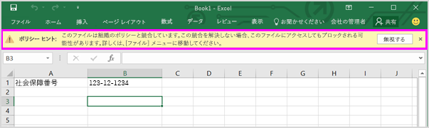
  
ポリシー ヒント通知または他のユーザーは、DLP ポリシーと競合するコンテンツを使用する場合に表示される警告では、たとえば、Excel ブック内の個人を特定できる情報 (PII) が含まれています、ビジネス サイトの OneDrive のようなコンテンツの外部ユーザーと共有します。A policy tip is a notification or warning that appears when someone is working with content that conflicts with a DLP policy—for example, content like an Excel workbook on a OneDrive for Business site that contains personally identifiable information (PII) and is shared with an external user.
  
意識を高めるし、組織のポリシーについてユーザーを教育するためには、電子メールによる通知とポリシーのヒントを使用できます。人にしているがブロックされていない有効なビジネスがある場合、ポリシーをオーバーライドする必要があることまたはポリシーが誤検出を検出するかどうかも設定できます。You can use email notifications and policy tips to increase awareness and help educate people about your organization's policies. You can also give people the option to override the policy, so that they're not blocked if they have a valid business need or if the policy is detecting a false positive.
  
Office 365 のセキュリティで&amp;コンプライアンス ・ センターでは、DLP ポリシーを作成するとき、ユーザー通知を構成できます。In the Office 365 Security &amp; Compliance Center, when you create a DLP policy, you can configure the user notifications to:
  
- 電子メール通知を送信する人を選択する問題について説明します。Send an email notification to the people you choose that describes the issue.
    
- DLP ポリシーと競合するコンテンツのポリシーに関するヒントを表示します。Display a policy tip for content that conflicts with the DLP policy:
    
  - ポリシーのヒントは、Outlook 2013 以降で、web 上の Outlook で電子メールのメッセージが構成されているときに上の受信者にメッセージの上部に表示されます。For email in Outlook on the web and Outlook 2013 and later, the policy tip appears at the top of a message above the recipients while the message is being composed.
    
  - ビジネス アカウントまたは SharePoint Online サイトの OneDrive では、ドキュメントの項目に表示される警告のアイコンがポリシーのヒントが示されます。詳細を表示する項目を選択し、**情報**を選択ページを開くには、詳細ウィンドウの右上隅にします。For documents in a OneDrive for Business account or SharePoint Online site, the policy tip is indicated by a warning icon that appears on the item. To view more information, you can select an item and then choose **Information** in the upper-right corner of the page to open the details pane. 
    
  - メッセージ バーおよびタブで Excel 2016、PowerPoint の 2016年とビジネス サイトまたは DLP ポリシーに含まれている SharePoint Online サイトの OneDrive に格納されている 2016 の Word ドキュメントでは、ポリシーのヒントが表示されます (**ファイル**] メニューの [ \> **情報**)。For Excel 2016, PowerPoint 2016, and Word 2016 documents that are stored on a OneDrive for Business site or SharePoint Online site that's included in the DLP policy, the policy tip appears on the Message Bar and the Backstage view ( **File** menu \> **Info**).
    
## DLP ポリシーにユーザーの通知を追加します。Add user notifications to a DLP policy

DLP ポリシーを作成するときに電子メールによる通知とポリシーのヒントの両方は、**ユーザーの通知**] セクションの一部です。When you create a DLP policy, both email notifications and policy tips are part of the **User notifications** section. 
  
1. [https://protection.office.com](https://protection.office.com) に移動します。Go to [https://protection.office.com](https://protection.office.com).
    
2. 職場、学校のアカウントを使用して Office 365 にサインインします。Office 365 のセキュリティの&amp;コンプライアンス センターです。Sign in to Office 365 using your work or school account. You're now in the Office 365 Security &amp; Compliance Center.
    
3. セキュリティ&amp;コンプライアンス センター\>左側のナビゲーション\>**データの損失防止** \> **ポリシー** \> **+ ポリシーの作成**。In the Security &amp; Compliance Center \> left navigation \> **Data loss prevention** \> **Policy** \> **+ Create a policy**.
    
    ![[ポリシー] のボタンを作成します。](media/b1e48a08-92e2-47ca-abdc-4341694ddc7c.png)
  
4. DLP ポリシー テンプレートを保護する必要のある機密性の高い情報の種類を選択して\>**次**です。Choose the DLP policy template that protects the types of sensitive information that you need \> **Next**.
    
    空のテンプレートを使用して起動するのには [**カスタム**] を選択します\>**カスタム ポリシー** \> **次**です。To start with an empty template, choose **Custom** \> **Custom policy** \> **Next**.
    
5. ポリシーの名前\>**次**です。Name the policy \> **Next**.
    
6. DLP ポリシーで保護するための場所を選択するには、次のいずれかの操作を行います。To choose the locations that you want the DLP policy to protect, do one of the following:
    
  - **Office 365 内のすべての場所**を選択して\>**次**です。Choose **All locations in Office 365** \> **Next**.
    
  - **自分で特定の場所を選択**を選択して\>**次**です。Choose **Let me choose specific locations** \> **Next**.
    
    オン/オフなど、すべての Exchange 電子メールまたは OneDrive のすべてのアカウントは、全体の場所を含めたり除外したり、その場所の**状態**を切り替えます。To include or exclude an entire location such as all Exchange email or all OneDrive accounts, switch the **Status** of that location on or off. 
    
    のみ特定の SharePoint サイトまたは OneDrive アカウントは、スイッチ**の状態**と特定のサイトまたはアカウントを選択するのに**含める**] で [リンク] をクリックします。To include only specific SharePoint sites or OneDrive accounts, switch the **Status** to on, and then click the links under **Include** to choose specific sites or accounts. 
    
7. 選択の**詳細設定を使用する** \> **次**です。Choose **Use advanced settings** \> **Next**.
    
8. **+ 新しいルール**を選択します。Choose **+ New rule**.
    
9. 規則エディターで、[**ユーザー通知**の状態をオンにします。In the rule editor, under **User notifications**, switch the status on.
    
    ![ルール エディターのユーザーの通知] セクション](media/47705927-c60b-4054-a072-ab914f33d15d.png)
  
## 電子メール通知を構成するためのオプションOptions for configuring email notifications

DLP ポリシーのそれぞれのルールで、次のことを行えます。For each rule in a DLP policy, you can:
  
- 選択したユーザーに通知を送信します。これらのユーザーとしては、コンテンツ所有者、コンテンツの最終変更者、コンテンツが格納されているサイトの所有者、または特定のユーザーなどが挙げられます。Send the notification to the people you choose. These people can include the owner of the content, the person who last modified the content, the owner of the site where the content is stored, or a specific user.
    
- HTML またはトークンを使用して、通知に含まれるテキストをカスタマイズします。詳細については、以下のセクションを参照してください。Customize the text that's included in the notification by using HTML or tokens. See the section below for more information.
    
> [!NOTE]
>  個々 の受信者電子メール通知を送信することができます: グループまたは配布リストではありません。_gt 新しいコンテンツだけでは、電子メール通知をトリガーします。既存のコンテンツを編集するポリシーのヒントがない電子メール通知をトリガーします。Email notifications can be sent only to individual recipients—not groups or distribution lists. >  Only new content will trigger an email notification. Editing existing content will trigger policy tips but not an email notification. 
  
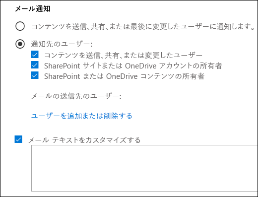
  
### 既定の電子メールの通知Default email notification

通知では、電子メール、または"アクセスがブロックのドキュメントのアクション、「通知」など「メッセージがブロックされている」で始まる件名があります。通知メッセージの本文には、通知は、ドキュメントについては、ドキュメントが格納されているのし、ドキュメントのポリシーのヒントを表示、サイトに移動するためのリンクが含まれます (ポリシーのヒントについては、次のセクションを参照してください)、問題を解決する場所です。メッセージについて通知する場合は、通知メッセージが含まれる添付ファイルとして DLP ポリシーに一致します。Notifications have a Subject line that begins with the action taken, such as "Notification", "Message Blocked" for email, or "Access Blocked" for documents. If the notification is about a document, the notification message body includes a link that takes you to the site where the document's stored and opens the policy tip for the document, where you can resolve any issues (see the section below about policy tips). If the notification is about a message, the notification includes as an attachment the message that matches a DLP policy.
  
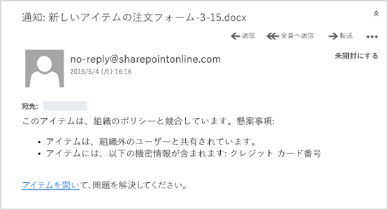
  
既定では、通知には、サイト上の項目に対して以下のようなテキストが表示されます。通知テキストは、ルールごとに個別に構成されるため、表示されるテキストは、一致するルールによって異なります。By default, notifications display text similar to the following for an item on a site. The notification text is configured separately for each rule, so the text that's displayed differs depending on which rule is matched.

|**構成されている DLP ポリシー ルール****If the DLP policy rule does this…**|**[SharePoint または OneDrive のビジネス ドキュメント用の既定の通知では、.****Then the default notification for SharePoint or OneDrive for Business documents says this…**|**Outlook のメッセージの既定の通知では、.****Then the default notification for Outlook messages says this…**|
|:-----|:-----|:-----|
|通知を送りますが、上書きを許可しません。Sends a notification but doesn't allow override    |この項目は、組織内のポリシーと矛盾します。This item conflicts with a policy in your organization.    |電子メール メッセージが組織のポリシーと競合、です。Your email message conflicts with a policy in your organization.    |
|アクセスをブロックし、通知を送信し、上書きを許可しますBlocks access, sends a notification, and allows override    |この項目は、組織内でのポリシーと競合します。この競合を解決しない場合は、このファイルへのアクセスがブロックされています。This item conflicts with a policy in your organization. If you don't resolve this conflict, access to this file might be blocked.    |電子メール メッセージが組織のポリシーと競合、です。メッセージは、すべての受信者に配信されませんでした。Your email message conflicts with a policy in your organization. The message wasn't delivered to all recipients.    |
|アクセスをブロックし、通知を送信しますBlocks access and sends a notification    |この項目は、組織内のポリシーと矛盾します。この項目へのアクセスは、その所有者、最終変更者、およびサイトコレクション管理者 (プライマリ) 以外のすべてのユーザーに対してブロックされます。This item conflicts with a policy in your organization. Access to this item is blocked for everyone except its owner, last modifier, and the primary site collection administrator.    |電子メール メッセージが組織のポリシーと競合、です。メッセージは、すべての受信者に配信されませんでした。Your email message conflicts with a policy in your organization. The message wasn't delivered to all recipients.    |
   
### カスタム電子メール通知Custom email notification

エンド ・ ユーザーや管理者を既定の電子メール通知を送信する代わりに、カスタムの電子メール通知を作成することができます。カスタム電子メール通知は、HTML をサポートし、5,000 文字に制限します。HTML を使用すると、画像、書式、およびその他の通知でブランド化を含めることができます。You can create a custom email notification instead of sending the default email notification to your end users or admins. The custom email notification supports HTML and has a 5,000-character limit. You can use HTML to include images, formatting, and other branding in the notification.
  
電子メール通知をカスタマイズするために次のトークンを使用することもできます。これらのトークンは、送信される通知で特定の情報で置き換えられる変数です。You can also use the following tokens to help customize the email notification. These tokens are variables that are replaced by specific information in the notification that's sent.

|**トークン****Token**|**説明****Description**|
|:-----|:-----|
|%% AppliedActions %%%%AppliedActions%%    |コンテンツに適用されるアクションです。The actions applied to the content.    |
|%% ContentURL %%%%ContentURL%%    |ビジネス サイトに SharePoint Online サイトまたは OneDrive 上のドキュメントの URL です。The URL of the document on the SharePoint Online site or OneDrive for Business site.    |
|%% MatchedConditions %%%%MatchedConditions%%    |コンテンツと一致した条件です。コンテンツに関する問題のユーザーに通知するのにには、このトークンを使用します。The conditions that were matched by the content. Use this token to inform people of possible issues with the content.    |
   
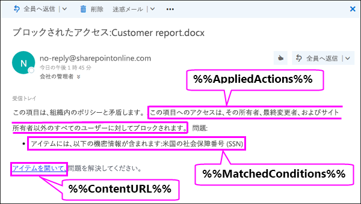
  
## ポリシー ヒントを構成するためのオプションOptions for configuring policy tips

DLP ポリシー内の各ルールに関して、次の事柄を行うポリシー ヒントを構成できます。For each rule in a DLP policy, you can configure policy tips to:
  
- この人に DLP ポリシーを使用するコンテンツが競合している競合を解決するのにはアクションを実行できるようにします。既定のテキストを使用することができます (次の表を参照してください) か、または組織の特定のポリシーに関するユーザー設定のテキストを入力します。Simply notify the person that the content conflicts with a DLP policy, so that they can take action to resolve the conflict. You can use the default text (see the tables below) or enter custom text about your organization's specific policies.
    
- ユーザーによる DLP ポリシーの上書きを許可します。必要に応じて、次のことも行えます。Allow the person to override the DLP policy. Optionally, you can:
    
  - ユーザー ポリシーをオーバーライドするためのビジネス ・ ジャスティフィケーションを入力する必要があります。この情報をログに記録され、それを表示するには、セキュリティの [**レポート**] セクションで DLP のレポートに&amp;コンプライアンス センターです。Require the person to enter a business justification for overriding the policy. This information is logged and you can view it in the DLP reports in the **Reports** section of the Security &amp; Compliance Center. 
    
  - ユーザーが誤検知を報告し、DLP ポリシーを上書きできるようにします。この情報はレポート用にも記録されるので、誤検知を使用してルールを微調整できます。Allow the person to report a false positive and override the DLP policy. This information is also logged for reporting, so that you can use false positives to fine tune your rules.
    
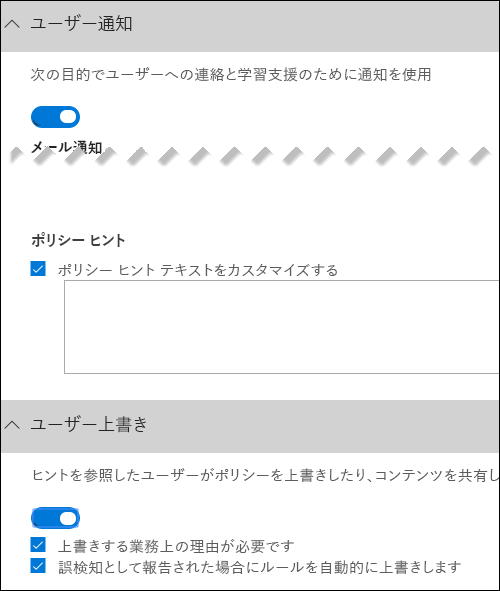
  
たとえば、個人を特定できる情報 (PII) を検出する DLP ポリシーがビジネス サイトの OneDrive を適用する必要があり、このポリシーには次の 3 つのルール。For example, you may have a DLP policy applied to OneDrive for Business sites that detects personally identifiable information (PII), and this policy has three rules:
  
1. 最初のルール:5 個以下の対象機密情報インスタンスがドキュメントで検出され、ドキュメントが組織内のユーザーと共有されている場合、[**通知を送信**] アクションによってポリシー ヒントが表示されます。ポリシー ヒントについては、上書きオプションは必要ありません。このルールは単にユーザーに通知を行うだけで、アクセスをブロックするわけではないからです。First rule: If fewer than five instances of this sensitive information are detected in a document, and the document is shared with people inside the organization, the **Send a notification** action displays a policy tip. For policy tips, no override options are necessary because this rule is simply notifying people and not blocking access. 
    
2. 2 つ目のルール: を超える文書で、この機密情報の 5 つのインスタンスが検出され、ドキュメントが組織内のユーザーと共有、**コンテンツへのアクセスをブロック**操作制限されるファイル、および、**のアクセス許可通知を送信する**アクションは、ビジネス ・ ジャスティフィケーションを提供することでこのルールのアクションをオーバーライドするメンバーを使用します。組織のビジネス、個人情報のデータを共有する内部の人を必要とし、DLP ポリシーは、この作業をブロックしたくないです。Second rule: If greater than five instances of this sensitive information are detected in a document, and the document is shared with people inside the organization, the **Block access to content** action restricts the permissions for the file, and the **Send a notification** action allows people to override the actions in this rule by providing a business justification. Your organization's business sometimes requires internal people to share PII data, and you don't want your DLP policy to block this work. 
    
3. 3 番目のルール:5 個を超える対象機密情報インスタンスがドキュメントで検出され、組織外のユーザーとドキュメントを共有する場合、[**コンテンツへのアクセスの禁止**] アクションによってファイルのアクセス許可が制限され、[**通知の送信**] アクションではこのルールのアクションの上書きをユーザーに許可しません。情報が外部共有されているためです。いかなる状況においても、組織内のユーザーが組織外で PII データを共有することを許可すべきではありません。Third rule: If greater than five instances of this sensitive information are detected in a document, and the document is shared with people outside the organization, the **Block access to content** action restricts the permissions for the file, and the **Send a notification** action does not allow people to override the actions in this rule because the information is shared externally. Under no circumstances should people in your organization be allowed to share PII data outside the organization. 
    
ルールを上書きするポリシー ヒントを使用する際に把握しておくべきいくつかの点を以下に記します。Here are some fine points to understand about using a policy tip to override a rule:
  
- オーバーライドするためのオプションは、1 つの規則、および以外はオーバーライドできませんが、通知を送信する) ルールのアクションのすべてを上書きします。The option to override is per rule, and it overrides all of the actions in the rule (except sending a notification, which can't be overridden).
    
- DLP ポリシーでは、いくつかのルールに一致するコンテンツがありますが、最も制限の厳しい、最も高い優先順位の規則によるポリシーのヒントのみが表示されます。たとえば、単に通知を送信するルールをポリシーのヒントに表示されるコンテンツへのアクセスをブロック ルールをポリシー ヒントです。これは人が次々 にポリシーのヒントを表示することを防ぎます。It's possible for content to match several rules in a DLP policy, but only the policy tip from the most restrictive, highest-priority rule will be shown. For example, a policy tip from a rule that blocks access to content will be shown over a policy tip from a rule that simply sends a notification. This prevents people from seeing a cascade of policy tips.
    
- 最も制限の厳しいルールのポリシー ヒントによってルールの上書きがユーザーに許可される場合、対象ルールを上書きすると、コンテンツが一致する他のルールも上書きされます。If the policy tips in the most restrictive rule allow people to override the rule, then overriding this rule also overrides any other rules that the content matched.
    
## OneDrive for Business サイトと SharePoint Online サイトのポリシー ヒントPolicy tips on OneDrive for Business sites and SharePoint Online sites

ポリシーのヒントでは、ビジネス サイトや SharePoint Online サイトに、OneDrive 上のドキュメントが、DLP ポリシーの規則に一致して、そのルールは、ポリシーのヒントを使用して、ドキュメント上の特別なアイコンが表示されます。When a document on a OneDrive for Business site or SharePoint Online site matches a rule in a DLP policy, and that rule uses policy tips, the policy tips display special icons on the document:
  
1. ルールによってファイルに関する通知が送信される場合は、警告アイコンが表示されます。If the rule sends a notification about the file, the warning icon appears.
    
2. ルールによってドキュメントへのアクセスがブロックされる場合には、ブロック済みアイコンが表示されます。If the rule blocks access to the document, the blocked icon appears.
    
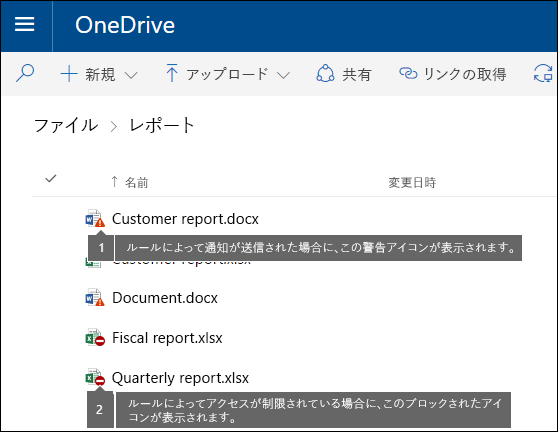
  
ドキュメントに対してアクションを実行する、アイテムを選択することができます\>**情報**を選択するページを開くには、詳細ウィンドウの右上隅に\>**ポリシーのヒントを表示**します。To take action on a document, you can select an item \> choose **Information** in the upper-right corner of the page to open the details pane \> **View policy tip**.
  
ポリシー ヒントにはコンテンツに関する問題が一覧表示され、ポリシー ヒントにオプションが構成されている場合には、[**解決**] を検索してから、ポリシー ヒントの [**上書き**] または誤検知の [**レポート**] を選択できます。The policy tip lists the issues with the content, and if the policy tips are configured with these options, you can choose **Resolve**, and then **Override** the policy tip or **Report** a false positive. 
  
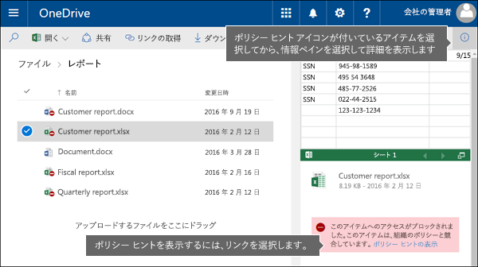
  
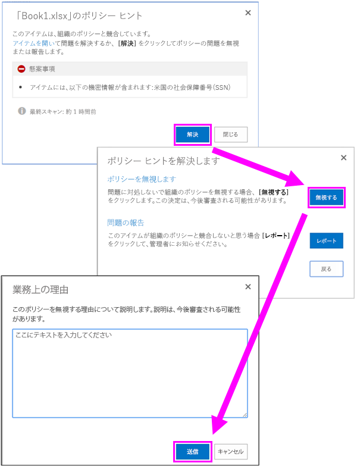
  
DLP ポリシーがサイトと同期され、コンテンツが定期的かつ非同期的に評価されます。それで、DLP ポリシーを作成してからポリシー ヒントが表示されるまで少しの遅延があります。ポリシーを解決または上書きしてから、サイトのドキュメントのアイコンが消えるまで同様の遅延が生じる可能性があります。DLP policies are synced to sites and contented is evaluated against them periodically and asynchronously, so there may be a short delay between the time you create the DLP policy and the time you begin to see policy tips. There may be a similar delay from when you resolve or override a policy tip to when the icon on the document on the site goes away.
  
### サイト上のポリシー ヒントの既定テキストDefault text for policy tips on sites

既定では、ポリシー ヒントは、サイト上の項目に対して以下のようなテキストを表示します。通知テキストは、ルールごとに個別に構成されるため、表示されるテキストは、一致するルールによって異なります。By default, policy tips display text similar to the following for an item on a site. The notification text is configured separately for each rule, so the text that's displayed differs depending on which rule is matched.

|**構成されている DLP ポリシー ルール****If the DLP policy rule does this…**|**既定のポリシー ヒント内容****Then the default policy tip says this…**|
|:-----|:-----|
|通知を送りますが、上書きを許可しません。Sends a notification but doesn't allow override    |この項目は、組織内のポリシーと矛盾します。This item conflicts with a policy in your organization.    |
|アクセスをブロックし、通知を送信し、上書きを許可しますBlocks access, sends a notification, and allows override    |この項目は、組織内でのポリシーと競合します。この競合を解決しない場合は、このファイルへのアクセスがブロックされています。This item conflicts with a policy in your organization. If you don't resolve this conflict, access to this file might be blocked.    |
|アクセスをブロックし、通知を送信しますBlocks access and sends a notification    |この項目は、組織内のポリシーと矛盾します。この項目へのアクセスは、その所有者、最終変更者、およびサイトコレクション管理者 (プライマリ) 以外のすべてのユーザーに対してブロックされます。This item conflicts with a policy in your organization. Access to this item is blocked for everyone except its owner, last modifier, and the primary site collection administrator.    |
   
### サイト上のポリシーのヒントについては、ユーザー設定のテキストCustom text for policy tips on sites

E メール通知から個別にポリシーのヒントのテキストをカスタマイズすることができます。電子メール通知 (セクションの上を参照) のユーザー設定のテキストとは異なり HTML またはトークン ポリシーのヒントについては、ユーザー設定のテキストは使用できません。代わりに、ポリシーのヒントについては、ユーザー設定のテキストは、テキストは 256 文字に制限されただけです。You can customize the text for policy tips separately from the email notification. Unlike custom text for email notifications (see above section), custom text for policy tips does not accept HTML or tokens. Instead, custom text for policy tips is plain text only with a 256-character limit.
  
## ポリシーは、web 上の Outlook と Outlook 2013 以降でのヒントします。Policy tips in Outlook on the web and Outlook 2013 and later

Web 上の Outlook と Outlook 2013 で新しい電子メールを作成して以降では、DLP ポリシー内のルールに一致するコンテンツを追加する場合、ポリシーに関するヒントが表示され、そのルールは、ポリシーのヒントを使用しています。メッセージが構成されているときに、受信者の上、メッセージの上部にあるポリシーのヒントが表示されます。When you compose a new email in Outlook on the web and Outlook 2013 and later, you'll see a policy tip if you add content that matches a rule in a DLP policy, and that rule uses policy tips. The policy tip appears at the top of the message, above the recipients, while the message is being composed.
  
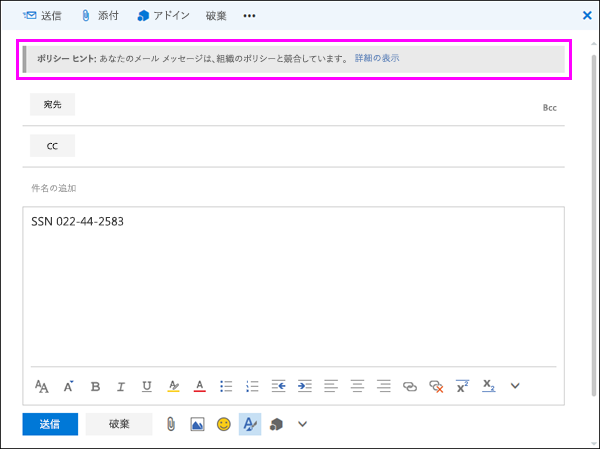
  
ポリシーは、機密性の高い情報は、メッセージの本文、件名、またはメッセージの添付ファイルにも次のようにするかどうかの作業をヒントします。Policy tips work whether the sensitive information appears in the message body, subject line, or even a message attachment as shown here.
  
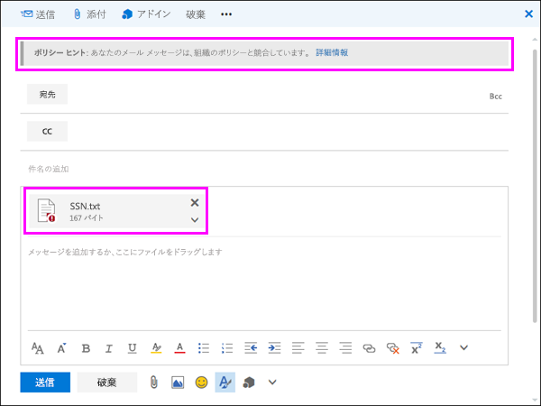
  
上書きを許可するようにポリシーのヒントを構成してが場合は、**詳細を表示する**を選択\>**オーバーライド**\>業務の妥当性を入力するか、誤検出を報告\>**をオーバーライド**します。If the policy tips are configured to allow override, you can choose **Show Details** \> **Override** \> enter a business justification or report a false positive \> **Override**.
  
![展開して [上書き] オプションを表示するメッセージにポリシーのヒント](media/28bfb997-48a6-41f0-8682-d5e62488458a.png)
  
![ポリシー ヒントをオーバーライドすることができます、ポリシーのヒント] ダイアログ ボックス](media/f97e836c-04bd-44b4-aec6-ed9526ea31f8.png)
  
機密情報を電子メールに追加すると、あることを機密情報を追加すると、ポリシー ヒントが表示されるまでの待機時間に注意してください。Note that when you add sensitive information to an email, there may be latency between when the sensitive information is added and when the policy tip appears.

### Outlook 2013 といくつかの条件のみのポリシー ヒントの表示後のサポートOutlook 2013 and later supports showing policy tips for only some conditions

現時点では、Outlook 2013 以降ではこれらの条件にのみ表示されているポリシーのヒントをサポートしています。Currently, Outlook 2013 and later supports showing policy tips only for these conditions:

- コンテンツが含まれていますContent contains
- コンテンツを共有します。Content is shared

現在他の条件のポリシーのヒントを表示するためのサポートを作成しています。これらは次のとおりです。We're currently working on support for showing policy tips for additional conditions. These include:

- 電子メール添付ファイルのコンテンツをスキャンできませんでした。Any email attachment's content could not be scanned
- 電子メール添付ファイルのコンテンツのスキャンを完了しませんでした。Any email attachment's content didn't complete scanning
- 添付ファイルのファイル拡張子は、します。Attachment file extension is
- 添付ファイルにはパスワードで保護されました。Attachment is password protected
- ドキュメント プロパティは、します。Document property is
- 受信者のドメインとはRecipient domain is
- 送信者の IP アドレスします。Sender IP address is

コンテンツに合わせるし、コンテンツに対する防策を適用するでは、Outlook でこれらの条件すべてが動作する注意してください。ユーザーにポリシーのヒントの表示はサポートされていません。Note that all of these conditions work in Outlook, where they will match content and enforce protective actions on content. But showing policy tips to users is not yet supported.
  
### Office 365 のセキュリティと Exchange 管理センターでのポリシーのヒント&amp;コンプライアンス センターPolicy tips in the Exchange Admin Center vs. the Office 365 Security &amp; Compliance Center

ポリシー ヒントが DLP ポリシーのいずれかで作業し、メール フロー ルールが、Exchange 管理センターで、または Office 365 のセキュリティで作成した DLP ポリシーを使用して作成された&amp;コンプライアンス ・ センターが、両方です。これは、これらのポリシーが別の場所に格納されているポリシーのヒントは、1 つの場所からのみ描画できるためです。Policy tips can work either with DLP policies and mail flow rules created in the Exchange Admin Center, or with DLP policies created in the Office 365 Security &amp; Compliance Center, but not both. This is because these policies are stored in different locations, but policy tips can draw only from a single location.
  
Exchange 管理センターで、Office 365 のセキュリティを構成するすべてのポリシー ヒント ポリシー ヒントを構成したかどうかは&amp;コンプライアンス センターは、web 上の Outlook と Outlook 2013 および交換のヒントをオフにするまでは、後でユーザーに表示されません管理センターです。これは、現在の Exchange トランスポート ルールは Office 365 のセキュリティに切り替えるときに選択するまでの作業を続けることにより、&amp;コンプライアンス センターです。If you've configured policy tips in the Exchange Admin Center, any policy tips that you configure in the Office 365 Security &amp; Compliance Center won't appear to users in Outlook on the web and Outlook 2013 and later until you turn off the tips in the Exchange Admin Center. This ensures that your current Exchange transport rules will continue to work until you choose to switch over to the Office 365 Security &amp; Compliance Center.
  
ポリシーのヒントは、1 つの場所からのみ描画できるときに電子メール通知を常に送信される両方の Office 365 のセキュリティでは、DLP ポリシーを使用している場合でも&amp;コンプライアンス センターと、Exchange 管理センターです。Note that while policy tips can draw only from a single location, email notifications are always sent, even if you're using DLP policies in both the Office 365 Security &amp; Compliance Center and the Exchange Admin Center.
  
### ポリシーの既定のテキストの電子メールをヒントします。Default text for policy tips in email

既定では、ポリシーのヒントは、電子メールは、次のようなテキストを表示します。By default, policy tips display text similar to the following for email.

|**構成されている DLP ポリシー ルール****If the DLP policy rule does this…**|**既定のポリシー ヒント内容****Then the default policy tip says this…**|
|:-----|:-----|
|通知を送りますが、上書きを許可しません。Sends a notification but doesn't allow override    |電子メールは、組織内でのポリシーと競合しています。Your email conflicts with a policy in your organization.    |
|アクセスをブロックし、通知を送信し、上書きを許可しますBlocks access, sends a notification, and allows override    |電子メールは、組織内でのポリシーと競合しています。Your email conflicts with a policy in your organization.    |
|アクセスをブロックし、通知を送信しますBlocks access and sends a notification    |電子メールは、組織内でのポリシーと競合しています。Your email conflicts with a policy in your organization.    |
   
## Excel 2016、PowerPoint 2016、Word 2016 におけるポリシー ヒントPolicy tips in Excel 2016, PowerPoint 2016, and Word 2016

ユーザーがデスクトップ バージョンの Excel 2016、PowerPoint 2016、Word 2016 内の機密情報を扱っている場合、ポリシー ヒントによってコンテンツが DLP ポリシーと矛盾することをリアルタイムでユーザーに通知できます。そのためには以下のことが必要となります。When people work with sensitive content in the desktop versions of Excel 2016, PowerPoint 2016, and Word 2016, policy tips can notify them in real time that the content conflicts with a DLP policy. This requires that:
  
- Office ドキュメントが、OneDrive for Business サイトまたは SharePoint Online サイトに格納されていること。The Office document is stored on a OneDrive for Business site or SharePoint Online site.
    
- ポリシー ヒントを使用するように構成されている DLP ポリシーでは、サイトが含まれます。The site is included in a DLP policy that's configured to use policy tips.
    
Office 2016 デスクトップ プログラムは、Office 365 から直接 DLP ポリシーを自動的に同期し、DLP ポリシーと競合しないでことを確認して、リアルタイムでポリシーのヒントを表示するドキュメントをスキャンし、します。These Office 2016 desktop programs automatically sync DLP policies directly from Office 365, and then scan your documents to ensure that they don't conflict with your DLP policies and display policy tips in real time.
  
DLP ポリシーにおけるポリシー ヒントの構成法によっては、ユーザーがポリシー ヒントを単に無視すること、業務上の理由を提供してまたは提供せずにポリシーを上書きすること、誤検知を報告することを選択できます。Depending on how you configure the policy tips in the DLP policy, people can choose to simply ignore the policy tip, override the policy with or without a business justification, or report a false positive.
  
ポリシー ヒントは、メッセージ バーに表示されます。Policy tips appear on the Message Bar.
  

  
また、ポリシー ヒントは、Backstage ビューにも表示されます ([**ファイル**タブ)。And policy tips also appear in the Backstage view (on the **File** tab). 
  
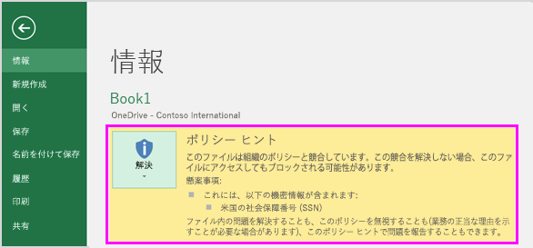
  
DLP ポリシーのポリシー ヒントにこれらのオプションが設定されている場合、[**解決**] を選択した後、ポリシー ヒントの [**上書き**]、または誤検知の [**レポート**] を選択できます。If policy tips in the DLP policy are configured with these options, you can choose **Resolve** to **Override** a policy tip or **Report** a false positive. 
  
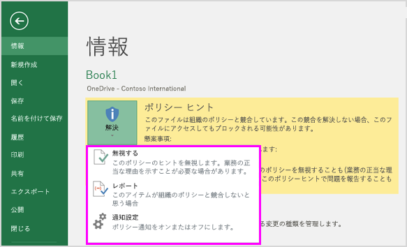
  
こうした各 Office 2016 デスクトップ プログラムでは、ユーザーは、ポリシー ヒントを無効にすることを選択できます。無効にすると、通知を単に行うポリシー ヒントはメッセージ バーにも Backstage ビュー ([**ファイル**] タブ) にも表示されません。ただし、ブロックおよび上書きに関するポリシー ヒントは依然表示され、電子メール通知も引き続き受け取ります。さらに、ポリシー ヒントを無効にしても、適用されている DLP ポリシーがドキュメントに対して無効になるわけではありません。In each of these Office 2016 desktop programs, people can choose to turn off policy tips. If turned off, policy tips that are simple notifications will not appear on the Message Bar or Backstage view (on the **File** tab). However, policy tips about blocking and overriding will still appear, and they will still receive the email notification. In addition, turning off policy tips does not exempt the document from any DLP policies that have been applied to it. 
  
### Excel 2016、PowerPoint 2016、Word 2016 におけるポリシー ヒントの既定テキストDefault text for policy tips in Excel 2016, PowerPoint 2016, and Word 2016

既定では、ポリシー ヒントは、開いているドキュメントのメッセージ バーと Backstage ビューに次のようなテキストを表示します。通知テキストは、ルールごとに個別に構成されるため、表示されるテキストは、一致するルールによって異なります。By default, policy tips display text similar to the following on the Message Bar and Backstage view of an open document. The notification text is configured separately for each rule, so the text that's displayed differs depending on which rule is matched.

|**構成されている DLP ポリシー ルール****If the DLP policy rule does this…**|**既定のポリシー ヒント内容****Then the default policy tip says this…**|
|:-----|:-----|
|通知を送りますが、上書きを許可しません。Sends a notification but doesn't allow override    |このファイルは、組織内でのポリシーと競合します。詳細については、[**ファイル**] メニューに移動します。This file conflicts with a policy in your organization. Go to the **File** menu for more information.    |
|アクセスをブロックし、通知を送信し、上書きを許可しますBlocks access, sends a notification, and allows override    |このファイルは、組織内でのポリシーと競合します。この競合を解決しない場合は、このファイルへのアクセスがブロックされています。詳細については、[**ファイル**] メニューに移動します。This file conflicts with a policy in your organization. If you don't resolve this conflict, access to this file might be blocked. Go to the **File** menu for more information.    |
|アクセスをブロックし、通知を送信しますBlocks access and sends a notification    |このファイルは、組織内でのポリシーと競合します。この競合を解決しない場合は、このファイルへのアクセスがブロックされています。詳細については、[**ファイル**] メニューに移動します。This file conflicts with a policy in your organization. If you don't resolve this conflict, access to this file might be blocked. Go to the **File** menu for more information.    |
   
### ポリシーのユーザー設定のテキストが Excel 2016、2016 の PowerPoint、および Word 2016 のヒントします。Custom text for policy tips in Excel 2016, PowerPoint 2016, and Word 2016

E メール通知から個別にポリシーのヒントのテキストをカスタマイズすることができます。電子メール通知 (セクションの上を参照) のユーザー設定のテキストとは異なり HTML またはトークン ポリシーのヒントについては、ユーザー設定のテキストは使用できません。代わりに、ポリシーのヒントについては、ユーザー設定のテキストは、テキストは 256 文字に制限されただけです。You can customize the text for policy tips separately from the email notification. Unlike custom text for email notifications (see above section), custom text for policy tips does not accept HTML or tokens. Instead, custom text for policy tips is plain text only with a 256-character limit.
  
## 詳細情報More information

- [データ損失防止ポリシーの概要Overview of data loss prevention policies](data-loss-prevention-policies.md)
    
- [テンプレートから DLP ポリシーを作成するCreate a DLP policy from a template](create-a-dlp-policy-from-a-template.md)
    
- [FCI または他のプロパティが使用されているドキュメントを保護する DLP ポリシーを作成するCreate a DLP policy to protect documents with FCI or other properties](protect-documents-that-have-fci-or-other-properties.md)
    
- [DLP ポリシー テンプレートに含まれるものWhat the DLP policy templates include](what-the-dlp-policy-templates-include.md)
    
- [機密情報の種類の検索基準:What the sensitive information types look for](what-the-sensitive-information-types-look-for.md)
    

