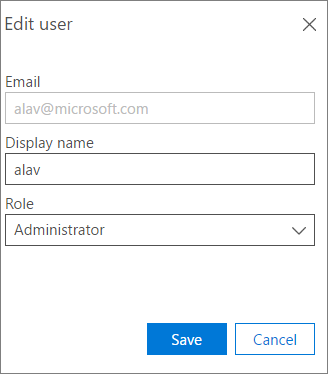

# Office 365 Advanced eDiscovery でのユーザー ロールとアクセスUser roles and access in Office 365 Advanced eDiscovery

次の表は、高度な電子的証拠開示のユーザーの役割とのアクセスをします。The following table lists the Advanced eDiscovery user roles and their access.
  
> [!NOTE]
> 高度な電子的証拠開示では、組織のコンプライアンスを高度なアドオンや、E5 のサブスクリプションの Office 365 E3 が必要です。その計画して高度な電子的証拠開示を実行する、 [Office 365 エンタープライズ E5 の試用版にサインアップ](https://go.microsoft.com/fwlink/p/?LinkID=698279)することができます。Advanced eDiscovery requires an Office 365 E3 with the Advanced Compliance add-on or an E5 subscription for your organization. If you don't have that plan and want to try Advanced eDiscovery, you can [sign up for a trial of Office 365 Enterprise E5](https://go.microsoft.com/fwlink/p/?LinkID=698279). 
  
## ユーザー ロールとアクセスUser roles and access

ユーザー ロールとアクセスがで定義されている**の設定やユーティリティ\>設定をテナント\>ユーザー管理**です。The user roles and access are defined in **Settings and utilities \> Tenant settings \> User administration**.
  
|**Module****Module**|**タスク****Task**|**管理者****Administrator**|**Manager****Manager**|**レビュー担当者****Reviewer**|
|:-----|:-----|:-----|:-----|:-----|
|サポート案件Cases    | このユーザーに割り当てられているケースの表示View cases assigned to this user    |XX    |XX    |XX    |
|| 追加または変更: この使用に割り当てられている場合Add / modify cases assigned to this use    |XX    |XX    ||
|| ケースにユーザーを割り当てるAssign users to a case    |XX    |XX    ||
|| ケースに自己を割り当てるAssign self to a case    |XX    |||
||ケースを削除します。Delete a case    |XX    |||
|準備Prepare    |プロセスProcess    |XX    |XX    ||
||分析Analyze    |XX    |XX    ||
|関連性Relevance    |関連性の設定Relevance setup    |XX    |XX    ||
||関連のトラックです。タグ、決定、およびテストRelevance - Track. Tag, Decide, and Test    |XX    |XX    |XX    |
|エクスポートExport    |エクスポートExport    |XX    |XX    ||
|レポートReports    |レポートReports    |XX    |XX    ||
|設定&amp;ユーティリティSetting &amp; utilities    |ユーザー管理User administration    |XX    |||
||テナントの設定Tenant settings    |XX    |||
||大文字の設定Case settings    |XX    |XX    ||
||ユーティリ ティー: 透明度の分析です。関連性の高さを変更します。Utilities: Transparency analysis; Modify relevance    |XX    |XX    |XX    |
||ユーティリティ: その他のUtilities: Other    |XX    |XX    ||
   
- ユーザーを編集するのには、ボックスの一覧でユーザーを選択し、**編集**] をクリックし、。To edit a user, select a user in the list, and then click **Edit** .
    
    * * ユーザーの編集 * * パネルの表示名、または役割を変更することができます。In the ** Edit user ** panel you can change the display name, or the Role. 
    
    
  
- ユーザーを追加するのには [**追加**] をクリックしますTo add a user, click **Add**
  
    **ユーザーの追加**] パネルでは、ユーザーの**電子メール****表示名**および**ロール**を入力します。In the **Add user** panel enter **Email**, **Display name** and **Role** for the user. 
    
- ユーザーを削除するをクリックし、の一覧でユーザーを選択し、[**削除**] をクリックして。To delete a user, select a user in the list, and then click **Delete**.
    
## 関連項目See also

[Office 365 Advanced eDiscoveryOffice 365 Advanced eDiscovery](office-365-advanced-ediscovery.md)
  
[ユーザーおよびサポート案件を設定します。Setting up users and cases](set-up-users-and-cases-in-advanced-ediscovery.md)

