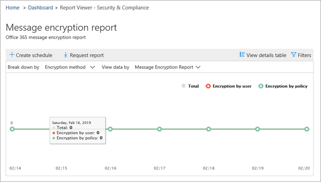
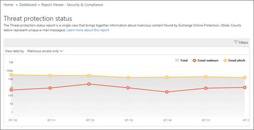

# セキュリティ&amp; /コンプライアンスセンターで電子メールのセキュリティレポートを表示するView email security reports in the Security &amp; Compliance Center

[ &amp;セキュリティコンプライアンスセンター](https://protection.office.com)では、Office 365 のスパム対策、マルウェア対策、暗号化機能などの電子メールセキュリティ機能が組織を保護していることを確認するのに役立つさまざまなレポートが提供されています。A variety of reports are available in the [Security &amp; Compliance Center](https://protection.office.com) to help you see how email security features, such as anti-spam, anti-malware, and encryption features in Office 365 are protecting your organization. [必要なアクセス許可](#what-permissions-are-needed-to-view-these-reports)がある場合は、**レポート** \> **ダッシュボード**にアクセスすること&amp;によって、セキュリティコンプライアンスセンターでこれらのレポートを表示できます。If you have the [necessary permissions](#what-permissions-are-needed-to-view-these-reports), you can view these reports in the Security &amp; Compliance Center by going to **Reports** \> **Dashboard**.
  

  
電子メールのセキュリティレポートには、次のようなものがあります。Your email security reports include the following:
- [暗号化レポート](#encryption-report)(新)[Encryption report](#encryption-report) (NEW!)
- [脅威保護の状態レポートThreat Protection Status report](#threat-protection-status-report) 
- [マルウェア検出レポートMalware Detections report](#malware-detections-report) 
- [上位マルウェアレポートTop Malware report](#top-malware-report)
- [[上位送信者および受信者] レポート](#top-senders-and-recipients-report)[Top Senders and Recipients report](#top-senders-and-recipients-report)
- [スプーフィング検出レポートSpoof Detections report](#spoof-detections-report)
- [スパム検出レポートSpam Detections report](#spam-detections-report)
- [送信および受信した電子メールレポートSent and received email report](#sent-and-received-email-report)
- [ユーザーによって報告されたメッセージレポートUser-reported messages report](#user-reported-messages-report)
    
## 暗号化レポートEncryption report

(**新**)**暗号化レポート**には、組織のポリシーによって、またはエンドユーザーの制御によって暗号化された電子メールメッセージに関する情報が表示されます。(**NEW!**) The **Encryption report** shows information about email messages that were encrypted, either through your organization's policies, or through end-user controls. 組織のセキュリティチームは、このレポートの情報を使用して、パターンを識別し、機密性の高い電子メールメッセージのポリシーを事前に適用または調整することができます。Your organization's security team can use information in this report to identify patterns and proactively apply or adjust policies for sensitive email messages.

このレポートを表示するには、セキュリティ & コンプライアンスセンターで、[**レポート** \> **ダッシュボード** \>の**暗号化レポート**] に移動します。To view this report, in the Security & Compliance Center, go to **Reports** \> **Dashboard** \> **Encryption report**.

 

最初にレポートを開くと、過去7日間の電子メールメッセージで使用されていた暗号化方法に関するデータが表示されます。When the report first opens, you'll see data about encryption methods used on email messages for the past seven (7) days. レポートに表示される日付の範囲と詳細を変更するには、画面の右上隅にある [**フィルター** ] をクリックします。You can change the date range and the details that are displayed in the report by clicking **Filters** in the upper right corner of the screen.

   

[**分解**] メニューを使用して、データを暗号化テンプレート (またはメソッド) 別に表示することもできます。You can also use the **Break down by** menu to view data by encryption template (or method).

また、[**データの表示**] メニューを使用して、上位5人の受信者ドメインに対する暗号化されたメッセージの数を表示するようにビューを変更できます。And, you can use the **View data by** menu to change the view to see counts of encrypted messages to the top five recipient domains.

新しい暗号化レポートを柔軟に使用することで、傾向を表示し、適切な操作を実行できます。With the flexibility of the new Encryption report, you can view trends and take appropriate actions. たとえば、ユーザーによって大量の電子メールメッセージが暗号化されている場合、暗号化ポリシーを追加して、特定のユースケースの暗号化を自動化することができます。For example, if you see a high number of email messages encrypted by users, you might want to add an encryption policy to automate encryption for certain use cases. (詳細については、「 [Office 365 で電子メールメッセージを暗号化するためのメールフロールールを定義する](define-mail-flow-rules-to-encrypt-email.md)」を参照してください)。もう1つの例として、使用可能な暗号化テンプレートが多数あり、それを使用しているユーザーがいない場合は、その機能についてユーザーにトレーニングが必要かどうかを調べることができます。(To get help with that, see [Define mail flow rules to encrypt email messages in Office 365](define-mail-flow-rules-to-encrypt-email.md).) As another example, if you have a number of encryption templates available but no one is using them, you might explore whether users need training for that feature. 

このレポートを使用すると、組織のセキュリティとコンプライアンスチームは、メッセージの暗号化の使用方法と、さらにアクションが必要かどうかを監視できます。Use this report enables your organization's security and compliance team to monitor how message encryption is being used, and whether further actions are needed. 暗号化の詳細については、「 [Office の電子メールの暗号化 365](email-encryption.md)」を参照してください。To learn more about encryption, see [Email encryption in Office 365](email-encryption.md).

## 脅威保護の状態レポートThreat Protection Status report

**脅威保護の状態**レポートは、Exchange Online Protection によって検出およびブロックされた悪意のある電子メールを示すスマートレポートです。The **Threat Protection Status** report is a smart report that shows malicious email that was detected and blocked by Exchange Online Protection. このレポートは、マルウェアまたはフィッシング詐欺として特定された電子メールを時間の経過とともに (最大90日間) 表示し、セキュリティ管理者が傾向を特定したり、ポリシーが調整を必要とするかどうかを判断したりするのに役立ちます。This report is useful for viewing email identified as malware or a phishing attempt over time (up to 90 days), and it enables security administrators to identify trends or determine whether policies need adjustments.

> [!NOTE]
> 脅威保護の状態レポートは、 [Office 365 ATP](office-365-atp.md)または[Exchange Online Protection](eop/exchange-online-protection-eop.md) (EOP) のいずれかを使用しているお客様が利用できます。ただし、ATP のお客様の脅威保護状態レポートに表示される情報には、EOP のお客様に表示されるものとは異なるデータが含まれている可能性があります。A Threat Protection Status report is available to customers who have either [Office 365 ATP](office-365-atp.md) or [Exchange Online Protection](eop/exchange-online-protection-eop.md) (EOP); however, the information that is displayed in the Threat Protection Status report for ATP customers will likely contain different data than what EOP customers might see. たとえば、EOP のお客様は、電子メールで検出されたマルウェアに関する情報を表示できますが、 [SharePoint Online、OneDrive、Microsoft Teams で検出された悪意のあるファイル](atp-for-spo-odb-and-teams.md)に関する情報は、ATP 固有の機能です。For example, EOP customers can view information about malware detected in email, but not information about [malicious files detected in SharePoint Online, OneDrive, or Microsoft Teams](atp-for-spo-odb-and-teams.md), an ATP-specific capability. ([ATP レポートの詳細について](view-reports-for-atp.md)は、を参照してください)。([Learn more about ATP reports](view-reports-for-atp.md).)
  
このレポートを表示するには[、 &amp;セキュリティ/コンプライアンスセンター](https://protection.office.com)で、[**レポート** \> **ダッシュボード** \> **脅威保護の状態**] に移動します。To view this report, in the [Security &amp; Compliance Center](https://protection.office.com), go to **Reports** \> **Dashboard** \> **Threat Protection Status**.
  

  
脅威保護の状態レポートを初めて開いたとき、既定では過去7日間のデータがレポートに表示されます。ただし、[**フィルター** ] をクリックして、最大90日間の日付範囲を変更することができます。When you first open the Threat Protection Status report, the report shows data for the past seven days by default; however, you can click **Filters** and change the date range for up to 90 days of detail. (試用版サブスクリプションを使用している場合は、30日間のデータに制限されることがあります)。(If you are using a trial subscription, you might be limited to 30 days' of data.)

このレポートは、組織の[Exchange Online Protection 機能](eop/eop-features.md)の有効性と影響、および長期的な傾向を確認するのに役立ちます。This report is useful for viewing the effectiveness and impact of your organization's [Exchange Online Protection features](eop/eop-features.md), and for longer-term trending. 
  

  
悪意があると識別された電子メール、フィッシングとして識別された電子メール、マルウェアを含んでいると識別された電子メールのデータを表示するかどうかを選択することもできます。You can also choose whether to view data for email identified as malicious, email identified as a phishing attempts, or email identified as containing malware.
  

  
## マルウェア検出レポートMalware Detections report

**マルウェア検出**レポートは、組織のマルウェアが含まれているとして検出された受信メッセージと送信メッセージの数を示します。The **Malware Detections** report shows how many incoming and outgoing messages were detected as containing malware for your organization. 
  
このレポートを表示するには[、 &amp;セキュリティ/コンプライアンスセンター](https://protection.office.com)で、[**レポート** \> **ダッシュボード** \> **マルウェア検出**] に移動します。To view this report, in the [Security &amp; Compliance Center](https://protection.office.com), go to **Reports** \> **Dashboard** \> **Malware Detections**.
  

  
[脅威保護の状態レポート](#threat-protection-status-report)などの他のレポートと同様に、レポートには既定で過去7日間のデータが表示されます。Similar to other reports, like the [Threat Protection Status report](#threat-protection-status-report), the report displays data for the past seven days by default. ただし、[**フィルター** ] を選択して、日付の範囲を変更できます。However, you can choose **Filters** to change the date range. 
  
## 上位マルウェアレポートTop Malware report

**上位マルウェア**レポートには、 [Exchange Online](eop/eop-features.md)によって検出されたさまざまな種類のマルウェアが表示されます。The **Top Malware** report shows the various kinds of malware that was detected by [Exchange Online](eop/eop-features.md). 
  
このレポートを表示するには[、 &amp;セキュリティ/コンプライアンスセンター](https://protection.office.com)で、[ **Reports** \> **Dashboard** \> **Top マルウェア**] に移動します。To view this report, in the [Security &amp; Compliance Center](https://protection.office.com), go to **Reports** \> **Dashboard** \> **Top Malware**.
  

  
円グラフのくさび形の上にポインターを移動すると、マルウェアの種類の名前と、マルウェアを持っていることが検出されたメッセージの数を確認できます。When you hover over a wedge in the pie chart, you can see the name of a kind of malware and how many messages were detected as having that malware.
  
レポートをクリック (またはタップ) して、新しいブラウザーウィンドウでレポートを開きます。これにより、レポートの詳細が表示されます。Click (or tap) the report to open it in a new browser window, where you can get a more detailed view of the report.
  

  
グラフの下に、検出されたマルウェアの一覧と、マルウェアを持っていることが検出されたメッセージの数が表示されます。Below the chart, you'll see a list of detected malware and how many messages were detected as having that malware.
  
## [上位送信者および受信者] レポートTop Senders and Recipients report

[**上位の送信者と受信者**] レポートは、上位の電子メール送信者を示す円グラフです。The **Top Senders and Recipients** report is a pie chart showing your top email senders. 
  
このレポートを表示するには[、 &amp;セキュリティ/コンプライアンスセンター](https://protection.office.com)で、[**レポート** \> **ダッシュボード** \>の**上位送信者および受信者**] に移動します。To view this report, in the [Security &amp; Compliance Center](https://protection.office.com), go to **Reports** \> **Dashboard** \> **Top Senders and Recipients**.
  
![このレポートを表示するには、 &amp;セキュリティ/コンプライアンスセンターで、 \> [ \>レポートダッシュボードのトップ送信者と受信者] に移動します。](media/b5506b5c-2420-4a5a-9ea3-d654294ac838.png)
  
円グラフのくさび形の上にポインターを移動すると、送信または受信したメッセージの数が表示されます。When you hover over a wedge in the pie chart, you can see a count of messages sent or received.
  
レポートをクリック (またはタップ) して、新しいブラウザーウィンドウでレポートを開きます。これにより、レポートの詳細が表示されます。Click (or tap) the report to open it in a new browser window, where you can get a more detailed view of the report.
  
[**データの表示**] リストを使用して、上位の送信者、受信者、スパム受信者、およびマルウェア受信者のデータを表示するかどうかを選択します。Use the **Show data for** list to choose whether to view data for top senders, receivers, spam recipients, and malware recipients. また、 [Exchange Online Protection](eop/exchange-online-protection-overview.md)によって検出されたマルウェアの受信者を確認することもできます。You can also see who received malware that was detected by [Exchange Online Protection](eop/exchange-online-protection-overview.md). 
  
![特定の情報を表示するには、[データの表示] リストを使用します。](media/bd91449f-7d42-4749-8666-7b44044049b8.png)
  
グラフの下に、上位の電子メール送信者または受信者の数と、指定された期間に送受信されたメッセージ数が表示されます。Below the chart, you'll see who the top email senders or recipients were, along with a count of messages sent or received for the given time period.
  
## スプーフィング検出レポートSpoof Detections report

**スプーフィング検出**レポートには、検出されたスプーフィングメールメッセージの数と、それらのメッセージのうちどれが "good" (正当なビジネス上の理由で、メールのスプーフィングが行われたもの) であることが示されています。The **Spoof Detections** report shows how many spoof mail messages were detected, and of those, which ones were considered "good" (spoof mail done for legitimate business reasons). 
  
このレポートを表示するには[、 &amp;セキュリティ/コンプライアンスセンター](https://protection.office.com)で、[**レポート** \> **ダッシュボード** \>の**スプーフィングメール**] に移動します。To view this report, in the [Security &amp; Compliance Center](https://protection.office.com), go to **Reports** \> **Dashboard** \> **Spoof Mail**.
  
![セキュリティ&amp; /コンプライアンスセンターで、[レポート\>ダッシュボード\>のスプーフィングメール] に移動します。](media/0427e85c-9e40-4225-a0f0-e21a4e8b0e44.png)
  
グラフの1日をポイントすると、受信したスプーフィングメールメッセージの数を確認できます。When you hover over a day in the chart, you can see how many spoof mail messages came through.
  
レポートをクリック (またはタップ) して、新しいブラウザーウィンドウでレポートを開きます。これにより、レポートの詳細が表示されます。Click (or tap) the report to open it in a new browser window, where you can get a more detailed view of the report. スプーフィング対策保護の詳細については、「 [Office 365 のスプーフィング対策保護](anti-spoofing-protection.md)」を参照してください。To learn more about anti-spoof protection, see [Anti-spoofing protection in Office 365](anti-spoofing-protection.md).
  
## スパム検出レポートSpam Detections report

**スパム検出**レポートには、Exchange Online によってブロックされているすべてのスパムコンテンツが表示されます。The **Spam Detections** report shows all the spam content blocked by Exchange Online. 
  
このレポートを表示するには[、 &amp;セキュリティ/コンプライアンスセンター](https://protection.office.com)で、[**レポート** \> **ダッシュボード** \> **スパム検出**] に移動します。To view this report, in the [Security &amp; Compliance Center](https://protection.office.com), go to **Reports** \> **Dashboard** \> **Spam Detections**.
  
![このレポートを表示するには、 &amp;セキュリティ/コンプライアンスセンターで、 \> [ \> Reports Dashboard EOP Spam の検出] に移動します。](media/028cff3c-79ce-4ec0-8f0f-ec32ac28243a.png)
  
グラフの1日の上にカーソルを置くと、その日にブロックされたアイテムの数と、それらのアイテムがどのように分類されているかを確認できます。When you hover over a day in the chart, you can see how many items were blocked that day, as well as how those items are categorized. たとえば、フィルター処理されたスパムメッセージの数と、ブロックされたインターネットプロトコル (IP) アドレスからのアイテムの数を確認できます。For example, you can see how many spam messages were filtered, and how many items came from a blocked Internet Protocol (IP) address.
  
レポートをクリック (またはタップ) して、新しいブラウザーウィンドウでレポートを開きます。これにより、レポートの詳細が表示されます。Click (or tap) the report to open it in a new browser window, where you can get a more detailed view of the report.
  

  
グラフの下に、検出されたスパムアイテムの一覧が表示されます。Below the chart, you'll see a list of spam items that were detected. その他の情報を表示するアイテムを選択します。これには、受信または送信、メッセージ ID、受信者などの追加情報が表示されます。Select an item to view additional information, such as whether the spam item was inbound or outbound, its message ID, and its recipient. スパム対策保護の詳細については、「 [Office 365 電子メールのスパム対策保護](anti-spam-protection.md)」を参照してください。To learn more about anti-spam protection, see [Office 365 email anti-spam protection](anti-spam-protection.md).
  
## 送信および受信した電子メールレポートSent and received email report

**送信および受信**した電子メールレポートは、スパム検出、マルウェア、および "good" と識別された電子メールを含む、受信および送信電子メールに関する情報を示すスマートレポートです。The **Sent and received email** report is a smart report that shows information about incoming and outgoing email, including spam detections, malware, and email identified as "good." 
  
このレポートを表示するには[、 &amp;セキュリティ/コンプライアンスセンター](https://protection.office.com)で、[**レポート** \> **ダッシュボード** \> **送受信メール**] に移動します。To view this report, in the [Security &amp; Compliance Center](https://protection.office.com), go to **Reports** \> **Dashboard** \> **Sent and received email**.
  
![このレポートを表示するには、 &amp;セキュリティ/コンプライアンスセンターで、 \> [ \>レポートダッシュボード送受信メール] に移動します。](media/0e710ed0-1b0e-4dac-8796-94a01a710f3a.png)
  
グラフの1日の上にカーソルを置くと、受信したメッセージの数と、それらのメッセージがどのように分類されるかを確認できます。When you hover over a day in the chart, you can see how many messages came in, and how those messages are categorized. たとえば、マルウェアが含まれているとして検出されたメッセージの数と、スパムとして識別されたメッセージの数を確認できます。For example, you can see how many messages were detected as containing malware, and how many were identified as spam.
  
レポートをクリック (またはタップ) して、新しいブラウザーウィンドウでレポートを開きます。これにより、レポートの詳細が表示されます。Click (or tap) the report to open it in a new browser window, where you can get a more detailed view of the report.
  
[**分類**] ボックスの一覧を使用すると、情報を種類別または方向 (受信および送信) 別に表示できます。You can use the **Break down by** list to view information by type or by direction (incoming and outgoing). 
  
![[分類] ボックスの一覧を使用して、種類または方向で情報を表示する](media/a5b30c94-d75f-4bfc-851a-cb155685b177.png)
  
グラフの下に、 **GoodMail**、 **SpamContentFiltered**などの電子メールカテゴリの一覧が表示されます。Below the chart, you'll see a list of email categories, such as **GoodMail**, **SpamContentFiltered**, and so on. カテゴリを選択して、マルウェアに対して行われたアクションや電子メールが受信または送信されたかどうかなどの追加情報を表示します。Select a category to view additional information, such as actions that were taken for malware, and whether email was incoming or outgoing.
  

電子メールインテリジェンスの詳細については、「 [Office 365 のメールフローインテリジェンス](mail-flow-intelligence-in-office-365.md)」を参照してください。To learn more about email intelligence, see [Mail flow intelligence in Office 365](mail-flow-intelligence-in-office-365.md).
  
## ユーザーによって報告されたメッセージレポートUser-reported messages report

ユーザーによって報告された**メッセージ**レポートには、ユーザーが[レポートメッセージアドイン](enable-the-report-message-add-in.md)を使用して、迷惑メール、フィッシングの試行、または正常なメールとして報告した電子メールメッセージに関する情報が表示されます。The **User-reported messages** report shows information about email messages that users have reported as junk, phishing attempts, or good mail by using the [Report Message add-in](enable-the-report-message-add-in.md).
  
組織に対して構成されたスパムポリシーの例外やメールフロールールなどの配信理由を含む、各メッセージの詳細を表示できます。Details are available for each message, including the delivery reason, such a spam policy exception or mail flow rule configured for your organization. 詳細を表示するには、[ユーザーレポート] リスト内のアイテムを選択し、[**概要**] タブと [**詳細**] タブで情報を表示します。To view details, select an item in the user-reports list, and then view the information on the **Summary** and **Details** tabs. 
  

  
このレポートを表示するには[、 &amp;セキュリティ/コンプライアンスセンター](https://protection.office.com)で、次のいずれかの手順を実行します。To view this report, in the [Security &amp; Compliance Center](https://protection.office.com), do one of the following:
  
- [**脅威管理** \> ]**ダッシュボード** \>の**ユーザーによって報告**されたメッセージに移動します。Go to **Threat management** \> **Dashboard** \> **User-reported messages**.
    
- [**脅威の管理** \> ] に移動して **、ユーザーから報告**されたメッセージを**確認** \>します。Go to **Threat management** \> **Review** \> **User-reported messages**.
    
![セキュリティ&amp; /コンプライアンスセンターで、[脅威管理\> ] \> [ユーザーから報告されたメッセージを確認する] を選択します。](media/e372c57c-1414-4616-957b-bc933b8c8711.png)
  
> [!IMPORTANT]
> ユーザーによって報告されたメッセージレポートが正常に機能するためには、Office 365 環境の**監査ログを有効にする必要があり**ます。In order for the User-reported messages report to work correctly, **audit logging must be turned on** for your Office 365 environment. これは、通常、Exchange Online で監査ログの役割が割り当てられているユーザーによって行われます。This is typically done by someone who has the Audit Logs role assigned in Exchange Online. 詳細については、「 [Office 365 監査ログ検索をオンまたはオフにする](turn-audit-log-search-on-or-off.md)」を参照してください。For more information, see [Turn Office 365 audit log search on or off](turn-audit-log-search-on-or-off.md). 
  
## これらのレポートを表示するには、どのようなアクセス許可が必要ですか。What permissions are needed to view these reports?

この記事に記載されているレポートを表示して使用するには、**セキュリティ&amp;コンプライアンスセンターと Exchange 管理センターの両方に対して適切な役割が割り当てられている必要があり**ます。In order to view and use the reports described in this article, **you must have an appropriate role assigned for both the Security &amp; Compliance Center and the Exchange admin center**.

- セキュリティ&amp; /コンプライアンスセンターでは、次の役割のいずれかが割り当てられている必要があります。For the Security &amp; Compliance Center, you must have one of the following roles assigned:
    - 組織の管理Organization Management
    - セキュリティ管理者 (Azure Active Directory 管理センターで割り当てることができます[https://aad.portal.azure.com](https://aad.portal.azure.com)()Security Administrator (this can be assigned in the Azure Active Directory admin center ([https://aad.portal.azure.com](https://aad.portal.azure.com))
    - セキュリティリーダSecurity Reader

- Exchange Online の場合は、Exchange 管理センター ([https://outlook.office365.com/ecp](https://outlook.office365.com/ecp)) または PowerShell コマンドレット (「 [Exchange online Powershell](https://docs.microsoft.com/powershell/exchange/exchange-online/exchange-online-powershell?view=exchange-ps)」を参照) のいずれかで、次のいずれかの役割が割り当てられている必要があります。For Exchange Online, you must have one of the following roles assigned in either the Exchange admin center ([https://outlook.office365.com/ecp](https://outlook.office365.com/ecp)) or with PowerShell cmdlets (See [Exchange Online PowerShell](https://docs.microsoft.com/powershell/exchange/exchange-online/exchange-online-powershell?view=exchange-ps)):
    - 組織の管理Organization Management
    - 表示限定の組織管理View-only Organization Management
    - "View-Only Recipients/表示専用受信者" 役割View-Only Recipients role
    - コンプライアンス管理Compliance Management

詳細については、以下のリソースを参照してください。To learn more, see the following resources:

- [Permissions in the Office 365 Security &amp; Compliance CenterPermissions in the Office 365 Security &amp; Compliance Center](permissions-in-the-security-and-compliance-center.md)

- [Exchange Online の機能アクセス許可Feature permissions in Exchange Online](https://docs.microsoft.com/exchange/permissions-exo/feature-permissions)
   
   
## レポートでデータが表示されない場合はどうなりますか。What if the reports aren't showing data?

レポートにデータが表示されない場合は、ポリシーが正しく設定されているかどうかを再確認してください。If you are not seeing data in your reports, double-check that your policies are set up correctly. 詳細については、「 [Office 365 の脅威から保護](protect-against-threats.md)する」を参照してください。To learn more, see [Protect against threats in Office 365](protect-against-threats.md).
  
## 関連項目Related topics

[Office 365 の電子メールのスパム対策保護Office 365 Email Anti-Spam Protection](anti-spam-protection.md)
  
[Office 365 セキュリティ&amp; /コンプライアンスセンターのレポートと分析情報Reports and insights in the Office 365 Security &amp; Compliance Center](reports-and-insights-in-security-and-compliance.md)
  
[セキュリティ&amp; /コンプライアンスセンターでレポートのスケジュールを作成するCreate a schedule for a report in the Security &amp; Compliance Center](create-a-schedule-for-a-report.md)
  
[セキュリティ&amp; /コンプライアンスセンターでカスタムレポートを設定およびダウンロードするSet up and download a custom report in the Security &amp; Compliance Center](set-up-and-download-a-custom-report.md)
  

