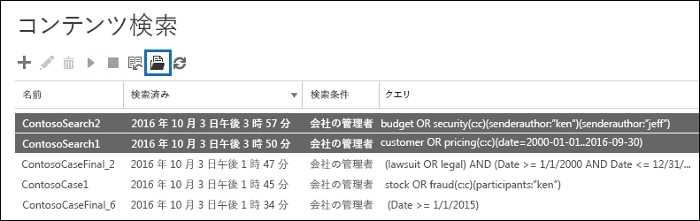

# コンテンツ検索の結果のキーワード統計を表示するView keyword statistics for Content Search results

作成して、コンテンツの検索を実行すると、予想される検索結果に関する統計情報を表示できます。(詳細ウィンドウに表示される予定の検索結果の概要」に似ています) の検索結果の概要が含まれます、検索クエリに一致する項目のコンテンツの場所の数とコンテンツの場所の名前などのクエリの統計情報最も一致する項目があります。1 つまたは複数のコンテンツ検索の統計情報を表示することができます。これにより、迅速に複数の検索の結果を比較し、検索クエリの有効性に関する決定を行うことができます。After you create and run a Content Search, you can view statistics about the estimated search results. This includes a summary of the search results (similar to the summary of the estimated search results displayed in the details pane), the query statistics such as the number of content locations with items that match the search query, and the name of content locations that have the most matching items. You can display statistics for one or more content searches. This lets you to quickly compare the results for multiple searches and make decisions about the effectiveness of your search queries.
  
さらに、検索クエリの各キーワードの統計情報を取得するのには、新規および既存の検索を構成できます。これ複数の検索からキーワードの統計情報を比較して、クエリでは、各キーワードの検索結果の数を比較することができます。Additionally, you can configure new and existing searches to return statistics for each keyword in a search query. This lets you compare the number of results for each keyword in a query and to compare the keyword statistics from multiple searches.
  
CSV ファイルに、検索の統計情報とキーワードの統計情報をダウンロードすることもできます。これにより、Excel でフィルターや並べ替え機能を使用して、結果を比較して、検索結果のレポートを準備することができます。You can also download the search statistics and keyword statistics to a CSV file. This lets you use the filtering and sorting features in Excel to compare results, and prepare reports for your search results.
  
## コンテンツ検索の統計情報を取得します。Get statistics for Content Searches

コンテンツ検索の統計情報を表示します。To display statistics for Content Searches:
  
1. Office 365 のセキュリティで&amp;コンプライアンス センター] に移動**検索&amp;調査** \> **コンテンツの検索**。In the Office 365 Security &amp; Compliance Center, go to **Search &amp; investigation** \> **Content search**.
    
2. [検索結果の一覧で、1 つまたは複数の検索を選択し、**検索の統計情報**] をクリックし、![検索の統計情報] ボタン](media/9bf56d43-25bf-4f53-a4be-f4d55102310c.png)。In the list of searches, select one or more searches, and then click **Search statistics**.
    
    
  
3. **検索の統計情報**] ページで選択した検索に関する統計情報を表示するのには次のリンクのいずれかをクリックします。On the **Search statistics** page, click one of the following links to display statistics about the selected searches. 
    
    **概要****Summary**
    
    このページには、[**コンテンツの検索**] ページで、詳細ペインに表示されているものと同様の統計情報が表示されます。選択したすべての検索の統計情報が表示されます。実行することも再検索を選択した統計情報を更新するには、このページから注意してください。This page displays statistics similar to the ones displayed in the details pane on the **Content search** page. Statistics for all selected searches are displayed. Note that you can also re-run the selected searches from this page to update the statistics. 
    
    
  
    a. コンテンツ検索の名前です。前述したように、表示し、複数の検索の統計情報を比較できます。a.  The name of the Content Search. As previously stated, you can display and compare statistics for multiple searches.
    
    b. 検索対象となったコンテンツの場所の種類です。各行には、メールボックス、サイト、およびパブリック フォルダー指定した検索からの統計情報が表示されます。b. The type of content location that was searched. Each row displays statistics for mailboxes, sites, and public folders from the specified search.
    
    c. 検索クエリに一致する項目が含まれているコンテンツの場所の数です。この統計には、メールボックスの検索クエリに一致する項目が含まれているアーカイブ メールボックスの数も含まれます。c. The number of content locations containing items that match the search query. For mailboxes, this statistic also includes the number of archive mailboxes that contain items that match the search query.
    
    d. すべてのアイテムの合計数は、検索クエリに一致するコンテンツの場所を指定します。項目の種類の例には、電子メール メッセージ、予定表アイテム、およびドキュメントが含まれます。項目に検索されているキーワードの複数のインスタンスが含まれている場合のみ 1 回のアイテムの合計数に数えられます。たとえば、「在庫」の単語を検索するか、「詐欺」と電子メール メッセージに「株式」という単語の 3 つのインスタンスが含まれている、だけ数えられます 1 回**アイテム**] 列で。d. The total number of items of all specified content locations that match the search query. Examples of item types include email messages, calendar items, and documents. If an item contains multiple instances of a keyword that is being searched for, it's only counted once in the total number of items. For example, if you're searching for words "stock" or "fraud" and an email message contains three instances of the word "stock", it's only counted once in the **Items** column. 
    
    e. 合計サイズのすべての項目で指定されたコンテンツの場所で見つかった検索クエリと一致します。e. The total size of all items that were found in the specified content location that match the search query. 
    
    **クエリ****Queries**
    
    このページには、検索クエリに関する統計情報が表示されます。This page displays statistics about the search query.
    
    
  
    a. コンテンツ検索のクエリの統計情報を含む行の名前です。a. The name of the Content Search that the row contains query statistics for.
    
    b. クエリ統計情報に適用されるコンテンツの場所の種類です。b. The type of content location that the query statistics are applicable to.
    
    c. この列は、統計情報に適用する検索クエリのどの部分を示しています。**プライマリ**では、全体の検索クエリを示します。作成または検索クエリを編集するときに、[キーワード] ボックスの一覧を使用する場合は、次の表に、クエリの各コンポーネントの統計情報が含まれます。[コンテンツ検索用のキーワードの統計情報の取得](#get-keyword-statistics-for-content-searches)の詳細については、この資料のセクションを参照してください。c. This column indicates which part of the search query the statistics are applicable to. **Primary** indicates the entire search query. If you use a keyword list when you create or edit a search query, statistics for each component of the query are included in this table. See the [Get keyword statistics for Content Searches](#get-keyword-statistics-for-content-searches) section in this article for more information. 
    
    d. この列には、実際の検索が含まれているコンテンツの検索ツールによって実行されるクエリを実行します。ツールは、クエリを作成することに、いくつかの追加コンポーネントを自動的に追加に注意してください。d. This column contains the actual search query that run by the Content Search tool. Note that the tool automatically adds a few additional components to the query that you create. 

    - すべてのコンテンツのメールボックス内で指定していない任意のキーワード)、実際のキーワード クエリを検索する場合に、`size>=0`のすべてのアイテムが返されるようにします。When you search for all content in mailboxes (by not specifying any keywords), the actual key word query is  `size>=0` so that all items are returned. 
    
     - ビジネス サイトの SharePoint Online と OneDrive を検索すると、次の 2 つのコンポーネントが追加されます。When you search SharePoint Online and OneDrive for Business sites, the two following components are added:
    
          **IsExternalContent:1 ではない**のでは、社内設置型の SharePoint の組織からのコンテンツを除外します。**NOT IsExternalContent:1** - Excludes any content from an on-premises SharePoint organization. 
    
          **IsOneNotePage:1 ではない**のは、これらが検索クエリに一致するすべてのドキュメントの重複になるために、OneNote のすべてのファイルを除外します。**NOT IsOneNotePage:1** - Excludes all OneNote files because these would be duplicates of any document that matches the search query. 

    
    e. コンテンツの場所の数 (で指定された、\* \* の場所の種類 \* \* 列)**クエリ**の列に記載されている検索クエリに一致する項目が含まれています。e. The number of the content locations (specified by the \*\* Location type \*\* column) that contain items that match the search query listed in the **Query** column. 
    
    f.**クエリ**の列に記載されている検索クエリと一致する (指定されたコンテンツの場所) からのアイテムの数です。説明したようのアイテムには、検索されているキーワードの複数のインスタンスが含まれている場合のみカウントされます 1 回、この列です。f. The number of items (from the specified content location) that match the search query listed in the **Query** column. As previously explained, if an item contains multiple instances of a keyword that is being searched for, it's only counted once in the this column. 
    
    g. (指定されたコンテンツの場所) 内で見つかったすべてのアイテムの合計サイズ、**クエリ**の列で検索クエリに一致します。g. The total size of all items that were found (in the specified content location) that match the search query in the **Query** column. 
    
    **上の場所****Top locations**
    
    このページには、検索された各コンテンツの場所で検索クエリに一致するアイテムの数に関する統計情報が表示されます。上位 1,000 名の場所が表示されます。複数の検索の統計情報を表示する場合は、検索ごとに最上位の 1,000 の場所が表示されます。検索クエリに一致するすべての項目が含まれていない場合、コンテンツの場所をこのページでれていないことに注意してください。This page displays statistics about the number of items that match the search query in each content location that was searched. The top 1,000 locations are displayed. If you view statistics for multiple searches, the top 1,000 locations for each search are displayed. Note that a content location isn't included on this page if it doesn't contain any items that match the search query.
    
    
  
    a. コンテンツの場所の名前です。a. The name of the content location.
    
    b. 場所の統計情報に適用できるコンテンツの場所の種類です。b. The type of content location that the location statistics are applicable to.
    
    c. がある列の統計情報を表示している検索します。この列は、各コンテンツの場所で検索クエリに一致する項目の数 (および合計サイズ) を表示します。複数の検索の統計情報を表示しているときにこの列に"N/A"を示しているコンテンツの場所が検索に含まれてなかったことに注意してください。c. There are columns for each search that you're displaying statistics for. This column shows the number (and total size) of items that match the search query in each content location. Note that when you're displaying statistics for multiple searches, the "NA" in this column indicates that the content location wasn't included in that search. 

## コンテンツ検索のキーワードの統計情報を取得します。Get keyword statistics for Content Searches

前に説明すると、検索クエリの数およびサイズ) クエリに一致する項目の**クエリ**ページを示しています。作成または検索クエリを編集するときに、[キーワード] ボックスの一覧を使用する場合は、各キーワードやキーワード フレーズに一致する項目の数を表示する高度な統計情報を取得できます。クエリのどの部分は、(と最も少ない) 効果をすばやく識別できます。たとえば、キーワードには、多数のアイテムが返された場合ことができます検索結果を絞り込むキーワード クエリを絞り込みます。作成または、コンテンツの検索を編集するときは、キーワード リストを設定できます。As previous explained, the **Queries** page shows the search query and the number (and size) of items that match the query. If you use a keyword list when you create or edit a search query, you can get enhanced statistics that show how many items match each keyword or keyword phrase. This can help you quickly identify which parts of the query are the most (and least) effective. For example, if a keyword returns a large number of items, you might choose to refine the keyword query to narrow the search results. You can set up a keyword list when you create or edit a Content Search. 

  
キーワード リストを作成し、コンテンツ検索用のキーワードの統計情報を表示します。To create a keyword list and view keyword statistics for a Content Search:
  
1. Office 365 のセキュリティで&amp;コンプライアンス センター] に移動**検索&amp;調査** \> **コンテンツの検索**。In the Office 365 Security &amp; Compliance Center, go to **Search &amp; investigation** \> **Content search**.
    
2. コンテンツの検索をクリックし、検索の一覧で、[**編集**] をクリックし、 ![[編集] アイコン](media/ebd260e4-3556-4fb0-b0bb-cc489773042c.gif)。In the list of Content Searches, click and a search, and then click **Edit** .
    
3. [**クエリ**] をクリックし、次のような操作を行います。Click **Query** and then do the following things: 
    
    ![キーワード リストの表示] チェック ボックスをクリックし、行ごとにキーワードを入力](media/73ef46dd-3d5c-415d-b5e7-c3559caaafe2.png)
  
    a. は、[**キーワード] ボックスの一覧を表示する**] チェック ボックスをクリックします。a. Click the **Show keyword list** check box. 
    
    b. は、キーワードの表の行で、キーワードやキーワードの段階を入力します。最初の行に**予算**を入力して、2 行目の**セキュリティ**を入力します。b. Type a keyword or keyword phase in a row in the keywords table. For example, type **budget** in the first row and then type **security** in the second row. 
    
4. 検索の統計情報を取得するキーワードを追加すると、変更した検索を実行する**検索**をクリックします。After adding the keywords that you want to search and get statistics for, click **Search** to run the revised search. 
    
5. 検索の一覧で選択し、**検索の統計情報**] をクリックし、検索が完了したら、![検索の統計情報] ボタン](media/9bf56d43-25bf-4f53-a4be-f4d55102310c.png)。表示し、複数の検索キーワードの統計情報を比較できます。When the search is completed, select it in the list of searches, and then click **Search statistics** . You can also display and compare keyword statistics for multiple searches.
    
6. **検索の統計情報**] ページで選択した検索キーワードの統計情報を表示する**クエリ**をクリックします。On the **Search statistics** page, click **Query** to display the keyword statistics for the selected searches. 
    
    
  
    前のスクリーン ショットに示す、それぞれのキーワードの統計情報を表示します。これが含まれています。As shown in the previous screenshot, the statistics for each keyword are displayed; this includes: 
    
    - 検索に含めるコンテンツの場所の種類ごとにキーワードの統計情報です。The keyword statistics for each type of content location included in the search.
    
    - 各キーワードは、検索クエリからのすべての条件が含まれていますの実際の検索クエリです。The actual search query for each keyword, which includes any conditions from the search query. 
    
    - (**一部**の列に**主**として識別される) 完全な検索クエリと完全なクエリの統計情報です。同じ統計情報が [**概要**] ページが表示されますが、これらに注意してください。The complete search query (identified as **Primary** in the **Part** column) and the statistics for the complete query. Note these are the same statistics displayed on the **Summary** page. 

> [!NOTE]
> 大規模なキーワード リストに起因する問題を低減する手助けとする場合のキーワードの一覧での検索クエリの 20 行の最大数に制限されます。To help reduce issues caused by large keyword lists, you're now limited to a maximum of 20 rows in the keyword list of a search query.
