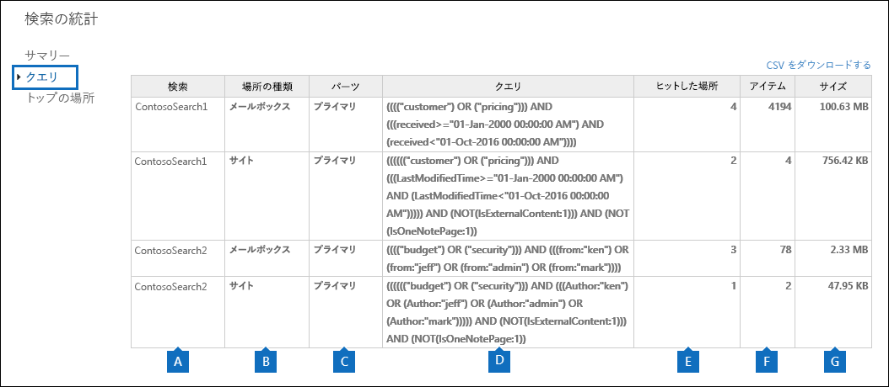
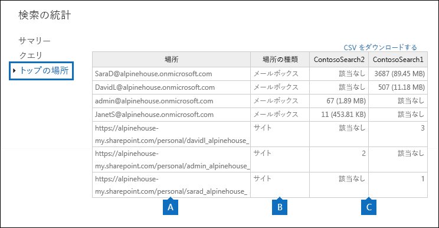

# コンテンツ検索結果のキーワード統計の表示

コンテンツ検索を作成して実行した後は、予想される検索結果の統計情報を表示できます。これには、検索結果の概要 (詳細ウィンドウに表示される予想検索結果のサマリーと同様)、アイテムが検索クエリと一致したコンテンツの場所の数などのクエリ統計情報、最も多くのアイテムが一致したコンテンツの場所の名前が含まれます。1 つまたは複数のコンテンツ検索に対して統計情報を表示できます。これにより、複数の検索の結果を簡単に比較して、検索クエリの有効性を判断できます。
  
さらに、検索クエリ内の各キーワードに対する統計情報を返すように、新規および既存の検索を構成することができます。これにより、クエリ内の各キーワードの結果の数をすばやく比較したり、複数の検索のキーワード統計を比較したりすることができます。
  
また、検索の統計情報とキーワードの統計情報を CSV ファイルにダウンロードできます。これにより、Excel のフィルター機能や並べ替え機能を使用して結果を比較し、検索結果のレポートを準備できます。
  
## コンテンツ検索の統計情報を取得する

コンテンツ検索の統計情報を表示するには:
  
1. Office 365 セキュリティ/コンプライアンス センターで、**[検索 &amp; 調査]** \> **[コンテンツ検索]** の順に移動します。
    
2. 検索の一覧で、検索を 1 つ以上選択して、**[検索の統計]**  をクリックします。
    
    ![複数の検索を選択してから [検索の統計] をクリックする](media/1195c6c3-2e00-469d-8c29-85c1c7ebe6c7.png)
  
3. **[検索の統計]** ページで、次のリンクのいずれかをクリックして、選択した検索の統計情報を表示します。 
    
    **概要**
    
    このページには、**[コンテンツ検索]** ページの詳細ウィンドウに表示されるものと似た統計情報が表示されます。選択したすべての検索の統計情報が表示されます。このページから選択した検索を再実行し、統計情報を更新できることにご注意ください。 
    
    
  
    a. コンテンツ検索の名前。前に説明したように、複数の検索の統計情報を表示して比較できます。
    
    b. 検索されたコンテンツの場所の種類。各行には、指定した検索に関するメールボックス、サイト、パブリック フォルダーの統計情報が表示されます。
    
    c. 検索クエリに一致したアイテムが含まれるコンテンツの場所の数。メールボックスの場合、この統計情報には、検索クエリに一致するアイテムが含まれるアーカイブ メールボックスの数も含まれます。
    
    d. 指定したすべてのコンテンツの場所で、検索クエリと一致するアイテムの合計数。アイテムの種類の例には、メール メッセージ、予定表アイテム、ドキュメントなどが含まれます。アイテムに検索対象のキーワードの複数のインスタンスが含まれている場合は、アイテムの合計数を 1 度カウントするのみです。たとえば、「stock」または「fraud」という単語を検索しており、さらに「stock」という単語の 3 つのインスタンスがメール メッセージに含まれている場合は、**[アイテム]** 列を 1 回カウントするのみです。 
    
    e. 指定したコンテンツの場所で見つかった、検索クエリに一致するすべてのアイテムの合計サイズ。 
    
    **クエリ**
    
    このページには、検索クエリに関する統計情報が表示されます。
    
    
  
    a. その行のクエリ統計情報に対するコンテンツ検索の名前。
    
    b. クエリ統計情報の対象となるコンテンツの場所の種類。
    
    c. この列には、統計情報が該当する検索クエリの部分が示されます。**[プライマリ]** は、検索クエリ全体を示します。検索クエリを作成または編集するときにキーワード リストを使用した場合は、クエリの各コンポーネントの統計情報がこの表に含まれます。詳細については、この記事の「[コンテンツ検索のキーワード統計情報を取得する](#get-keyword-statistics-for-content-searches)」セクションを参照してください。 
    
    d. この列には、コンテンツ検索ツールによって実行された実際の検索クエリが表示されます。クエリにはツールによっていくつかの追加コンポーネントが自動的に追加されることにご注意ください。 

    - キーワードを指定せず、メールボックス内のすべてのコンテンツを検索すると、すべてのアイテムが返されるように、実際のキーワード クエリは `size>=0` のようになります。 
    
     - SharePoint Online と OneDrive for Business サイトを検索すると、次の 2 つのコンポーネントが追加されます。
    
          **NOT IsExternalContent:1** - オンプレミスの SharePoint 組織のコンテンツを除外します。 
    
          **NOT IsOneNotePage:1** - すべての OneNote ファイルを除外します。これは、これらのファイルは検索クエリと一致するドキュメントと重複するためです。 

    
    e. **[クエリ]** 列で示されている検索クエリと一致するアイテムを含むコンテンツの場所 ([** コンテンツの場所 **] 列で指定されているもの) の数。 
    
    f. **[クエリ]** 列で示されている検索クエリと一致する (指定されたコンテンツの場所の) アイテムの数。前に説明したように、アイテムに検索対象のキーワードの複数のインスタンスが含まれている場合、この列では 1 回だけカウントされます。 
    
    g. 指定したコンテンツの場所で見つかった、**[クエリ]** 列の検索クエリに一致するすべてのアイテムの合計サイズ。 
    
    **トップの場所**
    
    このページには、検索された各コンテンツの場所で検索クエリに一致したアイテムの数に関する統計情報が表示されます。上位 1,000 の場所が表示されます。複数の検索の統計情報を表示する場合、各検索の上位 1,000 の場所が表示されます。検索クエリに一致する項目が含まれない場合、このページにはコンテンツの場所が含まれないことにご注意ください。
    
    
  
    a. コンテンツの場所の名前。
    
    b. 場所の統計情報の対象となるコンテンツの場所の種類。
    
    c. 統計情報を表示している検索ごとに列があります。この列には、各コンテンツの場所で検索クエリに一致したアイテムの数 (および合計サイズ) が表示されます。複数の検索の統計情報を表示している場合は、コンテンツの場所がその検索に含まれなかったことを示す "NA" がこの列に表示されることにご注意ください。 

## コンテンツ検索のキーワード統計情報を取得する

前に説明したように、[**クエリ**] ページには、検索クエリと、クエリに一致したアイテムの数 (およびサイズ) が表示されます。検索クエリを作成または編集するときにキーワード リストを使用した場合は、各キーワードやキーワード語句に一致するアイテムの数を表示する拡張統計を取得できます。これは、クエリの最も有効な (または最も有効でない) 部分をすばやく識別するのに役立ちます。たとえば、多数のアイテムを返すキーワードがある場合は、キーワード クエリを修正して検索結果を絞り込むことができます。コンテンツ検索を作成または編集するときに、キーワード リストを設定できます。 

  
キーワード リストを作成して、コンテンツ検索のキーワード統計情報を表示するには:
  
1. Office 365 セキュリティ/コンプライアンス センターで、**[検索 &amp; 調査]** \> **[コンテンツ検索]** の順に移動します。
    
2. コンテンツ検索の一覧で、検索をクリックし、**[編集]**  をクリックします。
    
3. **[クエリ]** をクリックして、次のようにします。 
    
    ![[キーワード リストの表示] チェック ボックスをオンにして、各行にキーワードを入力する](media/73ef46dd-3d5c-415d-b5e7-c3559caaafe2.png)
  
    a. **[キーワード リストの表示]** チェック ボックスをオンにします。 
    
    b. キーワード テーブルの行に、キーワードまたはキーワード句を入力します。たとえば、1 行目に「**予算**」と入力し、2 行目に「**セキュリティ**」と入力します。 
    
4. 検索して統計情報を取得するキーワードを追加した後、**[検索]** をクリックして修正した検索を実行します。 
    
5. 検索が完了したら、検索の一覧でそれを選択し、**[検索の統計]** ![[検索の統計] ボタン](media/9bf56d43-25bf-4f53-a4be-f4d55102310c.png) をクリックします。複数の検索のキーワード統計情報を表示して比較することもできます。
    
6. **[検索の統計]** ページで、**[クエリ]** をクリックして選択した検索のキーワード統計情報を表示します。 
    
    
  
    前のスクリーンショットで示したように、各キーワードの統計情報が表示されます。次の情報が含まれます。 
    
    - 検索に含まれるコンテンツの場所の各種類に対するキーワード統計。
    
    - 各キーワードの実際の検索クエリ。これには、検索クエリのすべての条件が含まれます。 
    
    - 完全な検索クエリ (**[部分]** 列には **[プライマリ]** と表示されます) および完全なクエリの統計情報。これらは **[概要]** ページに表示されるものと同じ統計情報であることにご注意ください。 

> [!NOTE]
> 大規模なキーワード リストによって生じる問題を軽減するため、検索クエリのキーワード リストの行は最大 20 行に設定されています。
