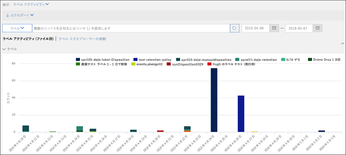
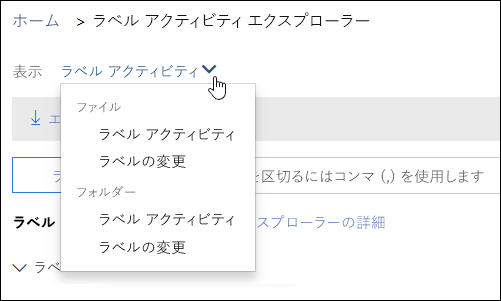
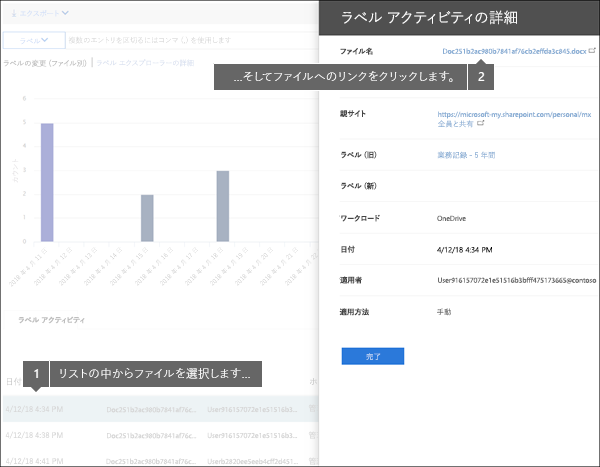
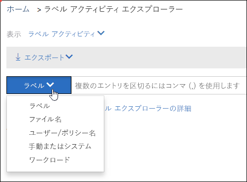

# ドキュメントのラベル アクティビティを表示するView label activity for documents

ラベルを作成した後、意図したとおりにラベルがコンテンツに適用されているかどうかを確認することをお勧めします。Office 365 セキュリティ&amp;コンプライアンス センターのラベル アクティビティ エクスプローラーを使用すると、過去 30 日間の SharePoint および OneDrive for Business のすべてコンテンツのラベル アクティビティをすばやく検索して表示することができます。リアルタイム データが表示され、テナントで生じている事柄を明確に把握できます。After you create your labels, you'll want to verify that they're being applied to content as you intended. With the Label Activity Explorer in the Office 365 Security &amp; Compliance Center, you can quickly search and view label activity for all content across SharePoint and OneDrive for Business over the past 30 days. This is real-time data that gives you a clear view into what's happening in your tenant.
  
たとえば、ラベル アクティビティ エクスプローラーで以下のことができます:For example, with the Label Activity Explorer, you can:
  
- それぞれのラベルが適用された回数を日ごとに表示 (最大 30 日間)。View how many times each label was applied on each day (up to 30 days).
    
- 誰がいつ、どのファイルにラベルを付けたかを正確に表示。ファイルが存在するサイトへのリンクも表示。See who labeled exactly which file on which date, along with a link to the site where that file resides.
    
- ラベルが変更されたり削除されたりしたファイル、古いラベルおよび新しいラベル、変更を行ったユーザーの表示。View which files had labels changed or removed, what the old and new labels are, and who made the change.
    
- データをフィルター処理して、特定のレベル、ファイル、ユーザーのラベル アクティビティすべてを表示。場所 (SharePoint または OneDrive for Business) や、ラベルが適用された方法 (手動か自動) でラベル アクティビティをフィルター処理することも可能。Filter the data to see all the label activity for a specific label, file, or user. You can also filter label activity by location (SharePoint or OneDrive for Business) and whether the label was applied manually or auto-applied.
    
- 各ドキュメントだけでなくフォルダーのラベル アクティビティも表示。今後は、ラベルが付けられたフォルダーの中のファイル数が表示される予定。View label activity for folders as well as individual documents. Coming soon is the ability to show how many files inside that folder got labeled as a result of the folder getting labeled.
    
ラベル アクティビティ エクスプローラーにアクセスするには、セキュリティ&amp;コンプライアンス センター>**[データ ガバナンス]** > **[ラベル アクティビティ エクスプローラー]** の順に移動します。You can find the Label Activity Explorer in the Security &amp; Compliance Center > **Data governance** > **Label Activity Explorer**.
  
なお、ラベル アクティビティ エクスプローラーには、Office 365 Enterprise E5 サブスクリプションが必要となります。Note that the Label Activity Explorer requires an Office 365 Enterprise E5 subscription.
  

  
## ファイルまたはフォルダーのラベル アクティビティの表示View label activities for files or folders

ラベル アクティビティ エクスプローラーの上部で、ファイルまたはフォルダーのアクティビティを表示するかどうかを選択できます。フォルダーのアクティビティではフォルダーのみが表示されます。フォルダー内のファイルは表示されません。At the top of the Label Activity Explorer, you can choose whether to view activities for files or folders. Note that folder activity includes only the folder itself, not the files inside the folder.
  
フォルダーにラベルを付けると、そのフォルダー内のすべてのファイルもそのラベルを取得するため (明示的に適用されているラベルがあるファイルを除く)、フォルダーのラベル アクティビティを表示したい場合があります。したがって、フォルダーにラベルを付けると、多数のファイルに影響を及ぼす可能性があります。詳細については、「[SharePoint ライブラリ、フォルダー、またはドキュメント セット内のすべてのコンテンツへの既定の保持ラベルの適用](labels.md#applying-a-default-retention-label-to-all-content-in-a-sharepoint-library-folder-or-document-set)」を参照してください。You might want to see label activity for folders because if you label a folder, all files inside that folder also get that label (except for files that have had a label applied explicitly to them). Therefore, labeling folders might affect a significant number of files. For more information, see [Applying a default retention label to all content in a SharePoint library, folder, or document set](labels.md#applying-a-default-retention-label-to-all-content-in-a-sharepoint-library-folder-or-document-set).
  

  
### ラベル アクティビティLabel activities

 ラベルの**追加**、**削除**、**変更**の、ラベルに関するすべての操作が**ラベル アクティビティ**に該当します。このビューを使用して、それぞれのラベルがどのぐらいの数のファイルに適用されたかの包括的な確認を日別で行うことができます。**Label activities** includes all label actions: **adding**, **removing**, or **changing** a label. You can use this view to get a comprehensive look at how many files each label's been applied to per day. 
  
### ラベルの変更Label changes

 **ラベルの変更**には、ラベルの**削除**または**変更**によって危険が生じる可能性のある操作の情報が含まれています。このビューを使用すれば、そのような危険な操作と実行したユーザーをすぐに確認できます。グラフの下にあるアクティビティ リストでファイルを選択し、右側の詳細ウィンドウにあるそのファイルのリンクをクリックすると、詳細情報を確認できます。**Label changes** includes the potentially risky actions of **removing** or **changing** a label. You can use this view to quickly see such risky actions and the user who performed them. In the activity list below the chart, you can select a file, and then click a link to that file in the details pane on the right. 
  

  
## ラベル アクティビティのフィルター処理Filter label activity

データをすばやくフィルター処理して、特定のレベル、ファイル、ユーザーのラベル アクティビティすべてを表示できます。場所 (SharePoint または OneDrive for Business) や、ラベルが適用された方法 (手動か自動) でラベル アクティビティをフィルター処理することもできます。You can quickly filter the data to see all the label activity for a specific label, file, or user. You can also filter label activity by location (SharePoint or OneDrive for Business) and whether the label was applied manually or auto-applied.
  

  

