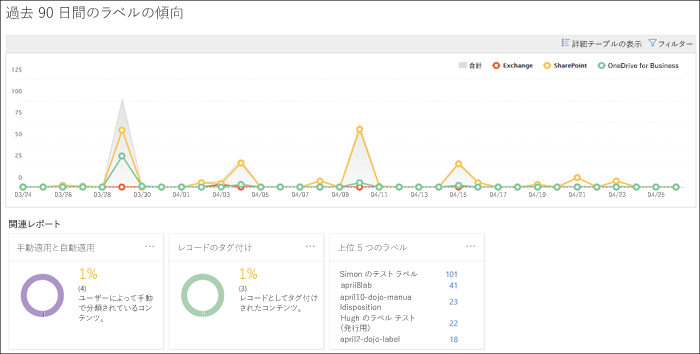
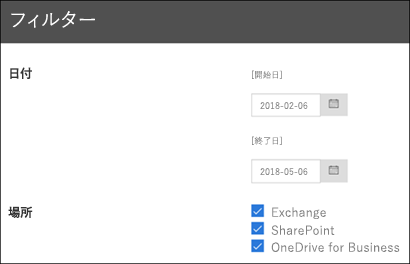

# データ ガバナンスのレポートを表示する

ラベルを作成したら、意図したとおりにコンテンツに適用されていることを確認する必要があります。Office 365 セキュリティ&amp;コンプライアンス センターのデータ ガバナンス レポートを使用すると、以下の項目を簡単に表示できます。
  
- **上位 5 つのラベル**: このレポートには、コンテンツに適用された上位 5 つのラベルの数が表示されます。このレポートをクリックして、最近コンテンツに適用されたすべてのラベルのリストを表示します。各ラベルの数、位置、適用方法、保存アクション、レコードであるかどうか、処分タイプを確認できます。 
    
- **手動適用と自動適用**: このレポートには、手動または自動でラベル付けされたすべてのコンテンツの数と、手動でラベル付けされたコンテンツと自動でラベル付けされたコンテンツの割合が表示されます。 
    
- **レコードのタグ付け**: このレポートには、レコードまたは非レコードとしてタグ付けされたすべてのコンテンツの数と、レコードとしてタグ付けされたコンテンツと非レコードとしてタグ付けされたコンテンツの割合が表示されます。 
    
- **過去 90 日間のラベル傾向**: このレポートには、過去 90 日間に適用されたすべてのラベルの数と場所が表示されます。 
    
これらのすべてのレポートでは、Exchange、SharePoint、OneDrive for Business からラベル付けされたコンテンツを表示します。
  
これらのレポートは、セキュリティ&amp;コンプライアンス センター\>**データガバナンス**\>**ダッシュボード**で確認できます。
  

  
データ ガバナンス レポートは、日付 (最長 90 日間) と場所 (Exchange、SharePoint、OneDrive for Business) でフィルタリングできます。最新のデータは、レポートに表示されるまでに最長 24 時間かかることがあります。
  

  

