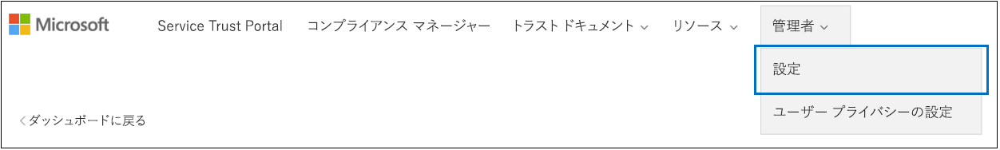

# <a name="work-with-microsoft-compliance-manager-preview"></a><span data-ttu-id="ee716-104">Microsoft コンプライアンスマネージャー (プレビュー) を使用する</span><span class="sxs-lookup"><span data-stu-id="ee716-104">Work with Microsoft Compliance Manager (Preview)</span></span>

> [!IMPORTANT]
> <span data-ttu-id="ee716-105">Microsoft コンプライアンスマネージャーは、データ保護とコンプライアンスの stature と、データ保護とコンプライアンスを向上させるための推奨事項の概要を提供するダッシュボードおよび管理ツールです。</span><span class="sxs-lookup"><span data-stu-id="ee716-105">Microsoft Compliance Manager is a dashboard and management tool that provides a summary of your data protection and compliance stature and recommendations to improve data protection and compliance.</span></span> <span data-ttu-id="ee716-106">コンプライアンスマネージャーで提供されるお客様のアクションは推奨事項です。実装の前に、それぞれの規制環境でこれらの推奨事項の有効性を評価することは、組織によって行われます。</span><span class="sxs-lookup"><span data-stu-id="ee716-106">The customer actions provided in Compliance Manager are recommendations; it is up to your organization to evaluate the effectiveness of these recommendations in their respective regulatory environment prior to implementation.</span></span> <span data-ttu-id="ee716-107">コンプライアンスマネージャーの推奨事項は、コンプライアンスの保証として解釈されないようにする必要があります。</span><span class="sxs-lookup"><span data-stu-id="ee716-107">Recommendations found in Compliance Manager should not be interpreted as a guarantee of compliance.</span></span>

## <a name="access-compliance-manager"></a><span data-ttu-id="ee716-108">Access コンプライアンスマネージャー</span><span class="sxs-lookup"><span data-stu-id="ee716-108">Access Compliance Manager</span></span>

<span data-ttu-id="ee716-p103">コンプライアンス マネージャーには Service Trust Portal からアクセスします。Microsoft アカウントまたは Azure Active Directory の組織アカウントを持つすべてのユーザーがコンプライアンス マネージャーにアクセスできます。</span><span class="sxs-lookup"><span data-stu-id="ee716-p103">You access Compliance Manager from the Service Trust Portal. Anyone with a Microsoft account or Azure Active Directory organizational account can access Compliance Manager.</span></span>
  
1. <span data-ttu-id="ee716-111">[https://servicetrust.microsoft.com](https://servicetrust.microsoft.com/) に移動します。</span><span class="sxs-lookup"><span data-stu-id="ee716-111">Go to [https://servicetrust.microsoft.com](https://servicetrust.microsoft.com/).</span></span>

2. <span data-ttu-id="ee716-112">Microsoft サービスアカウントでサインインします。</span><span class="sxs-lookup"><span data-stu-id="ee716-112">Sign in with your Microsoft service account.</span></span> <span data-ttu-id="ee716-113">これは、Office 365、Microsoft 365、または Azure Active Directory (Azure AD) のユーザーアカウントです。</span><span class="sxs-lookup"><span data-stu-id="ee716-113">This is your Office 365, Microsoft 365, or Azure Active Directory (Azure AD) user account.</span></span>

3. <span data-ttu-id="ee716-114">Service Trust Portal で、[**コンプライアンスマネージャー**] を選択します。</span><span class="sxs-lookup"><span data-stu-id="ee716-114">In the Service Trust Portal, select **Compliance Manager**.</span></span> <span data-ttu-id="ee716-115">これは、コンプライアンスマネージャーのプレビューバージョンです。</span><span class="sxs-lookup"><span data-stu-id="ee716-115">This is the preview version of Compliance Manager.</span></span> <span data-ttu-id="ee716-116">**コンプライアンスマネージャー (クラシック)** は、以前のバージョンのコンプライアンスマネージャーへのリンクです。</span><span class="sxs-lookup"><span data-stu-id="ee716-116">**Compliance Manager (Classic)** is the link to the previous version of Compliance Manager.</span></span>

4. <span data-ttu-id="ee716-117">機密保持契約が表示されたら、それを読んで、[**同意**] を選択して続行します。</span><span class="sxs-lookup"><span data-stu-id="ee716-117">When the Non-Disclosure Agreement is displayed, read it, and select **Agree** to continue.</span></span> <span data-ttu-id="ee716-118">同意する必要があります。その後、コンプライアンスマネージャーダッシュボードが表示されます。</span><span class="sxs-lookup"><span data-stu-id="ee716-118">You must agree once, and then the Compliance Manager dashboard is displayed.</span></span>

<span data-ttu-id="ee716-119">開始するには、組織に対して既定で ISO/IEC 27001:2103 の評価の Office 365 が表示されます。</span><span class="sxs-lookup"><span data-stu-id="ee716-119">To get you started, an ISO/IEC 27001:2103 Assessment for Office 365 appears by default for your organization.</span></span>

## <a name="administration"></a><span data-ttu-id="ee716-120">管理</span><span class="sxs-lookup"><span data-stu-id="ee716-120">Administration</span></span>

<span data-ttu-id="ee716-121">テナント管理者のみが使用でき、全体管理者アカウントでログインしている場合にのみ表示される特定の管理機能があります。</span><span class="sxs-lookup"><span data-stu-id="ee716-121">There are specific administrative functions that are only available to the tenant administrator and only visible when logged in with a global administrator account.</span></span> <span data-ttu-id="ee716-122">ただし、管理者がコンプライアンスマネージャーの役割をユーザーに割り当てるまで、コンプライアンスマネージャーのデータが組織内のすべてのユーザーに表示されます。</span><span class="sxs-lookup"><span data-stu-id="ee716-122">However, until the administrator assigns Compliance Manager roles to users, data in Compliance Manager is visible to all users in your organization.</span></span> <span data-ttu-id="ee716-123">コンプライアンスマネージャーでアクセスしてアクションを実行できるユーザーを決定するには、役割ベースのアクセス制御を実装することをお勧めします。</span><span class="sxs-lookup"><span data-stu-id="ee716-123">We recommend implementing role-based access control to determine who can access and perform actions in Compliance Manager.</span></span>
  
### <a name="assigning-compliance-manager-roles-to-users"></a><span data-ttu-id="ee716-124">コンプライアンス マネージャーのロールをユーザーに割り当てる</span><span class="sxs-lookup"><span data-stu-id="ee716-124">Assigning Compliance Manager roles to users</span></span>

<span data-ttu-id="ee716-125">各コンプライアンスマネージャーの役割には、多少異なるアクセス許可があります。</span><span class="sxs-lookup"><span data-stu-id="ee716-125">Each Compliance Manager role has slightly different permissions.</span></span> <span data-ttu-id="ee716-126">各役割に割り当てられているアクセス許可を表示したり、どのユーザーがどの役割に所属しているかを確認したり、その役割に対してユーザーを追加または削除することができます。</span><span class="sxs-lookup"><span data-stu-id="ee716-126">You can view the permissions assigned to each role, see which users are in which roles, and add or remove users from that role through the Service Trust Portal.</span></span> <span data-ttu-id="ee716-127">[**管理**] メニュー項目を選択し、表示する**設定**を選択します。</span><span class="sxs-lookup"><span data-stu-id="ee716-127">Select the **Admin** menu item, and choose **Settings** to view.</span></span>
  

  
<span data-ttu-id="ee716-129">コンプライアンス マネージャーのロールにユーザーを追加したり、ロールからユーザーを削除したりするには、次の操作を行います。</span><span class="sxs-lookup"><span data-stu-id="ee716-129">To add or remove users from Compliance Manager roles.</span></span>
  
1. <span data-ttu-id="ee716-130">[https://servicetrust.microsoft.com](https://servicetrust.microsoft.com) に移動します。</span><span class="sxs-lookup"><span data-stu-id="ee716-130">Go to [https://servicetrust.microsoft.com](https://servicetrust.microsoft.com).</span></span>

2. <span data-ttu-id="ee716-131">Azure Active Directory 全体管理者アカウントでサインインします。</span><span class="sxs-lookup"><span data-stu-id="ee716-131">Sign in with your Azure Active Directory global administrator account.</span></span>

3. <span data-ttu-id="ee716-132">Service Trust Portal のトップメニューバーで、[**管理者**] を選択し、[**設定**] を選択します。</span><span class="sxs-lookup"><span data-stu-id="ee716-132">On the Service Trust Portal top menu bar, select **Admin** and then choose **Settings**.</span></span>

4. <span data-ttu-id="ee716-133">**[役割の選択**] ドロップダウンリストで、管理する役割を選択します。</span><span class="sxs-lookup"><span data-stu-id="ee716-133">In the **Select Role** drop-down list, select the role that you want to manage.</span></span>

5. <span data-ttu-id="ee716-134">各役割に追加されたユーザーは、 **[役割の選択**] ページに表示されます。</span><span class="sxs-lookup"><span data-stu-id="ee716-134">Users added to each role are listed on the **Select Role** page.</span></span>

6. <span data-ttu-id="ee716-135">この役割にユーザーを追加するには、[**追加**] を選択します。</span><span class="sxs-lookup"><span data-stu-id="ee716-135">To add users to this role, select **Add**.</span></span> <span data-ttu-id="ee716-136">[**ユーザーの追加**] ダイアログで、[ユーザー] フィールドを選択します。</span><span class="sxs-lookup"><span data-stu-id="ee716-136">In the **Add Users** dialog, select the user field.</span></span> <span data-ttu-id="ee716-137">利用可能なユーザーの一覧をスクロールするか、ユーザー名の入力を開始して、検索用語に基づいてリストをフィルター処理することができます。</span><span class="sxs-lookup"><span data-stu-id="ee716-137">You can scroll through the list of available users or begin typing the user name to filter the list based on your search term.</span></span> <span data-ttu-id="ee716-138">そのアカウントを、その役割を使用してプロビジョニングされた**ユーザーの追加**リストに追加するユーザーを選択します。</span><span class="sxs-lookup"><span data-stu-id="ee716-138">Select the user to add that account to the **Add Users** list provisioned with that role.</span></span> <span data-ttu-id="ee716-139">複数のユーザーを同時に追加する場合は、リストにフィルターを適用するためのユーザー名の入力を開始してから、リストに追加するユーザーを選択します。</span><span class="sxs-lookup"><span data-stu-id="ee716-139">If you would like to add multiple users concurrently, begin typing a user name to filter the list, and then select the user to add to the list.</span></span> <span data-ttu-id="ee716-140">[**保存**] を選択して、選択した役割をこれらのユーザーに提供します。</span><span class="sxs-lookup"><span data-stu-id="ee716-140">Select **Save** to provision the selected role to these users.</span></span> 

    
  
7. <span data-ttu-id="ee716-142">この役割からユーザーを削除するには、ユーザーを選択して [**削除**] を選択します。</span><span class="sxs-lookup"><span data-stu-id="ee716-142">To remove users from this role, select the users and select **Delete**.</span></span>

    

## <a name="groups"></a><span data-ttu-id="ee716-144">グループ</span><span class="sxs-lookup"><span data-stu-id="ee716-144">Groups</span></span>

<span data-ttu-id="ee716-145">グループを使用すると、評価を論理的に整理し、同じまたは関連する顧客管理のコントロールがある評価間で共通の情報とワークフロータスクを共有することができます。</span><span class="sxs-lookup"><span data-stu-id="ee716-145">Groups allow you to logically organize Assessments and that share common information and workflow tasks between Assessments that have the same or related customer-managed controls.</span></span> <span data-ttu-id="ee716-146">カスタマーが管理するアクションを最小限に抑えるために、年、標準、サービス、チーム、部署、または組織内の省庁ごとに評価をグループ化することができます。</span><span class="sxs-lookup"><span data-stu-id="ee716-146">You can group Assessments by year, standard, service, team, division, or agencies within your organization to help minimize customer-managed Actions:</span></span>
  
- <span data-ttu-id="ee716-147">**FFIEC は評価2019**</span><span class="sxs-lookup"><span data-stu-id="ee716-147">**FFIEC IS Assessments 2019**</span></span>
  - <span data-ttu-id="ee716-148">Office 365 + FFIEC は</span><span class="sxs-lookup"><span data-stu-id="ee716-148">Office 365 + FFIEC IS</span></span>
  - <span data-ttu-id="ee716-149">Intune + FFIEC は</span><span class="sxs-lookup"><span data-stu-id="ee716-149">Intune + FFIEC IS</span></span>
- <span data-ttu-id="ee716-150">**データ セキュリティとプライバシー Assessment**</span><span class="sxs-lookup"><span data-stu-id="ee716-150">**Data Security and Privacy Assessments**</span></span>
  - <span data-ttu-id="ee716-151">Office 365 + ISO 27001:2013</span><span class="sxs-lookup"><span data-stu-id="ee716-151">Office 365 + ISO 27001:2013</span></span>
  - <span data-ttu-id="ee716-152">Office 365 + ISO 27018:2014</span><span class="sxs-lookup"><span data-stu-id="ee716-152">Office 365 + ISO 27018:2014</span></span>

<span data-ttu-id="ee716-153">新しい評価を作成する場合は、評価用に新しいグループを作成するか、既存のグループに評価を割り当てる必要があります。</span><span class="sxs-lookup"><span data-stu-id="ee716-153">When you create a new Assessment, you must create a new group for the Assessment or assign the Assessment to an existing group.</span></span> <span data-ttu-id="ee716-154">グループをスタンドアロンのエンティティとして作成することはできません。</span><span class="sxs-lookup"><span data-stu-id="ee716-154">Groups cannot be created as stand-alone entities.</span></span> <span data-ttu-id="ee716-155">新しい評価を追加*する前に*、組織のグループ戦略を決定することをお勧めします。</span><span class="sxs-lookup"><span data-stu-id="ee716-155">It's recommended that you determine a grouping strategy for your organization *before* adding new assessments.</span></span> <span data-ttu-id="ee716-156">既定では、最初の評価では "Default Group" という名前のグループを使用できます。</span><span class="sxs-lookup"><span data-stu-id="ee716-156">By default, a Group named "Default Group" is available for your initial Assessments.</span></span> <span data-ttu-id="ee716-157">グループにはセキュリティプロパティはありません。</span><span class="sxs-lookup"><span data-stu-id="ee716-157">Groups do not have any security properties.</span></span> <span data-ttu-id="ee716-158">すべてのアクセス許可が評価に関連付けられています。</span><span class="sxs-lookup"><span data-stu-id="ee716-158">All permissions are associated with Assessments.</span></span>

<span data-ttu-id="ee716-159">グループを操作するときは、次の点に注意してください。</span><span class="sxs-lookup"><span data-stu-id="ee716-159">When you work with groups, remember:</span></span>
  
- <span data-ttu-id="ee716-160">同じグループ内の異なる評価に含まれる関連評価コントロールが、完了時に自動的に更新されます。</span><span class="sxs-lookup"><span data-stu-id="ee716-160">Related assessment controls in different assessments within the same Group automatically update when completed.</span></span>
- <span data-ttu-id="ee716-161">新しい評価を作成するときに、新しいグループは既存のグループから情報をコピーできます。</span><span class="sxs-lookup"><span data-stu-id="ee716-161">New groups can copy information from an existing group when you create a new Assessment.</span></span> <span data-ttu-id="ee716-162">コピー元のグループの評価から、お客様が管理するコントロールの実装の詳細とテスト計画および管理応答のフィールドに追加された情報は、新規にある同じ (または関連する) 顧客管理のコントロールにコピーされます。評価.</span><span class="sxs-lookup"><span data-stu-id="ee716-162">Any information added to the Implementation Details and Test Plan and Management Response fields of customer-managed controls from Assessments in the group that you're copying from are copied to the same (or related) customer-managed controls in the new Assessment.</span></span> <span data-ttu-id="ee716-163">既存のグループに新しい評価を追加している場合は、そのグループの評価からの共通情報が新しい評価にコピーされます。</span><span class="sxs-lookup"><span data-stu-id="ee716-163">If you're adding a new Assessment to an existing group, common information from Assessments in that group are copied to the new Assessment.</span></span>
- <span data-ttu-id="ee716-164">グループ名 (*グループ id*とも呼ばれます) は、組織内で一意である必要があります。</span><span class="sxs-lookup"><span data-stu-id="ee716-164">Group names (also called *Group IDs*) must be unique within your organization.</span></span>
- <span data-ttu-id="ee716-165">グループには、同じ証明書/規制の評価を含めることができますが、各グループには、特定のクラウドサービス/証明書ペアの評価を1つだけ含めることができます。</span><span class="sxs-lookup"><span data-stu-id="ee716-165">Groups can contain Assessments for the same certification/regulation, but each group can only contain one Assessment for a specific cloud service/certification pair.</span></span> <span data-ttu-id="ee716-166">たとえば、グループに Office 365 および NIST CSF の2つの評価を含めることはできません。</span><span class="sxs-lookup"><span data-stu-id="ee716-166">For example, a group can't contain two Assessments for Office 365 and NIST CSF.</span></span> <span data-ttu-id="ee716-167">グループには、それぞれに対応する認定/規制が異なる場合にのみ、同じクラウドサービスに対して複数の評価を含めることができます。</span><span class="sxs-lookup"><span data-stu-id="ee716-167">A group can contain multiple Assessments for the same cloud service only if the corresponding certification/regulation for each one is different.</span></span>
- <span data-ttu-id="ee716-168">評価グループに評価が追加されると、グループを変更することはできません。</span><span class="sxs-lookup"><span data-stu-id="ee716-168">Once an assessment has been added to an assessment group, the grouping cannot be changed.</span></span> <span data-ttu-id="ee716-169">評価グループの名前を変更することができます。これにより、そのグループに関連付けられているすべての評価の評価グループの名前が変更されます。</span><span class="sxs-lookup"><span data-stu-id="ee716-169">You can rename the assessment group, which changes the name of the assessment grouping for all the assessments associated with that group.</span></span> <span data-ttu-id="ee716-170">評価と新しい評価グループを作成し、既存の評価から情報をコピーすることができます。これにより、別の評価グループにその評価の複製が効率的に作成されます。</span><span class="sxs-lookup"><span data-stu-id="ee716-170">You can create an assessment and a new assessment group and copy information from an existing assessment, which effectively creates a duplicate of that assessment in a different assessment group.</span></span>
- <span data-ttu-id="ee716-171">アーカイブ評価は、評価とグループの間の関係を中断します。</span><span class="sxs-lookup"><span data-stu-id="ee716-171">Archiving an assessment breaks the relationship between that assessment and the group.</span></span> <span data-ttu-id="ee716-172">その他の関連する評価に関するその他の更新プログラムは、アーカイブ評価に反映されなくなりました。</span><span class="sxs-lookup"><span data-stu-id="ee716-172">Any further updates to other related assessments are no longer reflected in the archived assessment.</span></span>

## <a name="tenant-management"></a><span data-ttu-id="ee716-173">テナント管理</span><span class="sxs-lookup"><span data-stu-id="ee716-173">Tenant Management</span></span>

<span data-ttu-id="ee716-174">コンプライアンスマネージャー (プレビュー) には、**テナント管理**と呼ばれる新しいデータ要素を管理するための新しいインターフェイスが含まれています。</span><span class="sxs-lookup"><span data-stu-id="ee716-174">Compliance Manager (Preview) includes a new interface for managing new data elements called **Tenant Management**.</span></span> <span data-ttu-id="ee716-175">このインターフェイスを使用すると、テナント全体の設定を管理できます。</span><span class="sxs-lookup"><span data-stu-id="ee716-175">This interface enables you to manage tenant-wide settings:</span></span>

- <span data-ttu-id="ee716-176">**次元:** テンプレート、評価、およびアクションアイテムのメタデータを表示、追加、およびカスタマイズして、フィルターのカスタムピボットを作成できます。</span><span class="sxs-lookup"><span data-stu-id="ee716-176">**Dimensions:** View, add and customize metadata for Templates, Assessments, and Action Items that allow you to create custom pivots for filters.</span></span>
- <span data-ttu-id="ee716-177">**所有者:** 各アクションアイテムの所有者を指定します。</span><span class="sxs-lookup"><span data-stu-id="ee716-177">**Owners:** Specify an owner for each Action Item.</span></span>
- <span data-ttu-id="ee716-178">**お客様のアクション:** コンプライアンスマネージャー (プレビュー) に含まれるアクションアイテムの完全なリストを管理し、セキュリティで保護されたスコアと統合されたアクションに対するセキュリティで保護されたスコア監視を有効/無効にします。</span><span class="sxs-lookup"><span data-stu-id="ee716-178">**Customer Actions:** Manage the complete list of Actions Items included in Compliance Manager (Preview) and enable/disable Secure Score monitoring for Actions that are integrated with Secure Score.</span></span>

<span data-ttu-id="ee716-179">[**テナント管理**] を選択して管理インターフェイスを開き、次の手順を使用して**ディメンション**、**所有者**、および**顧客の操作**を管理します。</span><span class="sxs-lookup"><span data-stu-id="ee716-179">Select **Tenant Management** to open the management interface, and use the following steps to manage **Dimensions**, **Owners**, and **Customer Actions**.</span></span>

### <a name="dimensions"></a><span data-ttu-id="ee716-180">Dimensions</span><span class="sxs-lookup"><span data-stu-id="ee716-180">Dimensions</span></span>

<span data-ttu-id="ee716-181">ディメンションは、テンプレート、評価、またはアクションアイテムに関する情報を提供するメタデータのセットです。</span><span class="sxs-lookup"><span data-stu-id="ee716-181">Dimensions are sets of metadata that provide information about a Template, an Assessment, or an Action Item.</span></span> <span data-ttu-id="ee716-182">次元は、キーと値の概念を使用します。次元キーはプロパティを表し、ディメンション値はプロパティの有効な値を表します。</span><span class="sxs-lookup"><span data-stu-id="ee716-182">Dimensions use the concept of Keys and Values, where the Dimension Key represents a property, and Dimension Value represents valid values for the property.</span></span> <span data-ttu-id="ee716-183">たとえば、コンプライアンスマネージャーには、3種類のアクションがあります。</span><span class="sxs-lookup"><span data-stu-id="ee716-183">For example, in Compliance Manager there are three types of Actions.</span></span> <span data-ttu-id="ee716-184">これらは、**ドキュメント**、**運用**、**技術**の**アクションの種類**と分析コード値のディメンションキーによって定義されます。</span><span class="sxs-lookup"><span data-stu-id="ee716-184">They are defined by a Dimension Key of **Action Type** and Dimension Values of **Documentation**, **Operational**, and **Technical**.</span></span> <span data-ttu-id="ee716-185">既存のディメンションを変更したり、独自のディメンションを追加したりすることができます。</span><span class="sxs-lookup"><span data-stu-id="ee716-185">You can modify existing Dimensions or add your own.</span></span> <span data-ttu-id="ee716-186">ディメンションの追加は、多くの場合、カスタムテンプレートをインポートするときに必要になります。</span><span class="sxs-lookup"><span data-stu-id="ee716-186">Adding Dimensions is often necessary when importing custom Templates.</span></span>

#### <a name="add-a-dimension"></a><span data-ttu-id="ee716-187">ディメンションを追加する</span><span class="sxs-lookup"><span data-stu-id="ee716-187">Add a Dimension</span></span>

1. <span data-ttu-id="ee716-188">[**テナント管理**] を開いて、**ディメンション**を選択します。</span><span class="sxs-lookup"><span data-stu-id="ee716-188">Open **Tenant Management** and select **Dimensions**.</span></span>
2. <span data-ttu-id="ee716-189">[ **+ ディメンションの追加**] を選択します。</span><span class="sxs-lookup"><span data-stu-id="ee716-189">Select **+ Add Dimension**.</span></span>
3. <span data-ttu-id="ee716-190">[**キー** ] フィールドに一意の名前を入力します。</span><span class="sxs-lookup"><span data-stu-id="ee716-190">Enter a unique name in the **Key** field.</span></span>
4. <span data-ttu-id="ee716-191">オプションで、同じキーに対して複数の値を同時に使用できるようにするには、[**次元の複数選択**を有効にする] のトグルをスライドします。</span><span class="sxs-lookup"><span data-stu-id="ee716-191">Optionally enable multiple values to be used concurrently for the same Key, slide the toggle for **Allow multi selection for dimensions** to on.</span></span>
5. <span data-ttu-id="ee716-192">[ **+ 追加**] を選択して、一意の名前を指定し、[保存] アイコンをクリックして値を追加します。</span><span class="sxs-lookup"><span data-stu-id="ee716-192">Select **+ Add** to add a value by providing a unique name and clicking the save icon.</span></span>
6. <span data-ttu-id="ee716-193">追加する値ごとに手順5を繰り返します。</span><span class="sxs-lookup"><span data-stu-id="ee716-193">Repeat Step 5 for each value you want to add.</span></span>
7. <span data-ttu-id="ee716-194">[**保存**] を選択して、新しいディメンションを保存します。</span><span class="sxs-lookup"><span data-stu-id="ee716-194">Select **Save** to save the new Dimension.</span></span>

#### <a name="edit-a-dimension"></a><span data-ttu-id="ee716-195">ディメンションを編集する</span><span class="sxs-lookup"><span data-stu-id="ee716-195">Edit a Dimension</span></span>

<span data-ttu-id="ee716-196">ディメンションキーの名前を変更することはできますが、カスタムディメンションの値を変更することができます。</span><span class="sxs-lookup"><span data-stu-id="ee716-196">You can rename a Dimension Key, but you can modify the values for custom Dimensions.</span></span>

1. <span data-ttu-id="ee716-197">[**テナント管理**] を開いて、**ディメンション**を選択します。</span><span class="sxs-lookup"><span data-stu-id="ee716-197">Open **Tenant Management** and select **Dimensions**.</span></span>
2. <span data-ttu-id="ee716-198">編集するディメンションを見つけて、その横にある省略記号 (...) を選択し、[**編集**] を選択します。</span><span class="sxs-lookup"><span data-stu-id="ee716-198">Locate the Dimension you want to edit, select the ellipses (…) next to it, and select **Edit**.</span></span>
3. <span data-ttu-id="ee716-199">[ **+ 追加**] を選択して、一意の名前を指定して値を追加し、[保存] アイコンをクリックするか、編集または削除する値を選択して、[**削除**] または [**編集**] を選択します。</span><span class="sxs-lookup"><span data-stu-id="ee716-199">Select **+ Add** to add a value by providing a unique name and clicking the save icon, or select the value you want to edit or delete, and select **Remove** or **Edit**.</span></span>
4. <span data-ttu-id="ee716-200">変更が完了したら、[**保存**] を選択します。</span><span class="sxs-lookup"><span data-stu-id="ee716-200">Select **Save** when you have finished making changes.</span></span>

#### <a name="delete-a-dimension"></a><span data-ttu-id="ee716-201">ディメンションを削除する</span><span class="sxs-lookup"><span data-stu-id="ee716-201">Delete a Dimension</span></span>

<span data-ttu-id="ee716-202">必要に応じて、カスタムディメンションを削除できます。</span><span class="sxs-lookup"><span data-stu-id="ee716-202">You can delete custom Dimensions if needed.</span></span>

1. <span data-ttu-id="ee716-203">[**テナント管理**] を開いて、**ディメンション**を選択します。</span><span class="sxs-lookup"><span data-stu-id="ee716-203">Open **Tenant Management** and select **Dimensions**.</span></span>
2. <span data-ttu-id="ee716-204">削除するディメンションを見つけ、その横にある省略記号 (...) を選択して、[**削除**] を選択します。</span><span class="sxs-lookup"><span data-stu-id="ee716-204">Locate the Dimension you want to delete, select the ellipses (…) next to it, and select **Delete**.</span></span>
3. <span data-ttu-id="ee716-205">確認メッセージが表示されたら、[**削除**] を選択します。</span><span class="sxs-lookup"><span data-stu-id="ee716-205">When the confirmation message appears, select **Delete**.</span></span>

### <a name="owners"></a><span data-ttu-id="ee716-206">Owners</span><span class="sxs-lookup"><span data-stu-id="ee716-206">Owners</span></span>

<span data-ttu-id="ee716-207">所有者は、各コントロールの責任者を識別するために使用されます。</span><span class="sxs-lookup"><span data-stu-id="ee716-207">Owners are used to identify the responsible party for each control.</span></span> <span data-ttu-id="ee716-208">すべての組み込みコントロールは、Microsoft、顧客、またはその両方によって所有されます。</span><span class="sxs-lookup"><span data-stu-id="ee716-208">All built-in controls are owned by Microsoft, by customers, or by both.</span></span> <span data-ttu-id="ee716-209">組織内でより詳細な責任を指定するために使用できる、所有者のカスタム値を作成できます。</span><span class="sxs-lookup"><span data-stu-id="ee716-209">You can create custom values for Owners that can be used to specify more granular responsibilities within your organization.</span></span> <span data-ttu-id="ee716-210">たとえば、組織内の特定のグループ、チーム、またはビジネス単位を表す所有者を作成することができます。</span><span class="sxs-lookup"><span data-stu-id="ee716-210">For example, you could create Owners that represent specific groups, teams, or business units within your organization.</span></span>

#### <a name="add-an-owner"></a><span data-ttu-id="ee716-211">所有者を追加する</span><span class="sxs-lookup"><span data-stu-id="ee716-211">Add an Owner</span></span>

1. <span data-ttu-id="ee716-212">[**テナント管理**] を開き、[**所有者**] を選択します。</span><span class="sxs-lookup"><span data-stu-id="ee716-212">Open **Tenant Management** and select **Owners**.</span></span>
2. <span data-ttu-id="ee716-213">[ **+ 所有者の追加**] を選択します。</span><span class="sxs-lookup"><span data-stu-id="ee716-213">Select **+ Add owner**.</span></span>
3. <span data-ttu-id="ee716-214">所有者の名前と説明を入力し、[**保存**] を選択します。</span><span class="sxs-lookup"><span data-stu-id="ee716-214">Provide a Name and Description for the Owner and select **Save**.</span></span> <span data-ttu-id="ee716-215">説明は [所有者] 列に表示されます。</span><span class="sxs-lookup"><span data-stu-id="ee716-215">The description is displayed in the Owner column.</span></span>

#### <a name="edit-an-owner"></a><span data-ttu-id="ee716-216">所有者を編集する</span><span class="sxs-lookup"><span data-stu-id="ee716-216">Edit an Owner</span></span>

<span data-ttu-id="ee716-217">所有者名を編集することはできませんが、[所有者] 列に表示される説明を変更することができます。</span><span class="sxs-lookup"><span data-stu-id="ee716-217">You can’t edit an Owner name, but you can modify the description that is displayed in the Owner column.</span></span>

1. <span data-ttu-id="ee716-218">[**テナント管理**] を開き、[**所有者**] を選択します。</span><span class="sxs-lookup"><span data-stu-id="ee716-218">Open **Tenant Management** and select **Owners**.</span></span>
2. <span data-ttu-id="ee716-219">編集する所有者を見つけ、その下にある省略記号 (...) を選択して、[**編集**] を選択します。</span><span class="sxs-lookup"><span data-stu-id="ee716-219">Locate the Owner you want to edit, select the ellipses (…) next to it, and select **Edit**.</span></span>
3. <span data-ttu-id="ee716-220">必要に応じて説明を変更し、[**保存**] を選択します。</span><span class="sxs-lookup"><span data-stu-id="ee716-220">Modify the Description as needed and select **Save**.</span></span>

#### <a name="delete-an-owner"></a><span data-ttu-id="ee716-221">所有者を削除する</span><span class="sxs-lookup"><span data-stu-id="ee716-221">Delete an Owner</span></span>

1. <span data-ttu-id="ee716-222">[**テナント管理**] を開き、[**所有者**] を選択します。</span><span class="sxs-lookup"><span data-stu-id="ee716-222">Open **Tenant Management** and select **Owners**.</span></span>
2. <span data-ttu-id="ee716-223">削除する所有者を見つけ、その下にある省略記号 (...) を選択して、[**削除**] を選択します。</span><span class="sxs-lookup"><span data-stu-id="ee716-223">Locate the Owner you want to delete, select the ellipses (…) next to it, and select **Delete**.</span></span>
3. <span data-ttu-id="ee716-224">確認メッセージが表示されたら、[**削除**] を選択します。</span><span class="sxs-lookup"><span data-stu-id="ee716-224">When the confirmation message appears, select **Delete**.</span></span>

### <a name="customer-actions"></a><span data-ttu-id="ee716-225">顧客のアクション</span><span class="sxs-lookup"><span data-stu-id="ee716-225">Customer Actions</span></span>

<span data-ttu-id="ee716-226">[顧客の操作] 領域には、コンプライアンスマネージャー (プレビュー) のすべてのテンプレートと評価に関するすべてのお客様のアクションが表示されます。</span><span class="sxs-lookup"><span data-stu-id="ee716-226">The Customer Actions area shows all the customer actions for all Templates and Assessments in Compliance Manager (Preview).</span></span>


<span data-ttu-id="ee716-228">概要には、アクションのタイトル、所有者、カテゴリ、強制、およびスコアが表示され、セキュリティで保護されたスコアと統合されているかどうかが確認できます。</span><span class="sxs-lookup"><span data-stu-id="ee716-228">At-a-glance, you can see an Action’s title, owner, category, enforcement, and score, and determine if it is integrated with Secure Score.</span></span> <span data-ttu-id="ee716-229">アクションを展開して、[**詳細の読み取り**] を選択すると、アクションの説明が読み込まれ、説明内のリンクにアクセスできます。</span><span class="sxs-lookup"><span data-stu-id="ee716-229">You can expand an Action and select **Read More** to read the Action’s description and access any links in the description.</span></span> <span data-ttu-id="ee716-230">このインターフェイスを使用して、アクションごとにセキュリティで保護されたスコアの統合を有効または無効にしたり、カスタムアクションを追加したりすることもできます。</span><span class="sxs-lookup"><span data-stu-id="ee716-230">You can also use this interface to enable and disable Secure Score integration on a per-action basis, and to add custom actions.</span></span> <span data-ttu-id="ee716-231">セキュリティで保護されたスコア統合機能を持つアクションの横には、省略記号 (...) が付いています (カスタムアクションにも、その横に省略記号 (...) があることに注意してください)。</span><span class="sxs-lookup"><span data-stu-id="ee716-231">Actions that have Secure Score integration capabilities have an ellipsis (…) next to them (note that custom actions also have an ellipsis next to them).</span></span>

#### <a name="enable-or-disable-secure-score-integration"></a><span data-ttu-id="ee716-232">セキュリティで保護されたスコアの統合を有効または無効にする</span><span class="sxs-lookup"><span data-stu-id="ee716-232">Enable or disable Secure Score integration</span></span>

1. <span data-ttu-id="ee716-233">変更するアクションの省略記号 ([...]) を選択し、[**編集**] を選択します。</span><span class="sxs-lookup"><span data-stu-id="ee716-233">Select the ellipses (…) for the Action you want to modify and select **Edit**.</span></span>
2. <span data-ttu-id="ee716-234">セキュリティで保護されたスコアを使用して継続的監視を有効または無効にするためのスイッチをオンまたはオフに切り替えます。</span><span class="sxs-lookup"><span data-stu-id="ee716-234">Toggle the switch for Secure Score continuous update to On or Off to enable or disable continuous monitoring through Secure Score.</span></span>
3. <span data-ttu-id="ee716-235">**[保存]** を選択します。</span><span class="sxs-lookup"><span data-stu-id="ee716-235">Select **Save**.</span></span>

#### <a name="add-a-customer-action"></a><span data-ttu-id="ee716-236">顧客のアクションを追加する</span><span class="sxs-lookup"><span data-stu-id="ee716-236">Add a customer action</span></span>

1. <span data-ttu-id="ee716-237">[ **+ 顧客の追加] アクション**を選択します。</span><span class="sxs-lookup"><span data-stu-id="ee716-237">Select **+ Add Customer Action**.</span></span>
2. <span data-ttu-id="ee716-238">[**タイトル**] フィールドにアクションの一意のタイトルを入力します。</span><span class="sxs-lookup"><span data-stu-id="ee716-238">Provide a unique title for the Action in the **Title** field.</span></span>
3. <span data-ttu-id="ee716-239">[**最大コンプライアンススコア**] フィールドに、アクションのコンプライアンススコアを指定します (これは1-99 からの任意の数値になります)。</span><span class="sxs-lookup"><span data-stu-id="ee716-239">Provide a Compliance Score for the Action in the **Maximum Compliance Score** field (this can be any number from 1-99).</span></span>
4. <span data-ttu-id="ee716-240">[**アクションの種類**] ドロップダウンを使用して、追加するアクションの種類を指定します。</span><span class="sxs-lookup"><span data-stu-id="ee716-240">Use the **Action Type** dropdown to specify the type of Action you are adding.</span></span> <span data-ttu-id="ee716-241">アクションの種類が存在しない場合は、アクションの種類のディメンションキーに値を追加することで追加できます。</span><span class="sxs-lookup"><span data-stu-id="ee716-241">If the Action Type does not exist, you can add it by adding the value to the Action Type dimension key.</span></span>
5. <span data-ttu-id="ee716-242">[**ディメンション**] ドロップダウンを使用して、アクションのディメンションキーと値を指定または追加します。</span><span class="sxs-lookup"><span data-stu-id="ee716-242">Use the **Dimensions** dropdown to specify or add dimension keys and values for the Action.</span></span>
6. <span data-ttu-id="ee716-243">**所有者**ドロップダウンを使用して、アクションの所有者を指定します。</span><span class="sxs-lookup"><span data-stu-id="ee716-243">Use the **Owner** dropdown to specify the owner for Action.</span></span>
7. <span data-ttu-id="ee716-244">アクション**+** の説明と説明のタイトルを追加するには、このチェックボックスをオンにします。</span><span class="sxs-lookup"><span data-stu-id="ee716-244">Select **+** to add a description and description title for the Action.</span></span>
8. <span data-ttu-id="ee716-245">[ **X** ] を選択して説明のブレードを閉じます。</span><span class="sxs-lookup"><span data-stu-id="ee716-245">Select the **X** to close the Description blade.</span></span>
9. <span data-ttu-id="ee716-246">[**保存**] を選択して、顧客のアクションを保存します。</span><span class="sxs-lookup"><span data-stu-id="ee716-246">Select **Save** to save the Customer Action.</span></span>

#### <a name="edit-a-customer-action"></a><span data-ttu-id="ee716-247">顧客のアクションを編集する</span><span class="sxs-lookup"><span data-stu-id="ee716-247">Edit a customer action</span></span>

1. <span data-ttu-id="ee716-248">変更するアクションの省略記号 ([...]) を選択し、[**編集**] を選択します。</span><span class="sxs-lookup"><span data-stu-id="ee716-248">Select the ellipses (…) for the Action you want to modify and select **Edit**.</span></span>
2. <span data-ttu-id="ee716-249">必要に応じてアクションを編集し、[**保存**] を選択します。</span><span class="sxs-lookup"><span data-stu-id="ee716-249">Edit the Action as desired, and select **Save**.</span></span>

#### <a name="delete-a-customer-action"></a><span data-ttu-id="ee716-250">顧客のアクションを削除する</span><span class="sxs-lookup"><span data-stu-id="ee716-250">Delete a customer action</span></span>

1. <span data-ttu-id="ee716-251">変更するアクションの省略記号 ([...]) を選択し、[**削除**] を選択します。</span><span class="sxs-lookup"><span data-stu-id="ee716-251">Select the ellipses (…) for the Action you want to modify and select **Delete**.</span></span>
2. <span data-ttu-id="ee716-252">確認メッセージが表示されたら、[**削除**] を選択します。</span><span class="sxs-lookup"><span data-stu-id="ee716-252">When the confirmation message appears, select **Delete**.</span></span>

## <a name="assessments"></a><span data-ttu-id="ee716-253">講習</span><span class="sxs-lookup"><span data-stu-id="ee716-253">Assessments</span></span>

### <a name="add-an-assessment"></a><span data-ttu-id="ee716-254">評価を追加する</span><span class="sxs-lookup"><span data-stu-id="ee716-254">Add an Assessment</span></span>
  
1. <span data-ttu-id="ee716-255">評価ダッシュボードで、[ **+ 評価の追加**] を選択します。</span><span class="sxs-lookup"><span data-stu-id="ee716-255">In the Assessments dashboard, select **+ Add Assessment**.</span></span>

2. <span data-ttu-id="ee716-256">ブレードが開いたら、次の情報を入力します。</span><span class="sxs-lookup"><span data-stu-id="ee716-256">When the blade opens, enter the following information:</span></span>

    - <span data-ttu-id="ee716-257">**タイトル (必須):** 評価のタイトルを入力します。</span><span class="sxs-lookup"><span data-stu-id="ee716-257">**Title (required):** Enter a title for your Assessment</span></span>
    - <span data-ttu-id="ee716-258">**テンプレートを選択してください (必須):** 標準またはカスタムテンプレートを選択する</span><span class="sxs-lookup"><span data-stu-id="ee716-258">**Please select a template (required):** Select a standard or custom template</span></span>
    - <span data-ttu-id="ee716-259">**グループを選択するか、新しいグループを追加してください (必須):** 既存のグループを選択するか、新しいグループを追加して、一意のグループ名を指定します。</span><span class="sxs-lookup"><span data-stu-id="ee716-259">**Please select a group or add a new group (required):** Select an existing group or choose to add a new group, and provide a unique group name</span></span>
    - <span data-ttu-id="ee716-260">**既存のグループのデータをコピーしますか?(オプション):** グループコピーを有効にするようにコントロールを切り替え、次のようにします。</span><span class="sxs-lookup"><span data-stu-id="ee716-260">**Would you like to copy the data from an existing group? (optional):** Toggle the control to enable group copy and then:</span></span>
        - <span data-ttu-id="ee716-261">**グループを選択します (省略可能)。** グループコピーが有効になっている場合は、コピー元のグループを選択します。</span><span class="sxs-lookup"><span data-stu-id="ee716-261">**Select a group (optional):** If group copy is enabled, select the group to copy from</span></span>
            - <span data-ttu-id="ee716-262">**実装の詳細 (オプション):** 実装の詳細を新しいグループにコピーする場合に選択します。</span><span class="sxs-lookup"><span data-stu-id="ee716-262">**Implementation Details (optional):** Select to copy implementation details to the new group</span></span>
            - <span data-ttu-id="ee716-263">**テスト計画 & 追加情報 (オプション):** テスト計画と追加情報の詳細を新しいグループにコピーする場合に選択します</span><span class="sxs-lookup"><span data-stu-id="ee716-263">**Test plan & additional information (optional):** Select to copy test plan and additional information details to the new group</span></span>
            - <span data-ttu-id="ee716-264">**ドキュメント (オプション):** 選択すると、新しいグループにドキュメントがコピーされます。</span><span class="sxs-lookup"><span data-stu-id="ee716-264">**Documents (optional):** Select to copy documents to the new group</span></span>

3. <span data-ttu-id="ee716-265">[**保存**] を選択して、評価を作成します。</span><span class="sxs-lookup"><span data-stu-id="ee716-265">Select **Save** to create the Assessment.</span></span>

 <span data-ttu-id="ee716-266">新しい評価が評価ダッシュボードに表示され、次の情報が表示されます。</span><span class="sxs-lookup"><span data-stu-id="ee716-266">The new Assessment appears on the Assessment dashboard and displays the following information:</span></span>

- <span data-ttu-id="ee716-267">評価のタイトル。</span><span class="sxs-lookup"><span data-stu-id="ee716-267">The title of the Assessment.</span></span>
- <span data-ttu-id="ee716-268">評価に適用される評価の大きさ (証明書、環境、および製品を含む)。</span><span class="sxs-lookup"><span data-stu-id="ee716-268">The dimensions of the Assessment, including certification, environment, and product applied to the Assessment.</span></span>
- <span data-ttu-id="ee716-269">作成日時、および最終変更日時。</span><span class="sxs-lookup"><span data-stu-id="ee716-269">The date it was created and date when it was last modified.</span></span>
- <span data-ttu-id="ee716-270">評価スコアがパーセンテージで表示されます。</span><span class="sxs-lookup"><span data-stu-id="ee716-270">The Assessment Score shown as a percentage.</span></span>
- <span data-ttu-id="ee716-271">評価された Microsoft 管理および manged コントロールの数を示す進行状況インジケーター。</span><span class="sxs-lookup"><span data-stu-id="ee716-271">Progress indicators that show the number of assessed Microsoft-managed and customer-manged controls.</span></span>

### <a name="copying-information-from-existing-assessments"></a><span data-ttu-id="ee716-272">既存の Assessment から情報をコピーする</span><span class="sxs-lookup"><span data-stu-id="ee716-272">Copying information from existing Assessments</span></span>

<span data-ttu-id="ee716-273">評価を作成するときは、既存のグループから情報をコピーすることもできます。</span><span class="sxs-lookup"><span data-stu-id="ee716-273">When you create an Assessment, you have the option to copy information from an existing group.</span></span> <span data-ttu-id="ee716-274">これにより、コピーした評価に入力された情報を新しい評価の同じコントロールに適用することができます。</span><span class="sxs-lookup"><span data-stu-id="ee716-274">This allows you to apply the information entered into the copied assessment to the same controls in the new Assessment.</span></span> <span data-ttu-id="ee716-275">たとえば、組織内のすべての FFIEC に関連する評価のグループがある場合は、次の情報を既存の評価からコピーできます。</span><span class="sxs-lookup"><span data-stu-id="ee716-275">For example, if you have a group for all FFIEC-related Assessments in your organization, you can copy the following information from existing assessments:</span></span>

- <span data-ttu-id="ee716-276">実装の詳細</span><span class="sxs-lookup"><span data-stu-id="ee716-276">Implementation Details</span></span>
- <span data-ttu-id="ee716-277">テスト計画 & 追加情報</span><span class="sxs-lookup"><span data-stu-id="ee716-277">Test Plan & Additional Information</span></span>
- <span data-ttu-id="ee716-278">Documents</span><span class="sxs-lookup"><span data-stu-id="ee716-278">Documents</span></span>

#### <a name="copy-information-from-an-existing-assessment-to-a-new-assessment"></a><span data-ttu-id="ee716-279">既存の評価から新しい評価に情報をコピーする</span><span class="sxs-lookup"><span data-stu-id="ee716-279">Copy information from an existing Assessment to a new Assessment</span></span>
  
1. <span data-ttu-id="ee716-280">評価ダッシュボードで、[ **+ 評価の追加**] を選択します。</span><span class="sxs-lookup"><span data-stu-id="ee716-280">In the Assessment dashboard, select **+ Add Assessment**.</span></span>
    
2. <span data-ttu-id="ee716-281">[**評価の追加**] ウィンドウで、次の情報を入力します。</span><span class="sxs-lookup"><span data-stu-id="ee716-281">In the **Add an Assessment** window, complete the following information</span></span>

    - <span data-ttu-id="ee716-282">**タイトル (必須):** 評価のタイトルを入力します。</span><span class="sxs-lookup"><span data-stu-id="ee716-282">**Title (required):** Enter a title for your Assessment.</span></span>
    - <span data-ttu-id="ee716-283">**テンプレートを選択してください (必須):** 標準またはカスタムテンプレートを選択します。</span><span class="sxs-lookup"><span data-stu-id="ee716-283">**Please select a template (required):** Select a standard or custom template.</span></span>
    - <span data-ttu-id="ee716-284">**グループを選択するか、新しいグループを追加してください (必須):**[**新しいグループの追加**] を選択し、一意のグループ名を指定します。</span><span class="sxs-lookup"><span data-stu-id="ee716-284">**Please select a group or add a new group (required):** Choose **Add a new group** and provide a unique group name.</span></span>
    - <span data-ttu-id="ee716-285">**既存のグループのデータをコピーしますか?(オプション):** グループコピーを有効にするためにコントロールをオンに切り替え、[グループ**の選択**]: グループコピーが有効になっている場合は、コピー元のグループを選択します。</span><span class="sxs-lookup"><span data-stu-id="ee716-285">**Would you like to copy the data from an existing group? (optional):** Toggle the control to On to enable group copy and then: - **Select a group (optional):** If group copy is enabled, select the group to copy from.</span></span>
            <span data-ttu-id="ee716-286">- **実装の詳細 (オプション):** 実装の詳細を新しいグループにコピーする場合に選択します。</span><span class="sxs-lookup"><span data-stu-id="ee716-286">- **Implementation Details (optional):** Select to copy implementation details to the new group.</span></span>
            <span data-ttu-id="ee716-287">- **テスト計画 & 追加情報 (オプション):** テスト計画と追加情報の詳細を新しいグループにコピーする場合に選択します。</span><span class="sxs-lookup"><span data-stu-id="ee716-287">- **Test plan & additional information (optional):** Select to copy test plan and additional information details to the new group.</span></span>
            <span data-ttu-id="ee716-288">- **ドキュメント (オプション):** 選択すると、新しいグループにドキュメントがコピーされます。</span><span class="sxs-lookup"><span data-stu-id="ee716-288">- **Documents (optional):** Select to copy documents to the new group.</span></span>

3. <span data-ttu-id="ee716-289">[**保存**] を選択して、評価を作成します。</span><span class="sxs-lookup"><span data-stu-id="ee716-289">Select **Save** to create the Assessment.</span></span>

### <a name="viewing-assessments"></a><span data-ttu-id="ee716-290">Assessment の表示</span><span class="sxs-lookup"><span data-stu-id="ee716-290">Viewing Assessments</span></span>

#### <a name="view-an-assessment"></a><span data-ttu-id="ee716-291">評価を表示する</span><span class="sxs-lookup"><span data-stu-id="ee716-291">View an Assessment</span></span>
  
1. <span data-ttu-id="ee716-292">評価ダッシュボードで、評価名を選択して、アクションアイテムとコントロール情報を表示します。</span><span class="sxs-lookup"><span data-stu-id="ee716-292">In the Assessments dashboard, select the assessment name to open it and view the Action Items and Controls Info.</span></span>

<span data-ttu-id="ee716-293">Office 365 および ISO 27001 の評価の例を次に示します。</span><span class="sxs-lookup"><span data-stu-id="ee716-293">Here's an example of the Assessment for Office 365 and ISO 27001.</span></span> <span data-ttu-id="ee716-294">最初のビューは、コンプライアンスマネージャー (プレビュー) の新しいアクションアイテムビューを示しています。</span><span class="sxs-lookup"><span data-stu-id="ee716-294">The first view illustrates the new Action Items view in Compliance Manager (Preview).</span></span>


<span data-ttu-id="ee716-296">アクションはアルファベット順に一覧表示され、各アクションにスコアと所有者が割り当てられます。</span><span class="sxs-lookup"><span data-stu-id="ee716-296">The Actions are listed in alphabetical order, and each Action is assigned a score and an owner.</span></span> <span data-ttu-id="ee716-297">各アクションの詳細については、「詳細情報の**読み取り**」リンクを選択してください。</span><span class="sxs-lookup"><span data-stu-id="ee716-297">Select  the **Read More** link to read the details of each Action.</span></span> 


<span data-ttu-id="ee716-299">アクションを管理、割り当て、実装、およびテストするには、[**レビュー** ] リンクを選択します。</span><span class="sxs-lookup"><span data-stu-id="ee716-299">Select the **Review** link to manage, assign, implement, and test the action.</span></span> <span data-ttu-id="ee716-300">次に、アクションの例を示します。</span><span class="sxs-lookup"><span data-stu-id="ee716-300">Below is an example Action.</span></span>


<span data-ttu-id="ee716-302">コンプライアンスマネージャーの以前のバージョンでは、要件を実装するワークフローが制御レベルで実行されました。</span><span class="sxs-lookup"><span data-stu-id="ee716-302">In previous versions of Compliance Manager, the workflow for implementing requirements was performed at the Control level.</span></span> <span data-ttu-id="ee716-303">コンプライアンス責任者は、コントロールを実装するユーザーにコントロールを割り当てます。</span><span class="sxs-lookup"><span data-stu-id="ee716-303">A compliance officer would assign a control to someone to implement the control.</span></span> <span data-ttu-id="ee716-304">これには、次の2つの欠点がありました。</span><span class="sxs-lookup"><span data-stu-id="ee716-304">There were two drawbacks to this:</span></span>

- <span data-ttu-id="ee716-305">多くの場合、コントロールに関連付けられた複数のアクションがあり、コントロールを割り当てられたユーザーは、コントロールを実装するために必要だったすべてのアクションを実行するための適切な担当者ではない場合があります。</span><span class="sxs-lookup"><span data-stu-id="ee716-305">Controls often had multiple actions associated with them, and the user to whom a control was assigned, might not be the right person to complete all actions that were required to implement the control</span></span>
- <span data-ttu-id="ee716-306">個別のタスクを1つのアクションに結合することによって、コンプライアンスマネージャー (プレビュー) でテナント構成の変更を自動的に記録するために使用される信号とテレメトリのコレクションを実行できませんでした。</span><span class="sxs-lookup"><span data-stu-id="ee716-306">Combining separate tasks into a single Action prevented the collection of the signals and telemetry that is used to automatically record tenant configuration changes in Compliance Manager (Preview).</span></span>

<span data-ttu-id="ee716-307">コンプライアンスマネージャー (プレビュー) では、ワークフロープロセスはコントロールレベルからアクションレベルに移動されました。</span><span class="sxs-lookup"><span data-stu-id="ee716-307">In Compliance Manager (Preview), the workflow process has moved from the Control level to the Action level.</span></span> <span data-ttu-id="ee716-308">アクションを確認するときは、アクションワークフローを管理するために、次のフィールドを使用できます。</span><span class="sxs-lookup"><span data-stu-id="ee716-308">When reviewing an Action, the following fields can be used to manage the Action workflow:</span></span>

- <span data-ttu-id="ee716-309">**ユーザーを割り当てる:** このアクションを割り当てるユーザーを選択または入力するには、このフィールドを選択します。</span><span class="sxs-lookup"><span data-stu-id="ee716-309">**Assign User:** Select this field to choose or enter the user to whom this Action should be assigned.</span></span> <span data-ttu-id="ee716-310">リストをスクロールするか、検索する名前を入力して、それを選択します。</span><span class="sxs-lookup"><span data-stu-id="ee716-310">You can scroll through the list, or type a name to find it, and then select it.</span></span>
- <span data-ttu-id="ee716-311">**ドキュメントの管理:** 実装の証拠は、Office ドキュメント、画像ファイル、スクリーンショット、CSV または TXT の PowerShell 出力、および Pdf の形式でアップロードできます。</span><span class="sxs-lookup"><span data-stu-id="ee716-311">**Manage Documents:** You can upload evidence of implementation in the form of Office documents, image files and screenshots, PowerShell output in CSV or TXT, and PDFs.</span></span>
- <span data-ttu-id="ee716-312">**実装の状態:** アクションの現在の実装状態を示すために使用されます。</span><span class="sxs-lookup"><span data-stu-id="ee716-312">**Implementation Status:** Used to indicate the Action’s current implementation status.</span></span> <span data-ttu-id="ee716-313">使用可能な値は、実装、実装、代替実装、計画済み、スコープ内ではありません。</span><span class="sxs-lookup"><span data-stu-id="ee716-313">Possible values are Not Implemented, Implemented, Alternative Implementation, Planned, and Not in Scope.</span></span>
- <span data-ttu-id="ee716-314">**実装日:** アクションが実行された日付。</span><span class="sxs-lookup"><span data-stu-id="ee716-314">**Implementation Date:** The date on which the Action was taken.</span></span>
- <span data-ttu-id="ee716-315">**テスト結果:** 実装検証の結果を示すために使用されます。</span><span class="sxs-lookup"><span data-stu-id="ee716-315">**Test Result:** Used to indicate the results of implementation validation.</span></span> <span data-ttu-id="ee716-316">可能な値は、評価、合格、Failed-低リスク、失敗-中規模リスク、失敗-高リスク、範囲外。</span><span class="sxs-lookup"><span data-stu-id="ee716-316">Possible values are Not Assessed, Passed, Failed-Low Risk, Failed-Medium Risk, Failed-High Risk, and Not in Scope.</span></span>
- <span data-ttu-id="ee716-317">**テストの日付:** 検証が発生した日付。</span><span class="sxs-lookup"><span data-stu-id="ee716-317">**Test Date:** The date on which validation occurred.</span></span>
- <span data-ttu-id="ee716-318">**実装に関する注意事項:** 組織の実装の詳細と、含める必要のあるメモを入力します。</span><span class="sxs-lookup"><span data-stu-id="ee716-318">**Implementation Notes:** Enter implementation details for your organization, along with any notes that you want to include.</span></span>
- <span data-ttu-id="ee716-319">**テスト計画:** このアクションのテスト計画の詳細と、追加するメモを入力します。</span><span class="sxs-lookup"><span data-stu-id="ee716-319">**Test Plan:** Enter the test plan details for this action, along with any notes that you want to include.</span></span>
- <span data-ttu-id="ee716-320">**追加情報:** このアクションに関する追加情報を入力するか、組織内での実装方法、および必要なメモを入力します。</span><span class="sxs-lookup"><span data-stu-id="ee716-320">**Additional Information:** Enter any additional information about this Action or how it was implemented in your organization, along with any notes you want to include.</span></span>

<span data-ttu-id="ee716-321">コンプライアンスマネージャー (プレビュー) には、以前のバージョンで見つけたコントロールベースのピボットも含まれています。</span><span class="sxs-lookup"><span data-stu-id="ee716-321">Compliance Manager (Preview) also includes the control-based pivot found in previous versions.</span></span> <span data-ttu-id="ee716-322">[ **Controls Info** dashboard] を選択して表示します。</span><span class="sxs-lookup"><span data-stu-id="ee716-322">Select the **Controls Info** dashboard to view it.</span></span> <span data-ttu-id="ee716-323">コントロールの情報は、評価およびテンプレートレベルで確認できます。</span><span class="sxs-lookup"><span data-stu-id="ee716-323">You can view information for controls at the Assessment and Template level.</span></span> <span data-ttu-id="ee716-324">評価用の Controls Info ダッシュボードの例を次に示します。</span><span class="sxs-lookup"><span data-stu-id="ee716-324">Below is an example of the Controls Info dashboard for Assessments.</span></span>


<span data-ttu-id="ee716-326">評価の場合、Controls Info dashboard には次のように表示されます。</span><span class="sxs-lookup"><span data-stu-id="ee716-326">For Assessments, the Controls Info dashboard displays:</span></span>

- <span data-ttu-id="ee716-327">表示するグループを選択するための**グループ**ドロップダウン (複数のグループを使用する場合)。</span><span class="sxs-lookup"><span data-stu-id="ee716-327">A **Group** dropdown to select which Group to view (when using multiple groups).</span></span>
- <span data-ttu-id="ee716-328">表示する評価を選択するための**評価**ドロップダウン</span><span class="sxs-lookup"><span data-stu-id="ee716-328">An **Assessment** dropdown to select which Assessment to view.</span></span>
- <span data-ttu-id="ee716-329">選択した評価に関するメタデータ (次のものが含まれます)。</span><span class="sxs-lookup"><span data-stu-id="ee716-329">Metadata about the selected Assessment, including:</span></span>
    - <span data-ttu-id="ee716-330">評価された\*\*\*\* コントロールの総数を示す、評価されたコントロールの進捗状況のインジケーター。</span><span class="sxs-lookup"><span data-stu-id="ee716-330">A progress indicator for **Assessed Controls** showing the number of assessed controls over the total number of controls.</span></span>
    - <span data-ttu-id="ee716-331">評価の現在の**コンプライアンススコア**。パーセンテージで表示されます。</span><span class="sxs-lookup"><span data-stu-id="ee716-331">The current **Compliance Score** for the Assessment, shown as a percentage.</span></span>
    - <span data-ttu-id="ee716-332">評価に使用された**証明書**と**製品**に関する詳細。</span><span class="sxs-lookup"><span data-stu-id="ee716-332">Details about the **Certification** and **Product** used in the Assessment.</span></span>
    - <span data-ttu-id="ee716-333">評価の現在の**状態**と最終**更新**日。</span><span class="sxs-lookup"><span data-stu-id="ee716-333">The current **Status** of and last **Modified** date for the Assessment.</span></span>
- <span data-ttu-id="ee716-334">評価の対象となる**サービス**の一覧。</span><span class="sxs-lookup"><span data-stu-id="ee716-334">A list of **In Scope Services** for the Assessment.</span></span>
- <span data-ttu-id="ee716-335">コントロールファミリごとにグループ化されたコントロールの詳細。お客様のアクションと Microsoft 実装の詳細情報へのリンクがあります。</span><span class="sxs-lookup"><span data-stu-id="ee716-335">Details of the controls, grouped by Control Family, with links to customer actions and Microsoft implementation details:</span></span>
    - <span data-ttu-id="ee716-336">**操作により**、一部またはすべてのコントロールの要件を満たすために実行できるユーザー操作が表示されます。</span><span class="sxs-lookup"><span data-stu-id="ee716-336">**Your Actions** displays the customer actions that you can perform to satisfy some or all the control’s requirements.</span></span> <span data-ttu-id="ee716-337">多くのコントロールには複数のアクションが関連付けられており、コントロールに関連付けられたすべてのアクションがここに表示されます。</span><span class="sxs-lookup"><span data-stu-id="ee716-337">Many controls have multiple Actions associated with them, and all Actions associated with a control are displayed here.</span></span> <span data-ttu-id="ee716-338">ここでのアクションは、アクションダッシュボードに一覧表示されている UI と同じです。</span><span class="sxs-lookup"><span data-stu-id="ee716-338">The Actions here have the same UI as those listed in the Actions dashboard.</span></span>
    - <span data-ttu-id="ee716-339">**Microsoft アクション**では、選択した証明書コントロールに適用される microsoft の内部フレームワークからのコントロールの一覧が表示されます。</span><span class="sxs-lookup"><span data-stu-id="ee716-339">**Microsoft Actions** displays the list of controls from Microsoft’s internal framework that apply to the selected certification control.</span></span> <span data-ttu-id="ee716-340">内部コントロールごとに、[**実装**済み] を選択して、次に示すように、Microsoft の実装とテストの詳細、およびテスト結果とテスト日付を表示します。</span><span class="sxs-lookup"><span data-stu-id="ee716-340">For each internal control, select **Implemented** to see Microsoft’s implementation and test details, along with the test result and test date, as shown below.</span></span>


### <a name="export-an-assessment"></a><span data-ttu-id="ee716-342">評価をエクスポートする</span><span class="sxs-lookup"><span data-stu-id="ee716-342">Export an Assessment</span></span>

<span data-ttu-id="ee716-343">組織内のコンプライアンスステークホルダーまたは外部の監査者や規制機関の評価を Excel ファイルにエクスポートすることができます。</span><span class="sxs-lookup"><span data-stu-id="ee716-343">You can export an Assessment to an Excel file for compliance stakeholders in your organization or for external auditors and regulators.</span></span> <span data-ttu-id="ee716-344">レポートは、レポートが作成された日時の時点での評価のスナップショットです。</span><span class="sxs-lookup"><span data-stu-id="ee716-344">The report is a snapshot of the Assessment as of the date and time that the report is created.</span></span> <span data-ttu-id="ee716-345">このレポートには、評価のためのすべての Microsoft およびお客様が管理するコントロールの詳細、制御実装状態、コントロールのテスト日、テスト結果、アップロードされた証拠ドキュメントへのリンクが含まれています。</span><span class="sxs-lookup"><span data-stu-id="ee716-345">The report contains the details for all Microsoft and customer-managed controls for the Assessment, control implementation status, control test date, test results, and provides links to uploaded evidence documents.</span></span> <span data-ttu-id="ee716-346">アーカイブされた評価はアップロードされたドキュメントへのリンクを保持しないため、評価レポートをアーカイブする前に、評価レポートをエクスポートする必要があります。</span><span class="sxs-lookup"><span data-stu-id="ee716-346">You should export the Assessment report prior to archiving an assessment because archived assessments do not retain links to uploaded documents.</span></span>
  
### <a name="export-an-assessment-report"></a><span data-ttu-id="ee716-347">評価レポートをエクスポートする</span><span class="sxs-lookup"><span data-stu-id="ee716-347">Export an Assessment report</span></span>
  
1. <span data-ttu-id="ee716-348">コンプライアンスマネージャーダッシュボードで、[**コントロールの情報**] タブを選択します。</span><span class="sxs-lookup"><span data-stu-id="ee716-348">On the Compliance Manager dashboard, select **Controls Info** tab.</span></span>
2. <span data-ttu-id="ee716-349">エクスポートする評価のドロップダウンメニューで、**グループ**と**評価**を選択します。</span><span class="sxs-lookup"><span data-stu-id="ee716-349">Select the **Group** and **Assessment** in the drop-down menus for the Assessment you want to export.</span></span>
3. <span data-ttu-id="ee716-350">[**エクスポート**] ボタンを選択します。</span><span class="sxs-lookup"><span data-stu-id="ee716-350">Select the **Export** button.</span></span>

<span data-ttu-id="ee716-351">評価レポートは、ブラウザーセッションで Excel ファイルとしてダウンロードされます。</span><span class="sxs-lookup"><span data-stu-id="ee716-351">The assessment report is downloaded as an Excel file in your browser session.</span></span> <span data-ttu-id="ee716-352">Excel ファイルのファイル名の既定値は、評価のタイトルです。</span><span class="sxs-lookup"><span data-stu-id="ee716-352">The files name for the Excel file defaults to the title of the Assessment.</span></span>

### <a name="archive-a-template-or-an-assessment"></a><span data-ttu-id="ee716-353">テンプレートまたは評価をアーカイブする</span><span class="sxs-lookup"><span data-stu-id="ee716-353">Archive a Template or an Assessment</span></span>

<span data-ttu-id="ee716-354">テンプレートまたは評価が終了し、法令遵守のために必要でなくなったら、アーカイブすることができます。</span><span class="sxs-lookup"><span data-stu-id="ee716-354">When you are finished with a Template or Assessment and no longer need it for compliance purposes, you can archive it.</span></span> <span data-ttu-id="ee716-355">テンプレートまたは評価がアーカイブされている場合は、既定のビューから削除され、[アーカイブの表示] チェックボックスをオンにして表示する必要があります。</span><span class="sxs-lookup"><span data-stu-id="ee716-355">When a Template or Assessment is archived, it is removed from the default view, and you must check the Show Archived checkbox to display it.</span></span>


  
> [!IMPORTANT]
> <span data-ttu-id="ee716-357">アーカイブされた評価は、アップロードされた証拠ドキュメントへのリンクを保持しません。</span><span class="sxs-lookup"><span data-stu-id="ee716-357">Archived Assessments do not retain their links to uploaded evidence documents.</span></span> <span data-ttu-id="ee716-358">アーカイブの前に評価をエクスポートして、レポートの証拠ドキュメントへのリンクを保持することを強くお勧めします。</span><span class="sxs-lookup"><span data-stu-id="ee716-358">It is highly recommended that you export the Assessment before archiving to retain links to the evidence documents in the report.</span></span>
  
#### <a name="archive-a-template"></a><span data-ttu-id="ee716-359">テンプレートをアーカイブする</span><span class="sxs-lookup"><span data-stu-id="ee716-359">Archive a Template</span></span>

1. <span data-ttu-id="ee716-360">**テンプレート**ダッシュボードを開きます。</span><span class="sxs-lookup"><span data-stu-id="ee716-360">Open the **Templates** dashboard.</span></span>
2. <span data-ttu-id="ee716-361">アーカイブするテンプレートを見つけて、[アーカイブ] アイコンを選択します。</span><span class="sxs-lookup"><span data-stu-id="ee716-361">Locate the Template you want to archive and select the archive icon.</span></span>
3. <span data-ttu-id="ee716-362">確認メッセージが表示されたら、[**アーカイブ**] を選択します。</span><span class="sxs-lookup"><span data-stu-id="ee716-362">When you see the confirmation message, select **Archive**.</span></span>

#### <a name="archive-an-assessment"></a><span data-ttu-id="ee716-363">評価をアーカイブする</span><span class="sxs-lookup"><span data-stu-id="ee716-363">Archive an Assessment</span></span>

1. <span data-ttu-id="ee716-364">**評価**ダッシュボードを開きます。</span><span class="sxs-lookup"><span data-stu-id="ee716-364">Open the **Assessments** dashboard.</span></span>
2. <span data-ttu-id="ee716-365">アーカイブする評価を含む**グループ**をドロップダウンから選択します。</span><span class="sxs-lookup"><span data-stu-id="ee716-365">Select the **Group** from the dropdown that contains the Assessment you want to archive.</span></span>
3. <span data-ttu-id="ee716-366">アーカイブする評価を見つけて、[アーカイブ] アイコンを選択します。</span><span class="sxs-lookup"><span data-stu-id="ee716-366">Locate the Assessment you want to archive and select the archive icon.</span></span>
4. <span data-ttu-id="ee716-367">確認メッセージが表示されたら、[**アーカイブ**] を選択します。</span><span class="sxs-lookup"><span data-stu-id="ee716-367">When you see the confirmation message, select **Archive**.</span></span>

#### <a name="view-archived-assessments"></a><span data-ttu-id="ee716-368">アーカイブされた評価の表示</span><span class="sxs-lookup"><span data-stu-id="ee716-368">View archived Assessments</span></span>
  
1. <span data-ttu-id="ee716-369">[**評価**ダッシュボード] タブを開き、[**アーカイブの表示**] チェックボックスをオンにします。</span><span class="sxs-lookup"><span data-stu-id="ee716-369">Open the **Assessments** dashboard tab and check the **Show Archived** checkbox.</span></span>
2. <span data-ttu-id="ee716-370">アーカイブされた評価は、「アーカイブされた**評価**」セクションに表示されます。</span><span class="sxs-lookup"><span data-stu-id="ee716-370">The archived assessments appear in the **Archived Assessments** section.</span></span>
3. <span data-ttu-id="ee716-371">[評価] の名前を選択して、評価を表示します。</span><span class="sxs-lookup"><span data-stu-id="ee716-371">Select the Assessment name to open and view the Assessment.</span></span>

#### <a name="activate-an-archived-assessment"></a><span data-ttu-id="ee716-372">アーカイブされた評価をアクティブ化する</span><span class="sxs-lookup"><span data-stu-id="ee716-372">Activate an archived Assessment</span></span>

1. <span data-ttu-id="ee716-373">[**評価**] タブで、[**アーカイブの表示**] チェックボックスをオンにします。</span><span class="sxs-lookup"><span data-stu-id="ee716-373">On the **Assessments** tab and select the **Show Archived** checkbox.</span></span>
2. <span data-ttu-id="ee716-374">アーカイブされた評価は、「アーカイブされた**評価**」セクションに表示されます。</span><span class="sxs-lookup"><span data-stu-id="ee716-374">The archived assessments appear in the **Archived Assessments** section.</span></span>
3. <span data-ttu-id="ee716-375">アクティブ化する評価を見つけて、[アクティブ化] アイコンを選択します。</span><span class="sxs-lookup"><span data-stu-id="ee716-375">Locate the Assessment you want to activate and select the activate icon.</span></span>
4. <span data-ttu-id="ee716-376">確認メッセージが表示されたら、[**アクティブ化**] を選択します。</span><span class="sxs-lookup"><span data-stu-id="ee716-376">When you see the confirmation message, select **Activate**.</span></span>

## <a name="controls-and-actions"></a><span data-ttu-id="ee716-377">コントロールとアクション</span><span class="sxs-lookup"><span data-stu-id="ee716-377">Controls and Actions</span></span>

<span data-ttu-id="ee716-378">コントロールとアクションは、コンプライアンスマネージャー (プレビュー) で使用される主要なデータのピボットです。</span><span class="sxs-lookup"><span data-stu-id="ee716-378">Controls and Actions are the primary data pivots used in Compliance Manager (Preview).</span></span> <span data-ttu-id="ee716-379">以前のバージョンのコンプライアンスマネージャーに含まれていたコントロールピボットは、Microsoft とお客様のコントロールを同じコントロールファミリに表示するように強化されています。</span><span class="sxs-lookup"><span data-stu-id="ee716-379">The Control pivot, which existed in previous versions of Compliance Manager, has been enhanced to show the Microsoft and customer controls in the same control families.</span></span> <span data-ttu-id="ee716-380">この統合ビューを使用すると、管理者ごとに完全な共有責任モデルを簡単に表示できます。</span><span class="sxs-lookup"><span data-stu-id="ee716-380">This consolidated view makes it easier to see the complete shared responsibility model on a per-control basis.</span></span> <span data-ttu-id="ee716-381">アクションピボットは、コンプライアンスマネージャー (プレビュー) で新しく追加されたものであり、Microsoft が推奨するすべての操作を合理化したビューを提供するように設計されています。</span><span class="sxs-lookup"><span data-stu-id="ee716-381">The Action pivot is new in Compliance Manager (Preview) and it is designed to provide a streamlined view of all of actions recommended by Microsoft.</span></span>

### <a name="controls"></a><span data-ttu-id="ee716-382">コントロール</span><span class="sxs-lookup"><span data-stu-id="ee716-382">Controls</span></span>

<span data-ttu-id="ee716-383">コントロールは、コントロールの情報ダッシュボードから表示できます。</span><span class="sxs-lookup"><span data-stu-id="ee716-383">Controls can be viewed from the Controls Info dashboard.</span></span> <span data-ttu-id="ee716-384">コントロールは、標準、認定、規制、またはフレームワークからの要件を表します。</span><span class="sxs-lookup"><span data-stu-id="ee716-384">Controls represent the requirements from a standard, certification, regulation, or framework.</span></span> <span data-ttu-id="ee716-385">これらの要件を複数の標準、規制などにマッピングし、それらをアクションに関連付けるには、すべての要件をコントロールフレームワークとして扱います。</span><span class="sxs-lookup"><span data-stu-id="ee716-385">To map these requirements across multiple standards, regulations, etc., and to associate them with Actions, everything is treated as if it were a control framework.</span></span> <span data-ttu-id="ee716-386">たとえば、次に示すように、法令規制 (HIPAA など) がセクションごとに分類されており、コンプライアンスマネージャーの HIPAA コントロールは、これらのセクションと同じ番号付けスキームを使用しています。</span><span class="sxs-lookup"><span data-stu-id="ee716-386">For example, like a control framework, regulations, such as HIPAA, have been broken down by section, and the HIPAA controls in Compliance Manager use the same numbering scheme as those sections, as shown below:</span></span>


<span data-ttu-id="ee716-388">3種類のコントロールがあります。</span><span class="sxs-lookup"><span data-stu-id="ee716-388">There are three types of controls.</span></span> <span data-ttu-id="ee716-389">2つは組み込みのテンプレートに Microsoft によって提供され、3番目はカスタムテンプレートで顧客によって作成および管理されます。</span><span class="sxs-lookup"><span data-stu-id="ee716-389">Two are provided by Microsoft in the built-in Templates, and the third is created and managed by customers in custom Templates.</span></span> <span data-ttu-id="ee716-390">次の3つの種類があります。</span><span class="sxs-lookup"><span data-stu-id="ee716-390">The three types are:</span></span>

1. <span data-ttu-id="ee716-391">**Microsoft 管理コントロール (MM):** microsoft のみが責任を持っているコントロールです。</span><span class="sxs-lookup"><span data-stu-id="ee716-391">**Microsoft-managed controls (MM):** these are controls for which only Microsoft has responsibility.</span></span> <span data-ttu-id="ee716-392">これらは、インボックステンプレートに表示され、Microsoft によってコンプライアンスマネージャーに追加されます。</span><span class="sxs-lookup"><span data-stu-id="ee716-392">They appear in the in-box Templates and are added to Compliance Manager by Microsoft.</span></span>
2. <span data-ttu-id="ee716-393">**顧客管理コントロール (CM):** これらは、顧客のみが責任を持つ制御です。</span><span class="sxs-lookup"><span data-stu-id="ee716-393">**Customer-managed controls (CM):** these are controls for which only customers have responsibility.</span></span> <span data-ttu-id="ee716-394">これらは、インボックステンプレートに表示され、Microsoft または顧客からコンプライアンスマネージャーに追加されます。</span><span class="sxs-lookup"><span data-stu-id="ee716-394">They appear in the in-box Templates and are added to Compliance Manager by Microsoft or customers.</span></span> <span data-ttu-id="ee716-395">お客様は、Microsoft が提供する顧客管理コントロールを編集または無効化することもできます。</span><span class="sxs-lookup"><span data-stu-id="ee716-395">Customer can also edit or disable Microsoft-provided customer-managed controls.</span></span>
3. <span data-ttu-id="ee716-396">**共有コントロール (SM):** これらのコントロールは、Microsoft とお客様との間で責任を共有します。</span><span class="sxs-lookup"><span data-stu-id="ee716-396">**Shared controls (SM):** these are controls where responsibility is shared between Microsoft and customer.</span></span> <span data-ttu-id="ee716-397">これらは、インボックステンプレートに表示され、Microsoft によってコンプライアンスマネージャーに追加されます。</span><span class="sxs-lookup"><span data-stu-id="ee716-397">These appear in the in-box Templates and are added to Compliance Manager by Microsoft.</span></span>

### <a name="actions-items"></a><span data-ttu-id="ee716-398">アクションアイテム</span><span class="sxs-lookup"><span data-stu-id="ee716-398">Actions Items</span></span>

<span data-ttu-id="ee716-399">[アクション] アイテムは、標準または規制の要件を実装したり、組織の実装要件をテスト、検証、および文書化したりするために推奨されるタスクです。</span><span class="sxs-lookup"><span data-stu-id="ee716-399">Actions Items are the recommended tasks for implementing the requirements of a standard or regulation, or to test, verify, and document your organization's implementation requirements.</span></span> <span data-ttu-id="ee716-400">アクションは1つまたは複数のコントロールに関連付けられます。</span><span class="sxs-lookup"><span data-stu-id="ee716-400">Actions are associated with one or more Controls.</span></span> <span data-ttu-id="ee716-401">各コントロールには1つ以上のアクションが関連付けられており、各アクションは1つまたは複数のコントロールに関連付けることができます。</span><span class="sxs-lookup"><span data-stu-id="ee716-401">Each Control has one or more Action associated with it, and each Action can be associated with one or more Controls.</span></span> <span data-ttu-id="ee716-402">アクションは、組織によって割り当てられ、追跡され、検証されるオブジェクトであるため、コンプライアンスマネージャー (プレビュー) のコアワークフローの一部です。</span><span class="sxs-lookup"><span data-stu-id="ee716-402">Actions are part of the core workflow in Compliance Manager (Preview), as they are the objects that are assigned, tracked, and validated by your organization.</span></span>

#### <a name="assign-action-items"></a><span data-ttu-id="ee716-403">アクションアイテムを割り当てる</span><span class="sxs-lookup"><span data-stu-id="ee716-403">Assign Action Items</span></span>
  
1. <span data-ttu-id="ee716-404">[**アクションアイテム**] ダッシュボードで、アクションを割り当てる対象の評価を含む**グループ**を選択します。</span><span class="sxs-lookup"><span data-stu-id="ee716-404">On the **Action Items** dashboard, select the **Group** containing the Assessment(s) whose Action you want to assign.</span></span>
2. <span data-ttu-id="ee716-405">[**評価**] ドロップダウンで、アクションを割り当てる対象の評価を選択するか、または [**すべて**] を選択して、使用可能なすべてのアクションを表示します。</span><span class="sxs-lookup"><span data-stu-id="ee716-405">In the **Assessment** dropdown, select the Assessment whose Action you want to assign, or select **All** from the dropdown to see all available Actions.</span></span>
3. <span data-ttu-id="ee716-406">割り当てるアクションを見つけ、[**所有者**] 列で、**レビュー**用のリンクを選択するか、**実装**するか**テスト**します。</span><span class="sxs-lookup"><span data-stu-id="ee716-406">Locate the Action you want to assign, and in the **Owner** column, select the link for **Review**, **Implemented** or **Test**.</span></span>
4. <span data-ttu-id="ee716-407">[**ユーザーの割り当て**] フィールドを選択し、組織内のユーザーの一覧が表示されます。</span><span class="sxs-lookup"><span data-stu-id="ee716-407">Select the **Assign User** field, and a list of users in your organization appear.</span></span> <span data-ttu-id="ee716-408">リストをスクロールし、[ユーザー] または [リストにフィルターを適用] を選択して、ユーザーの名前を入力してユーザーを選択します。</span><span class="sxs-lookup"><span data-stu-id="ee716-408">Scroll the list and select user or filter the list to select a user by typing in the user’s name.</span></span>
5. <span data-ttu-id="ee716-409">[実装メモ] フィールドに、割り当てられたユーザーに伝えたいメモを入力します。</span><span class="sxs-lookup"><span data-stu-id="ee716-409">In the Implementation Notes field, enter any notes you wish to convey to the assigned user.</span></span>
6. <span data-ttu-id="ee716-410">[**保存**] を選択して、アクションを割り当てます。</span><span class="sxs-lookup"><span data-stu-id="ee716-410">Select **Save** to assign the Action.</span></span>

#### <a name="reassign-action-items"></a><span data-ttu-id="ee716-411">アクションアイテムの再割り当て</span><span class="sxs-lookup"><span data-stu-id="ee716-411">Reassign Action Items</span></span>

<span data-ttu-id="ee716-412">この関数を使用すると、新しいユーザーにアクションを再割り当てすることで、ユーザーアカウントのアクティブまたは保留中の依存関係を削除することができます。</span><span class="sxs-lookup"><span data-stu-id="ee716-412">This function enables an organization to remove any active or outstanding dependencies on the user account by reassigning an Action to a new user.</span></span>

1. <span data-ttu-id="ee716-413">[**アクションアイテム**] ダッシュボードで、アクションを再割り当てするアセスメントを含む**グループ**を選択します。</span><span class="sxs-lookup"><span data-stu-id="ee716-413">On the **Action Items** dashboard, select the **Group** containing the Assessment(s) whose Action you want to reassign.</span></span>
2. <span data-ttu-id="ee716-414">[**評価**] ドロップダウンで、アクションを再割り当てする評価を選択するか、または [**すべて**] を選択して、使用可能なすべてのアクションを表示します。</span><span class="sxs-lookup"><span data-stu-id="ee716-414">In the **Assessment** dropdown, select the Assessment whose Action you want to reassign, or select **All** from the dropdown to see all available Actions.</span></span>
3. <span data-ttu-id="ee716-415">再割り当てするアクションを見つけ、[**所有者**] 列で、**レビュー**、**実装**、または**テスト**用のリンクを選択します。</span><span class="sxs-lookup"><span data-stu-id="ee716-415">Locate the Action you want to reassign, and in the **Owner** column, select the link for **Review**, **Implemented**, or **Test**.</span></span>
4. <span data-ttu-id="ee716-416">[**ユーザーの割り当て**] フィールドから既存のユーザーを削除し、ユーザーの一覧から別のユーザーを選択するか、または一覧をフィルター処理して、ユーザーの名前を入力してユーザーを選択します。</span><span class="sxs-lookup"><span data-stu-id="ee716-416">Delete the existing user from the **Assign User** field, and either choose a different user from the list of users or filter the list to select a user by typing in the user’s name.</span></span>
5. <span data-ttu-id="ee716-417">[実装メモ] フィールドに、ユーザーに伝えたいメモを入力します。</span><span class="sxs-lookup"><span data-stu-id="ee716-417">In the Implementation Notes field, enter any notes you wish to convey to the user.</span></span>
6. <span data-ttu-id="ee716-418">[**保存**] を選択して、アクションを再割り当てします。</span><span class="sxs-lookup"><span data-stu-id="ee716-418">Select **Save** to reassign the Action.</span></span>

## <a name="templates"></a><span data-ttu-id="ee716-419">テンプレート</span><span class="sxs-lookup"><span data-stu-id="ee716-419">Templates</span></span>

<span data-ttu-id="ee716-420">テンプレートは、製品と証明書に関連付けられているコンプライアンスマネージャー (プレビュー) の基本オブジェクトです (たとえば、標準、規制、制御フレームワークなど)。</span><span class="sxs-lookup"><span data-stu-id="ee716-420">A Template is the base object in Compliance Manager (Preview) that is associated with a Product and a Certification (for example, standard, regulation, control framework, etc.).</span></span> <span data-ttu-id="ee716-421">テンプレートは、テンプレートダッシュボードから表示および追加できます。</span><span class="sxs-lookup"><span data-stu-id="ee716-421">Templates can be viewed and added from the Templates dashboard.</span></span>


 
<span data-ttu-id="ee716-423">ダッシュボードには各テンプレートが表示され、テンプレートに関連付けられている証明書と製品、テンプレートが作成された日付、最終変更された日付、顧客および Microsoft 管理コントロールの数、およびの最大コンプライアンススコアテンプレート、およびテンプレートの状態 (承認済み、保留中の承認、インポートされたものなど)。</span><span class="sxs-lookup"><span data-stu-id="ee716-423">The dashboard displays each Template, along with the Certification and Product associated with the Template, the dates on which the Template was created and last modified, the number of customer and Microsoft-managed controls, the maximum Compliance Score for the Template, and the status of the Template (for example, Approved, Pending Approval, Imported).</span></span>

<span data-ttu-id="ee716-424">組み込みテンプレートには、それぞれに関連付けられている組み込みの評価がありますが、組み込みのテンプレートに基づいて追加の評価を作成したり、独自のテンプレートをインポートしたり、それらを使用してカスタムの評価を作成したりすることができます。</span><span class="sxs-lookup"><span data-stu-id="ee716-424">The built-in Templates each have a built-in Assessment associated with them, but you can create additional Assessments based on built-in Templates, and you can import your own Templates, and create custom Assessments based off those.</span></span>

### <a name="create-a-template"></a><span data-ttu-id="ee716-425">テンプレートを作成する</span><span class="sxs-lookup"><span data-stu-id="ee716-425">Create a Template</span></span>

<span data-ttu-id="ee716-426">テンプレートを作成するには、既存のテンプレートをコピーするか、カスタムテンプレートをインポートします。</span><span class="sxs-lookup"><span data-stu-id="ee716-426">You can create a Template by copying an existing Template or by importing a custom Template.</span></span> <span data-ttu-id="ee716-427">テンプレートデータに使用する必要がある特定の形式とスキーマがありますが、コンプライアンスマネージャーにはインポートされません。</span><span class="sxs-lookup"><span data-stu-id="ee716-427">There is a specific format and schema that must be used for Template data or it will not import into Compliance Manager.</span></span> <span data-ttu-id="ee716-428">適切なスキーマとサンプルデータを含むファイルは、ここからダウンロードできます。</span><span class="sxs-lookup"><span data-stu-id="ee716-428">A file with the correct schema and sample data can be downloaded from here.</span></span>
<span data-ttu-id="ee716-429">各カスタムテンプレートは、次の5つのタブを含む個別の Excel ブック (.xls 形式または .xlsx 形式) に配置する必要があります。</span><span class="sxs-lookup"><span data-stu-id="ee716-429">Each custom Template should be in a separate Excel workbook (in .xls or .xlsx format) that contains five tabs:</span></span>

1. <span data-ttu-id="ee716-430">テンプレート-評価</span><span class="sxs-lookup"><span data-stu-id="ee716-430">Template-Assessment</span></span>
2. <span data-ttu-id="ee716-431">ControlFamily</span><span class="sxs-lookup"><span data-stu-id="ee716-431">ControlFamily</span></span>
3. <span data-ttu-id="ee716-432">アクション</span><span class="sxs-lookup"><span data-stu-id="ee716-432">Actions</span></span>
4. <span data-ttu-id="ee716-433">Ownership</span><span class="sxs-lookup"><span data-stu-id="ee716-433">Ownership</span></span>
5. <span data-ttu-id="ee716-434">Dimensions</span><span class="sxs-lookup"><span data-stu-id="ee716-434">Dimensions</span></span>

<span data-ttu-id="ee716-435">各タブ内で使用されるスキーマの詳細を以下に示します。</span><span class="sxs-lookup"><span data-stu-id="ee716-435">The schema used within each tab is detailed below.</span></span>

#### <a name="template-assessment-tab"></a><span data-ttu-id="ee716-436">[テンプレート-評価] タブ</span><span class="sxs-lookup"><span data-stu-id="ee716-436">Template-Assessment tab</span></span>

<span data-ttu-id="ee716-437">このタブには1つの列があります。</span><span class="sxs-lookup"><span data-stu-id="ee716-437">This tab has a single column:</span></span>

- <span data-ttu-id="ee716-438">**inScopeServices**: テンプレートの範囲内にある製品またはサービスのコンマ区切りのリスト。</span><span class="sxs-lookup"><span data-stu-id="ee716-438">**inScopeServices**: Comma-delimited list of products or services that are in-scope for the Template.</span></span>

#### <a name="controlfamily-tab"></a><span data-ttu-id="ee716-439">ControlFamily タブ</span><span class="sxs-lookup"><span data-stu-id="ee716-439">ControlFamily tab</span></span>

<span data-ttu-id="ee716-440">このタブには、[Actions] タブに表示されているアクションにマップされるコントロールを定義する列が含まれています。また、コントロール名、ファミリ、タイトル、説明などの詳細が含まれています。</span><span class="sxs-lookup"><span data-stu-id="ee716-440">This tab includes columns that define the controls that are mapped to the Actions listed on the Actions tab, and includes details like control name, family, title, and description.</span></span>  <span data-ttu-id="ee716-441">このタブの列は、次に示す順序で Excel 内で並べ替えられるようにする必要があります。</span><span class="sxs-lookup"><span data-stu-id="ee716-441">The columns for this tab, which must be ordered within Excel in the order listed below, are:</span></span> 

- <span data-ttu-id="ee716-442">**controlName:** 証明/標準/規制などからのコントロール名。</span><span class="sxs-lookup"><span data-stu-id="ee716-442">**controlName:** Control name from certification/standard/regulation, etc.</span></span>
- <span data-ttu-id="ee716-443">**Controlfamily:** 認定/標準、規制などからファミリーを制御します。</span><span class="sxs-lookup"><span data-stu-id="ee716-443">**controlFamily:** Control family from certification/standard, regulation, etc.</span></span>
- <span data-ttu-id="ee716-444">**Controltitle:** 資格/標準/規制などからタイトルを制御します。</span><span class="sxs-lookup"><span data-stu-id="ee716-444">**controlTitle:** Control title from certification/standard/regulation, etc.</span></span>
- <span data-ttu-id="ee716-445">**Controldescription:** 認定/標準/規制などから、説明を制御します。</span><span class="sxs-lookup"><span data-stu-id="ee716-445">**controlDescription:** Control description from certification/standard/regulation, etc.</span></span>
- <span data-ttu-id="ee716-446">**Controlversion:** オプションのコントロールバージョン情報。</span><span class="sxs-lookup"><span data-stu-id="ee716-446">**controlVersion:** Optional control version info.</span></span>  <span data-ttu-id="ee716-447">例: NIST 800-53 の場合、現在の値は Rev 4 なので、controlVersion は4です。</span><span class="sxs-lookup"><span data-stu-id="ee716-447">Example: for NIST 800-53, the current value is Rev 4, so the controlVersion is 4.</span></span>  <span data-ttu-id="ee716-448">CSA CCM の場合、これは3.0.1 です。</span><span class="sxs-lookup"><span data-stu-id="ee716-448">For CSA CCM, it is 3.0.1.</span></span>
- <span data-ttu-id="ee716-449">**isDisabled:** コントロールが無効にされているかどうかを示すには、TRUE または FALSE を使用します。</span><span class="sxs-lookup"><span data-stu-id="ee716-449">**isDisabled:** Use TRUE or FALSE to indicate whether the control has been disabled.</span></span>
- <span data-ttu-id="ee716-450">**controlType:** CM を使用して、顧客が管理するコントロールであることを示すことができます。</span><span class="sxs-lookup"><span data-stu-id="ee716-450">**controlType:** Use CM to indicate these are customer-managed controls.</span></span>
- <span data-ttu-id="ee716-451">**controlComplianceScore:** コントロールに割り当てられているすべてのアクションのスコアの合計。</span><span class="sxs-lookup"><span data-stu-id="ee716-451">**controlComplianceScore:** Sum of the score of all Actions assigned to the Control.</span></span>
- <span data-ttu-id="ee716-452">**Controlactiontitle:**[操作] タブに表示されている、このコントロールのすべての actionTitles の二重セミコロンで区切られたリストです。</span><span class="sxs-lookup"><span data-stu-id="ee716-452">**controlActionTitle:** Double semi-colon-delimited list of all actionTitles for this control as listed on the Actions tab.</span></span> 

#### <a name="actions-tab"></a><span data-ttu-id="ee716-453">[操作] タブ</span><span class="sxs-lookup"><span data-stu-id="ee716-453">Actions tab</span></span>

<span data-ttu-id="ee716-454">このタブには、個々のアクションを定義する列が含まれており、アクションタイトル、所有権、およびディメンションなどの詳細が含まれています。</span><span class="sxs-lookup"><span data-stu-id="ee716-454">This tab includes columns that define individual Actions, and it includes details like action title, ownership, and dimensions.</span></span> <span data-ttu-id="ee716-455">このタブの列は、次に示す順序で Excel 内で並べ替えられるようにする必要があります。</span><span class="sxs-lookup"><span data-stu-id="ee716-455">The columns for this tab, which must be ordered within Excel in the order listed below, are:</span></span> 

- <span data-ttu-id="ee716-456">**Actiontitle:** アクションのタイトル。</span><span class="sxs-lookup"><span data-stu-id="ee716-456">**actionTitle:** Title of the action.</span></span> <span data-ttu-id="ee716-457">各タイトルは一意である必要があり、Pascal ケースを使用することをお勧めします。</span><span class="sxs-lookup"><span data-stu-id="ee716-457">Each title must be unique, and we recommend using Pascal case.</span></span>
- <span data-ttu-id="ee716-458">**actionRelatedODVs:** Actiontitles 列に表示されている子の親である actionTitles の二重セミコロンで区切られたリストです。</span><span class="sxs-lookup"><span data-stu-id="ee716-458">**actionRelatedODVs:** Double semicolon-delimited list of actionTitles that are parents of the child listed in the actionTitle column.</span></span> <span data-ttu-id="ee716-459">親/子リレーションシップでは、親はハイウォーターマークを表します。</span><span class="sxs-lookup"><span data-stu-id="ee716-459">In a parent/child relationship, the parent represents the high watermark.</span></span> <span data-ttu-id="ee716-460">したがって、親アクションを完了した場合は、すべての子アクションも完了します。</span><span class="sxs-lookup"><span data-stu-id="ee716-460">Thus, if you complete a parent action, you also complete all child actions.</span></span> <span data-ttu-id="ee716-461">たとえば、同じような要件があり、パスワードの長さなど、標準で定義された値が異なる場合は、少なくとも15文字が必要で、もう1つは少なくとも12または10が必要です。</span><span class="sxs-lookup"><span data-stu-id="ee716-461">For example, when you have similar requirements but different standard-defined values, such as password length, where one standard/regulation requires a minimum of 15 characters, and another requires a minimum of 12 or 10.</span></span> <span data-ttu-id="ee716-462">この例では15が親になります。また、15文字以上を構成すると、他の評価で12文字または10文字が推奨されるアクションも満たされます。</span><span class="sxs-lookup"><span data-stu-id="ee716-462">15 would be the parent in this example, and if you configure a minimum of 15 characters, you also satisfy the actions that recommend 12 or 10 characters in other assessments.</span></span>

    > [!NOTE]
    > <span data-ttu-id="ee716-463">ActionRelatedODVs 列はスキーマの必須の列です。ただし、機能 (関連アクション) はコンプライアンスマネージャー (プレビュー) では使用できません。</span><span class="sxs-lookup"><span data-stu-id="ee716-463">The actionRelatedODVs column is a required column for the schema; however, the feature (related actions) is not available in Compliance Manager (Preview).</span></span>  <span data-ttu-id="ee716-464">今後のリリースで追加される予定です。</span><span class="sxs-lookup"><span data-stu-id="ee716-464">It is scheduled to be added in a later release.</span></span>

- <span data-ttu-id="ee716-465">**Actiondimensionvalues:** 次の形式を使用して、[ディメンション] タブの該当するディメンションの二重セミコロンで区切られたリストです。</span><span class="sxs-lookup"><span data-stu-id="ee716-465">**actionDimensionValues:** Double semicolon-delimited list of applicable dimensions from the Dimensions tab, using the following format:</span></span>

    ```
    Dimension Key::Dimension Value;;Dimension Key::Dimension Value.
    ```
    
    <span data-ttu-id="ee716-466">次に例を示します。</span><span class="sxs-lookup"><span data-stu-id="ee716-466">For example:</span></span>

    ```
    Product::Office 365;;Certification::NIST CSF
    ```

    <span data-ttu-id="ee716-467">カスタムテンプレートで使用されているすべてのディメンションは、ディメンションダッシュボードに既に表示されている場合でも、インポートファイルの [ディメンション] タブに一覧表示される必要があります。</span><span class="sxs-lookup"><span data-stu-id="ee716-467">All Dimensions that are used in a custom Template must be listed on the Dimensions tab of the import file, even if they are already listed on the Dimensions dashboard.</span></span> <span data-ttu-id="ee716-468">新しいディメンションキーまたは値を追加する場合は、最初にディメンションダッシュボードに追加する必要があります。</span><span class="sxs-lookup"><span data-stu-id="ee716-468">If you are adding new Dimension Keys or Values, you must add them first to the Dimensions dashboard.</span></span>
- <span data-ttu-id="ee716-469">**Actionscore:** 各アクションの数値です。この値は、そのアクションのスコアを表します。</span><span class="sxs-lookup"><span data-stu-id="ee716-469">**actionScore:** Numeric value for each Action, which represents the score for that action.</span></span> <span data-ttu-id="ee716-470">各アクションの目的と実施に基づいて、組み込み評価で使用されるスコアリングモデルをフォローすることをお勧めします。</span><span class="sxs-lookup"><span data-stu-id="ee716-470">We recommend following the scoring model used by the built-in assessments, which is based on each Action’s purpose and enforcement.</span></span>
- <span data-ttu-id="ee716-471">**アクションの所有権:** セミコロンで区切られた、二重引用符で囲まれた所有者のリスト。</span><span class="sxs-lookup"><span data-stu-id="ee716-471">**actionOwnership:** Double semicolon-delimited list of Owners.</span></span> <span data-ttu-id="ee716-472">一覧表示されたすべての所有者が [所有権] タブに含まれている必要があります。</span><span class="sxs-lookup"><span data-stu-id="ee716-472">All listed Owners must be included on the Ownership tab.</span></span>
- <span data-ttu-id="ee716-473">**Actiondescription:** 各アクションのテキスト。一意である必要があります。</span><span class="sxs-lookup"><span data-stu-id="ee716-473">**actionDescription:** Text of each Action, which must be unique.</span></span> <span data-ttu-id="ee716-474">以下に示すように、このフィールドは Markdown Language をサポートしています。</span><span class="sxs-lookup"><span data-stu-id="ee716-474">This field supports Markdown Language as described below.</span></span>

#### <a name="ownership-tab"></a><span data-ttu-id="ee716-475">[所有権] タブ</span><span class="sxs-lookup"><span data-stu-id="ee716-475">Ownership tab</span></span>

<span data-ttu-id="ee716-476">このタブには、各アクションの所有者を定義する列が含まれています。</span><span class="sxs-lookup"><span data-stu-id="ee716-476">This tab includes columns that define owners for each action.</span></span>  <span data-ttu-id="ee716-477">このタブの列は、次に示す順序で Excel 内で並べ替えられるようにする必要があります。</span><span class="sxs-lookup"><span data-stu-id="ee716-477">The columns for this tab, which must be ordered within Excel in the order listed below, are:</span></span>

- <span data-ttu-id="ee716-478">**所有の出荷先の所有者:** 所有者/責任者の一意の名前。</span><span class="sxs-lookup"><span data-stu-id="ee716-478">**ownershipName:** Unique name of owner/responsible party.</span></span>
- <span data-ttu-id="ee716-479">**ownershipDescription:** 所有者/責任者の説明。</span><span class="sxs-lookup"><span data-stu-id="ee716-479">**ownershipDescription:** Description of the owner/responsible party.</span></span>

#### <a name="dimensions-tab"></a><span data-ttu-id="ee716-480">[ディメンション] タブ</span><span class="sxs-lookup"><span data-stu-id="ee716-480">Dimensions tab</span></span>

<span data-ttu-id="ee716-481">このタブには、アクションに関連付けることができるディメンションを定義する列が含まれています。</span><span class="sxs-lookup"><span data-stu-id="ee716-481">This tab includes columns that define the Dimensions that can be associated with an Action.</span></span>  <span data-ttu-id="ee716-482">このタブの列は、次に示す順序で Excel 内で並べ替えられるようにする必要があります。</span><span class="sxs-lookup"><span data-stu-id="ee716-482">The columns for this tab, which must be ordered within Excel in the order listed below, are:</span></span>

- <span data-ttu-id="ee716-483">**Dimensionkey:** 次元で使用されるキーの一覧です。</span><span class="sxs-lookup"><span data-stu-id="ee716-483">**dimensionKey:** List of Keys used for Dimensions.</span></span> <span data-ttu-id="ee716-484">たとえば、製品、証明書など。</span><span class="sxs-lookup"><span data-stu-id="ee716-484">For example, Product, Certification, etc.</span></span>
- <span data-ttu-id="ee716-485">**Dimensionvalue:** 各次元キーの一意の値。</span><span class="sxs-lookup"><span data-stu-id="ee716-485">**dimensionValue:** Unique value for each dimension key.</span></span> <span data-ttu-id="ee716-486">たとえば、Office 365、Intune、Azure、カスタム製品など。</span><span class="sxs-lookup"><span data-stu-id="ee716-486">For example, Office 365, Intune, Azure, Custom Product, etc.</span></span>
- <span data-ttu-id="ee716-487">Allowmultiselect の場合 **:** TRUE または FALSE を使用して、1つのディメンションキーに対して複数の次元の値を選択できることを示します。</span><span class="sxs-lookup"><span data-stu-id="ee716-487">**allowMultiSelect:** Use TRUE or FALSE to indicate that multiple dimension values can be selected for a single dimension key.</span></span>

#### <a name="using-markdown-language-in-description-fields"></a><span data-ttu-id="ee716-488">説明フィールドで Markdown Language を使用する</span><span class="sxs-lookup"><span data-stu-id="ee716-488">Using Markdown Language in Description Fields</span></span>

<span data-ttu-id="ee716-489">テンプレートと評価では、一部のテキスト要素と書式設定に対して Markdown language の使用がサポートされています。</span><span class="sxs-lookup"><span data-stu-id="ee716-489">Templates and Assessments support the use of Markdown language for some text elements and formatting.</span></span>  <span data-ttu-id="ee716-490">コンプライアンスマネージャーで使用される Markdown 言語の3つの書式設定要素があります。</span><span class="sxs-lookup"><span data-stu-id="ee716-490">There are three formatting elements of Markdown language that are used in Compliance Manager:</span></span>

- <span data-ttu-id="ee716-491">箇条書きと段落番号</span><span class="sxs-lookup"><span data-stu-id="ee716-491">Bullets and Numbered lists</span></span>
- <span data-ttu-id="ee716-492">Hyperlinks</span><span class="sxs-lookup"><span data-stu-id="ee716-492">Hyperlinks</span></span>
- <span data-ttu-id="ee716-493">太字</span><span class="sxs-lookup"><span data-stu-id="ee716-493">Boldface</span></span>

<span data-ttu-id="ee716-494">行頭文字は、Word または Excel の行頭文字ではなく、アスタリスクで表されます。</span><span class="sxs-lookup"><span data-stu-id="ee716-494">Bullets are represented as asterisks instead of Word or Excel bullets.</span></span> <span data-ttu-id="ee716-495">次に例を示します。</span><span class="sxs-lookup"><span data-stu-id="ee716-495">For example:</span></span>

```
* Item A
* Item B
* Item C
```

<span data-ttu-id="ee716-496">数字は数字として表されますが、インデントにスペースが含まれ (1 レベルに3スペース)、すべてのサブレベルで使用される数値のみ (たとえば、文字なし) になります。</span><span class="sxs-lookup"><span data-stu-id="ee716-496">Numbers are represented as numbers, but with spaces for indentation (three spaces per level) and only numbers used for all sublevels (for example, no letters).</span></span>  <span data-ttu-id="ee716-497">次に例を示します。</span><span class="sxs-lookup"><span data-stu-id="ee716-497">For example:</span></span>
   1. <span data-ttu-id="ee716-498">アイテム A</span><span class="sxs-lookup"><span data-stu-id="ee716-498">Item A</span></span>
   2. <span data-ttu-id="ee716-499">アイテム B</span><span class="sxs-lookup"><span data-stu-id="ee716-499">Item B</span></span>
      1. <span data-ttu-id="ee716-500">サブアイテム A</span><span class="sxs-lookup"><span data-stu-id="ee716-500">Sub-item A</span></span>
      2. <span data-ttu-id="ee716-501">サブアイテム B</span><span class="sxs-lookup"><span data-stu-id="ee716-501">Sub-item B</span></span>
   3. <span data-ttu-id="ee716-502">アイテム C</span><span class="sxs-lookup"><span data-stu-id="ee716-502">Item C</span></span>
   4. <span data-ttu-id="ee716-503">アイテム D</span><span class="sxs-lookup"><span data-stu-id="ee716-503">Item D</span></span>
      1. <span data-ttu-id="ee716-504">サブアイテム A</span><span class="sxs-lookup"><span data-stu-id="ee716-504">Sub-item A</span></span>
      2. <span data-ttu-id="ee716-505">サブアイテム B</span><span class="sxs-lookup"><span data-stu-id="ee716-505">Sub-item B</span></span>
   5. <span data-ttu-id="ee716-506">アイテム E</span><span class="sxs-lookup"><span data-stu-id="ee716-506">Item E</span></span>

<span data-ttu-id="ee716-507">ハイパーリンクを構成するには、ハイパーリンクテキストをかっこで囲み、角かっこの直後にハイパーリンク自体をかっこで囲んで記述します。</span><span class="sxs-lookup"><span data-stu-id="ee716-507">Hyperlinks are constructed by placing brackets around the hyperlink text and the hyperlink itself in parentheses immediately next to the close bracket.</span></span>  <span data-ttu-id="ee716-508">次に例を示します。</span><span class="sxs-lookup"><span data-stu-id="ee716-508">For example:</span></span>

```
Click [here](https://www.microsoft.com) to go to Microsoft’s home page.
```
<span data-ttu-id="ee716-509">このテキストは、次のようにレンダリングされます。 Microsoft のホームページに移動するに[は、ここ](https://www.microsoft.com)をクリックします。</span><span class="sxs-lookup"><span data-stu-id="ee716-509">This text renders as follows:  Click [here](https://www.microsoft.com) to go to Microsoft’s home page.</span></span>
<span data-ttu-id="ee716-510">上記の例のように、コンプライアンスマネージャーは、下線付きの Url を表示しません。</span><span class="sxs-lookup"><span data-stu-id="ee716-510">As shown in the above example, Compliance Manager does not render URLs with underlining.</span></span>

<span data-ttu-id="ee716-511">太字のテキストは、太字で表示されるテキストの各側に2つのアスタリスクがあるだけです。</span><span class="sxs-lookup"><span data-stu-id="ee716-511">Boldface text is just two asterisks on each side of the text to be bolded.</span></span>  <span data-ttu-id="ee716-512">次に例を示します。</span><span class="sxs-lookup"><span data-stu-id="ee716-512">For example:</span></span>

```
**This text will render in bold**
```
<span data-ttu-id="ee716-513">**このテキストは太字で表示される**</span><span class="sxs-lookup"><span data-stu-id="ee716-513">**This text renders in bold**</span></span>

### <a name="create-a-template"></a><span data-ttu-id="ee716-514">テンプレートを作成する</span><span class="sxs-lookup"><span data-stu-id="ee716-514">Create a Template</span></span>

<span data-ttu-id="ee716-515">テンプレートを作成するには、既存のテンプレートをコピーするか、Excel からテンプレートデータをインポートします。</span><span class="sxs-lookup"><span data-stu-id="ee716-515">You can create a Template by copying an existing Template or by importing Template data from Excel.</span></span> <span data-ttu-id="ee716-516">Excel からデータをインポートする場合、このテンプレートには、2つの異なるコンプライアンスマネージャー管理者がデータを発行する必要があります (1 つは発行し、もう1つは承認するため)。</span><span class="sxs-lookup"><span data-stu-id="ee716-516">When importing data from Excel, the Template requires two different Compliance Manager Administrators to publish the data (one to publish, and one to approve).</span></span>

#### <a name="create-a-template-by-copying-an-existing-template"></a><span data-ttu-id="ee716-517">既存のテンプレートをコピーしてテンプレートを作成する</span><span class="sxs-lookup"><span data-stu-id="ee716-517">Create a Template by copying an existing Template</span></span>

1. <span data-ttu-id="ee716-518">**テンプレート**ダッシュボードを開き、[ **+ テンプレートの追加**] を選択します。</span><span class="sxs-lookup"><span data-stu-id="ee716-518">Open the **Templates** dashboard and select **+ Add Template**.</span></span>
2. <span data-ttu-id="ee716-519">[**テンプレート名の入力**] フィールドに、テンプレートの一意の名前を入力します。</span><span class="sxs-lookup"><span data-stu-id="ee716-519">In the **Enter template name** field, provide a unique name for the Template.</span></span>
3. <span data-ttu-id="ee716-520">[**既存のテンプレートからコピー**する] チェックボックスをオンにして、ドロップダウンからコピーするテンプレートを選択します。</span><span class="sxs-lookup"><span data-stu-id="ee716-520">Check the **Copy from an existing template** checkbox and select the template you want to copy from the dropdown.</span></span>
4. <span data-ttu-id="ee716-521">必要に応じて、追加のディメンションを追加します。</span><span class="sxs-lookup"><span data-stu-id="ee716-521">Optionally add any additional Dimensions.</span></span>
5. <span data-ttu-id="ee716-522">[**ダッシュボードに追加**] を選択します。</span><span class="sxs-lookup"><span data-stu-id="ee716-522">Select **Add to Dashboard**.</span></span>

#### <a name="create-a-template-by-importing-data"></a><span data-ttu-id="ee716-523">データをインポートすることでテンプレートを作成する</span><span class="sxs-lookup"><span data-stu-id="ee716-523">Create a Template by importing data</span></span>

1. <span data-ttu-id="ee716-524">**テンプレート**ダッシュボードを開き、[ **+ テンプレートの追加**] を選択します。</span><span class="sxs-lookup"><span data-stu-id="ee716-524">Open the **Templates** dashboard and select **+ Add Template**.</span></span>
2. <span data-ttu-id="ee716-525">[**テンプレート名の入力**] フィールドに、テンプレートの一意の名前を入力します。</span><span class="sxs-lookup"><span data-stu-id="ee716-525">In the **Enter template name** field, provide a unique name for the Template.</span></span>
3. <span data-ttu-id="ee716-526">1つ以上のディメンションを追加します。</span><span class="sxs-lookup"><span data-stu-id="ee716-526">Add one or more Dimensions.</span></span> <span data-ttu-id="ee716-527">使用しているディメンションがディメンションダッシュボードに既に表示されている場合でも、そのディメンションはインポートファイルにリストされている必要があります。</span><span class="sxs-lookup"><span data-stu-id="ee716-527">Even if the Dimensions you use are already listed on the Dimensions dashboard, they must still be listed in the import file.</span></span>
4. <span data-ttu-id="ee716-528">[**参照**] を選択して、インポートファイルの場所に移動し、それを選択して、[**開く**] を選択します。</span><span class="sxs-lookup"><span data-stu-id="ee716-528">Select **Browse** to navigate to the location of the import file, select it, and select **Open**.</span></span>
5. <span data-ttu-id="ee716-529">インポートファイルが検証され、検出されたコントロールとコントロールファミリの数が示されます。</span><span class="sxs-lookup"><span data-stu-id="ee716-529">The import file will be validated and indicate the number of controls and control families that were detected.</span></span> <span data-ttu-id="ee716-530">エラーがある場合は、エラーの詳細を含む、変更されたバージョンのインポートファイルにリンクが提供されます。</span><span class="sxs-lookup"><span data-stu-id="ee716-530">If there are errors, a link will be provided to a modified version of the import file that includes error details.</span></span> <span data-ttu-id="ee716-531">データをインポートする前に、すべてのエラーを解決する必要があります。</span><span class="sxs-lookup"><span data-stu-id="ee716-531">All errors must be resolved before the data will be imported.</span></span>
6. <span data-ttu-id="ee716-532">データが検証に合格したら、[**ダッシュボードに追加**] を選択します。</span><span class="sxs-lookup"><span data-stu-id="ee716-532">Once the data passes validation, select **Add to Dashboard**.</span></span>
7. <span data-ttu-id="ee716-533">インポートされたテンプレートは**テンプレート**ダッシュボードに表示され、状態は [**インポート**済み] になります。</span><span class="sxs-lookup"><span data-stu-id="ee716-533">The imported Template appears on the **Templates** dashboard and it has a status of **Imported**.</span></span> <span data-ttu-id="ee716-534">省略記号 ([...]) を選択し、[**発行**] を選択してテンプレートを発行します。</span><span class="sxs-lookup"><span data-stu-id="ee716-534">Select the ellipses (…) and select **Publish** to publish the Template.</span></span> <span data-ttu-id="ee716-535">確認メッセージが表示されたら、[**発行**] を選択します。</span><span class="sxs-lookup"><span data-stu-id="ee716-535">When the confirmation message appears, select **Publish**.</span></span> <span data-ttu-id="ee716-536">テンプレートの状態が [**承認待ち**] に変わります。</span><span class="sxs-lookup"><span data-stu-id="ee716-536">The Template status changes to **Pending Approval**.</span></span>
8. <span data-ttu-id="ee716-537">コンプライアンスマネージャー管理者の役割を持つ別のユーザーは、テンプレートダッシュボードでテンプレートを承認する必要があります。</span><span class="sxs-lookup"><span data-stu-id="ee716-537">Another user with the Compliance Manager Administrator role must approve the Template in the Templates dashboard.</span></span> <span data-ttu-id="ee716-538">省略記号 (...) を選択して、[**承認**] を選択する必要があります。</span><span class="sxs-lookup"><span data-stu-id="ee716-538">They must select the ellipses (…) and select **Approve**.</span></span> <span data-ttu-id="ee716-539">確認メッセージが表示されたら、[**承認**] を選択します。</span><span class="sxs-lookup"><span data-stu-id="ee716-539">When the confirmation message appears, select **Approve**.</span></span> <span data-ttu-id="ee716-540">これで、テンプレートを使用する準備ができました。</span><span class="sxs-lookup"><span data-stu-id="ee716-540">The Template is now ready for use.</span></span>

### <a name="customize-a-template"></a><span data-ttu-id="ee716-541">テンプレートをカスタマイズする</span><span class="sxs-lookup"><span data-stu-id="ee716-541">Customize a Template</span></span>

<span data-ttu-id="ee716-542">テンプレートは、カスタムコントロールの追加によってカスタマイズできます。</span><span class="sxs-lookup"><span data-stu-id="ee716-542">Templates can be customized through the additional of custom controls.</span></span> <span data-ttu-id="ee716-543">すべてのカスタムコントロールは、顧客が管理するコントロールと見なされます。</span><span class="sxs-lookup"><span data-stu-id="ee716-543">All custom controls are considered customer-managed Controls.</span></span>

#### <a name="add-a-custom-control-to-a-template"></a><span data-ttu-id="ee716-544">テンプレートにカスタムコントロールを追加する</span><span class="sxs-lookup"><span data-stu-id="ee716-544">Add a custom control to a Template</span></span>

1. <span data-ttu-id="ee716-545">変更する**テンプレート**を開きます。</span><span class="sxs-lookup"><span data-stu-id="ee716-545">Open the **Template** you want to modify.</span></span>
2. <span data-ttu-id="ee716-546">[ **+** カスタムコントロールの追加] を選択します。</span><span class="sxs-lookup"><span data-stu-id="ee716-546">Select **+ Add** custom control.</span></span>
3. <span data-ttu-id="ee716-547">ドロップダウンから**コントロールファミリー**を選択するか、存在しない場合は新しいコントロールファミリーを入力します。</span><span class="sxs-lookup"><span data-stu-id="ee716-547">Select a **Control Family** from the dropdown or enter a new control family if it does not exist.</span></span>
4. <span data-ttu-id="ee716-548">コントロール**id**フィールドに、コントロールの一意の名前または id を指定します。</span><span class="sxs-lookup"><span data-stu-id="ee716-548">Provide a unique name or ID for the control in the **Control ID** field.</span></span>
5. <span data-ttu-id="ee716-549">[**タイトル**] フィールドにコントロールのタイトルを入力します。</span><span class="sxs-lookup"><span data-stu-id="ee716-549">Provide the control title in the **Title** field.</span></span>
6. <span data-ttu-id="ee716-550">[**説明**] フィールドに、コントロールの要件およびその他の情報を入力します。</span><span class="sxs-lookup"><span data-stu-id="ee716-550">Provide the requirements and other information for the control in the **Description** field.</span></span>
7. <span data-ttu-id="ee716-551">[**顧客**にアクションを割り当てる] を選択します。</span><span class="sxs-lookup"><span data-stu-id="ee716-551">Select **Assign Customer** Action.</span></span>
8. <span data-ttu-id="ee716-552">コントロールに割り当てるアクションを指定します。</span><span class="sxs-lookup"><span data-stu-id="ee716-552">Locate the Action(s) you want to assign to the control:</span></span>
    - <span data-ttu-id="ee716-553">[**ディメンションでフィルター** ] を使用して、アクションに割り当てられたディメンションを使用して、それらを検索して表示します。</span><span class="sxs-lookup"><span data-stu-id="ee716-553">Use **Filter by Dimension** to use dimensions assigned to the Action(s) to locate and list them.</span></span>
    - <span data-ttu-id="ee716-554">**所有者によるフィルター**を使用して、アクションに割り当てられている所有者を検索して一覧表示します。</span><span class="sxs-lookup"><span data-stu-id="ee716-554">Use **Filter by Owner** to use the owner(s) assigned to the Action(s) to locate and list them.</span></span>
    - <span data-ttu-id="ee716-555">ドロップダウンから**アクションの種類**を選択して、種類別にアクションを一覧表示します。</span><span class="sxs-lookup"><span data-stu-id="ee716-555">Select an **Action Type** from the dropdown to list Actions by type.</span></span>
    - <span data-ttu-id="ee716-556">検索して一覧表示するアクションのタイトルを入力します。</span><span class="sxs-lookup"><span data-stu-id="ee716-556">Enter the title of the Action to locate and list it.</span></span>
9. <span data-ttu-id="ee716-557">手順8の条件を使用すると、**一致するアクション**の一覧が表示されます。</span><span class="sxs-lookup"><span data-stu-id="ee716-557">Using the criteria in Step 8, a list of **Matching Action(s)** will appear.</span></span> <span data-ttu-id="ee716-558">コントロールに割り当てる最初のアクションを選択します。</span><span class="sxs-lookup"><span data-stu-id="ee716-558">Select the first Action you want to assign to the control.</span></span>
10. <span data-ttu-id="ee716-559">アクションの詳細が表示されます。</span><span class="sxs-lookup"><span data-stu-id="ee716-559">The details of the Action appear.</span></span> <span data-ttu-id="ee716-560">使用する**説明**を選択し、[**完了**] を選択します。</span><span class="sxs-lookup"><span data-stu-id="ee716-560">Select the **Description** you want to use and select **Done**.</span></span>
11. <span data-ttu-id="ee716-561">割り当てる追加のアクションごとに、手順9と10を繰り返します。</span><span class="sxs-lookup"><span data-stu-id="ee716-561">Repeat Steps 9 and 10 for each additional Action you want to assign.</span></span>
12. <span data-ttu-id="ee716-562">該当するすべてのアクションを選択したら、[**割り当て**] を選択します。</span><span class="sxs-lookup"><span data-stu-id="ee716-562">When all applicable Actions have been selected, select **Assign**.</span></span>
13. <span data-ttu-id="ee716-563">[**保存**] を選択して、新しいコントロールを保存します。</span><span class="sxs-lookup"><span data-stu-id="ee716-563">Select **Save** to save the new control.</span></span>

### <a name="export-a-template-to-json"></a><span data-ttu-id="ee716-564">JSON にテンプレートをエクスポートする</span><span class="sxs-lookup"><span data-stu-id="ee716-564">Export a Template to JSON</span></span>

<span data-ttu-id="ee716-565">また、コンプライアンスマネージャー (プレビュー) は、テンプレートを JavaScript Object Notation (JSON) 形式にエクスポートすることもサポートしています。</span><span class="sxs-lookup"><span data-stu-id="ee716-565">Compliance Manager (Preview) also supports exporting Templates to JavaScript Object Notation (JSON) format.</span></span> <span data-ttu-id="ee716-566">これにより、コンプライアンスマネージャーのデータを JSON をサポートする他のシステムと交換することができます。</span><span class="sxs-lookup"><span data-stu-id="ee716-566">This enables you to exchange Compliance Manager data with other systems that support JSON.</span></span>

## <a name="reports"></a><span data-ttu-id="ee716-567">レポート</span><span class="sxs-lookup"><span data-stu-id="ee716-567">Reports</span></span>

<span data-ttu-id="ee716-568">組織内のコンプライアンスステークホルダーまたは外部の監査者や規制機関の評価を Excel ファイルにエクスポートすることができます。</span><span class="sxs-lookup"><span data-stu-id="ee716-568">You can export an Assessment to an Excel file for compliance stakeholders in your organization or for external auditors and regulators.</span></span> <span data-ttu-id="ee716-569">レポートは、エクスポートの日時の時点での評価のスナップショットです。</span><span class="sxs-lookup"><span data-stu-id="ee716-569">The report is a snapshot of the Assessment as of the date and time of the export.</span></span> <span data-ttu-id="ee716-570">このレポートには、評価のための Microsoft およびお客様が管理する統制の詳細、コントロールの実装状態、コントロールのテスト日、テスト結果、アップロードされた証拠ドキュメントへのリンクが含まれています。</span><span class="sxs-lookup"><span data-stu-id="ee716-570">The report contains the details for Microsoft and customer-managed controls for the Assessment, control implementation status, control test date, test results, and links to uploaded evidence documents.</span></span> <span data-ttu-id="ee716-571">アーカイブされた評価はアップロードされたドキュメントへのリンクを保持しないので、アーカイブの前に評価をエクスポートする必要があります。</span><span class="sxs-lookup"><span data-stu-id="ee716-571">You should export Assessments before archiving them because archived Assessments do not retain links to uploaded documents.</span></span>

### <a name="export-an-assessment"></a><span data-ttu-id="ee716-572">評価をエクスポートする</span><span class="sxs-lookup"><span data-stu-id="ee716-572">Export an Assessment</span></span>

1. <span data-ttu-id="ee716-573">コンプライアンスマネージャーダッシュボードで、[**コントロールの情報**] タブを選択します。</span><span class="sxs-lookup"><span data-stu-id="ee716-573">On the Compliance Manager dashboard, select **Controls Info** tab.</span></span>
2. <span data-ttu-id="ee716-574">エクスポートする評価のドロップダウンメニューで、グループと評価を選択します。</span><span class="sxs-lookup"><span data-stu-id="ee716-574">Select the Group and Assessment in the dropdown menus for the Assessment you want to export.</span></span>
3. <span data-ttu-id="ee716-575">[エクスポート] を選択します。</span><span class="sxs-lookup"><span data-stu-id="ee716-575">Select Export.</span></span> <span data-ttu-id="ee716-576">評価エクスポートは、Excel ファイルとしてダウンロードされます。</span><span class="sxs-lookup"><span data-stu-id="ee716-576">The Assessment export is downloaded as an Excel file.</span></span>


## <a name="permissions"></a><span data-ttu-id="ee716-578">アクセス許可</span><span class="sxs-lookup"><span data-stu-id="ee716-578">Permissions</span></span>

<span data-ttu-id="ee716-579">次の表では、各コンプライアンスマネージャーのアクセス許可と、ユーザーが実行できる操作について説明します。</span><span class="sxs-lookup"><span data-stu-id="ee716-579">The following table describes each Compliance Manager permission and what it allows the user do.</span></span> <span data-ttu-id="ee716-580">この表は、各アクセス許可が割り当てられている役割も示しています。</span><span class="sxs-lookup"><span data-stu-id="ee716-580">The table also indicates the role that each permission is assigned.</span></span>

||<span data-ttu-id="ee716-581">**コンプライアンス マネージャー リーダー**</span><span class="sxs-lookup"><span data-stu-id="ee716-581">**Compliance Manager Reader**</span></span>|<span data-ttu-id="ee716-582">**コンプライアンス マネージャー投稿者**</span><span class="sxs-lookup"><span data-stu-id="ee716-582">**Compliance Manager Contributor**</span></span>|<span data-ttu-id="ee716-583">**コンプライアンス マネージャー評価者**</span><span class="sxs-lookup"><span data-stu-id="ee716-583">**Compliance Manager Assessor**</span></span>|<span data-ttu-id="ee716-584">**コンプライアンス マネージャー管理者**</span><span class="sxs-lookup"><span data-stu-id="ee716-584">**Compliance Manager Administrator**</span></span>|<span data-ttu-id="ee716-585">**ポータル管理者**</span><span class="sxs-lookup"><span data-stu-id="ee716-585">**Portal Admin**</span></span>|
|:-----|:-----|:-----|:-----|:-----|:-----|
|<span data-ttu-id="ee716-586">**データの読み取り:** ユーザーは、データの読み取りはできますが、編集はできません (テンプレートデータおよびテナント管理を除く)。</span><span class="sxs-lookup"><span data-stu-id="ee716-586">**Read data:** Users can read but not edit data (except for Template data and Tenant Management).</span></span>  <br> | <span data-ttu-id="ee716-587">X</span><span class="sxs-lookup"><span data-stu-id="ee716-587">X</span></span> | <span data-ttu-id="ee716-588">X</span><span class="sxs-lookup"><span data-stu-id="ee716-588">X</span></span> | <span data-ttu-id="ee716-589">X</span><span class="sxs-lookup"><span data-stu-id="ee716-589">X</span></span> | <span data-ttu-id="ee716-590">X</span><span class="sxs-lookup"><span data-stu-id="ee716-590">X</span></span>  | <span data-ttu-id="ee716-591">X</span><span class="sxs-lookup"><span data-stu-id="ee716-591">X</span></span> |
|<span data-ttu-id="ee716-592">**データの編集:** ユーザーは、テスト結果とテスト日付フィールド (テンプレートデータおよびテナント管理を除く) を除くすべてのフィールドを編集できます。</span><span class="sxs-lookup"><span data-stu-id="ee716-592">**Edit data:** Users can edit all fields, except the Test Result and Test Date fields (except for Template data and Tenant Management).</span></span>  <br> || <span data-ttu-id="ee716-593">X</span><span class="sxs-lookup"><span data-stu-id="ee716-593">X</span></span> | <span data-ttu-id="ee716-594">X</span><span class="sxs-lookup"><span data-stu-id="ee716-594">X</span></span>  | <span data-ttu-id="ee716-595">X</span><span class="sxs-lookup"><span data-stu-id="ee716-595">X</span></span> | <span data-ttu-id="ee716-596">X</span><span class="sxs-lookup"><span data-stu-id="ee716-596">X</span></span> |
|<span data-ttu-id="ee716-597">**テスト結果を編集します。** ユーザーは、テスト結果とテスト日付フィールドを編集できます。</span><span class="sxs-lookup"><span data-stu-id="ee716-597">**Edit test results:** Users can edit the Test Result and Test Date fields.</span></span>  <br> ||| <span data-ttu-id="ee716-598">X</span><span class="sxs-lookup"><span data-stu-id="ee716-598">X</span></span> | <span data-ttu-id="ee716-599">X</span><span class="sxs-lookup"><span data-stu-id="ee716-599">X</span></span> | <span data-ttu-id="ee716-600">X</span><span class="sxs-lookup"><span data-stu-id="ee716-600">X</span></span> |
|<span data-ttu-id="ee716-601">**評価の管理:** ユーザーは評価を作成、アーカイブ、および削除できます。</span><span class="sxs-lookup"><span data-stu-id="ee716-601">**Manage assessments:** Users can create, archive, and delete Assessments.</span></span>  <br> |||| <span data-ttu-id="ee716-602">X</span><span class="sxs-lookup"><span data-stu-id="ee716-602">X</span></span> | <span data-ttu-id="ee716-603">X</span><span class="sxs-lookup"><span data-stu-id="ee716-603">X</span></span> |
|<span data-ttu-id="ee716-604">**マスタデータを管理します。** ユーザーは、テンプレートデータおよびテナント管理データを表示、編集、および削除できます。</span><span class="sxs-lookup"><span data-stu-id="ee716-604">**Manage master data:** Users can view, edit, and delete template data and tenant management data.</span></span>  <br> |||| <span data-ttu-id="ee716-605">X</span><span class="sxs-lookup"><span data-stu-id="ee716-605">X</span></span> | <span data-ttu-id="ee716-606">X</span><span class="sxs-lookup"><span data-stu-id="ee716-606">X</span></span> |
|<span data-ttu-id="ee716-607">**ユーザーを管理する:** ユーザーは、組織内の他のユーザーを閲覧者、投稿者、査定人、および管理者の役割に追加できます。</span><span class="sxs-lookup"><span data-stu-id="ee716-607">**Manage users:** Users can add other users in their organization to the Reader, Contributor, Assessor, and Administrator roles.</span></span> <span data-ttu-id="ee716-608">組織内のグローバル管理者の役割を持つユーザーのみが、ポータル管理者の役割に対してユーザーを追加または削除できます。</span><span class="sxs-lookup"><span data-stu-id="ee716-608">Only those users with the Global Administrator role in your organization can add or remove users from the Portal Admin role.</span></span>  <br> ||||| <span data-ttu-id="ee716-609">X</span><span class="sxs-lookup"><span data-stu-id="ee716-609">X</span></span> |

### <a name="guest-access"></a><span data-ttu-id="ee716-610">ゲスト アクセス</span><span class="sxs-lookup"><span data-stu-id="ee716-610">Guest access</span></span>
  
<span data-ttu-id="ee716-611">コンプライアンスマネージャーへのアクセスが構成されると、既定では、準備された役割を持たないユーザーはすべて**ゲストアクセス**の役割になります (これは、個人の Microsoft アカウントなど、組織でプロビジョニングされていないアカウントの場合もあります)。</span><span class="sxs-lookup"><span data-stu-id="ee716-611">After Compliance Manager access is configured, any user that does not have a provisioned role is in the **Guest access** role by default (which is also the experience of any non-organization-provisioned accounts like personal Microsoft Accounts).</span></span> <span data-ttu-id="ee716-612">ゲストアクセスユーザーには、コンプライアンスマネージャーのすべての機能へのフルアクセス権がありません。</span><span class="sxs-lookup"><span data-stu-id="ee716-612">Guest Access users do not have full access to all Compliance Manager features.</span></span> <span data-ttu-id="ee716-613">組織のコンプライアンス評価データを表示することはできませんが、コンプライアンスマネージャーを使用して、Microsoft のコンプライアンス評価レポートとサービス信頼ドキュメントを表示することができます。</span><span class="sxs-lookup"><span data-stu-id="ee716-613">They are not able to see any of the organization's compliance assessment data, however they are able to use Compliance Manager to view Microsoft's compliance assessment reports and Service Trust documents.</span></span>