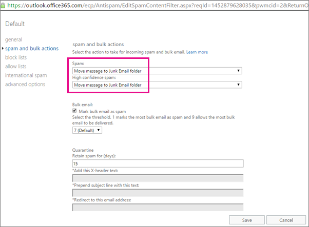

# <a name="zero-hour-auto-purge---protection-against-spam-and-malware"></a>ゼロアワー自動消去 - 迷惑メールやマルウェアからの保護

ゼロの自動パージ (ZAP) は既にユーザーの受信トレイに配信されたメッセージをスパムやマルウェアを検出する電子メールの保護機能で、害のない、悪意のあるコンテンツをレンダリングZAP はこれは、検出された、悪意のあるコンテンツの種類によって異なります。
  
ZAP は、既定の Exchange Online のメールボックスを含むすべての Office 365 サブスクリプションに含まれている Exchange のオンライン保護に使用できます。
  
## <a name="how-does-zap-work"></a>ZAP の動作方法

Office 365 のスパム対策エンジンおよびマルウェアのシグネチャを更新する毎日のようにリアルタイムです。ただし、ユーザーは悪意のあるメッセージをさまざまな理由から、コンテンツがユーザーに最初に配信された後に後でを含む受信トレイに配信をする可能性が残っています。ZAP アドレスを継続的に監視することによってこれを Office 365 のスパムやマルウェアの署名を更新できますしたがって検索し、受信トレイに配信されるメッセージを既に削除します。スパムとして既に認識されているメールでは、ZAP は未読メ ッ セージをユーザーの迷惑メール フォルダーに移動します。新たに検出されたマルウェアが、ZAP はメールかに読み取られたかどうかに関係なく、電子メール メッセージから添付ファイルを削除します。逆では正しく分類されたない、悪意のあるメッセージの場合は true です。
  
ZAP アクションは、メールボックス ユーザー、そのユーザーに通知されていないメールが移動されているために、シームレスです。
  
リスト、[メール フローの規則](https://go.microsoft.com/fwlink/p/?LinkId=722755)、およびエンド ・ ユーザーの規則を許可するか、追加フィルター ZAP よりも優先します。
  
 **この記事の内容**
  
> [スパム フィルター ポリシーを設定します。](zero-hour-auto-purge.md#BK_SetSpam)
    
> [ZAP がメッセージを移動するかどうかを参照してください。](zero-hour-auto-purge.md#BK_DidZAPMove)
    
> [ZAP を無効にします。](zero-hour-auto-purge.md#BK_Posh)
    
> [FAQ](zero-hour-auto-purge.md#BK_FAQ)
    
## <a name="working-with-zap"></a>ZAP での作業

ZAP が既定でオンですが、いくつかの条件が満たされているかどうかを確認する必要は。
  
- [[迷惑メール フォルダーにメッセージを移動](zero-hour-auto-purge.md#BK_SetSpam)するのには、迷惑メール フィルターのポリシーが設定されています。
    
    すべてのメールボックスを ZAP でスクリーニングする必要がある場合に、一連のユーザーにのみ適用する新しい迷惑メール フィルター ポリシーを作成することもできます。
    
- ユーザーの[オプション\>迷惑電子メール](https://support.office.com/article/068FA430-F8D7-4518-A8DA-8BC74958F05F)。
    
[ZAP がメッセージを移動するかどうかを参照してください](zero-hour-auto-purge.md#BK_DidZAPMove)したい場合は、Exchange オンラインのメッセージ トレース ツールを使用できます。
  
管理者ことも[ZAP を無効にする](zero-hour-auto-purge.md#BK_Posh)PowerShell を使用しています。 
  
 **迷惑メール フィルターのポリシーを設定するのには**
  
1. [ビジネス向けの Office 365 にサインインするための場所](https://support.office.com/article/e9eb7d51-5430-4929-91ab-6157c5a050b4)にサインインして、**保護** \> **迷惑メール フィルター**です。 
    
    
  
2. フィルター ポリシーを調整するを選択するか、[**追加**] を選択を新規に作成します。 
    
    前のスクリーン ショットでは、ポリシーは「既定」という名前が、追加のスパム フィルター ポリシーを作成する場合を指定できます、別の名前。限定された一連のユーザーにポリシーを適用することもできます。
    
3. [ポリシー] ウィンドウで、**スパム、および一括操作**を選択し、**迷惑メール**を**迷惑メール フォルダーにメッセージを移動**するに設定されているかどうかを確認します。 
    
    この時点で [**保存**」を選択する場合、Office 365 テナントにポリシーを適用します。 
    
    
  
4. **受信者**、**ドメイン**、または**グループのメンバーシップ**を**適用する**ポリシーのフィルター] ウィンドウで、メニュー コントロールでスクロールを選択して、新しいポリシーを作成する、一連のユーザーにポリシーを適用する場合は、します。ポリシーを適用するとしてください。追加の条件と例外を設定することもできます。 
    
    ![適用先] セクションで、受信者を選択します](media/19ca10db-c0f4-432c-b3de-ad4101a23de6.PNG)
  
    **保存**を選択したユーザーにポリシーを適用するを選択します。 
    
 **ZAP がメッセージを移動するかどうかを参照してください。**
  
- ZAP でメッセージを移動したかどうかを決定する[検索し、ビジネス管理者は、Office 365 との電子メール配信の問題を解決](https://support.office.com/article/e7758b99-1896-41db-bf39-51e2dba21de6)を使用できます。 
    
    ZAP によって移動されたメッセージを識別するのには、トレースの詳細のテキスト"0 時間自動パージ (ZAP)"を検索します。
    
 **ZAP を無効にするには**
  
- 無効にするか、Office 365 のテナントの ZAP[セット HostedContentFilterPolicy](https://go.microsoft.com/fwlink/p/?LinkId=722758)EOP、コマンドレットの**ZapEnabled**パラメーターを使用するユーザーのセットです。
    
    次の例では、ZAP は「テスト」という名前のコンテンツ フィルター ポリシー無効になります。
    
||
|:-----|
|
```
  Set-HostedContentFilterPolicy -Identity Test -ZapEnabled $false
```

|
   
## <a name="faq"></a>FAQ
<a name="BK_FAQ"> </a>

 **正当なメッセージが [迷惑メール] フォルダーに移動するとどうなりますか。**
  
誤の通常のレポート作成プロセスに従う必要があります。[迷惑メール] フォルダーにメッセージを受信トレイから移動が唯一の理由の場合は、サービスが、メッセージが迷惑メールをしたことを確認するためまたは悪意のあります。
  
 **場合、[迷惑メール] フォルダーではなく Office 365 の検査を使用しますか。**
  
ZAP 移動しないメッセージ検疫場所に受信トレイからこの時点で。
  
 **ユーザー設定のメール フロー ルールがある場合 (禁止/許可の規則)。**
  
管理者 (メール フロー ルール) またはブロックし、許可する規則が作成した規則が優先されます。このようなメッセージは、機能の基準から除外されます。
  
## <a name="related-topics"></a>関連項目
<a name="BK_FAQ"> </a>

[Office 365 の電子メールのスパム対策保護](anti-spam-protection.md)
  
[検出漏れの問題を防止するために Office 365 スパム フィルターを使用して迷惑メールをブロックする](block-email-spam-to-prevent-false-negatives.md)
  

